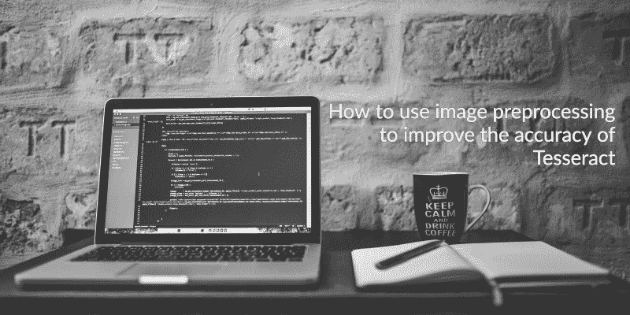

# 如何利用图像预处理提高立方体的精度

> 原文：<https://www.freecodecamp.org/news/getting-started-with-tesseract-part-ii-f7f9a0899b3f/>

伯克·坎·库古奥卢



# 如何利用图像预处理提高立方体的精度

在之前的[如何开始使用宇宙魔方](https://medium.com/@bkaankuguoglu/getting-started-with-tesseract-part-i-2a6a6b1cf75e)中，我给了你一个关于使用 Python 使用宇宙魔方的实用快速入门教程。这是一个非常简单的概述，但它应该可以帮助您开始使用 Tesseract，并清除我在您的位置时所面临的一些障碍。现在，我热衷于向您展示更多的技巧和东西，您可以使用 Tesseract 和 OpenCV 来提高您的整体准确性。

### 我们上次讲到哪里了？

在[之前的故事](https://medium.com/@bkaankuguoglu/getting-started-with-tesseract-part-i-2a6a6b1cf75e)中，大部分时候我都懒得去赘述。但是如果你喜欢第一个故事，续集来了！那么我们在哪里停下来的？

啊，我们对重缩放、去噪和二值化做了一个简单的概述。现在，是时候进入细节并向您展示一些您可以使用的设置了。

### 改比例

被重新缩放的图像或者缩小或者放大。如果你对缩小你的形象感兴趣， **INTER_AREA** 是适合你的选择。(顺便说一下，参数 *fx* 和 *fy* 表示下面函数中的比例因子。)

```
img = cv2.resize(img, None, fx=0.5, fy=0.5, interpolation=cv2.INTER_AREA)
```

另一方面，在大多数情况下，您可能需要将图像放大以识别小字符。在这种情况下， **INTER_CUBIC** 通常比其他替代方法执行得更好，尽管它也比其他方法慢。

```
img = cv2.resize(img, None, fx=2, fy=2, interpolation=cv2.INTER_CUBIC)
```

如果你想牺牲一些图像质量来获得更快的性能，你可以尝试使用 **INTER_LINEAR** 来放大图像。

```
img = cv2.resize(img, None, fx=2, fy=2, interpolation=cv2.INTER_LINEAR)
```

### **模糊**

值得一提的是， [OpenCV 库](https://docs.opencv.org/3.4.0/d4/d13/tutorial_py_filtering.html)中有几个可用的模糊滤镜。图像模糊通常通过将图像与低通滤波器核进行卷积来实现。虽然滤镜通常用于模糊图像或减少噪声，但它们之间还是有一些差异。

#### 1.求平均值

在用归一化的盒状滤波器卷积图像之后，这简单地取核心区域下所有像素的平均值，并替换中心元素。我想这是不言自明的。

```
img = cv.blur(img,(5,5))
```

#### 2.高斯模糊

这与求平均值的方式类似，但它使用高斯核，而不是归一化的箱式滤波器进行卷积。这里，核的维数和两个方向上的标准偏差可以独立确定。高斯模糊对于去除非常有用——你猜怎么着？—图像中的高斯噪声。相反，高斯模糊不会保留输入中的边缘。

```
img = cv2.GaussianBlur(img, (5, 5), 0)
```

#### 3.中间模糊

内核区域中的中心元素被替换为内核下所有像素的中值。特别是，在去除图像中的椒盐噪声方面，这优于其他模糊方法。

中值模糊是一种非线性滤波器。与线性过滤器不同，中值模糊用邻域值中的中值替换像素值。因此，中值模糊保留了边缘，因为中值必须是相邻像素之一的值。

```
img = cv2.medianBlur(img, 3)
```

#### 4.双边过滤

说到保持边缘清晰，双边滤波对于去除噪声而不平滑边缘非常有用。与高斯模糊类似，双边滤波也使用高斯滤波器来寻找邻域中的高斯加权平均值。但是，在模糊附近的像素时，它也考虑了像素差异。

因此，它确保只有那些与中心像素具有相似强度的像素被模糊，而具有不同像素值的像素不被模糊。这样，具有较大强度变化的边缘，即所谓的边缘，被保留下来。

```
img = cv.bilateralFilter(img,9,75,75)
```

总的来说，如果你对保留边缘感兴趣，选择中值模糊或双边滤波。相反，高斯模糊很可能比中值模糊更快。由于计算复杂，双边滤波是所有方法中最慢的。

再说一次，你做你的。

### 图像阈值处理

没有一种图像阈值方法适合所有类型的文档。实际上，所有的滤镜对不同的图像都有不同的表现。例如，虽然一些滤波器成功地将一些图像二值化，但是它们可能无法将其他图像二值化。同样地，有些滤镜可以很好地处理其他滤镜无法很好地二值化的图像。

我将尝试在这里涵盖基础知识，尽管我建议您阅读官方文档 [OpenCV 关于图像阈值处理](https://docs.opencv.org/3.4.0/d7/d4d/tutorial_py_thresholding.html)以获得更多信息及其背后的理论。

#### 1.简单阈值

你可能记得你的一个朋友给你的生活提了一些建议，说“事情并不总是非黑即白的”。嗯，对于一个简单的门槛来说，事情相当简单。

```
cv.threshold(img,127,255,cv.THRESH_BINARY)
```

首先，你选择一个阈值，比如 127。如果像素值大于阈值，它会变成黑色。少的话就变成白色了。OpenCV 为我们提供了不同类型的阈值方法，可以作为第四个参数传递。对于大多数任务，我经常使用二进制阈值，但是对于其他阈值方法，你可以访问官方文档。

#### 2.自适应阈值

我们让算法为图像的小区域计算阈值，而不是设置一个全局阈值。因此，我们最终为图像的不同区域设置了不同的阈值，这太棒了！

```
cv2.adaptiveThreshold(img, 255, cv2.ADAPTIVE_THRESH_GAUSSIAN_C, cv2.THRESH_BINARY, 31, 2)
```

有两种计算阈值的自适应方法。**自适应阈值均值**返回邻域面积的均值，**自适应高斯均值**计算邻域值的加权和。

我们还有两个参数来决定邻域的大小和从结果中减去的常数值:分别是第五个和第六个参数。

#### 3.大津的门槛

这种方法特别适用于双峰图像，即直方图有两个峰值的图像。如果是这种情况，我们可能会热衷于在这些峰值之间选择一个阈值。不过，这就是 Otsu 的二值化实际做的事情。

```
cv2.threshold(img, 0, 255, cv2.THRESH_BINARY + cv2.THRESH_OTSU)[1]
```

这在某些情况下非常有用。但是它可能无法对非双峰图像进行二值化。所以，请大家对这个滤镜半信半疑。

#### 阈值处理的类型

您可能已经注意到有一个参数，或者在某些情况下是几个参数的组合，作为参数传递以确定阈值的类型，比如 THRESH_BINARY。我现在不打算在这里讨论细节，因为在官方文档中已经解释得很清楚了。

### 接下来呢？

到目前为止，我们已经讨论了一些图像预处理技术。你可能想知道你什么时候会弄脏你的手。好吧，时候到了。在你回到你最喜欢的 Python IDE——我的是 [PyCharm](https://www.jetbrains.com/pycharm/) ，顺便说一句——之前，我将向你展示几行代码，这将节省你一些时间，同时试图找到哪种过滤器和图像操作的组合能很好地处理你的文档。

让我们从定义一个开关函数开始，这个函数包含一些阈值过滤器和模糊方法的组合。一旦你有了这个想法，你也可以添加更多的过滤器，将其他图像预处理方法，如重新缩放，整合到你的过滤器集。

在这里，我创建了 20 种不同的图像阈值方法、模糊方法和内核大小的组合。切换器函数 *apply_threshold* 接受两个参数，即 OpenCV image 和一个表示过滤器的整数。同样，由于这个函数返回 OpenCV 图像作为结果，它可以很容易地集成到我们前一篇文章中的 *get_string* 函数中。

```
def apply_threshold(img, argument):    switcher = {        1: cv2.threshold(cv2.GaussianBlur(img, (9, 9), 0), 0, 255, cv2.THRESH_BINARY + cv2.THRESH_OTSU)[1],        2: cv2.threshold(cv2.GaussianBlur(img, (7, 7), 0), 0, 255, cv2.THRESH_BINARY + cv2.THRESH_OTSU)[1],        3: cv2.threshold(cv2.GaussianBlur(img, (5, 5), 0), 0, 255, cv2.THRESH_BINARY + cv2.THRESH_OTSU)[1],
```

```
 ... 
```

```
 18: cv2.adaptiveThreshold(cv2.medianBlur(img, 7), 255, cv2.ADAPTIVE_THRESH_GAUSSIAN_C, cv2.THRESH_BINARY, 31, 2),        19: cv2.adaptiveThreshold(cv2.medianBlur(img, 5), 255, cv2.ADAPTIVE_THRESH_GAUSSIAN_C, cv2.THRESH_BINARY, 31, 2),        20: cv2.adaptiveThreshold(cv2.medianBlur(img, 3), 255, cv2.ADAPTIVE_THRESH_GAUSSIAN_C, cv2.THRESH_BINARY, 31, 2)    }    return switcher.get(argument, "Invalid method")
```

它来了。

```
def get_string(img_path, method):    # Read image using opencv    img = cv2.imread(img_path)    # Extract the file name without the file extension    file_name = os.path.basename(img_path).split('.')[0]    file_name = file_name.split()[0]    # Create a directory for outputs    output_path = os.path.join(output_dir, file_name)    if not os.path.exists(output_path):        os.makedirs(output_path)
```

```
 # Rescale the image, if needed.    img = cv2.resize(img, None, fx=1.5, fy=1.5, interpolation=cv2.INTER_CUBIC)
```

```
 # Convert to gray    img = cv2.cvtColor(img, cv2.COLOR_BGR2GRAY)    # Apply dilation and erosion to remove some noise    kernel = np.ones((1, 1), np.uint8)    img = cv2.dilate(img, kernel, iterations=1)    img = cv2.erode(img, kernel, iterations=1)
```

```
 # Apply threshold to get image with only black and white    img = apply_threshold(img, method)
```

```
 # Save the filtered image in the output directory    save_path = os.path.join(output_path, file_name + "_filter_" + str(method) + ".jpg")    cv2.imwrite(save_path, img)    # Recognize text with tesseract for python    result = pytesseract.image_to_string(img, lang="eng")
```

```
 return result
```

### 临终遗言

现在，我们需要做的就是编写一个简单的 for 循环，遍历输入目录来收集图像，并对收集的图像应用每个过滤器。我更喜欢使用 *glob* 或 *os* 从目录中收集图像，使用 *argparse* 通过终端传递参数，就像任何其他正常人会做的那样。

如果你想看的话，我在这里做了和我的[要点](https://gist.github.com/bkaankuguoglu/111f9f5e0c30b5f57d7c5338d6dcb6fc)差不多的事情。然而，请随意使用您觉得舒服的工具。

到目前为止，我已经尝试介绍了一些有用的图像预处理概念和实现，尽管这可能只是冰山一角。我不知道在接下来的几周里我会有多少“闲暇时间”,所以，我不能给你一个发表下一篇文章的具体时间框架。然而，我正在考虑在这个系列中至少增加一个部分来解释我遗漏的一些东西，比如图像的旋转和去歪斜。

在那之前，最好的办法就是保持头脑清醒，继续寻找迹象。 [*](https://www.youtube.com/watch?v=B_CHjYoqPUU)