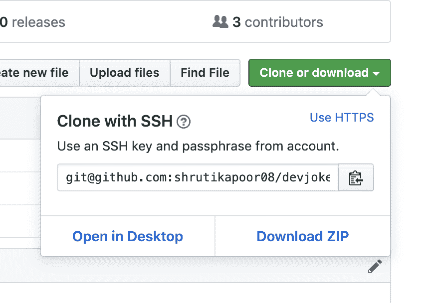
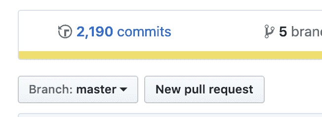

# Git 101:让您开始推送代码的 Git 工作流

> 原文：<https://www.freecodecamp.org/news/git-101-git-workflow-to-get-you-started-pushing-code/>

我将解释 Git，就像我希望有人在我第一次学习的时候向我解释一样。

我将向您展示如何只使用几个命令，以及这些概念背后的概念。

## 基本概念

#### 您的本地代码

这是你在电脑上做的工作。您在计算机中进行的任何编辑、格式化、功能或开发工作都是您的本地代码。

#### 舞台场地

一旦您对所做的更改或工作量感到满意，您就可以将其标记为准备就绪。这意味着您声明这些代码行可以提交了。

#### 服务器

一旦你准备好了你上传的文件，你就可以把它们发送到服务器上，服务器会保存你所有的代码，这样其他人也可以使用。现在，您的文件可以被其他人查看和处理。

### 最终目标

git 背后的想法是，您在远程服务器上的代码应该与您机器上的代码同步。当你和其他人一起工作时，他们的代码应该和你的代码同步。因此，如果您的同事推出了新代码，您应该能够轻松地更新您的代码，以反映他们的变化。

最终目标是服务器上的所有东西都应该和本地机器上的一样。您应该尽快将文件发送到服务器，这样当其他人查看您的代码时，他们就有了最新的版本。

### 工作流程

假设你的电脑上有一个文件夹，里面有你的代码。你想把它放在 GitHub 里，这样你就可以对它进行版本控制。

这是你可以做到的。

### 1.获取存储库。

有两种方法可以获得一个存储库——要么你可以创建自己的存储库，要么你可以使用别人的存储库并为他们的存储库做贡献。你选择哪一个取决于你正在做的项目。如果你是一个人在做一个项目，你更有可能从头开始创建一个存储库并开始写代码。当您处理开源代码或在团队中工作时，您很可能会得到一个已经存在的存储库。让我们来谈谈如何做到这两点—

#### 创建存储库

首先你需要创建一个 GitHub 账户，如果你还没有的话。单击“存储库”选项卡，然后单击“新建”


New button to create new repository

按照说明创建新的存储库。假设我们将这个存储库命名为`test-repo`。一旦你创建了这个 repo，GitHub 会给出如何在你的本地计算机上设置它的说明。

使用指令在命令行上创建新的存储库-


#### 克隆存储库

`git clone <repository>`

假设你想得到我正在做的代码，这样你就可以在你的电脑上完成它。你需要找到我的 github 账户，克隆一个你感兴趣的库。今天我们将致力于这个储存库—

```
git clone git@github.com:shrutikapoor08/devjoke.git
```



### 
2。创建分支

创建一个分支有助于将正在进行的工作与一段工作代码分开。它还可以帮助你模块化你的代码，并在你还在工作的时候保持特性的独立性。让我们通过使用创建一个新的分支`joke-branch`

`git checkout -b joke-branch`

您可以通过以下方式将这个分支推送到服务器(`origin`)

`git push origin joke-branch`

现在我们假设你和我是队友。我们正在一起做一个项目。让我们浏览一下工作流程。

### 3.修改代码

一旦理解了代码的作用，就可以进行编辑了。如果你在别人的仓库上工作，制作一个他们仓库的`fork`是一个好主意。“分叉”是制作存储库的副本。这就像通过一台复印机运行一个存储库，然后得到你自己的副本。你可以对你的拷贝做任何你想做的事情，修改，编辑文件，删除文件或者添加新文件。如果您愿意，您可以将您的更新发送到原始存储库，并要求将您的代码合并到原始存储库中。

我们将通过创建这个存储库的一个分支来修改这段代码。要派生存储库，请单击存储库顶部的 fork 按钮。


现在，如果你转到你的 Github 配置文件，你可以在你的配置文件中看到你新创建的 fork 库。呜哇呜！

现在我们要做一些改变。打开`README.md`文件。对于这个文件，我们将添加一个 DevJoke！想出一个聪明的编程笑话，并将其添加到该文件的顶部。这是给你的一个# DevJoke

> Java 程序员为什么要戴眼镜？
> 。
> 。
> 。
> 。
> 因为他们不会 C#！

### 4.提交代码

现在，让我们保存并提交这个文件。如果您正在提交一个新创建的文件，您必须首先将它添加到您的阶段。你可以这样做—

`git add <filename>`

一旦您的文件被暂存，您就可以提交。请务必在提交后附上一条消息，以帮助您在将来记住该提交是关于什么的。

`git commit -m "Adding DevJoke about C#`

### 5.推送代码

请记住，当您在一个其他人也在工作的存储库上工作时，有可能当您在您的本地版本上工作时，一些人可能已经推送了代码。所以现在服务器“领先你一步”。您现在需要将您的计算机与服务器同步，以确保您拥有最新的代码。为此，你可以从服务器上下载—

`git pull origin <branch-name>`

如果你从未做过分行，不要担心。Git 默认给你`master`分支。你也可以创建一个新的分支，通过—

```
git checkout -b <branch-name>
```

既然您已经提交了代码，并且您的本地机器已经从服务器上更新了，那么您就可以将您的更改公之于众了。要推送到分支`master`，您可以通过— git push origin master 来完成

耶！！！你第一次用力了！给自己一个鼓励。那是困难的部分。现在你准备好全力以赴了。

### 6.发出拉取请求

现在，通过创建一个拉取请求，将您的精彩#DevJoke 发送给我。Pull request 是一个特性，通过它你——开发者，请求我——代码所有者将你的代码合并到库中。创建拉取请求很容易。去 github.com，打开你一直在做的库。

您将看到一个如下所示的“拉取请求”按钮:



点击按钮，按照说明创建一个拉取请求。确保您的更改正确反映在“比较更改”屏幕上。

点击“创建拉动式请求”即可！你完了！您成功地提出了第一个拉取请求！

？？？？？？？？？？？？？？？？？？？？？？？？？？？？？

现在，把那个 DevJoke 发给我吧！

* * *

你学到新东西了吗？有评论？知道一个笑话吗？[发微博给我@shrutikapoor08](https://twitter.com/shrutikapoor08?source=post_page---------------------------)

> 现在是 DevJoke 时间...加拿大版！问:换一个灯泡需要多少个加拿大人？
> 。
> 。
> 。答:没有。我们接受他们本来的样子。[# Canada day 2019](https://twitter.com/hashtag/CanadaDay2019?src=hash&ref_src=twsrc%5Etfw)[# Canada roud](https://twitter.com/hashtag/CanadaProud?src=hash&ref_src=twsrc%5Etfw)[# dev joke](https://twitter.com/hashtag/devjoke?src=hash&ref_src=twsrc%5Etfw)
> 
> — Shruti Kapoor (@shrutikapoor08) [July 2, 2019](https://twitter.com/shrutikapoor08/status/1145925236946161665?ref_src=twsrc%5Etfw)