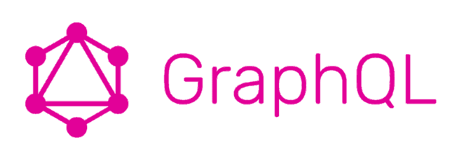

# 休息一下:为您的 API 使用 GraphQL

> 原文：<https://www.freecodecamp.org/news/give-it-a-rest-use-graphql-for-your-apis-40a2761e6336/>

大卫·塞利斯

# 休息一下:为您的 API 使用 GraphQL

在 API 架构的世界中，REST 已经统治了十多年。您可能每天在手机、电脑或其他设备上多次使用基于 REST API 的软件。也许你已经开发过 REST API 或者自己写了一个！尽管 REST 很受欢迎，但是它也有一些明显的缺陷。

### 什么是休息？

在 REST APIs 中，服务器定义了一组客户机可以请求的特定资源，这些资源由惟一的 URL 定义。例如，在通用微博平台的 API 中，URL `/users/1` 可以表示系统中的第一个用户，`/users/1/posts`可以返回用户所写的所有帖子的集合，`/users/1/posts/327`可以返回单个帖子。REST 有许多细微差别和一个记录良好的行为规范，但是基于 URL 的资源涵盖了基本思想。最重要的是，*服务器*定义了客户端可以请求的数据结构。

### 休息怎么了？

假设你是一名移动应用程序开发人员，为上述通用 Microblogginator 公司工作。您的任务是为用户的个人资料编写移动视图，该视图需要显示用户的信息并列出他们的帖子。这并不太难；只需点击`/users/{id}`端点即可获得前者，点击`/users/{id}/posts`即可获得后者。

你发布了移动视图，然后等待被所有的客户反馈和应用评论✨dazzled✨。下周，一旦所有的评论都涌入，你就有了一个新的需求。Other Microblogger 在其个人资料视图中显示了每篇帖子的几条评论。为什么我们不也这样做呢？幸运的是，您的 API 已经有了一个端点来获取博客文章的评论:`/users/{id}/posts/{id}/comments`。您将视图更改为显示在用户个人资料页面上的每篇文章的终点，这样就完成了。

但是现在你的应用程序很慢，这导致了 REST APIs 的一个主要问题:

### 太多 HTTP 请求

让我们面对现实:客户端应用程序很少保持简单。通常，每个客户都有一组相当具体的需求，反映出他们需要从您的系统中获得什么数据。如果你只提供一种绝对的方法来请求数据，你会让客户试图把一个菱形的钉塞进一个菱形的洞。

在我们之前的例子中，用户每写一篇文章，我们的移动应用程序就会变得越来越慢。如果一个用户的个人资料中列出了 20 篇文章，我们将发出 *22 个 API 请求*。一个用于用户信息，一个用于他们的帖子列表，然后二十个请求来获取每个帖子的评论。

随着你在手机应用的界面上添加更多组件，这个问题会变得更加严重。每个新的 UI 组件都会带来新的 API 调用或对现有 API 端点的新定制。您可以将对象嵌套在彼此内部以避免额外的 API 调用，但是随着视图变得更加复杂，您将不可避免地开始嵌套不相关的数据。您将最终得到不描述单个资源的端点，而是多个资源的视图。现在你的 API 看起来不再那么 RESTful 了。

更糟糕的是，只要存在旧版本的客户端，您就需要支持任何旧的端点，以免冒破坏这些客户端的风险。这导致了 REST 的另一个主要问题:

### “版本化”REST APIs 是一件痛苦的事情

来自 REST APIs 的响应结构很重要。客户基于每个资源都有特定结构的知识来构建自己。当 Generic Microblogginator 第一次发布他们的 API 时，获得一个帖子的反应是这样的:

过了一段时间后，你决定对 API 中的帖子结构进行一些改进。文章即将获得类别，因此您需要将它们添加为一个新字段。您还收到反馈称`published_at`的格式不太友好。JavaScript 客户端可以很好地解析它，但是您更希望任何工具都能够轻松地解析您的时间戳，所以您决定将其更改为 ISO-8601 格式。当该说的都说了，该做的都做了，您希望新结构看起来像这样:

看起来不错！不幸的是，您的一个更改将会破坏您现有的所有客户端。每个客户都希望`published_at`是不太友好的格式，所以他们会试图解析它。如果你想更新一个字段或删除一个字段，你必须对你的 API 进行版本化(无论是通过 URL 还是 HTTP 头),并尝试让客户端进行升级。您不可能让每个客户端都升级，所以您有两个选择:

1.  不要介意打破旧版本的客户端(包括你自己的应用)
2.  支持旧版本的 API，直到有一天你的公司决定[宣布他们不可思议的旅程](https://ourincrediblejourney.tumblr.com)的新篇章。

最简单的方法就是不去管你的旧代码，这意味着在旧代码上堆积越来越多的 API 版本。

### 一个挑战者靠近了

进入 GraphQL，一种由脸书编写的技术。脸书在移动应用的数据管道方面面临着重大问题。他们的移动应用曾经是网页浏览的包装器，随着移动应用复杂性的增加，他们开始遭遇性能问题和频繁的崩溃。脸书转向编写本地应用程序，并发现他们需要一个新的 API 来为他们的本地视图检索数据。他们评估了 REST 和其他选择，但是，考虑到上面描述的问题，最终他们抓住机会创造了真正的新事物。

#### GraphQL 是什么？

顾名思义，GraphQL 是一种查询语言。对于 API 来说也很完美。它允许您使用成熟的类型系统来定义数据，形成一个自文档化的模式。它还让客户能够完全控制他们请求的数据。

#### HTTP 请求太多？一个 HTTP 请求怎么样？

有了 GraphQL，客户机只需一个请求就可以获得呈现视图所需的所有数据。在我们之前的配置文件页面示例中，客户端需要发出一个请求来获取用户的信息，一个请求来获取用户的帖子，然后针对每个帖子发出另一个请求来获取一些评论。使用 GraphQL，客户机可以通过一个请求获得上述所有数据:

嘣！？除了我们从 22 个 HTTP 请求减少到一个之外，还有其他好处。例如，您的用户可能附加了其他信息。也许你公开了用户注册时的时间戳。也许另一个客户并不关心帖子的类别。如果客户机不需要查询一段数据，n *你的服务器也不需要。*因此，当客户保存数据时，您也可以通过简化自己的数据库查询来保存数据。

#### 版本控制？不赞成就好！

与(大多数)REST APIs 一样，您可以放心地向 GraphQL 类型添加字段。为了移除功能，GraphQL 将弃用作为一个特性。您可以将某个字段声明为不推荐使用，并在它过期时隐藏它，而不是完全删除该字段并中断客户端。

#### 文档:你几乎不需要担心它

让我说实话:我一只手就能数清我使用一个记录良好的 API 的次数。很多时候，API 仍然没有文档或者文档很差。使用 GraphQL，您的模式实际上是自文档化的。你所要做的就是在必要的时候给出你的类型和字段描述，这发生在代码本身。客户机可以发出特殊的 GraphQL 查询来检查应用程序的模式，并在一个查询中知道它们可以请求的所有数据、它的名称和描述。开发人员也可以使用基于这种自省的工具，如 [GraphiQL](https://github.com/graphql/graphiql) ，它允许客户使用实时语法高亮和错误检测来测试他们的查询。

### GraphQL 入门

你是否被说服试用 GraphQL？有大量资源可以帮助您开始您的旅程:

*   查看 GraphQL 的官方网站获取文档和示例
*   举个例子，星球大战 GraphQL API
*   工作中的 GraphQL 规范(如果你对细节感兴趣的话)

我还会在这篇文章之后再写一篇文章，我们将一起创建一个小的 GraphQL API，敬请关注！我在 GitHub 与 GraphQL 一起工作时获得了巨大的乐趣，我的经历让我全心全意地相信它是未来的 API 工具。