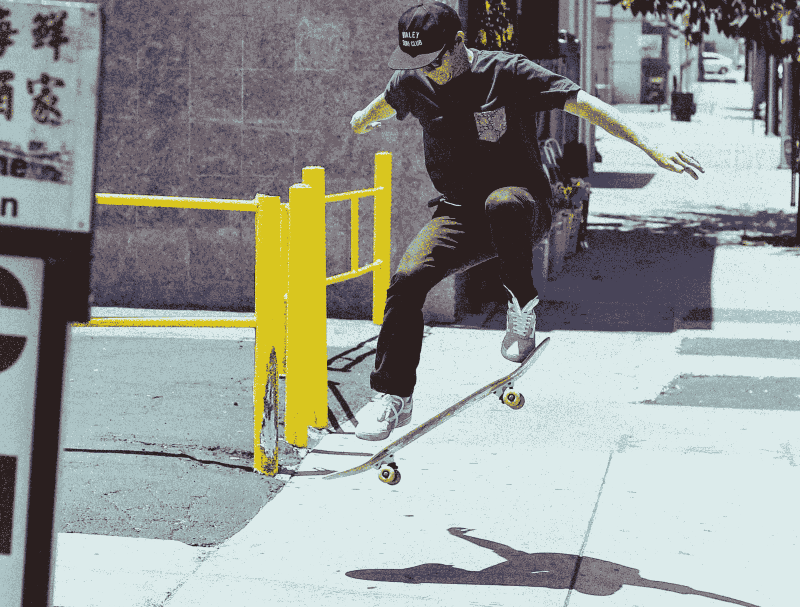

# 学习滑板如何帮助我找到一条走出教程地狱的路

> 原文：<https://www.freecodecamp.org/news/how-learning-to-skateboard-helped-me-find-a-way-out-of-tutorial-hell/>

我已经创建网站很多年了。90 年代末，我在高中时开始制作我的第一个网站。

在过去的六年里，我也在课堂上教授 HTML & CSS 入门课程(以及其他课程)。大约 3 年前，我也开始了我的 YouTube 频道，主要关注 CSS。

换句话说，我做网站已经有一段时间了，但我也有很多帮助人们学习如何做网站的经验。

一年多前，我 34 岁的儿子过生日时，我们给了他一个滑板，我觉得和他一起学习会很有趣。

这很有趣，但也改变了我学习新事物的方式，以及我教人们如何制作网站的方式。

## 逃离教程地狱

你听说过教程地狱吗？许多试图学习成为前端开发人员的人发现自己陷入了教程地狱。

在这个地方你会觉得自己明白了很多事情。你看一个教程，可以跟着做，你*明白*他们在做什么。

这种理解让你觉得你也知道如何去做。直到你以后尝试使用它。

问题是，人们看了很多教程，仅此而已。

### 没那么简单

问题是，理解如何做某事并不等同于能够自己做。

我看过很多关于如何做奥利的滑板视频。我甚至可以极其详细地描述给你做的所有步骤。

Someone doing an ollie

我还是花了令人尴尬的时间才真正做到，而且我还是很不擅长。

我*明白*做一个的步骤。我不能正确地实现那些步骤。

我可以听到你现在说“但是做奥利不等于写一些代码！”当然，一个比另一个更实际一些，但是他们比你想象的更有联系。

## 回到最基本的

学习创建网站的一个问题是很容易超越自己。

你知道如何制作一个`<h1>`，所以你认为你知道如何标记一个网站。

您知道`display: flex`会创建列，所以您开始觉得自己得到了 flexbox。

你看着人们做更复杂的事情，这一切都很有意义。但就像我知道奥利的步骤，但离地一英寸以上就做不到一样，仅仅因为你理解了那个教程的步骤并不意味着你已经准备好自己做了。

你需要回到基础和实践。

还有练习。

还有练习。

这就是滑板比学编码强的地方。当你学习编码时，你*认为*你知道自己在做什么，但这只是一种错误的知识感。在玩滑板的时候，当你尝试一些你不知道的事情时，你最终会有一些瘀伤和一个很好的想法，你需要继续尝试。

### 练习基础

有人告诉我，学习滑板的第一步是推。

A guy pushing on his skateboard

你知道，用一只脚站在板上，用另一只脚推，这样你就可以移动了。这是基本的，所以你需要从这里开始。

问题是，即使你能在几分钟内开始用力，也不意味着你非常擅长用力。

你需要练习，练习，练习。

你建立你的平衡，发展你对冲浪板的感觉。我的意思是，如果我没有很好地发展我在板上的平衡，我怎么能让我的板跳到空中，然后降落在上面呢？

所以你需要学习推动的步骤。然后你开始练习。你练习得越多，你在冲浪板上保持平衡的感觉就越舒服，这就开始向更多的事情敞开大门。

## 页面布局的奥利

试图做一个奥利而不舒服地骑在板上，就像有人试图创建一个布局，但不理解盒子模型。

CSS 的奥利大概就是 flexbox 之类的东西。从长远来看，这是一项非常重要的技能，但不像盒子模型、层叠和继承那样是一项基础技能。

是的，你可以马上学习 flex 并得到一些有用的东西，但是要做出改变会困难得多。当出现问题时(它最终会出现)，您将不知道为什么或如何修复它。

### 学习推，代码版

当你学着站在滑板上，然后推的时候，在滑板上保持平衡会感觉不舒服。你做得越多，你就越能发展你的平衡，也就越容易。

一些语言在这方面比其他语言有更大的问题。CSS 可能在给人错误的知识感方面是最糟糕的。CSS 的问题是很容易听到有人谈论级联是如何工作的，并认为你知道它。

你在后*会遇到问题，因为你实际上并没有理解它，尽管你当时认为你理解了。*

然后，后来，你有点卡住了，所以你读了一个教程，并使用它来帮助你蒙混过关，通过使用 flexbox 制作导航条。太好了！但是你并不真正了解它是如何工作的，也不知道如何对它进行修改。

你卡住了，或者更糟，它不像在教程中那样工作，你不知道为什么。

或者更糟的是，你认为你已经掌握了，但是没有教程，你就自己去做了，然后呆呆地看着屏幕，不知道从哪里开始。

学习 JavaScript 或任何其他语言时也是如此。在 JavaScript 中，你学习一个简单的循环是如何工作的，然后你继续前进，尝试创建一个需要它的函数，然后它开始向你抛出错误。

当你遵循那个教程时，你学习了*循环是如何工作的*，也许你甚至做了一个，但是你在继续之前没有巩固这些知识。

## 如何练好基本功

所以当你决定学习一些新的东西，或者你遇到一些你以前没有听说过的东西，你需要把它钉下来。

这并不意味着快速阅读一篇关于它的文章，然后说“我明白了！”。意思是跟着教程走。不是看教程，而是跟着教程**自己写代码**。

假设你正在学习如何用一个无序列表制作一个导航菜单。去看一段视频，然后跟着做。

那就再去做一次。**完全一样的东西**，不过这次什么都不看。看你能不能想起来怎么做。

现在制作它，但是图标在导航链接的中间，而不是图标在左边，链接在右边。

现在从头再做一次。你还记得怎么做吗？

现在做一个垂直导航，贴在网站的边上。

你明白了。这是人们跳过的部分，但它是如此重要！我们需要练习，练习，再练习。这并不令人兴奋，但这是你学习 T1 的方式。

通过这样做，你不仅将学会如何进行一次特定的导航，还将学会如何进行所有可能的变化。你将会学到更多关于 flexbox 如何工作的知识，这种技能将会应用到你正在做的其他事情上！

## 两次让它成真

当我们编码时，我们不觉得有必要这样做，因为我们有工作要做，我们觉得我们可以继续前进。但是想象一下，如果我玩滑板，或者任何体力劳动。

做一次事情并不意味着“你成功了！”这意味着你曾经在一个非常特殊的情况下成功过。

在滑板运动中，你会听到“两次让它成真”，意思是只有当你连续两次成功后，你才能真正说你成功了一个新技巧。

当你学习新的东西时也是一样。首先，你按照指导去做，然后在没有任何帮助的情况下*去做。*

在没有帮助的情况下尝试做某事时忘记了某事？你不能只是回到那个教程，并得到丢失的关键。跟着教程走，然后*不用教程再做一遍*。

## 有一个框架来正确地学习一些东西

开始学习如何玩滑板让我记住了关于学习的两件事:

1.  即使是小而简单的事情也有很多步骤
2.  你需要大量练习

那些有很多步骤的小而简单的事情通常依赖于人们在学习时忽略的基础知识。

其中一些基本的东西很简单，其他的并不会真的碍事。因此，即使您不理解块格式上下文，您仍然可以做一些事情并让它们工作。

但是如果从一开始你就能学会你想学的语言的基本技能(比如当你学滑板的时候用力)，那么接下来的事情就会变得简单多了。

所以我观察了我在课堂上是如何教学的，以及我是如何看到学生学习和成功(以及失败)的。我也从我学习滑板时如何分解任务中得到了一些建议。然后我把它变成了**一个帮助人们更好更快学习前端开发的框架**。

如果你想得到这个框架，[点击这个链接](http://front-end-mastery.kevinpowell.co/)。你将会得到一本深入探讨其细节的电子书，以及一份以可视化方式概述所有步骤的 PDF 流程图，所有这些都是免费的？。

这听起来可能很简单(事实上也的确如此)，但是每当你学习新东西的时候，沿着一条特定的道路走下去，这将有助于你更加连贯地学习。

一开始，所有的重复似乎都有些过分，但是一旦你进入了最佳状态，这将有助于加快速度，因为它能确保你理解基础技能，而这一切都是建立在基础技能之上的。