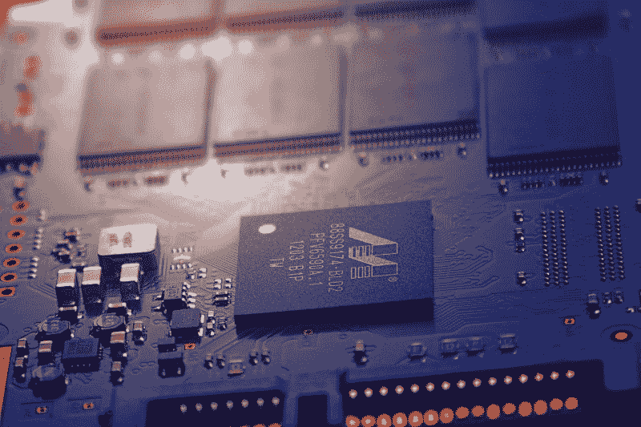

# 非整数值如何存储在浮点型中(以及它为什么会浮点型)

> 原文：<https://www.freecodecamp.org/news/how-non-integer-values-are-stored-in-a-float-and-why-it-floats-902effacbfb9/>

舒坎特·帕尔

# 非整数值如何存储在浮点型中(以及它为什么会浮点型)

你想过计算机是如何处理浮点数的吗？我的意思是——小数点在哪里？如果你在面试中被问到？



Photo by [Johannes Plenio](https://unsplash.com/@jplenio?utm_source=medium&utm_medium=referral) on [Unsplash](https://unsplash.com?utm_source=medium&utm_medium=referral)

IEEE 754 浮点标准定义了如何在固定大小的类型中编码非整数值，如 C++浮点和 JavaScript 数字。它给了我们五种不同的格式——但不用担心，它们都基于相同的概念。在本文的其余部分，我称它为 IEEE 754。

如果您在阅读 IEEE 754 中使用的所有不同技巧时不知所措，不要担心，我在最后已经给出了足够多的例子，让您头脑中的一切都安定下来。

## 概念

正如整数可以用任何“基数”来写一样，非整数值也可以用任何基数来写。

5.1 = 1(2²) + 0(2¹) + 1(2⁰) + 1/2¹ = 1011.1

同理，我们可以写成 3.25 = 11.01，8.75 = 1000.11。“基数”点(不再是小数点)之后的值乘以 2 的负幂。

IEEE 754 就是基于这种技术。要转换 IEEE 754 格式的任何值，我们必须遵循以下步骤:

1.  用二进制形式写出数字，并带有小数点。
2.  用科学记数法对其进行格式化，以便在基数点之前只放置一位数字。
3.  按照所选的 IEEE 格式对不同的组件进行编码。

例如，让我们取值 934893.109375:

1.  934893.109375 可以用二进制形式精确地表示为 1110010000111110101.000111(稍后将详细介绍这一点)。
2.  科学形式:1.1100100001111101101000111 x 2^-19

注意:有些十进制数值不能用基数 2 精确表示，就像三分之一不能用基数 10 精确表示一样。然而，你可以将 1/3 近似为. 3333333333。类似地，该值可能是以 2 为基数的近似值(而不是精确值)。例如，1.9 近似于二进制的 1.11100110011001100110011(请注意重复的 0011，这是因为 1.9 是有理数，精确值将通过无限重复它来表示)。

## 格式

IEEE 754 定义了写入 16/32/64 或更多位值的三个部分:符号位、指数和尾数。

这些组件按以下顺序编写:

*   ****符号位**** (s):符号位的值为 0 表示正值，1 表示负值。
*   ****指数**** (e) ****:**** 这等于我们在科学形式上得到的指数。
*   ****尾数**** (m) ****:**** 尾数，或者说 **有效数** ，是以科学形式书写的系数，只是没有小数点。所以 3.25=11.01 的尾数就是 1101 或者 13。

从 IEEE 754 取回我们的值:**v = s**x**(m^e)**

每种格式的宽度是固定的，尾数和指数的宽度也是固定的。尾数的 **宽度定义了精度，而指数的宽度定义了值的范围。**

现在，IEEE 754 还使用一些技巧来对实际数字进行编码，我在下面的不同标题中列出了这些技巧:

*   指数偏差
*   前导位约定
*   低于正常值的数字
*   无限和 NaN
*   零(以及 ECMAScript 中的示例)

## 指数偏差

指数 **e** 可以是负数，为了支持负数，IEEE 754 定义了 **偏差** 。偏差被加到指数上以获得实际的编码指数。例如，二进制 32 格式向指数提供 8 位，其中指数字段中的偏差是 2⁷-1=127。所以-1 将被编码为-1+127=128，而+5 的指数将被编码为 5+127=132。

选择偏差，使得最小的指数将被编码为 1，而最高的指数将被编码为 2⁸ - 2 = 254(二进制 32)。这就解释了为什么 **emin** 是-126 而 **emax** 是+127。

注意:你可能已经注意到值 0 和 2⁸ - 1 被忽略了。如果指数编码为零，则表示的数字要么是∞要么是 NaN。如果指数的位都是 1(即 2⁸ - 1 = 255)，那么所表示的数是一个特殊的次正规数(后面会详细介绍)。

## 前导位约定

用科学记数法书写的任何数字的最左边的数字永远不会是零(除非数字本身正好是 0)。如果你发现自己在左边被 0 卡住了，你必须减少你的指数。举个例子，

0.12 x 10² = 1.2 x 10¹

因为我们的基数是 2，并且前导数字不能是零:这意味着前导数字必须是-1 并且只能是 1。IEEE 754 利用了这一事实，并且从编码尾数中排除了前导比特。

## 低于正常值的数字

IEEE 754 定义了两种类型的数:正常数和次正常数。事实上，正常数字是正常的——它们可以用 **m** x 2^e 格式表示，其中 e 是**Emin**≤**e*≤**emax**。然而，如果 **e** 下降到 **emin** 以下，那么 IEEE 754 称它们为次正常。*

因为编码的 **e** 不能低于 0，所以次正规数的实际指数总是-127。以下指数可以通过打破前导位惯例并在尾数左侧添加 0 来表示。这会导致尾数精度的损失(因为前导零会导致最右边的位丢失)。

// emin = -126，尾数宽度= 24 位// 1。正常数，v = 2^-126encoded: m = 0000000000000000000000，e = 1
实际:m = 100000000000000000，e = -126V = 2^-126// 2。次正规数，v = 2^-127encoded: m = 1000000000000000000000，e = 0 (e 必须为 0)
实际:m = 10000000000000000，e =-127 前导位约定在次正规数中不起作用，其中 e = 0。这意味着编码尾数是实际尾数。功率 e(实际)总是-127。尾数的前导位可以是 0。请参见下面的示例。// 3.次正常数，v = 2^-129encoded: m = 001000000000000000000，e = 0(次正常)
实际:m = 0010000000000000000，e =-127v = 0.01000000000000000 x 2^-127 = 0.25 * 2^-127 = 2^-129

```
// emin = -126, width of mantissa = 24 bits

// 1\. NORMAL Number, V = 2^-126

Encoded:  m = 00000000000000000000000, e = 1
Actual:  m = 100000000000000000000000, e = -126

V = 2^-126

// 2\. SUBNORMAL Number, V = 2^-127

Encoded:  m = 10000000000000000000000, e = 0 (e must be 0)
Actual:   m = 10000000000000000000000, e = -127

The leading bit convention doesn't work in subnormal numbers, where e = 0\. This means that the encoded mantissa is the actual mantissa. The power e (actual) is always -127.

The mantissa's leading bit could be 0\. See the example below.

// 3\. SUBNORMAL Number, V = 2^-129

Encoded:  m = 00100000000000000000000, e = 0 (subnormal)
Actual:  m =  00100000000000000000000, e = -127

V = 0.0100000000000000000000 x 2^-127 = 0.25 * 2^-127 = 2^-129
```

## 无限和 NaN

指数有两个特殊值:0 和 2⁸-1(其中 8 实际上是二进制 32 中指数的宽度)。前一个是针对非正常数字，后一个是针对“特殊”值。当指数的所有位都是 1 时，2⁸-1 也是值。

*   如果尾数的值是 0，则表示的数字是正无穷大或负无穷大。符号由符号位决定。
*   尾数的值不为零，那么所代表的数字，事实上，不是一个数字或南。有两种类型的 nan——发信号型和安静型。类型由尾数的值决定，本文不讨论这个问题。发信号的 NaN 用于终止任何数值运算，而安静的 NaN 允许运算继续进行。根据我的经验，你永远不需要区分这些人。他们可能对你没用。

## 零案例

令人惊讶的是，IEEE 754 中有两个零——正的和负的。对你我来说，他们是一样的。如果用-0 代替，任何用+0 的运算都会得到相同的结果，或者是真的吗？不，不是的。

1/∞ = 0，还有 1/-∞ = 0，那么 1/(1/∞) = 1/0 = ∞，1/(1/-∞) = ∞。如果我们在上面的等式中只使用一个正的零，符号就不会保留。这可以通过使用 0 来解决。1/-∞ = -0，则 1/(1/-∞)=-∞。

同样，如果只使用 0:那么 4/∞=0 和-4/∞=0。然而，使用 0 导致:4/∞=+0 和-4/∞=-0。

然而，IEEE 754 要求任何 b/w +0 和-0 的比较都返回肯定的结果。换句话说，+0 == -0 为真。

大多数语言会对你隐藏+0 和-0，你无法直接区分(如果你除以 0 并测试结果是否为∞，你就可以)。然而，JavaScript 是特殊的，它提供了区分 b/w +0 和-0 的`Object.is(arg1, arg2)`方法。

```
Object.is(+0, -0);// false
```

## 例子

我保证我会用我的例子来消除你头脑中的所有困惑。

```
// All examples use binary32 here
// 1\. Encode 127872.12781278 in IEEE 754

Step 1: Write in binary notation

127872.12781278 = 11111001110000000.0010000 (24-bits)

Step 2: Write in scientific notation

1.11110011100000000010000 x 2^16

Step 3: Encode

m(encoded) = 11110011100000000010000 (23-bits only)
e(encoded) = 16+127 = 143 = 10001111

(sign)(e)(m) = 0 10001111 11110011100000000010000(32-bits)

// 2\. Encode (-1.25 x 2^-130) in IEEE 754

Step 1: Write in binary notation (excluding sign here)

1.25x2^-130 = 1.01 x 2^-130 (shift by 130 right to remove scale)

Step 2: Already done!!!
Step 3: Encode

As e < emin, this is a subnormal number
e = -127
V = 1.01 x 2^-130 = 0.00101 x 2^-127
m = 0.0010100000000000000000 (23-bits only, no leading bit conv.)
sign = 1

(sign)(e)(m) = 1 00000000 00010100000000000000000 (32-bits)
```

## 最后，它浮吗？

题目答应回答这个问题。它不得不。

“浮点”这个名字来源于这样一个事实，即基点可以放在一个数的任何地方。浮点类型可以用最多给定的位数对任何数字进行编码(尾数限制了精度)，无论基点放在哪里(除了精度可能会有一点损失的事实)。

这与定点类型相反，在定点类型中，表示将可表示的数字固定在基点的左侧和右侧。

C++类型的浮点也来自浮点系统。

## 附加信息:十进制浮点类型

(注意:十进制浮点类型没有被广泛使用。由于货币价值的精确性的重要性，它们在商业中更为重要。)

2008 年，IEEE 754 增加了两种格式:decimal32 和 decimal64。在十进制格式中，尾数按 10 的幂而不是 2 进行缩放。这保留了我们输入的十进制有效数字，最重要的是，对于可以用十进制精确表示的数字，不会失去精度。

但是尾数是以 2 为基数编码的(指数也是以 2 为基数编码的，只是实际值是由**v**=**m**x**10^e**计算出来的)。因为尾数是以 2 为基数的，所以不能用科学记数法来写:

```
102 = 1.02 x 10^2 = 1.000001010001111010111000 x 10^2
202 = 2.02 x 10^2 = 10.00000101000111101011100 x 10^2
```

例如，202 在基数点之前有两位数字(“10”)，而 101 在基数点之前只有一位数字(“1”)。没有 10 的整数次方可以用来表示二进制科学形式的 202(小数点前只有一位)。

注意:这个副作用是因为尾数和比例因子(10)不是同一个基数。

为了克服这个限制，IEEE 754 对尾数是整数的数字进行编码。

```
1234.31212 = 123431212 x 10^-5 = 111010110110110100100101100 x 10^-5

// The mantissa will be 111010110110110100100101100
// The exponent will be -5.
```

十进制格式定义了两种编码整数尾数的方式:二进制整数(如上例所示)和密集十进制(DPD)。十进制格式也有特殊的技巧，这超出了本文的范围。我将在另一个故事中讲述它们。

Shukant Pal 的进一步阅读:

*   [HTML 画布的完整概述](https://medium.com/@sukantk3.4/full-overview-of-the-html-canvas-6354216fba8d)
*   去除 JavaScript 中的循环依赖(我的提议)
*   [如何在多台设备上同步您的游戏应用](https://medium.freecodecamp.org/how-to-synchronize-your-game-app-across-multiple-devices-88794d4c95a9) (Android)
*   [如何使用 Firebase 构建 Android 游戏](https://medium.freecodecamp.org/match-making-with-firebase-hashnode-de9161e2b6a7)

我是舒坎特·帕尔——西尔科斯内核的创造者。我对低级 C++代码了解很多，对 Linux 内核的内部代码结构了解一点。我喜欢硬件层面的细节。关注我的社交媒体资料。