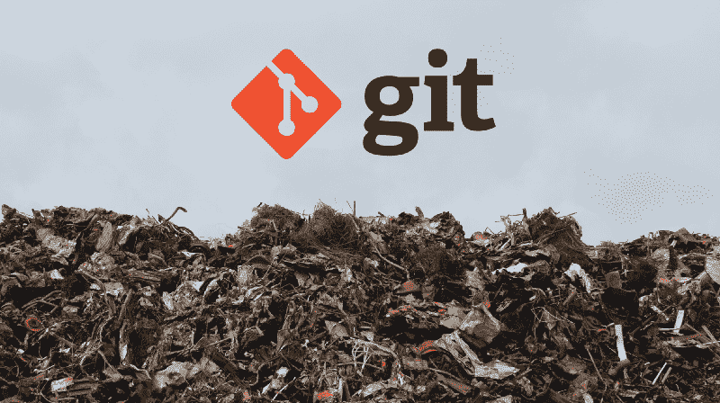

# 如何避免犯垃圾

> 原文：<https://www.freecodecamp.org/news/how-to-avoid-committing-junk-dae1277c1433/>

作者:约尔·泽尔德斯

# 如何避免犯垃圾



在开发过程中，每个开发人员都编写一些他们不打算提交的东西，并推送到远程服务器，比如调试打印。我们每个人都会时不时地遇到这种情况:我们忘记在承诺之前移除这些临时的东西…

我用一个简单的方法解决了这个有点尴尬的情况:在我不想意外提交的每一行中，我添加了神奇的字符序列`xxx`。这个序列可以在一行的任何部分:在注释中，作为变量名，作为函数名，你命名它。一些用法示例:

*   调试打印:`print 'xxx reached this line'`。
*   用于调试的变量:`xxx_counter = 0`。
*   临时功能:`def xxx_print_debug_info():`。
*   提交前必须处理的 TODO:`#TODO: don't forget to refactor this function xxx`。

我用 Git 钩子实现了它。钩子是 Git 的一种机制，当某些重要的动作发生时，它会触发定制脚本。我使用预提交钩子来验证提交的内容。

只需创建一个名为`<YOUR-REPO-FOLDER>/.git/hooks/pre-` commit 的文件，内容如下:

```
#!/bin/sh
```

```
marks=xxx,aaamarksRegex=`echo "($marks)" | sed -r 's/,/|/g'`marksMessage=`echo "$marks" | sed -r 's/,/ or /g'`if git diff --staged | egrep -q "^\+.*$marksRegex"; then    echo "you forgot to remove a line containing $marksMessage!"    echo "you can forcefully commit using \"commit -n\""    exit 1fi
```

1.  `marks`包含不允许提交的字符序列。
2.  `git diff --staged`显示将要提交的更改。这些更改被传递给一个正则表达式，该表达式搜索任何被禁止的标记(使用`egrep`)。
3.  如果发现禁止标记，脚本将退出并显示错误代码，导致提交失败。

你想绕过钩子吗？执行`commit -n`。当您想要提交二进制文件(如图像)时，这可能会很有用，因为该文件可能包含禁止标记。

你在日常 git 工作流程中实现过什么技巧吗？请在评论中分享你的魔法:)

*这个帖子最初是我在[www.anotherdatum.com](http://www.anotherdatum.com)发布的。*