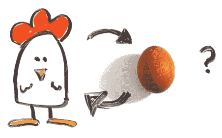

# 所以你想当产品经理？我就是这样开始的。

> 原文：<https://www.freecodecamp.org/news/how-to-break-into-product-management-d354944308c0/>

作者梅勒妮·雷

# 所以你想当产品经理？我就是这样开始的。

我最常被问到的一个问题是，“如果你以前没有做过产品经理，你如何获得产品经理的职位？”

The chicken and the egg problem

前阵子，我也有同样的疑问。这是典型的先有鸡还是先有蛋的问题——除非你已经是俱乐部的成员，否则你不能加入俱乐部。

作为一家 Edtech 初创公司的客户经理，我对开发这个产品非常感兴趣。我希望在公司内部转到产品岗位。我觉得我对内容创作者和学习者需求的深刻理解给了我优势。但我被告知，“对不起，我们只是真的需要有产品管理经验的人。”

在过去的几年里，经过大量的工作和研究，我能够成功地过渡到产品管理。周期性地，我会收到随机的询问或者熟人介绍，他们都有完全相同的问题:“如果我想成为一名产品经理，但我从来没有做过，我该怎么做？”

这是我更有效、更广泛地分享我自己的旅程的机会。我不能保证使用这个公式后会有任何结果——我只是在大量的试验和错误后才知道，这就是我如何做到的。祝你一路顺风！

#### **第 0 步:开发产品(或至少尽可能接近产品)**

等等，什么？我想找一份从产品开始的工作，这难道不是重点吗？

是的，但是事情是这样的。如果你不尝一点做鸡的滋味，你就无法真正打破先有鸡还是先有蛋的循环。如果你的头衔有所不同，你可能会觉得你并没有真正做“产品”的事情，但有各种各样的事情都是合格的:

*   收集来自用户的反馈，根据业务影响和消费者影响对其进行优先排序，并与能够做出改变的相关决策者共享信息
*   为一个功能提出一个新的想法，并详细说明它将做的所有事情，然后确定它是否可以被构建
*   分析来自您网站/应用程序的数据，以确定常见的用户路径或某些业务事件是否有重大影响
*   管理特定产品或服务的收入或盈亏线，并做出增加收入的更改
*   自始至终领导一个项目，让不同团队的人聚在一起做一些事情

在我有正式的产品经理头衔之前，我收集了围绕产品的经验。作为一名客户经理，我的成功很大程度上来自于对我们产品复杂性的深刻理解，以及积极倡导我的合作伙伴需要的新功能。作为一个月收入超过 10 万美元的垂直行业的领导者，我优先考虑营销、写作和产品资源，以帮助我的业务增长。

#### **第一步:读取**

以下是我在准备工作面试和考虑是否真的想转行时读到的内容:

*   [破解 PM 面试](https://www.amazon.com/Cracking-PM-Interview-Product-Technology/dp/0984782818)——非常基本，但能很好地理解可能的常见问题和练习。如果你没有做过案例访谈，这是一个很好的练习。
*   [Stratechery](https://stratechery.com/) -每日时事通讯，涵盖对技术的深入分析，包括分解公司的战略行动、合并、为什么某些产品失败而其他产品没有，等等。事实上，直到我开始目前的工作，我才开始阅读这本书，但如果你想加强对科技领域的宏观战略思考，每月 10 美元的订阅费是完全值得的。
*   Ken Norton 带来了甜甜圈简讯 -关于如何做好产品经理工作的建议。还包括招聘信息和推荐书籍。
*   Julie Zhuo 的博客和时事通讯 -她在脸书担任产品设计副总裁期间的真实个人故事和经验教训。她非常擅长解决作为产品负责人的个人困惑(处理不安全感、打入行业、处理冲突、回应拒绝)。

#### **第二步:提问**

我让我的朋友帮我介绍他们认识的任何一个产品经理，甚至是熟人的熟人。然后，我将我遇到的产品经理的联系信息按优先顺序分为以下几类:

1.  我对在他们公司工作一点也不感兴趣
2.  我很想在他们公司工作

我与第一组的产品经理进行了 5 - 10 次通话，询问我所有的项目经理职业问题:

*   当你面试 PMs 时，你会寻找什么？
*   这是我的真实经历，你认为我应该突出哪些部分？
*   你是如何走到今天的？

因为我实际上并没有和他们一起面试，所以我很乐意公开分享我的弱点，并寻求坦诚的建议——这些事情在实际的面试中并不总是能做到。

通过这些电话，我能够形成自己对“理想”项目经理的理解:善于分析、精通技术、以消费者为导向、批判性思考、有战略眼光、能够与许多不同类型的人一起工作并激励他们。

我思考了自己的优势和劣势。我不擅长更深层次的定量数据分析和编程知识，但更擅长与许多不同类型的人合作，并为企业的利益进行优先排序。

我将我的 PM 搜索调整为发挥我优势的角色，并拥有强大的支持网络来弥补我的弱点(例如，帮助我提高定量分析技能的数据科学家和分析师，可以帮助我指导和优先考虑开发工作的强大技术首席工程师)。

#### **第三步:准备你自己的故事，把你自己展现出来**

在所有的信息电话之后，我能够提出一个更理想的理由，说明为什么一家公司应该聘用我为项目经理，尽管我的简历上没有正式的头衔。我专注于我做过的所有类似 PM 的活动:

*   与项目经理和工程师合作开发新功能
*   评估用户需求，平衡复杂的利益相关者群体
*   分析数据以做出商业决策

考虑到过渡到产品管理是多么困难，项目经理的头衔就像一个只有超人才能闯入的秘密社会。但我接到的所有信息电话都非常有助于揭开这个角色的神秘面纱，并给了我勇气，让我相信我拥有做这份工作所需的技能。

为了给自己信心和评估自己的市场价值，我在 Hired.com 上发布了自己的个人资料，在这个市场上，雇主会主动向你提供薪资报价。我很清楚自己在市场上的地位，以及我能要求的薪水范围。更新我的 LinkedIn 个人资料并将其设置为“对新机会开放”也有助于一些内部招聘请求。

#### **第四步:有可能转变为真实面试的信息面试**

回到第二组——我很乐意为之工作的公司的项目经理(和其他人)。直到我觉得自己已经做了足够的研究，并精心构思了自己的经历，才有人把我介绍给这些联系人。

当我与他们交谈时，我抱着这是一次真正面试的心态，并花了大部分信息性问题来具体询问公司的情况，财务状况如何，以及未来的战略计划。几乎在每一个案例中，这个人都让我去找他们的人力资源主管，开始最初的电话筛选过程。

#### 第五步:面试，面试，面试

一旦我通过了人力资源部的电话屏幕，真正的工作就开始了。一般流程是:与公司工作人员的非正式电话聊天->人力资源电话筛选->招聘经理电话筛选->带回家练习->现场，通常包括我的工作演示、情景练习或两者兼而有之。

如何通过 PM 面试是一个很有内涵的话题，我可能会在以后的帖子中讨论:)

正如我之前提到的，这是我个人经历的特例，我不认为成为一个项目经理有一个通用的方法。我遇到和共事过的项目经理来自各种各样的背景，从诗歌专业(我)，到以前的程序员，到毕业后直接进入产品领域的人。

我希望这个简短的概述对那些希望过渡到产品管理的人有所帮助，我祝你好运！

*期待在评论中听到自己的经历和建议。*