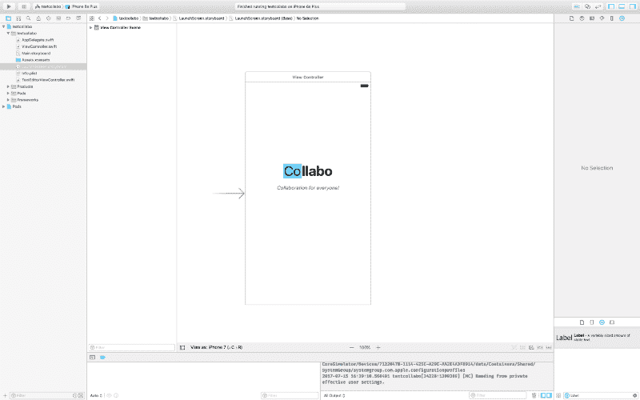
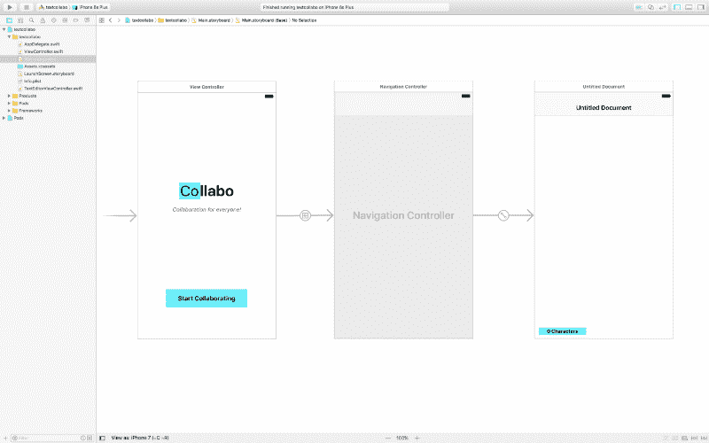
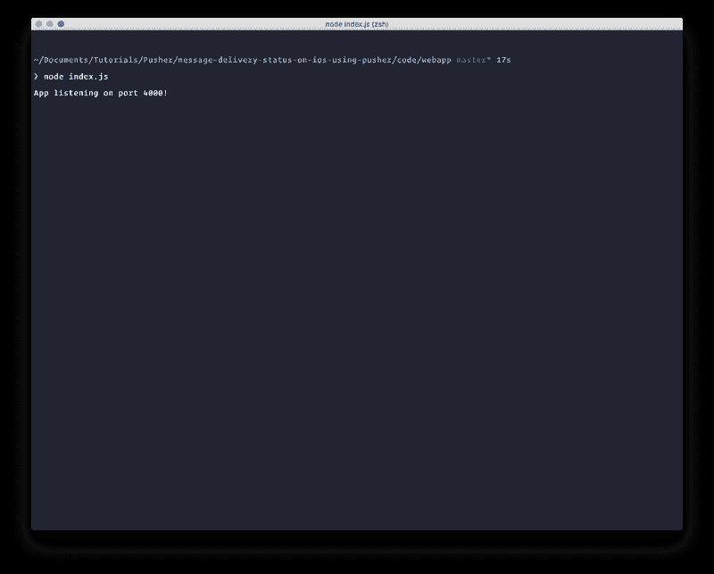
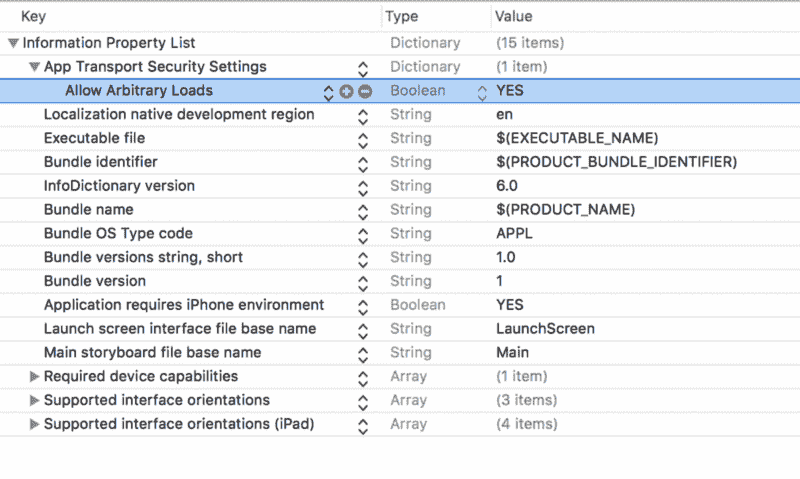

# 如何使用 Swift 构建协作文本编辑器

> 原文：<https://www.freecodecamp.org/news/how-to-build-a-collaborative-text-editor-using-swift-df7402c82510/>

作者:尼奥·伊戈达罗

# 如何使用 Swift 构建协作文本编辑器


Photo by [rawpixel](https://unsplash.com/photos/h7EIo10-yrQ?utm_source=unsplash&utm_medium=referral&utm_content=creditCopyText) on [Unsplash](https://unsplash.com/search/photos/collaboration?utm_source=unsplash&utm_medium=referral&utm_content=creditCopyText)

文本编辑器如今越来越受欢迎，无论是嵌入网站评论表单还是用作记事本。有许多不同的编辑器可供选择。在这篇文章中，我们不仅要学习如何在 iOS 中构建一个漂亮的文本编辑器移动应用程序，还要学习如何使用 Pusher 实时协作处理笔记。

但是，请注意，为了保持应用程序的简单性，本文将不讨论并发编辑。因此，只有一个人可以在其他人观看的同时进行编辑。

该应用程序将通过在输入一些文本时触发一个事件来工作。该事件将被发送到 Pusher，然后由协作者的设备接收并自动更新。

要完成本教程，您需要以下内容:

1.  **Cocoapods:** 要安装，在你的机器上运行`gem install cocoapods`
2.  **Xcode**
3.  一个**推手申请:**你可以在这里创建一个免费的账户和申请
4.  一些关于 Swift 语言的知识
5.  **Node.js**

最后，学习本教程需要对 Swift 和 Node.js 有一个基本的了解。

### Xcode 中的 iOS 应用程序入门

启动 Xcode 并创建一个新项目。我会把我的叫做**科拉博**。按照设置向导完成后，打开工作区，关闭 Xcode，然后在项目的根目录下运行命令`pod init`。这将为您生成一个`Podfile`。改变`Podfile`的内容:

```
# Uncomment the next line to define a global platform for your project    platform :ios, '9.0'
```

```
 target 'textcollabo' do      # Comment the next line if you're not using Swift and don't want to use dynamic frameworks      use_frameworks!
```

```
 # Pods for anonchat      pod 'Alamofire'      pod 'PusherSwift'    end
```

现在运行命令`pod install`,这样 Cocoapods 包管理器就可以获取必要的依赖项。完成后，关闭 Xcode(如果打开的话),然后打开项目文件夹根目录下的`.xcworkspace`文件。

### 为我们的 iOS 应用程序设计视图

我们将为我们的 iOS 应用程序创建一些视图。这些将是我们将所有逻辑钩入的主干。使用 Xcode 故事板，让你的观点看起来有点像下面的截图。

这是 **LaunchScreen.storyboard** 文件。我刚刚设计了一些简单的没有任何功能的东西。



我们要设计的下一个故事板是**main . story board**顾名思义，它将是主故事板。这就是我们拥有所有重要观点的地方，这些观点都与某种逻辑相联系。



这里我们有三视图。

第一个视图的设计与启动屏幕一模一样，只是我们链接了一个按钮来打开第二个视图。

第二个视图是导航控制器。它附属于第三视图，即`ViewController`。我们已经将第三个视图设置为导航控制器的根控制器。

在第三个视图中，我们有一个放置在视图中的可编辑的`UITextView`。还有一个标签应该是字符计数器。当用户在文本视图中输入文本时，我们将在这里增加字符。

### 编写 iOS 协作文本编辑器应用程序

既然我们已经成功地创建了应用程序加载所需的视图，接下来我们要做的就是开始为应用程序编写逻辑代码。

创建一个新的 cocoa 类文件，将其命名为`TextEditorViewController`，并将其链接到`Main.storyboard`文件中的第三个视图。`TextViewController`也应该采用`UITextViewDelegate`。现在，您可以将`Main.storyboard`文件中的`UITextView`和`ctrl+drag`到`TextEditorViewController`类中。

此外，您应该将`PusherSwift`和`AlamoFire`库导入到`TextViewController`中。完成后，您应该有类似的东西:

```
import UIKit    import PusherSwift    import Alamofire
```

```
 class TextEditorViewController: UIViewController, UITextViewDelegate {        @IBOutlet weak var textView: UITextView!        @IBOutlet weak var charactersLabel: UILabel!    }
```

现在我们需要在控制器中添加一些稍后会用到的属性。

```
import UIKit    import PusherSwift    import Alamofire
```

```
 class TextEditorViewController: UIViewController, UITextViewDelegate {        static let API_ENDPOINT = "http://localhost:4000";
```

```
 @IBOutlet weak var textView: UITextView!
```

```
 @IBOutlet weak var charactersLabel: UILabel!
```

```
 var pusher : Pusher!
```

```
 var chillPill = true
```

```
 var placeHolderText = "Start typing..."
```

```
 var randomUuid : String = ""    }
```

现在我们将把逻辑分成三个部分:

1.  视图和键盘事件
2.  UITextViewDelegate 方法
3.  处理推动器事件。

#### **视图和键盘事件**

打开`TextEditorViewController`并用以下方法更新它:

```
override func viewDidLoad() {        super.viewDidLoad()        // Notification trigger        NotificationCenter.default.addObserver(self, selector: #selector(keyboardWillShow), name: NSNotification.Name.UIKeyboardWillShow, object: nil)        NotificationCenter.default.addObserver(self, selector: #selector(keyboardWillHide), name: NSNotification.Name.UIKeyboardWillHide, object: nil)        // Gesture recognizer        view.addGestureRecognizer(UITapGestureRecognizer(target: self, action: #selector(tappedAwayFunction(_:))))        // Set the controller as the textView delegate        textView.delegate = self        // Set the device ID        randomUuid = UIDevice.current.identifierForVendor!.uuidString        // Listen for changes from Pusher        listenForChanges()    }    override func viewWillAppear(_ animated: Bool) {        super.viewWillAppear(animated)        if self.textView.text == "" {            self.textView.text = placeHolderText            self.textView.textColor = UIColor.lightGray        }    }    func keyboardWillShow(notification: NSNotification) {        if let keyboardSize = (notification.userInfo?[UIKeyboardFrameBeginUserInfoKey] as? NSValue)?.cgRectValue {            if self.charactersLabel.frame.origin.y == 1.0 {                self.charactersLabel.frame.origin.y -= keyboardSize.height            }        }    }    func keyboardWillHide(notification: NSNotification) {        if let keyboardSize = (notification.userInfo?[UIKeyboardFrameBeginUserInfoKey] as? NSValue)?.cgRectValue {            if self.view.frame.origin.y != 1.0 {                self.charactersLabel.frame.origin.y += keyboardSize.height            }        }    }
```

在`viewDidLoad`方法中，我们注册了键盘函数，以便它们能够响应键盘事件。我们还添加了手势识别器，当你在`UITextView`之外点击时，它会关闭键盘。我们将`textView`委托给控制器本身。最后，我们调用了一个函数来监听新的更新(我们将在后面创建它)。

在`viewWillAppear`方法中，我们简单地将`UITextView`修改成一个占位符文本，因为默认情况下，`UITextView`没有这个特性。想知道为什么，苹果…

在`keyboardWillShow`和`keyboardWillHide`函数中，我们分别让字符计数标签随着键盘上升和下降。这将防止键盘在标签处于活动状态时覆盖标签。

#### **UITextViewDelegate 方法**

用以下内容更新`TextEditorViewController`:

```
func textViewDidChange(_ textView: UITextView) {        charactersLabel.text = String(format: "%i Characters", textView.text.characters.count)
```

```
 if textView.text.characters.count >= 2 {            sendToPusher(text: textView.text)        }    }
```

```
 func textViewShouldBeginEditing(_ textView: UITextView) -> Bool {        self.textView.textColor = UIColor.black
```

```
 if self.textView.text == placeHolderText {            self.textView.text = ""        }
```

```
 return true    }
```

```
 func textViewDidEndEditing(_ textView: UITextView) {        if textView.text == "" {            self.textView.text = placeHolderText            self.textView.textColor = UIColor.lightGray        }    }
```

```
 func tappedAwayFunction(_ sender: UITapGestureRecognizer) {        textView.resignFirstResponder()    }
```

`textViewDidChange`方法简单地更新字符计数标签，并使用我们的后端 API(我们将在一分钟内创建)将更改发送给 Pusher。

`textViewShouldBeginEditing`从`UITextViewDelegate`中获取，当文本视图将要被编辑时触发。在这里，我们基本上是在玩占位符，和`textViewDidEndEditing`方法一样。

最后，在`tappedAwayFunction`中，我们为在上一节中注册的手势定义了事件回调。在该方法中，我们基本上忽略了键盘。

#### **处理推动器事件**

用以下方法更新控制器:

```
func sendToPusher(text: String) {        let params: Parameters = ["text": text, "from": randomUuid]
```

```
 Alamofire.request(TextEditorViewController.API_ENDPOINT + "/update_text", method: .post, parameters: params).validate().responseJSON { response in            switch response.result {
```

```
 case .success:                print("Succeeded")            case .failure(let error):                print(error)            }        }    }
```

```
 func listenForChanges() {        pusher = Pusher(key: "PUSHER_KEY", options: PusherClientOptions(            host: .cluster("PUSHER_CLUSTER")        ))
```

```
 let channel = pusher.subscribe("collabo")        let _ = channel.bind(eventName: "text_update", callback: { (data: Any?) -> Void in
```

```
 if let data = data as? [String: AnyObject] {                let fromDeviceId = data["deviceId"] as! String
```

```
 if fromDeviceId != self.randomUuid {                    let text = data["text"] as! String                    self.textView.text = text                    self.charactersLabel.text = String(format: "%i Characters", text.characters.count)                }            }        })
```

```
 pusher.connect()    }
```

在`sendToPusher`方法中，我们使用`AlamoFire`将有效载荷发送到我们的后端应用程序，该应用程序将依次将其发送到 Pusher。

在`listenForChanges`方法中，我们监听文本的变化，如果有变化，我们将变化应用到文本视图。

> *？R **记住用您从 Pusher 仪表板上获得的实际值替换密钥和集群。***

如果你已经仔细阅读了教程，那么你的`TextEditorViewController`应该是这样的:

```
import UIKit    import PusherSwift    import Alamofire
```

```
 class TextEditorViewController: UIViewController, UITextViewDelegate {        static let API_ENDPOINT = "http://localhost:4000";
```

```
 @IBOutlet weak var textView: UITextView!
```

```
 @IBOutlet weak var charactersLabel: UILabel!
```

```
 var pusher : Pusher!
```

```
 var chillPill = true
```

```
 var placeHolderText = "Start typing..."
```

```
 var randomUuid : String = ""
```

```
 override func viewDidLoad() {            super.viewDidLoad()
```

```
 // Notification trigger            NotificationCenter.default.addObserver(self, selector: #selector(keyboardWillShow), name: NSNotification.Name.UIKeyboardWillShow, object: nil)            NotificationCenter.default.addObserver(self, selector: #selector(keyboardWillHide), name: NSNotification.Name.UIKeyboardWillHide, object: nil)
```

```
 // Gesture recognizer            view.addGestureRecognizer(UITapGestureRecognizer(target: self, action: #selector(tappedAwayFunction(_:))))
```

```
 // Set the controller as the textView delegate            textView.delegate = self
```

```
 // Set the device ID            randomUuid = UIDevice.current.identifierForVendor!.uuidString
```

```
 // Listen for changes from Pusher            listenForChanges()        }
```

```
 override func viewWillAppear(_ animated: Bool) {            super.viewWillAppear(animated)
```

```
 if self.textView.text == "" {                self.textView.text = placeHolderText                self.textView.textColor = UIColor.lightGray            }        }
```

```
 func keyboardWillShow(notification: NSNotification) {            if let keyboardSize = (notification.userInfo?[UIKeyboardFrameBeginUserInfoKey] as? NSValue)?.cgRectValue {                if self.charactersLabel.frame.origin.y == 1.0 {                    self.charactersLabel.frame.origin.y -= keyboardSize.height                }            }        }
```

```
 func keyboardWillHide(notification: NSNotification) {            if let keyboardSize = (notification.userInfo?[UIKeyboardFrameBeginUserInfoKey] as? NSValue)?.cgRectValue {                if self.view.frame.origin.y != 1.0 {                    self.charactersLabel.frame.origin.y += keyboardSize.height                }            }        }
```

```
 func textViewDidChange(_ textView: UITextView) {            charactersLabel.text = String(format: "%i Characters", textView.text.characters.count)
```

```
 if textView.text.characters.count >= 2 {                sendToPusher(text: textView.text)            }        }
```

```
 func textViewShouldBeginEditing(_ textView: UITextView) -> Bool {            self.textView.textColor = UIColor.black
```

```
 if self.textView.text == placeHolderText {                self.textView.text = ""            }
```

```
 return true        }
```

```
 func textViewDidEndEditing(_ textView: UITextView) {            if textView.text == "" {                self.textView.text = placeHolderText                self.textView.textColor = UIColor.lightGray            }        }
```

```
 func tappedAwayFunction(_ sender: UITapGestureRecognizer) {            textView.resignFirstResponder()        }
```

```
 func sendToPusher(text: String) {            let params: Parameters = ["text": text, "from": randomUuid]
```

```
 Alamofire.request(TextEditorViewController.API_ENDPOINT + "/update_text", method: .post, parameters: params).validate().responseJSON { response in                switch response.result {
```

```
 case .success:                    print("Succeeded")                case .failure(let error):                    print(error)                }            }        }
```

```
 func listenForChanges() {            pusher = Pusher(key: "PUSHER_KEY", options: PusherClientOptions(                host: .cluster("PUSHER_CLUSTER")            ))
```

```
 let channel = pusher.subscribe("collabo")            let _ = channel.bind(eventName: "text_update", callback: { (data: Any?) -> Void in
```

```
 if let data = data as? [String: AnyObject] {                    let fromDeviceId = data["deviceId"] as! String
```

```
 if fromDeviceId != self.randomUuid {                        let text = data["text"] as! String                        self.textView.text = text                        self.charactersLabel.text = String(format: "%i Characters", text.characters.count)                    }                }            })
```

```
 pusher.connect()        }    }
```

太好了！现在我们需要制作应用程序的后端。

### 构建后端节点应用程序

现在我们已经完成了 Swift 部分，我们可以专注于为应用程序创建 Node.js 后端了。我们将使用 Express，这样我们可以快速地让一些东西运行起来。

为 web 应用程序创建一个目录，然后创建一些新文件。

**index.js** 文件:

```
let path = require('path');    let Pusher = require('pusher');    let express = require('express');    let bodyParser = require('body-parser');    let app = express();    let pusher = new Pusher(require('./config.js'));
```

```
 app.use(bodyParser.json());    app.use(bodyParser.urlencoded({ extended: false }));
```

```
 app.post('/update_text', function(req, res){      var payload = {text: req.body.text, deviceId: req.body.from}      pusher.trigger('collabo', 'text_update', payload)      res.json({success: 200})    });
```

```
 app.use(function(req, res, next) {        var err = new Error('Not Found');        err.status = 404;        next(err);    });
```

```
 module.exports = app;
```

```
 app.listen(4000, function(){      console.log('App listening on port 4000!');    });
```

在上面的 JS 文件中，我们使用 Express 创建了一个简单的应用程序。在`/update_text`路线中，我们只是接收有效载荷并将其传递给 Pusher。没什么复杂的。

还创建一个 **package.json** 文件:

```
{      "main": "index.js",      "dependencies": {        "body-parser": "^1.17.2",        "express": "^4.15.3",        "path": "^0.12.7",        "pusher": "^1.5.1"      }    }
```

**package.json** 文件是我们定义所有 NPM 依赖项的地方。

要创建的最后一个文件是一个 **config.js** 文件。我们将在这里为我们的 Pusher 应用程序定义配置值:

```
module.exports = {      appId: 'PUSHER_ID',      key: 'PUSHER_KEY',      secret: 'PUSHER_SECRET',      cluster: 'PUSHER_CLUSTER',      encrypted: true    };
```

> *？R **记住用您从 Pusher 仪表板上获得的实际值替换密钥和集群。***

现在在目录上运行`npm install`，然后在 npm 安装完成后运行`node index.js`。你应该看到一个*应用程序在 4000 端口监听！*消息。



### 测试应用程序

一旦您的本地节点 web 服务器开始运行，您将需要进行一些更改，以便您的应用程序可以与本地 web 服务器通信。在`info.plist`文件中，进行以下更改:



通过这一更改，您可以构建并运行您的应用程序，它将直接与您的本地 web 应用程序对话。

### 结论

在本文中，我们介绍了如何使用 Pusher 在 iOS 上构建一个实时协作文本编辑器。希望您已经从本教程中学到了一些东西。实际上，您可以扩展状态以支持更多实例。

这个帖子最早发布给[推手](https://pusher.com/tutorials/collaborative-text-editor-swift/)。