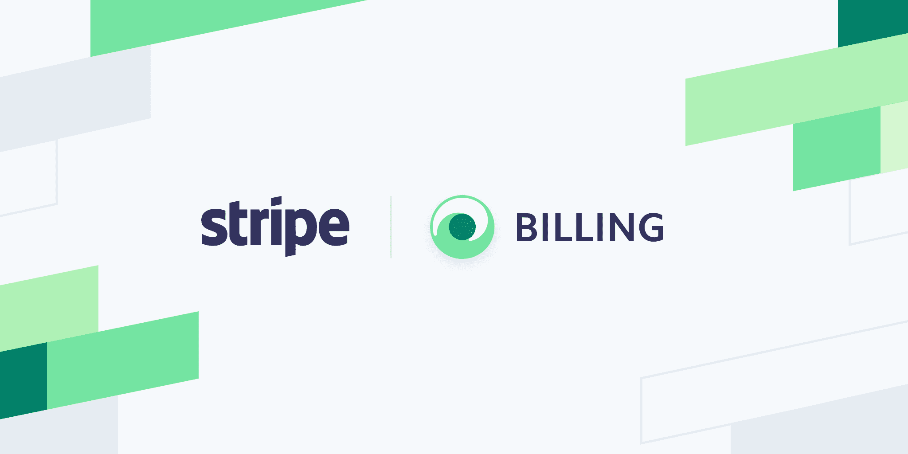

# 如何使用 NodeJS 和 React 为您的 SaaS 构建条带计费入职流程

> 原文：<https://www.freecodecamp.org/news/how-to-build-a-stripe-billing-onboarding-flow-for-your-saas-using-nodejs-and-react/>

# 你会学到什么？

在本文中，我们将介绍使用 NodeJS 和 React 将条带计费与入职流程集成所需的步骤。在指南中，我们将:

*   使用我们将在本例中使用的定价策略配置条带帐户
*   在 ExpressJS 中设置路线，这将向前端公开定价策略
*   设置一个处理入职流程的 React 前端，利用[条带元素](https://stripe.com/payments/elements)进行检查

在本文中，我们假设您已经掌握了 Node 和 ExpressJS 的工作知识，以及创建 React 应用程序所需的步骤。有关如何学习这些的一些好资源，请查看:

*   [FreeCodeCamp 上的 express js](https://guide.freecodecamp.org/nodejs/express/)
*   [对 FreeCodeCamp 做出反应](https://learn.freecodecamp.org/front-end-libraries/react/)

# 用条纹定义您的产品和计划



第一步是在您的 Stripe 帐户中创建一些产品和计划。如果您尚未注册 Stripe，您可以在此注册。

在本例中，我们将创建一个两层定价策略，每月 50 美元的基本层和每月 300 美元的额外费用层被定义为条带中的独立产品。


The Products we create with plans attached

如果您希望为您的特定 Stripe 帐户自动执行此操作，请随意将此 RunKit 中的密钥编辑为您的 Stripe 测试密钥。

### 该代码将创建条带中的产品和计划

```
const STRIPE_TEST_SECRET_KEY = "sk_test_6pewDqcB8xcSPKbV1NJxsew800veCmG5zJ"//your Stripe key here
const stripe = require('stripe')(STRIPE_TEST_SECRET_KEY);

const basicPlan = await stripe.plans.create({
    amount: 5000, 
    interval: "month", 
    product: {
        name : "AcmeBot Basic"
    },
    currency: "USD"
})
const premiumPlan = await stripe.plans.create({
    amount: 30000, 
    interval: "month", 
    product: {
        name : "AcmeBot Premium"
    },
    currency: "USD"
})
console.log(`Stripe Plans that were Created:`);
console.log(`AcmeBot Basic, Plan ID: ${basicPlan.id}, Amount: ${basicPlan.amount/100}/${basicPlan.interval}, Product ID: ${basicPlan.product}`)
console.log(`AcmeBot Premium, Plan ID: ${premiumPlan.id}, Amount: ${premiumPlan.amount/100}/${premiumPlan.interval}, Product ID: ${premiumPlan.product}`)

```

# 为获取计划创建一个 REST 端点


在您配置好条带之后，我们可以在 Express 中定义一个新的 REST 端点，React 可以使用它来使用动态条带数据呈现 onboarding 流。

为了呈现定价页面，前端将需要知道您的 Stripe 帐户中的计划，因此我们的代码将使用`stripe`模块对 Stripe 进行 API 调用。下面是一个实现这一功能的 ExpressJS 中间件的例子。

### 用于获取所有条带计划的 ExpressJS 中间件

```
const STRIPE_TEST_SECRET_KEY = "rk_test_3U9s3aPLquPOczvc4FVRQKdo00AhMZlMIE"; //your Stripe key here
const stripe = require('stripe')(STRIPE_TEST_SECRET_KEY);

//express middleware
async function getAllPlans(req, res, next){

    //get all plans, expand keyword will also return the contents of the product this plan is attached to
    const plans = await stripe.plans.list({expand: ["data.product"]});
    res.json(plans);
}

//see it in action
const req = {}; // req not used
const res = {
    json : function(payload){
        console.log("All Stripe Plans:")
        for(let plan of payload.data){
            console.log(`Plan ${plan.id}, Name: ${plan.product.name}, Amount: ${plan.amount/100}/${plan.interval}`)
        }
        console.log("payload:", payload);
}
};
const next = function(){};
await getAllPlans(req, res, next)

```

完成这一步后，我们可以在 React 中做我们的前端，以便显示定价页面和结账流程

# 创建一个组件来显示定价


为了创建一个定价页面，我们需要定义一个组件来呈现从上面定义的 REST API 中获取的计划数据。

该组件看起来会像这样。它将遍历所有计划并呈现相关信息，如价格、名称和间隔。当用户按“开始”时，它还会显示一个结帐页面(我们将在下一步中定义)。

```
function Pricing({pricingPlans, onPlanSelect}){
  return <div>{pricingPlans.data.map(({id, interval, amount, product: {name}})=>{
      return <div>
        <h1>{name}</h1>
        <h4>${amount/100}/{interval}</h4>
        <button onClick={onPlanSelect(id)}>Get Started</button>
      </div>
    })}</div>
}
```

您可以在下面的代码栏中看到这段代码。注意，对于这个 CodePen，我们不进行 API 调用，只静态定义有效负载。在您自己的实现中，您应该直接从 API 中提取有效负载。

[https://codepen.io/bsears/embed/preview/jOOEaap?height=300&slug-hash=jOOEaap&default-tabs=js,result&host=https://codepen.io](https://codepen.io/bsears/embed/preview/jOOEaap?height=300&slug-hash=jOOEaap&default-tabs=js,result&host=https://codepen.io)

Full checkout flow

# 创建结账流程

最后一步，我们将使用 [Stripe 元素](https://stripe.com/payments/elements)创建一个结账流程，并将其绑定到我们刚刚设置的定价页面。

在前面的例子中，我们创建了一个回调函数，当有人选择一个计划时，这个函数就会被触发。我们现在需要将它与 Stripe 绑定，这样当他们选择一个计划时，他们会得到一个结帐页面的提示。我们使用 [React Stripe 元素](https://github.com/stripe/react-stripe-elements)来实现，它是 Stripe 元素库的 React 包装器。

您可以在下面的操作中看到这一点:

[https://codepen.io/bsears/embed/preview/BaayXME?height=300&slug-hash=BaayXME&default-tabs=js,result&host=https://codepen.io](https://codepen.io/bsears/embed/preview/BaayXME?height=300&slug-hash=BaayXME&default-tabs=js,result&host=https://codepen.io)

现在我们有了一个基本的结账流程，我们需要[处理表单生成的令牌](https://stripe.com/docs/sources/cards)并[为新客户创建一个订阅](https://stripe.com/docs/api/subscriptions/create)，给我们一个新的订阅。或者，您可以不使用 Stripe 元素，而是使用自动创建订阅的 [Stripe Checkout](https://stripe.com/payments/checkout) (但是没有那么灵活)。

这就结束了使用 Stripe、React 和 Node 创建结账流的教程

## 接下来是什么？

感谢阅读！这将使你开始使用计费，但是在这篇文章中，我们仅仅触及了用 Stripe 构建计费系统的冰山一角。更高级的主题，如优惠券、高级定价策略和不同的定价区间(例如每月/每年)，需要更多的开发来支持。

如果您正在寻找外观精美且移动友好的定价页面、结帐表单等，而不必自己构建，请查看 [Servicebot](https://servicebot.io) -一个构建在 Stripe 之上的嵌入式 UI 工具包，您只需粘贴一段代码，就可以获得由 Stripe 支持的全功能前端。

[](https://servicebot.io)