# 如何使用 reactjs 和 firebase 构建待办事项应用程序

> 原文：<https://www.freecodecamp.org/news/how-to-build-a-todo-application-using-reactjs-and-firebase/>

大家好，欢迎来到本教程。在我们开始之前，您应该熟悉基本的反应堆概念。如果你不是，我建议你浏览一下 [ReactJS 文档](https://reactjs.org/docs/getting-started.html)。

我们将在该应用程序中使用以下组件:

1.  [**ReactJS**](https://reactjs.org/)
2.  [**素材 UI**](https://material-ui.com/)
3.  [](https://firebase.google.com/)
4.  **[**ExpressJS**](https://expressjs.com/)**
5.  **[**邮递员**](https://www.postman.com/)**

## **我们的应用程序将会是什么样子:**

**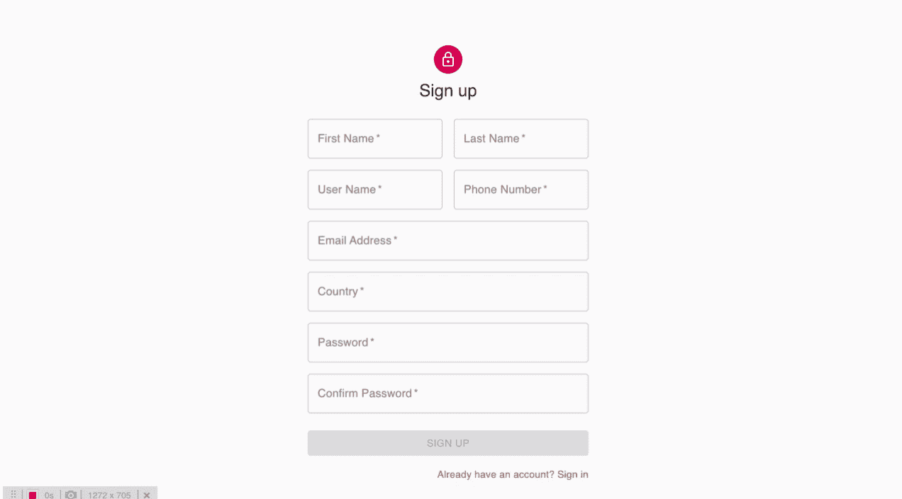

Account creation** **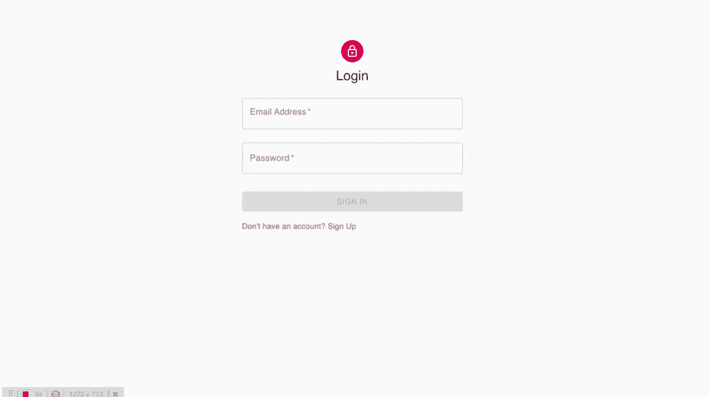

TodoApp Dashboard** 

* * *

## **应用架构:**

**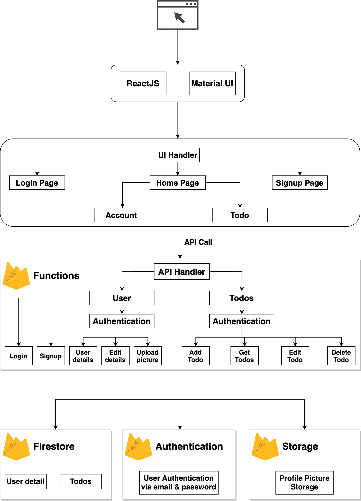

Application Architecture** 

## **了解我们的组件:**

**您可能想知道为什么我们在这个应用程序中使用 firebase。嗯，它提供了安全的**认证**，一个**实时数据库**，一个**无服务器组件**和一个**存储桶**。**

**我们在这里使用 Express，这样我们就不需要处理 HTTP 异常。我们将在函数组件中使用所有的 firebase 包。这是因为我们不想让我们的客户端应用程序变得太大，这会减慢 UI 的加载过程。**

****注意:**我将把这个教程分成四个独立的部分。在每一节的开始，您会发现一个 git commit，其中包含了在该节中开发的代码。此外，如果你想看到完整的代码，那么它可以在这个[资源库](https://github.com/Sharvin26/TodoApp)中找到。**

## **第 1 节:开发 Todo APIs**

**在部分的**、**中，我们将开发这些元素:**

1.  ****配置 firebase 功能。****
2.  ****安装 Express 框架并构建 Todo APIs。****
3.  ****将 firestore 配置为数据库。****

**本节中实现的 **Todo API 代码**可以在这个[提交](https://github.com/Sharvin26/TodoApp/tree/256e69f5d53646b648347b6f1fbdb965ad184763)中找到。**

### **配置 Firebase 功能:**

**前往 [Firebase 控制台](https://firebase.google.com/)。**

**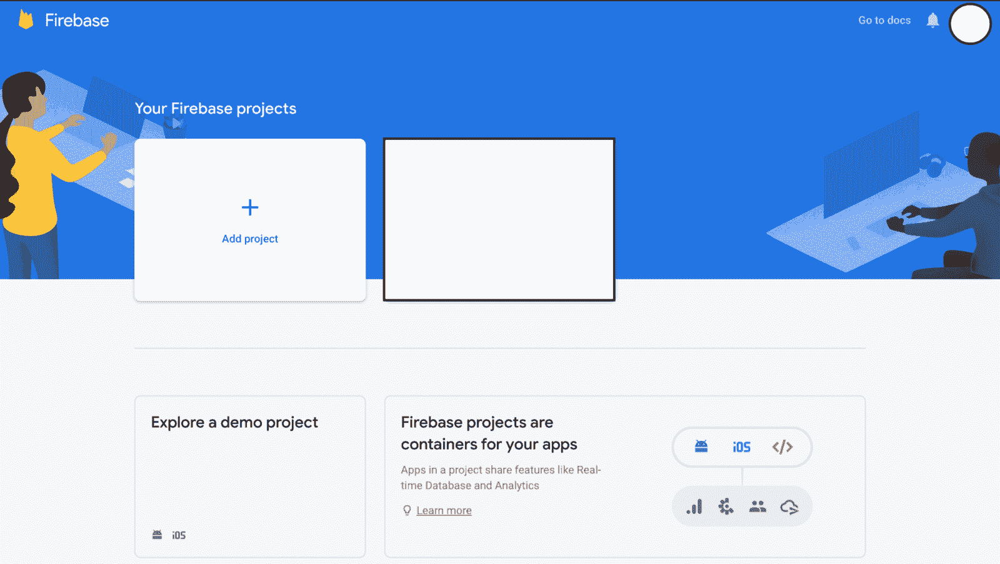

Firebase Console** 

**选择**添加项目**选项。之后，按照下面的 gif 一步一步地配置 firebase 项目。**

**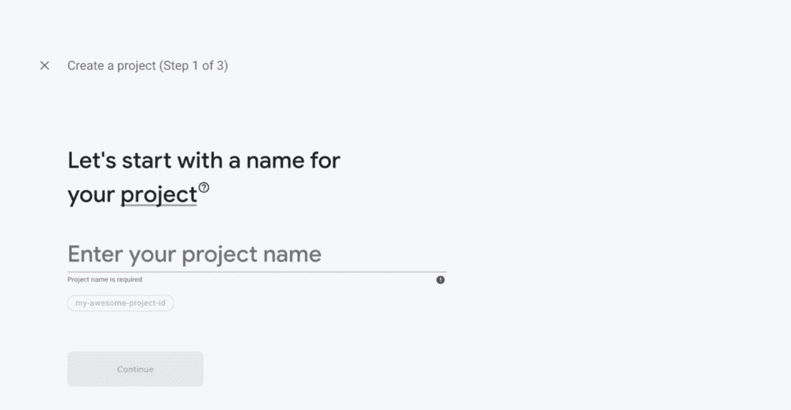

Firebase Configuration** 

**转到功能选项卡，点击**开始**按钮:**

**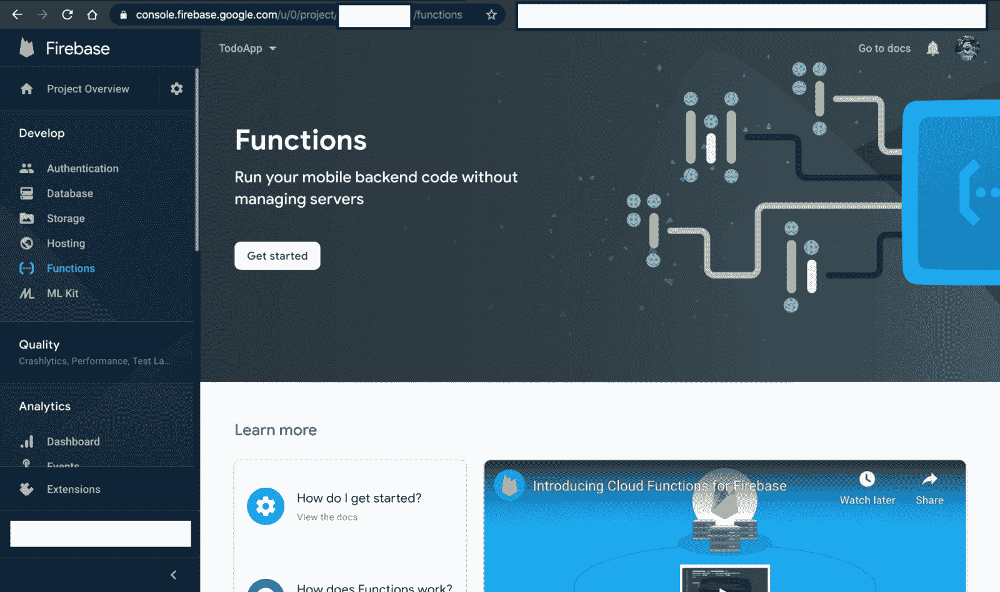

Functions Dashboard** 

**你会看到一个对话框，里面有关于如何设置 Firebase 功能的说明。去你当地的环境。打开命令行工具。要在您的计算机上安装 firebase 工具，请使用以下命令:**

```
 `npm install -g firebase-tools`
```

**完成后，使用命令`firebase init`在您的本地环境中配置 firebase 功能。在本地环境中初始化 firebase 函数时，选择以下选项:**

1.  **您想为此文件夹设置哪些 Firebase CLI 功能？按空格键选择功能，然后回车确认您的选择=> *功能:配置和部署云功能***
2.  **首先，让我们将这个项目目录与一个 Firebase 项目相关联… *= >使用现有项目***
3.  **为此目录选择一个默认的 Firebase 项目=> *application_name***
4.  **你想用什么语言写云函数？=> *JavaScript***
5.  **你想使用 ESLint 来捕捉可能的错误并加强风格吗？=> *N***
6.  **您想现在安装与 npm 的依赖关系吗？(Y/n) => *Y***

**配置完成后，您将收到以下消息:**

```
`✔ Firebase initialization complete!`
```

**初始化完成后，这将是我们的目录结构:**

```
`+-- firebase.json 
+-- functions
|   +-- index.js
|   +-- node_modules
|   +-- package-lock.json
|   +-- package.json`
```

**现在打开 functions 目录下的`index.js`，复制粘贴以下代码:**

```
`const functions = require('firebase-functions');

exports.helloWorld = functions.https.onRequest((request, response) => {
     response.send("Hello from Firebase!");
});`
```

**使用以下命令将代码部署到 firebase 函数:**

```
`firebase deploy`
```

**部署完成后，您将在命令行末尾获得以下日志行:**

```
`> ✔  Deploy complete!
> Project Console: https://console.firebase.google.com/project/todoapp-<id>/overview`
```

**进入**项目控制台>功能**，在那里你会找到 API 的 URL。URL 将如下所示:**

```
`https://<hosting-region>-todoapp-<id>.cloudfunctions.net/helloWorld`
```

**复制此 URL 并将其粘贴到浏览器中。您将得到以下响应:**

```
`Hello from Firebase!`
```

**这证实了我们的 Firebase 功能已经正确配置。**

### **安装快速框架:**

**现在让我们使用下面的命令在我们的项目中安装`Express`框架:**

```
`npm i express`
```

**现在让我们在**函数**目录中创建一个**API**目录。在该目录中，我们将创建一个名为`todos.js`的文件。删除`index.js`中的所有内容，然后复制粘贴以下代码:**

```
`//index.js

const functions = require('firebase-functions');
const app = require('express')();

const {
    getAllTodos
} = require('./APIs/todos')

app.get('/todos', getAllTodos);
exports.api = functions.https.onRequest(app);`
```

**我们已经将 getAllTodos 功能分配给了 **/todos** 路线。所以这个路由上的所有 API 调用都将通过 getAllTodos 函数执行。现在转到 API 目录下的`todos.js`文件，我们将在这里编写 getAllTodos 函数。**

```
`//todos.js

exports.getAllTodos = (request, response) => {
    todos = [
        {
            'id': '1',
            'title': 'greeting',
            'body': 'Hello world from sharvin shah' 
        },
        {
            'id': '2',
            'title': 'greeting2',
            'body': 'Hello2 world2 from sharvin shah' 
        }
    ]
    return response.json(todos);
}`
```

**这里我们声明了一个样本 JSON 对象。稍后，我们将从 Firestore 中获取这些信息。但是暂时我们会退回这个。现在使用命令`firebase deploy`将它部署到 firebase 函数中。它会询问是否允许删除模块**hello world**——只需输入 **y** 。**

```
`The following functions are found in your project but do not exist in your local source code: helloWorld

Would you like to proceed with deletion? Selecting no will continue the rest of the deployments. (y/N) y`
```

**一旦完成，进入**项目控制台>功能**，在那里你会找到 API 的 URL。该 API 将如下所示:**

```
`https://<hosting-region>-todoapp-<id>.cloudfunctions.net/api`
```

**现在转到浏览器，复制粘贴该 URL，并在该 URL 的末尾添加 **/todos** 。您将获得以下输出:**

```
`[
        {
            'id': '1',
            'title': 'greeting',
            'body': 'Hello world from sharvin shah' 
        },
        {
            'id': '2',
            'title': 'greeting2',
            'body': 'Hello2 world2 from sharvin shah' 
        }
]`
```

### **Firebase Firestore:**

**我们将使用 firebase firestore 作为应用程序的实时数据库。现在转到 Firebase 控制台中的**控制台>数据库**。要配置 firestore，请遵循以下 gif:**

**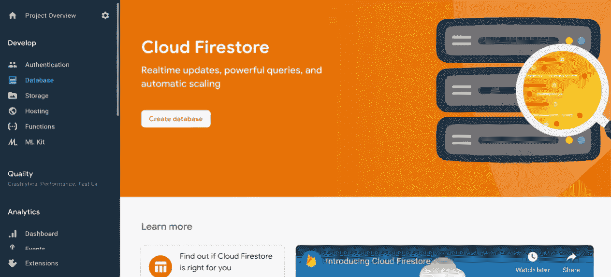

Configuring Firestore** 

**配置完成后，点击**开始收集**按钮，并将**收集 ID** 设置为 **todos** 。单击下一步，您将看到以下弹出窗口:**

**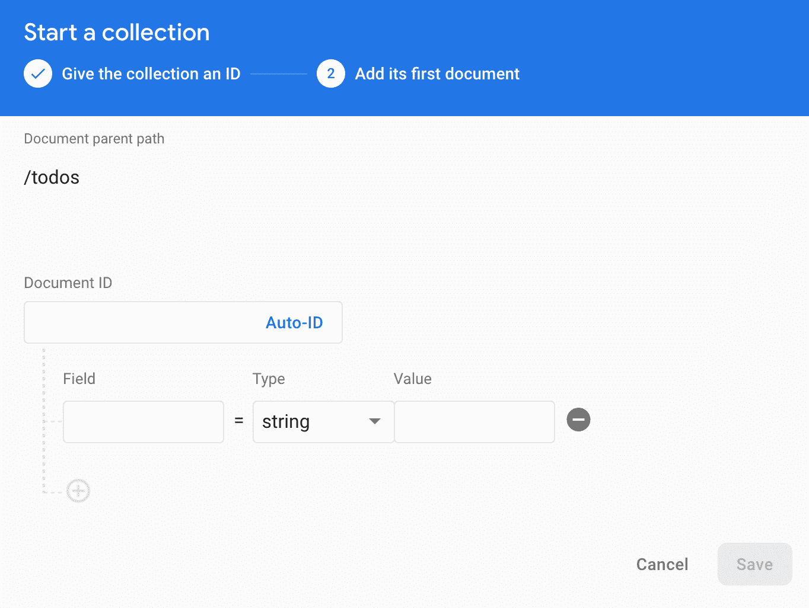

Creating Database Manually** 

**忽略 DocumentID 键。关于**字段、类型和值**，请参考下面的 JSON。相应地更新该值:**

```
`{
    Field: title,
    Type: String,
    Value: Hello World
},
{
    Field: body,
    Type: String,
    Value: Hello folks I hope you are staying home...
},
{
    Field: createtAt,
    type: timestamp,
    value: Add the current date and time here
}`
```

**按保存按钮。您将看到集合和文档被创建。回到当地环境。我们需要安装`firebase-admin`，它有我们需要的 firestore 包。使用以下命令安装它:**

```
`npm i firebase-admin`
```

**在**函数**目录下创建一个名为 **util** 的目录。转到这个目录，创建一个文件名`admin.js`。在这个文件中，我们将导入 firebase 管理包并初始化 firestore 数据库对象。我们将导出它，以便其他**模块**可以使用它。**

```
`//admin.js

const admin = require('firebase-admin');

admin.initializeApp();

const db = admin.firestore();

module.exports = { admin, db };`
```

**现在让我们编写一个 API 来获取这些数据。转到**函数>API**目录下的`todos.js`。删除旧代码，并复制粘贴以下代码:**

```
`//todos.js

const { db } = require('../util/admin');

exports.getAllTodos = (request, response) => {
	db
		.collection('todos')
		.orderBy('createdAt', 'desc')
		.get()
		.then((data) => {
			let todos = [];
			data.forEach((doc) => {
				todos.push({
                    todoId: doc.id,
                    title: doc.data().title,
					body: doc.data().body,
					createdAt: doc.data().createdAt,
				});
			});
			return response.json(todos);
		})
		.catch((err) => {
			console.error(err);
			return response.status(500).json({ error: err.code});
		});
};`
```

**在这里，我们从数据库中获取所有的 todos，并以列表的形式将它们转发给客户端。**

**您也可以使用`firebase serve`命令在本地运行应用程序，而不是每次都部署它。当您运行该命令时，您可能会得到一个关于凭据的错误。要修复它，请按照下面提到的步骤操作:**

1.  **进入**项目设置**(左上角的设置图标)**
2.  **转到**服务账户标签****
3.  **下面将会有**生成新密钥**的选项。单击该选项，它将下载一个扩展名为 JSON 的文件。**
4.  **我们需要将这些凭证导出到命令行会话中。使用下面的命令来完成此操作:**

```
`export GOOGLE_APPLICATION_CREDENTIALS="/home/user/Downloads/[FILE_NAME].json"`
```

**之后，运行 firebase serve 命令。如果您仍然得到错误，那么使用下面的命令:`firebase login --reauth`。它将在浏览器中打开 Google 登录页面。登录完成后，它将正常工作，不会出现任何错误。**

**当您运行 firebase serve 命令时，您会在命令行工具的日志中找到一个 URL。在浏览器中打开该 URL，并在其后追加`/todos`。**

```
`✔ functions[api]: http function initialized (http://localhost:5000/todoapp-<project-id>/<region-name>/api).`
```

**您将在浏览器中获得以下 JSON 输出:**

```
`[
    {
        "todoId":"W67t1kSMO0lqvjCIGiuI",
        "title":"Hello World",
        "body":"Hello folks I hope you are staying home...",
        "createdAt":{"_seconds":1585420200,"_nanoseconds":0 }
    }
]`
```

### **编写其他 API:**

**是时候编写我们的应用程序需要的所有其他 todo APIs 了。**

1.  ****创建待办事项:**转到函数目录下的`index.js`。在现有的 getAllTodos 下导入 postOneTodo 方法。此外，将发布路由分配给该方法。**

```
`//index.js

const {
    ..,
    postOneTodo
} = require('./APIs/todos')

app.post('/todo', postOneTodo);`
```

**转到 functions 目录中的`todos.js`，在现有的`getAllTodos`方法下添加一个新方法`postOneTodo`。**

```
`//todos.js

exports.postOneTodo = (request, response) => {
	if (request.body.body.trim() === '') {
		return response.status(400).json({ body: 'Must not be empty' });
    }

    if(request.body.title.trim() === '') {
        return response.status(400).json({ title: 'Must not be empty' });
    }

    const newTodoItem = {
        title: request.body.title,
        body: request.body.body,
        createdAt: new Date().toISOString()
    }
    db
        .collection('todos')
        .add(newTodoItem)
        .then((doc)=>{
            const responseTodoItem = newTodoItem;
            responseTodoItem.id = doc.id;
            return response.json(responseTodoItem);
        })
        .catch((err) => {
			response.status(500).json({ error: 'Something went wrong' });
			console.error(err);
		});
};`
```

**在这个方法中，我们向数据库添加了一个新的 Todo。如果我们身体的元素是空的，那么我们将返回一个 400 的响应，否则我们将添加数据。**

**运行 firebase serve 命令并打开 postman 应用程序。创建一个新的请求并选择方法类型为 **POST** 。添加 URL 和 JSON 类型的主体。**

```
`URL: http://localhost:5000/todoapp-<app-id>/<region-name>/api/todo

METHOD: POST

Body: {
   "title":"Hello World",
   "body": "We are writing this awesome API"
}`
```

**按下发送按钮，您将得到以下响应:**

```
`{
     "title": "Hello World",
     "body": "We are writing this awesome API",
     "createdAt": "2020-03-29T12:30:48.809Z",
     "id": "nh41IgARCj8LPWBYzjU0"
}`
```

**2.**删除待办事项:**转到功能目录下的`index.js`。在现有 postOneTodo 下导入 deleteTodo 方法。此外，将删除路由分配给该方法。**

```
`//index.js

const {
    ..,
    deleteTodo
} = require('./APIs/todos')

app.delete('/todo/:todoId', deleteTodo);`
```

**转到`todos.js`，在现有的`postOneTodo`方法下添加一个新方法`deleteTodo`。**

```
`//todos.js

exports.deleteTodo = (request, response) => {
    const document = db.doc(`/todos/${request.params.todoId}`);
    document
        .get()
        .then((doc) => {
            if (!doc.exists) {
                return response.status(404).json({ error: 'Todo not found' })
            }
            return document.delete();
        })
        .then(() => {
            response.json({ message: 'Delete successfull' });
        })
        .catch((err) => {
            console.error(err);
            return response.status(500).json({ error: err.code });
        });
};`
```

**在这个方法中，我们从数据库中删除一个 Todo。运行 firebase serve 命令，然后去找邮递员。创建一个新请求，选择方法类型为**删除**并添加 URL。**

```
`URL: http://localhost:5000/todoapp-<app-id>/<region-name>/api/todo/<todo-id>

METHOD: DELETE`
```

**按下发送按钮，您将得到以下响应:**

```
`{
   "message": "Delete successfull"
}`
```

**3.**编辑待办事项:**进入功能目录下的`index.js`。在现有的 deleteTodo 下导入 editTodo 方法。此外，将 PUT 路径分配给该方法。**

```
`//index.js

const {
    ..,
    editTodo
} = require('./APIs/todos')

app.put('/todo/:todoId', editTodo);`
```

**转到`todos.js`，在现有的`deleteTodo`方法下添加一个新方法`editTodo`。**

```
`//todos.js

exports.editTodo = ( request, response ) => { 
    if(request.body.todoId || request.body.createdAt){
        response.status(403).json({message: 'Not allowed to edit'});
    }
    let document = db.collection('todos').doc(`${request.params.todoId}`);
    document.update(request.body)
    .then(()=> {
        response.json({message: 'Updated successfully'});
    })
    .catch((err) => {
        console.error(err);
        return response.status(500).json({ 
                error: err.code 
        });
    });
};`
```

**在这个方法中，我们从数据库中编辑一个 Todo。请记住，这里我们不允许用户编辑 todoId 或 createdAt 字段。运行 firebase serve 命令，然后去找邮递员。创建一个新的请求，选择方法类型为 **PUT，**并添加 URL。**

```
`URL: http://localhost:5000/todoapp-<app-id>/<region-name>/api/todo/<todo-id>

METHOD: PUT`
```

**按下发送按钮，您将得到以下响应:**

```
`{  
   "message": "Updated successfully"
}`
```

****到目前为止的目录结构:****

```
`+-- firebase.json 
+-- functions
|   +-- API
|   +-- +-- todos.js
|   +-- util
|   +-- +-- admin.js
|   +-- index.js
|   +-- node_modules
|   +-- package-lock.json
|   +-- package.json
|   +-- .gitignore`
```

**至此，我们已经完成了应用程序的第一部分。你可以喝点咖啡，休息一下，然后我们将继续开发用户 API。**

## **第 2 节:开发用户 API**

**在部分的**、**中，我们将开发这些组件:**

1.  ****用户认证(登录和注册)API。****
2.  ****获取并更新用户详细信息 API。****
3.  ****更新用户资料图片 API。****
4.  ****保护现有的 Todo API。****

**本节中实现的用户 API 代码可以在这个[提交](https://github.com/Sharvin26/TodoApp/tree/951a8605d988b8e17bd1623eac5c46e449786d1b)中找到。**

**因此，让我们开始构建用户认证 API。前往 **Firebase 控制台>认证。****

**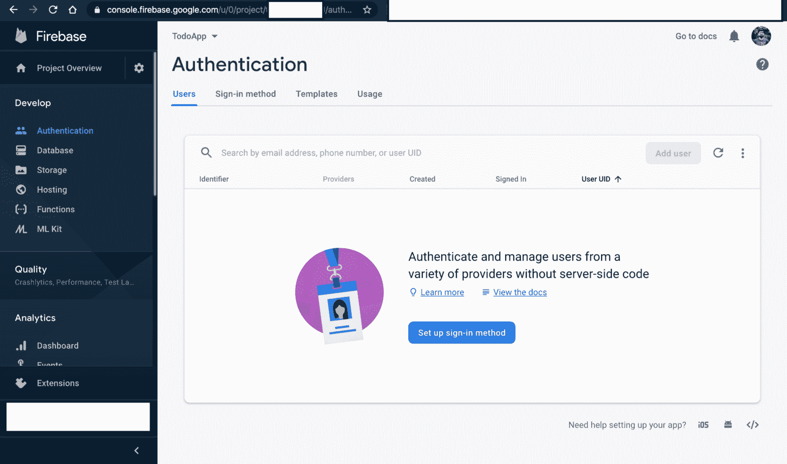

Firebase Authentication Page** 

**点击**设置** **签到方式**按钮。我们将使用电子邮件和密码进行用户验证。启用**电子邮件/密码**选项。**

**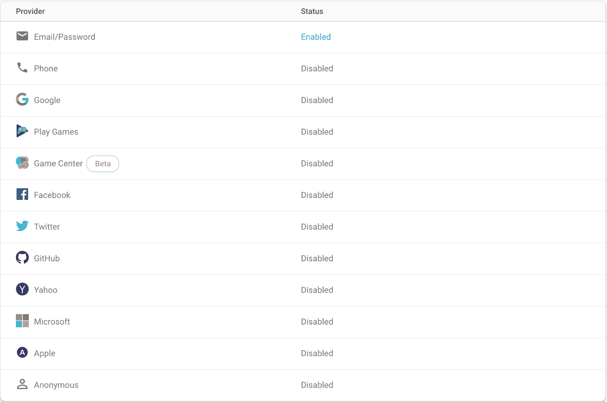

Firebase Set up Sign up page** 

**现在我们将手动创建我们的用户。首先，我们将构建登录 API。之后，我们将构建注册 API。**

**转到认证下的用户选项卡，填写用户详细信息，然后单击**添加用户**按钮。**

**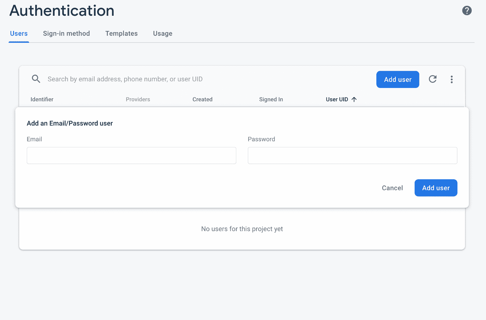

Adding user manually** 

### **1.用户登录 API:**

**首先，我们需要使用以下命令安装`firebase`包，它由 **Firebase 身份验证库**组成:**

```
`npm i firebase`
```

**一旦安装完成，进入**功能>API**目录。这里我们将创建一个`users.js`文件。现在，在`index.js`中，我们导入一个 loginUser 方法，并为其分配 POST 路由。**

```
`//index.js

const {
    loginUser
} = require('./APIs/users')

// Users
app.post('/login', loginUser);`
```

**进入**项目设置>常规**，在那里你会发现下面的卡片:**

**

Getting Firebase configuration** 

**选择网络图标，然后跟随下面的 gif:**

**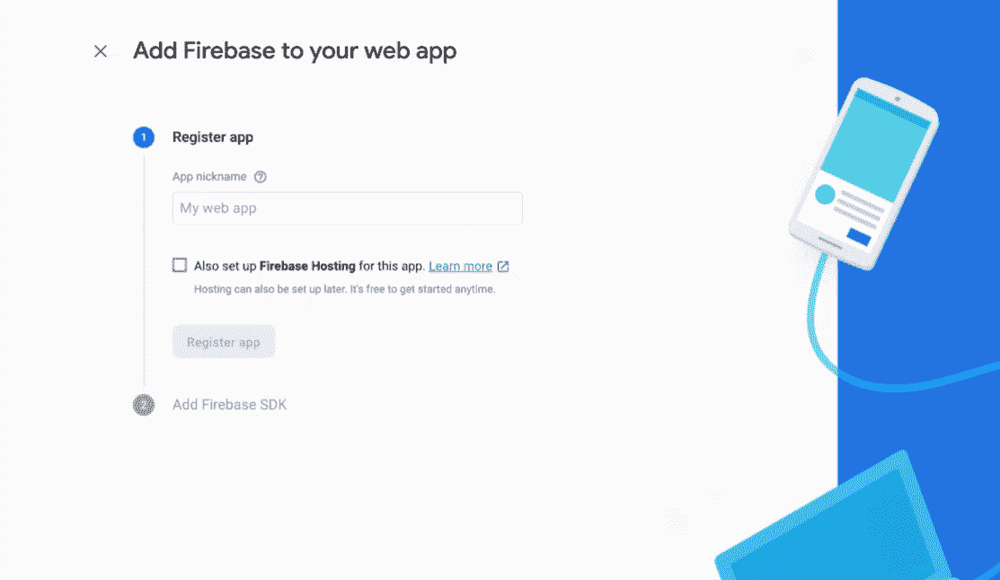**

**选择**继续控制台**选项。一旦完成，你会看到一个带有 firebase 配置的 JSON。转到**函数> util** 目录，创建一个`config.js`文件。将以下代码复制粘贴到该文件中:**

```
`// config.js

module.exports = {
    apiKey: "............",
    authDomain: "........",
    databaseURL: "........",
    projectId: ".......",
    storageBucket: ".......",
    messagingSenderId: "........",
    appId: "..........",
    measurementId: "......."
};`
```

**用你在 **Firebase 控制台>项目设置>** **常规>你的应用> Firebase SD 片段>配置**下得到的值替换`............`。**

**将以下代码复制粘贴到`users.js`文件中:**

```
`// users.js

const { admin, db } = require('../util/admin');
const config = require('../util/config');

const firebase = require('firebase');

firebase.initializeApp(config);

const { validateLoginData, validateSignUpData } = require('../util/validators');

// Login
exports.loginUser = (request, response) => {
    const user = {
        email: request.body.email,
        password: request.body.password
    }

    const { valid, errors } = validateLoginData(user);
	if (!valid) return response.status(400).json(errors);

    firebase
        .auth()
        .signInWithEmailAndPassword(user.email, user.password)
        .then((data) => {
            return data.user.getIdToken();
        })
        .then((token) => {
            return response.json({ token });
        })
        .catch((error) => {
            console.error(error);
            return response.status(403).json({ general: 'wrong credentials, please try again'});
        })
};`
```

**这里我们使用一个 firebase**signingwithemailandpassword**模块来检查用户提交的凭证是否正确。如果他们是正确的，那么我们发送该用户的令牌，或者带有“错误凭证”消息的 403 状态。**

**现在让我们在**函数>工具**目录下创建`validators.js`。将以下代码复制粘贴到该文件中:**

```
`// validators.js

const isEmpty = (string) => {
	if (string.trim() === '') return true;
	else return false;
};

exports.validateLoginData = (data) => {
   let errors = {};
   if (isEmpty(data.email)) errors.email = 'Must not be empty';
   if (isEmpty(data.password)) errors.password = 'Must not be  empty';
   return {
       errors,
       valid: Object.keys(errors).length === 0 ? true : false
    };
};`
```

**至此，我们的**登录 T2 就完成了。运行`firebase serve`命令，去找邮递员。创建一个新的请求，选择方法类型为 **POST** ，并添加 URL 和主体。****

```
`URL: http://localhost:5000/todoapp-<app-id>/<region-name>/api/login

METHOD: POST

Body: {   
    "email":"Add email that is assigned for user in console", 
    "password": "Add password that is assigned for user in console"
}`
```

**点击 postman 中的发送请求按钮，您将获得以下输出:**

```
`{   
    "token": ".........."
}`
```

**我们将在接下来的部分中使用这个令牌来**获取用户详细信息**。记住这个令牌在 **60 分钟**后到期。要生成新令牌，请再次使用此 API。**

### **2.用户注册 API:**

**firebase 的默认认证机制只允许您存储电子邮件、密码等信息。但是我们需要更多的信息来确定该用户是否拥有该 todo，以便他们可以对其执行读取、更新和删除操作。**

**为了实现这个目标，我们将创建一个名为 **users** 的新集合。在这个集合下，我们将存储用户的数据，这些数据将根据用户名映射到 todo。对于平台上的所有用户来说，每个用户名都是唯一的。**

**转到`index.js`。我们导入一个 signUpUser 方法，并为其分配 POST 路由。**

```
`//index.js

const {
    ..,
    signUpUser
} = require('./APIs/users')

app.post('/signup', signUpUser);`
```

**现在转到`validators.js`并在`validateLoginData`方法下添加以下代码。**

```
`// validators.js

const isEmail = (email) => {
	const emailRegEx = /^(([^<>()\[\]\\.,;:\s@"]+(\.[^<>()\[\]\\.,;:\s@"]+)*)|(".+"))@((\[[0-9]{1,3}\.[0-9]{1,3}\.[0-9]{1,3}\.[0-9]{1,3}\])|(([a-zA-Z\-0-9]+\.)+[a-zA-Z]{2,}))$/;
	if (email.match(emailRegEx)) return true;
	else return false;
};

exports.validateSignUpData = (data) => {
	let errors = {};

	if (isEmpty(data.email)) {
		errors.email = 'Must not be empty';
	} else if (!isEmail(data.email)) {
		errors.email = 'Must be valid email address';
	}

	if (isEmpty(data.firstName)) errors.firstName = 'Must not be empty';
	if (isEmpty(data.lastName)) errors.lastName = 'Must not be empty';
	if (isEmpty(data.phoneNumber)) errors.phoneNumber = 'Must not be empty';
	if (isEmpty(data.country)) errors.country = 'Must not be empty';

	if (isEmpty(data.password)) errors.password = 'Must not be empty';
	if (data.password !== data.confirmPassword) errors.confirmPassword = 'Passowrds must be the same';
	if (isEmpty(data.username)) errors.username = 'Must not be empty';

	return {
		errors,
		valid: Object.keys(errors).length === 0 ? true : false
	};
};`
```

**现在转到`users.js`并在`loginUser`模块下添加以下代码。**

```
`// users.js

exports.signUpUser = (request, response) => {
    const newUser = {
        firstName: request.body.firstName,
        lastName: request.body.lastName,
        email: request.body.email,
        phoneNumber: request.body.phoneNumber,
        country: request.body.country,
		password: request.body.password,
		confirmPassword: request.body.confirmPassword,
		username: request.body.username
    };

    const { valid, errors } = validateSignUpData(newUser);

	if (!valid) return response.status(400).json(errors);

    let token, userId;
    db
        .doc(`/users/${newUser.username}`)
        .get()
        .then((doc) => {
            if (doc.exists) {
                return response.status(400).json({ username: 'this username is already taken' });
            } else {
                return firebase
                        .auth()
                        .createUserWithEmailAndPassword(
                            newUser.email, 
                            newUser.password
                    );
            }
        })
        .then((data) => {
            userId = data.user.uid;
            return data.user.getIdToken();
        })
        .then((idtoken) => {
            token = idtoken;
            const userCredentials = {
                firstName: newUser.firstName,
                lastName: newUser.lastName,
                username: newUser.username,
                phoneNumber: newUser.phoneNumber,
                country: newUser.country,
                email: newUser.email,
                createdAt: new Date().toISOString(),
                userId
            };
            return db
                    .doc(`/users/${newUser.username}`)
                    .set(userCredentials);
        })
        .then(()=>{
            return response.status(201).json({ token });
        })
        .catch((err) => {
			console.error(err);
			if (err.code === 'auth/email-already-in-use') {
				return response.status(400).json({ email: 'Email already in use' });
			} else {
				return response.status(500).json({ general: 'Something went wrong, please try again' });
			}
		});
}`
```

**我们验证我们的用户数据，然后我们向 firebase**createuserwhemailandpassword**模块发送电子邮件和密码来创建用户。成功创建用户后，我们将用户凭据保存在数据库中。**

**至此，我们的**注册 API** 就完成了。运行`firebase serve`命令，去找邮递员。创建一个新请求，选择方法类型为 **POST** 。添加 URL 和正文。**

```
`URL: http://localhost:5000/todoapp-<app-id>/<region-name>/api/signup

METHOD: POST

Body: {
   "firstName": "Add a firstName here",
   "lastName": "Add a lastName here",
   "email":"Add a email here",
   "phoneNumber": "Add a phone number here",
   "country": "Add a country here",
   "password": "Add a password here",
   "confirmPassword": "Add same password here",
   "username": "Add unique username here"
}`
```

**点击 postman 中的发送请求按钮，您将获得以下输出:**

```
`{   
    "token": ".........."
}`
```

**现在转到 **Firebase 控制台>数据库**，在那里你会看到以下输出:**

**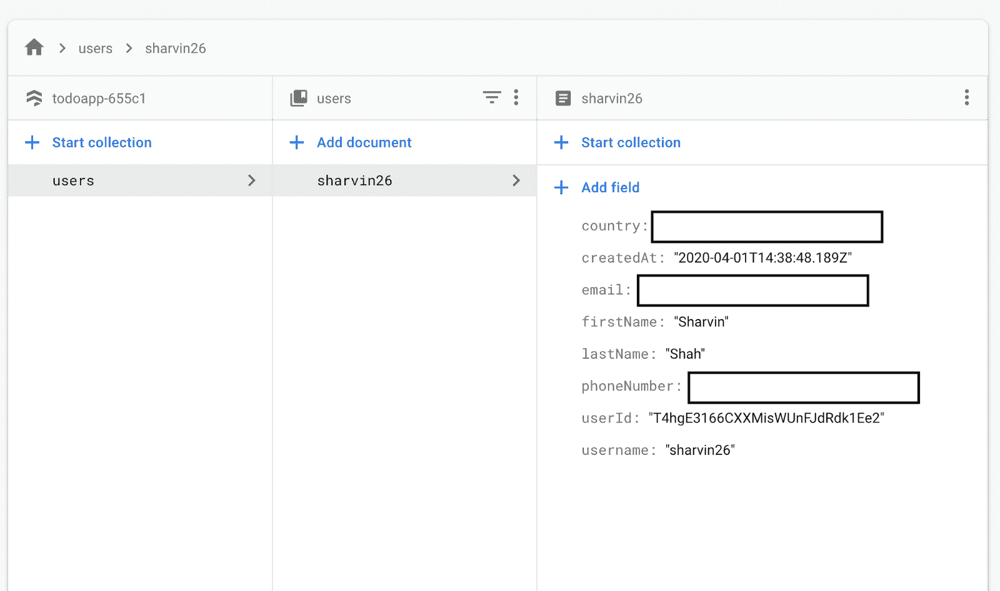**

**如您所见，我们的用户集合已成功创建，其中包含一个文档。**

### **3.上传用户个人资料图片:**

**我们的用户将能够上传他们的个人资料图片。为此，我们将使用存储桶。转到 **Firebase 控制台>存储**并点击**开始**按钮。按照下面的 GIF 进行配置:**

**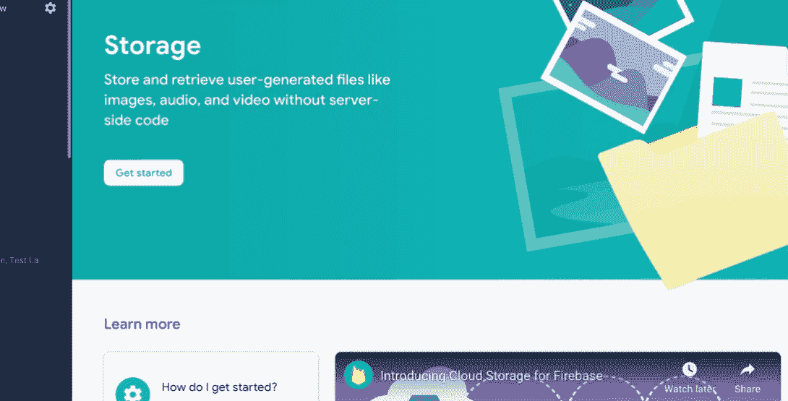**

**现在转到 Storage 下的 **Rules** 选项卡，按照下图更新 bucket 访问权限:**

**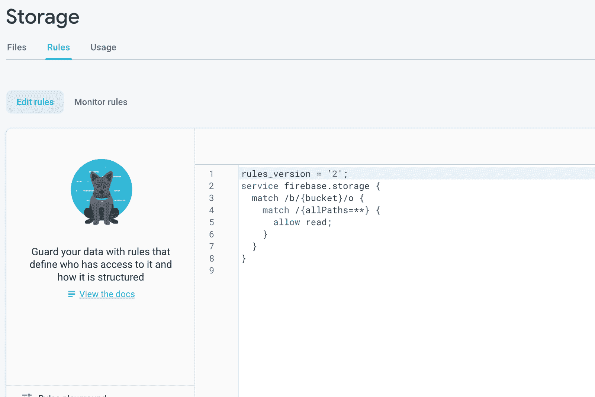**

**为了上传个人资料图片，我们将使用名为`busboy`的包。要安装此软件包，请使用以下命令:**

```
`npm i busboy`
```

**转到`index.js`。在现有的 signUpUser 方法下导入 uploadProfilePhoto 方法。还要将发布路由分配给该方法。**

```
`//index.js

const auth = require('./util/auth');

const {
    ..,
    uploadProfilePhoto
} = require('./APIs/users')

app.post('/user/image', auth, uploadProfilePhoto);`
```

**在这里，我们添加了一个身份验证层，这样只有与该帐户相关联的用户才能上传图像。现在在**函数>工具**目录下创建一个名为`auth.js`的文件。将以下代码复制粘贴到该文件中:**

```
`// auth.js

const { admin, db } = require('./admin');

module.exports = (request, response, next) => {
	let idToken;
	if (request.headers.authorization && request.headers.authorization.startsWith('Bearer ')) {
		idToken = request.headers.authorization.split('Bearer ')[1];
	} else {
		console.error('No token found');
		return response.status(403).json({ error: 'Unauthorized' });
	}
	admin
		.auth()
		.verifyIdToken(idToken)
		.then((decodedToken) => {
			request.user = decodedToken;
			return db.collection('users').where('userId', '==', request.user.uid).limit(1).get();
		})
		.then((data) => {
			request.user.username = data.docs[0].data().username;
			request.user.imageUrl = data.docs[0].data().imageUrl;
			return next();
		})
		.catch((err) => {
			console.error('Error while verifying token', err);
			return response.status(403).json(err);
		});
};`
```

**这里我们使用 firebase **verifyIdToken** 模块来验证令牌。之后，我们解码用户详细信息，并在现有请求中传递它们。**

**转到`users.js`并在`signup`方法下添加以下代码:**

```
`// users.js

deleteImage = (imageName) => {
    const bucket = admin.storage().bucket();
    const path = `${imageName}`
    return bucket.file(path).delete()
    .then(() => {
        return
    })
    .catch((error) => {
        return
    })
}

// Upload profile picture
exports.uploadProfilePhoto = (request, response) => {
    const BusBoy = require('busboy');
	const path = require('path');
	const os = require('os');
	const fs = require('fs');
	const busboy = new BusBoy({ headers: request.headers });

	let imageFileName;
	let imageToBeUploaded = {};

	busboy.on('file', (fieldname, file, filename, encoding, mimetype) => {
		if (mimetype !== 'image/png' && mimetype !== 'image/jpeg') {
			return response.status(400).json({ error: 'Wrong file type submited' });
		}
		const imageExtension = filename.split('.')[filename.split('.').length - 1];
        imageFileName = `${request.user.username}.${imageExtension}`;
		const filePath = path.join(os.tmpdir(), imageFileName);
		imageToBeUploaded = { filePath, mimetype };
		file.pipe(fs.createWriteStream(filePath));
    });
    deleteImage(imageFileName);
	busboy.on('finish', () => {
		admin
			.storage()
			.bucket()
			.upload(imageToBeUploaded.filePath, {
				resumable: false,
				metadata: {
					metadata: {
						contentType: imageToBeUploaded.mimetype
					}
				}
			})
			.then(() => {
				const imageUrl = `https://firebasestorage.googleapis.com/v0/b/${config.storageBucket}/o/${imageFileName}?alt=media`;
				return db.doc(`/users/${request.user.username}`).update({
					imageUrl
				});
			})
			.then(() => {
				return response.json({ message: 'Image uploaded successfully' });
			})
			.catch((error) => {
				console.error(error);
				return response.status(500).json({ error: error.code });
			});
	});
	busboy.end(request.rawBody);
};`
```

**这样我们的**上传个人资料图片 API** 就完成了。运行`firebase serve`命令，去找邮递员。创建一个新的请求，选择方法类型为 **POST** ，添加 URL，并在主体部分选择类型为 form-data。**

**请求是受保护的，因此您还需要发送**不记名令牌**。要发送不记名令牌，如果令牌已过期，请再次登录。之后在**邮差 App >授权标签>输入>不记名令牌**并在令牌区粘贴令牌。**

```
`URL: http://localhost:5000/todoapp-<app-id>/<region-name>/api/user/image

METHOD: GET

Body: { REFER THE IMAGE down below }`
```

****

**点击 postman 中的发送请求按钮，您将获得以下输出:**

```
`{        
    "message": "Image uploaded successfully"
}`
```

### **4.获取用户详细信息:**

**这里我们从数据库中获取用户的数据。转到`index.js`并导入 getUserDetail 方法，并为其分配 GET route。**

```
`// index.js

const {
    ..,
    getUserDetail
} = require('./APIs/users')

app.get('/user', auth, getUserDetail);`
```

**现在转到`users.js`，在`uploadProfilePhoto`模块后添加以下代码:**

```
`// users.js

exports.getUserDetail = (request, response) => {
    let userData = {};
	db
		.doc(`/users/${request.user.username}`)
		.get()
		.then((doc) => {
			if (doc.exists) {
                userData.userCredentials = doc.data();
                return response.json(userData);
			}	
		})
		.catch((error) => {
			console.error(error);
			return response.status(500).json({ error: error.code });
		});
}`
```

**我们使用的是 firebase **doc()。get()** 模块导出用户详细信息。至此，我们的**获取用户详情 API** 就完成了。运行`firebase serve`命令，去找邮递员。创建一个新的请求，选择方法类型: **GET** ，添加 URL 和主体。**

**请求是受保护的，因此您还需要发送**不记名令牌**。要发送不记名令牌，如果令牌已过期，请再次登录。**

```
`URL: http://localhost:5000/todoapp-<app-id>/<region-name>/api/user
METHOD: GET`
```

**点击 postman 中的发送请求按钮，您将获得以下输出:**

```
`{
   "userCredentials": {
       "phoneNumber": "........",
       "email": "........",
       "country": "........",
       "userId": "........",
       "username": "........",
       "createdAt": "........",
       "lastName": "........",
       "firstName": "........"
    }
}`
```

### **5.更新用户详细信息:**

**现在让我们添加更新用户详细信息的功能。转到`index.js`并复制粘贴以下代码:**

```
`// index.js

const {
    ..,
    updateUserDetails
} = require('./APIs/users')

app.post('/user', auth, updateUserDetails);`
```

**现在转到`users.js`并在现有的`getUserDetails`下添加`updateUserDetails`模块:**

```
`// users.js

exports.updateUserDetails = (request, response) => {
    let document = db.collection('users').doc(`${request.user.username}`);
    document.update(request.body)
    .then(()=> {
        response.json({message: 'Updated successfully'});
    })
    .catch((error) => {
        console.error(error);
        return response.status(500).json({ 
            message: "Cannot Update the value"
        });
    });
}`
```

**这里我们使用的是 firebase **update** 方法。至此，我们的**更新用户详细信息 API** 完成。遵循与上面的获取用户详细信息 API 相同的请求过程，但有一点不同。在此处的请求中添加主体，并将方法作为 POST。**

```
`URL: http://localhost:5000/todoapp-<app-id>/<region-name>/api/user

METHOD: POST

Body : {
    // You can edit First Name, last Name and country
    // We will disable other Form Tags from our UI
}`
```

**点击 postman 中的发送请求按钮，您将获得以下输出:**

```
`{
    "message": "Updated successfully"
}`
```

### **6.保护 Todo APIs:**

**为了保护 Todo API，只有选定的用户才能访问它，我们将对现有代码进行一些更改。首先，我们将更新我们的`index.js`如下:**

```
`// index.js

// Todos
app.get('/todos', auth, getAllTodos);
app.get('/todo/:todoId', auth, getOneTodo);
app.post('/todo',auth, postOneTodo);
app.delete('/todo/:todoId',auth, deleteTodo);
app.put('/todo/:todoId',auth, editTodo);`
```

**我们已经通过添加`auth`更新了所有的 **Todo 路由**，这样所有的 API 调用都将需要一个令牌，并且只能由特定的用户访问。**

**之后转到**函数>API**目录下的`todos.js`。**

1.  ****创建 Todo API:** 打开`todos.js`，在 **postOneTodo** 方法下添加用户名键，如下所示:**

```
`const newTodoItem = {
     ..,
     username: request.user.username,
     ..
}`
```

**2.**获取所有的 Todos API:** 打开`todos.js`，在 **getAllTodos** 方法下添加如下 where 子句:**

```
`db
.collection('todos')
.where('username', '==', request.user.username)
.orderBy('createdAt', 'desc')`
```

**运行 firebase 服务器并测试我们的 GET API。别忘了送不记名令牌。这里您将得到如下响应错误:**

```
`{   
    "error": 9
}`
```

**转到命令行，您将看到记录的以下行:**

```
`i  functions: Beginning execution of "api">  Error: 9 FAILED_PRECONDITION: The query requires an index. You can create it here: <URL>>      at callErrorFromStatus`
```

**在浏览器中打开这个 **< URL >** ，点击创建索引。**

**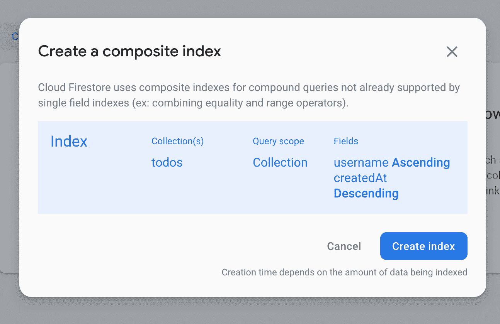**

**一旦构建了索引，再次发送请求，您将获得以下输出:**

```
`[
   {
      "todoId": "......",
      "title": "......",
      "username": "......",
      "body": "......",
      "createdAt": "2020-03-30T13:01:58.478Z"
   }
]`
```

**3. **Delete Todo API:** 打开`todos.js`，在 **deleteTodo** 方法下添加以下条件。将此条件添加到 **document.get()中。然后()**查询下面的**！单据存在**条件。**

```
`..
if(doc.data().username !== request.user.username){
     return response.status(403).json({error:"UnAuthorized"})
}`
```

### **到目前为止的目录结构:**

```
`+-- firebase.json 
+-- functions
|   +-- API
|   +-- +-- todos.js 
|   +-- +-- users.js
|   +-- util
|   +-- +-- admin.js
|   +-- +-- auth.js
|   +-- +-- validators.js
|   +-- index.js
|   +-- node_modules
|   +-- package-lock.json
|   +-- package.json
|   +-- .gitignore`
```

**至此，我们已经完成了 API 后端。休息一下，喝杯咖啡，然后我们将开始构建应用程序的前端**

## **第 3 部分:用户仪表板**

**在部分的**、**中，我们将开发这些组件:**

1.  ****配置反应堆和物料界面。****
2.  ****建立登录和注册表单。****
3.  ****建账部分。****

**本节中实现的用户仪表板代码可以在这个[提交](https://github.com/Sharvin26/TodoApp/tree/2b207786651167c1ed5327c2c8583e97080abb54/view)中找到。**

### **1.配置反应堆和物料用户界面:**

**我们将使用 create-react-app 模板。它为我们开发应用程序提供了一个基本的结构。要安装它，请使用以下命令:**

```
`npm install -g create-react-app`
```

**转到 functions 目录所在项目的根文件夹。使用以下命令初始化我们的前端应用程序:**

```
`create-react-app view`
```

**记得使用*的版本 **v16.13.1** 的*ReactJS 库*。***

**安装完成后，您将在命令行日志中看到以下内容:**

```
`cd view
  npm start
Happy hacking!`
```

**至此，我们已经配置好了 React 应用程序。您将获得以下目录结构:**

```
`+-- firebase.json 
+-- functions { This Directory consists our API logic }
+-- view { This Directory consists our FrontEnd Compoenents }
+-- .firebaserc
+-- .gitignore`
```

**现在使用命令`npm start`运行应用程序。转到`[http://localhost:3000/](http://localhost:3000/)`上的浏览器，您将看到以下输出:**

**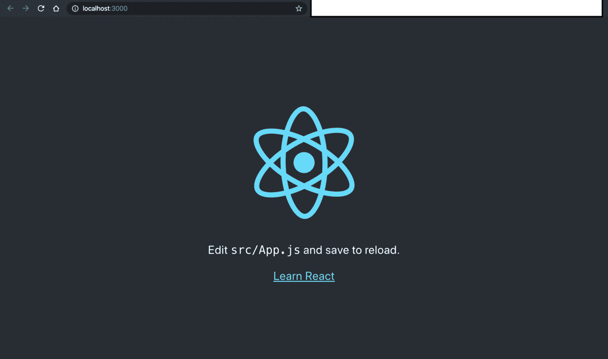**

**现在我们将删除所有不必要的组件。转到查看目录，然后删除前面有**【删除】**的所有文件。**为此，请参考下面的目录树结构。****

```
`+-- README.md [ Remove ]
+-- package-lock.json
+-- package.json
+-- node_modules
+-- .gitignore
+-- public
|   +-- favicon.ico [ Remove ]
|   +-- index.html
|   +-- logo192.png [ Remove ]
|   +-- logo512.png [ Remove ]
|   +-- manifest.json
|   +-- robots.txt
+-- src
|   +-- App.css
|   +-- App.test.js
|   +-- index.js
|   +-- serviceWorker.js
|   +-- App.js
|   +-- index.css [ Remove ]
|   +-- logo.svg [ Remove ]
|   +-- setupTests.js`
```

**转到公共目录下的`index.html`，删除以下行:**

```
`<link rel="icon" href="%PUBLIC_URL%/favicon.ico" />
<link rel="apple-touch-icon" href="%PUBLIC_URL%/logo192.png" />
<link rel="manifest" href="%PUBLIC_URL%/manifest.json" />`
```

**现在转到 src 目录下的`App.js`，用以下代码替换旧代码:**

```
`import React from 'react';
function App() {
  return (
    <div>
    </div>
  );
}
export default App;`
```

**转到`index.js`并删除以下导入:**

```
`import './index.css'`
```

**我没有删除`App.css`，也没有在这个应用程序中使用它。但是，如果你想删除或使用它，你可以自由地这样做。**

**进入`[http://localhost:3000/](http://localhost:3000/)`上的浏览器，你会得到一个空白的屏幕输出。**

**要安装 Material UI，请转到视图目录，并将该命令复制粘贴到终端中:**

```
`npm install @material-ui/core`
```

**记得使用材质 UI 库的版本 **v4.9.8** 。**

### **2.登录表单:**

**要开发登录表单，请转至`App.js`。在`App.js`的顶部添加以下导入:**

```
`import { BrowserRouter as Router, Route, Switch } from 'react-router-dom';
import login from './pages/login';`
```

**我们使用**开关**和**路线**为我们的 TodoApp 分配路线。现在我们将只添加**/登录**路由，并为其分配一个登录组件。**

```
`// App.js

<Router>
    <div>
       <Switch>
           <Route exact path="/login" component={login}/>
       </Switch>
    </div>
</Router>`
```

**在现有的**视图**目录下创建一个**页面**目录，并在**页面**目录下创建一个名为`login.js`的文件。**

**我们将在`login.js`中导入 Material UI 组件和 Axios 包:**

```
`// login.js

// Material UI components
import React, { Component } from 'react';
import Avatar from '@material-ui/core/Avatar';
import Button from '@material-ui/core/Button';
import CssBaseline from '@material-ui/core/CssBaseline';
import TextField from '@material-ui/core/TextField';
import Link from '@material-ui/core/Link';
import Grid from '@material-ui/core/Grid';
import LockOutlinedIcon from '@material-ui/icons/LockOutlined';
import Typography from '@material-ui/core/Typography';
import withStyles from '@material-ui/core/styles/withStyles';
import Container from '@material-ui/core/Container';
import CircularProgress from '@material-ui/core/CircularProgress';

import axios from 'axios';`
```

**我们将在登录页面中添加以下样式:**

```
`// login.js

const styles = (theme) => ({
	paper: {
		marginTop: theme.spacing(8),
		display: 'flex',
		flexDirection: 'column',
		alignItems: 'center'
	},
	avatar: {
		margin: theme.spacing(1),
		backgroundColor: theme.palette.secondary.main
	},
	form: {
		width: '100%',
		marginTop: theme.spacing(1)
	},
	submit: {
		margin: theme.spacing(3, 0, 2)
	},
	customError: {
		color: 'red',
		fontSize: '0.8rem',
		marginTop: 10
	},
	progess: {
		position: 'absolute'
	}
});`
```

**我们将创建一个名为 login 的类，其中包含一个表单和提交处理程序。**

```
`// login.js

class login extends Component {
	constructor(props) {
		super(props);

		this.state = {
			email: '',
			password: '',
			errors: [],
			loading: false
		};
	}

	componentWillReceiveProps(nextProps) {
		if (nextProps.UI.errors) {
			this.setState({
				errors: nextProps.UI.errors
			});
		}
	}

	handleChange = (event) => {
		this.setState({
			[event.target.name]: event.target.value
		});
	};

	handleSubmit = (event) => {
		event.preventDefault();
		this.setState({ loading: true });
		const userData = {
			email: this.state.email,
			password: this.state.password
		};
		axios
			.post('/login', userData)
			.then((response) => {
				localStorage.setItem('AuthToken', `Bearer ${response.data.token}`);
				this.setState({ 
					loading: false,
				});		
				this.props.history.push('/');
			})
			.catch((error) => {				
				this.setState({
					errors: error.response.data,
					loading: false
				});
			});
	};

	render() {
		const { classes } = this.props;
		const { errors, loading } = this.state;
		return (
			<Container component="main" maxWidth="xs">
				<CssBaseline />
				<div className={classes.paper}>
					<Avatar className={classes.avatar}>
						<LockOutlinedIcon />
					</Avatar>
					<Typography component="h1" variant="h5">
						Login
					</Typography>
					<form className={classes.form} noValidate>
						<TextField
							variant="outlined"
							margin="normal"
							required
							fullWidth
							id="email"
							label="Email Address"
							name="email"
							autoComplete="email"
							autoFocus
							helperText={errors.email}
							error={errors.email ? true : false}
							onChange={this.handleChange}
						/>
						<TextField
							variant="outlined"
							margin="normal"
							required
							fullWidth
							name="password"
							label="Password"
							type="password"
							id="password"
							autoComplete="current-password"
							helperText={errors.password}
							error={errors.password ? true : false}
							onChange={this.handleChange}
						/>
						<Button
							type="submit"
							fullWidth
							variant="contained"
							color="primary"
							className={classes.submit}
							onClick={this.handleSubmit}
							disabled={loading || !this.state.email || !this.state.password}
						>
							Sign In
							{loading && <CircularProgress size={30} className={classes.progess} />}
						</Button>
						<Grid container>
							<Grid item>
								<Link href="signup" variant="body2">
									{"Don't have an account? Sign Up"}
								</Link>
							</Grid>
						</Grid>
						{errors.general && (
							<Typography variant="body2" className={classes.customError}>
								{errors.general}
							</Typography>
						)}
					</form>
				</div>
			</Container>
		);
	}
}`
```

**在该文件的末尾添加以下导出内容:**

```
`export default withStyles(styles)(login);` 
```

**添加我们的 firebase 函数 URL 到**视图> package.json** 如下:**

> **记住:在现有 browserslist JSON 对象下添加一个名为 **proxy** 的键**

```
`"proxy": "https://<region-name>-todoapp-<id>.cloudfunctions.net/api"`
```

**使用以下命令安装 **Axios** 和**材料图标**包:**

```
`// Axios command:
npm i axios
// Material Icons:
npm install @material-ui/icons`
```

**我们在`App.js`中增加了一个登录路线。在`login.js`中，我们创建了一个处理状态的类组件，使用 Axios 包向登录 API 发送 post 请求。如果请求成功，那么我们存储令牌。如果我们在响应中得到错误，我们简单地在 UI 上呈现它们。**

**在`[http://localhost:3000/login](http://localhost:3000/login)`进入浏览器，你会看到下面的登录界面。**

**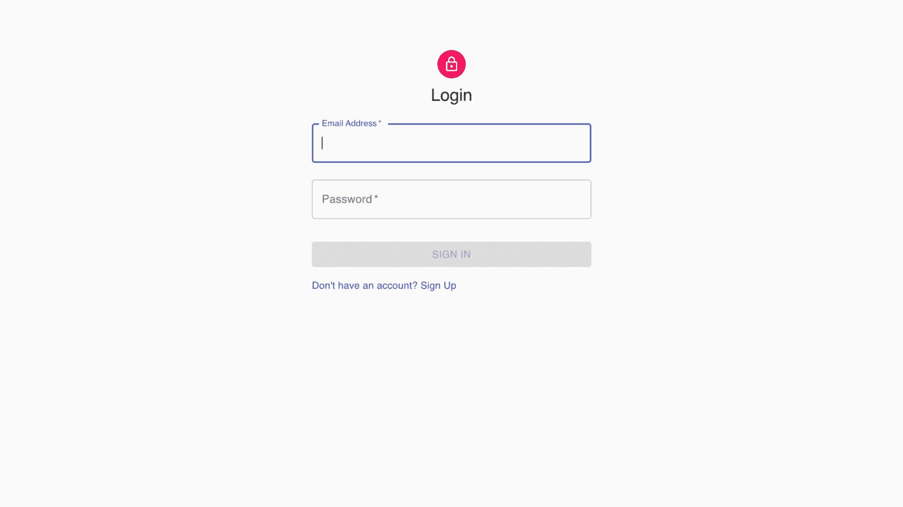

Login Page** 

**尝试填写错误的凭证或发送空请求，您将会得到错误。发送有效的请求。进入**开发者控制台>应用**。您将看到用户令牌存储在本地存储中。登录成功后，我们将返回主页。**

**

Google Chrome Developer Console** 

### **3.注册表单:**

**要开发注册表单，请转到`App.js`并用下面一行更新现有的`Route`组件:**

```
`// App.js

<Route exact path="/signup" component={signup}/>`
```

**不要忘记导入:**

```
`// App.js

import signup from './pages/signup';`
```

**在**页面目录**下创建一个名为`signup.js`的文件。**

**在 signup.js 中，我们将导入材质 UI 和 Axios 包:**

```
`// signup.js

import React, { Component } from 'react';
import Avatar from '@material-ui/core/Avatar';
import Button from '@material-ui/core/Button';
import CssBaseline from '@material-ui/core/CssBaseline';
import TextField from '@material-ui/core/TextField';
import Link from '@material-ui/core/Link';
import Grid from '@material-ui/core/Grid';
import LockOutlinedIcon from '@material-ui/icons/LockOutlined';
import Typography from '@material-ui/core/Typography';
import Container from '@material-ui/core/Container';
import withStyles from '@material-ui/core/styles/withStyles';
import CircularProgress from '@material-ui/core/CircularProgress';

import axios from 'axios';`
```

**我们将在注册页面中添加以下样式:**

```
`// signup.js

const styles = (theme) => ({
	paper: {
		marginTop: theme.spacing(8),
		display: 'flex',
		flexDirection: 'column',
		alignItems: 'center'
	},
	avatar: {
		margin: theme.spacing(1),
		backgroundColor: theme.palette.secondary.main
	},
	form: {
		width: '100%', // Fix IE 11 issue.
		marginTop: theme.spacing(3)
	},
	submit: {
		margin: theme.spacing(3, 0, 2)
	},
	progess: {
		position: 'absolute'
	}
});` 
```

**我们将创建一个名为 signup 的类，其中包含一个表单和提交处理程序。**

```
`// signup.js

class signup extends Component {
	constructor(props) {
		super(props);

		this.state = {
			firstName: '',
			lastName: '',
			phoneNumber: '',
			country: '',
			username: '',
			email: '',
			password: '',
			confirmPassword: '',
			errors: [],
			loading: false
		};
	}

	componentWillReceiveProps(nextProps) {
		if (nextProps.UI.errors) {
			this.setState({
				errors: nextProps.UI.errors
			});
		}
	}

	handleChange = (event) => {
		this.setState({
			[event.target.name]: event.target.value
		});
	};

	handleSubmit = (event) => {
		event.preventDefault();
		this.setState({ loading: true });
		const newUserData = {
			firstName: this.state.firstName,
			lastName: this.state.lastName,
			phoneNumber: this.state.phoneNumber,
			country: this.state.country,
			username: this.state.username,
			email: this.state.email,
			password: this.state.password,
			confirmPassword: this.state.confirmPassword
		};
		axios
			.post('/signup', newUserData)
			.then((response) => {
				localStorage.setItem('AuthToken', `${response.data.token}`);
				this.setState({ 
					loading: false,
				});	
				this.props.history.push('/');
			})
			.catch((error) => {
				this.setState({
					errors: error.response.data,
					loading: false
				});
			});
	};

	render() {
		const { classes } = this.props;
		const { errors, loading } = this.state;
		return (
			<Container component="main" maxWidth="xs">
				<CssBaseline />
				<div className={classes.paper}>
					<Avatar className={classes.avatar}>
						<LockOutlinedIcon />
					</Avatar>
					<Typography component="h1" variant="h5">
						Sign up
					</Typography>
					<form className={classes.form} noValidate>
						<Grid container spacing={2}>
							<Grid item xs={12} sm={6}>
								<TextField
									variant="outlined"
									required
									fullWidth
									id="firstName"
									label="First Name"
									name="firstName"
									autoComplete="firstName"
									helperText={errors.firstName}
									error={errors.firstName ? true : false}
									onChange={this.handleChange}
								/>
							</Grid>
							<Grid item xs={12} sm={6}>
								<TextField
									variant="outlined"
									required
									fullWidth
									id="lastName"
									label="Last Name"
									name="lastName"
									autoComplete="lastName"
									helperText={errors.lastName}
									error={errors.lastName ? true : false}
									onChange={this.handleChange}
								/>
							</Grid>

							<Grid item xs={12} sm={6}>
								<TextField
									variant="outlined"
									required
									fullWidth
									id="username"
									label="User Name"
									name="username"
									autoComplete="username"
									helperText={errors.username}
									error={errors.username ? true : false}
									onChange={this.handleChange}
								/>
							</Grid>

							<Grid item xs={12} sm={6}>
								<TextField
									variant="outlined"
									required
									fullWidth
									id="phoneNumber"
									label="Phone Number"
									name="phoneNumber"
									autoComplete="phoneNumber"
									pattern="[7-9]{1}[0-9]{9}"
									helperText={errors.phoneNumber}
									error={errors.phoneNumber ? true : false}
									onChange={this.handleChange}
								/>
							</Grid>

							<Grid item xs={12}>
								<TextField
									variant="outlined"
									required
									fullWidth
									id="email"
									label="Email Address"
									name="email"
									autoComplete="email"
									helperText={errors.email}
									error={errors.email ? true : false}
									onChange={this.handleChange}
								/>
							</Grid>

							<Grid item xs={12}>
								<TextField
									variant="outlined"
									required
									fullWidth
									id="country"
									label="Country"
									name="country"
									autoComplete="country"
									helperText={errors.country}
									error={errors.country ? true : false}
									onChange={this.handleChange}
								/>
							</Grid>

							<Grid item xs={12}>
								<TextField
									variant="outlined"
									required
									fullWidth
									name="password"
									label="Password"
									type="password"
									id="password"
									autoComplete="current-password"
									helperText={errors.password}
									error={errors.password ? true : false}
									onChange={this.handleChange}
								/>
							</Grid>
							<Grid item xs={12}>
								<TextField
									variant="outlined"
									required
									fullWidth
									name="confirmPassword"
									label="Confirm Password"
									type="password"
									id="confirmPassword"
									autoComplete="current-password"
									onChange={this.handleChange}
								/>
							</Grid>
						</Grid>
						<Button
							type="submit"
							fullWidth
							variant="contained"
							color="primary"
							className={classes.submit}
							onClick={this.handleSubmit}
                            disabled={loading || 
                                !this.state.email || 
                                !this.state.password ||
                                !this.state.firstName || 
                                !this.state.lastName ||
                                !this.state.country || 
                                !this.state.username || 
                                !this.state.phoneNumber}
						>
							Sign Up
							{loading && <CircularProgress size={30} className={classes.progess} />}
						</Button>
						<Grid container justify="flex-end">
							<Grid item>
								<Link href="login" variant="body2">
									Already have an account? Sign in
								</Link>
							</Grid>
						</Grid>
					</form>
				</div>
			</Container>
		);
	}
}`
```

**在该文件的末尾添加以下导出内容:**

```
`export default withStyles(styles)(signup);` 
```

**注册组件的逻辑与登录组件相同。在`[http://localhost:3000/signup](http://localhost:3000/signup)`进入浏览器，你会看到下面的注册界面。注册成功后，我们将返回到主页。**

**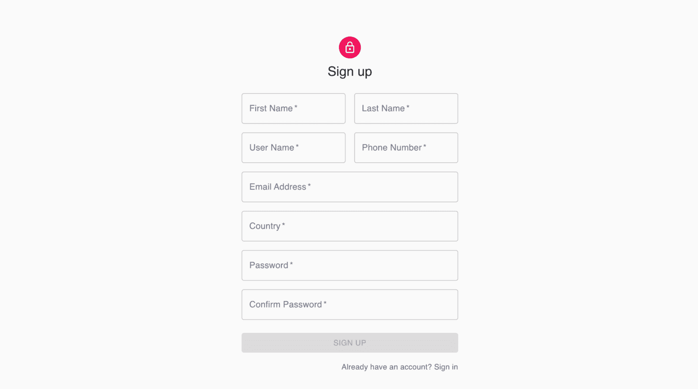

Sign up Form** 

**尝试填写错误的凭证或发送空请求，您将会得到错误。发送有效的请求。进入**开发者控制台>应用**。您将看到用户令牌存储在本地存储中。**

**

Chrome Developer Console** 

### **4.帐户部分:**

**为了构建账户页面，我们需要首先创建我们的**主页**，从这里我们将加载**账户部分**。转到`App.js`并更新以下路线:**

```
`// App.js

<Route exact path="/" component={home}/>`
```

**不要忘记重要的一点:**

```
`// App.js

import home from './pages/home';`
```

**创建一个名为`home.js`的新文件。这个文件将是我们应用程序的索引。Account 和 Todo 部分都是基于按钮的单击加载到此页面上的。**

**导入材料 UI 包、Axios 包、我们的自定义帐户、todo 组件和 auth 中间件。**

```
`// home.js

import React, { Component } from 'react';
import axios from 'axios';

import Account from '../components/account';
import Todo from '../components/todo';

import Drawer from '@material-ui/core/Drawer';
import AppBar from '@material-ui/core/AppBar';
import CssBaseline from '@material-ui/core/CssBaseline';
import Toolbar from '@material-ui/core/Toolbar';
import List from '@material-ui/core/List';
import Typography from '@material-ui/core/Typography';
import Divider from '@material-ui/core/Divider';
import ListItem from '@material-ui/core/ListItem';
import ListItemIcon from '@material-ui/core/ListItemIcon';
import ListItemText from '@material-ui/core/ListItemText';
import withStyles from '@material-ui/core/styles/withStyles';
import AccountBoxIcon from '@material-ui/icons/AccountBox';
import NotesIcon from '@material-ui/icons/Notes';
import Avatar from '@material-ui/core/avatar';
import ExitToAppIcon from '@material-ui/icons/ExitToApp';
import CircularProgress from '@material-ui/core/CircularProgress';

import { authMiddleWare } from '../util/auth'`
```

**我们将如下设置我们的绘制者宽度:**

```
`const drawerWidth = 240;`
```

**我们将在主页中添加以下样式:**

```
`const styles = (theme) => ({
	root: {
		display: 'flex'
	},
	appBar: {
		zIndex: theme.zIndex.drawer + 1
	},
	drawer: {
		width: drawerWidth,
		flexShrink: 0
	},
	drawerPaper: {
		width: drawerWidth
	},
	content: {
		flexGrow: 1,
		padding: theme.spacing(3)
	},
	avatar: {
		height: 110,
		width: 100,
		flexShrink: 0,
		flexGrow: 0,
		marginTop: 20
	},
	uiProgess: {
		position: 'fixed',
		zIndex: '1000',
		height: '31px',
		width: '31px',
		left: '50%',
		top: '35%'
	},
	toolbar: theme.mixins.toolbar
});`
```

**我们将创建一个名为 home 的类。这个类将有一个 API 调用来获取用户的个人资料图片、名字和姓氏。此外，它将有逻辑来选择显示哪个组件，或者 Todo 或者 Account:**

```
`class home extends Component {
	state = {
		render: false
	};

	loadAccountPage = (event) => {
		this.setState({ render: true });
	};

	loadTodoPage = (event) => {
		this.setState({ render: false });
	};

	logoutHandler = (event) => {
		localStorage.removeItem('AuthToken');
		this.props.history.push('/login');
	};

	constructor(props) {
		super(props);

		this.state = {
			firstName: '',
			lastName: '',
			profilePicture: '',
			uiLoading: true,
			imageLoading: false
		};
	}

	componentWillMount = () => {
		authMiddleWare(this.props.history);
		const authToken = localStorage.getItem('AuthToken');
		axios.defaults.headers.common = { Authorization: `${authToken}` };
		axios
			.get('/user')
			.then((response) => {
				console.log(response.data);
				this.setState({
					firstName: response.data.userCredentials.firstName,
					lastName: response.data.userCredentials.lastName,
					email: response.data.userCredentials.email,
					phoneNumber: response.data.userCredentials.phoneNumber,
					country: response.data.userCredentials.country,
					username: response.data.userCredentials.username,
					uiLoading: false,
					profilePicture: response.data.userCredentials.imageUrl
				});
			})
			.catch((error) => {
				if(error.response.status === 403) {
					this.props.history.push('/login')
				}
				console.log(error);
				this.setState({ errorMsg: 'Error in retrieving the data' });
			});
	};

	render() {
		const { classes } = this.props;		
		if (this.state.uiLoading === true) {
			return (
				<div className={classes.root}>
					{this.state.uiLoading && <CircularProgress size={150} className={classes.uiProgess} />}
				</div>
			);
		} else {
			return (
				<div className={classes.root}>
					<CssBaseline />
					<AppBar position="fixed" className={classes.appBar}>
						<Toolbar>
							<Typography variant="h6" noWrap>
								TodoApp
							</Typography>
						</Toolbar>
					</AppBar>
					<Drawer
						className={classes.drawer}
						variant="permanent"
						classes={{
							paper: classes.drawerPaper
						}}
					>
						<div className={classes.toolbar} />
						<Divider />
						<center>
							<Avatar src={this.state.profilePicture} className={classes.avatar} />
							<p>
								{' '}
								{this.state.firstName} {this.state.lastName}
							</p>
						</center>
						<Divider />
						<List>
							<ListItem button key="Todo" onClick={this.loadTodoPage}>
								<ListItemIcon>
									{' '}
									<NotesIcon />{' '}
								</ListItemIcon>
								<ListItemText primary="Todo" />
							</ListItem>

							<ListItem button key="Account" onClick={this.loadAccountPage}>
								<ListItemIcon>
									{' '}
									<AccountBoxIcon />{' '}
								</ListItemIcon>
								<ListItemText primary="Account" />
							</ListItem>

							<ListItem button key="Logout" onClick={this.logoutHandler}>
								<ListItemIcon>
									{' '}
									<ExitToAppIcon />{' '}
								</ListItemIcon>
								<ListItemText primary="Logout" />
							</ListItem>
						</List>
					</Drawer>

					<div>{this.state.render ? <Account /> : <Todo />}</div>
				</div>
			);
		}
	}
}`
```

**在代码中，您会看到使用了`authMiddleWare(this.props.history);`。这个中间件检查 authToken 是否为空。如果是，那么它会将用户推回到`login.js`。这是为了让我们的用户在没有注册或登录的情况下无法访问`/`路线。在该文件的末尾添加以下导出内容:**

```
`export default withStyles(styles)(home);` 
```

**现在你想知道`home.js`中的这段代码是做什么的吗？**

```
`<div>{this.state.render ? <Account /> : <Todo />}</div>`
```

**它检查我们在按钮点击时设置的渲染状态。让我们创建组件目录，并在该目录下创建两个文件:`account.js`和`todo.js`。**

**让我们创建一个名为 **util** 的目录，并在该目录下创建一个名为`auth.js`的文件。将以下代码复制粘贴到`auth.js`下:**

```
`export const authMiddleWare = (history) => {
    const authToken = localStorage.getItem('AuthToken');
    if(authToken === null){
        history.push('/login')
    }
}`
```

**暂时在`todo.js` 文件中，我们将只编写一个类来呈现文本**你好，我是托多**。我们将在下一部分讨论我们的待办事项:**

```
`import React, { Component } from 'react'

import withStyles from '@material-ui/core/styles/withStyles';
import Typography from '@material-ui/core/Typography';

const styles = ((theme) => ({
    content: {
        flexGrow: 1,
        padding: theme.spacing(3),
    },
    toolbar: theme.mixins.toolbar,
    })
);

class todo extends Component {
    render() {
        const { classes } = this.props;
        return (
            <main className={classes.content}>
            <div className={classes.toolbar} />
            <Typography paragraph>
                Hello I am todo
            </Typography>
            </main>
        )
    }
}

export default (withStyles(styles)(todo));`
```

**现在是会计部分的时间了。在我们的`account.js`中导入 Material UI、clsx、axios 和 authmiddleWare 实用程序。**

```
`// account.js

import React, { Component } from 'react';

import withStyles from '@material-ui/core/styles/withStyles';
import Typography from '@material-ui/core/Typography';
import CircularProgress from '@material-ui/core/CircularProgress';
import CloudUploadIcon from '@material-ui/icons/CloudUpload';
import { Card, CardActions, CardContent, Divider, Button, Grid, TextField } from '@material-ui/core';

import clsx from 'clsx';

import axios from 'axios';
import { authMiddleWare } from '../util/auth';`
```

**我们将向我们的帐户页面添加以下样式:**

```
`// account.js

const styles = (theme) => ({
	content: {
		flexGrow: 1,
		padding: theme.spacing(3)
	},
	toolbar: theme.mixins.toolbar,
	root: {},
	details: {
		display: 'flex'
	},
	avatar: {
		height: 110,
		width: 100,
		flexShrink: 0,
		flexGrow: 0
	},
	locationText: {
		paddingLeft: '15px'
	},
	buttonProperty: {
		position: 'absolute',
		top: '50%'
	},
	uiProgess: {
		position: 'fixed',
		zIndex: '1000',
		height: '31px',
		width: '31px',
		left: '50%',
		top: '35%'
	},
	progess: {
		position: 'absolute'
	},
	uploadButton: {
		marginLeft: '8px',
		margin: theme.spacing(1)
	},
	customError: {
		color: 'red',
		fontSize: '0.8rem',
		marginTop: 10
	},
	submitButton: {
		marginTop: '10px'
	}
});`
```

**我们将创建一个名为 account 的类组件。现在只需复制粘贴以下代码:**

```
`// account.js

class account extends Component {
	constructor(props) {
		super(props);

		this.state = {
			firstName: '',
			lastName: '',
			email: '',
			phoneNumber: '',
			username: '',
			country: '',
			profilePicture: '',
			uiLoading: true,
			buttonLoading: false,
			imageError: ''
		};
	}

	componentWillMount = () => {
		authMiddleWare(this.props.history);
		const authToken = localStorage.getItem('AuthToken');
		axios.defaults.headers.common = { Authorization: `${authToken}` };
		axios
			.get('/user')
			.then((response) => {
				console.log(response.data);
				this.setState({
					firstName: response.data.userCredentials.firstName,
					lastName: response.data.userCredentials.lastName,
					email: response.data.userCredentials.email,
					phoneNumber: response.data.userCredentials.phoneNumber,
					country: response.data.userCredentials.country,
					username: response.data.userCredentials.username,
					uiLoading: false
				});
			})
			.catch((error) => {
				if (error.response.status === 403) {
					this.props.history.push('/login');
				}
				console.log(error);
				this.setState({ errorMsg: 'Error in retrieving the data' });
			});
	};

	handleChange = (event) => {
		this.setState({
			[event.target.name]: event.target.value
		});
	};

	handleImageChange = (event) => {
		this.setState({
			image: event.target.files[0]
		});
	};

	profilePictureHandler = (event) => {
		event.preventDefault();
		this.setState({
			uiLoading: true
		});
		authMiddleWare(this.props.history);
		const authToken = localStorage.getItem('AuthToken');
		let form_data = new FormData();
		form_data.append('image', this.state.image);
		form_data.append('content', this.state.content);
		axios.defaults.headers.common = { Authorization: `${authToken}` };
		axios
			.post('/user/image', form_data, {
				headers: {
					'content-type': 'multipart/form-data'
				}
			})
			.then(() => {
				window.location.reload();
			})
			.catch((error) => {
				if (error.response.status === 403) {
					this.props.history.push('/login');
				}
				console.log(error);
				this.setState({
					uiLoading: false,
					imageError: 'Error in posting the data'
				});
			});
	};

	updateFormValues = (event) => {
		event.preventDefault();
		this.setState({ buttonLoading: true });
		authMiddleWare(this.props.history);
		const authToken = localStorage.getItem('AuthToken');
		axios.defaults.headers.common = { Authorization: `${authToken}` };
		const formRequest = {
			firstName: this.state.firstName,
			lastName: this.state.lastName,
			country: this.state.country
		};
		axios
			.post('/user', formRequest)
			.then(() => {
				this.setState({ buttonLoading: false });
			})
			.catch((error) => {
				if (error.response.status === 403) {
					this.props.history.push('/login');
				}
				console.log(error);
				this.setState({
					buttonLoading: false
				});
			});
	};

	render() {
		const { classes, ...rest } = this.props;
		if (this.state.uiLoading === true) {
			return (
				<main className={classes.content}>
					<div className={classes.toolbar} />
					{this.state.uiLoading && <CircularProgress size={150} className={classes.uiProgess} />}
				</main>
			);
		} else {
			return (
				<main className={classes.content}>
					<div className={classes.toolbar} />
					<Card {...rest} className={clsx(classes.root, classes)}>
						<CardContent>
							<div className={classes.details}>
								<div>
									<Typography className={classes.locationText} gutterBottom variant="h4">
										{this.state.firstName} {this.state.lastName}
									</Typography>
									<Button
										variant="outlined"
										color="primary"
										type="submit"
										size="small"
										startIcon={<CloudUploadIcon />}
										className={classes.uploadButton}
										onClick={this.profilePictureHandler}
									>
										Upload Photo
									</Button>
									<input type="file" onChange={this.handleImageChange} />

									{this.state.imageError ? (
										<div className={classes.customError}>
											{' '}
											Wrong Image Format || Supported Format are PNG and JPG
										</div>
									) : (
										false
									)}
								</div>
							</div>
							<div className={classes.progress} />
						</CardContent>
						<Divider />
					</Card>

					<br />
					<Card {...rest} className={clsx(classes.root, classes)}>
						<form autoComplete="off" noValidate>
							<Divider />
							<CardContent>
								<Grid container spacing={3}>
									<Grid item md={6} xs={12}>
										<TextField
											fullWidth
											label="First name"
											margin="dense"
											name="firstName"
											variant="outlined"
											value={this.state.firstName}
											onChange={this.handleChange}
										/>
									</Grid>
									<Grid item md={6} xs={12}>
										<TextField
											fullWidth
											label="Last name"
											margin="dense"
											name="lastName"
											variant="outlined"
											value={this.state.lastName}
											onChange={this.handleChange}
										/>
									</Grid>
									<Grid item md={6} xs={12}>
										<TextField
											fullWidth
											label="Email"
											margin="dense"
											name="email"
											variant="outlined"
											disabled={true}
											value={this.state.email}
											onChange={this.handleChange}
										/>
									</Grid>
									<Grid item md={6} xs={12}>
										<TextField
											fullWidth
											label="Phone Number"
											margin="dense"
											name="phone"
											type="number"
											variant="outlined"
											disabled={true}
											value={this.state.phoneNumber}
											onChange={this.handleChange}
										/>
									</Grid>
									<Grid item md={6} xs={12}>
										<TextField
											fullWidth
											label="User Name"
											margin="dense"
											name="userHandle"
											disabled={true}
											variant="outlined"
											value={this.state.username}
											onChange={this.handleChange}
										/>
									</Grid>
									<Grid item md={6} xs={12}>
										<TextField
											fullWidth
											label="Country"
											margin="dense"
											name="country"
											variant="outlined"
											value={this.state.country}
											onChange={this.handleChange}
										/>
									</Grid>
								</Grid>
							</CardContent>
							<Divider />
							<CardActions />
						</form>
					</Card>
					<Button
						color="primary"
						variant="contained"
						type="submit"
						className={classes.submitButton}
						onClick={this.updateFormValues}
						disabled={
							this.state.buttonLoading ||
							!this.state.firstName ||
							!this.state.lastName ||
							!this.state.country
						}
					>
						Save details
						{this.state.buttonLoading && <CircularProgress size={30} className={classes.progess} />}
					</Button>
				</main>
			);
		}
	}
}`
```

**在该文件的末尾添加以下导出内容:**

```
`export default withStyles(styles)(account);` 
```

**在`account.js`中，使用了许多组件。首先让我们看看我们的应用程序是什么样子的。之后我会解释所有使用的组件以及为什么使用它们。**

**转到浏览器，如果您的令牌过期，它会将您重定向到`login`页面。添加您的详细信息，然后再次登录。完成后，转到“Account”选项卡，您会发现以下用户界面:**

**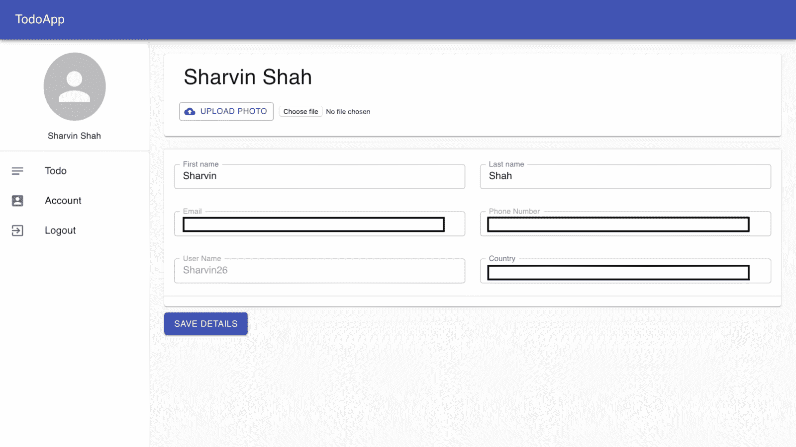

Account Section** 

**帐户部分有 3 个处理程序:**

1.  ****componentWillMount** :这是 React 内置的生命周期方法。我们使用它在渲染生命周期之前加载数据，并更新我们的状态值。**
2.  **这是我们正在使用的自定义处理程序，当我们的用户点击上传照片按钮时，它会将数据发送到服务器，并重新加载页面以显示用户的新个人资料图片。**
3.  ****updateFormValues:** 这也是我们用来更新用户详细信息的自定义处理程序。在这里，用户可以更新他们的名字、姓氏和国家。我们不允许电子邮件和用户名更新，因为我们的后端逻辑依赖于这些关键。**

**除了这 3 个处理程序之外，它是一个顶部带有样式的表单页面。以下是视图文件夹中到目前为止的目录结构:**

```
`+-- public 
+-- src
|   +-- components
|   +-- +-- todo.js
|   +-- +-- account.js
|   +-- pages
|   +-- +-- home.js
|   +-- +-- login.js
|   +-- +-- signup.js
|   +-- util
|   +-- +-- auth.js 
|   +-- README.md
|   +-- package-lock.json
|   +-- package.json
|   +-- .gitignore`
```

**至此，我们已经完成了我们的客户控制面板。现在去喝杯咖啡，休息一下，在下一部分，我们将建立 Todo 仪表板。**

## **第 4 部分:待办事项仪表板**

**在这个部分**，**我们将为 Todos 仪表盘的这些功能开发用户界面:**

1.  ****添加待办事项:****
2.  ****获取所有待办事项:****
3.  ****删除待办事宜****
4.  **编辑全部**
5.  ****获取待办事宜****
6.  ****应用主题****

**本节中实现的 Todo 仪表板代码可以在这个[提交](https://github.com/Sharvin26/TodoApp/tree/3799980aa13eeb8d313e17d83aa3032748aedb00/view)中找到。**

**转到**组件**目录下的`todos.js`。将以下导入添加到现有导入中:**

```
`import Button from '@material-ui/core/Button';
import Dialog from '@material-ui/core/Dialog';
import AddCircleIcon from '@material-ui/icons/AddCircle';
import AppBar from '@material-ui/core/AppBar';
import Toolbar from '@material-ui/core/Toolbar';
import IconButton from '@material-ui/core/IconButton';
import CloseIcon from '@material-ui/icons/Close';
import Slide from '@material-ui/core/Slide';
import TextField from '@material-ui/core/TextField';
import Grid from '@material-ui/core/Grid';
import Card from '@material-ui/core/Card';
import CardActions from '@material-ui/core/CardActions';
import CircularProgress from '@material-ui/core/CircularProgress';
import CardContent from '@material-ui/core/CardContent';
import MuiDialogTitle from '@material-ui/core/DialogTitle';
import MuiDialogContent from '@material-ui/core/DialogContent';

import axios from 'axios';
import dayjs from 'dayjs';
import relativeTime from 'dayjs/plugin/relativeTime';
import { authMiddleWare } from '../util/auth';`
```

**我们还需要在现有的样式组件中添加以下 CSS 元素:**

```
`const styles = (theme) => ({
	.., // Existing CSS elements
	title: {
		marginLeft: theme.spacing(2),
		flex: 1
	},
	submitButton: {
		display: 'block',
		color: 'white',
		textAlign: 'center',
		position: 'absolute',
		top: 14,
		right: 10
	},
	floatingButton: {
		position: 'fixed',
		bottom: 0,
		right: 0
	},
	form: {
		width: '98%',
		marginLeft: 13,
		marginTop: theme.spacing(3)
	},
	toolbar: theme.mixins.toolbar,
	root: {
		minWidth: 470
	},
	bullet: {
		display: 'inline-block',
		margin: '0 2px',
		transform: 'scale(0.8)'
	},
	pos: {
		marginBottom: 12
	},
	uiProgess: {
		position: 'fixed',
		zIndex: '1000',
		height: '31px',
		width: '31px',
		left: '50%',
		top: '35%'
	},
	dialogeStyle: {
		maxWidth: '50%'
	},
	viewRoot: {
		margin: 0,
		padding: theme.spacing(2)
	},
	closeButton: {
		position: 'absolute',
		right: theme.spacing(1),
		top: theme.spacing(1),
		color: theme.palette.grey[500]
	}
});`
```

**我们将为弹出对话框添加过渡:**

```
`const Transition = React.forwardRef(function Transition(props, ref) {
	return <Slide direction="up" ref={ref} {...props} />;
});`
```

**移除现有的 todo 类，并复制粘贴以下类:**

```
`class todo extends Component {
	constructor(props) {
		super(props);

		this.state = {
			todos: '',
			title: '',
			body: '',
			todoId: '',
			errors: [],
			open: false,
			uiLoading: true,
			buttonType: '',
			viewOpen: false
		};

		this.deleteTodoHandler = this.deleteTodoHandler.bind(this);
		this.handleEditClickOpen = this.handleEditClickOpen.bind(this);
		this.handleViewOpen = this.handleViewOpen.bind(this);
	}

	handleChange = (event) => {
		this.setState({
			[event.target.name]: event.target.value
		});
	};

	componentWillMount = () => {
		authMiddleWare(this.props.history);
		const authToken = localStorage.getItem('AuthToken');
		axios.defaults.headers.common = { Authorization: `${authToken}` };
		axios
			.get('/todos')
			.then((response) => {
				this.setState({
					todos: response.data,
					uiLoading: false
				});
			})
			.catch((err) => {
				console.log(err);
			});
	};

	deleteTodoHandler(data) {
		authMiddleWare(this.props.history);
		const authToken = localStorage.getItem('AuthToken');
		axios.defaults.headers.common = { Authorization: `${authToken}` };
		let todoId = data.todo.todoId;
		axios
			.delete(`todo/${todoId}`)
			.then(() => {
				window.location.reload();
			})
			.catch((err) => {
				console.log(err);
			});
	}

	handleEditClickOpen(data) {
		this.setState({
			title: data.todo.title,
			body: data.todo.body,
			todoId: data.todo.todoId,
			buttonType: 'Edit',
			open: true
		});
	}

	handleViewOpen(data) {
		this.setState({
			title: data.todo.title,
			body: data.todo.body,
			viewOpen: true
		});
	}

	render() {
		const DialogTitle = withStyles(styles)((props) => {
			const { children, classes, onClose, ...other } = props;
			return (
				<MuiDialogTitle disableTypography className={classes.root} {...other}>
					<Typography variant="h6">{children}</Typography>
					{onClose ? (
						<IconButton aria-label="close" className={classes.closeButton} onClick={onClose}>
							<CloseIcon />
						</IconButton>
					) : null}
				</MuiDialogTitle>
			);
		});

		const DialogContent = withStyles((theme) => ({
			viewRoot: {
				padding: theme.spacing(2)
			}
		}))(MuiDialogContent);

		dayjs.extend(relativeTime);
		const { classes } = this.props;
		const { open, errors, viewOpen } = this.state;

		const handleClickOpen = () => {
			this.setState({
				todoId: '',
				title: '',
				body: '',
				buttonType: '',
				open: true
			});
		};

		const handleSubmit = (event) => {
			authMiddleWare(this.props.history);
			event.preventDefault();
			const userTodo = {
				title: this.state.title,
				body: this.state.body
			};
			let options = {};
			if (this.state.buttonType === 'Edit') {
				options = {
					url: `/todo/${this.state.todoId}`,
					method: 'put',
					data: userTodo
				};
			} else {
				options = {
					url: '/todo',
					method: 'post',
					data: userTodo
				};
			}
			const authToken = localStorage.getItem('AuthToken');
			axios.defaults.headers.common = { Authorization: `${authToken}` };
			axios(options)
				.then(() => {
					this.setState({ open: false });
					window.location.reload();
				})
				.catch((error) => {
					this.setState({ open: true, errors: error.response.data });
					console.log(error);
				});
		};

		const handleViewClose = () => {
			this.setState({ viewOpen: false });
		};

		const handleClose = (event) => {
			this.setState({ open: false });
		};

		if (this.state.uiLoading === true) {
			return (
				<main className={classes.content}>
					<div className={classes.toolbar} />
					{this.state.uiLoading && <CircularProgress size={150} className={classes.uiProgess} />}
				</main>
			);
		} else {
			return (
				<main className={classes.content}>
					<div className={classes.toolbar} />

					<IconButton
						className={classes.floatingButton}
						color="primary"
						aria-label="Add Todo"
						onClick={handleClickOpen}
					>
						<AddCircleIcon style={{ fontSize: 60 }} />
					</IconButton>
					<Dialog fullScreen open={open} onClose={handleClose} TransitionComponent={Transition}>
						<AppBar className={classes.appBar}>
							<Toolbar>
								<IconButton edge="start" color="inherit" onClick={handleClose} aria-label="close">
									<CloseIcon />
								</IconButton>
								<Typography variant="h6" className={classes.title}>
									{this.state.buttonType === 'Edit' ? 'Edit Todo' : 'Create a new Todo'}
								</Typography>
								<Button
									autoFocus
									color="inherit"
									onClick={handleSubmit}
									className={classes.submitButton}
								>
									{this.state.buttonType === 'Edit' ? 'Save' : 'Submit'}
								</Button>
							</Toolbar>
						</AppBar>

						<form className={classes.form} noValidate>
							<Grid container spacing={2}>
								<Grid item xs={12}>
									<TextField
										variant="outlined"
										required
										fullWidth
										id="todoTitle"
										label="Todo Title"
										name="title"
										autoComplete="todoTitle"
										helperText={errors.title}
										value={this.state.title}
										error={errors.title ? true : false}
										onChange={this.handleChange}
									/>
								</Grid>
								<Grid item xs={12}>
									<TextField
										variant="outlined"
										required
										fullWidth
										id="todoDetails"
										label="Todo Details"
										name="body"
										autoComplete="todoDetails"
										multiline
										rows={25}
										rowsMax={25}
										helperText={errors.body}
										error={errors.body ? true : false}
										onChange={this.handleChange}
										value={this.state.body}
									/>
								</Grid>
							</Grid>
						</form>
					</Dialog>

					<Grid container spacing={2}>
						{this.state.todos.map((todo) => (
							<Grid item xs={12} sm={6}>
								<Card className={classes.root} variant="outlined">
									<CardContent>
										<Typography variant="h5" component="h2">
											{todo.title}
										</Typography>
										<Typography className={classes.pos} color="textSecondary">
											{dayjs(todo.createdAt).fromNow()}
										</Typography>
										<Typography variant="body2" component="p">
											{`${todo.body.substring(0, 65)}`}
										</Typography>
									</CardContent>
									<CardActions>
										<Button size="small" color="primary" onClick={() => this.handleViewOpen({ todo })}>
											{' '}
											View{' '}
										</Button>
										<Button size="small" color="primary" onClick={() => this.handleEditClickOpen({ todo })}>
											Edit
										</Button>
										<Button size="small" color="primary" onClick={() => this.deleteTodoHandler({ todo })}>
											Delete
										</Button>
									</CardActions>
								</Card>
							</Grid>
						))}
					</Grid>

					<Dialog
						onClose={handleViewClose}
						aria-labelledby="customized-dialog-title"
						open={viewOpen}
						fullWidth
						classes={{ paperFullWidth: classes.dialogeStyle }}
					>
						<DialogTitle id="customized-dialog-title" onClose={handleViewClose}>
							{this.state.title}
						</DialogTitle>
						<DialogContent dividers>
							<TextField
								fullWidth
								id="todoDetails"
								name="body"
								multiline
								readonly
								rows={1}
								rowsMax={25}
								value={this.state.body}
								InputProps={{
									disableUnderline: true
								}}
							/>
						</DialogContent>
					</Dialog>
				</main>
			);
		}
	}
}`
```

**在该文件的末尾添加以下导出内容:**

```
`export default withStyles(styles)(todo);` 
```

**首先，我们将了解我们的 UI 是如何工作的，然后我们将了解代码。转到浏览器，您将获得以下用户界面:**

**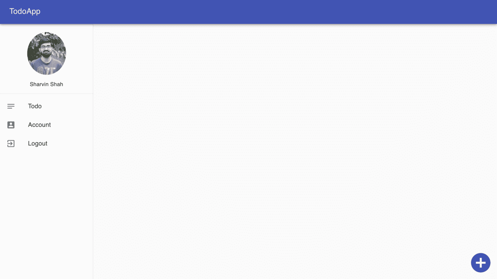

Todo Dashboard** 

**单击右下角的添加按钮，您将看到以下屏幕:**

**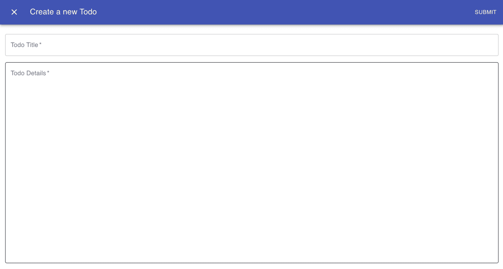

Add Todo** 

**添加待办事项标题和详细信息，然后按提交按钮。您将看到以下屏幕:**

**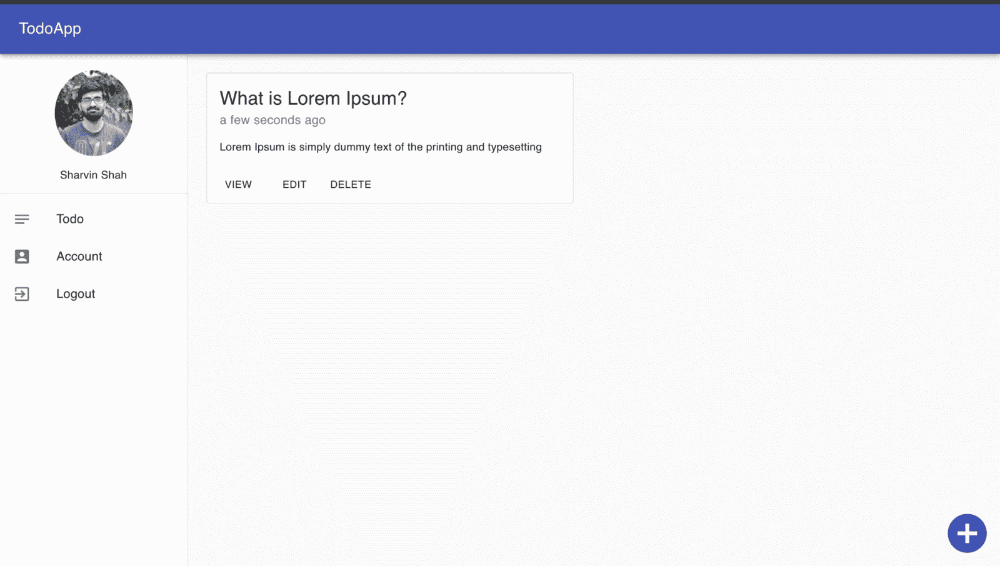

Todo Dashboard** 

**之后，点击查看按钮，您将能够看到待办事项的全部详细信息:**

**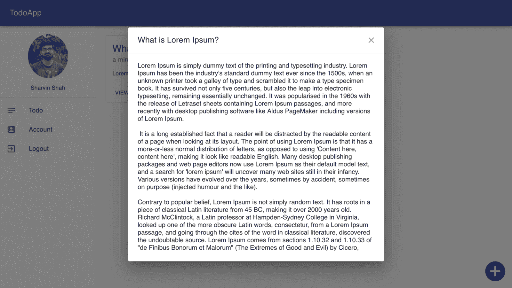

View Single Todo** 

**点击编辑按钮，您将能够编辑待办事项:**

**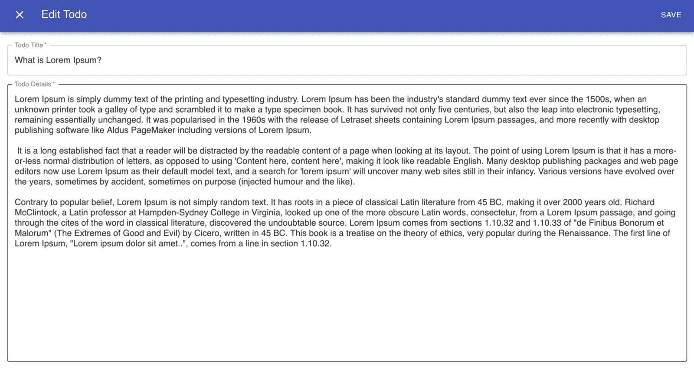

Edit Todo** 

**点击删除按钮，你就可以删除待办事项了。现在我们知道了 Dashboard 是如何工作的，我们将了解其中使用的组件。**

****1。添加待办事项:**为了实现添加待办事项，我们将使用材质 UI 的[对话组件](https://material-ui.com/components/dialogs/#full-screen-dialogs)。该组件实现了挂钩功能。我们正在使用这些类，所以我们将删除这些功能。**

```
`// This sets the state to open and buttonType flag to add:
const handleClickOpen = () => {
      this.setState({
           todoId: '',
           title: '',
           body: '',
           buttonType: '',
           open: true
     });
};

// This sets the state to close:
const handleClose = (event) => {
      this.setState({ open: false });
};`
```

**除此之外，我们还将更改添加待办事项按钮的位置。**

```
`// Position our button
floatingButton: {
    position: 'fixed',
    bottom: 0,
    right: 0
},

<IconButton className={classes.floatingButton} ... >`
```

**现在我们将在这个对话中用一个表单替换列表标签。它将帮助我们添加新的待办事项。**

```
`// Show Edit or Save depending on buttonType state
{this.state.buttonType === 'Edit' ? 'Save' : 'Submit'}

// Our Form to add a todo
<form className={classes.form} noValidate>
	<Grid container spacing={2}>
		<Grid item xs={12}>
        // TextField here
        </Grid>
        <Grid item xs={12}>
        // TextField here
        </Grid>
    </Grid>
</form>`
```

*****handle submit*****由读取`buttonType`状态的逻辑组成。如果状态是一个空字符串`(“”)`，那么它将在 Add Todo API 上发布。如果状态是一个`Edit`，那么在这种情况下，它将更新编辑待办事项。****

******2。获取 Todos:** 为了显示 Todos，我们将使用`Grid container`，并在其中放置`Grid item`。在其中，我们将使用一个`Card`组件来显示数据。****

```
**`<Grid container spacing={2}>
    {this.state.todos.map((todo) => (
	<Grid item xs={12} sm={6}>
	<Card className={classes.root} variant="outlined">
	    <CardContent>
        // Here will show Todo with view, edit and delete button
        </CardContent>
    </Card>
    </Grid>))}
</Grid>`**
```

****当 API 在列表中发送待办事项时，我们使用映射来显示它们。我们将使用 componentWillMount 生命周期在执行渲染之前获取和设置状态。有 3 个按钮(**查看、编辑和删除**)，所以我们需要 3 个处理程序来处理单击按钮时的操作。我们将在相应的小节中了解这些按钮。****

******3。编辑待办事项:**对于编辑待办事项，我们重用了在添加待办事项中使用的对话框弹出代码。为了区分按钮点击，我们使用了一个`buttonType`状态。对于添加待办事项，`buttonType`状态为`(“”)`，而对于编辑待办事项，状态为`Edit`。****

```
**`handleEditClickOpen(data) {
	this.setState({
		..,
		buttonType: 'Edit',
		..
	});
}`**
```

****在`handleSubmit`方法中，我们读取`buttonType`状态，然后相应地发送请求。****

******4。Delete Todo:** 当点击这个按钮时，我们将 Todo 对象发送到 deleteTodoHandler，然后它将请求进一步发送到后端。****

```
**`<Button size="small" onClick={() => this.deleteTodoHandler({ todo })}>Delete</Button>`**
```

******5。View Todo:** 在显示数据时，我们将其截断，这样用户就可以对 Todo 的内容有所了解。但是如果用户想了解更多，他们需要点击查看按钮。****

****为此，我们将使用[定制对话](https://material-ui.com/components/dialogs/#customized-dialogs)。在其中，我们使用 DialogTitle 和 DialogContent。它显示我们的标题和内容。在 DialougeContent 中，我们将使用表单来显示用户发布的内容。(这是我发现有许多解决方案的一种，您可以尝试其他解决方案。)****

```
**`// This is used to remove the underline of the Form
InputProps={{
       disableUnderline: true
}}

// This is used so that user cannot edit the data
readonly`**
```

******6。申请主题:**这是我们申请的最后一步。我们将在应用程序中应用一个主题。为此，我们使用来自材质 UI 的`createMuiTheme`和`ThemeProvider`。将下面的代码复制粘贴到`App.js`中:****

```
**`import { ThemeProvider as MuiThemeProvider } from '@material-ui/core/styles';
import createMuiTheme from '@material-ui/core/styles/createMuiTheme';

const theme = createMuiTheme({
	palette: {
		primary: {
			light: '#33c9dc',
			main: '#FF5722',
			dark: '#d50000',
			contrastText: '#fff'
		}
	}
});

function App() {
	return (
        <MuiThemeProvider theme={theme}>
        // Router and switch will be here.
        </MuiThemeProvider>
    );
}`**
```

****我们错过了将主题应用到`CardActions`中的`todo.js`按钮。为“查看、编辑和删除”按钮添加颜色标记。****

```
**`<Button size="small" color="primary" ...>`**
```

****去浏览器看看，你会发现除了 app 是不同的颜色外，一切都是一样的。****

****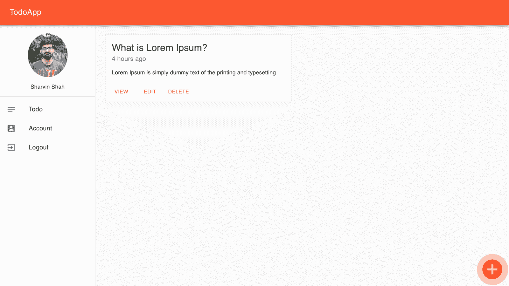

TodoApp after applying theme**** 

****我们完事了。我们已经使用 ReactJS 和 Firebase 构建了一个 TodoApp。如果你已经一路走到这一步，那么非常祝贺你取得这一成就。****

> ****请随时在 [Twitter](https://twitter.com/sharvinshah26) 和 [Github](https://github.com/Sharvin26) 上联系我。****