# 如何用 React & GraphQL(沙丘世界版)创建全栈 Yelp 克隆

> 原文：<https://www.freecodecamp.org/news/how-to-create-a-full-stack-yelp-clone-with-react-graphql/>

> 我绝不能恐惧。恐惧是思维的杀手。恐惧是带来彻底毁灭的小小死亡。我会面对我的恐惧。我将允许它越过我，穿过我。当它过去的时候，我会打开内在的眼睛去看它的路径。恐惧消失的地方将一无所有。只有我会留下。
> ——《对抗恐惧的长篇大论》，弗兰克·赫伯特，沙丘

你可能想知道，“恐惧与反应应用有什么关系？”首先，反应应用程序没有什么可怕的。事实上，在这个特殊的应用中，我们禁止恐惧。这不是很好吗？

现在你已经准备好无所畏惧了，让我们来讨论一下我们的应用程序。这是 Yelp 的一个迷你克隆，用户不是评论餐馆，而是评论经典科幻系列 [Dune](https://en.wikipedia.org/wiki/Dune_(franchise)) 中的星球。(为什么？因为有部新的沙丘电影要上映了...但是回到主要的一点。)

为了构建我们的全栈应用，我们将使用让我们生活更轻松的技术。

1.  [React](https://reactjs.org/) :直观的、组合的前端框架，因为我们的大脑喜欢组合东西。
2.  [GraphQL](https://graphql.org/) :你可能听过很多 GraphQL 牛逼的理由。到目前为止，最重要的一项是 ****开发人员的生产力和幸福度**** 。
3.  Hasura :在 30 秒内，在 Postgres 数据库上建立一个自动生成的 GraphQL API。
4.  Heroku :托管我们的数据库。

## GraphQL 如何给我快乐？

我看你是个多疑的人。但是，只要你花点时间在 graph QL(graph QL 游乐场)上，你很可能就会明白了。

与笨重的 REST 端点的老方法相比，使用 GraphQL 对于前端开发人员来说轻而易举。GraphQL 为您提供了一个监听所有问题的单一端点...我是说询问。它是如此伟大的倾听者，你可以告诉它你想要什么，它就会给你什么，不多也不少。

对这种治疗体验感到兴奋吗？让我们深入教程，这样你就可以尽快尝试！

？？如果你想继续编码，这里有回购协议 。

# ****P** 美术 **1: S** 搜索**

[https://www.youtube.com/embed/lrYo_n-9LM8?feature=oembed](https://www.youtube.com/embed/lrYo_n-9LM8?feature=oembed)

## ****S**TEP**1 :D**e ploy to Heroku**

每一段美好旅程的第一步都是坐下来，品着热茶，心平气和地啜饮。一旦我们完成了，我们就可以从 [Hasura 网站](http://hasura.io/)部署到 Heroku。这将为我们提供所需的一切:一个 Postgres 数据库、我们的 Hasura GraphQL 引擎以及旅途中的一些小吃。

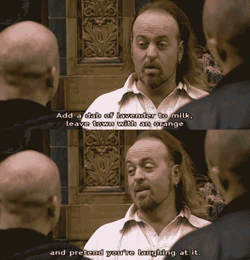

Not at all a Dune reference

## 步骤 2:创建行星表

我们的用户想要评论行星。因此，我们通过 Hasura 控制台创建一个 Postgres 表来存储我们的行星数据。值得注意的是邪恶的星球 Giedi Prime，它以其非常规的美食吸引了人们的注意。

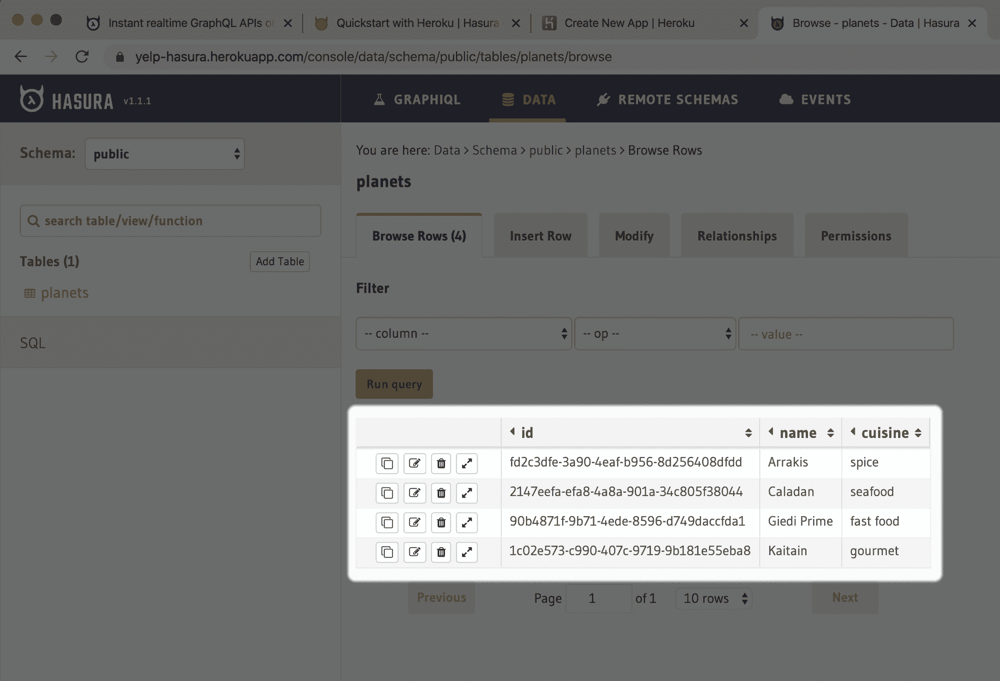

同时在 GraphQL 选项卡中:Hasura 已经自动生成了我们的 graph QL 模式！在这里玩探险家？？

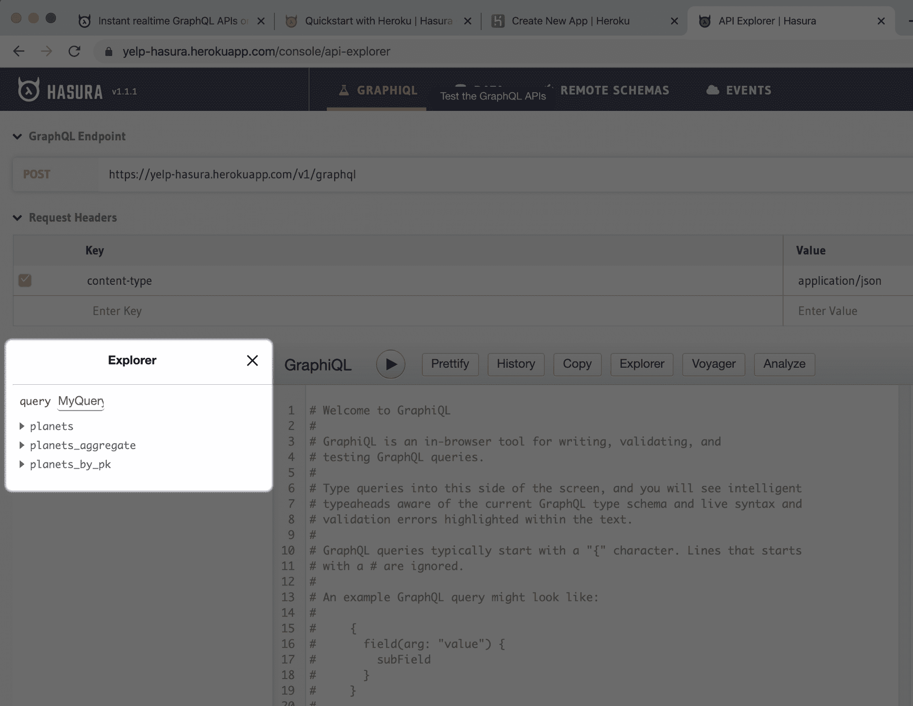

## ****S** 步 **3: C** reate React app**

我们的应用程序需要一个 UI，所以我们创建了一个 React 应用程序，并为 GraphQL 请求、路由和样式安装了一些库。(确保首先安装了[节点](https://nodejs.org/)。)

```
> npx create-react-app melange
> cd melange
> npm install graphql @apollo/client react-router-dom @emotion/styled @emotion/core
> npm start
```

Terminal

## **S** tep **4: S** 和 up Apollo Client

Apollo 客户端将帮助我们处理 GraphQL 网络请求和缓存，这样我们就可以避免那些繁重的工作。我们还进行第一次查询，并列出我们的行星！我们的应用程序开始成形了。

```
import React from "react";
import { render } from "react-dom";
import { ApolloProvider } from "@apollo/client";
import { ApolloClient, HttpLink, InMemoryCache } from "@apollo/client";
import Planets from "./components/Planets";

const client = new ApolloClient({
  cache: new InMemoryCache(),
  link: new HttpLink({
    uri: "[YOUR HASURA GRAPHQL ENDPOINT]",
  }),
});

const App = () => (
  <ApolloProvider client={client}>
    <Planets />
  </ApolloProvider>
);

render(<App />, document.getElementById("root"));
```

index.js

在将 GraphQL 查询复制粘贴到代码中之前，我们在 Hasura 控制台中测试了它。

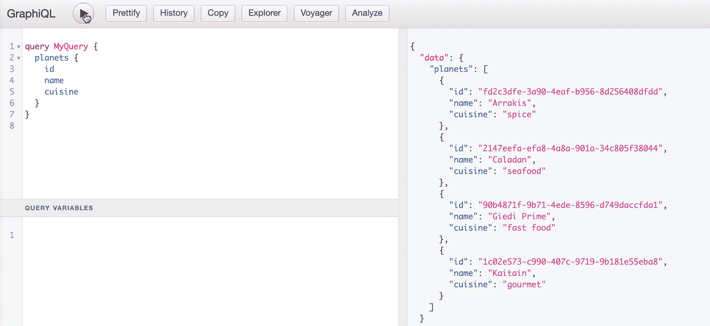

```
import React from "react";
import { useQuery, gql } from "@apollo/client";

const PLANETS = gql`
  {
    planets {
      id
      name
      cuisine
    }
  }
`;

const Planets = ({ newPlanets }) => {
  const { loading, error, data } = useQuery(PLANETS);

  if (loading) return <p>Loading ...</p>;
  if (error) return <p>Error :(</p>;

  return data.planets.map(({id, name, cuisine}) => (
  	<div key={id}>
      <p>
      	{name} | {cuisine}
      </p>
    </div>
  ));
};

export default Planets;
```

Planets.js

## ****S**TEP**5:S**tyle list**

我们的星球列表很好，但它需要用[情感](https://emotion.sh/)进行一点改造(完整样式见[回购](https://github.com/hasura/yelp-clone-react))。

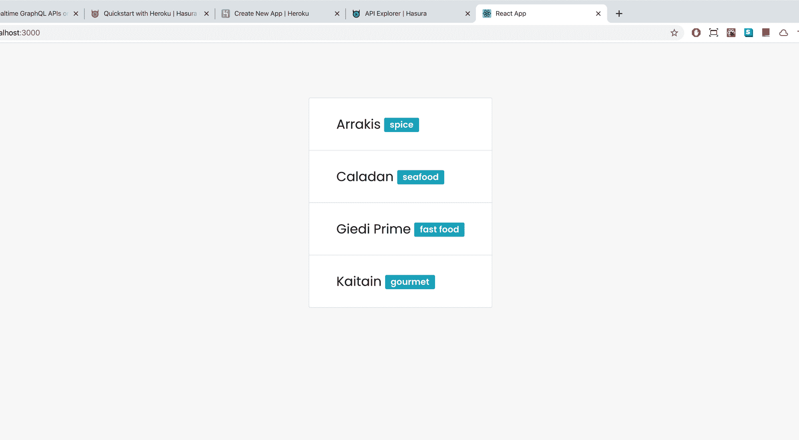

## ****S**TEP**6:S**earch form&state**

我们的用户希望搜索行星并按名称排序。所以我们添加了一个搜索表单，用搜索字符串查询我们的端点，并将结果传递给`Planets`来更新我们的星球列表。我们还使用 [React 钩子](https://reactjs.org/docs/hooks-reference.html)来管理我们的应用程序状态。

```
import React, { useState } from "react";
import { useLazyQuery, gql } from "@apollo/client";
import Search from "./Search";
import Planets from "./Planets";

const SEARCH = gql`
  query Search($match: String) {
    planets(order_by: { name: asc }, where: { name: { _ilike: $match } }) {
      name
      cuisine
      id
    }
  }
`;

const PlanetSearch = () => {
  const [inputVal, setInputVal] = useState("");
  const [search, { loading, error, data }] = useLazyQuery(SEARCH);

  return (
    <div>
      <Search
        inputVal={inputVal}
        onChange={(e) => setInputVal(e.target.value)}
        onSearch={() => search({ variables: { match: `%${inputVal}%` } })}
      />
      <Planets newPlanets={data ? data.planets : null} />
    </div>
  );
};

export default PlanetSearch;
```

PlanetSearch.js

```
import React from "react";
import { useQuery, gql } from "@apollo/client";
import { List, ListItem } from "./shared/List";
import { Badge } from "./shared/Badge";

const PLANETS = gql`
  {
    planets {
      id
      name
      cuisine
    }
  }
`;

const Planets = ({ newPlanets }) => {
  const { loading, error, data } = useQuery(PLANETS);

  const renderPlanets = (planets) => {
    return planets.map(({ id, name, cuisine }) => (
      <ListItem key={id}>
        {name} <Badge>{cuisine}</Badge>
      </ListItem>
    ));
  };

  if (loading) return <p>Loading ...</p>;
  if (error) return <p>Error :(</p>;

  return <List>{renderPlanets(newPlanets || data.planets)}</List>;
};

export default Planets;
```

Planets.js

```
import React from "react";
import styled from "@emotion/styled";
import { Input, Button } from "./shared/Form";

const SearchForm = styled.div`
  display: flex;
  align-items: center;
  > button {
    margin-left: 1rem;
  }
`;

const Search = ({ inputVal, onChange, onSearch }) => {
  return (
    <SearchForm>
      <Input value={inputVal} onChange={onChange} />
      <Button onClick={onSearch}>Search</Button>
    </SearchForm>
  );
};

export default Search;
```

Search.js

```
import React from "react";
import { render } from "react-dom";
import { ApolloProvider } from "@apollo/client";
import { ApolloClient, HttpLink, InMemoryCache } from "@apollo/client";
import PlanetSearch from "./components/PlanetSearch";
import Logo from "./components/shared/Logo";
import "./index.css";

const client = new ApolloClient({
  cache: new InMemoryCache(),
  link: new HttpLink({
    uri: "[YOUR HASURA GRAPHQL ENDPOINT]",
  }),
});

const App = () => (
  <ApolloProvider client={client}>
    <Logo />
    <PlanetSearch />
  </ApolloProvider>
);

render(<App />, document.getElementById("root"));
```

index.js

## ****S** tep **7: B** e 傲**

我们已经实现了我们的星球列表和搜索功能！我们深情地凝视着自己的作品，一起自拍几张，然后继续评论。

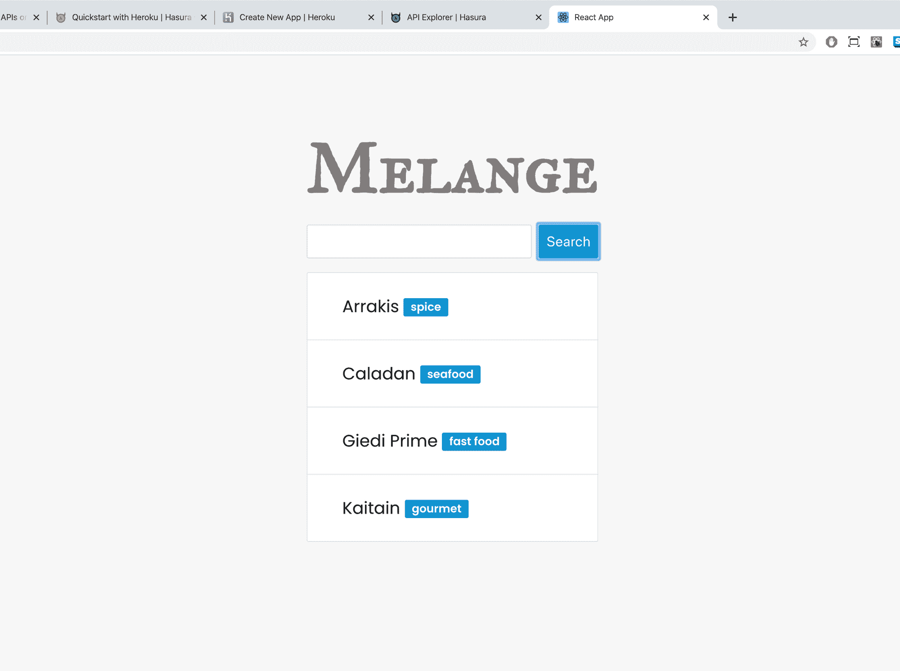

# ****P** 美术 **2: L** 五评论**

[https://www.youtube.com/embed/3kzXxc1XvRw?feature=oembed](https://www.youtube.com/embed/3kzXxc1XvRw?feature=oembed)

## ****S**TEP**1:C**reate 点评表**

我们的用户将访问这些星球，并写下他们的经历。我们通过 Hasura 控制台为我们的审查数据创建一个表。

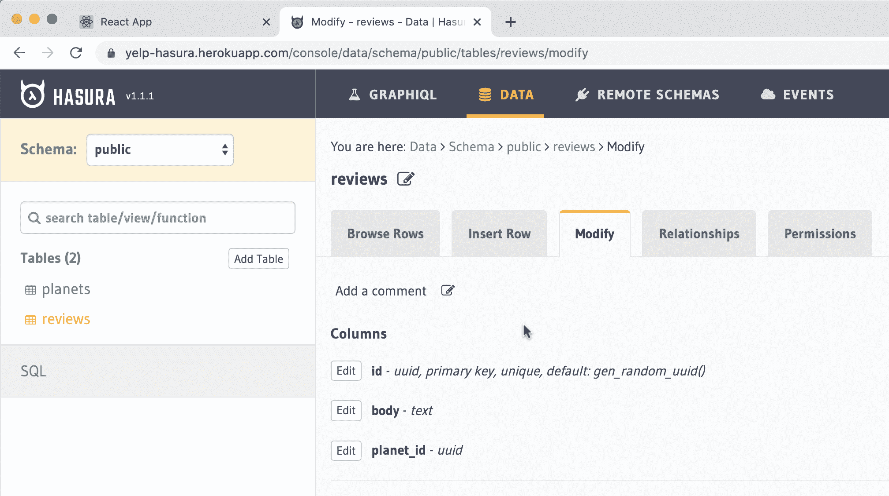

我们将一个外键从`planet_id`列添加到`planets`表的`id`列，以指示`reviews`的`planet_id`必须与`planets`的`id`匹配。

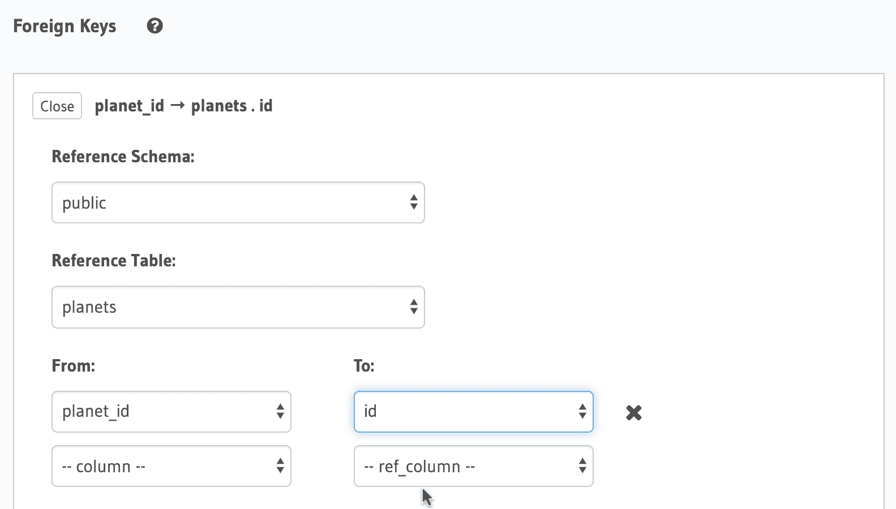

## ****S** tep **2: T** 机架关系**

每个星球有多个评论，而每个评论有一个星球:一对多关系。我们通过 Hasura 控制台创建并跟踪这种关系，因此它可以在我们的 GraphQL 模式中公开。

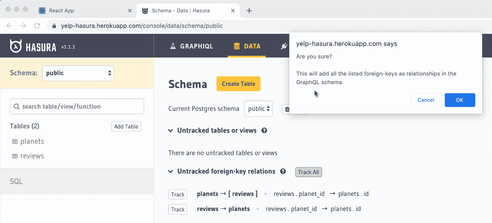

现在我们可以在浏览器中查询每个星球的评论了！

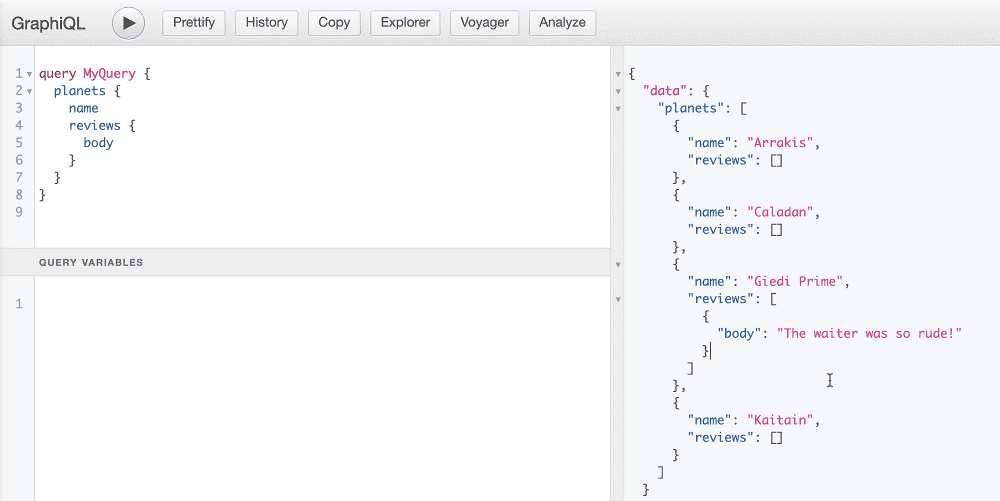

## ****S**TEP**3:S**et up routing**

我们希望能够点击一个星球，并在单独的页面上查看其评论。我们用 React Router 设置路由，并在 planet 页面上列出评论。

```
import React from "react";
import { render } from "react-dom";
import { ApolloProvider } from "@apollo/client";
import { ApolloClient, HttpLink, InMemoryCache } from "@apollo/client";
import { BrowserRouter, Switch, Route } from "react-router-dom";
import PlanetSearch from "./components/PlanetSearch";
import Planet from "./components/Planet";
import Logo from "./components/shared/Logo";
import "./index.css";

const client = new ApolloClient({
  cache: new InMemoryCache(),
  link: new HttpLink({
    uri: "[YOUR HASURA GRAPHQL ENDPOINT]",
  }),
});

const App = () => (
  <BrowserRouter>
    <ApolloProvider client={client}>
      <Logo />
      <Switch>
        <Route path="/planet/:id" component={Planet} />
        <Route path="/" component={PlanetSearch} />
      </Switch>
    </ApolloProvider>
  </BrowserRouter>
);

render(<App />, document.getElementById("root"));
```

index.js

```
import React from "react";
import { useQuery, gql } from "@apollo/client";
import { List, ListItem } from "./shared/List";
import { Badge } from "./shared/Badge";

const PLANET = gql`
  query Planet($id: uuid!) {
    planets_by_pk(id: $id) {
      id
      name
      cuisine
      reviews {
        id
        body
      }
    }
  }
`;

const Planet = ({
  match: {
    params: { id },
  },
}) => {
  const { loading, error, data } = useQuery(PLANET, {
    variables: { id },
  });

  if (loading) return <p>Loading ...</p>;
  if (error) return <p>Error :(</p>;

  const { name, cuisine, reviews } = data.planets_by_pk;

  return (
    <div>
      <h3>
        {name} <Badge>{cuisine}</Badge>
      </h3>
      <List>
        {reviews.map((review) => (
          <ListItem key={review.id}>{review.body}</ListItem>
        ))}
      </List>
    </div>
  );
};

export default Planet;
```

Planet.js

```
import React from "react";
import { useQuery, gql } from "@apollo/client";
import { Link } from "react-router-dom";
import { List, ListItemWithLink } from "./shared/List";
import { Badge } from "./shared/Badge";

const PLANETS = gql`
  {
    planets {
      id
      name
      cuisine
    }
  }
`;

const Planets = ({ newPlanets }) => {
  const { loading, error, data } = useQuery(PLANETS);

  const renderPlanets = (planets) => {
    return planets.map(({ id, name, cuisine }) => (
      <ListItemWithLink key={id}>
        <Link to={`/planet/${id}`}>
          {name} <Badge>{cuisine}</Badge>
        </Link>
      </ListItemWithLink>
    ));
  };

  if (loading) return <p>Loading ...</p>;
  if (error) return <p>Error :(</p>;

  return <List>{renderPlanets(newPlanets || data.planets)}</List>;
};

export default Planets;
```

Planets.js

## ****S** tep **4: S** et up 订阅**

我们安装了新的库，并设置了 Apollo 客户端来支持订阅。然后，我们将 reviews 查询更改为 subscription，这样它就可以显示实时更新。

```
> npm install @apollo/link-ws subscriptions-transport-ws
```

```
import React from "react";
import { render } from "react-dom";
import {
  ApolloProvider,
  ApolloClient,
  HttpLink,
  InMemoryCache,
  split,
} from "@apollo/client";
import { getMainDefinition } from "@apollo/client/utilities";
import { WebSocketLink } from "@apollo/link-ws";
import { BrowserRouter, Switch, Route } from "react-router-dom";
import PlanetSearch from "./components/PlanetSearch";
import Planet from "./components/Planet";
import Logo from "./components/shared/Logo";
import "./index.css";

const GRAPHQL_ENDPOINT = "[YOUR HASURA GRAPHQL ENDPOINT]";

const httpLink = new HttpLink({
  uri: `https://${GRAPHQL_ENDPOINT}`,
});

const wsLink = new WebSocketLink({
  uri: `ws://${GRAPHQL_ENDPOINT}`,
  options: {
    reconnect: true,
  },
});

const splitLink = split(
  ({ query }) => {
    const definition = getMainDefinition(query);
    return (
      definition.kind === "OperationDefinition" &&
      definition.operation === "subscription"
    );
  },
  wsLink,
  httpLink
);

const client = new ApolloClient({
  cache: new InMemoryCache(),
  link: splitLink,
});

const App = () => (
  <BrowserRouter>
    <ApolloProvider client={client}>
      <Logo />
      <Switch>
        <Route path="/planet/:id" component={Planet} />
        <Route path="/" component={PlanetSearch} />
      </Switch>
    </ApolloProvider>
  </BrowserRouter>
);

render(<App />, document.getElementById("root"));
```

index.js

```
import React from "react";
import { useSubscription, gql } from "@apollo/client";
import { List, ListItem } from "./shared/List";
import { Badge } from "./shared/Badge";

const PLANET = gql`
  subscription Planet($id: uuid!) {
    planets_by_pk(id: $id) {
      id
      name
      cuisine
      reviews {
        id
        body
      }
    }
  }
`;

const Planet = ({
  match: {
    params: { id },
  },
}) => {
  const { loading, error, data } = useSubscription(PLANET, {
    variables: { id },
  });

  if (loading) return <p>Loading ...</p>;
  if (error) return <p>Error :(</p>;

  const { name, cuisine, reviews } = data.planets_by_pk;

  return (
    <div>
      <h3>
        {name} <Badge>{cuisine}</Badge>
      </h3>
      <List>
        {reviews.map((review) => (
          <ListItem key={review.id}>{review.body}</ListItem>
        ))}
      </List>
    </div>
  );
};

export default Planet;
```

Planet.js

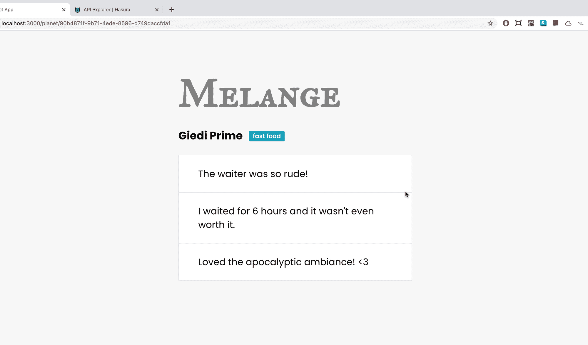

## ****S**TEP**5 :D**a 沙虫舞**

我们已经实现了带实时评论的行星！在进入正题之前，跳一小段舞庆祝一下。


# ****P** 艺术 **3: B** 商业逻辑**

[https://www.youtube.com/embed/picA-ORNNH8?feature=oembed](https://www.youtube.com/embed/picA-ORNNH8?feature=oembed)

## ****S** tep **1: A** dd 输入形式**

我们希望通过我们的用户界面提交评论的方式。我们将我们的搜索表单重命名为通用的`InputForm`，并将其添加到审核列表的上方。

```
import React, { useState } from "react";
import { useSubscription, gql } from "@apollo/client";
import { List, ListItem } from "./shared/List";
import { Badge } from "./shared/Badge";
import InputForm from "./shared/InputForm";

const PLANET = gql`
  subscription Planet($id: uuid!) {
    planets_by_pk(id: $id) {
      id
      name
      cuisine
      reviews(order_by: { created_at: desc }) {
        id
        body
        created_at
      }
    }
  }
`;

const Planet = ({
  match: {
    params: { id },
  },
}) => {
  const [inputVal, setInputVal] = useState("");
  const { loading, error, data } = useSubscription(PLANET, {
    variables: { id },
  });

  if (loading) return <p>Loading ...</p>;
  if (error) return <p>Error :(</p>;

  const { name, cuisine, reviews } = data.planets_by_pk;

  return (
    <div>
      <h3>
        {name} <Badge>{cuisine}</Badge>
      </h3>
      <InputForm
        inputVal={inputVal}
        onChange={(e) => setInputVal(e.target.value)}
        onSubmit={() => {}}
        buttonText="Submit"
      />
      <List>
        {reviews.map((review) => (
          <ListItem key={review.id}>{review.body}</ListItem>
        ))}
      </List>
    </div>
  );
};

export default Planet;
```

Planet.js

## ****S** tep **2: T** est 回顾突变**

我们将使用一个突变来添加新的评论。我们在 Hasura 控制台中用 GraphiQL 测试我们的突变。

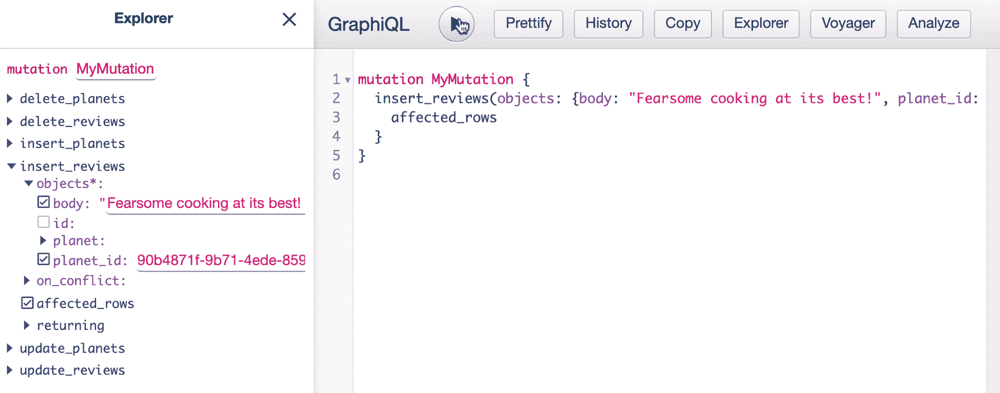

并将其转换为接受变量，这样我们就可以在代码中使用它。

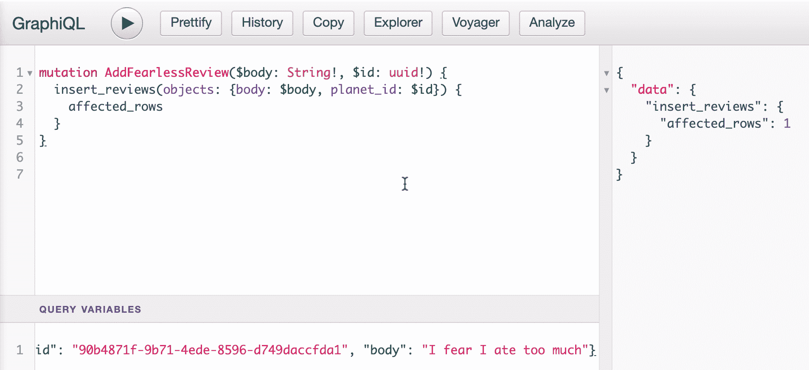

## ****S**TEP**3:C**reate action**

Bene Gesserit 要求我们不要在评论中使用( **咳** 审查员 **咳** )恐惧这个词。我们为业务逻辑创建一个动作，每当用户提交评论时，该动作将检查这个单词。

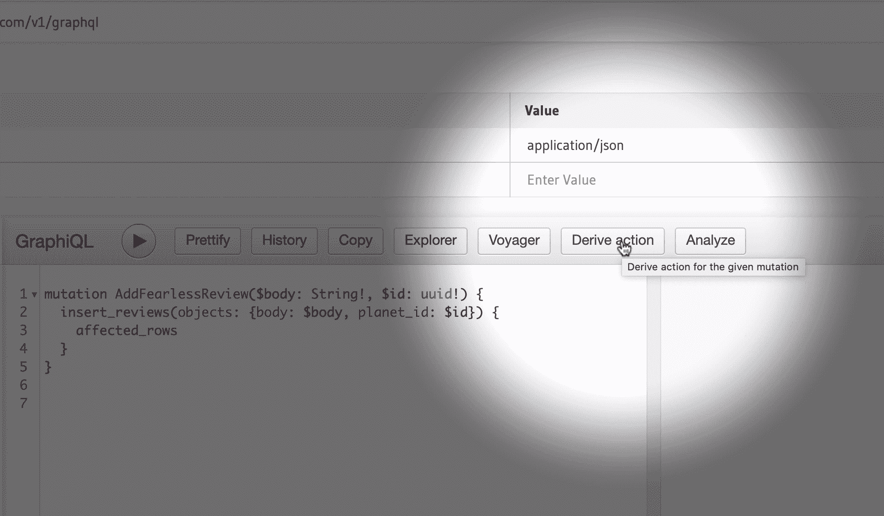

在我们新创建的操作中，我们转到“Codegen”选项卡。

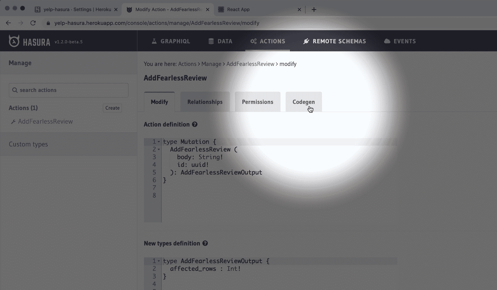

我们选择 nodejs-express 选项，并复制下面的处理程序样板代码。

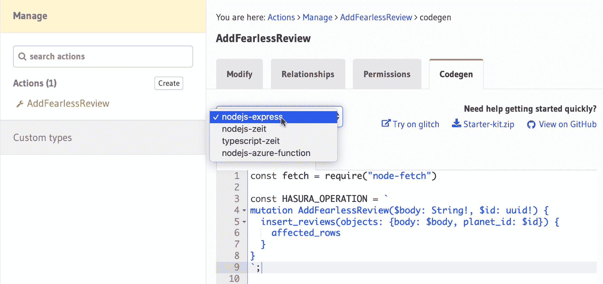

我们点击“Try on Glitch”，这将把我们带到一个准系统 express 应用程序，在那里我们可以粘贴我们的处理程序代码。

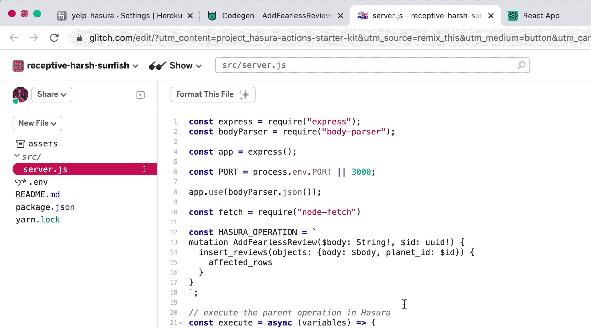

回到我们的操作中，我们将处理程序 URL 设置为 Glitch 应用程序中的 URL，并使用处理程序代码中的正确路径。

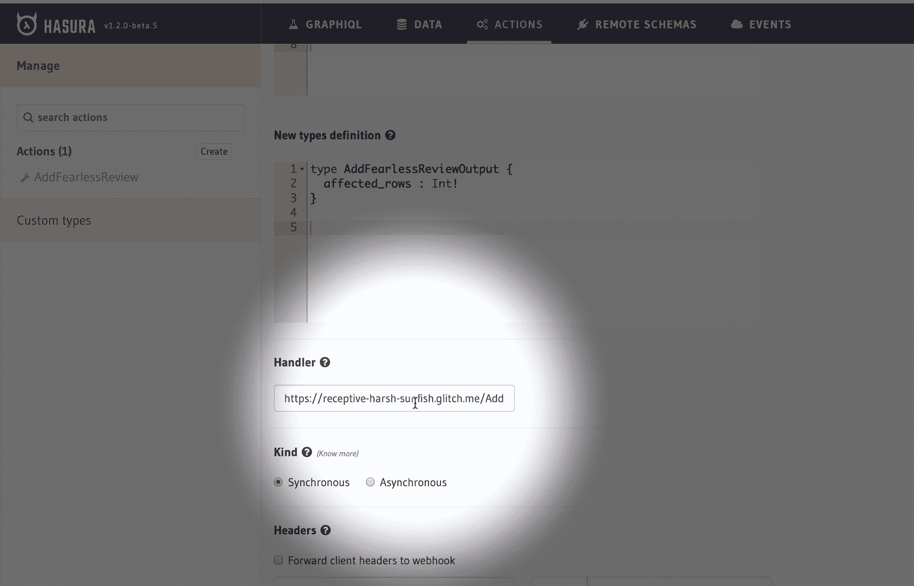

我们现在可以在控制台中测试我们的操作。它就像一个常规的变异，因为我们还没有任何业务逻辑来检查“恐惧”这个词。

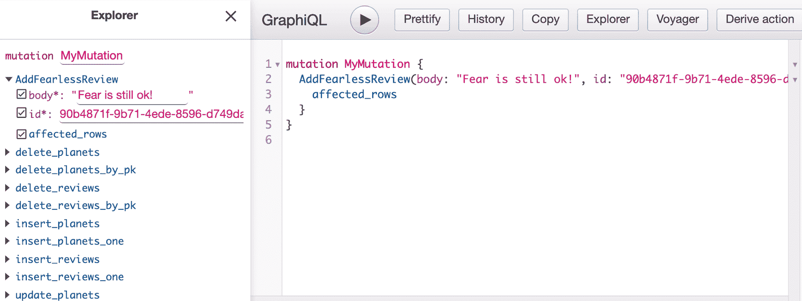

## ****S** tep **4: A** dd 业务逻辑**

在我们的处理程序中，我们添加了业务逻辑来检查评论主体中的“恐惧”。如果它无所畏惧，我们照常运行变异。如果没有，我们返回一个不祥的错误。

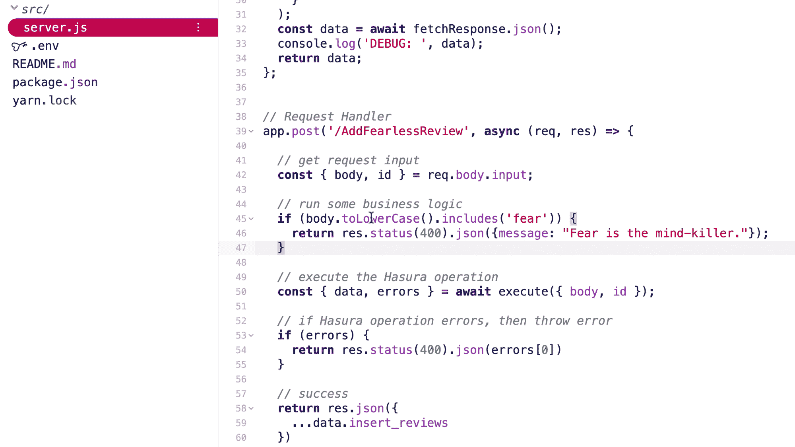

如果我们现在带着“恐惧”运行操作，我们会在响应中得到错误:

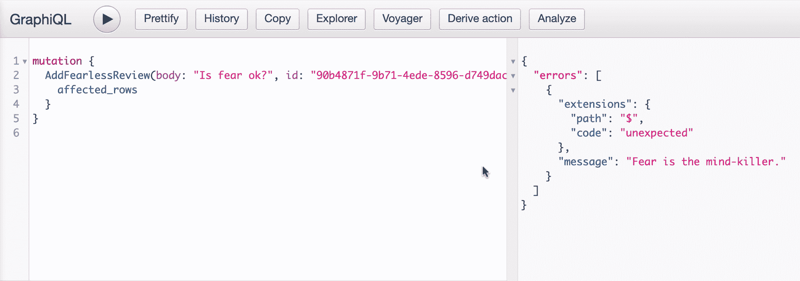

## ****S** tep **5: O** 订单点评**

我们的复习顺序目前是颠倒的。我们在`reviews`表中添加了一个`created_at`列，这样我们就可以先按最新的进行排序。

```
reviews(order_by: { created_at: desc })
```

## ****S** tep **6: A** dd 评论突变**

最后，我们用变量更新我们的动作语法，并将其复制粘贴到我们的代码中作为一种变异。当用户提交新的评审时，我们更新我们的代码来运行这个突变，这样我们的业务逻辑就可以在更新我们的数据库之前检查它的合规性(*服从*)。**

```
**`import React, { useState } from "react";
import { useSubscription, useMutation, gql } from "@apollo/client";
import { List, ListItem } from "./shared/List";
import { Badge } from "./shared/Badge";
import InputForm from "./shared/InputForm";

const PLANET = gql`
  subscription Planet($id: uuid!) {
    planets_by_pk(id: $id) {
      id
      name
      cuisine
      reviews(order_by: { created_at: desc }) {
        id
        body
        created_at
      }
    }
  }
`;

const ADD_REVIEW = gql`
  mutation($body: String!, $id: uuid!) {
    AddFearlessReview(body: $body, id: $id) {
      affected_rows
    }
  }
`;

const Planet = ({
  match: {
    params: { id },
  },
}) => {
  const [inputVal, setInputVal] = useState("");
  const { loading, error, data } = useSubscription(PLANET, {
    variables: { id },
  });
  const [addReview] = useMutation(ADD_REVIEW);

  if (loading) return <p>Loading ...</p>;
  if (error) return <p>Error :(</p>;

  const { name, cuisine, reviews } = data.planets_by_pk;

  return (
    <div>
      <h3>
        {name} <Badge>{cuisine}</Badge>
      </h3>
      <InputForm
        inputVal={inputVal}
        onChange={(e) => setInputVal(e.target.value)}
        onSubmit={() => {
          addReview({ variables: { id, body: inputVal } })
            .then(() => setInputVal(""))
            .catch((e) => {
              setInputVal(e.message);
            });
        }}
        buttonText="Submit"
      />
      <List>
        {reviews.map((review) => (
          <ListItem key={review.id}>{review.body}</ListItem>
        ))}
      </List>
    </div>
  );
};

export default Planet;`**
```

**Planet.js**

**如果我们现在提交一个包含“恐惧”的新评论，我们会得到一个不祥的错误，显示在输入框中。**

**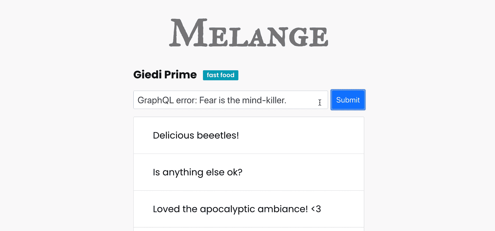**

## **第七步:我们做到了！？**

**祝贺您构建了一个全栈 React & GraphQL 应用程序！**

****

# **未来会怎样？**

****

**如果我们有一些香料混合物，我们就会知道。但是我们在如此短的时间内构建了如此多的功能！我们讨论了 GraphQL 查询、变异、订阅、路由、搜索，甚至是带有 Hasura 动作的定制业务逻辑！我希望您在编码过程中感到愉快。**

**您希望在此应用中看到哪些其他功能？在 Twitter 上联系我，我会制作更多教程！如果你想自己添加功能，请[分享一下](https://twitter.com/sez)-我很想听听这些功能:)**