# 如何在 Figma 中创建样式指南

> 原文：<https://www.freecodecamp.org/news/how-to-create-a-style-guide-in-figma/>

风格指南对于帮助您提供一致的品牌体验非常重要。

作为一名 UI/UX 设计者，如果你希望创造伟大的用户体验和界面，创建风格指南是必不可少的。

在这篇文章中，你将学习什么是风格指南，风格指南的重要性，以及如何一步一步地创建一个。

## 什么是风格指南？

用户界面(UI)风格指南是一种标准，它包含了产品中 UI 元素和交互的所有必要细节。它有助于建立品牌一致性。

一个典型的风格指南包含了关于排版、颜色、布局、组件和其他一切给用户界面带来感觉和外观的信息。

为你的产品创建一个伟大而简洁的风格指南可以确保品牌的外观和感觉保持一致。

## 为什么要创建风格指南？

有一个风格指南是很重要的，原因有很多，包括:

1.  它有助于所有用户界面元素保持一致
2.  这是新员工的学习资源，可以帮助他们更快地加入公司。
3.  它改善了设计者和开发者之间的交流。
4.  它可以帮助提高你的生产力。

## 风格指南应该包括什么？

典型风格指南的一些组成部分包括:

字体设计:这在每一个设计中都起着巨大的作用。你为设计选择的每一种字体都向你的用户传达了一种信息。设计中的排版应该清晰易读，易于阅读和理解，并具有视觉吸引力。

你的风格指南应该包括字体、字体大小和字体粗细。为了让你的设计看起来整洁和专业，限制你的设计为 2-3 种字体。记得选择互补的字体。

**调色板:**为您的设计选择正确的颜色有助于确定受众的反应，让他们感到舒适，并提高用户满意度。在你的风格指南中应该有三类颜色:原色、次原色和中性色。

原色是在你的设计中经常出现在所有屏幕和元素上的颜色。

二次色是原色的补充。你可以用它们来进行微交互，比如箭头，进度条，甚至标题。

图标:这主要是使用符号、图形和图像向用户传达更多的意思。图标使交流变得容易，它们通常是通用的。您可以选择在设计中使用的图标集合，以保持它们的一致性。

**布局网格:**网格是基于行和列对齐页面的系统。网格对于在设计中建立所有屏幕的一致性是必不可少的。你不能在你的风格指南中不包含网格系统。

风格指南中的 UI 元素通常包括按钮、输入字段、复选框以及警告和通知。元素是必不可少的，因为在你的设计中没有它们，用户就不能有效地工作。您应该包括这些元素及其特定状态-默认、活动、禁用和悬停。

## 如何在 Figma 中创建样式指南

现在我们将在 Figma 中从头开始创建一个样式指南，包括上面列出的元素。

打开 Figma 文件并选择一个框架。

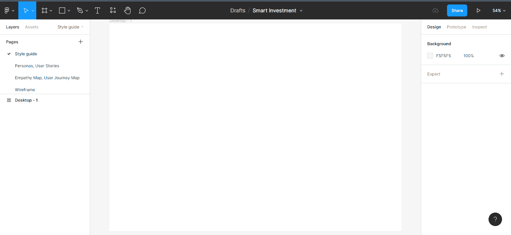

### 选择调色板

获得正确的颜色对于创造伟大的设计非常重要。你必须能够为你的风格指南选择互补的颜色。

如果你心中没有一个特定的调色板，你可以尝试像 [colors.muz.li](https://www.freecodecamp.org/news/p/c604ed5f-d6ae-41bf-8449-ae227211c216/colors.muz.li) 或【coolors.co】这样的网站来获得色彩灵感。

如果你正在与客户合作，他们可能已经有了一个调色板的想法。

#### 第一步:选择你的颜色类别

选择三种颜色:原色、二次色和灰色(中性色)。

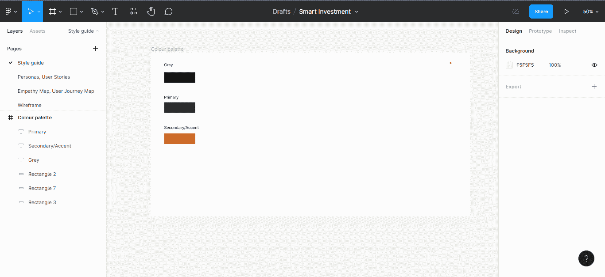

#### 步骤 2:为颜色生成阴影

现在你需要为你的颜色生成阴影。为你的调色板生成阴影有助于迎合不同的使用情况。当你需要调整颜色的不透明度或亮度时，这很方便。

Figma 插件[色彩和阴影](https://www.figma.com/community/plugin/943569346291474506)帮助你生成色彩阴影。

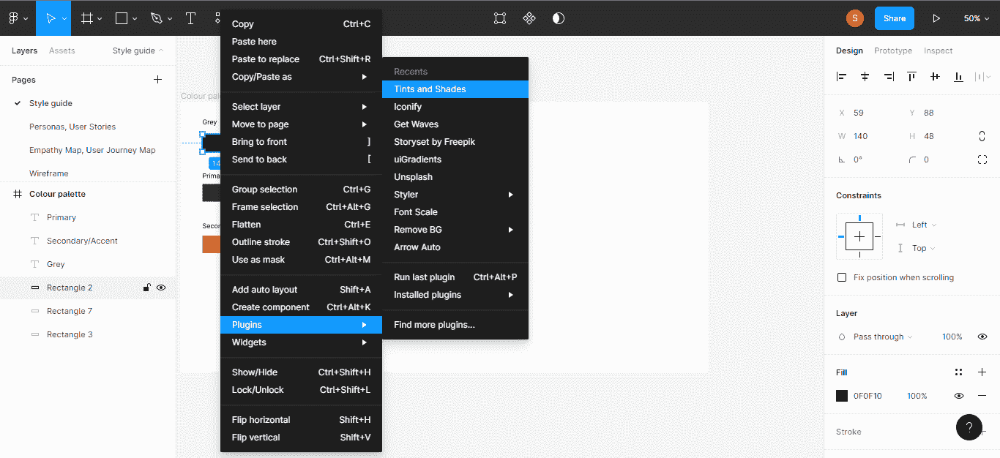

选择一种颜色，点击[色调和阴影](https://www.figma.com/community/plugin/943569346291474506)生成阴影。

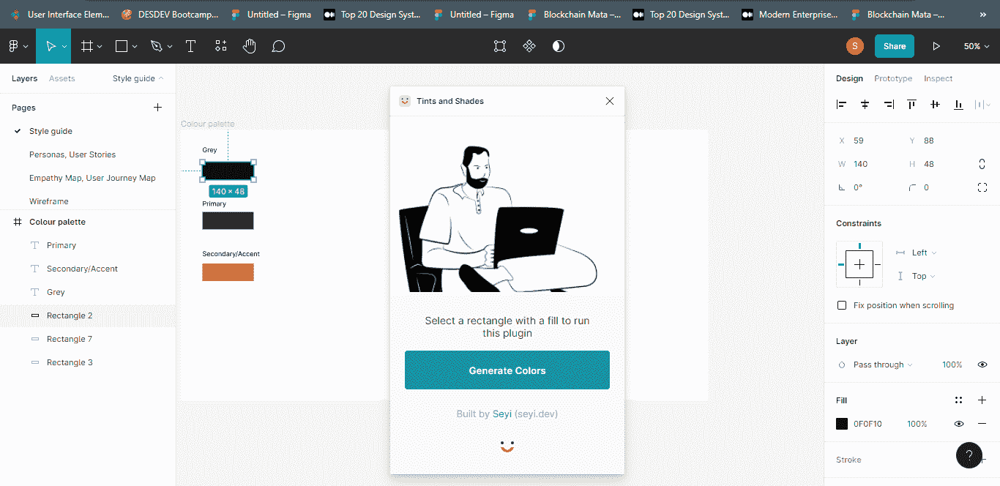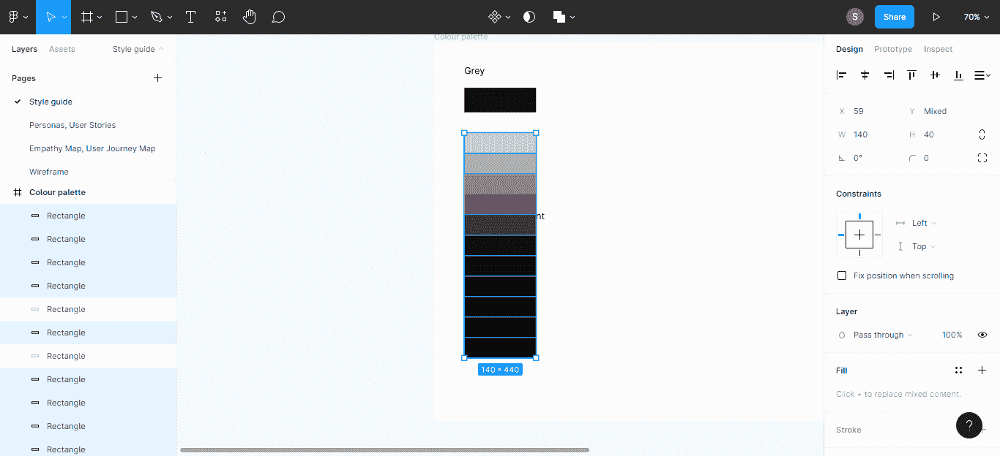

自动布局(Shift + A)生成的阴影，给他们一个框架，并安排他们垂直/水平。

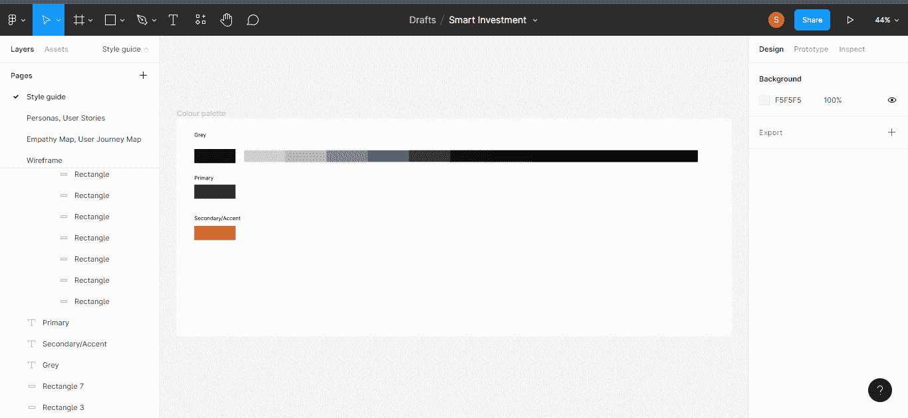

#### 第三步:将色调做成不同的颜色。

要使生成的颜色*样式*，首先选择框架并按回车键，以便单独选择框架中的方框。

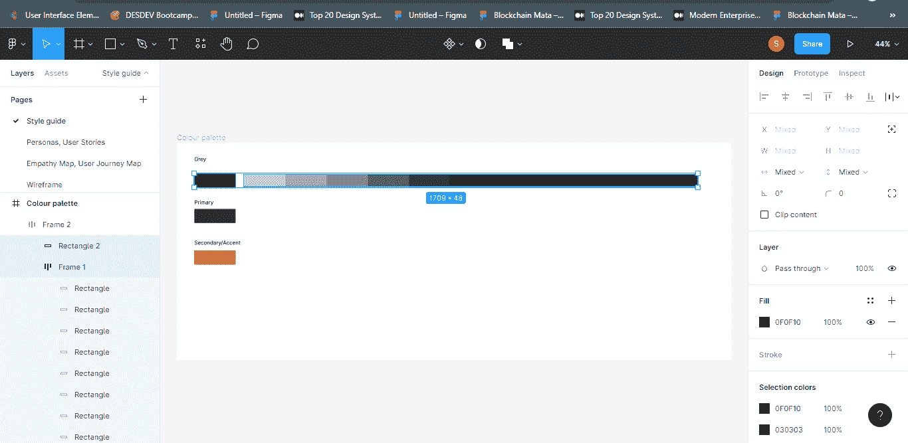

使用与数字相区别的颜色类别名称来重命名各个盒子，例如灰色 01 等等。

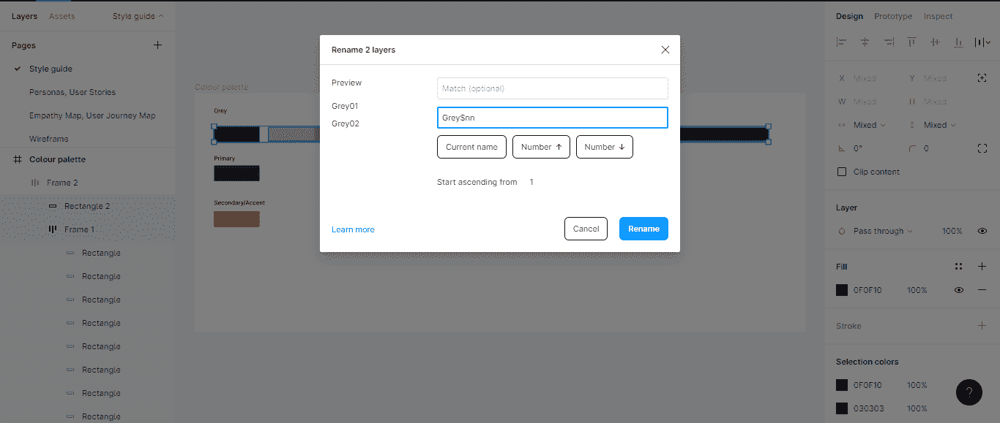

如果您成功地重命名了盒子，名称将出现在画布的左侧。

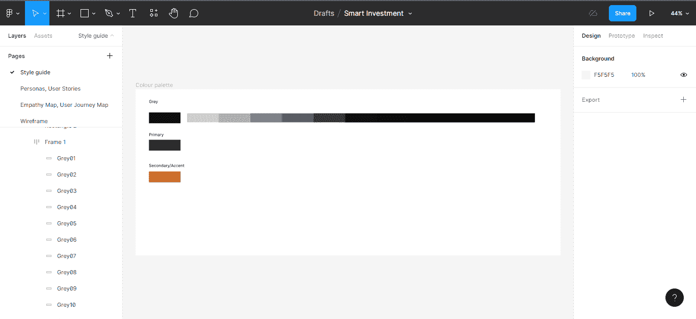

这样做之后，你需要把你的颜色做成各种风格。你可以使用 Figma 插件 [Styler](https://www.figma.com/community/plugin/820660579767995949) 来设计你的颜色。单击框架，使用回车键选择各个框。

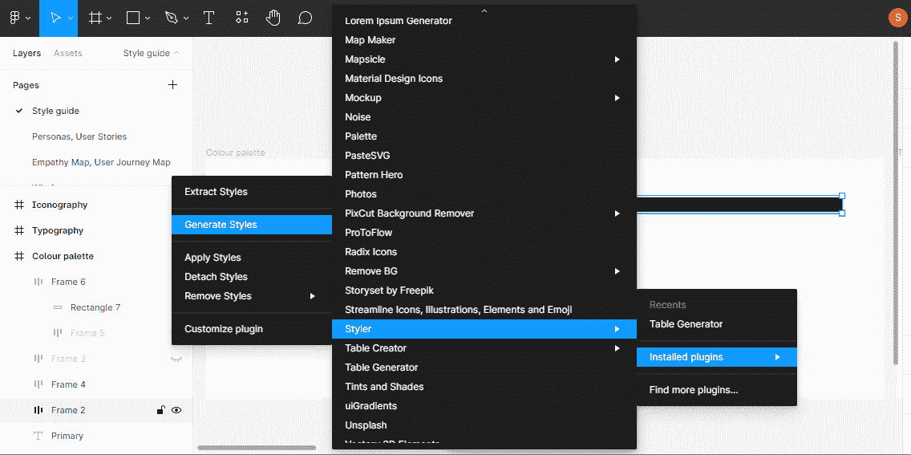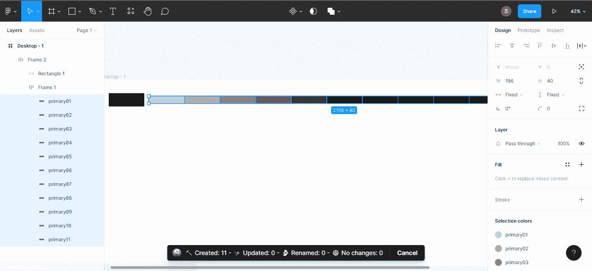

如果你这样做是正确的，你会得到一个通知，就像你在上面的图片中看到的那样。

对所有颜色类别重复这些步骤——灰色、原色和原色。

### 选择您的版式

选择正确的字体系列、字体大小和字体粗细对于一个好的风格指南来说非常重要。如果您对如何生成或选择字体系列、粗细和大小感到困惑，您可以使用 Material Design type scale[Material . io](https://www.freecodecamp.org/news/p/c604ed5f-d6ae-41bf-8449-ae227211c216/material.io/design/typography)来生成字体比例。

#### 第一步:选择字体后打开一个框架。

#### 步骤 2:建立页面层次结构

决定你的设计有多少标题、副标题、正文和题注。记住，你可以通过字体粗细(轻、中、常规)、大小、字母间距和大小写的不同来传达层次结构。

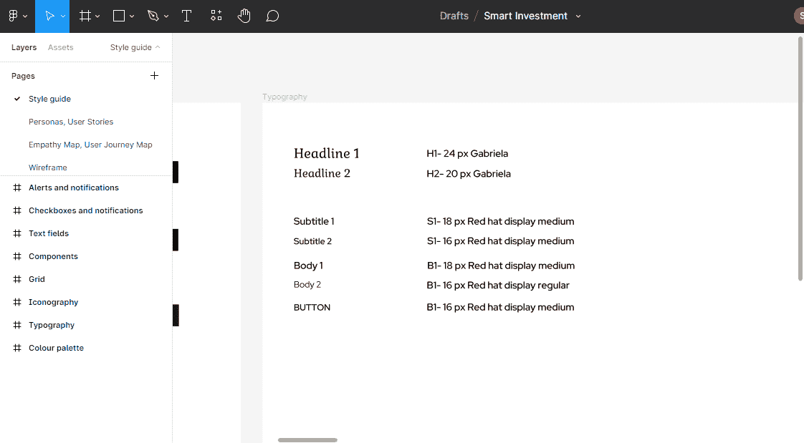

#### 第三步:制作你的字体样式

选择字体粗细、大小和字母间距后，是时候为它们设计风格了。就像你为你的调色板所做的一样，选择字体并使用插件 [Styler](https://www.figma.com/community/plugin/820660579767995949) 将它们创建为样式。

注意:为手机设计时选择较小的字体(16px，18px，等等)，为网页设计时选择较大的字体。

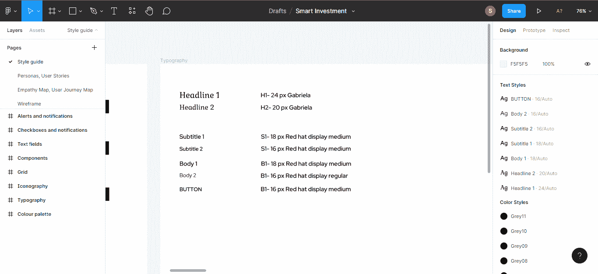

正如你在上面的图片中看到的，你的文本样式会出现在屏幕的右边。

### 选择你的肖像

接下来，我们有肖像。图标是我们设计中必不可少的一部分，因为它们在我们的界面中直观地表达动作和对象。它们帮助设计者进一步传达动作或屏幕的含义，比如主页图标、搜索图标等等。

你可以从像 [Iconify](https://www.figma.com/community/plugin/735098390272716381) 、 [Font Awesome](https://www.figma.com/community/plugin/774202616885508874) 这样的插件，以及像 [feathericons](https://www.freecodecamp.org/news/p/c604ed5f-d6ae-41bf-8449-ae227211c216/feathericons.com) 和 [Google icons](https://www.freecodecamp.org/news/p/c604ed5f-d6ae-41bf-8449-ae227211c216/fonts.google.com/icons) 这样的库获得图标。

#### 步骤 1:选择一个框架。

转到框架工具，并为您的图标选择一个框架。

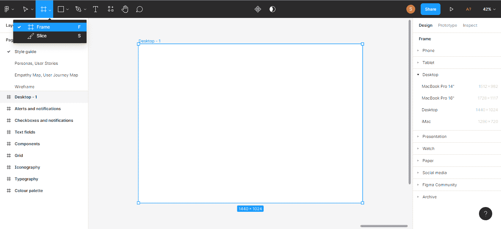

#### 第二步:得到你所有的图标

现在你需要得到你的设计需要的图标。确保包含每个图标的不同状态，如填充、轮廓等。

注意:确保你的图标大小一致。

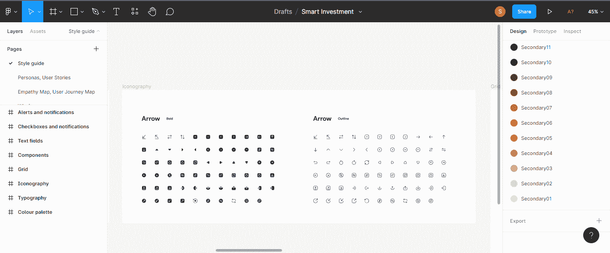

维奥莱！你现在有你的肖像。要了解更多图标，请查看[设计系统图标](https://www.freecodecamp.org/news/p/c604ed5f-d6ae-41bf-8449-ae227211c216/designsystems.com/icons)。

### 设置布局网格

网格是任何样式指南的基本部分，因为它们有助于在设计中实现更好的对齐、层次和一致性。

为你的网格设置一个标准取决于你是为网络设计还是为移动设计——每个都有不同的标准。例如，在设计网页时，你应该使用 960 度的网格(12 或 16 列)。

首先，选择一个框架。

#### 步骤 1:添加布局网格

然后从画布的左侧面板获取布局网格。

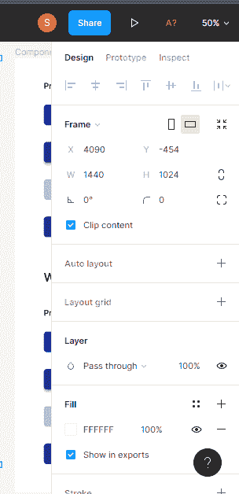

输入框架所需的列数以及边距和装订线(框架的垂直部分)的值。

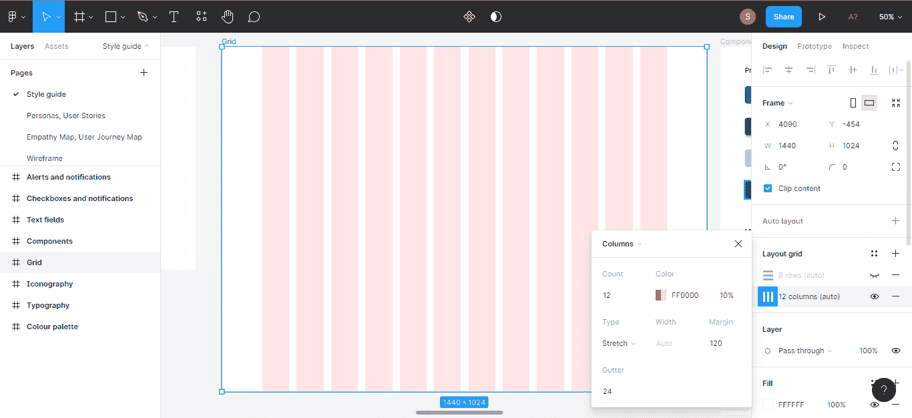

接下来，您需要为框架的水平部分或行包含网格。输入所需的行、边距和装订线的值。

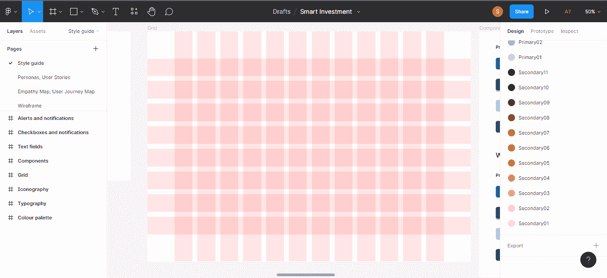

### 选择您的组件

您选择的组件在您的用户界面中起着重要的作用。组件通常包括文本字段、按钮状态、复选框、警告和通知。

### 定义您的输入字段

顾名思义，输入字段允许用户在 UI 中输入文本。它们需要像其他东西一样设计。

首先，像往常一样，选择一个框架。

#### 步骤 1:设计不同状态的输入字段

您需要根据状态来设计每个输入字段，比如默认、禁用、活动和错误。

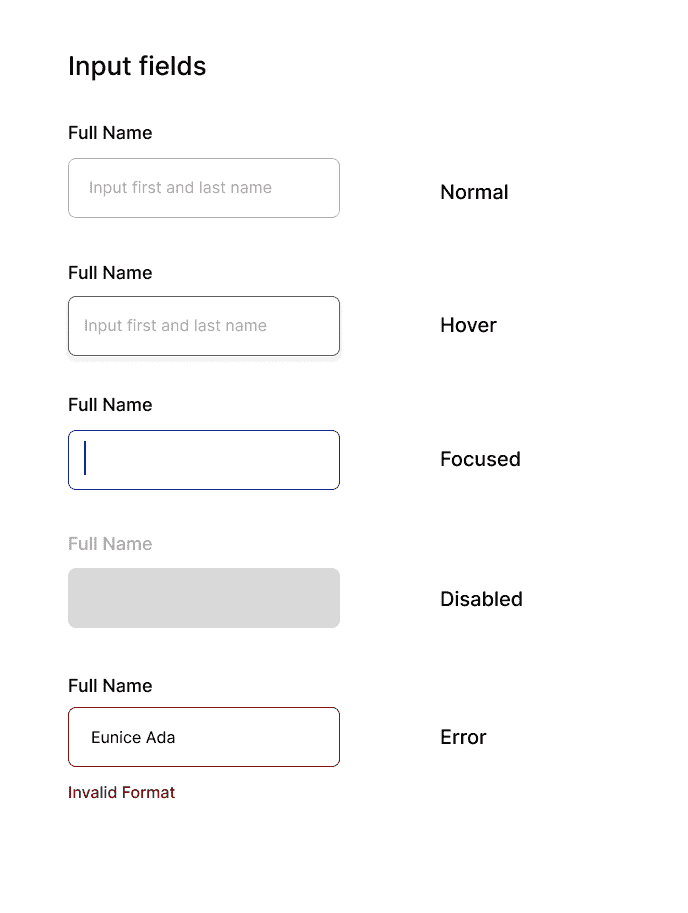

#### 第二步:在你的输入框中添加图标。

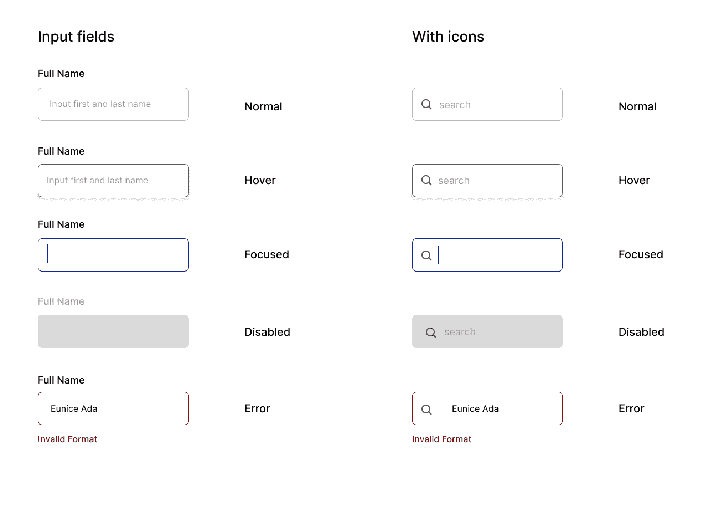

### 设计你的按钮

你的按钮应该包括处于不同状态的主要按钮和次要按钮，比如禁用、默认、悬停和按下。

主按钮通常是强有力的视觉指示器，帮助用户完成他们的旅程，例如“下一步”、“提交”等等。次要按钮通常是主要操作的替代，如“取消”、“后退”等。

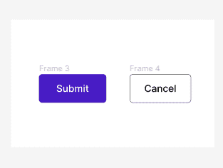

上图显示了两个按钮。左边的按钮是主按钮，而右边的按钮是次按钮。

首先，选择一个框架。

#### 第一步:设计主按钮

首先，你需要设计一个不同状态的主按钮:默认、悬停、按下和禁用。

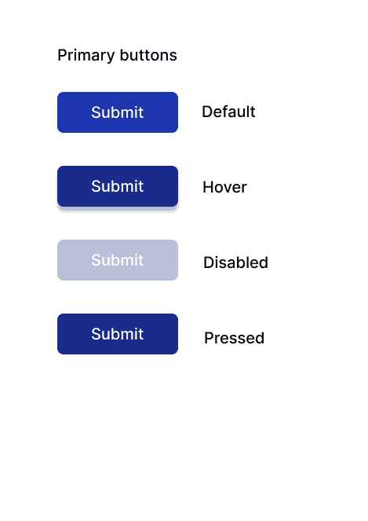

#### 第二步:设计二级按钮

然后你将设计一个不同状态的辅助按钮:默认、悬停、按下和禁用。

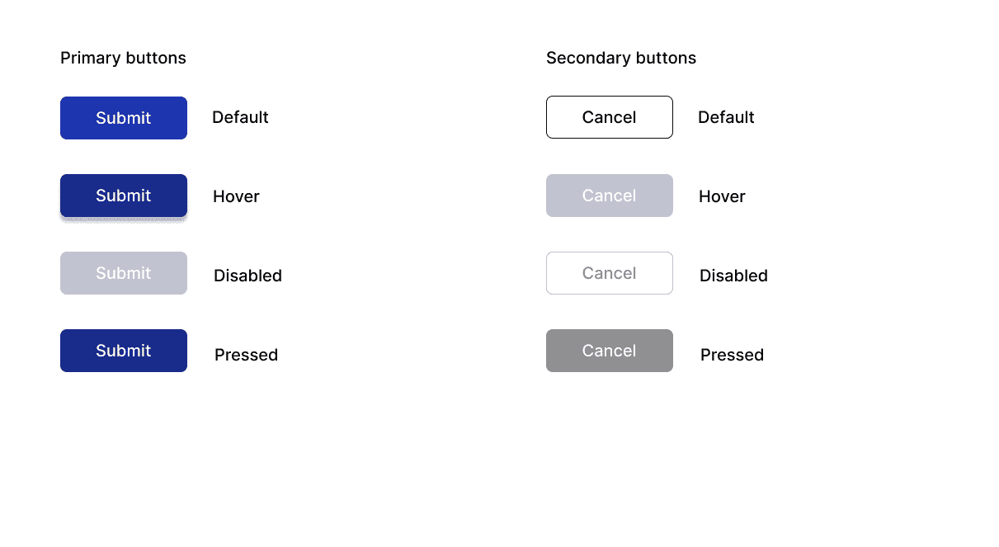

#### 步骤 3:用图标检查按钮

您可能想要检查各种按钮与图标的外观。在主按钮和次按钮的所有状态下添加图标。

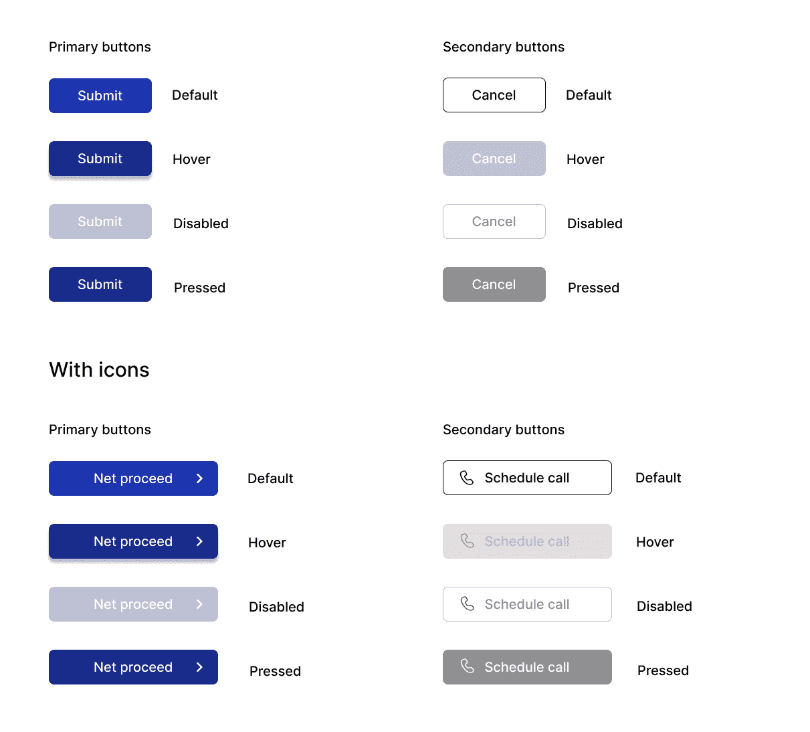

### 复选框

当用户可能需要从列表中选择多个选项时，通常会使用复选框，也就是说，列表/表单中的每个复选框都独立于其他复选框。

首先，选择一个框架。

#### 第二步:设计你的复选框

你需要包括各种状态，如启用、禁用、悬停、聚焦和按下状态。

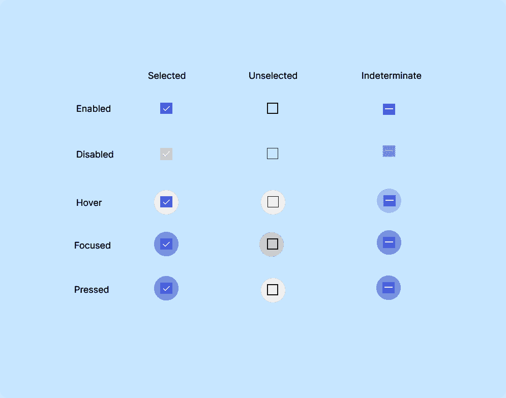

### 警报和通知

通过实时提醒，用户可以获得提醒、错误、成功等通知。这降低了黑客攻击、错误输入和重要信息丢失的风险。

首先，选择一个框架。

#### 步骤 1:设计通知和警报

当您设计警报时，请确保使用正确的图标来表示警告、错误、成功和成功状态。

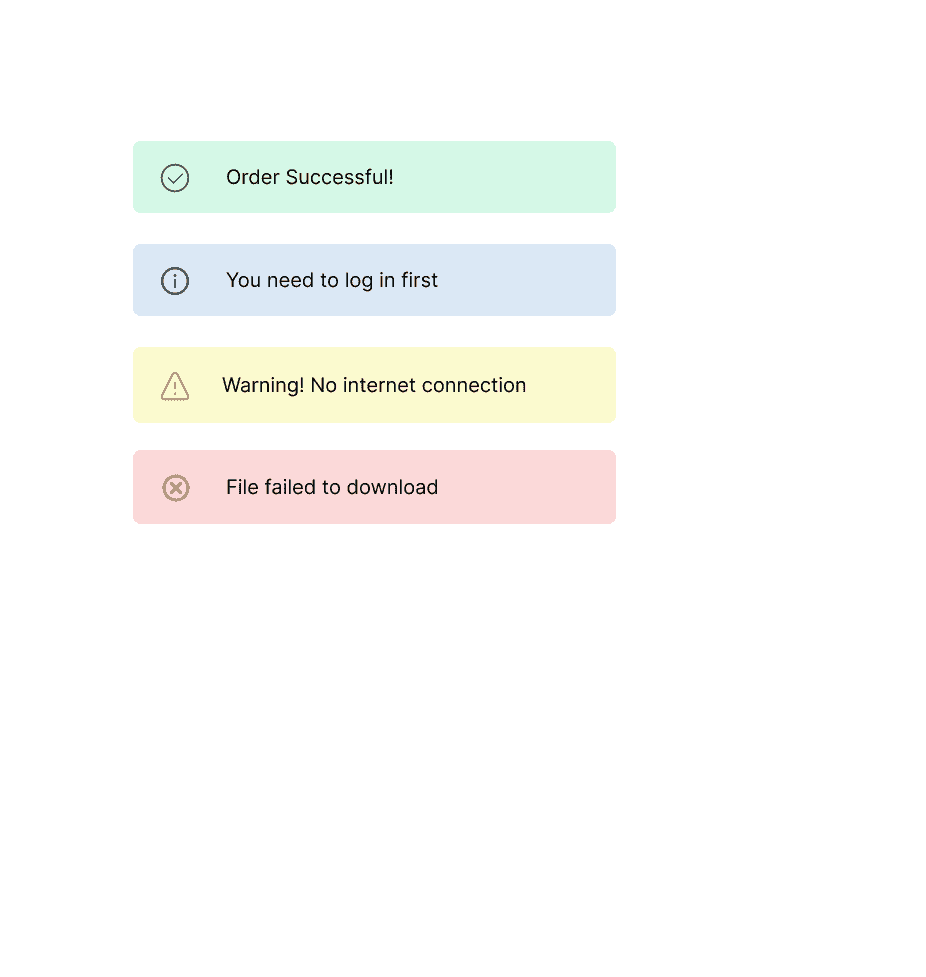

## 现场风格指南示例

以下是 Mozilla 的风格指南:

[Mozilla Style Guide](https://design.firefox.com/)

以下是 freeCodeCamp 的现场风格指南:

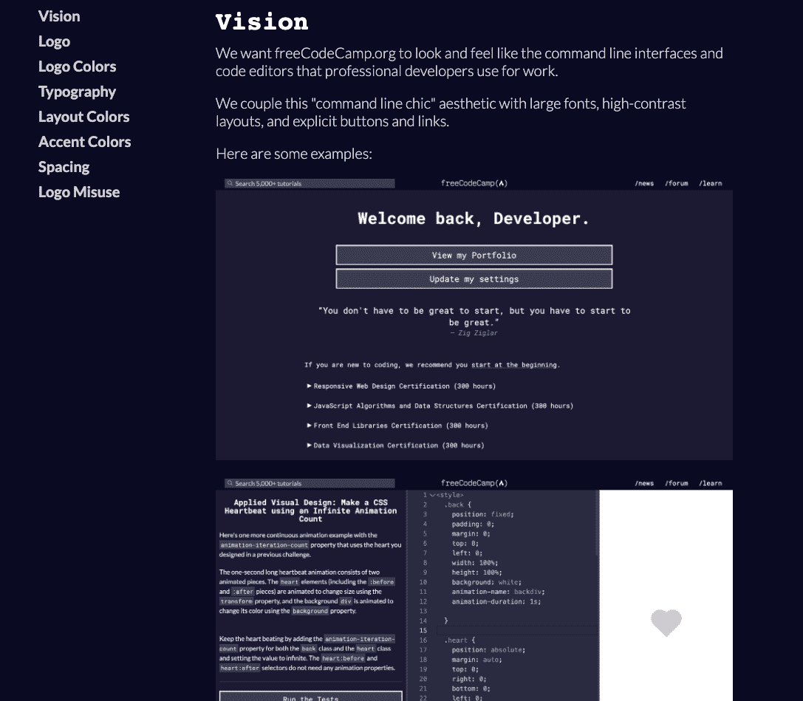

[freeCodeCamp's Design Style Guide](https://design-style-guide.freecodecamp.org/)

## 结论

对于任何组织来说，创建风格指南都是产品开发的基本步骤。作为一名 UI/UX 设计师，这是你无法避免的。

记住你的风格指南不是固定的，你可以随时更新。练习直到你得到你想要的方式。