# 如何使用 IEX 云、Matplotlib 和 AWS 在 Python 中创建自动更新的数据可视化

> 原文：<https://www.freecodecamp.org/news/how-to-create-auto-updating-data-visualizations-in-python-with-matplotlib-and-aws/>

Python 是创建数据可视化的优秀编程语言。

然而，使用像 Python 这样的原始编程语言(而不是像 Tableau 这样更复杂的软件)会带来一些挑战。创建可视化的开发人员必须接受更多的技术复杂性，以换取对可视化外观的更多投入。

在本教程中，我将教你如何创建自动更新的 Python 可视化。我们将使用来自 IEX 云的数据，我们还将使用 matplotlib 库和一些简单的亚马逊网络服务产品。

## 第一步:收集数据

自动更新图表听起来很吸引人。但是在您投入时间构建它们之前，了解您是否需要图表自动更新是很重要的。

更具体地说，如果您的可视化呈现的数据不随时间而变化，则不需要自动更新。

编写一个 Python 脚本来自动更新迈克尔·乔丹的年度场均得分图表是没有用的——他的职业生涯已经结束，数据集永远不会改变。

自动更新可视化的最佳数据集候选是时间序列数据，其中定期(比如每天)添加新的观察值。

在本教程中，我们将使用来自 [IEX 云 API](https://iexcloud.io/) 的股票市场数据。具体来说，我们将可视化美国几家最大银行的历史股价:

*   摩根大通(JPM)
*   美国银行
*   花旗集团
*   富国银行(WFC)
*   高盛(Goldman Sachs)

您需要做的第一件事是创建一个 IEX 云帐户，并生成一个 API 令牌。

出于明显的原因，我不打算在本文中发布我的 API 键。将您自己的个性化 API 密钥存储在一个名为`IEX API Key`的变量中就足够了。

接下来，我们将把我们的报价器列表存储在一个 Python 列表中:

```
tickers = [
            'JPM',
            'BAC',
            'C',
            'WFC',
            'GS',
            ]
```

IEX 云 API 接受逗号分隔的代码。我们需要将我们的 ticker 列表序列化为一个单独的 ticker 字符串。下面是我们将使用的代码:

```
#Create an empty string called `ticker_string` that we'll add tickers and commas to
ticker_string = ''

#Loop through every element of `tickers` and add them and a comma to ticker_string
for ticker in tickers:
    ticker_string += ticker
    ticker_string += ','

#Drop the last comma from `ticker_string`
ticker_string = ticker_string[:-1]
```

我们需要处理的下一个任务是选择我们需要 ping IEX 云 API 的哪个端点。

快速浏览一下 IEX 云的文档可以发现，他们有一个`Historical Prices`端点，我们可以使用`charts`关键字向其发送一个 HTTP 请求。

我们还需要指定我们请求的数据量(以年为单位)。

为了将这个端点作为指定数据范围的目标，我将`charts`端点和时间量存储在单独的变量中。然后，这些端点被插入到我们将用来发送 HTTP 请求的序列化 URL 中。

代码如下:

```
#Create the endpoint and years strings
endpoints = 'chart'
years = '10'

#Interpolate the endpoint strings into the HTTP_request string
HTTP_request = f'https://cloud.iexapis.com/stable/stock/market/batch?symbols={ticker_string}&types={endpoints}&range={years}y&token={IEX_API_Key}'
```

这个插入的字符串很重要，因为它允许我们在以后轻松地更改字符串的值，而不需要更改代码库中每次出现的字符串。

现在是时候实际发出 HTTP 请求并将数据存储在本地机器上的数据结构中了。

为此，我将使用 Python 的 pandas 库。具体来说，数据将存储在 [pandas 数据帧](https://nickmccullum.com/advanced-python/pandas-dataframes/)中。

我们首先需要导入[熊猫](https://nickmccullum.com/advanced-python/pandas/)库。按照惯例，熊猫通常以别名`pd`进口。将以下代码添加到脚本的开头，以便在所需的别名下导入熊猫:

```
import pandas as pd
```

一旦我们将 pandas 导入到 Python 脚本中，我们就可以使用它的`read_json`方法将来自 IEX 云的数据存储到 pandas DataFrame 中:

```
bank_data = pd.read_json(HTTP_request)
```

在 [Jupyter 笔记本](https://nickmccullum.com/python-course/jupyter-notebook-basics/)中打印该数据帧会产生以下输出:


很明显，这不是我们想要的。我们需要解析这些数据来生成一个值得绘制的数据框架。

首先，让我们检查一个特定的`bank_data`列，比如说`bank_data['JPM']`:


很明显，下一个解析层需要成为`chart`端点:

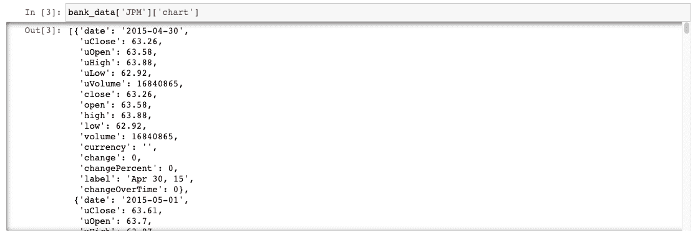

现在我们有了一个类似 JSON 的数据结构，其中每个单元格都是一个日期，以及关于该日期 JPM 股票价格的各种数据点。

我们可以将这种类似 JSON 的结构包装在 pandas 数据帧中，使其可读性更好:

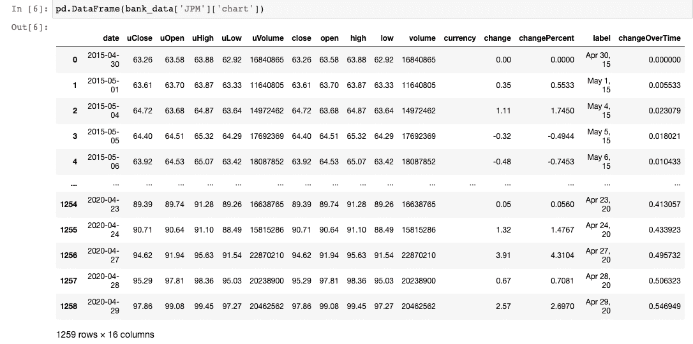

这是我们可以合作的事情！

让我们编写一个小循环，使用类似的逻辑拉出每只股票的收盘价时间序列作为 [pandas Series](https://nickmccullum.com/advanced-python/pandas-series/) (相当于 pandas DataFrame 的一列)。我们将把这些熊猫系列存储在一个字典中(关键字是代码名称)，以便于以后访问。

```
for ticker in tickers:
    series_dict.update( {ticker : pd.DataFrame(bank_data[ticker]['chart'])['close']} )
```

现在，我们可以创建最终的 pandas 数据框架，它将日期作为索引，并包含一个列，显示过去 5 年中所有主要银行股票的收盘价:

```
series_list = []

for ticker in tickers:
    series_list.append(pd.DataFrame(bank_data[ticker]['chart'])['close'])

series_list.append(pd.DataFrame(bank_data['JPM']['chart'])['date'])

column_names = tickers.copy()
column_names.append('Date')

bank_data = pd.concat(series_list, axis=1)
bank_data.columns = column_names

bank_data.set_index('Date', inplace = True)
```

完成所有这些后，我们的`bank_data`数据帧将如下所示:

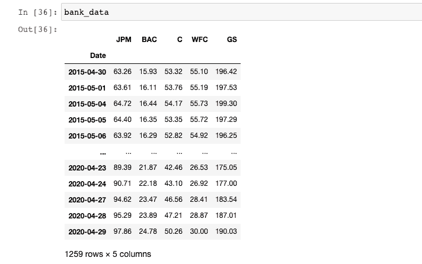

我们的数据收集完成了。我们现在准备开始用公开交易银行的股票价格数据集创建可视化。简单回顾一下，下面是我们到目前为止构建的脚本:

```
import pandas as pd
import matplotlib.pyplot as plt

IEX_API_Key = ''

tickers = [
            'JPM',
            'BAC',
            'C',
            'WFC',
            'GS',
            ]

#Create an empty string called `ticker_string` that we'll add tickers and commas to
ticker_string = ''

#Loop through every element of `tickers` and add them and a comma to ticker_string
for ticker in tickers:
    ticker_string += ticker
    ticker_string += ','

#Drop the last comma from `ticker_string`
ticker_string = ticker_string[:-1]

#Create the endpoint and years strings
endpoints = 'chart'
years = '5'

#Interpolate the endpoint strings into the HTTP_request string
HTTP_request = f'https://cloud.iexapis.com/stable/stock/market/batch?symbols={ticker_string}&types={endpoints}&range={years}y&cache=true&token={IEX_API_Key}'

#Send the HTTP request to the IEX Cloud API and store the response in a pandas DataFrame
bank_data = pd.read_json(HTTP_request)

#Create an empty list that we will append pandas Series of stock price data into
series_list = []

#Loop through each of our tickers and parse a pandas Series of their closing prices over the last 5 years
for ticker in tickers:
    series_list.append(pd.DataFrame(bank_data[ticker]['chart'])['close'])

#Add in a column of dates
series_list.append(pd.DataFrame(bank_data['JPM']['chart'])['date'])

#Copy the 'tickers' list from earlier in the script, and add a new element called 'Date'. 
#These elements will be the column names of our pandas DataFrame later on.
column_names = tickers.copy()
column_names.append('Date')

#Concatenate the pandas Series together into a single DataFrame
bank_data = pd.concat(series_list, axis=1)

#Name the columns of the DataFrame and set the 'Date' column as the index
bank_data.columns = column_names
bank_data.set_index('Date', inplace = True)
```

## 步骤 2:创建您想要更新的图表

在本教程中，我们将使用 Python 的 matplotlib 可视化库。

Matplotlib 是一个非常复杂的库，人们花费数年时间来最大程度地掌握它。因此，请记住，在本教程中，我们只是触及了 matplotlib 功能的皮毛。

我们将从导入 matplotlib 库开始。

### 如何导入 Matplotlib

按照惯例，数据科学家一般以别名`plt`导入 matplotlib 的`pyplot`库。

以下是完整的导入声明:

```
import matplotlib.pyplot as plt
```

您需要在任何使用 matplotlib 生成数据可视化的 Python 文件的开头包含这一点。

您还可以在 matplotlib 库导入中添加其他参数，以使您的可视化更容易使用。

如果您正在 Jupyter 笔记本中学习本教程，您可能希望包含以下语句，这将使您的可视化效果出现，而无需编写`plt.show()`语句:

```
%matplotlib inline
```

如果您正在使用带有视网膜显示器的 MacBook 上的 Jupyter 笔记本，您可以使用以下语句来提高笔记本中 matplotlib 可视化效果的分辨率:

```
from IPython.display import set_matplotlib_formats

set_matplotlib_formats('retina')
```

解决了这个问题，让我们开始使用 Python 和 matplotlib 创建我们的第一个数据可视化！

### Matplotlib 格式化基础

在本教程中，您将学习如何使用 matplotlib 在 Python 中创建箱线图、散点图和直方图。在我们开始创建真正的数据可视化之前，我想先了解一下 matplotlib 中的一些基本格式。

首先，几乎你在 matplotlib 中做的所有事情都会涉及到调用`plt`对象上的方法，这是我们导入 matplotlib 的别名。

其次，您可以通过调用`plt.title()`并将您想要的标题作为字符串传入来为 matplotlib 可视化添加标题。

第三，您可以使用`plt.xlabel()`和`plt.ylabel()`方法向 x 和 y 轴添加标签。

最后，使用我们刚刚讨论的三种方法——`plt.title()`、`plt.xlabel()`和`plt.ylabel()`——您可以用`fontsize`参数改变标题的字体大小。

让我们开始认真创建我们的第一个 matplotlib 可视化。

### 如何在 Matplotlib 中创建箱线图

[箱线图](https://nickmccullum.com/python-visualization/boxplot/)是数据科学家可用的最基本的数据可视化之一。

Matplotlib 允许我们用`boxplot`函数创建箱线图。

因为我们将沿着我们的列(而不是沿着我们的行)创建盒状图，我们也将想要在`boxplot`方法调用中转置我们的数据帧。

```
plt.boxplot(bank_data.transpose())
```

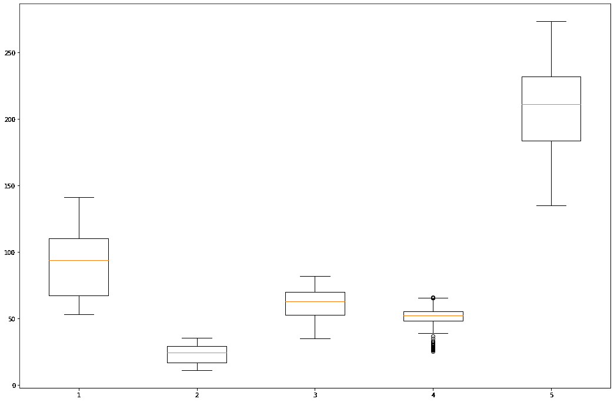

这是一个好的开始，但是我们需要添加一些样式，使这种可视化容易被外部用户理解。

首先，让我们添加一个图表标题:

```
plt.title('Boxplot of Bank Stock Prices (5Y Lookback)', fontsize = 20)
```

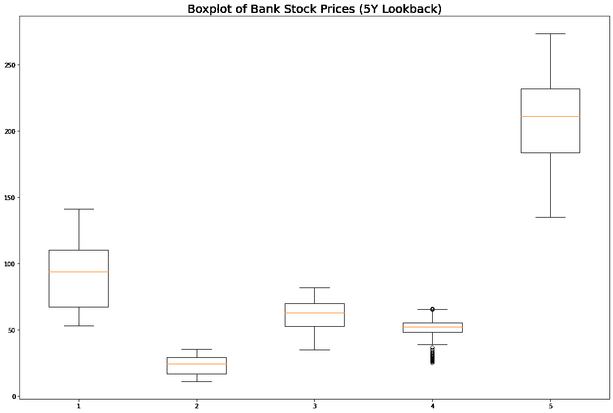

此外，如前所述，标记 x 轴和 y 轴也很有用:

```
plt.xlabel('Bank', fontsize = 20)
plt.ylabel('Stock Prices', fontsize = 20)
```

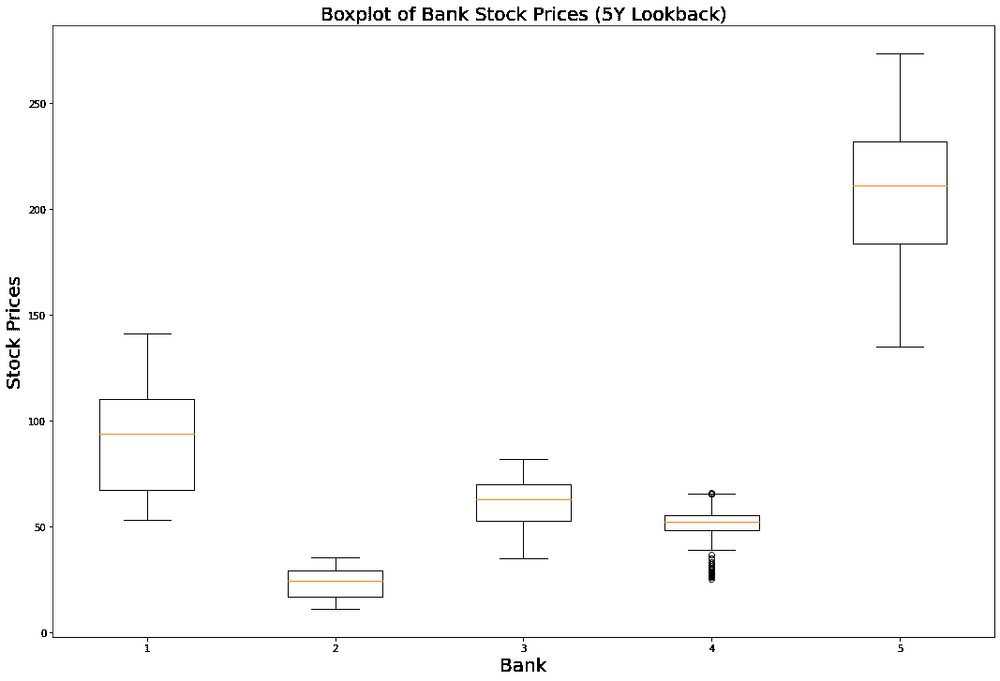

我们还需要将特定于列的标签添加到 x 轴上，这样就可以清楚地知道哪个箱线图属于每个库。

下面的代码完成了这个任务:

```
ticks = range(1, len(bank_data.columns)+1)
labels = list(bank_data.columns)
plt.xticks(ticks,labels, fontsize = 20)
```

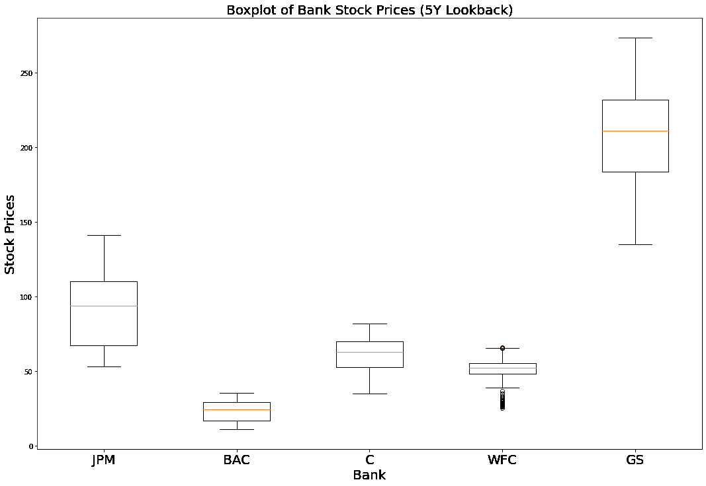

就像那样，我们有一个 boxplot，它在 matplotlib 中呈现了一些有用的可视化效果！很明显，在过去 5 年中，高盛的股价最高，而美国银行的股价最低。有趣的是，富国银行拥有最多的异常数据点。

概括一下，下面是我们用来生成箱线图的完整代码:

```
########################
#Create a Python boxplot
########################

#Set the size of the matplotlib canvas
plt.figure(figsize = (18,12))

#Generate the boxplot
plt.boxplot(bank_data.transpose())

#Add titles to the chart and axes
plt.title('Boxplot of Bank Stock Prices (5Y Lookback)', fontsize = 20)
plt.xlabel('Bank', fontsize = 20)
plt.ylabel('Stock Prices', fontsize = 20)

#Add labels to each individual boxplot on the canvas
ticks = range(1, len(bank_data.columns)+1)
labels = list(bank_data.columns)
plt.xticks(ticks,labels, fontsize = 20)
```

### 如何在 Matplotlib 中创建散点图

[散点图](https://nickmccullum.com/python-visualization/scatterplot/)可使用`plt.scatter`方法在 matplotlib 中创建。

`scatter`方法有两个必需的参数——一个`x`值和一个`y`值。

让我们使用`plt.scatter()`方法绘制富国银行的股票价格随时间的变化图。

我们需要做的第一件事是创建我们的 x 轴变量，名为`dates`:

```
dates = bank_data.index.to_series()
```

接下来，我们将把富国银行的股票价格隔离在一个单独的变量中:

```
WFC_stock_prices =  bank_data['WFC'] 
```

我们现在可以使用`plt.scatter`方法绘制可视化图形:

```
plt.scatter(dates, WFC_stock_prices)
```

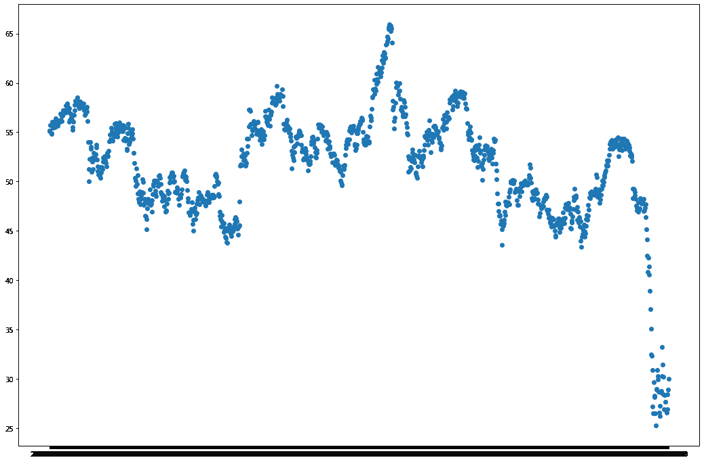

等一下——这张图表的 x 标签根本看不懂！

有什么问题？

嗯，matplotlib 目前没有识别出 x 轴包含日期，所以它没有正确地分隔标签。

为了解决这个问题，我们需要将`dates`系列的每个元素转换成`datetime`数据类型。以下命令是最容易理解的方法:

```
dates = bank_data.index.to_series()
dates = [pd.to_datetime(d) for d in dates]
```

再次运行`plt.scatter`方法后，您将生成以下可视化结果:

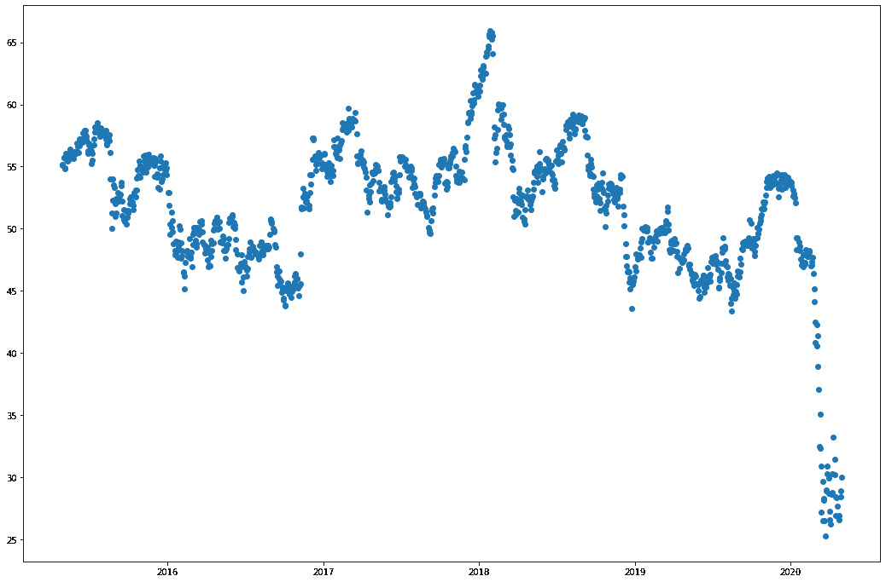

好多了！

我们的最后一步是向图表和轴添加标题。我们可以使用以下语句来实现这一点:

```
plt.title("Wells Fargo Stock Price (5Y Lookback)", fontsize=20)
plt.ylabel("Stock Price", fontsize=20)
plt.xlabel("Date", fontsize=20)
```

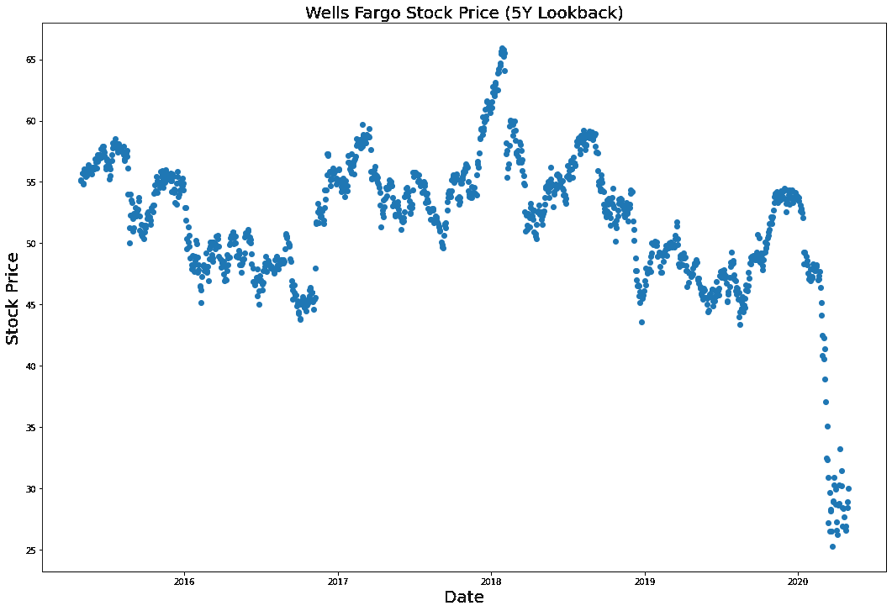

概括一下，下面是我们用来创建这个散点图的代码:

```
########################
#Create a Python scatterplot
########################

#Set the size of the matplotlib canvas
plt.figure(figsize = (18,12))

#Create the x-axis data
dates = bank_data.index.to_series()
dates = [pd.to_datetime(d) for d in dates]

#Create the y-axis data
WFC_stock_prices =  bank_data['WFC']

#Generate the scatterplot
plt.scatter(dates, WFC_stock_prices)

#Add titles to the chart and axes
plt.title("Wells Fargo Stock Price (5Y Lookback)", fontsize=20)
plt.ylabel("Stock Price", fontsize=20)
plt.xlabel("Date", fontsize=20)
```

### 如何在 Matplotlib 中创建直方图

[直方图](https://nickmccullum.com/python-visualization/histogram/)是数据可视化，允许您查看数据集中观察值的分布。

可使用`plt.hist`方法在 matplotlib 中创建直方图。

让我们创建一个直方图，让我们可以看到不同股票价格在我们的`bank_data`数据集中的分布(注意，我们需要在`plt.hist`中使用`transpose`方法，就像我们之前使用`plt.boxplot`一样):

```
plt.hist(bank_data.transpose())
```

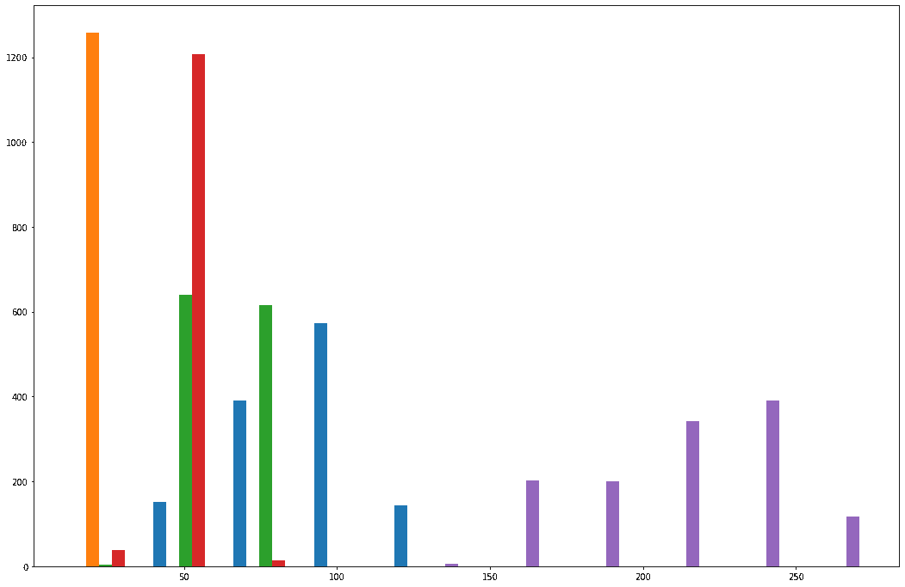

这是一个有趣的可视化，但我们仍然有很多事情要做。

你可能注意到的第一件事是直方图的不同列有不同的颜色。这是故意的。这些颜色在我们的熊猫数据框架中划分了不同的列。

也就是说，如果没有图例，这些颜色是没有意义的。我们可以使用以下语句将图例添加到 matplotlib 直方图中:

```
plt.legend(bank_data.columns,fontsize=20) 
```

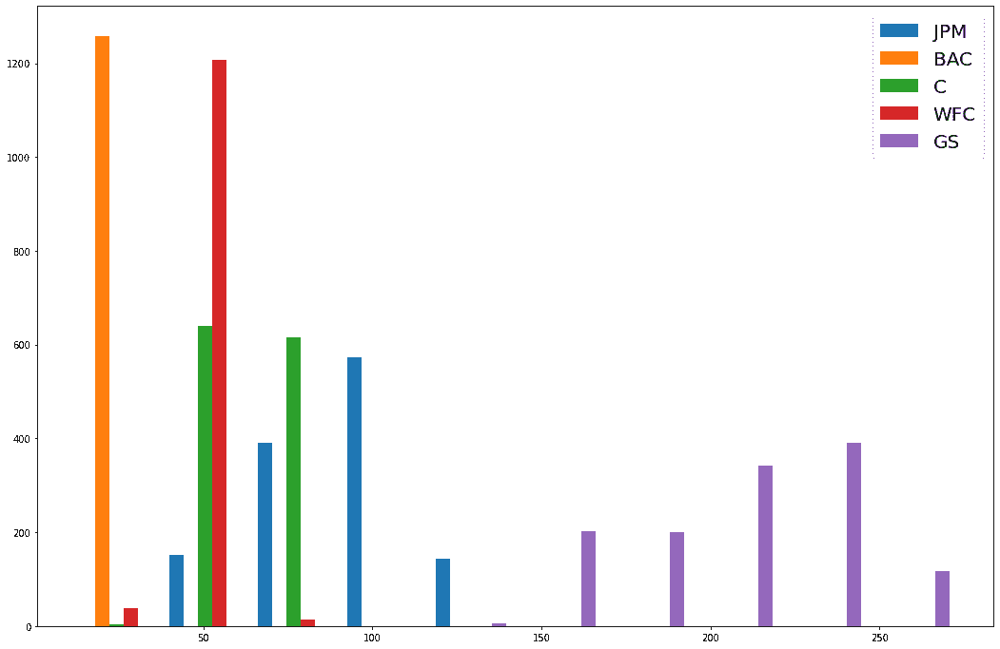

您可能还想更改直方图的`bin count`,这会在将观察值分组到直方图列时更改数据集被分成的切片数。

作为一个例子，下面是如何将直方图中的`bins`的编号改为`50`:

```
plt.hist(bank_data.transpose(), bins = 50)
```

最后，我们将使用我们在其他可视化中使用的相同语句向直方图及其轴添加标题:

```
plt.title("A Histogram of Daily Closing Stock Prices for the 5 Largest Banks in the US (5Y Lookback)", fontsize = 20)
plt.ylabel("Observations", fontsize = 20)
plt.xlabel("Stock Prices", fontsize = 20)
```

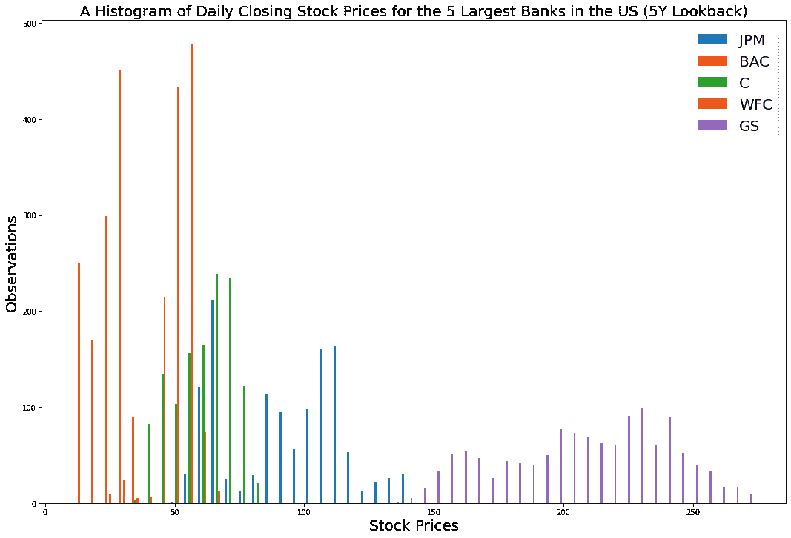

概括一下，下面是生成该直方图所需的完整代码:

```
########################
#Create a Python histogram
########################

#Set the size of the matplotlib canvas
plt.figure(figsize = (18,12))

#Generate the histogram
plt.hist(bank_data.transpose(), bins = 50)

#Add a legend to the histogram
plt.legend(bank_data.columns,fontsize=20)

#Add titles to the chart and axes
plt.title("A Histogram of Daily Closing Stock Prices for the 5 Largest Banks in the US (5Y Lookback)", fontsize = 20)
plt.ylabel("Observations", fontsize = 20)
plt.xlabel("Stock Prices", fontsize = 20)
```

### 如何在 Matplotlib 中创建支线剧情

在 matplotlib 中，[子图](https://nickmccullum.com/python-visualization/subplots/)是我们用来指代使用单个 Python 脚本在同一画布上创建的多个图的名称。

支线剧情可以用`plt.subplot`命令创建。该命令有三个参数:

*   子绘图网格中的行数
*   子绘图网格中的列数
*   您当前选择了哪个支线剧情

让我们创建一个 2x2 子图网格，其中包含以下图表(按此特定顺序排列):

1.  我们之前创建的箱线图
2.  我们之前创建的散点图
3.  使用`BAC`数据而不是`WFC`数据的类似 scatteplot
4.  我们之前创建的直方图

首先，让我们创建支线剧情网格:

```
plt.subplot(2,2,1)

plt.subplot(2,2,2)

plt.subplot(2,2,3)

plt.subplot(2,2,4)
```

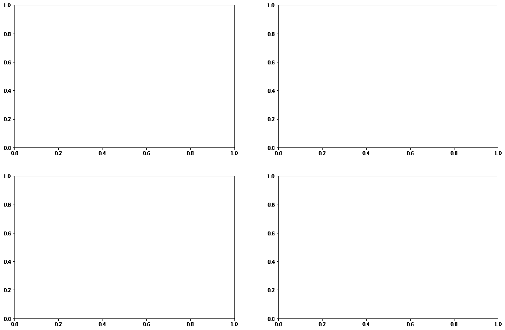

现在我们有了一个空白的子情节画布，我们只需要在每次调用`plt.subplot`方法后复制/粘贴每个情节所需的代码。

在代码块的末尾，我们添加了`plt.tight_layout`方法，该方法修复了生成 matplotlib 子图时出现的许多常见格式问题。

以下是完整的代码:

```
################################################
################################################
#Create subplots in Python
################################################
################################################

########################
#Subplot 1
########################
plt.subplot(2,2,1)

#Generate the boxplot
plt.boxplot(bank_data.transpose())

#Add titles to the chart and axes
plt.title('Boxplot of Bank Stock Prices (5Y Lookback)')
plt.xlabel('Bank', fontsize = 20)
plt.ylabel('Stock Prices')

#Add labels to each individual boxplot on the canvas
ticks = range(1, len(bank_data.columns)+1)
labels = list(bank_data.columns)
plt.xticks(ticks,labels)

########################
#Subplot 2
########################
plt.subplot(2,2,2)

#Create the x-axis data
dates = bank_data.index.to_series()
dates = [pd.to_datetime(d) for d in dates]

#Create the y-axis data
WFC_stock_prices =  bank_data['WFC']

#Generate the scatterplot
plt.scatter(dates, WFC_stock_prices)

#Add titles to the chart and axes
plt.title("Wells Fargo Stock Price (5Y Lookback)")
plt.ylabel("Stock Price")
plt.xlabel("Date")

########################
#Subplot 3
########################
plt.subplot(2,2,3)

#Create the x-axis data
dates = bank_data.index.to_series()
dates = [pd.to_datetime(d) for d in dates]

#Create the y-axis data
BAC_stock_prices =  bank_data['BAC']

#Generate the scatterplot
plt.scatter(dates, BAC_stock_prices)

#Add titles to the chart and axes
plt.title("Bank of America Stock Price (5Y Lookback)")
plt.ylabel("Stock Price")
plt.xlabel("Date")

########################
#Subplot 4
########################
plt.subplot(2,2,4)

#Generate the histogram
plt.hist(bank_data.transpose(), bins = 50)

#Add a legend to the histogram
plt.legend(bank_data.columns,fontsize=20)

#Add titles to the chart and axes
plt.title("A Histogram of Daily Closing Stock Prices for the 5 Largest Banks in the US (5Y Lookback)")
plt.ylabel("Observations")
plt.xlabel("Stock Prices")

plt.tight_layout()
```

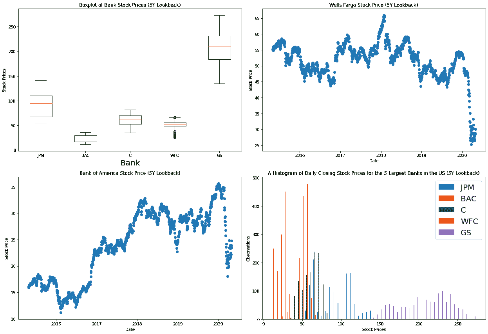

如您所见，有了一些基础知识，使用 matplotlib 创建漂亮的数据可视化就相对容易了。

我们需要做的最后一件事是将可视化保存为当前工作目录中的一个`.png`文件。Matplotlib 具有出色的内置功能来实现这一点。只需在第四个支线剧情完成后立即添加以下语句:

```
################################################
#Save the figure to our local machine
################################################

plt.savefig('bank_data.png')
```

在本教程的剩余部分，你将学习如何安排这个支线剧情矩阵每天在你的网站上自动更新。

## 步骤 3:创建一个 Amazon Web Services 帐户

到目前为止，在本教程中，我们已经学会了如何:

*   从 IEX 云 API 获取我们将要可视化的股票市场数据
*   通过 Python 的 matplotlib 库使用这些数据创建精彩的可视化效果

在本教程的剩余部分，您将学习如何自动化这些可视化，以便它们按照特定的时间表更新。

为此，我们将使用 Amazon Web Services 的云计算功能。您需要首先创建一个 AWS 帐户。

导航到[该 URL](https://aws.amazon.com/) 并点击右上角的“创建 AWS 帐户”:


AWS 的 web 应用程序将引导您完成创建帐户的步骤。

一旦创建了您的帐户，我们就可以开始使用可视化所需的两个 AWS 服务:AWS S3 和 AWS EC2。

## 步骤 4:创建一个 AWS S3 存储桶来存储你的可视化

AWS S3 代表简单存储服务。它是亚马逊网络服务中最受欢迎的云计算产品之一。开发人员使用 AWS S3 存储文件，并在以后通过面向公众的 URL 访问它们。

为了存储这些文件，我们必须首先创建一个所谓的 AWS S3 `bucket`，这是一个在 AWS 中存储文件的文件夹的别称。为此，首先导航到 Amazon Web Services 中的 S3 仪表板。

在亚马逊 S3 仪表盘的右侧，点击`Create bucket`，如下图:


在下一个屏幕上，AWS 将要求您为新的 S3 铲斗选择一个名称。出于本教程的目的，我们将使用 bucket 名称`nicks-first-bucket`。

接下来，您需要向下滚动并设置您的存储桶权限。由于我们将要上传的文件被设计成可公开访问的(毕竟，我们将把它们嵌入到网站的页面中)，那么你会希望权限尽可能开放。

以下是 AWS S3 权限的具体示例:

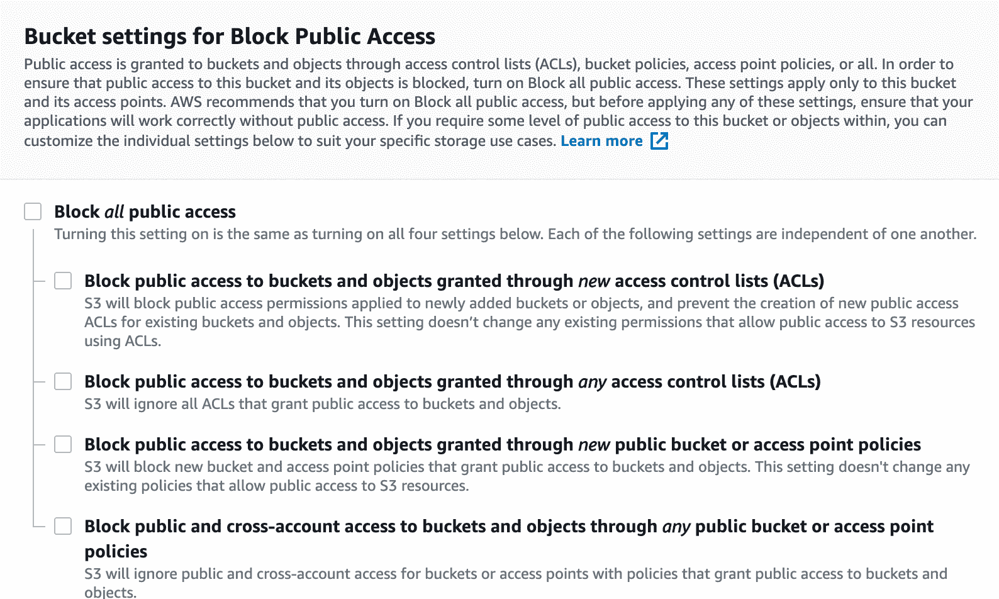

这些权限非常宽松，对于许多用例来说是不可接受的(尽管它们确实符合本教程的要求)。因此，在创建 AWS S3 时段之前，AWS 将要求您确认以下警告:


所有这些完成后，您可以滚动到页面底部并单击`Create Bucket`。您现在可以继续了！

## 步骤 5:修改 Python 脚本以将可视化保存到 AWS S3

我们当前形式的 Python 脚本旨在创建一个可视化，然后将该可视化保存到我们的本地计算机上。我们现在需要修改脚本，将`.png`文件保存到我们刚刚创建的 AWS S3 存储桶中(提醒一下，这个存储桶叫做`nicks-first-bucket`)。

我们将用来把文件上传到 AWS S3 存储桶的工具叫做`boto3`，它是用于 Python 的 Amazon Web Services 软件开发工具包(SDK)。

首先，你需要在你的机器上安装`boto3`。最简单的方法是使用`pip`包管理器:

```
pip3 install boto3
```

接下来，我们需要将`boto3`导入到 Python 脚本中。为此，我们在脚本开头附近添加了以下语句:

```
import boto3
```

鉴于亚马逊网络服务产品的深度和广度，`boto3`是一个极其复杂的 Python 库。

幸运的是，我们只需要使用`boto3`的一些最基本的功能。

下面的代码块将我们的最终可视化上传到亚马逊 S3。

```
################################################
#Push the file to the AWS S3 bucket
################################################

s3 = boto3.resource('s3')
s3.meta.client.upload_file('bank_data.png', 'nicks-first-bucket', 'bank_data.png', ExtraArgs={'ACL':'public-read'})
```

如您所见，`boto3`的`upload_file`方法有几个参数。让我们一个一个地分解它们:

1.  `bank_data.png`是我们本地机器上的文件名。
2.  `nicks-first-bucket`是我们要上传到的 S3 存储桶的名称。
3.  `bank_data.png`是我们希望文件上传到 AWS S3 存储桶后的名称。在这种情况下，它与第一个论点相同，但也不一定如此。
4.  `ExtraArgs={'ACL':'public-read'}`表示一旦文件被推送到 AWS S3 存储桶，公众就可以阅读该文件。

现在运行这段代码会导致错误。具体来说，Python 将抛出以下异常:

```
S3UploadFailedError: Failed to upload bank_data.png to nicks-first-bucket/bank_data.png: An error occurred (NoSuchBucket) when calling the PutObject operation: The specified bucket does not exist
```

这是为什么呢？

这是因为我们还没有配置本地机器通过`boto3`与 Amazon Web Services 交互。

为此，我们必须从命令行界面运行`aws configure`命令，并添加我们的访问键。[这篇来自亚马逊的文档分享了更多关于如何配置 AWS 命令行界面的信息。](https://docs.aws.amazon.com/cli/latest/userguide/cli-chap-configure.html)

如果你不想离开 freecodecamp.org，下面是设置 AWS CLI 的快速步骤。

首先，将鼠标放在右上角的用户名上，就像这样:

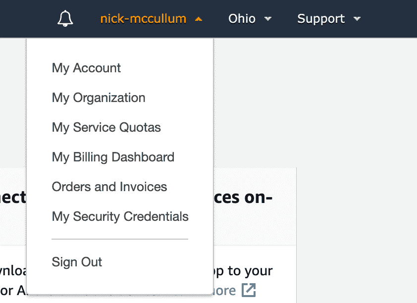

点击`My Security Credentials`。

在下一个屏幕上，您需要点击`Access keys (access key ID and secret access key`下拉菜单，然后点击`Create New Access Key`。

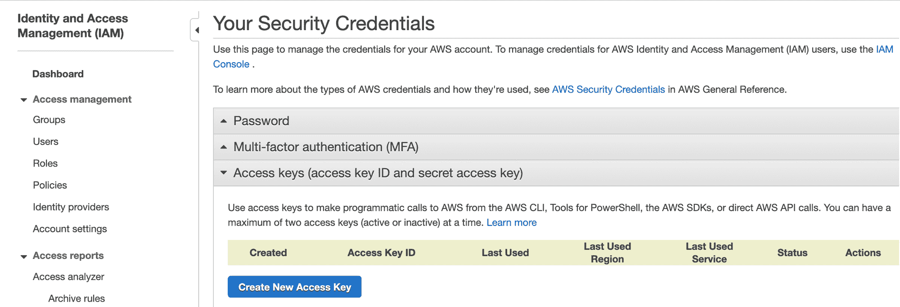

这将提示您下载一个包含您的访问密钥和秘密访问密钥的`.csv`文件。将这些保存在安全的地方。

接下来，通过在命令行上键入`aws configure`来触发 Amazon Web Services 命令行界面。这将提示您输入访问密钥和秘密访问密钥。

一旦这样做了，你的脚本应该可以正常工作了。重新运行脚本，并通过查看我们之前创建的存储桶来检查以确保您的 Python 可视化已正确上传到 AWS S3:

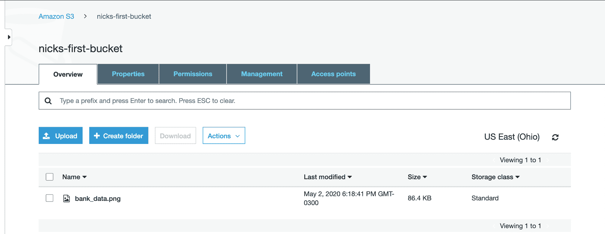

可视化已成功上传。我们现在准备在我们的网站上嵌入可视化！

## 步骤 6:在你的网站上嵌入可视化

一旦数据可视化上传到 AWS S3，您将希望在网站的某个地方嵌入可视化。这可能是在一篇博客文章或你网站上的任何其他页面。

为此，我们需要从我们的 S3 桶中获取图像的 URL。单击 S3 存储桶中的图像名称，导航到该项目的特定于文件的页面。它看起来会像这样:

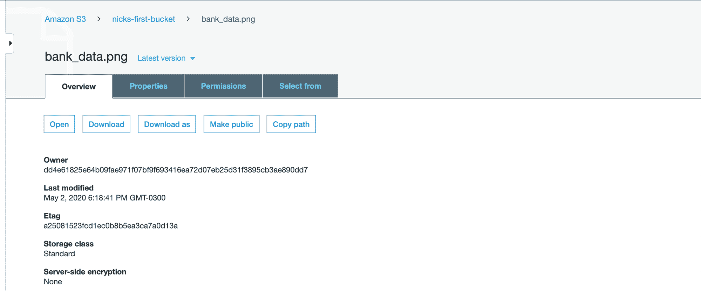

如果您滚动到页面底部，将会出现一个名为`Object URL`的字段，如下所示:

```
https://nicks-first-bucket.s3.us-east-2.amazonaws.com/bank_data.png
```

如果您将这个 URL 复制并粘贴到 web 浏览器中，它实际上会下载我们之前上传的`bank_data.png`文件！

要将这个图像嵌入到网页中，您需要将它作为属性传递到 HTML `img`标签中。下面是我们如何使用 HTML 将`bank_data.png`图片嵌入到网页中:

```

```

**注意**:在嵌入网站的真实图像中，包含一个`alt`标签对于可访问性是很重要的。

在下一节中，我们将学习如何安排我们的 Python 脚本定期运行，以便`bank_data.png`中的数据总是最新的。

## 步骤 7:创建一个 AWS EC2 实例

我们将使用 AWS EC2 来安排我们的 Python 脚本定期运行。

AWS EC2 代表弹性计算云，与 S3 一起，是亚马逊最受欢迎的云计算服务之一。

它允许你在亚马逊数据中心的计算机上租用小单元的计算能力(称为实例),并安排这些计算机为你执行任务。

AWS EC2 是一项相当出色的服务，因为如果你租用他们的一些较小的计算机，那么你实际上有资格获得 AWS 免费层。换句话说，谨慎使用 AWS EC2 中的定价将使您避免支付任何费用。

首先，我们需要创建第一个 EC2 实例。为此，导航到 AWS 管理控制台中的 EC2 仪表板，然后单击`Launch Instance`:

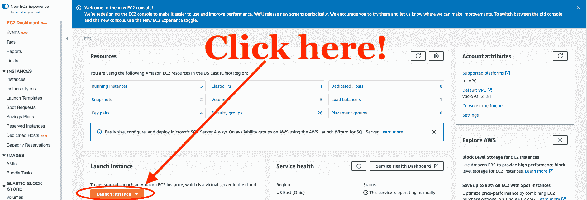

这会将您带到一个包含 AWS EC2 中所有可用实例类型的屏幕。这里有几乎难以置信的多种选择。我们想要一个符合`Free tier eligible`条件的实例类型——具体来说，我选择了`Amazon Linux 2 AMI (HVM), SSD Volume Type`:


点击`Select`继续。

在下一页，AWS 将要求您为您的机器选择规格。您可以选择的字段包括:

*   `Family`
*   `Type`
*   `vCPUs`
*   `Memory`
*   `Instance Storage (GB)`
*   `EBS-Optimized`
*   `Network Performance`
*   `IPv6 Support`

出于本教程的目的，我们只想选择符合自由层条件的单台计算机。它的特点是有一个看起来像这样的绿色小标签:


点击屏幕底部的`Review and Launch`继续。

下一个屏幕将显示新实例的详细信息，供您查看。

快速查看机器的规格，然后点击右下角的`Launch`。

点击`Launch`按钮将触发一个弹出窗口，要求您`Select an existing key pair or create a new key pair`。

一个密钥对由 AWS 持有的一个公钥和一个私钥组成，您必须下载并存储在一个`.pem`文件中。

为了访问您的 EC2 实例(通常通过 SSH)，您必须能够访问那个`.pem`文件。您也可以选择在没有密钥对的情况下继续，但是出于安全原因，不建议使用**而不是**。

一旦完成，您的实例将启动！祝贺您在 Amazon Web Services 最重要的基础设施服务之一上启动了您的第一个实例。

接下来，您需要将 Python 脚本推入 EC2 实例。

下面是一个通用的命令状态语句，允许您将文件移动到 EC2 实例中:

```
scp -i path/to/.pem_file path/to/file   username@host_address.amazonaws.com:/path_to_copy 
```

使用必要的替换来运行该语句，以将`bank_stock_data.py`移动到 EC2 实例中。

您可能认为现在可以从 EC2 实例中运行 Python 脚本了。不幸的是，事实并非如此。您的 EC2 实例没有附带必要的 Python 包。

要安装我们使用的包，您可以导出一个`requirements.txt`文件并使用`pip`导入适当的包，或者您可以简单地运行以下命令:

```
sudo yum install python3-pip
pip3 install pandas
pip3 install boto3
```

我们现在已经准备好安排 Python 脚本在 EC2 实例上定期运行了！我们将在文章的下一部分对此进行探讨。

## 步骤 8:安排 Python 脚本在 AWS EC2 上定期运行

本教程中剩下的唯一一步是安排我们的`bank_stock_data.py`文件在 EC2 实例中定期运行。

我们可以使用一个名为`cron`的命令行实用程序来做到这一点。

`cron`要求您指定两件事:

*   您希望任务(称为`cron job`)执行的频率，通过 cron 表达式表示
*   当计划 cron 作业时，需要执行什么

首先，让我们从创建一个 cron 表达式开始。

在外人看来，表情就像是胡言乱语。例如，下面是表示“每天中午”的`cron`表达式:

```
00 12 * * *
```

我个人会利用 crontab guru(T2)网站，这是一个很好的资源，可以让你明白(用外行人的话来说)你的表达是什么意思。

以下是如何使用 crontab guru 网站安排 cron 作业在每周日上午 7 点运行的方法:


我们现在有一个工具(crontab guru)可以用来生成我们的`cron`表达式。我们现在需要指示 EC2 实例的`cron`守护进程在每周日早上 7 点运行我们的`bank_stock_data.py`文件。

为此，我们将首先在 EC2 实例中创建一个名为`bank_stock_data.cron`的新文件。因为我使用了`vim`文本编辑器，所以我使用的命令是:

```
vim bank_stock_data.cron
```

在这个`.cron`文件中，应该有一行是这样的:`(cron expression) (statement to execute)`。我们的`cron`表达式是`00 7 * * 7`，我们要执行的语句是`python3 bank_stock_data.py`。

综上所述，`bank_stock_data.cron`的最终内容应该是这样的:

```
00 7 * * 7 python3 bank_stock_data.py
```

本教程的最后一步是将`bank_stock_data.cron`文件导入到 EC2 实例的`crontab`中。`crontab`本质上是一个文件，它为`cron`守护进程定期执行的任务进行批处理。

让我们先花点时间在`crontab`中研究一下。以下命令将`crontab`的内容打印到我们的控制台:

```
crontab -l
```

由于我们没有向 crontab 添加任何内容，并且我们刚刚创建了 EC2 实例，所以这条语句应该不会输出任何内容。

现在让我们将`bank_stock_data.cron`导入到`crontab`中。下面是执行此操作的语句:

```
crontab bank_stock_data.cron
```

现在我们应该能够打印出我们的`crontab`的内容，并看到`bank_stock_data.cron`的内容。

要对此进行测试，请运行以下命令:

```
crontab -l
```

它应该打印:

```
00 7 * * 7 python3 bank_stock_data.py
```

## 最后的想法

在本教程中，您学习了如何使用 Python 和 Matplotlib 创建漂亮的数据可视化，并定期更新。具体来说，我们讨论了:

*   如何从 IEX 云下载和解析数据，这是我最喜欢的高质量金融数据来源之一
*   如何格式化熊猫数据框架中的数据
*   如何使用 matplotlib 在 Python 中创建数据可视化
*   如何使用 Amazon Web Services 创建帐户
*   如何将静态文件上传到 S3 自动气象站
*   如何将 AWS S3 托管的`.png`文件嵌入网站页面
*   如何创建 AWS EC2 实例
*   如何使用 AWS EC2 使用`cron`安排 Python 脚本定期运行

这篇文章由 Nick McCullum 发表，他在自己的网站上教人们如何编码。