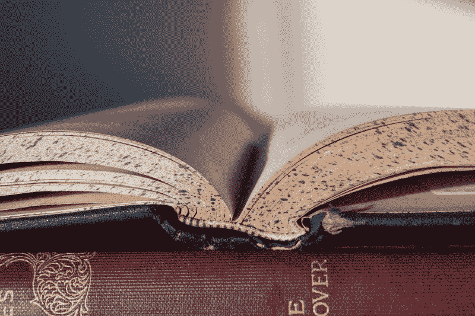

# 我如何利用机器学习探索英美文学的差异

> 原文：<https://www.freecodecamp.org/news/how-to-differentiate-between-british-and-american-literature-being-a-machine-learning-engineer-ac842662da1c/>

索菲亚·戈多维克

# 我如何利用机器学习探索英美文学的差异

随着我对英语文学的进一步研究，我的兴趣被激起了:美国英语和英国英语有什么不同？

有了这个问题，接下来的步骤是应用自然语言处理和机器学习技术来找到具体的例子。我很想知道是否有可能训练一个分类器来区分文学文本。

区分用不同语言编写的文本是相当容易的，因为单词交集的基数(机器学习方面的特征)相对较小。文本按类别分类(如科学、无神论、计算机图形学等。)是一个众所周知的“hello world”。当我试图比较同一种语言的两种方言时，我面临着一个更困难的任务，因为文本没有共同的主题。

机器学习最耗时的阶段是处理数据检索。对于训练样本，我使用了古登堡计划的文本，这些文本可以免费下载。至于美国和英国作者的名单，我使用了我在维基百科上找到的作者的名字。

我遇到的挑战之一是找到与维基百科页面匹配的文本作者的名字。站点上实现了一个很好的名称搜索，但是由于站点不允许解析数据，所以我建议使用包含元数据的文件。这意味着我需要解决一个非同小可的匹配姓名的任务(亚瑟·伊格内修斯·柯南·道尔爵士和 c .道尔是同一个人，但 M.E .道尔是另一个人)——而且我必须做到非常准确。

相反，我选择牺牲样本大小，以获得高精度，并节省一些时间。我选择了一个作者的维基百科链接作为唯一标识符，它包含在一些元数据文件中。有了这些文件，我能够获得大约 1600 个英国文本和 2500 个美国文本，并使用它们开始训练我的分类器。

对于这个项目，我使用了 sklearn 包。数据收集和分析阶段之后的第一步是预处理，其中我使用了 CountVectorizer。CountVecrorizer 将文本数据作为输入，并将特征向量作为输出返回。接下来，我需要计算 **tf-idf** (术语频率—倒置文档频率)。简要解释我为什么需要使用它以及如何使用:

例如，以单词“the”为例，计算该单词在给定文本 a 中的出现次数。假设我们有 100 次出现，文档中的单词总数为 1000。

因此，

`tf(“the”) = 100/1000 = 0.1`

接下来，以出现了 50 次的单词“萼片”为例:

`tf(“sepal”) = 50/1000 = 0.05`

为了计算这些单词的倒排文档频率，我们需要取该单词至少出现一次的文本数量与文本总数之比的对数。如果有 10，000 个文本，并且每个文本中都有单词“the”:

`idf(“the”) = log(10000/10000) = 0`和

`tf-idf(“the”) = idf(“the”) * tf(“the”) = 0 * 0.1 = 0`

“萼片”这个词更罕见，只在 5 篇文章中出现过。因此:

`idf(“sepal”) = log(10000/5) and tf-idf(“sepal”) = 7.6 * 0.05 = 0.38`

因此，最频繁出现的单词权重较小，而特定的较罕见的单词权重较大。如果“萼片”一词多次出现，我们可以认为这是一篇植物学文本。我们不能用单词来填充分类器，我们将使用 tf-idf 度量来代替。

在我将数据呈现为一组特征之后，我需要训练分类器。我处理的是文本数据，它以稀疏数据的形式出现，所以最好的选择是使用线性分类器，它可以很好地处理大量的特征。

首先，我使用默认参数运行了 CountVectorizer、TF-IDFTransformer 和 SGDClassifier。通过分析样本大小的准确度图(准确度在 0.6 到 0.85 之间波动)，我发现分类器非常依赖于所用的特定样本，因此不是非常有效。

在收到一个分类器权重列表后，我注意到了问题的一部分:分类器被输入了像“of”和“he”这样的词，我们应该把它们视为噪音。通过将参数`stop_words`设置为 CountVectorizer: `stop_words = ‘english’`(或者您自己定制的停用词列表)，我可以很容易地解决这个问题。

去掉默认的停用词，我得到了 0.85 的准确率。之后，我使用 GridSearchCV 启动了参数的自动选择，并获得了 0.89 的最终精度。我也许可以用更大的训练样本来改善这个结果，但是现在我坚持使用这个分类器。

现在我最感兴趣的是:哪些词指向了文本的起源？以下是单词列表，在分类器中按权重降序排列:

**美国:**美元，纽约，纽约，女孩，灰色，美国，卡沃尔，颜色，城市，艾因，龙，正义，客厅，波士顿，荣誉，华盛顿，家，劳动，得到，最后，也许，霍德，永远，多萝西，博士

**英国:**圆，先生，女士，伦敦，相当，先生，将，主，灰色，亲爱的，荣誉，有，菲利普，穷人，英镑，斯克罗吉，兜，东西，海，人，结束，来，颜色，插图，英语，学会了

在玩分类器的时候，我能够挑出最“美国化”的英国作者和最“英国化”的美国作者(这是一种狡猾的方法，可以看出我的分类器有多糟糕)。

**最“英国”的美国人:**

*   弗朗西丝·霍奇森·伯内特(出生在英国，17 岁时移居美国，所以我把她当作美国作家)
*   亨利·詹姆斯(出生于美国，33 岁时移居英国)
*   欧文·威斯特(是的，西方小说之父)
*   玛丽·罗伯茨·莱茵哈特(被称为美国的阿加莎·克里斯蒂是有原因的)
*   威廉·麦克菲(另一位年轻时移居美国的作家)

**最“美国”的英国人:**

*   拉迪亚德·吉卜林(他在美国生活了几年，还写了《美国笔记》)
*   安东尼·特罗洛普(《北美》的作者)
*   弗雷德里克·马里亚特(1812 年英美战争的老兵，由于他的“维奥莱特先生在加利福尼亚州、索那拉和得克萨斯州西部的旅行和冒险故事”使他被归入美国一类)
*   阿诺德·贝内特(《你的美国:第一次访问的印象》的作者)还有一位先生写游记
*   E.菲利普斯·奥本海姆

也是最“英国”的英国和“美国”的美国作家(因为分类器仍然工作良好):

**美国人:**

*   弗朗西斯·霍普金森·史密斯
*   哈姆林·加兰
*   乔治·艾德
*   查尔斯·达德利·华纳
*   [人名]马克·吐温(美国幽默大师、小说家、作家、演说家)

**英国:**

*   乔治·梅瑞狄斯
*   塞缪尔·理查逊
*   约翰·高尔斯华绥
*   吉尔伯特·基思·切斯特顿
*   安东尼·特罗洛普(哦，你好)

我是受@TragicAllyHere 推文的启发来做这个工作的:

正如我所意识到的，这真的很重要。