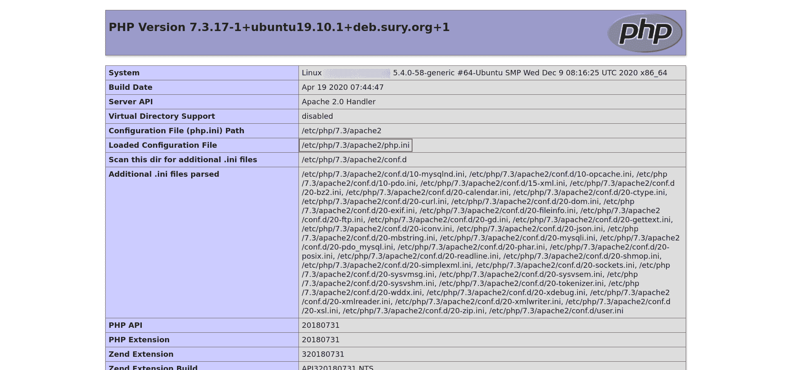

# 如何显示 PHP 错误并启用错误报告

> 原文：<https://www.freecodecamp.org/news/how-to-display-php-errors-and-enable-error-reporting/>

我仍然清楚地记得我第一次学习 PHP 错误处理的时候。

那是我编程的第四年，也是我学习 PHP 的第二年，我申请了当地一家机构的开发人员职位。应用程序要求我发送一个代码样本(GitHub，因为我们知道它当时并不存在),所以我压缩并发送了一个我前一年创建的简单的自定义 CMS。

我从审查代码的人那里收到的电子邮件至今仍让我不寒而栗。

“我有点担心你的项目，但一旦我关闭了错误报告，我发现它实际上工作得很好”。

那是我第一次搜索“PHP 错误报告”，发现如何启用它，当我看到之前对我隐藏的错误流时，我死在了里面。

PHP 错误和错误报告是许多初学这门语言的开发人员最初可能会忽略的东西。这是因为，在许多基于 PHP 的 web 服务器安装中，PHP 错误可能会被默认禁止。这意味着没有人看到或意识到这些错误。

因此，了解在哪里以及如何启用它们是一个好主意，尤其是对于您的本地开发环境。这有助于您尽早发现代码中的错误。

## 如何显示 PHP 错误

如果你在谷歌上搜索“PHP 错误”,你会看到的第一个结果是指向 [error_reporting](https://www.php.net/manual/en/function.error-reporting.php) 函数文档的链接。

这个函数允许您在 PHP 脚本(或脚本集合)运行时设置 PHP 错误报告的级别，或者检索 PHP 配置中定义的 PHP 错误报告的当前级别。

`error_reporting`函数接受单个参数，一个整数，它指示允许哪一级别的报告。不传递任何参数只是返回当前级别集。

可以作为参数传递的可能值有一长串，但是我们将在后面深入讨论。

现在，知道每个可能的值也作为 PHP 预定义的常量存在是很重要的。例如，常数`E_ERROR` 的值为 1。这意味着您可以将`1`或`E_ERROR`传递给 error_reporting 函数，并获得相同的结果。

举个简单的例子，如果我们创建一个`php_error_test.php` PHP 脚本文件，我们可以看到当前的错误报告级别设置，并将其设置为一个新的级别。

```
<?php
// echo the current error reporting level
echo error_reporting(); 
```

```
<?php
// report all Fatal run-time errors.
echo error_reporting(1); 
```

## 错误报告配置

当您只想查看与您当前正在处理的代码片段相关的任何错误时，以这种方式使用`error_reporting`函数非常有用。

但是更好的做法是控制在您的本地开发环境中报告哪些错误，并将它们记录在某个逻辑位置，以便能够在您编码时进行检查。这可以在 PHP 初始化(或`php.ini`)文件中完成。

`php.ini`文件负责配置 PHP 行为的所有方面。在这里你可以设置一些事情，比如分配多少内存给 PHP 脚本，允许上传多大的文件，以及你希望你的环境有什么样的`error_reporting`级别。

如果你不确定你的`php.ini`文件在哪里，一种方法是创建一个使用 [phpinfo](https://www.php.net/manual/en/function.phpinfo.php) 函数的 PHP 脚本。这个函数将输出与 PHP 安装相关的所有信息。

```
<?php
phpinfo();
```

从我的 phpinfo 可以看到，我当前的`php.ini`文件位于`/etc/php/7.3/apache2/php.ini`。



一旦你找到了你的`php.ini`文件，在你选择的编辑器中打开它，搜索名为‘错误处理和日志’的部分。有趣的事情开始了！

## 错误报告指令

在该部分中，您首先会看到一个注释部分，其中包括所有错误级别常量的详细描述。这很好，因为稍后您将使用它们来设置您的错误报告级别。

幸运的是，在线 PHP 手册中也记录了这些常量[，以方便参考。](https://www.php.net/manual/en/errorfunc.constants.php)

在这个列表下面是第二个常用值列表。这向您展示了如何设置一些常用的错误报告值组合集，包括默认值、开发环境的建议值和生产环境的建议值。

```
; Common Values:
;   E_ALL (Show all errors, warnings and notices including coding standards.)
;   E_ALL & ~E_NOTICE  (Show all errors, except for notices)
;   E_ALL & ~E_NOTICE & ~E_STRICT  (Show all errors, except for notices and coding standards warnings.)
;   E_COMPILE_ERROR|E_RECOVERABLE_ERROR|E_ERROR|E_CORE_ERROR  (Show only errors)
; Default Value: E_ALL & ~E_NOTICE & ~E_STRICT & ~E_DEPRECATED
; Development Value: E_ALL
; Production Value: E_ALL & ~E_DEPRECATED & ~E_STRICT
```

最后，在所有评论的底部是你的`error_reporting`等级的当前值。对于本地开发，我建议将其设置为`E_ALL`，以便查看所有错误。

```
error_reporting = E_ALL
```

当我建立一个新的开发环境时，这通常是我首先设置的事情之一。这样，我就可以看到报告的所有错误。

在 error_reporting 指令之后，您可以设置一些附加指令。和以前一样，php.ini 文件包含了对每个指令的描述，但是我将在下面给出对重要指令的简要描述。

`display_errors`指令允许您切换 PHP 是否输出错误。我通常将此设置为 On，这样我可以在错误发生时看到它们。

```
display_errors=On
```

`display_startup_errors`允许 PHP 启动序列中可能发生的错误的开/关切换。这些通常是 PHP 或 web 服务器配置中的错误，而不是具体的代码错误。建议不要这样做，除非您正在调试一个问题，并且不确定是什么导致了这个问题。

指令告诉 PHP 是否将错误记录到错误日志文件中。默认情况下，此选项始终处于打开状态，建议您这样做。

其余的指令可以保留为缺省值，可能除了`error_log`指令，如果`log_errors`打开，它允许您指定在哪里记录错误。默认情况下，它会在您的 web 服务器定义记录错误的地方记录错误。

## 自定义错误日志记录

我使用 Ubuntu 上的 Apache web 服务器，我的特定于项目的虚拟主机配置使用以下内容来确定错误日志的位置。

```
ErrorLog ${APACHE_LOG_DIR}/project-error.log
```

这意味着它将记录到默认的 Apache 日志目录中，这个目录是在一个名为`project-error.log`的文件下的`/var/log/apache2`。通常我会将`project`替换为与之相关的网络项目的名称。

因此，根据您的本地开发环境，您可能需要对此进行调整以满足您的需求。或者，如果您不能在 web 服务器级别更改它，您可以在`php.ini`级别将它设置到一个特定的位置。

```
error_log = /path/to/php.log
```

值得注意的是，这会将所有 PHP 错误记录到这个文件中，如果您正在处理多个项目，这可能并不理想。然而，总是知道检查一个文件的错误可能对你更好，所以你的里程可能会有所不同。

## 找到并修复这些错误

如果你最近开始用 PHP 编程，并且你决定打开错误报告，准备好处理现有代码的后果。你可能会看到一些你没有预料到的事情，需要修复。

好处是，现在您知道如何在服务器级别打开所有这些，您可以确保在错误发生时看到它们，并在其他人看到它们之前处理它们！

哦，如果你想知道，我在这篇文章开头提到的错误与我没有正确定义常量有关，因为没有在常量名两边加引号。

```
define(CONSTANT, 'Hello world.');
```

PHP 允许(并且可能仍然允许)这样做，但是它会触发一个通知。

```
Notice: Use of undefined constant CONSTANT - assumed 'CONSTANT' 
```

每当我定义一个常量时，这个通知就会被触发，对于那个项目来说大约是 8 或 9 次。对于一个人来说，在每一页的顶部看到 8 或 9 个通知并不太好...