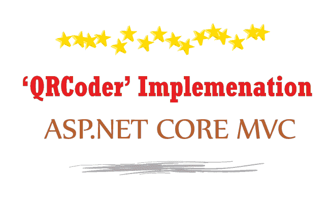
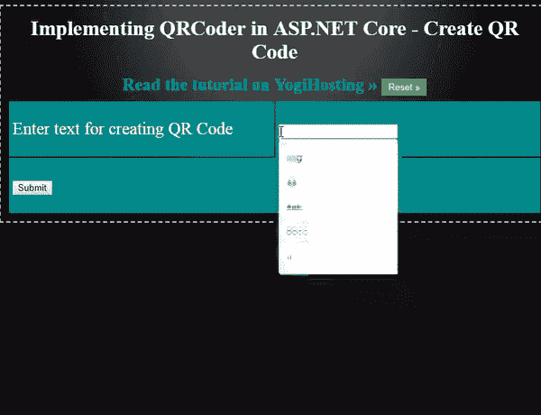
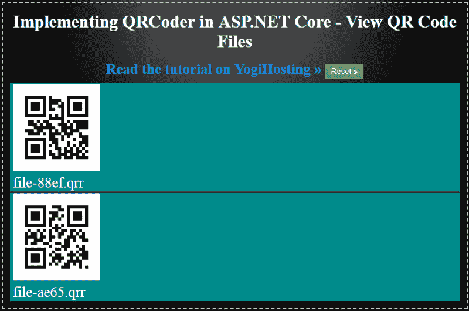

# 如何使用 C#在 ASP.NET 内核中轻松实现 QRCoder

> 原文：<https://www.freecodecamp.org/news/how-to-easily-implement-qrcoder-in-asp-net-core-using-c-10c4aa857e84/>

由瑜伽熊

# 如何使用 C#在 ASP.NET 内核中轻松实现 QRCoder



**QRCoder ASP.NET Core Implementation**

QRCoder 是一个非常流行的用 C#编写的二维码实现库。在 [**GitHub**](https://github.com/codebude/QRCoder) **中都有。**这里我将实现 QRCoder 库，在我的 ASP.NET 核心应用程序中生成 QR 码。我也将使用 C#。

我将以 3 种方式实现 QRCoder，它们是:

1.为任何文本创建 QR 码位图图像。

2.创建二维码文件(。qrr)，然后将这些文件保存在应用程序中。

3.读取并显示所有二维码文件(。qrr)。

让我们从在[**ASP.NET 核心**](https://www.yogihosting.com/category/aspnet-core/) 框架中安装 QRCoder 开始。

[**你可以从我的 GitHub story**](https://github.com/yogyogi/QRCoder-implemented-in-ASP.NET-Core)**下载完整代码。**

### **安装**

通过 NuGet 包管理器安装 QRCoder。如果您想使用 NuGet，只需搜索“QRCoder”或在 NuGet 软件包管理器控制台中运行以下命令:

`PM> Install-Package QRCoder`

QRCoder 将在 1 分钟内安装完毕，并可随时使用。

现在让我们从上面提到的 3 种方式来实现 QRCoder 开始。

### **为任何文本创建二维码位图图像**

在控制器文件夹中创建一个名为“`QRCoderController`”的新控制器。控制器将被创建，其中只有一个名为'【T1]'的动作方法:

```
public IActionResult Index()
{
    return View();
}
```

在控制器中导入以下名称空间:

```
using System;
using System.Collections.Generic;
using System.Drawing;
using System.IO;
using Microsoft.AspNetCore.Mvc;
using QRCoder;
```

接下来，将类型`[HttpPost]`的索引动作添加到控制器:

```
[HttpPost]
public IActionResult Index(string qrText)
{
    QRCodeGenerator qrGenerator = new QRCodeGenerator();
    QRCodeData qrCodeData = qrGenerator.CreateQrCode(qrText,
    QRCodeGenerator.ECCLevel.Q);
    QRCode qrCode = new QRCode(qrCodeData);
    Bitmap qrCodeImage = qrCode.GetGraphic(20);
    return View(BitmapToBytes(qrCodeImage));
}
```

> 此索引操作接收一个名为“qrText”的字符串参数。它包含由视图中定义的输入控件提供的文本。此文本将被转换为 QR 码位图图像。以下代码行完成了这项工作:

```
QRCodeGenerator qrGenerator = new QRCodeGenerator();

QRCodeData qrCodeData = qrGenerator.CreateQrCode(qrText, QRCodeGenerator.ECCLevel.Q);

QRCode qrCode = new QRCode(qrCodeData);
Bitmap qrCodeImage = qrCode.GetGraphic(20);
```

定义的 QRCode 对象(“`qrCode`”)调用名为“【T1”)的静态函数。该函数的作用是将位图图像转换为“`Byte[]`”。

将此功能添加到您的控制器:

```
private static Byte[] BitmapToBytes(Bitmap img)
{
    using (MemoryStream stream = new MemoryStream())
    {
        img.Save(stream, System.Drawing.Imaging.ImageFormat.Png);
        return stream.ToArray();
    }
}
```

最后，使用以下代码在“`Views/QRCoder`”文件夹中创建索引视图:

```
@model Byte[]
@{
    Layout = null;
}

<!DOCTYPE html>
<html>

<head>
  <meta name="viewport" content="width=device-width" />
  <title>Implementing QRCoder in ASP.NET Core - Create QR Code</title>
  <style>
    body {
      background: #111 no-repeat;
      background-image: -webkit-gradient(radial, 50% 0, 150, 50% 0, 300, from(#444), to(#111));
    }

    h1,
    h2,
    h3 {
      text-align: center;
      color: #FFF;
      margin: 5px 0;
    }

    h1 {
      font-size: 30px;
    }

    h2 a {
      font-size: 25px;
      color: #0184e3;
      text-decoration: none;
    }

    h3 {
      font-size: 23px;
      border-bottom: solid 3px #CCC;
      padding-bottom: 10px;
    }

    h3 a {
      color: #00e8ff;
      text-decoration: none;
    }

    h3 a:hover,
    h2 a:hover {
      text-decoration: underline;
    }

    .container {
      width: 800px;
      margin: auto;
      color: #FFF;
      font-size: 25px;
    }

    .container #content {
      border: dashed 2px #CCC;
      padding: 10px;
    }

    #reset {
      padding: 5px 10px;
      background: #4CAF50;
      border: none;
      color: #FFF;
      cursor: pointer;
    }

    #reset:hover {
      color: #4CAF50;
      background: #FFF;
    }

    #viewContent table {
      width: 100%;
    }

    #viewContent table tr {
      height: 80px;
      background: darkcyan;
    }

    #viewContent table tr td {
      width: 50%;
      padding-left: 5px;
    }
  </style>
</head>

<body>
  <div class="container">
    <div id="content">
      <h1>Implementing QRCoder in ASP.NET Core - Create QR Code</h1>
      <h2>
        <a href="http://www.yogihosting.com/category/aspnet-core/">Read the tutorial on YogiHosting » </a>
        <button id="reset" onclick="location=''">Reset »</button>
      </h2>
      <div id="viewContent">
        @using (Html.BeginForm(null, null, FormMethod.Post)) {
        <table>
          <tbody>
            <tr>
              <td>
                <label>Enter text for creating QR Code</label
                </td>
                <td>
                  <input type="text" name="qrText" />
                </td>
              </tr>
              <tr>
                <td colspan="2">
                  <button>Submit</button>
                </td>
              </tr>
            </tbody>
          </table>
        }
      </div>

      @{
        if (Model != null)
        {
          <h3>QR Code Successfully Generated</h3>
          
        }
      }
    </div>
  </div>
</body>
</html>
```

索引视图有一个“`input`”控件。用户在该控件中输入文本以创建 QR 码:

`<input type="text" name="qrText"` / >

一旦通过 Index Action 方法生成了 QR 代码，其'`byte`'数组将作为模型返回到视图，然后位图图像将通过以下代码显示:

```
@{
  if (Model != null)
  {
    <h3>QR Code Successfully Generated</h3>
    
  }
}
```

#### **测试代码**

运行您的应用程序并转到 URL—“`http://localhost:50755/QRCoder`”以调用索引操作方法。

在文本框中，添加您的文本并单击提交按钮以创建 QR 码位图图像。

请看这张展示其工作原理的图片:



**create QRCode Bitmap Image**

### **创建二维码文件(。qrr)，然后将这些文件保存在应用程序中**

您还可以为文本生成二维码文件，并将其保存在您的网站中。这些文件。 *qrr* 扩展。

向您的控制器添加以下名为'`GenerateFile`'的动作方法:

```
public IActionResult GenerateFile()
{
  return View();
}

[HttpPost]
public IActionResult GenerateFile(string qrText)
{
  QRCodeGenerator qrGenerator = new QRCodeGenerator();
  QRCodeData qrCodeData = qrGenerator.CreateQrCode(qrText,   QRCodeGenerator.ECCLevel.Q);

  string fileGuid = Guid.NewGuid().ToString().Substring(0, 4);

  qrCodeData.SaveRawData("wwwroot/qrr/file-" + fileGuid + ".qrr", QRCodeData.Compression.Uncompressed);

  QRCodeData qrCodeData1 = new QRCodeData("wwwroot/qrr/file-" + fileGuid + ".qrr", QRCodeData.Compression.Uncompressed);

  QRCode qrCode = new QRCode(qrCodeData1);
  Bitmap qrCodeImage = qrCode.GetGraphic(20);
  return View(BitmapToBytes(qrCodeImage));
}
```

此操作方法的`[HttpPost]` 版本在“`wwwroot/qrr`”文件夹中生成二维码文件。完成这项工作的代码如下:

```
QRCodeGenerator qrGenerator = new QRCodeGenerator();

QRCodeData qrCodeData = qrGenerator.CreateQrCode(qrText, QRCodeGenerator.ECCLevel.Q);

string fileGuid = Guid.NewGuid().ToString().Substring(0, 4);

qrCodeData.SaveRawData("wwwroot/qrr/file-" + fileGuid + ".qrr", QRCodeData.Compression.Uncompressed);
```

一旦。qrr 文件被创建，然后我只是阅读它在网站上的保存位置。然后我把它转换成位图类型，最后把图像的字节发送给视图。对应的代码是:

```
QRCodeData qrCodeData1 = new QRCodeData("wwwroot/qrr/file-" + fileGuid + ".qrr", QRCodeData.Compression.Uncompressed);

QRCode qrCode = new QRCode(qrCodeData1);
Bitmap qrCodeImage = qrCode.GetGraphic(20);

return View(BitmapToBytes(qrCodeImage));
```

接下来，将 GenerateFile 视图添加到“`Views/QRCoder`”文件夹中，并向其中添加以下代码:

```
@model Byte[]
@{
    Layout = null;
}

<!DOCTYPE html>
<html>

<head>
  <meta name="viewport" content="width=device-width" />
  <title>Implementing QRCoder in ASP.NET Core - Create QR Code File</title>
  <style>
    body {
      background: #111 no-repeat;
      background-image: -webkit-gradient(radial, 50% 0, 150, 50% 0, 300, from(#444), to(#111));
    }

    h1,
    h2,
    h3 {
      text-align: center;
      color: #FFF;
      margin: 5px 0;
    }

    h1 {
      font-size: 30px;
    }

    h2 a {
      font-size: 25px;
      color: #0184e3;
      text-decoration: none;
    }

    h3 {
      font-size: 23px;
      border-bottom: solid 3px #CCC;
      padding-bottom: 10px;
    }

    h3 a {
      color: #00e8ff;
      text-decoration: none;
    }

    h3 a:hover,
    h2 a:hover {
      text-decoration: underline;
    }

    .container {
      width: 800px;
      margin: auto;
      color: #FFF;
      font-size: 25px;
    }

    .container #content {
      border: dashed 2px #CCC;
      padding: 10px;
    }

    #reset {
      padding: 5px 10px;
      background: #4CAF50;
      border: none;
      color: #FFF;
      cursor: pointer;
    }

    #reset:hover {
      color: #4CAF50;
      background: #FFF;
    }

    #viewContent table {
      width: 100%;
    }

    #viewContent table tr {
      height: 80px;
      background: darkcyan;
    }

    #viewContent table tr td {
      width: 50%;
      padding-left: 5px;
    }
  </style>
</head>

<body>
  <div class="container">
    <div id="content">
      <h1>Implementing QRCoder in ASP.NET Core - Create QR Code File</h1>
      <h2>
        <a href="http://www.yogihosting.com/category/aspnet-core/">Read the tutorial on YogiHosting » </a>
        <button id="reset" onclick="location=''">Reset »</button>
      </h2>
      <div id="viewContent">
        @using (Html.BeginForm(null, null, FormMethod.Post)) {
        <table>
          <tbody>
            <tr>
              <td>
                <label>Enter text for creating QR File</label>
              </td>
              <td>
                <input type="text" name="qrText" />
              </td>
            </tr>
            <tr>
              <td colspan="2">
                <button>Submit</button>
              </td>
            </tr>
          </tbody>
        </table>
        }
      </div>
      @{ if (Model != null) {
      <h3>QR Code file Successfully Generated</h3>
       } }
    </div>
  </div>
</body>

</html>
```

该视图的代码与“索引”视图完全相似，工作方式也完全一样。

调用此视图的 URL 是'`http://localhost:50755/QRCoder/GenerateFile`'。

### **读取并显示所有二维码文件(。qrr)**

你也可以阅读所有的。保存在网站中的 qrr 文件。转到控制器，添加一个名为“ViewFile”的新动作:

```
public IActionResult ViewFile()
{
  List<KeyValuePair<string, Byte[]>> fileData=new List<KeyValuePair<string, byte[]>>();

  KeyValuePair<string, Byte[]> data;
  string[] files = Directory.GetFiles("wwwroot/qrr");
  foreach (string file in files)
  {
    QRCodeData qrCodeData = new QRCodeData(file, QRCodeData.Compression.Uncompressed);

    QRCode qrCode = new QRCode(qrCodeData);
    Bitmap qrCodeImage = qrCode.GetGraphic(20);

    Byte[] byteData = BitmapToBytes(qrCodeImage);
    data = new KeyValuePair<string, Byte[]>(Path.GetFileName(file), byteData);
    fileData.Add(data);
  }
  return View(fileData);
}
```

在此操作方法中，我使用以下代码读取位于“qrr”文件夹中的文件:

```
Directory.GetFiles("wwwroot/qrr")
```

然后，我将每个 qrr 文件的字节和名称添加到一个`List<KeyValuePair<string, Byte[]>>`对象中。

该对象在结束时返回到视图:

```
return View(fileData);
```

最后，用下面的代码在'`Views/QRCoder`'文件夹中创建'`ViewFile`'视图:

```
@model List
<KeyValuePair<string, Byte[]>>
@{
    Layout = null;
}

  <!DOCTYPE html>
  <html>

  <head>
    <meta name="viewport" content="width=device-width" />
    <title>Implementing QRCoder in ASP.NET Core - View QR Code Files</title>
    <style>
      body {
        background: #111 no-repeat;
        background-image: -webkit-gradient(radial, 50% 0, 150, 50% 0, 300, from(#444), to(#111));
      }

      h1,
      h2,
      h3 {
        text-align: center;
        color: #FFF;
        margin: 5px 0;
      }

      h1 {
        font-size: 30px;
      }

      h2 a {
        font-size: 25px;
        color: #0184e3;
        text-decoration: none;
      }

      h3 {
        font-size: 23px;
        border-bottom: solid 3px #CCC;
        padding-bottom: 10px;
      }

      h3 a {
        color: #00e8ff;
        text-decoration: none;
      }

      h3 a:hover,
      h2 a:hover {
        text-decoration: underline;
      }

      .container {
        width: 800px;
        margin: auto;
        color: #FFF;
        font-size: 25px;
      }

      .container #content {
        border: dashed 2px #CCC;
        padding: 10px;
      }

      #reset {
        padding: 5px 10px;
        background: #4CAF50;
        border: none;
        color: #FFF;
        cursor: pointer;
      }

      #reset:hover {
        color: #4CAF50;
        background: #FFF;
      }

      #viewContent table {
        width: 100%;
      }

      #viewContent table tr {
        height: 80px;
        background: darkcyan;
      }

      #viewContent table tr td {
        width: 50%;
        padding-left: 5px;
      }

      #viewContent table tr td img {
        width: 150px;
      }

      #viewContent table tr td span {
        display: block;
      }
    </style>
  </head>

  <body>
    <div class="container">
      <div id="content">
        <h1>Implementing QRCoder in ASP.NET Core - View QR Code Files</h1>
        <h2>
          <a href="http://www.yogihosting.com/category/aspnet-core/">Read the tutorial on YogiHosting » </a>
          <button id="reset" onclick="location=''">Reset »</button>
        </h2>
        <div id="viewContent">
          <table>
            <tbody>
              @foreach (KeyValuePair
              <string, Byte[]> k in Model) {
                <tr>
                  <td>
                    
                    <span>@k.Key</span>
                  </td>
                </tr>
                }
            </tbody>
          </table>
        </div>
      </div>
    </div>
  </body>

  </html>
```

该视图将所有 qrr 文件显示为“HTML”表中的位图图像。下面的代码创建了 HTML 表格:

```
<table>
  <tbody>
    @foreach (KeyValuePair<string, Byte[]> k in Model)
    {
      <tr>
        <td>
          
         <span>@k.Key</span>
        </td>
      </tr>
    }
  </tbody>
</table>
```

#### **测试代码**

运行您的应用程序并转到 URL—“`http://localhost:50755/QRCoder/ViewFile`”以调用 ViewFile 操作方法。你会看到所有的。qrr 文件保存在您的网站上。

请参见下图，该图展示了它的工作原理:



**View all QRR files**

[**你可以从我的 GitHub story**](https://github.com/yogyogi/QRCoder-implemented-in-ASP.NET-Core)**下载完整代码。**

### **结论**

我希望你喜欢这个库，它将帮助你在你的 ASP.NET 核心项目中使用 QRCoder。确保你喜欢这个仓库，向它表达你的爱。

如果你在 ASP.NET 需要任何帮助，请在下面的评论区告诉我。


我每周发表两篇网络开发文章。考虑关注我，每当我在 Medium 上发布新的教程时，您都会收到电子邮件通知。如果这篇文章是有帮助的，请点击拍手按钮几次，以示你的支持！这会给我带来笑容，激励我为像你这样的读者写更多的东西。

我还在 freeCodeCamp 上发布了另一个教程，如果你也想看的话——[如何用 Bootstrap Modal 和 jQuery AJAX 创建一个登录特性](https://medium.freecodecamp.org/how-to-create-a-login-feature-with-bootstrap-modal-and-jquery-ajax-53dc0d281609)

谢谢，祝编码愉快！