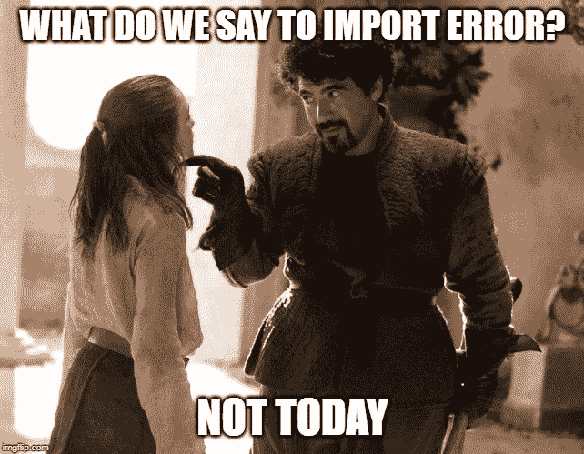

# 如何在 Windows 上编辑 PYTHONPATH

> 原文：<https://www.freecodecamp.org/news/how-to-edit-pythonpath-on-windows-eafd19840d44/>

你在这里是因为你在使用:

1.  Windows 操作系统版本 10 以上
2.  Python 版本 3.3 以上
3.  蟒蛇 3

您想要永久编辑您的`PYTHONPATH`。

### TL；速度三角形定位法(dead reckoning)

1.  前往`C:\Users\<your_username>\Anaconda3\Lib\site-pa`打包
2.  创建文件`python37.pth`
3.  编辑文件以包含此行`C:\\Users\\<your_username>\\my_`模块

### 长篇版；务必阅读

#### 序言

在大多数情况下，从设置 GUI 编辑`PYTHONPATH`就可以了。这个技巧在[这个堆栈溢出答案](https://stackoverflow.com/a/4855685/2934048)中有很好的解释。
如果首先你只是想在本地编辑你的路径**，[这个有用的答案](https://stackoverflow.com/a/43072284/2934048)就可以了。**

#### **第 1 项略微延长**

**如果你没有`C:\Users\<your_username>\Anaconda3\Lib\site-pa`软件包，请用你的 Anaconda3 的路径重新注册`place C:\Users\<your_`用户名>。**

#### **略微延伸的第 2 项**

**如果你使用的是 Python3.7，创建一个名为`python37.pth`的文件。否则创建一个名为`python<XX&g` t 的文件；。pth 适用于您正在使用的任何 Python 版本。**

*   **不确定是哪个版本？
    下`C:\Users\<your_username>\Anac` onda3\搜索一个 `form python&l` t 的文件；XX & g `t;.d` ll。< XX >表示您需要用`d fo` r 命名的版本号。pth 文件。**
*   **Windows 超级讨厌，不让你创建一个带`.pth`后缀的文件？
    在`C:\Users\<your_username>\Anaconda3\Lib\site-pa`packages 文件夹中有这样的文件。复制其中一个并编辑前缀。**
*   **有的地方说需要创建一个`._pth`文件而不是`.pth`？
    一个`._pth`文件将完全**取代**你现有的路径。而一个`.pth`文件将**把它的内容追加**到你已经有的路径中。你可以在这里找到更多信息[。](https://docs.python.org/3/using/windows.html#finding-modules)**

#### **略微延伸的第 3 项**

**假设您希望导入的`SuperCoolClass`位于
`C:\Users\<your_username>\my_project_folder\my_awesome_f` ile.py。**

**然后打开你新创建的`python<XX&g`t；。pth 文件用你喜欢的文本编辑器(请不要说是 Vim)加一个`line:`
`C:\\Users\\<your_username>\\my_pr` oject_folder。
没错，就凭那些烦人的斗`bl` e 斜线\\。
不，wit `ho` ut 引号“.**

**仅此而已。
现在可以像正常人一样从任何地方导入:
`from my_awesome_file import SuperCoolClass`。**

#### **收场白**

**这里真的没有什么要补充的。我只希望我 2 个小时的沮丧+ 1 个小时写这篇文章为你节省了一些时间。
平安出去。**

****