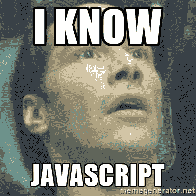

# 如何在不到一年的时间里找到一份开发人员的工作

> 原文：<https://www.freecodecamp.org/news/how-to-get-a-developer-job-in-less-than-a-year-c27bbfe71645/>

亚历山大·卡拉威

# 如何在不到一年的时间里找到一份开发人员的工作

#### 加快你的学习

对于一个决定自学编码的人来说，最困难的部分是什么？事实上，他们通常不知道学习什么——选择什么编程语言，如何进行学习，哪些资源在时间效率方面是最好的。

这一切都始于谷歌对这些主题的搜索，这不可避免地将人们引向众多教人们编程的资源之一。这些资源的格式差异很大，常识告诉我们应该尝试一堆不同的资源，并选择最适合我们学习风格的资源。一些人的教程，一些人的截屏，另一些人的文章，等等。似乎很合理，不是吗？

嗯……不。今天我想让你相信，其中一种学习方式会比其他方式更快地让你到达你想去的地方。不再拖延，让我告诉你它是什么，为什么你应该把你所有的努力集中在它上面。

#### 构建项目

我打赌你早就料到了。

首先，让我来消除你的一些异议。我并不是说你应该放弃所有其他类型的学习资源。

所有的教程和截屏都有自己的位置，我将在文章中进一步阐述。例如，有时，了解一项新技术或框架的最有效方式可能是阅读一篇文章或浏览一个教程。

问题是我们倾向于坚持(或者至少我是这样)那些让我们处于舒适区的资源，即使是在该做我们自己的事情的时候。它太方便了，随时可以消费。它也总是让我们感觉很棒，因为嘿，我们在这里，学习！对吗？谁能说我们在浪费时间？他们怎么敢？我们正在填补知识的空白！

在我们看来，这些资源也是最有效的学习方式，这很危险。作为人类，我们可以证明任何让我们处于舒适区的事情都是正当的。我已经生活在这种幻觉中很久了。

#### 敲门敲门尼奥。

创建项目…这个想法有什么新的地方？没什么，在内心深处，我们都知道这是对我们时间和精力的最佳利用，会让我们更快地达到目标。那我们为什么不做呢？**反抗。**

我在我之前的文章中已经谈到了[阻力(如果你正在挣扎或者如果你感到停滞不前，请阅读它)，所以让我解释为什么我对这个话题如此坚定，让我说服你将你的重点转移到建设上(除非它已经在那里了)。](https://medium.freecodecamp.com/learning-to-code-when-it-gets-dark-e485edfb58fd)

就像《黑客帝国》中的尼奥一样，他可以在红色药丸和蓝色药丸之间做出选择，我们可以回到我们的幻想，即一直握着我们手的资源是最好的学习方式，或者我们可以服用红色药丸，接受现实，即只有当我们走出舒适区时，我们才能前进和成长。(如果你没有看过黑客帝国，你可能会看。)

以下是我对如何着手这些项目的一些想法，开始可能会令人生畏，以及我在这个过程中获得的一些技巧。

#### 你甚至可能用不到一年的时间(什么？)

这背后的原因是基于我的个人经验，与我们自由代码营多伦多小组的成员交谈，以及阅读世界各地成员的旅程。

我发现大多数情况下，人们甚至在完成自由代码营的前端开发认证之前就能找到工作。他们建立所需的项目，并开始申请。很快，他们得到了一个为钱编码的机会。

如果你通读自由代码营的子编辑，你会发现有很多这样的故事。

请注意，就业市场因城市而异。例如，在多伦多，有大量的前端开发人员职位空缺。

自由代码营的官方立场是，你应该完成所有 2080 小时的课程。如果你这样做，你可能会成为一个更强的候选人(在更具挑战性的职位上，你会获得更高的薪水)。

让我们做些数学计算:

前端网络开发证书与免费代码营需要大约 478 小时。有些人完成得更快，但这取决于个人的准备程度，所以让我们以 478 为基础。

什么叫不到一年？为了便于讨论，我们将使用 9 个月。9 个月* 30 天等于 270 天。

478 小时/ 270 天大致是每天 1.8 小时。这意味着我们每天可以花不到 2 个小时的时间编写代码，9 个月后我们就可以开始工作了。

我知道对一些人来说，日程安排不允许一天抽出两个小时，但对大多数人来说，找到它们是可能的。对其他人来说，可能需要更长一点的时间，但是总是有周末和其他方法来找到(或制造)时间。

如果你在寻找如何找到时间编码的建议，不要犹豫，在 Twitter 上联系我，我会很乐意帮助你。

我花了更长的时间——大约一年零两个月。这篇文章分析了为什么我花了比预期更长的时间。我犯了我在文章中谈到的所有错误。当我给你建议的时候，记住我也是在给我自己建议。我们在同一条船上。

我在完成自由代码营前端课程之前就被录用了，但我知道，作为一名开发人员，回来完成这些项目将有助于我的成长。在这篇文章中，我放了我的 Codepen 个人资料的链接(我对此感到有点惭愧！)而当你看一眼的时候，你会发现我还有很长的路要走。所以我说——让我们一起努力吧！我把完成所有的前端项目作为我的目标，并在不久的将来把它们放在我学习的任何其他与代码相关的事情之上。

这篇文章是写给我和你的——让我们克服不适，优化我们的学习，这样我们就能更快地到达我们想要的地方！

#### 确保你已经掌握了基本知识

我坚信，在你学习的最开始，你肯定应该使用教程和交互式在线资源来熟悉 HTML、CSS、JavaScript 的语法，学会以编程的方式思考，并熟悉必要的、基本的东西。

在没有这些知识的情况下，试图立即构建项目将会非常令人沮丧。确保你在这个阶段不要花太多时间，因为这很容易做到。

当我在学习 HTML/CSS/JS 的时候，我会从不同的资源中学习类似的主题，认为这样可以填补我知识中的空白。它确实填补了一些空白，但在某些时候，我意识到我是在用这些资源作为拐杖，阻止我转向新的、更令人兴奋、但有点可怕的东西。不要陷入死循环(大概是 while 循环？；)回顾和重温你已经知道的信息。

#### 不要屈服于合理化

当你开始创建项目时，你不可避免地会陷入困境。如果你坚持下去，过一会儿你会克服障碍，但不久之后你会遇到另一个障碍。这不是一个选项，它发生在每个人身上。

在这样的时刻，我们身体的每一部分都在尖叫——让我们做些别的事情，让我们从这里逃走，这让我感到不舒服，我可以稍后处理这个问题，当我知道更多的时候，我会回来的，等等。所以我们暂停一下。

然而，我们担心我们的停顿会延长，我们只会继续编写越来越少的代码并放弃它。为了不让这种情况发生，但仍然保持我们不做这个项目的“决定”，我们决定**现在**，我们将通过一些教程或在线课程来工作。

很容易给自己的创作找借口。没有人会告诉你没有学习编码，或者以任何方式批评你这样做。你是唯一一个能够识别到底发生了什么(恐惧、规避风险、抗拒)并决定坚持做这个项目的人。

相信我，如果你敲得够久，所有的墙都会倒塌。想想那些在过去通过拥有两本母语和目标语言的同一本书来学习外语的人。他们是怎么做到的？他们只是坚持了足够长的时间。

#### 不要从你的大主意开始

令人惊讶的是，你已经有了，但这里还有一些其他的考虑因素可能会改变你的想法。我提出这一点的原因是我不断从人们那里听到这一点:“我想建立一个在线应用程序，让人们为他们的宠物创建帐户，上传照片，跟踪位置，以及许多其他事情。我最近开始学习编码，并且已经在构建自己的想法。”这让我“哇哇哇”。

我很容易看到在这种情况下发生的事情是，一个人对这个想法过于投入，他们开始非常热情，慢慢地建立它，但随着时间的推移，他们的学习跟不上项目的要求，这感觉很拖沓，总是在他们的思想深处，未完成。

在这种情况下，最糟糕的事情就是这个人会放弃这个项目，同时也放弃编码。

我建议从简单的项目开始，当你完成每个项目时，你会有一种成就感，并且更好地理解如何构建一个更大的项目。

想象一下，你是一名作家，你有了一个关于你一生中的一本书的想法，并且你已经开始写它了。你可能需要重写 3-4 次才能达到一个相当好的质量水平，然而你可以从写小故事开始，获得反馈，提高你的写作水平，当你真正准备好的时候，接近你的莫比迪克。

#### 从哪里获得项目创意

我知道的最好的地方是自由代码营。完全卡壳后我用的就是这个。在我开始编码之旅的时候，我会问我认识的所有开发人员(包括在线和离线的)我的第一个项目应该是什么。我不骗你，当我说(惊喜惊喜)他们都说这应该是一个待办事项应用程序。老实说，我认为如果我们继续开发这些待办事项应用程序，它们很快就会挤满整个互联网。

自由代码营在某种意义上帮助了我，它提供了一个令人兴奋的项目列表，按照难度增加的顺序排列。另一个很棒的事情是，它们中的每一个都是专门设计来教你一个特定的主题，例如:一个[致敬页面](https://www.freecodecamp.com/challenges/build-a-tribute-page)将测试你的 HTML/CSS 技能，[显示当地天气](https://www.freecodecamp.com/challenges/show-the-local-weather)将教你使用 API，[构建一个 JavaScript 计算器](https://www.freecodecamp.com/challenges/build-a-javascript-calculator)显然将提高你的 JS 技能，等等。

这是我所知道的让你建立的最强的起点。对于你完成的所有项目，你可以从社区获得反馈，也可以看到其他人是如何接近他们的(在你完成你的项目后，不要作弊！)要获得额外的灵感，你可以谷歌“酷代码项目创意列表”或类似的东西。

#### 首先构建您的项目

在你开始构建之前，写下你想要它做什么。编写具体的用户故事，例如:“用户点击音频播放器按钮时可以播放音频”，“用户可以使用电子邮件和密码登录，就像只使用脸书一样”。

在你开始写代码之前，你的代码也必须有一个基本的结构。用伪代码写——基本上只是用文字解释应用程序的每个部分或项目代码将做什么。

**基本示例:**
//当用户打开页面时，抓取他们的位置
//向位置为
的天气 API 站点发送请求//接收数据
//在页面上显示温度
//改变页面背景图片以反映当前天气

不要做得太多，没有必要先用伪代码写出你的代码要做的每一件小事，但是一定要把主要部分写出来。

我能给你提供的最好的例子是:记得当你在学校写文章的时候，你必须首先组织它们，例如，一个关于你的观点的介绍，三个支持你观点的要点，和一个结论。

这将帮助您预测潜在的问题，并提高代码的质量。

#### 卡住了也没关系

就像我之前说的，卡住了也没关系。不代表我们傻，只代表我们还不知道。你总会经历陷入困境的时刻:不仅仅是在学习的时候，在工作中也是如此。

你越早适应不舒服，越好。这会让你进步得更快。编程本身就是创造性地解决问题。如果没有对你来说难以解决的问题，这意味着你在谨慎行事。不要在浅水区踩水了，潜水吧！

最重要的是，我将再次重复这一点，不要认为自己是愚蠢的。我知道在这种时候很容易做到。我经常与那些轻松完成自由代码营的 HTML/CSS/JS 部分的人交谈，他们每天完成 30-40 个项目，然后他们到了基础和中级算法，发现他们每天只能完成 1-5 个，所以他们得出一个结论，他们被卡住了，他们很愚蠢，不够好，或者不打算成为一名开发人员。

我也是这样，我觉得有些人可能只是匆匆走过这一部分，我对自己和自己的进步感到很糟糕。现在我更清楚了。

我想说的是，你应该学会:

#### 不知所措

你必须找到让你处于“容易的事情”和“仍然太难的事情”之间的项目难度水平

我已经谈了很多为什么不断复习和重新学习相同的材料(容易的东西)是危险的原因，所以让我们来谈谈等式的另一面:困难的东西。

当你着手一件困难的事情——你认为你可能做不到的事情——时，你的一般原则应该是先试着去做。

从基本结构开始，尝试编码。如果你在同一件事情上花了超过三天的时间，暂时放下它，找一些相似但更容易的事情去做。

我发现，在我这样做之后，我的潜意识仍然专注于解决我遇到的问题。当我在做简单的事情时，比如洗澡或洗碗，我会随机想到如何解决这个问题，这让我恍然大悟！

有时候事情就是这样。有时候不会。但是这里的主要建议是——**总是选择让你有点不舒服的东西**。其他的都不值得你浪费时间。

#### 弹性

我想和你分享我最喜欢的一句话:

> **弹性** —系统承受干扰而不崩溃、承受冲击、在必要时自我重建以及尽可能自我改进的能力。

这是一个惊人的品质，你作为一个程序员(以及一个希望在生活中成功的人)应该努力发展自己。为所有的问题，所有的挑战，所有对你的工作，你的设计，你的解决方案的批评，以及你可能做的任何事情做好准备，甚至在它们发生之前。

你害怕上台吗？注册教你当地社区的人网络开发的基础知识，或者注册在会议/技术活动上发言。

你对面试的进展感到失望吗——你后来没有被录用？你害怕现在开始学习编码太晚了吗？对你刚刚完成的项目不满意？

**重构所有这些**:你能从这次经历中学到什么，以便下次做得更好？你怎样才能把你的缺点变成优点？

例如，你可能会担心在从事另一种职业道路 X 年后，你开始编码为时已晚。通过思考一个不同的视角和成熟度，在你的脑海中重新构建这个行业，这个行业迫切需要更成熟的人(心理上)和更多样化的背景？进入科技行业的决定让你变得更加富有！

> 如果你听到你内心的一个声音说“你不会画画”，那就想尽一切办法去画吧，那个声音会被压制。— [文森特·梵高](http://www.brainyquote.com/quotes/quotes/v/vincentvan104644.html)

我可以推荐这三本书来增强你的适应力:

1.  塞内卡的《斯多葛派的来信》
2.  Ryan Holiday 的《障碍就是道路》
3.  史蒂文·普雷斯菲尔德的《转向专业》

#### 设定一个每天有时间限制的目标

为了进步得更快，你应该每天做你的项目。那部分只是常识。但是，您应该记住一些额外的注意事项。

不要设定一个结果目标(“我今天会完成这个功能或那个部分”)，而是设定一个明确的时间段，你每天都要花在编码上。每天不要超过 30 分钟或 1 小时。

我知道你想做出每天 3 小时编码的承诺，并努力坚持下去。这是可行的，但只能维持这么久，直到生命开始起作用。有了一个合理的时间限制——比如每天 30 分钟——你就会知道这是可以做到的，而且你每天总会有半个小时的空闲时间用于编码，尤其是如果你的主要目标是学习编码的话。你甚至会发现自己在某几天会写更多的代码，这感觉很棒，因为你已经完成了那天的配额。

这个时间限制更多的是一个心理把戏，因为我们的大脑是有线的。还记得那次你有一个需要开始的大项目，但是你一拖再拖，直到你刚好有足够的时间在截止日期前完成它吗？你做得很好，但是在那之前你一直压力很大。另外，没有人会给你设定成为开发者的最后期限。也就是没有人，只有你。

当我们设定一个结果目标时，我们无法估计完成这个或那个功能需要的时间。通常情况下，我们最终没有完成我们当天计划要做的事情。这让我们感觉很糟糕，降低了第二天坐下来编码的欲望。

有了一个有时间限制的每日目标，你就会每天都有进步。如果你今天还没有完成你想完成的特定功能，谁会在乎呢？你进步了！你出现了。那是让你领先的东西。

另一个很大的好处是，一旦你坐下来开始编码，想法和解决方案就会开始流动，就像从哪里冒出来一样(类似于写一篇文章，嗯？:).一旦你摆脱了不切实际的期望和恐惧，让自己坐下来编码就会容易得多。

#### 复制代码是浪费时间

在构建一个项目的过程中，无论是在最开始——当你不知道从哪里开始时，还是在稍后阶段当你遇到一个不容易解决的问题时——你都会有一种强烈的愿望去查看项目的源代码，看看它是如何完成的。你会合理化，它会让你立即理解代码，这意味着你已经学会并吸收了它。远非如此。

不要复制整个项目并对其进行定制。不要拿走部分代码。甚至不要拿走它的碎片。

对于项目——首先不要看代码。用你在栈溢出上查找的东西，看着它，分析，理解，然后自己从头开始编码。你会发现即使你刚刚看到了整件事，你自己也很难写出来。

这就是**刻意练习**与常规练习(重复)的不同之处。10，000 规则的主要要求是，这种做法必须是故意的。跟随模板和现成的解决方案不会带你去任何地方。如果你这样做的话，有人可能会写一个 Python 脚本来代替你做任何事情。注意那些对你来说似乎很难的事情。

另一个跑题的想法是，如果你纠结于某个特定的话题，试着教别人，或者只是用你理解的方式解释给他们听。你和学员的结果都会随之而来。

复制代码会剥夺你自己学习的机会，而且这并不比浏览教程好多少。是的，解决方案就在那里。是的，如果你想要，你可以拿走它。但是这有什么意义呢？你是想用你完成项目的速度给别人留下深刻印象吗？或者你是在试图回避那些需要一些时间才能解决的难题吗？

不管你的理由是什么，这只是我们试图逃离的温暖舒适的另一种方式。**做相反的事。**奔向不适。

唯一可以偷看别人代码的时候是在你完成项目之后。然后想看多少就看多少，分析一下，借鉴一下。

你解决的每一个难题都让你突飞猛进。

#### 不要分散你的努力

我对此感到非常内疚，这实际上是我写给自己的一条建议，而不是写给任何人的(对不起！).当你开始做一个项目，碰到我提到的那些墙时，你会忍不住把那个项目搁置起来，开始一个新的项目。

一开始感觉总是很棒，直到你在第二个项目上碰壁。那么你将会有两个未完成的项目。如果你听之任之，这将会一次又一次地重复。

这里的解决方案是限制自己一次做两个项目。一旦你陷入其中，花些时间去解决它。但是如果目前看起来无法解决，那就转移到你手头的另一个项目上。最关键的是不要开始第三次，因为从那时起就开始走下坡路了。

你应该总是尝试做任何可能的事情来使自己保持在学习的道路上。如果你感到厌倦，或者只是对你目前正在做的事情感到厌烦，休息一会儿，调整一下，然后继续做下去。不要完全放弃编码。

这就是为什么我总是建议留有一点回旋的空间，可以是以不同学习资源的形式暂时分散注意力(限于一周)，或者在这种情况下，两个项目而不是一个。

#### 你的作品集会让你被录用

对于招聘经理或工程师来说，仅仅根据你在简历中写的内容来评估你的技能是非常困难的。“我知道 JavaScript！(并且有 4 年经验)。”“给我看看！”(我真的不能再引用矩阵了)。

你建立并放到网上的所有项目构成了你最终的实时简历。任何人都可以看着它，确信你实际上知道你在做什么。

但是不要害怕，这并不意味着你的代码应该是理想的，他们甚至会考虑你。这些项目将帮助那些负责面试你的人正确评估你的技能水平。

你不必经历远远超出你水平的面试，因为一些人力资源人员已经在你的简历上找到了一组特定的关键词。你的雇主的期望会更符合你的实际能力。

在线工作的积极好处包括:

*   雇主看到你知道自己在做什么
*   他们看到你在不断努力提高自己的技能
*   他们看到你实际上是一名开发人员，并且**你有足够的勇气把你的工作放到网上**让每个人都看到。

根据我的个人经验，以及我从我们多伦多自由代码营(T1)团队的人那里听到的，找到一份编码工作最重要的因素是他们的项目组合。

#### 你会在面试中做得更好

在面试中，你可能会得到一个现实生活中的小网络应用程序或一个页面来构建，或者被给予一个问题来解决。

对于这些问题，负责招聘的人通常是想看看你是如何解决问题的。他们并不总是希望你产生理想的解决方案。有时候他们出解决不了的问题就是为了看你会怎么做。你会在项目中得到很多类似的实践:每个项目都充满了这些小问题。

至于现实生活中你可以建造的东西，它可以而且将会变化。这是我在目前职位的面试中不得不建立的一些东西。我知道代码不是很好，但是这应该给你一个预期的想法。我能在面试当天完成它的唯一原因是因为我之前有过通过免费代码营开发天气应用和计算器的经验。

#### 你会发现自己知识上的真正差距

这就是教程之类的东西捉弄你的地方。它们让你觉得当你读完它们的时候，你已经涵盖了你需要知道的关于这个主题的一切。但是，当你试图自己构建一些东西时，你会立刻陷入困境——通常是在非常简单的东西上。

这是为什么呢？因为教程中给你的零碎信息是由创建它的人根据他们自己对人们可能在寻找什么的理解而选择的。因为在一个教程中不可能面面俱到。

真正了解你缺少什么知识的唯一方法是在你前进的过程中不断发现其中的差距。你不知道你不知道什么。所以过程是:去，碰壁，解决问题，继续下去，等等。

#### 每个新项目都让你害怕。怎么办？

我不知道你是怎么想的，但我总是这样。我完成了一个项目，对自己和自己的技能感觉良好。当我读到下一个项目的用户故事时，我被恐惧麻痹了。

我发现自己在想——我该如何开始呢？我应该先做什么？我是如何完成前一个的？我什么都不知道！*切换完全恐慌模式*

当我遇到这种情况时，我会使用一些技巧:

首先，看一下你之前构建的所有项目。他们也非常令人生畏。不知何故，你找到了解决问题的方法，并建立了这些项目。

当你处于缺乏自信的时候，回顾过去的成功是让你振作起来，准备迎接新挑战的一个强有力的方法。

关键是把这个项目看作是一堆需要解决的小问题。我们害怕是因为我们看到了冰山的全貌，它正向我们走来。然而，如果你使用我们之前讨论过的技术——将项目分解成一个基本的结构——开始将会非常容易。

#### 忘记完美主义

你这样做不是为了创建某种理想的、令人惊叹的项目，它的代码如此美丽，以至于让有经验的开发人员哭泣。

目标是做必要的事情:完成给你的(或你自己创造的)用户故事，这样你就可以学习某种编码技术/语言特性/框架是如何工作的，无论是 API、函数、承诺等等。

然后尽你所能改进项目——包括设计、功能和代码质量。

但是在某些时候，允许自己停下来。这不是国际艺术比赛。是你和你想学的学科。不要让这个话题吓得你甚至不敢开始。

极度需要把每件事都做得完美的人，通常是那些什么都没完成的人。

例如，如果我花太多时间担心这篇文章是好是坏，更不用说完美了，我就无法开始写这篇文章。我知道这是一个很多人都感兴趣的重要话题，我需要写下我迄今为止的发现，希望它能帮助一些人，让他们的编码之旅变得容易。

如果一切都必须完美，艺术中还会有素描的位置吗？毕竟，不完美才是它们的独特之处。

#### 释放你的创造力！

如果你是从网上找到的描述和例子开始工作，不要觉得你必须让你的项目和你在页面上看到的一模一样。编程既是科学，也是艺术。

如果你是做前端的，就更要认真对待这一点。

如果你要让[成为一个随机引用机器](https://www.freecodecamp.com/challenges/build-a-random-quote-machine)，让引用来自你最喜欢的角色。如果你正在制作一个游戏，让声音和设计成为你想要的样子！

怪异一点。释放你个性中所有的怪癖和独特的差异。释放真实的自己。

专注于实现所有的用户故事，但其他一切都完全取决于你。

这是我做的禅宗计算器，作为我所说的一个例子。当然，你可以变得更有创造力。原来是这里的，虽然已经更新了。我工作过的版本更像是一个 iPhone 计算器应用程序。

网络——以及一般的编程——给了我们这种自由。永远不要退缩。做你想做的人，做你想做的事，让这些融入你生活的每一部分，包括编码。

这里有一些启发，并说明我的意思:

只有当你给事物添加个性时，它们才会有味道！比较超现实主义画家和毕加索。你能通过观察超现实主义画家的作品来区分他们吗？我非常怀疑。然而你会马上认出毕加索的画。让你思考。

#### 偶尔放松一下

有时候从项目中稍微休息一下是可以的，但是为此你必须有一些规则。

理想情况下，**你的注意力分散时间必须少于一周**，无论是一门课程、一次辅导，还是其他任何事情。它应该是你想要学习的一个特定的主题，最好与你需要知道的一些东西相关联，以继续完善你的项目。

除此之外，如果你在上下班途中阅读编程书籍或观看编码视频，或者在无法访问互联网的地方等待，对我来说完全没问题。

只要确保当你回到你的办公桌(或者任何你编码的地方)时，可以是一张床或者一张沙发，对吗？)，你又回到现实的东西了。这是你的**练习**。

#### 获取对您的项目的反馈

除了帮助你填补知识上的空白，项目还会给你一件可以与世界分享的艺术品，征求建设性的反馈。

小心与谁分享你的项目。不要让过分挑剔的人进来。试着去找真正的开发者，或者也在学习，但是已经比你更高级一点的人。请他们检查您的代码并提供反馈。你能改进什么？什么管用？什么不会？

这将进一步加快你的学习，因为这些善良的人们将帮助你发现你自己不会发现的洞察力。

我希望现在我已经让你相信构建实时项目是学习编码最有效的方法。

我个人注意到，与观看、阅读或浏览在线课程相反，我建立的时期是我学习最多的时期。我希望你的经历和我的一样。

祝你好运！请在这篇文章的评论中添加您的建议，并在这里分享您的项目。

*随机备注:我是在听 [Tron: Legacy 配乐](https://www.youtube.com/watch?v=COWrh0eFFWk)的时候写的这篇文章。*

如果你喜欢这篇文章，**请点击** ❤在 Medium 上推荐它。这对我意味着一切！:)