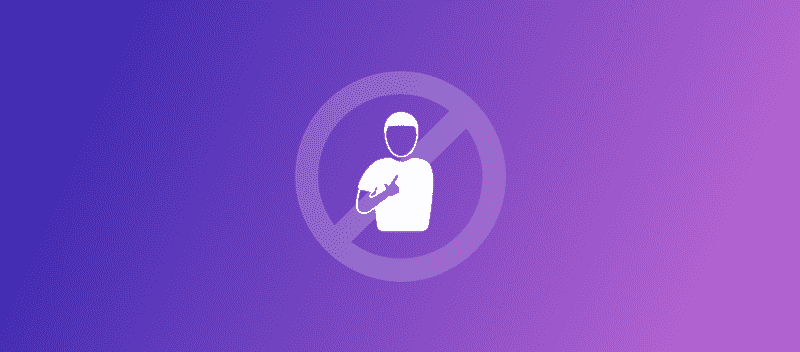

# 如何超越自己，去除自我，成为一名更好的团队成员

> 原文：<https://www.freecodecamp.org/news/how-to-get-over-yourself-strip-away-that-ego-and-become-a-better-team-member-1422b095f86a/>

由文尼

# 如何超越自己，去除自我，成为一名更好的团队成员

Thanks to @Ignat at Noun Project for the icon

由于我从事设计工作，我的重点已经从设计工作和“画蛇添足”(感谢这个词[乔恩·摩尔](https://www.freecodecamp.org/news/how-to-get-over-yourself-strip-away-that-ego-and-become-a-better-team-member-1422b095f86a/undefined))转移到关注更大的图景。

我所说的更大的图景不仅仅指公司的目标，或者与高管们一起工作。我说的是我所在的团队。我们正在制造的产品。顾客对我们产品的体验。这可能是一个有几个开发人员的小型创业公司，也可能是一个大型组织中的跨职能开发团队——本质上是一个小团队，为相同的结果而工作。

我过去有一种倾向，就是依恋我所创造的东西。这是实践中的[宜家效应](https://www.hbs.edu/faculty/Pages/item.aspx?num=41121),我们都受到影响。我们变得依恋我们创造的东西。是的，你可以意识到它，但这并不能让它消失。意识只是第一步。

我明白了，为了产生最好的结果，我提高我的技术设计技能比提高我与我的团队更好地合作的能力影响要小得多。

下面是我在读的关于这个主题的一堆书的七个指令的列表(在文章最底部的书的列表)。我一直在尽可能地使用这些方法，它们产生了巨大的影响。我完美吗？不。我会是吗？不，差远了。但我正在变得更好，还有很多成长的空间。我强烈建议你读一读，看看你能应用这些实践中的哪些。

### 一切都是你的问题。

我不是说你应该做你办公桌上的每一项工作。你很快就会筋疲力尽的。但是当每个人寻求你的帮助时，你一定要花时间回复他们。假设人们的优点。

如果有人给你发了一封电子邮件，内容与你无关，记住，他们可能不知道这是怎么回事。教育他们。下次会对大家有帮助的。

如果你想建立心理安全，平易近人是很重要的。别把人吓跑了。

### 慷慨地给予反馈。

提供反馈是免费的。如果有人做得很好，一定要让他们知道。当我们做错事情时，我们很快就会收到负面反馈，所以给予表扬就成了一种礼物。给出积极的反馈感觉很好，收到反馈感觉也很好——这是绝对不用动脑筋的。

### 总是寻求反馈。

这是上述观点的倒数。但要记住的重要一点是，你在寻找坏的方面，和寻找好的方面一样多，甚至更多。这就是我们学习的方式。不要诱导确认偏差，展示你的作品来确认你所相信的。让人们质疑它。

克服这一点的一个好方法是尽早展示你的作品，这样你就不会感到太依恋，也更容易改变。练习缩短你的反馈循环。评论对设计过程至关重要。

### 不要针对任何人。尤其是成功。

设计就是失败。你会做一些执行糟糕的事情，没有效果，最终失败。很多。事实上，即使是你创造的好产品，再过五年(或更短时间)也会被拆掉重新建造。有时候我们讨厌的人是成功的人。那也行！这是在这种学科中工作的一部分。

所以只要记住，当你做出令人敬畏的东西时，同样的道理也适用。享受创造伟大产品的感觉，但是记住一次成功并不能让你成功——保持谦逊。

是你的习惯定义了你——一次又一次地拥护正确的*过程*，而不是专注于*结果*，这可能是幸运的，也可能是任意的。

### 把你的判断留在门口。

刻板印象是大脑喜欢走捷径的结果。你知道吗，有时候它们非常有用。几千年前它们肯定让我们活了下来。但是他们通常不是一个团队的特征。如果你想让你的团队认同你的想法，就把他们留在门口。

Dave Grey 将此称为“清空你的杯子”，这是一个很好的比喻。当有人说一些我们不同意的话时，你会倾向于让自己的偏见影响你对他们的判断。

通过意识到这一点并积极“清空你的杯子”并寻求他们的观点，你可以开始从不同的角度去看问题。我们的生活如此狭窄，以至于我们只能看到世界上发生的一小部分。不要只是想“如果我是他们。”开始和人们谈论他们的动机和信仰，看看*为什么*他们会这样想。

### 多做少说。

想法很棒。每次我遇到别人，他们听说我是某种“计算机设计开发技术人员”，我都会不可避免地想到“我有一个很棒的应用程序的想法。”问题是，这些想法通常都很棒。但是正如德里克·西弗斯所说，伟大的想法只是执行力的倍增器。所以如果你从来不做这个应用，它就一文不值。

一旦你做出了这个东西(不管它是什么)，在屋顶上大声喊出来。但是在那之前，谈论你“将要做什么”实际上会成为一个障碍。下面看看德里克对此的另一个见解。

如果你不看，总结一下:

> “告诉别人你的目标会减少实现的可能性。当你告诉别人你的目标，而他们也认可时，大脑会被骗，觉得已经完成了。”

不要做那个总是嘴上说着要做事情，却不去执行的人。

### 别抱怨了。

没有人喜欢和抱怨的人一起工作。抱怨事情是不会有什么收获的。这个很简单。

### 包扎

从等式中完全去除自我几乎是不可能的，但是试图消除它会对你的工作关系产生巨大的积极影响——对我来说肯定是这样。这也让我不再专注于我开展的活动，并让我更多地考虑共享的结果。结果工作得到了改进。

> “有时候，让世界变得更美好比证明你让世界变得更美好更容易。”
> ——阿莫斯·特沃斯基

让我们面对现实吧，让世界变得更美好是我们都在努力做的事情，谁在乎谁得到了荣誉？

***思想？请留言评论！想听我说更多吗？加入我下面的邮件列表！***

#### 进一步阅读

[自我是敌人](https://www.amazon.com/Ego-Enemy-Ryan-Holiday/dp/1591847818) —瑞恩·哈乐黛
[极限思维](https://www.amazon.com/Liminal-Thinking-Create-Change-Changing/dp/1933820462) —戴夫·格雷
[智慧思维](https://www.amazon.com/Mindwise-Understand-Others-Think-Believe/dp/0307595919) —尼古拉斯·艾普利
[被幸福绊倒](https://www.amazon.com/Stumbling-Happiness-Daniel-Gilbert/dp/1400077427) —丹尼尔·吉尔伯特