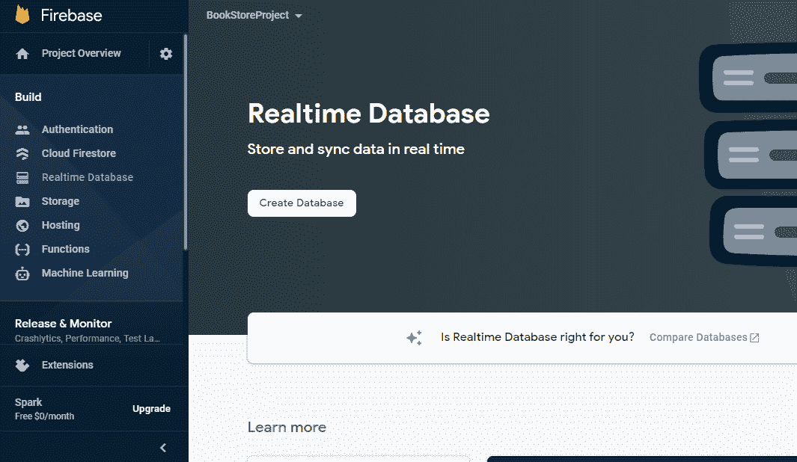
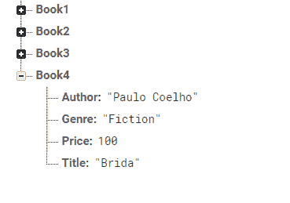
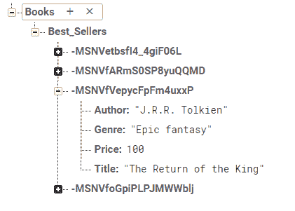
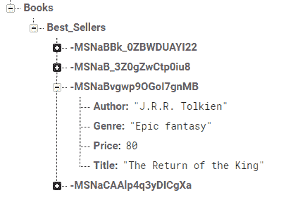
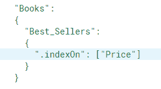

# 如何使用 Python 开始使用 Firebase

> 原文：<https://www.freecodecamp.org/news/how-to-get-started-with-firebase-using-python/>

本文是一个详细的指南，将帮助您设置 Firebase 数据库，并使用 Python 在其上执行简单的 CRUD 操作。

你可能知道，Firebase 是谷歌提供的一个加速应用开发的平台。它提供 BaaS 或后端即服务，这意味着 Firebase 会照顾云基础设施和您所有的后端需求。这让您可以更快地开发和部署。

Firebase 提供了几个令人惊叹的产品，如实时数据库、云 Firestore 和身份验证。它还允许托管和提供机器学习任务的 API，如文本识别，图像标签等等！

前往他们的网站链接[这里](https://firebase.google.com/)，对可用的精彩选项垂涎三尺。

## 如何建立 Firebase 实时数据库

在 Firebase 上创建一个新项目——我们将其命名为 BookStoreProject。设置完成后，通过选择 Create Database 选项创建一个实时数据库。



Creating a Realtime database using Firebase console

当您单击创建数据库时，您必须指定数据库的位置和安全规则。有两个规则可用:

*   锁定模式，拒绝对数据库的所有读取和写入，以及
*   测试模式，默认允许 30 天的读写访问(此后，除非安全规则得到更新，否则所有读写都将被拒绝)。

因为我们将使用数据库进行读、写和编辑，所以我们选择测试模式。一旦完成，数据库就可以供我们使用了！

## 如何用 Python 写 Firebase 实时数据库

下一步是找出如何使用 Python 连接到我们的数据库。我们将使用管理数据库 API。您需要安装所需的库。

要了解更多关于使用`firebase_admin`开发 Python 的信息，请点击查看链接 [的官方文档。](https://firebase.google.com/docs/database/admin/start)

```
pip install firebase_admin
```

要连接到 Firebase，我们需要以下几行代码:

```
import firebase_admin

cred_obj = firebase_admin.credentials.Certificate('....path to file')
default_app = firebase_admin.initialize_app(cred_object, {
	'databaseURL':databaseURL
	})
```

然而，为了让代码工作，我们需要一些先决条件。

首先，我们需要指定将用于初始化 admin SDK 的服务帐户密钥的路径。

Firebase 将允许从 Google 服务帐户访问 Firebase 服务器 API。为了认证服务帐户，我们需要一个 JSON 格式的私钥。

必须提供这个 JSON 文件的路径，才能创建 credentials 对象。要生成密钥，请转到项目设置，单击生成新的私钥，下载文件，并将其放在您的目录结构中。


Project Settings on Firebase Console

有关此过程的深入解释，请参考此处链接的[官方文档。](https://firebase.google.com/docs/admin/setup)

接下来，我们需要 databaseURL，它只是访问我们数据库的 URL。它显示在实时数据库 Firebase 控制台页面上。

### 如何使用 set()函数编写

```
from firebase_admin import db

ref = db.reference("/")
```

我们将引用设置为数据库的根(或者我们也可以将其设置为键值或子键值)。自然出现的问题是，在实时数据库中存储数据允许什么模式？

所有要存储的数据都必须是 JSON 格式，即一系列键值对。如果您需要一个系统生成的密钥，您可以选择使用`push()`函数，我们将很快介绍这个函数。

让我们构造一个可以保存在数据库中的合适的 JSON。我们有关于以下四本书的信息:

```
{
	"Book1":
	{
		"Title": "The Fellowship of the Ring",
		"Author": "J.R.R. Tolkien",
		"Genre": "Epic fantasy",
		"Price": 100
	},
	"Book2":
	{
		"Title": "The Two Towers",
		"Author": "J.R.R. Tolkien",
		"Genre": "Epic fantasy",
		"Price": 100	
	},
	"Book3":
	{
		"Title": "The Return of the King",
		"Author": "J.R.R. Tolkien",
		"Genre": "Epic fantasy",
		"Price": 100
	},
	"Book4":
	{
		"Title": "Brida",
		"Author": "Paulo Coelho",
		"Genre": "Fiction",
		"Price": 100
	}
}
```

我们加载所需的 JSON 文件并将数据保存到数据库，如下所示:

```
import json
with open("book_info.json", "r") as f:
	file_contents = json.load(f)
ref.set(file_contents)
```

数据库现在看起来像这样:



Database schema viewed from Firebase Console

### 如何使用 push()函数编写

Firebase 为我们提供了`push()`函数，它将数据保存在系统生成的唯一密钥下。这种方法确保了如果对同一个键执行多次写入，它们不会覆盖自己。

例如，如果多个源试图对/Books/Best_Sellers/进行写入，那么无论哪个源进行最后一次写入，该值都将保存在数据库中。这带来了数据被覆盖的可能性。`push()`通过为每个新添加的孩子使用唯一的键来解决这个问题。

```
ref = db.reference("/")
ref.set({
	"Books":
	{
		"Best_Sellers": -1
	}
})

ref = db.reference("/Books/Best_Sellers")
import json
with open("book_info.json", "r") as f:
	file_contents = json.load(f)

for key, value in file_contents.items():
	ref.push().set(value)
```



Database schema after executing push() method

请注意`push()`和`set()`不是原子的。这意味着不能保证这两种功能作为一个不可分割的单元不间断地一起执行。

当数据库正在更新时，如果我们试图获取数据，可能会发生`push()`已经完成，而`set()`还没有完成——所以我们收到的 JSON 将有一个系统生成的没有值字段的键。

## 如何使用 Python 更新 Firebase 数据库

更新数据库非常简单，只需在所需点设置参考点并使用`update()`功能。假设托尔金的书降价到 80 本以提供折扣。

```
ref = db.reference("/Books/Best_Sellers/")
best_sellers = ref.get()
print(best_sellers)
for key, value in best_sellers.items():
	if(value["Author"] == "J.R.R. Tolkien"):
		value["Price"] = 90
		ref.child(key).update({"Price":80}) 
```



Database schema after using update() function

## 如何使用 Python 从 Firebase 检索数据

当我们试图更新一个特定的键时，我们已经使用`get()`方法检索了数据。现在我们将看到更多的方法，并将它们组合在一起进行复杂的查询。

让我们使用`order_by_child()`方法将所有书籍按价格排序。要应用这种方法，我们必须首先通过 Firebase 安全规则中的`.indexOn`规则将我们排序所依据的键设置为索引字段。

如果要按价格排序，那么价格必须列为索引。您可以像这样设置该值:



Go to Rules tab and type in the schema structure at which you want to set the index

```
ref = db.reference("/Books/Best_Sellers/")
print(ref.order_by_child("Price").get())
```

该方法的返回值是 OrderedDict。要按键排序，使用`order_by_key()`。为了得到最高价格的书，我们使用如下的`limit_to_last()`方法:

```
ref.order_by_child("Price").limit_to_last(1).get()
```

或者，为了得到最便宜的书，我们这样写:

```
ref.order_by_child("Price").limit_to_first(1).get()
```

为了得到定价为 80 本的书，我们使用这个:

```
ref.order_by_child("Price").equal_to(80).get()
```

如需更多示例和根据您的要求查询数据库的方法，请查看官方文档[此处](https://firebase.google.com/docs/database/admin/retrieve-data)。

## 如何使用 Python 从 Firebase 中删除数据

删除数据非常简单。让我们删除所有以 J.R.R .托尔金为作者的畅销书。

```
ref = db.reference("/Books/Best_Sellers")

for key, value in best_sellers.items():
	if(value["Author"] == "J.R.R. Tolkien"):
		ref.child(key).set({}) 
```


Database Schema after deleting

## 结论

在这篇文章中，我们学习了如何创建一个 Firebase 实时数据库，用数据填充它，以及使用 Python 删除、更新和查询数据。

我希望这能帮助那些刚刚发现 Firebase 的美妙之处，却被如此多的选项和方法所淹没的 Python 开发人员。如果你已经读到这里，非常感谢你！保重，编码愉快！