# 如何用 Blazor WebAssembly 实现 Azure Serverless

> 原文：<https://www.freecodecamp.org/news/how-to-implement-azure-serverless-with-blazor-web-assembly/>

## **简介**

在本文中，我们将学习如何使用 Blazor web assembly 实现 Azure serverless。为此，我们将创建一个应用程序，列出新冠肺炎的一些常见问题(FAQ)。

以下是我们将要介绍的内容:

*   我们将创建一个 Azure Cosmos DB，它将作为我们存储问题和答案的主要数据库。
*   我们将使用 Azure function 应用程序从 cosmos DB 获取数据。
*   我们将把功能 app 部署到 Azure，通过 API 端点进行全局公开。
*   最后，我们将在 Blazor web assembly 应用程序中使用 API。

在 Bootstrap 的帮助下，FAQ 将显示在卡片布局中。

新冠肺炎常见问题应用程序部署在 Azure 上。在[https://covid19-faq.azurewebsites.net/](https://covid19-faq.azurewebsites.net/)观看比赛

## 什么是无服务器架构？

在传统的应用程序中，如 3 层应用程序，客户端从服务器请求资源，服务器处理请求并用适当的数据响应。


然而，这种架构存在一些问题。我们需要一台持续运行的服务器。即使没有请求，服务器也会 24X7 待命，随时准备处理请求。维护服务器可用性需要大量成本。

另一个问题是缩放。如果流量很大，我们需要横向扩展所有服务器，这可能是一个繁琐的过程。

解决这个问题的有效方法是无服务器 web 架构。客户端向文件存储帐户而不是服务器发出请求。存储帐户返回`index.html`页面以及一些需要在浏览器上呈现的代码。

因为没有服务器来呈现页面，所以我们依赖浏览器来呈现页面。绘制元素或更新元素的所有逻辑都将在浏览器中运行。我们没有任何后端服务器–我们只有一个包含静态资产的存储帐户。


这是一个经济高效的解决方案，因为我们没有任何服务器，只有存储帐户中的一些静态文件。对于高负载的网站来说，向外扩展也非常容易。

## 什么是 Azure 函数？

让浏览器运行所有的逻辑来呈现页面似乎很令人兴奋，但是它有一些限制。

我们不希望浏览器进行数据库调用。我们需要部分代码在服务器端运行，比如连接到数据库。

这就是 Azure 函数派上用场的地方。在无服务器架构中，如果我们想要一些代码运行服务器端，那么我们使用 Azure 函数。


Azure functions 是一个事件驱动的无服务器计算平台。你只需要在执行的时候付钱。它们也易于扩展。因此，我们得到了 Azure 函数的伸缩性和成本优势。

了解更多可以参考 [Azure 功能官方文档](https://azure.microsoft.com/en-in/services/functions/)。

## **为什么要使用 Azure serverless？**

Azure 无服务器解决方案可以最大限度地减少您在基础设施相关需求上花费的时间和资源，从而为您的产品增加价值。

借助全面管理的端到端 Azure 无服务器解决方案，您可以提高开发人员的工作效率、优化资源并加快上市时间。

要了解更多信息，请参见 Azure 无服务器官方文档。

## **什么是 Blazor？**

Blazor 是一个使用 C#/Razor 和 HTML 创建客户端应用程序的. NET web 框架。

Blazor 借助 [WebAssembly](http://webassembly.org/) 在浏览器中运行。它可以简化创建单页应用程序(SPA)的过程。它还提供了使用. NET 的全栈 web 开发体验。

使用。NET 开发客户端应用程序有多种优势:

*   。NET 在所有平台上提供了一系列稳定易用的 API 和工具。
*   诸如 C#和 F#这样的现代语言提供了许多特性，使得开发人员的编程变得更加容易和有趣。
*   Visual Studio 提供了最好的 IDE 形式。NET 跨多个平台(如 Windows、Linux 和 macOS)的开发经验。
*   。NET 在 web 开发中提供了诸如速度、性能、安全性、可伸缩性和可靠性等特性，使得全栈开发更加容易。

## **为什么要用 Blazor？**

Blazor 支持多种特性，使我们的 web 开发变得更加容易。Blazor 的一些突出特点是:

*   ****基于组件的架构**** : Blazor 为我们提供了一个基于组件的架构来创建丰富的可组合 UI。
*   **:这允许我们通过将服务注入到组件中来使用它们。**
*   ******布局**** :我们可以使用布局特性跨页面共享通用的 UI 元素(例如，菜单)。**
*   ******路由**** :我们可以借助路由将客户端请求从一个组件重定向到另一个组件。**
*   ******JavaScript interop****:这允许我们从 JavaScript 调用一个 C#方法，我们可以从 C#代码调用一个 JavaScript 函数或者 API。**
*   ******全球化和本地化**** :应用程序可以被多种文化和语言的用户访问**
*   ****:开发时在浏览器中实时重装 app。****
*   ********部署**** :我们可以在 IIS 和 Azure Cloud 上部署 Blazor 应用。****

**要了解更多关于 Blazor 的信息，请参考[Blazor 官方文档](http://blazor.net/)。**

## ****先决条件****

**要开始使用该应用程序，我们需要满足以下先决条件:**

*   **Azure 订阅帐户。你可以在[https://azure.microsoft.com/en-in/free/](https://azure.microsoft.com/en-in/free/)创建一个免费的 Azure 账户**
*   **从[https://visualstudio.microsoft.com/downloads/](https://visualstudio.microsoft.com/downloads/)安装最新版本的 Visual Studio 2019**

**安装 VS 2019 时，请确保选择 Azure 开发和 ASP.NET 和 web 开发工作负载。**

**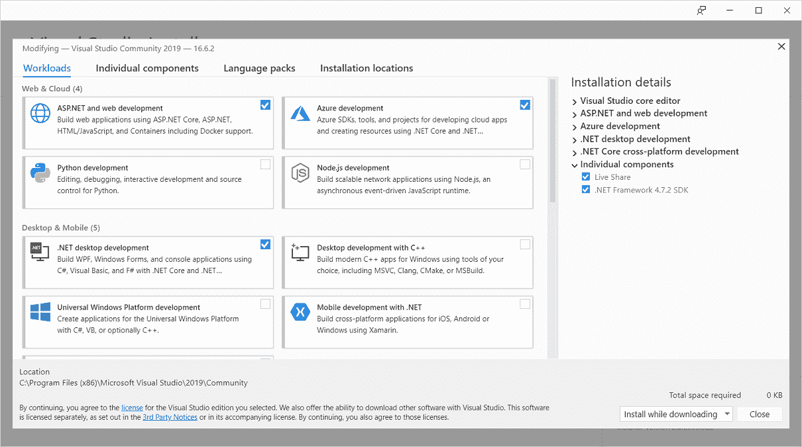**

## ****源代码****

**你可以在这里从 [GitHub 获得源代码。](https://github.com/AnkitSharma-007/azure-serverless-with-blazor)**

## ****创建 Azure Cosmos DB 帐户****

**登录 Azure 门户，在搜索栏中搜索“Azure Cosmos DB”并点击结果。在下一个屏幕上，单击添加按钮。**

**这将打开一个“创建 Azure Cosmos DB 帐户”页面。您需要填写创建数据库所需的信息。请参考下图:**

**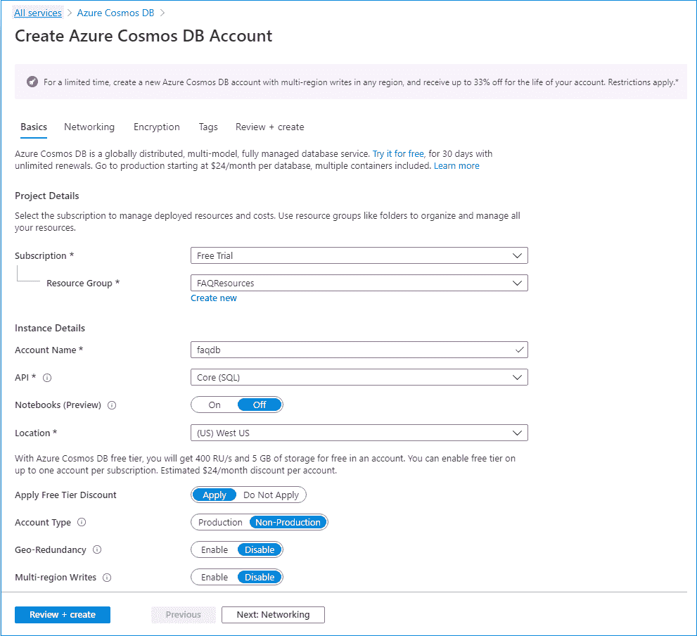**

**您可以像这样填写详细信息:**

*   ******套餐**** :从下拉列表中选择您的 Azure 套餐名称。**
*   ******资源组**** :选择一个已有的资源组或创建一个新的资源组。**
*   ******帐户名**** :为您的 Azure Cosmos DB 帐户输入一个唯一的名称。该名称只能包含小写字母、数字和'-'字符，并且必须在 3 到 44 个字符之间。**
*   ******API**** :选择核心(SQL)**
*   ******位置**** :选择一个位置来托管您的 Azure Cosmos DB 帐户。**

**将其他字段保留为默认值，并单击“Review+ Create”按钮。在下一个屏幕中，检查您的所有配置，然后单击“Create”按钮。几分钟后，Azure Cosmos DB 帐户将被创建。点击“转到资源”导航到 Azure Cosmos DB 帐户页面。**

## ****建立数据库****

**在 Azure Cosmos DB account 页面上，点击左侧导航栏上的“数据浏览器”，然后选择“新建容器”。请参考下图:**

**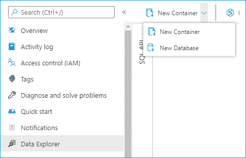**

**将会打开一个“添加容器”窗格。您需要填写细节来为您的 Azure Cosmos DB 创建一个新的容器。请参考下图:**

**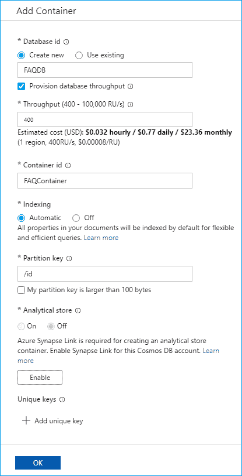**

**您可以按如下所示填写详细信息。**

*   ******数据库 ID:**** 你可以给你的数据库取任何名字。这里我用的是 FAQDB。**
*   ******吞吐量:**** 保持默认值 400**
*   ******集装箱 ID:**** 为您的集装箱输入名称。这里我用的是 FAQContainer。**
*   ******分区键:**** 分区键用于在多个服务器之间自动划分数据，以实现可扩展性。将值设为“/id”。**

**单击“确定”按钮创建数据库。**

## ****将样本数据添加到宇宙数据库****

**在数据浏览器中，展开 FAQDB 数据库，然后展开 FAQContainer。选择项目，然后点击顶部的新项目。页面右侧将打开一个编辑器。请参考下图:**

****

**将以下 JSON 数据放入编辑器中，然后单击顶部的 Save 按钮。**

```
`{
    "id": "1",
    "question": "What is corona virus?",
    "answer": "Corona viruses are a large family of viruses which may cause illness in animals or humans. The most recently discovered coronavirus causes coronavirus disease COVID-19."
}` 
```

**我们已经添加了一组问题和答案以及一个唯一的 id。**

**按照上述过程再插入五组数据。**

```
`{
    "id": "2",
    "question": "What is COVID-19?",
    "answer": "COVID-19 is the infectious disease caused by the most recently discovered corona virus. This new virus and disease were unknown before the outbreak began in Wuhan, China, in December 2019."
}
{
    "id": "3",
    "question": "What are the symptoms of COVID-19?",
    "answer": "The most common symptoms of COVID-19 are fever, tiredness, and dry cough. Some patients may have aches and pains, nasal congestion, runny nose, sore throat or diarrhea. These symptoms are usually mild and begin gradually. Some people become infected but don’t develop any symptoms and don't feel unwell."
}
{
    "id": "4",
    "question": "How does COVID-19 spread?",
    "answer": "People can catch COVID-19 from others who have the virus. The disease can spread from person to person through small droplets from the nose or mouth which are spread when a person with COVID-19 coughs or exhales. These droplets land on objects and surfaces around the person. Other people then catch COVID-19 by touching these objects or surfaces, then touching their eyes, nose or mouth."
}
{
    "id": "5",
    "question": "What can I do to protect myself and prevent the spread of disease?",
    "answer": "You can reduce your chances of being infected or spreading COVID-19 by taking some simple precaution. Regularly and thoroughly clean your hands with an alcoholbased hand rub or wash them with soap and water. Maintain at least 1 metre (3 feet) distance between yourself and anyone who is coughing or sneezing. Make sure you, and the people around you, follow good respiratory hygiene. This means covering your mouth and nose with your bent elbow or tissue when you cough or sneeze. Stay home if you feel unwell. If you have a fever, cough and difficulty breathing, seek medical attention and call in advance."
}
{
    "id": "6",
    "question": "Are antibiotics effective in preventing or treating the COVID-19?",
    "answer": "No. Antibiotics do not work against viruses, they only work on bacterial infections. COVID-19 is caused by a virus, so antibiotics do not work."
}` 
```

## ****获取连接字符串****

**点击【钥匙】左侧导航，导航至“读写钥匙”选项卡。`PRIMARY CONNECTION STRING`下面的值是我们需要的连接字符串。请参考下图:**

**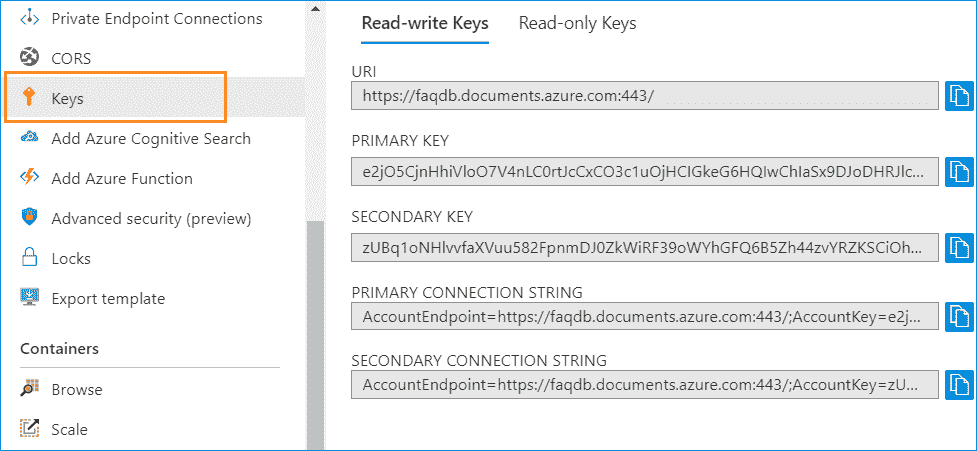**

**记下`PRIMARY CONNECTION STRING`值。我们将在本文的后半部分使用它，届时我们将从 Azure 函数访问 Azure Cosmos DB。**

## ****打造 Azure 功能 app****

**打开 Visual Studio 2019，点击“新建项目”。在搜索框中搜索“函数”。选择 Azure Functions 模板，然后单击 Next。请参考下图:**

**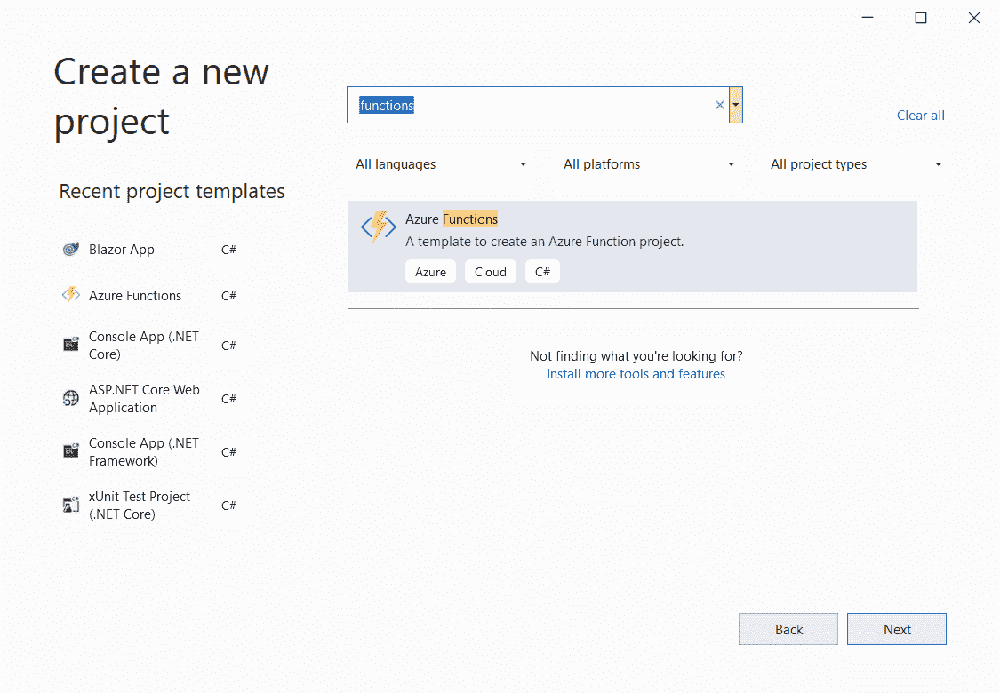**

**在“配置您的新项目”窗口中，输入项目名称`FAQFunctionApp`。点击创建按钮。请参考下图:**

**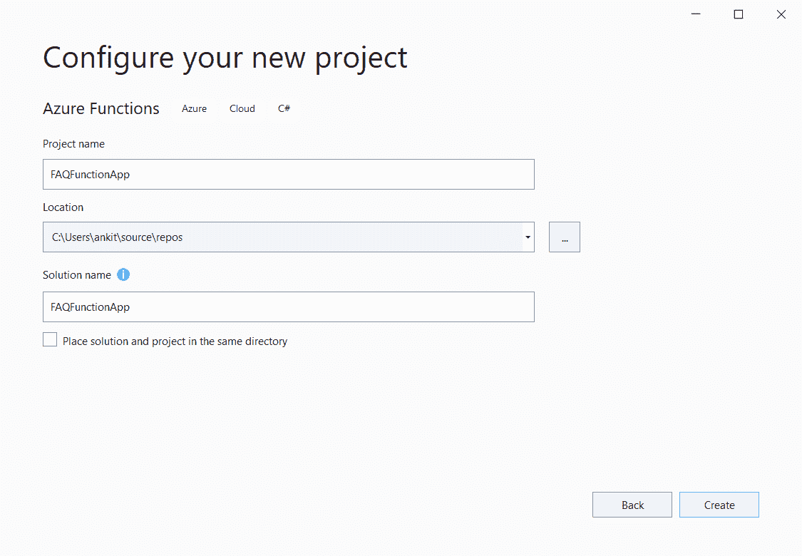**

**一个新的“创建新的 Azure 函数应用程序设置”窗口将会打开。选择“Azure Functions v3(。NET Core)”从顶部的下拉列表中选择。选择功能模板为“HTTP 触发器”。从右侧的下拉列表中将授权级别设置为“匿名”。点击 Create 按钮，创建函数项目和 HTTP 触发器函数。**

**请参考下图:**

**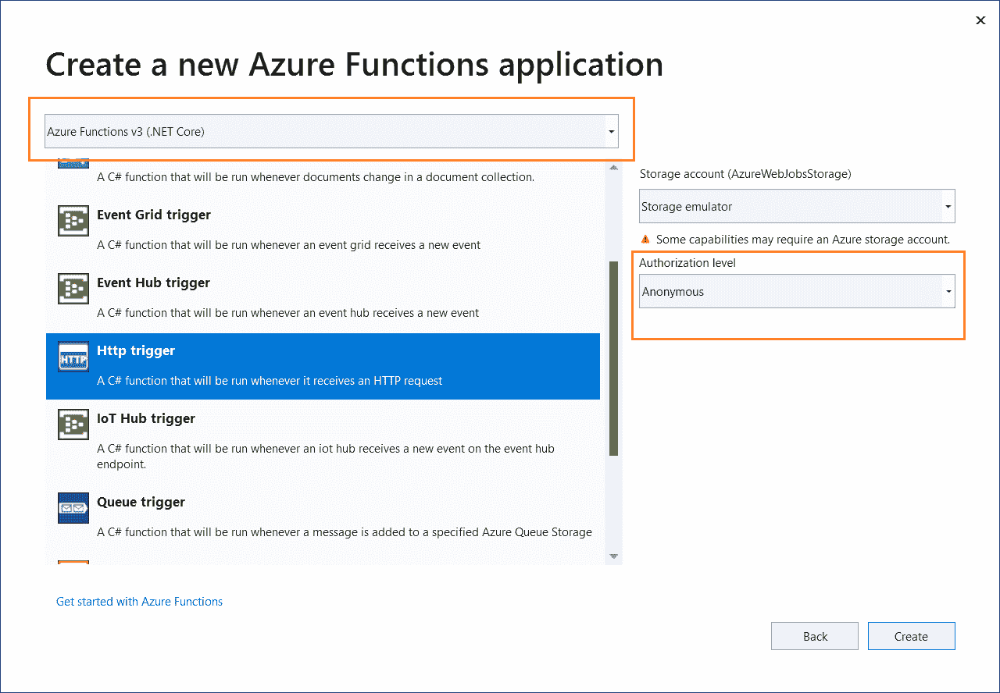**

## ****为 Azure Cosmos DB 安装软件包****

**要让 Azure function App 绑定 Azure Cosmos DB，我们需要安装`Microsoft.Azure.WebJobs.Extensions.CosmosDB`包。导航到工具> > NuGet 软件包管理器> >软件包管理器控制台，并运行以下命令:**

```
`Install-Package Microsoft.Azure.WebJobs.Extensions.CosmosDB` 
```

**请参考下图。**

****

**你可以在 [NuGet gallery](https://www.nuget.org/packages/Microsoft.Azure.WebJobs.Extensions.CosmosDB) 了解更多关于这个包的信息。**

## ****配置 Azure 功能 App****

**Azure function 项目包含一个名为`Function1.cs`的默认文件。您可以安全地删除此文件，因为我们不会在我们的项目中使用它。**

**右键单击`FAQFunctionApp`项目并选择添加> >新文件夹。将文件夹命名为 Models。同样，右击 Models 文件夹并选择 Add > > Class 来添加一个新的类文件。将您的类命名为`FAQ.cs`,然后单击 Add。**

**打开`[FAQ.cs](https://github.com/AnkitSharma-007/azure-serverless-with-blazor/blob/master/FAQFunctionApp/FAQFunctionApp/Models/FAQ.cs)`，把下面的代码放进去。**

```
`namespace FAQFunctionApp.Models
{
    class FAQ
    {
        public string Id { get; set; }
        public string Question { get; set; }
        public string Answer { get; set; }
    }
}` 
```

**该类与我们在 cosmos DB 中插入的 JSON 数据具有相同的结构。**

**右键单击`FAQFunctionApp`项目并选择添加> >类。将您的类命名为`[CovidFAQ.cs](https://github.com/AnkitSharma-007/azure-serverless-with-blazor/blob/master/FAQFunctionApp/FAQFunctionApp/CovidFAQ.cs)`。将下面的代码放入其中。**

```
`using Microsoft.AspNetCore.Mvc;
using System.Collections.Generic;
using Microsoft.AspNetCore.Http;
using Microsoft.Extensions.Logging;
using Microsoft.Azure.WebJobs;
using FAQFunctionApp.Models;
using Microsoft.Azure.WebJobs.Extensions.Http;
using System.Threading.Tasks;

namespace FAQFunctionApp
{
    class CovidFAQ
    {
        [FunctionName("covidFAQ")]
        public static async Task<IActionResult> Run(
        [HttpTrigger(AuthorizationLevel.Anonymous, "get", Route = null)] HttpRequest req,
        [CosmosDB(
            databaseName:"FAQDB",
            collectionName:"FAQContainer",
            ConnectionStringSetting = "DBConnectionString"
            )] IEnumerable<FAQ> questionSet, 
        ILogger log)
        {
            log.LogInformation("Data fetched from FAQContainer");
            return new OkObjectResult(questionSet);
        }
    }
}` 
```

**我们已经创建了一个类`CovidFAQ`，并为其添加了一个 Azure 函数。属性`FunctionName`用于指定函数的名称。我们使用了`HttpTrigger`属性，该属性允许通过 HTTP 调用来触发函数。属性`CosmosDB`用于连接 Azure Cosmos DB。我们为该属性定义了三个参数，如下所述:**

*   ******数据库名**** :宇宙数据库的名称**
*   ******收藏名称**** :我们要访问的 cosmos DB 内部的收藏**
*   ******ConnectionStringSetting****:连接 Cosmos DB 的连接字符串。我们将在下一节中配置它。**

**我们已经用`CosmosDB`属性修饰了类型为`IEnumerable<FAQ>`的参数`questionSet`。当应用程序被执行时，参数`questionSet`将被来自 Cosmos DB 的数据填充。该函数将使用一个新的`OkObjectResult`实例返回数据。**

## ****将连接字符串添加到 Azure 函数****

**还记得您之前提到的 Azure cosmos DB 连接字符串吗？现在我们将为我们的应用程序配置它。打开`local.settings.json`文件，添加如下所示的连接字符串:**

```
`{
  "IsEncrypted": false,
  "Values": {
    "AzureWebJobsStorage": "UseDevelopmentStorage=true",
    "FUNCTIONS_WORKER_RUNTIME": "dotnet",
    "DBConnectionString": "your connectionn string"
  }
}` 
```

> **当我们发布 Azure Function app 时，local.settings.json 不会发布到 Azure。因此，我们需要在将应用发布到 Azure 时单独配置连接字符串。我们将在本文的后半部分看到这一点。**

## ****本地测试 Azure 功能****

**按 F5 执行该功能。从 Azure Functions 运行时输出中复制函数的 URL。请参考下图:**

**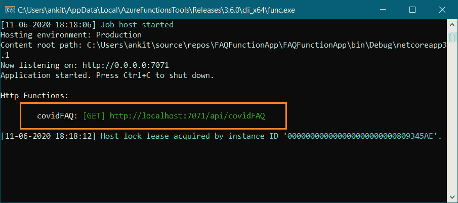**

**打开浏览器，将 URL 粘贴到浏览器的地址栏中。您可以看到如下所示的输出:**

****

**在这里你可以看到我们已经插入到 Azure Cosmos DB 中的数据。**

## ****将功能 app 发布到 Azure****

**我们已经成功创建了函数 app，但它仍在本地主机中运行。让我们发布应用程序，使其在全球可用。**

**右键单击`FAQFunctionApp`项目并选择 Publish。选择发布目标为 Azure。**

**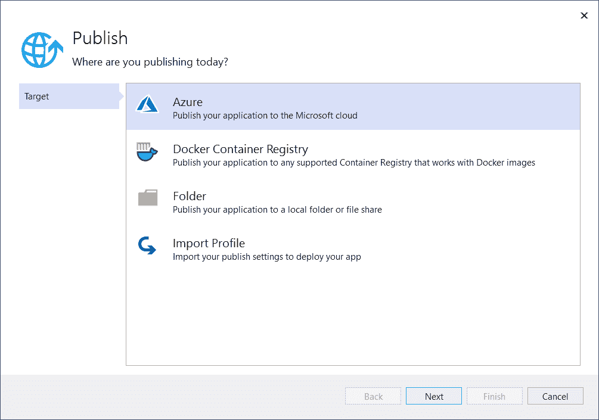**

**选择具体目标为“Azure Function App (windows)”。**

**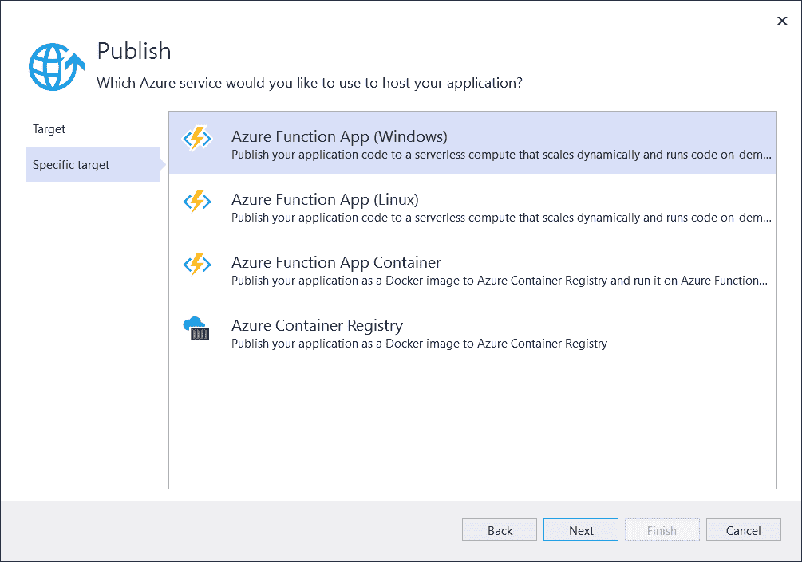**

**在下一个窗口中，点击“创建一个新的 Azure 函数…”按钮。将会打开一个新的功能应用程序窗口。请参考下图:**

**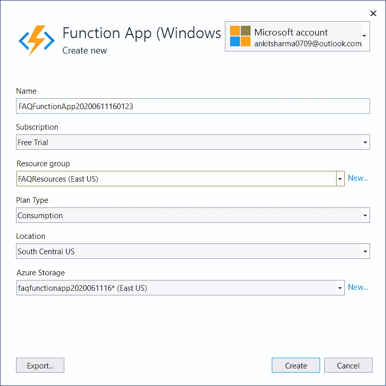**

**您可以按如下所示填写详细信息:**

*   ******名称:**** 您的功能 app 的全球唯一名称。**
*   ******套餐**** :从下拉列表中选择您的 Azure 套餐名称。**
*   ******资源组**** :选择一个已有的资源组或创建一个新的资源组。**
*   ******计划类型**** :选择消费。它将确保您只为执行您的功能应用程序付费。**
*   ******位置:**** 为您的功能选择一个位置。**
*   ******Azure Storage**** :保持默认值。**

**点击“创建”按钮，创建功能应用并返回上一窗口。确保选中“从包文件运行”选项。单击完成按钮。**

**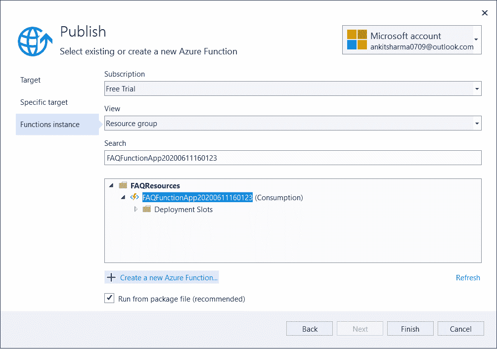**

**现在你在发布页面。点击“管理 Azure 应用服务设置”按钮。**

**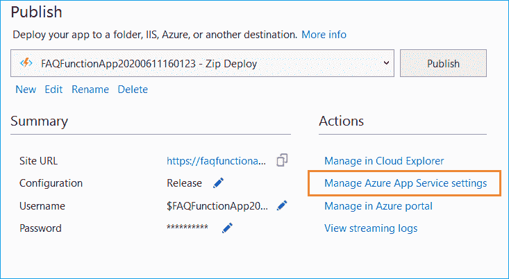**

**您将看到如下所示的“应用程序设置”窗口:**

**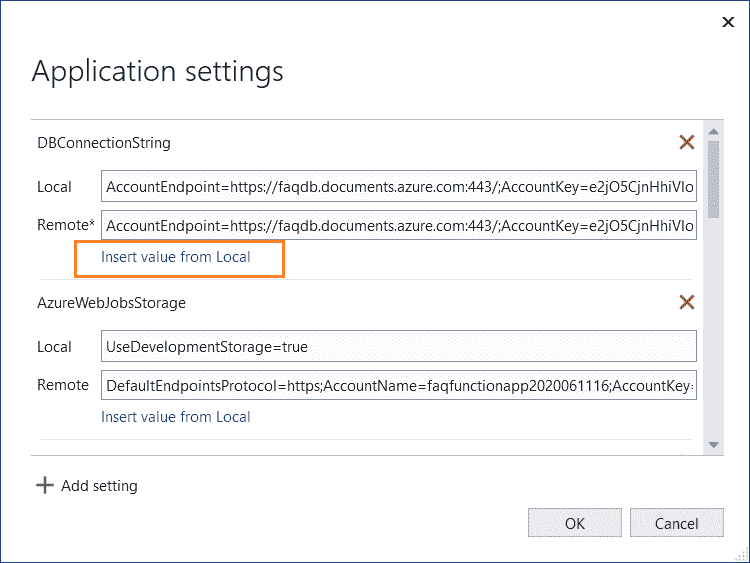**

**此时，我们将为“DBConnectionString”键配置远程值。在 Azure 上部署应用程序时会使用该值。因为本地和远程环境的键在我们的例子中是相同的，所以单击“Insert value from Local”按钮将值从本地字段复制到远程字段。点击确定按钮。**

**您将导航回发布页面。我们完成了所有的配置。点击发布按钮发布你的 Azure function app。应用程序发布后，获取站点 URL 值，向其追加`/api/covidFAQ`并在浏览器中打开它。您可以看到如下所示的输出。**

**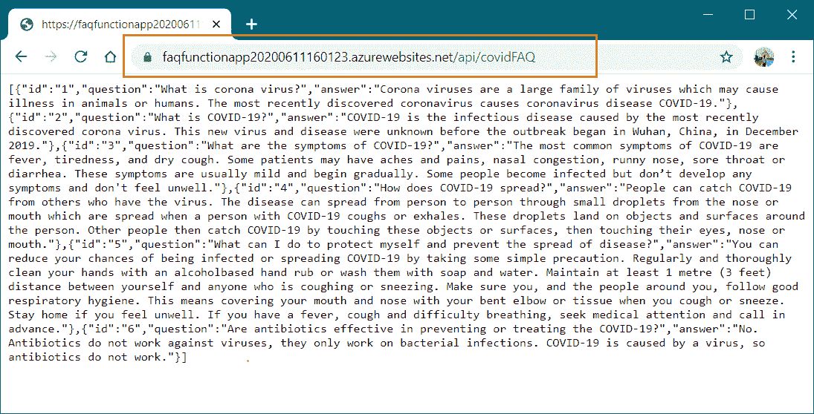**

**这是我们在本地运行应用程序时获得的相同数据集。这证明我们的无服务器 Azure 函数已经部署，并且能够成功访问 Azure Cosmos DB。**

## ****为 Azure 应用服务启用 CORS****

**我们将在 Blazor UI 项目中使用函数应用程序。为了允许 Blazor 应用程序访问 Azure 功能，我们需要为 Azure 应用程序服务启用 CORS。**

**打开 Azure 门户。导航到“所有资源”。在这里，您可以看到我们在上一节发布应用程序时创建的应用程序服务。单击资源以导航到资源页面。点击左侧导航栏中的 CORS。将打开一个 CORS 详细信息窗格。**

**现在我们有两个选择:**

1.  **输入特定的起始 URL 以允许他们进行跨起始呼叫。**
2.  **从列表中删除所有原点 URL，并使用“*”通配符来允许所有 URL 进行跨原点调用。**

**我们将为我们的应用程序使用第二个选项。删除之前列出的所有 URL，并输入一个条目作为“*”通配符。点击顶部的保存按钮。请参考下图:**

**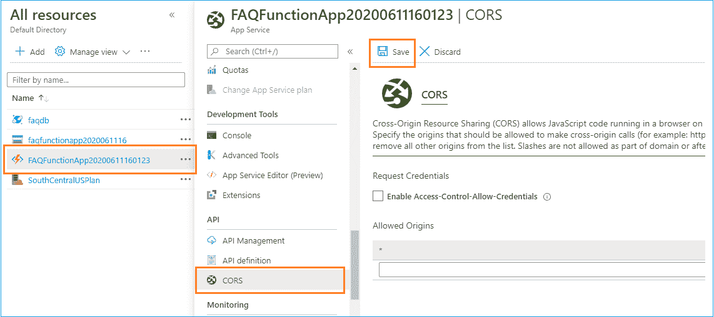**

## ****创建 Blazor Web 组装项目****

**打开 Visual Studio 2019，点击“新建项目”。选择“Blazor App”并点击“下一步”按钮。请参考下图:**

**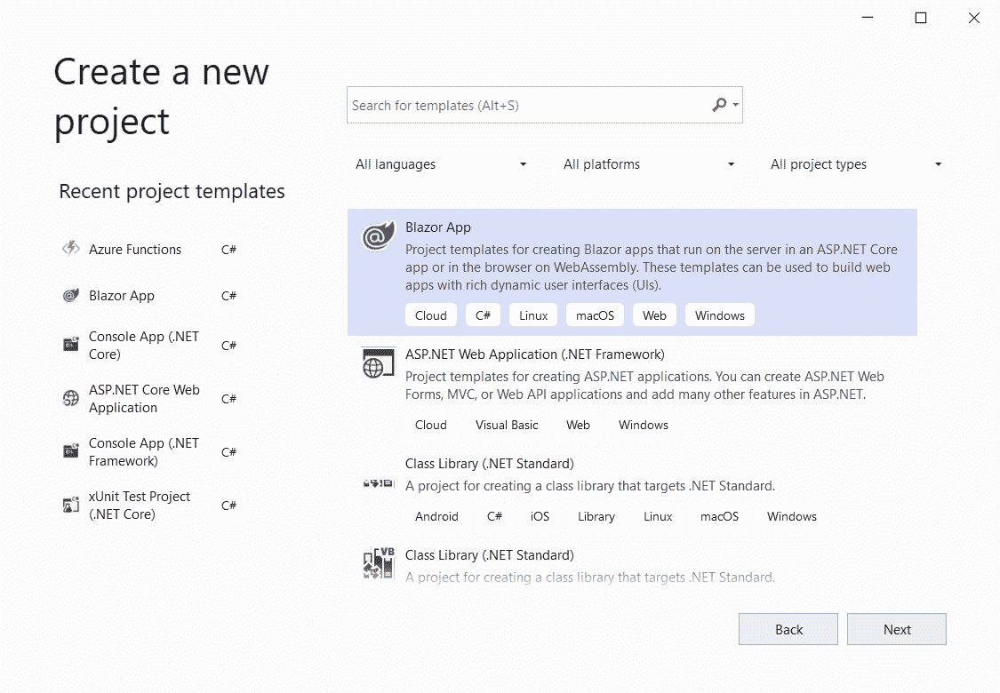**

**在“配置您的新项目”窗口中，将项目名称设为`FAQUIApp`，并点击“创建”按钮，如下图所示:**

**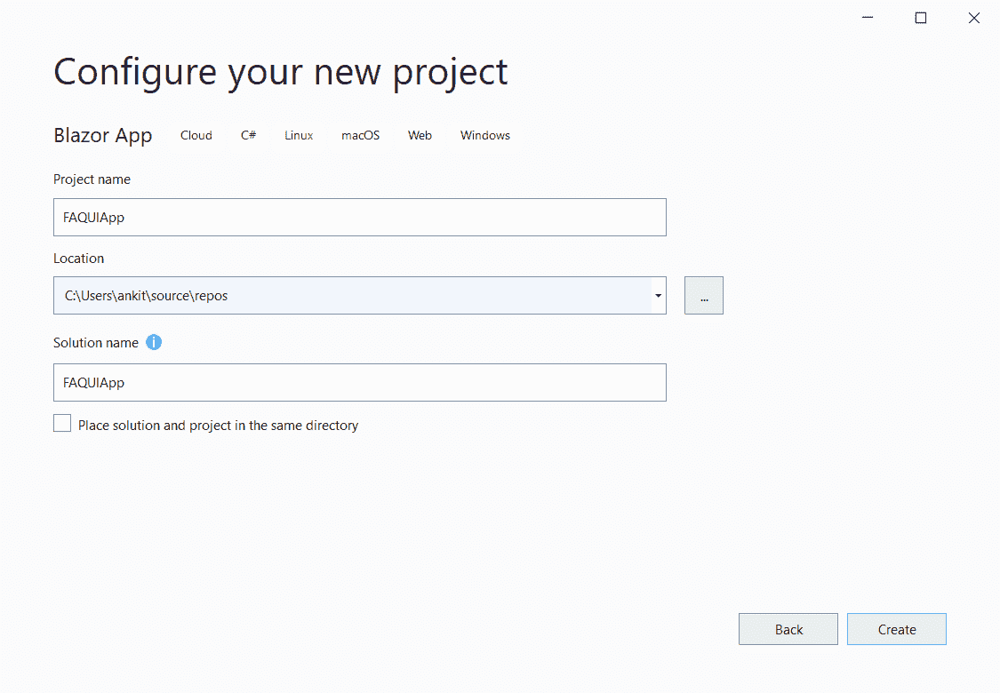**

**在“创建新的 Blazor 应用程序”窗口中，选择“Blazor WebAssmebly 应用程序”模板。单击 Create 按钮创建项目。请参考下图:**

**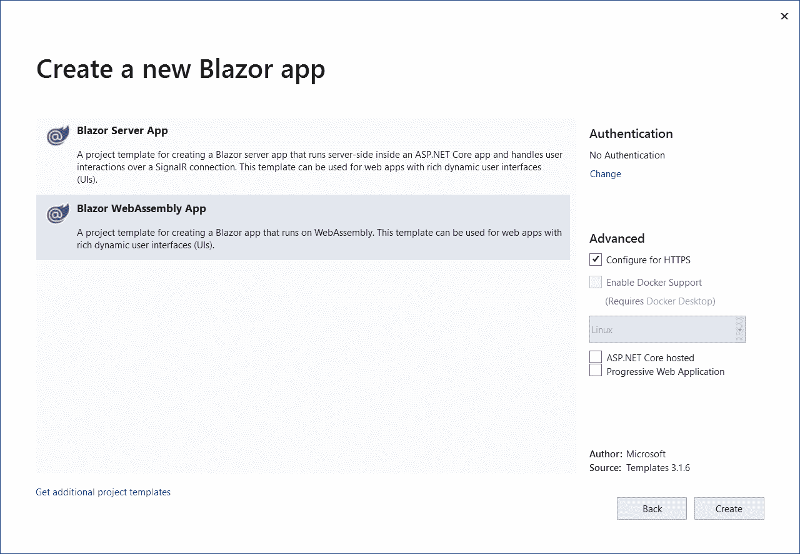**

**要创建一个新的 razor 组件，右击 Pages 文件夹，选择 Add >>Razor Component。将会打开一个“添加新项目”对话框，将组件的名称输入为`CovidFAQ.razor`，然后点击添加按钮。请参考下图:**

**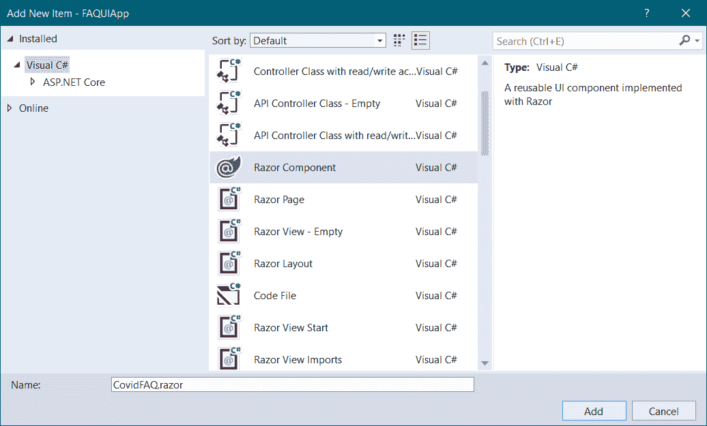**

**打开`[CovidFAQ.razor](https://github.com/AnkitSharma-007/azure-serverless-with-blazor/blob/master/FAQUIApp/FAQUIApp/Pages/CovidFAQ.razor)`，把下面的代码放进去。**

```
`@page "/covidfaq"
@inject HttpClient Http

<div class="d-flex justify-content-center">
    
</div>
<br />
<div class="d-flex justify-content-center">
    <h1>Frequently asked Questions on Covid-19</h1>
</div>
<hr />

@if (questionList == null)
{
    <p><em>Loading...</em></p>
}
else
{
    @foreach (var question in questionList)
    {
        <div class="card">
            <h3 class="card-header">
                @question.Question
            </h3>
            <div class="card-body">
                <p class="card-text">@question.Answer</p>
            </div>
        </div>
        <br />
    }
}

@code {

    private FAQ[] questionList;

    protected override async Task OnInitializedAsync()
    {
        questionList = await Http.GetFromJsonAsync<FAQ[]>("https://faqfunctionapp20200611160123.azurewebsites.net/api/covidFAQ");
    }

    public class FAQ
    {
        public string Id { get; set; }
        public string Question { get; set; }
        public string Answer { get; set; }
    }
}` 
```

**在`@code`部分，我们创建了一个名为 FAQ 的类。这个类的结构和我们之前在 Azure 功能 app ****中创建的 FAQ 类是一样的。**** 在`OnInitializedAsync`方法中，我们触及了函数 app 的 API 端点。从 API 返回的数据将存储在一个名为`questionList`的变量中，该变量是一个`FAQ`类型的数组。**

**在页面的 HTML 部分，我们在页面顶部设置了一个横幅图像。该图像位于`/wwwroot/Images`文件夹中。我们将使用 foreach 循环来迭代`questionList`数组，并创建一个引导卡来显示问题和答案。**

## ****向导航菜单添加链接****

**最后一步是在导航菜单中添加我们的 CovidFAQ 组件的链接。打开`[/Shared/NavMenu.razor](https://github.com/AnkitSharma-007/azure-serverless-with-blazor/blob/master/FAQUIApp/FAQUIApp/Shared/NavMenu.razor#L15-L19)`文件，添加以下代码。**

```
`<li class="nav-item px-3">
  <NavLink class="nav-link" href="covidfaq">
    <span class="oi oi-plus" aria-hidden="true"></span> Covid FAQ
  </NavLink>
</li>` 
```

**删除计数器和提取数据组件的导航链接，因为此应用程序不需要它们。**

## ****执行演示****

**按 F5 启动应用程序。单击左侧导航菜单上的 Covid FAQ 按钮。您可以在一个漂亮的卡片布局中看到所有问题和答案，如下所示:**

**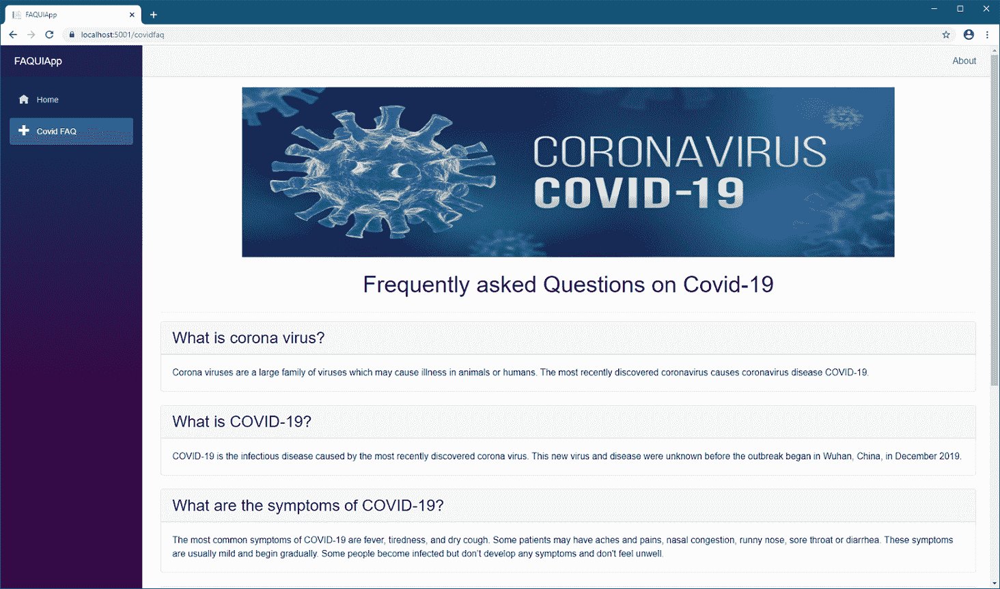**

**您也可以在[https://covid19-faq.azurewebsites.net/](https://covid19-faq.azurewebsites.net/)查看直播应用**

## ****总结****

**在本文中，我们了解了无服务器及其相对于传统三层 web 架构的优势。我们还了解了 Azure 函数如何适应无服务器的 web 架构。**

**为了演示这些概念的实际实现，我们使用 Blazor web assembly 和 Azure serverless 创建了一个新冠肺炎常见问题应用程序。使用 Bootstrap 在卡片布局中显示问题和答案。**

**我们使用 Azure cosmos DB 作为主要数据库来存储 FAQ 应用程序的问题和答案。Azure 函数用于从 cosmos DB 获取数据。我们在 Azure 上部署了 function app，让它可以通过 API 端点在全球范围内使用。**

## ****参见****

*   **[使用 Blazor 和计算机视觉的光学字符阅读器](https://ankitsharmablogs.com/optical-character-reader-using-blazor-and-computer-vision/)**
*   **[使用 Blazor 和 Azure 认知服务的多语言翻译](https://ankitsharmablogs.com/multi-language-translator-using-blazor-and-azure-cognitive-services/)**
*   **[服务器端 Blazor 应用中的脸书认证和授权](https://ankitsharmablogs.com/facebook-authentication-and-authorization-in-server-side-blazor-app/)**
*   **[使用 Heroku 和 GitHub 持续部署 Angular App](https://ankitsharmablogs.com/continuous-deployment-for-angular-app-using-heroku-and-github/)**
*   **[服务器端 Blazor 应用中的谷歌认证和授权](https://ankitsharmablogs.com/google-authentication-and-authorization-in-server-side-blazor-app/)**
*   **[使用谷歌云 Firestore 的 Blazor CRUD】](https://ankitsharmablogs.com/blazor-crud-using-google-cloud-firestore/)**

**如果你喜欢这篇文章，与你的朋友分享。你也可以在 [Twitter](https://twitter.com/ankitsharma_007) 和 [LinkedIn](https://www.linkedin.com/in/ankitsharma-007/) 上与我联系。**

**最初发表于[https://ankitsharmablogs.com/](https://ankitsharmablogs.com/)**