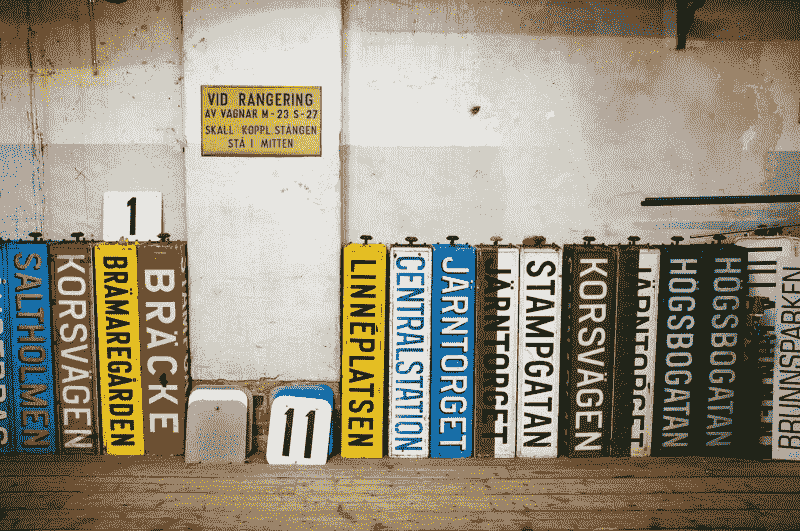

# 找工作时如何面试面试官

> 原文：<https://www.freecodecamp.org/news/how-to-interview-your-interviewers-when-youre-looking-for-a-job-d848bc3a910/>

#### 在技术面试中要问的 12 个问题

我刚刚结束了为期六周的 medior 软件开发员职位的面试，这个市场急需人才(阿姆斯特丹)。这意味着我参加了很多面试。为了梳理出哪些公司可能适合我，我想问很多问题。你必须找到适合你和面试你的人的平衡点。

如果你在大三找工作，你可能会发现你其实并不关心这些问题的答案——你只是想要一份工作。即使是这种情况，也要考虑对你来说什么是危险信号，并问一些能从面试官那里套出信息的问题。如果有一个破坏交易的人，你想在接受工作邀请之前了解一下。

### 典型的过程

根据我的经验，面试过程通常是这样的:

1.  **筛选电话/潜在现场面试**。通常由人力资源部门的人来做。如果由技术人员来做，通常会很短(现在不是提问的好时机)。
2.  **技术面试**。你将与真正的开发人员进行另一轮面试，他们将挖掘你的知识。
3.  **技术评估/作业/结对编程**。在我看来，这对做结对编程的公司来说是巨大的加分。我理解他们为什么布置家庭作业，但在很大程度上，这是在浪费每个人的时间，并且没有评估正确的技能。
4.  **最终面试，会见团队的其他成员**。如果是小公司，有时这种面试会被会见创始人所取代。
5.  **报价**。

当然，每家公司的情况都有所不同，但这是你在招聘过程中可能期望的一个大致轮廓。

### 给你的筛选者的问题

让非技术人员做第一次面试是很常见的。问他们一大堆问题是不合适的，因为他们通常不知道你在说什么——即使是在小公司。

这个电话大部分应该是你在说你。他们已经有了你的简历，但是他们希望有一个介绍——确保你有一个好的简洁的故事来讲述你的工作经历。面试时你会令人生厌地重复这个故事。

#### 招聘流程是怎样的？

他们很可能会和你一起经历这些，但是如果他们不这样做，一定要弄清楚这家公司的所有具体步骤。如果你只是在这里试水，而他们希望你接下来构建一个完整的应用程序，那么最好继续前进。

#### 告诉我一些关于技术团队的事情。

有多少成员，初级与高级，以及任何层级(是否有 CTO？产品负责人？)对人力资源人员来说应该很容易解释。如果不是，尤其是在大公司，那也没关系。

在和你的面试官通电话之前，确保你知道下一步该怎么做。

### 技术面试的问题

这是我大部分问题的来源。他们在评估你，但你也在评估他们。让你的面试官来主导谈话，但是中途插入一两个问题也是可以的。在会议结束时，他们应该问你是否有任何问题，你可以问尽可能多的问题。

如果你不在乎某个问题的答案，那就不要问。浪费每个人的时间谈论一件事是没有意义的，除非它能帮助你决定是否在那里工作。

我把这些按照与我相关的顺序排列。如果我们聊得很愉快，我可能不会聊到最后。如果和我的面试官交谈有点痛苦和困难，我可能会问他们所有人，并希望我和团队的其他人有更好的关系。

#### 你认为这个角色的理想人选是谁？

我真的很喜欢这个问题，因为它以一种新的方式让你更好地了解对你的期望。如果你的面试官可以凭空创造一个人来担任这个角色，这个人会是谁？有时他们会对你进行详细描述，而其他时候你会听到很多与你的背景/技能/偏好不符的描述。这是检验你是否适合这家公司的好方法。

例如，一家公司说他们想要一个“不需要很多帮助”的人。对我来说，这是一个危险信号。任何进入新代码库的人都需要帮助来理解业务逻辑，即使他们是构建代码的技术专家。对学习环境怀有敌意的开发人员让我很反感。

另一方面，我经常听说他们理想的候选人应该“独立工作”并且“自我激励”。这些对我来说是很好的迹象，因为我认为自己是他们两个，不希望在自己的工作中有太多吹毛求疵和强迫结构。这两个答案的意思可能完全一样，但是它们的表达方式会对你的工作环境产生很大的影响。

#### 这个角色面临的最大挑战是什么？

这个问题的答案很大程度上取决于你将要做什么。在所有情况下，这都是一种很好的方式，可以让你从聊天的剩余部分中看到一些阳光信息的背后。密切关注他们认为这个职位有哪些困难，并评估你是否是迎接这些挑战的合适人选。

#### 谁设定了这家公司的愿景？

我在这里寻找长期计划，并希望谈一些关于增长的目标。唯一让我感到危险的答案是他们不知道如何回答这个问题。对于小公司来说，“创始人”似乎是一个很好的答案，而对于大公司来说，则是“董事会”和“管理层”。如果每个人都认为他们为创建更大的愿景和路线图做出了贡献，那么将会获得高额奖金。在这里，茫然凝视是不好的——你想在一家知道未来的公司工作。

#### 你如何衡量开发团队/个人/公司的成功？

还是一个流程问题。我想知道我和我的团队的工作将会得到怎样的评价。如果他们在这一点上有困难，我就把它调换一下，问他们如何知道他们是否做得不好。在我看来，如果没有办法知道你是否做得很好，但他们很清楚“搞砸了”是什么样子，那就是一个危险信号。如果你不知道成功是什么样子，你怎么能在工作中取得成功呢？

#### 在这里工作最享受/最沮丧的事情是什么？

这个问题很适合在多人身上重复使用。作为两个问题来问，背对背(我更喜欢先问积极的一个)。你会经常看到模式出现——每个人都为同样的事情烦恼。在采访中让人们谈论消极的一面总是很难，但我发现人们很难回避这一点。

他们可能不会告诉你公司的重大系统性问题(他们可能会)，但至少你会对在那里工作的一些流程/个性/官僚主义挑战有所了解

#### 描述代码评审过程。

这个问题的答案往往相当简短——他们会做 PRs，一位同事在 GitHub 上评论道。深入挖掘一下，找出哪些类型的评论，提交后合并的平均时间等。他们会对一切都超级挑剔吗？让巨大的错误过去？他们真的在乎吗？还是只是在炫耀自己的知识？测试呢？他们多久发布一次？

#### 一个想法是如何从“外面的世界”进入待定项，并最终进入代码和产品的——向我介绍一下你的特性开发过程。

我想知道新想法是从哪里来的。他们是在看数据，然后基于一个有见识的世界观来建立吗？还是创始人得到一个想法然后大家跳出来满足他的期望？

这个问题很像“愿景”问题，可以作为后续问题来问。一旦你有了远景，一个实际的特征是如何被描述和编码的？我认为这是最接近“在这里工作是什么感觉？”而不需要问这些话，得到陈腐的答案。

#### 解释你最近面临的一个技术挑战。

如果他们纠结于上面的问题，这个问题应该更容易——我是在问他们最近做的工作的具体例子。团队成员之间有协作吗，还是一个人自己发现的？是否引入了外部资源？该功能被删除了吗？同样，这个问题有助于了解日常运营。

#### 额外收获:新员工的入职计划是什么？你如何将新的开发人员融入团队？

我认为这是一个相当低的优先级*，除非你是初级*。大三学生应该为入职甚至培训寻找重要的计划。中老年人可以问这个问题，看看有没有答案。我想知道他们是否考虑过新开发人员的起步情况。他们有没有想过如何更容易地过渡到公司？如果他们没有，这不一定是一个交易破坏者——因为许多公司没有。

相关的，我喜欢问他们是否雇佣大三学生，以及他们如何与他们合作，但前提是我们已经稳固，我不是大三学生。我的职业生涯已经快三年了，但我不想给任何人出主意。更多的高级工程师可以这样问，而不用担心被误认为是初级工程师，并获得关于如何评估员工的有用信息。

### 期末面试的问题

在最后一次面试中，你可能已经在谈论薪水和开始日期了。如果他们给你一份工作，一定要弄清楚桌上有什么——奖金、养老金、股权、假期、开始日期等等。

这里有一个问题，你可以考虑问，但需要小心翼翼地阅读房间:

#### 有什么我需要注意的内部政治吗？

在一个更大的公司，他们可以把这个放在“销售”上，让你知道他们是这里的神，不要惹他们生气。在小公司，他们可能会告诉你没有问题。你需要的是一些第一天工作的知识——实际上谁说了算？有没有一个摆在桌面上的项目，有人觉得不值得做，但有人爱做？如果他们愿意在这里放弃一点点污垢，它可以在你的第一个星期帮助你。这也表明你关心融入公司，并恰当地与周围的人沟通。

### 最终注释

所有这些问题都会引发一些大讨论。不要觉得你需要跳进每一个。从最重要或最能提供信息的开始，然后从那里开始。来个来回回的讨论比一个问题一个问题地解决要好得多。

在对一家公司的评估中，我试图找出**我会喜欢在这里工作吗**？**他们会希望我成为他们的同事/员工吗**？无论我们进行什么样的对话，只要能让我更接近这些问题的答案，那都是最好的。这些提示只是到达那里的助手。

祝你求职顺利！