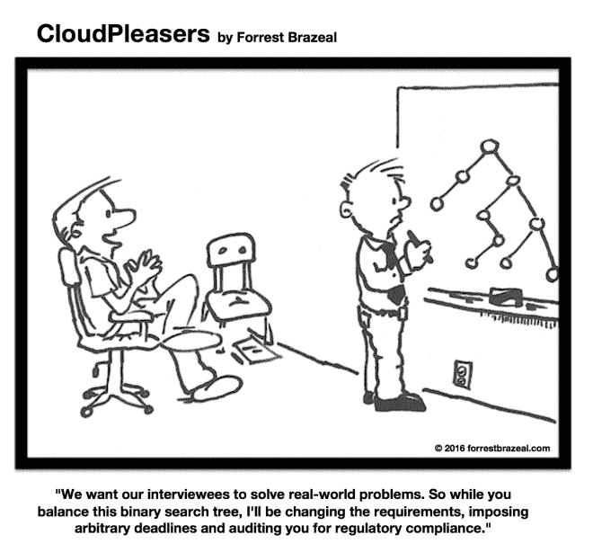

# 如何获得你梦想中的嵌入式软件工作

> 原文：<https://www.freecodecamp.org/news/how-to-landing-your-embedded-software-dream-job-4ff9674bf1c4/>

by Rohan Dasika

# 如何获得你梦想中的嵌入式软件工作

准备软件面试的指南有很多。嵌入式软件面试有些类似，但这仍然是一个不同的游戏。

互联网上有一些有用的资料和一些软件面试准备的内容。但总的来说，我无法找到一个全面的指南来帮助我开始。

在过去的 4 个月里，为嵌入式软件进行招聘和面试准备教会了我很多关于如何处理这个过程的知识。我最近收到了几家大型科技公司的邀请。在这篇文章中，我将分享我一路走来的一些感悟。

我会把这篇文章分成几个部分，所以你可以随意跳来跳去！关于聪明的招聘方式已经有很多内容了，所以我不打算在这里讨论如何获得面试机会。

*   准备和审查的内容
*   面试本身！

### 选择一种语言

作为一个标准，嵌入式软件开发大部分是用 C 完成的，尽管 C++最近变得越来越流行。如果你学过计算机架构或嵌入式系统课程，你可能会用到其中的一个。确保你知道你面试的公司使用哪种语言。如果你对 C++更熟悉，但是他们使用 C，那就坦白一点——如果你知道一个，你就能很容易地在两者之间切换。

因为我最熟悉 C++，所以公司允许我用 C++写代码。如果有必要，他们会帮我把代码转换成 c 语言。在大多数情况下，这并没有什么区别。除非你正在使用一些特定的 C++标准库函数和容器。

Verilog 主要用于 FPGA 开发。Python 被大量用于用户和他们正在工作的嵌入式系统之间的通信。很有可能你不会被问到这些问题。

汇编语言也是如此(谢天谢地！！？).

### 基础就是基础

我以与大多数计算机科学学生相似的方式开始了旅程——复习我的数据结构和算法。但是很快，我意识到嵌入式软件的内容在某一点上是分离的。它更关注计算机架构、操作系统和一些硬件基础，而不是像树或排序算法这样的高级数据结构。

您在嵌入式软件角色中处理低级代码和硬件。但是从编程的角度来看，你的数据结构和算法仍然是高度相关的。类似于软件面试，有大量的资源可以帮助你做好基础准备！从[的每个部分做几个问题破解编码面试](https://www.amazon.com/Cracking-Coding-Interview-Programming-Questions/dp/098478280X)是一个很好的起点。

此后不久，我更喜欢使用 [LeetCode](https://leetcode.com/) ，因为它能够即时运行和测试。LeetCode 是一个不可思议的平台，有一个很棒的社区。在我看来，T2 的问题与你在面试中会遇到的问题最相似。它保存您提交的所有解决方案，并计算运行时间。完成大部分“简单”和相当一部分“中等”问题，你应该没问题:)

此外， [Geeks For Geeks](http://www.geeksforgeeks.org/) 是一个很好的资源，对数百个问题进行了非常透彻的解释。

#### 软件面试的遗留问题

以下几个话题和软件面试中的概念非常相似，这些都是经过严格测试的，所以一定要充分了解它们！

*   算法复杂性(时间和内存)
*   两颗北极指极星
*   数组
*   链接列表
*   弦乐(和 C 弦)
*   堆栈和队列

下面的主题没有经过真正的测试，但是在概念上要熟悉它们。了解它们是如何工作的，它们的复杂性，以及如何在基本层面上解决它们。

*   递归
*   树
*   很
*   散列法
*   整理

### 超越软件

这是真正的嵌入式东西开始的地方！

#### 比特操纵！！

对此了如指掌。

这可能是你面试中最重要的话题。在这个具体的题目上，*做 LeetCode 上的所有*题。

*   知道负数是如何用二进制表示的
*   知道一和二的补语之间的区别
*   能够在二进制、十进制和十六进制之间转换
*   异或运算*强大*。知道它能做什么。

这里有一个很好的资源,我用它来获得有用的提示和技巧

### 计算机体系结构

仅次于比特操作。

你可能不会被要求实现其中的任何一个，但是你肯定会被问及这些东西是如何工作的。一些需要阅读的主题包括…

*   重要寄存器及其工作原理
*   呼叫者保存和被呼叫者保存之间的区别
*   中断是如何工作的
*   对指令管道的基本理解
*   缓存、TLB 以及虚拟内存是如何实现的
*   各种类型的存储器(ROM 与 RAM、DDR、EEPROM、闪存等)
*   内存填充(指示&类)
*   当你启动一个系统时会发生什么

#### 操作系统

根据公司和职位的不同，操作系统可能是一个非常重要的话题。您不会被要求实现其中的任何一个，但是要知道事情在概念层面上是如何工作的！

*   进程与线程
*   多线程如何工作
*   实时操作系统与传统操作系统
*   任务调度(FIFO、循环、基于优先级)
*   信号量和互斥体如何保护数据
*   优先级反转、优先级继承、自旋锁和死锁
*   什么使得一个函数“可重入”？
*   临界断面
*   微控制器中的优先级(EL0 — EL3)

#### 通信协议

了解使用以下协议的好处和利弊:

*   通用非同步收发传输器(Universal Asynchronous Receiver/Transmitter)
*   精力
*   I2C

根据你以前的经历、你申请的职位和公司，你可能还会被问到其他人的情况。通常情况下，公司并不指望你了解这些具体的协议，而是会对你进行在职培训。但有一个基本的了解总是有助于让面试官惊叹！

*   **汽车:**灿，林
*   **无线:** 3G、4G LTE、5G 基础、802.11(Wifi)、蓝牙
*   **联网:** HTTP、TCP/UDP、IP、802.11(Wifi)、以太网

#### 硬件基础

嵌入式软件不会对硬件进行大量测试，但是根据角色的不同，您的交互水平可能会有所不同。查看职位描述，并与在那里工作的人交流，寻求更好的主意！

*   看门狗定时器
*   一般计时器
*   关于您可能在项目中使用的*任何*外围设备的详细信息(加速度计、任何传感器、激光雷达、电机等)

### 练习

实践是关键——这是没有办法的。确保*每天至少花*两个小时准备面试，不包括申请工作和接触招聘人员。

在 LeetCode 上练习的时候，注释你的代码。解释你的算法和运行时的复杂性。每天在你开始编码之前，回顾一下你前一天处理的问题。在一周结束时，回顾你那一周做的每个问题。这将帮助你更好地记住算法，一点一点地，你将成为模式匹配的专家。

由于某些测试主题的性质，嵌入式面试往往比典型的软件面试更具概念性。对于这些领域，我维护了一个谷歌文档，记录了我可能会被问到的所有问题，以及他们的所有答案。我还提供了一个链接，在那里我可以读到更多有用的信息。它帮助我保持条理，更快地复习。

> 很多人向我要谷歌文档的链接，所以这里是:[嵌入式面试问题](https://docs.google.com/document/d/18HMyd-lFu1hWiixFLS2Pc7-SgyzDDqitzXbfAnUVeBE/edit?usp=sharing)

### 面试的时候

你做到了——干得好！

深呼吸。是时候好好利用你所有的努力了。通常，你和面试官会讨论一些概念性的问题。你也会讨论你以前的经历和项目。确保你能够详细回答关于你的贡献和你所面临的各种挑战的问题。

如果这是一个远程进行的面试，你可能会被要求在一个共享文档中编码。准备一些纸，记下要点和图表。如果有帮助的话，你也可以有一些笔记，可以在面试的时候参考。我总是将一张基本算法复杂性的表格放在手边。

检查时区。仔细检查他们。别忘了用耳机。处于一个安静的环境中，这样就不会有干扰。沟通问题只会让面试变得更加困难。

#### 当你得到问题时

永远不要马上开始编码。与得出正确的解决方案同样重要的是，面试官真的在看你的方法。

花一点时间，向面试官重复一遍这个问题，以确保你们两人的想法是一致的。如果有任何误解，面试官可以重复并澄清任何疑问。

接下来，了解问题的范围

*   投入有多大？
*   分类了吗？
*   有没有一定的时间或者记忆复杂度是你应该满足的？
*   有重复的吗？负值？空值？
*   你必须执行错误检查吗？

然后，遍历你的算法。从最基本的强力方法开始。这可能是超级低效的，并提及你正在以此为起点。解释时间和内存的复杂性，以及为什么这不是一个好的解决方案。

从那里，是时候优化了。一般来说，寻找可能存储不必要的数据量或重复代码段的地方。对于嵌入式应用，内存很重要！不要使用数组或向量，考虑使用位集。如果您只是处理 0 到 31 之间的值，那么就在整数中切换位！这就是位操作派上用场的地方。

头脑风暴时大声思考是很重要的。如果你陷入困境或者走错了方向，面试官可以帮助你回到正轨。一旦你们都同意了一个解决方案，那么终于到了开始编码的时候了。

#### 编写代码

阅读他人的代码并不总是最令人愉快的事情。用好的风格让你的面试官觉得工作简单一点。这并不意味着你必须写下每一个分号或括号的*,而是要缩进并使用有意义的变量名。尽量写得工整，用好白板空间。*

当你写代码的时候，不断检查你设计的算法。类似于头脑风暴阶段，*大声思考*。为你的代码提供口头注释。在每一步，解释你在检查什么，你希望实现什么，以及你做的任何设计决定。

当你写完代码后，不要说你还没写完。退一步，从高层次的角度分析你的代码。检查输入、输出和您的逻辑是否有任何错误。确保发现任何一个错误！然后，用几个测试用例遍历代码。如果您发现任何问题，请根据需要检查并重新编写代码。

根据面试的不同，你可能会有一个大问题或者几个小问题。但是一旦面试官同意了你的解决方案，他或她就有可能扩展不同的参数。你可能不需要重新编写代码，但是你可能需要讨论如何改变你的方法。正如我之前提到的，内存在嵌入式应用中非常重要。所以一个常见的后续问题通常是关于进一步的内存优化。

### 最后的想法

嵌入式软件面试的性质很大程度上取决于公司和他们优先考虑的工作。致力于特定通信协议的公司将寻求与开发实时操作系统的公司或致力于物联网产品的公司不同的东西。

我想用这篇文章来分享我采访中的一些共同主题，但这绝不是全面的。这旨在用作一个起点。但是请联系现在的员工，查看 [Glassdoor](https://www.glassdoor.com/index.htm) 了解更多公司特有的面试技巧。

面试很难，但是现在好好准备并努力工作可以帮你找到一份你喜欢的工作:)

希望这篇文章对你有所帮助，祝你好运！

如果你喜欢这篇文章，请不要忘记留下？。你也可以在 T [witter](https://twitter.com/rohandasika) 或者 Q [uora:](https://www.quora.com/profile/Rohan-Dasika) 上关注我