# Python 游戏开发——如何用 PyCharm 制作乌龟赛跑游戏

> 原文：<https://www.freecodecamp.org/news/how-to-make-racing-game-using-python/>

在本文中，您将学习如何使用 Turtle 库用 39 行代码用 Python 构建一个赛车游戏。

以下是我们将要创建的内容:

Turtle Racing Game Project Overview

## 🧵先决条件

非常基础的 Python 编程知识将足以通读本教程。还有，我假设你对这个[龟](https://docs.python.org/3/library/turtle.html)库一无所知。我会从头教你一切。

## 我们将使用的🛠工具

首先，如果你的机器上没有安装 Python，去[python.org](https://www.python.org/)下载最新版本的 Python，然后马上安装。

为了编写程序，我们将使用最流行的 Python 集成开发环境(IDE)py charm。在你的机器上安装了 [PyCharm](https://www.jetbrains.com/pycharm/) 之后，你就可以从头开始构建这个神奇的游戏了。

## ⛳项目目标

具体来说，我们将编写一个程序，水平移动一个海龟对象，直到它到达我们计算的终点线。然后，我们将使用一个`for`循环，用不同的颜色和随机的移动速度，创建这个乌龟物体的七个独特的复制品。

我们还将添加一个背景图像(有车道供海龟比赛的道路)来创建一个类似真实比赛的环境。

然后，我们将沿垂直或 Y 轴计算不同的值来定义它们的起始位置。

最后，我们将提示用户输入他们的赌注(海龟颜色)，这样，如果用户的赌注颜色与我们的赢家海龟颜色匹配，我们将显示**赢家！**在屏幕上。否则，我们会显示**你输了！**在屏幕上。

注意:对于屏幕读者或任何对获得这个项目的完整源代码感兴趣的人来说，你可以在我的 [GitHub 库这里](https://github.com/codewithshahan/python-racing-game)访问它。

那么你准备好开发这个游戏了吗？我也是。我们开始吧！

## 👩‍💻如何设置项目

打开您的 PyCharm IDE。然后单击新建项目。

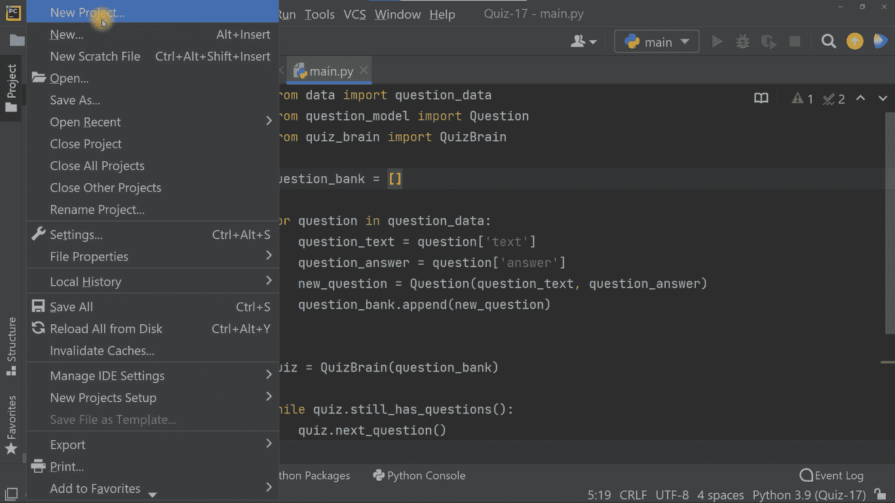

creating a new project

姑且称之为**赛车游戏**，点击**创建。**

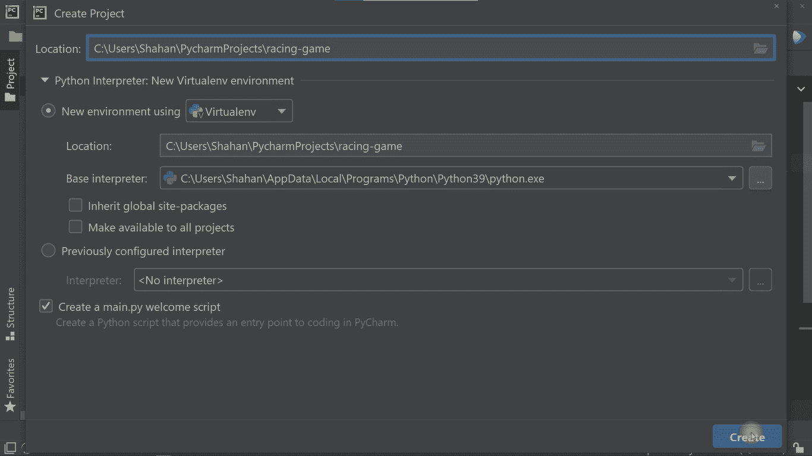

Project name

然后，添加一个名为`main.py`的新 Python 文件。

## 📂如何使用海龟库

现在，让我们转到[海龟图形 python 文档](https://docs.python.org/3/library/turtle.html)。在这里你会找到关于这个图书馆的全部细节。

让我们向下滚动到海龟方法部分。你会看到不同类型的方法，我们可以用于许多不同的目的。我们将在当前的项目中使用其中的一些。

我建议在开始编写代码之前至少阅读一遍该文档。但是不要担心，当我们写程序的时候，我会为你简化它。

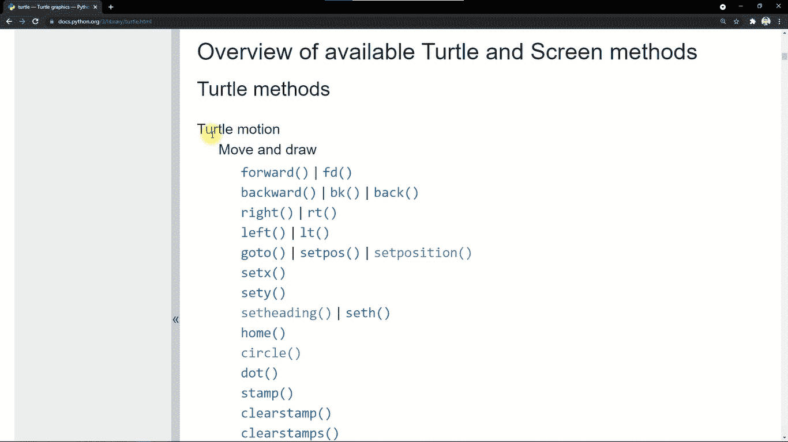

turtle docs

### 导入库

所以让我们从海龟模块中导入**海龟**和**屏幕**。在一个名为 **screen** 的新变量中调用这个屏幕。然后，当我们点击屏幕时，调用`screen.exitonclick()`函数来停止程序。

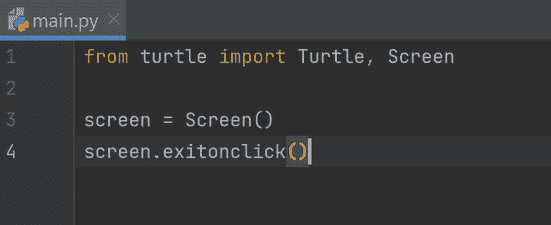

## 🔳如何定义游戏画布

现在，让我们用屏幕对象来定义我们的游戏画布。所以，让我们将**宽度**设置为 800 像素，将**高度**设置为 600 像素。

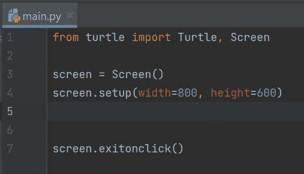

结果如下:

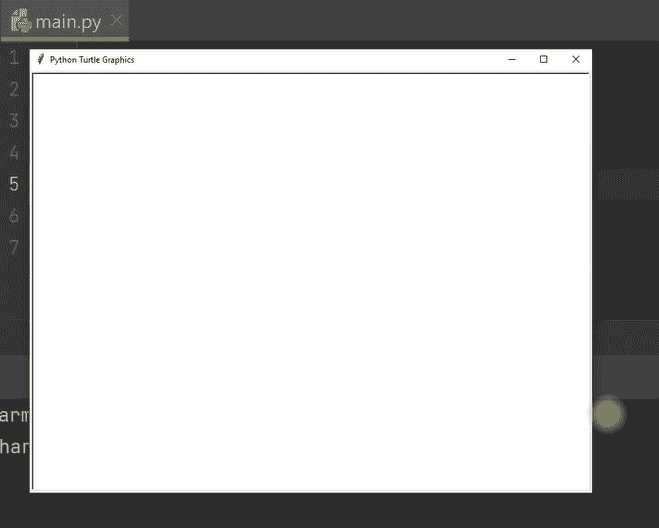

### 如何添加背景图形

是时候为我们的画布加载背景图像了。因此，让我们将我们的 **road.gif** 文件拖到我们的赛车游戏项目中。[点击此链接下载图片。](https://drive.google.com/file/d/14n2LlzMELtUazYYdEfusx_uVpyRU_n9t/view?usp=sharing)

让我们使用**`screen.bgpic`(‘road . gif’**)添加这张图片。

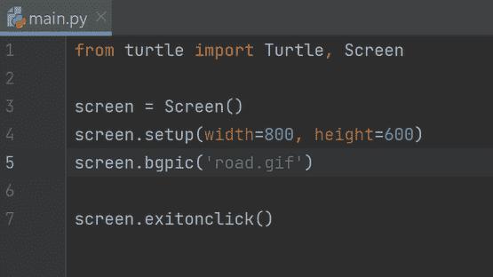

结果如下:

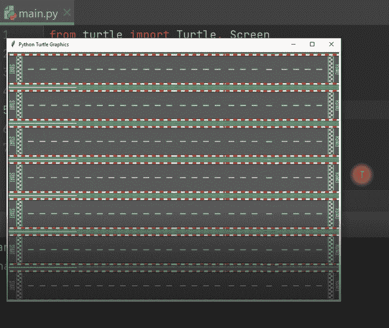

## 🐢如何使用海龟对象

现在，让我们使用`Turtle()`方法创建一个 turtle 实例，它的形状叫做 **turtle** 。

但是看起来真的很小。所以我们需要定义`shapesize(2)`。

### 如何定位海龟

现在我们需要使用`goto(x=-350, y=-260)`将我们的海龟的位置改变到左下角。

所以在这里，我们设置`x`来水平移动海龟，设置`y`来垂直移动海龟，以及相对于画布的计算值。

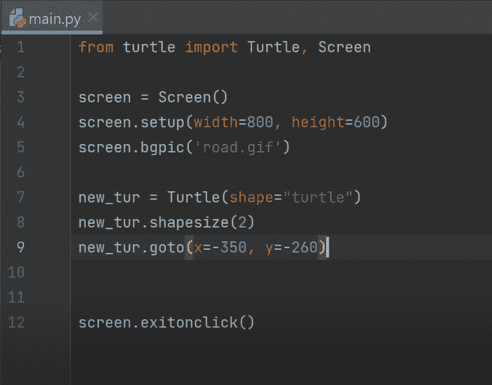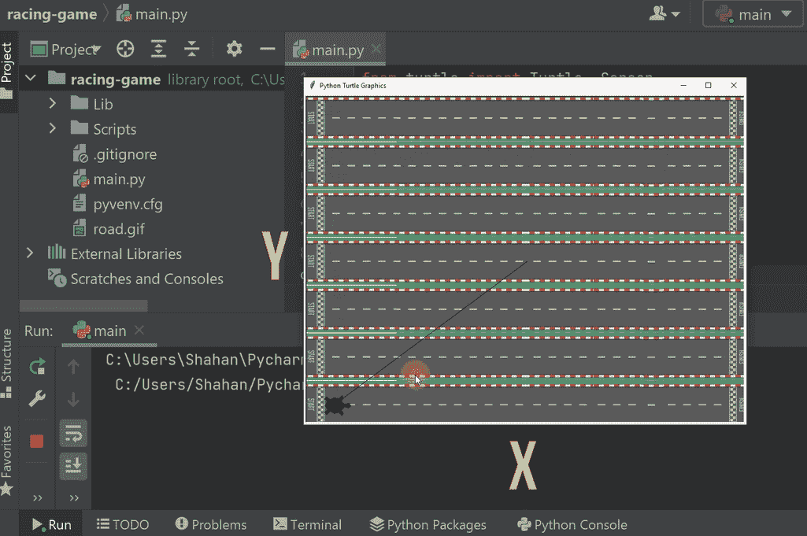

这里你可以看到乌龟已经移动到我们想要的位置。所以，我们可以在一个全局变量中取`y`的位置，并添加不同类型的值来定位我们的海龟在各自道路上的位置。

### 如何创建海龟复制品

现在，我们必须创建七种不同类型的乌龟对象。为此，我们将使用一个`for loop`。

所以`for`索引到`range(0, 7)`中，然后在这个循环中移动我们现有的 turtle 实例。当然，我们必须将`y`更改为我们的全局`y`位置变量，并按顺序获取它们的**索引**。

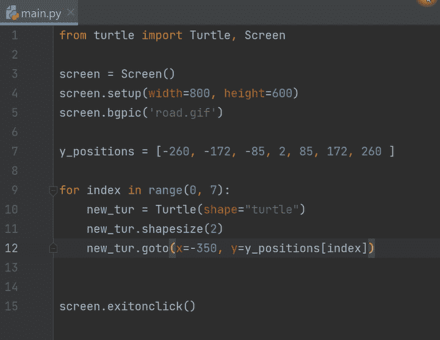

结果如下:

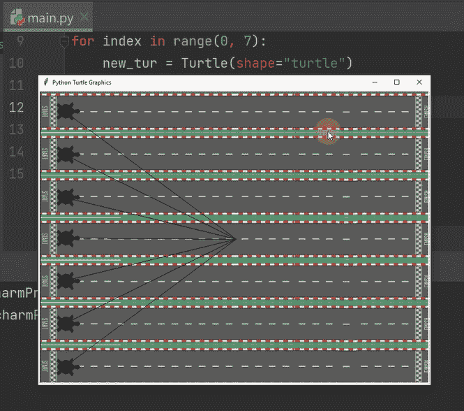

### 如何定义乌龟的颜色

如你所见，我们用不同的`y`位置创建了七个 turtle 实例。让我们通过使用一个全局颜色变量来添加一些随机颜色，就像我们对`y`位置所做的那样。然后使用`color(colors[index])`方法和他们的索引。

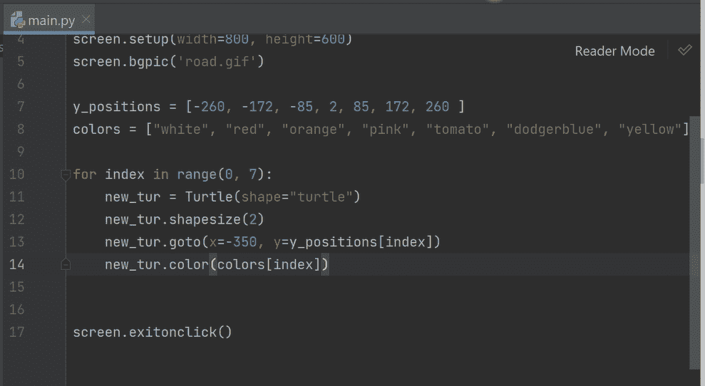

这就是结果——漂亮！

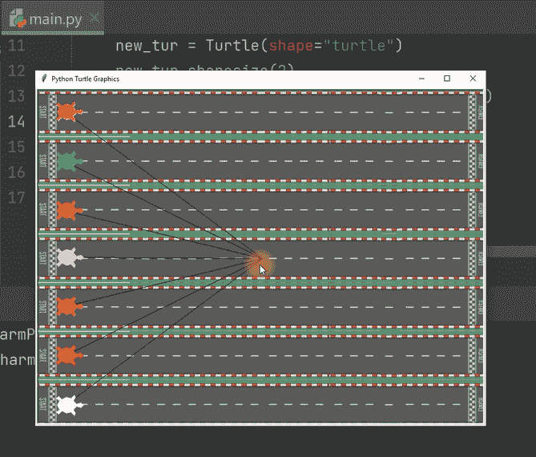

### 如何去除难看的线条

你可能会看到有一些难看的线条指向中间，移动方向很慢。所以我们可以用`speed('fastest')`和`penup()`的方法来解决这些问题。看一看！

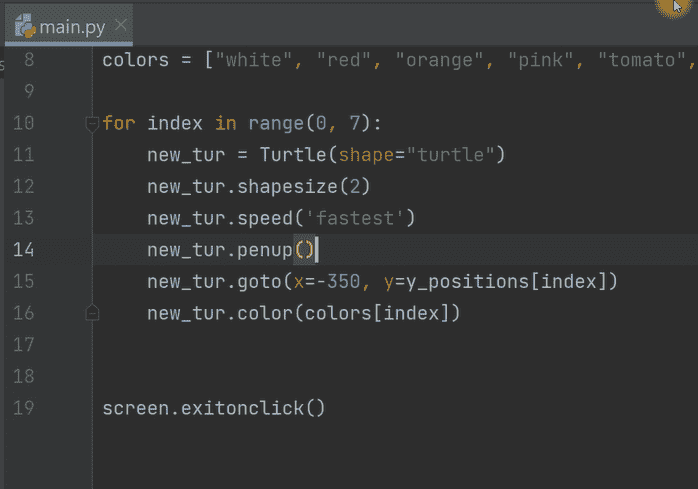

### 如何让海龟前进

现在，我们还需要什么？是的，你猜对了！我们需要为每只海龟确定一个随机的速度。但在此之前，我们如何让一只海龟前进呢？

嗯，你可以用`forward()`方法来做到这一点。假设我们需要将乌龟向前移动 30 个像素。

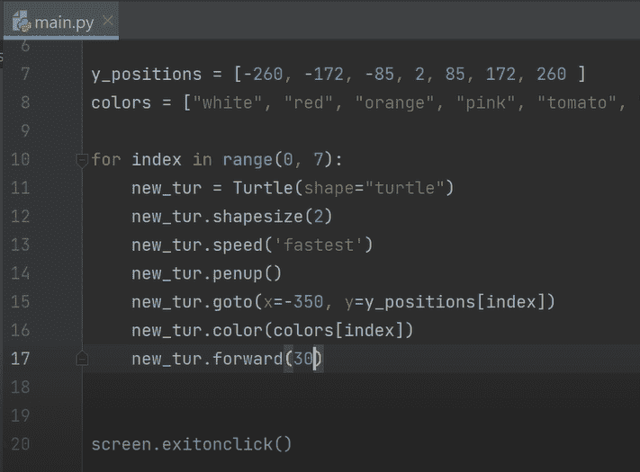

结果如下:

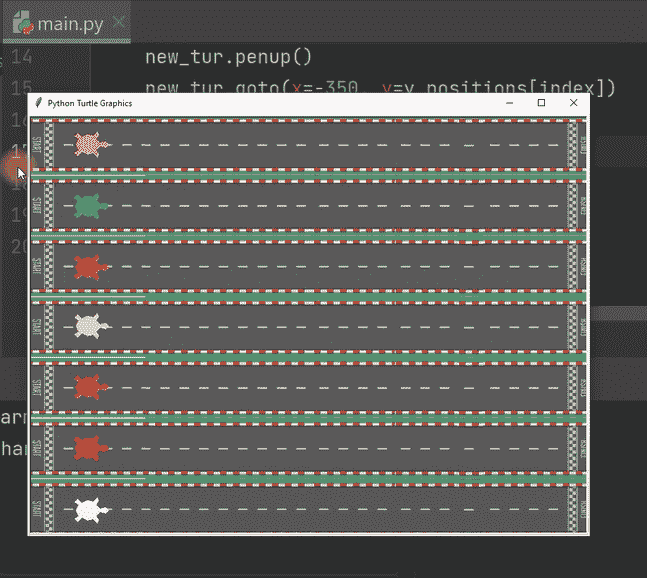

但是它们不是连续移动的。我们在这里还能做什么？考虑一下，回来看看我的解决方案。

所以，为了解决这个问题，我们在上取一个名为**的变量，并将其设置为`True`。现在我们将继续执行我们的程序，直到我们使用一个`while`循环来中断它。**

现在，我们有机会以每一步 30 个像素的速度连续向前移动我们的海龟。

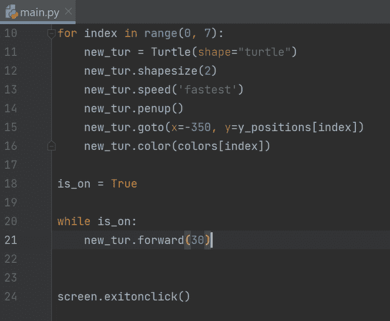

结果如下:

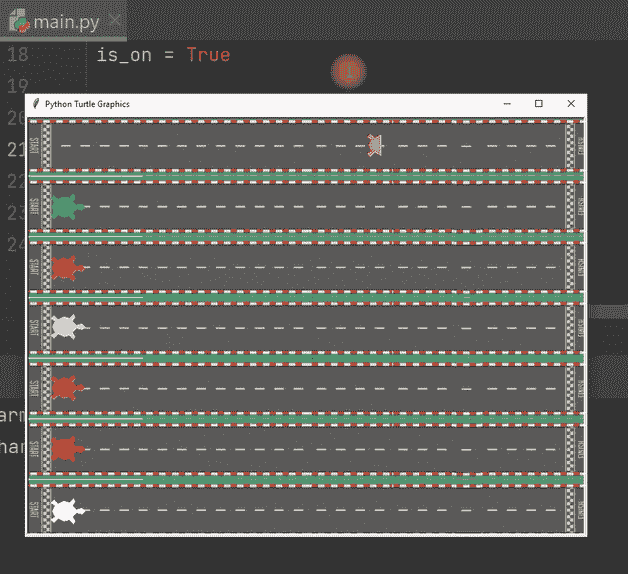

它像飞机一样移动，因为我们将`forward`设置为 30。

### 如何同步运行多个海龟

现在我们需要瞄准所有的海龟对象，而不仅仅是一个。但是怎么才能做到呢？考虑一下，回来看看我的解决方案。

因此，我们可以使用一个名为 **all_turtle** 的全局变量，并将其设置为一个空列表。现在，在 for 循环中，在创建了 7 个新的海龟实例后，我们可以将新生的海龟添加到这个全局列表中。这样我们可以在其他代码块中访问它们。

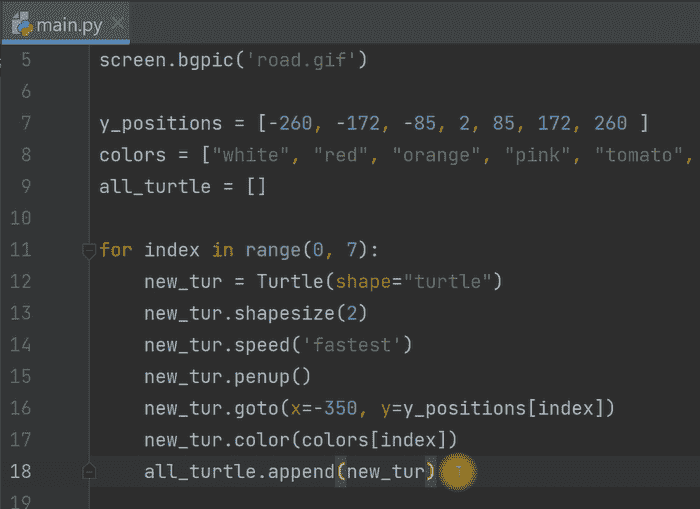

现在我们有了所有的海龟。所以，当我们的`is_on`变量为真时，我们可以说`all_turtle.forward(10)`。同样，这里我们需要再次使用 for 循环从这个**全局变量**中获取每只海龟，然后将它们`forward`移动 10 个像素。

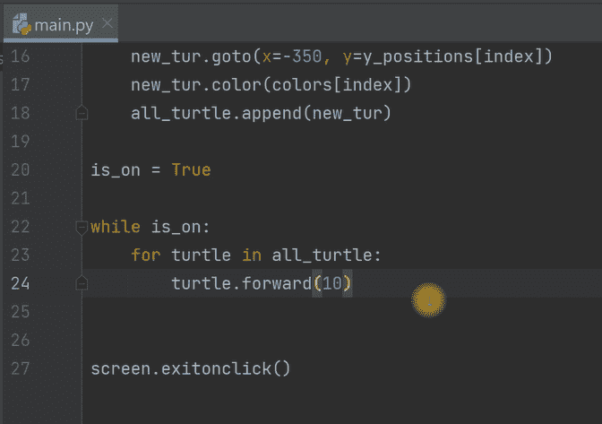

让我们看看到目前为止的结果:

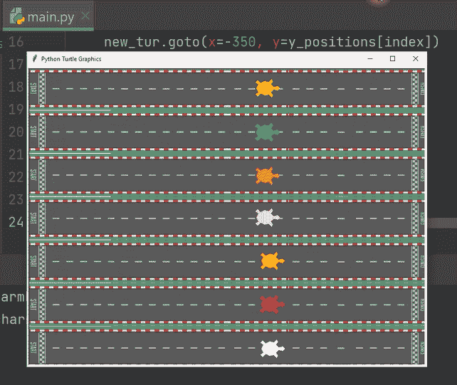

### 如何设置随机移动速度

所以，我们解决了海龟移动的问题。但是它们无限地运行着——没有终点。所有的海龟都以同样的速度移动。想想这个问题，试着自己解决。

所以让我们取一个新变量 **random_pace** 并将其设置为`random.randint(0, 7)`。它将随机返回 0 到 7 之间的值。你必须在顶部随机导入。最后像`forward(random_pace)`一样把这个 **random_pace** 变量传递给`forward()`方法。

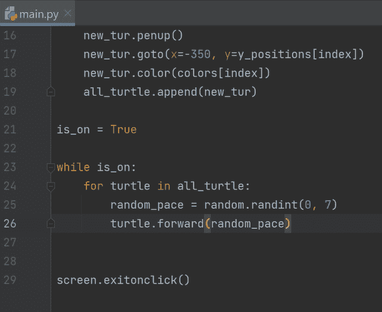

结果如下:

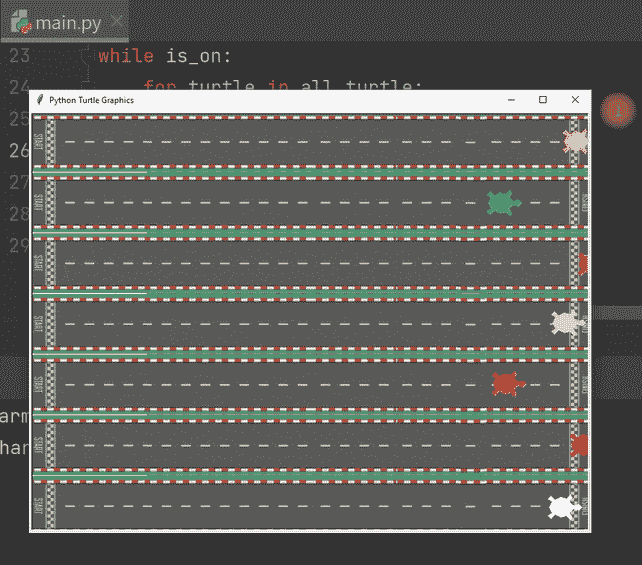

## 🏁如何设置终点线

现在，我们需要在画布上定义我们的终点线。为了解决这个问题，我们检查`if` `turtle.xcor()` > 330，设置**为开** = `False`，否则我们需要继续执行我们的程序。

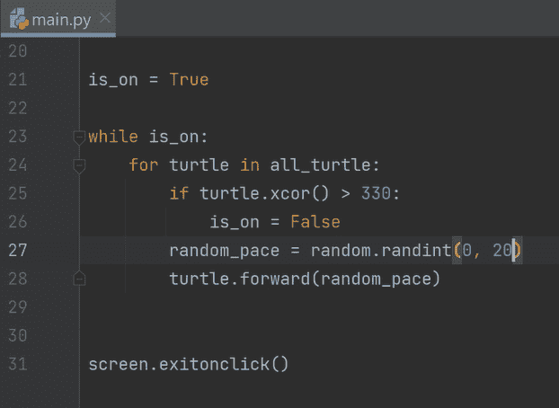

## 👥如何提示用户输入他们的赌注

我们已经完成了用户界面。现在，我们需要定义一些逻辑，让用户输入他们的赌注，并将他们的赌注与我们编程的结果进行比较。

为了让用户输入他们的赌注，我们可以写`screen.textinput`和一个占位符**‘输入你的赌注’**。我们还将 **`prompt`** 用户**“哪只乌龟的颜色”**并将其存储在一个全局变量 **user_bet** 中。

然后我们拿一个可变的**赢家**。我们检查`winner == user_bet`是否来自用户输入的颜色。我们印**你赢了**，否则**你输了**带着海龟赢家的颜色。这就是为什么我们必须使用 f 字符串来传递 print 方法中的变量。

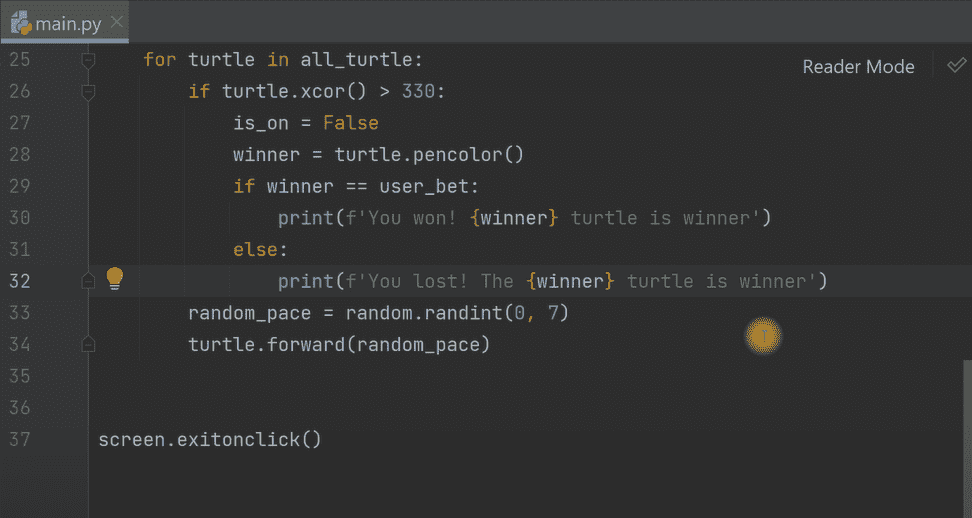

## 🎐如何在屏幕上显示结果

现在，我要你在到达终点线后，在画布上展示这些文字，用它们相应的海龟色。如何实现这一点？接下来你会看到我的解决方案。

所以，在顶部。我们取两个全局变量 **`ALIGN = "right"`** 和 **`FONT = ("Courier", 28, "bold")`** 。我们将书写以对齐右边的文本，还将字体系列设为 courier，字体大小为 28，加粗。

现在，当我们想向用户显示比赛结果时，我们将使用它们。所以当赢家海龟颜色等于 user_bet 颜色时，我们要在画布中显示文本，而不是在终端中打印。

为了做到这一点，我们编写`turtle.write()`并通过 print 语句以及 font= **FONT** 和 align= **ALIGN** 。否则，我们需要用相同的变量**字体**和**对齐**来显示文本“You lost”。看，这就是使用全局变量的好处。

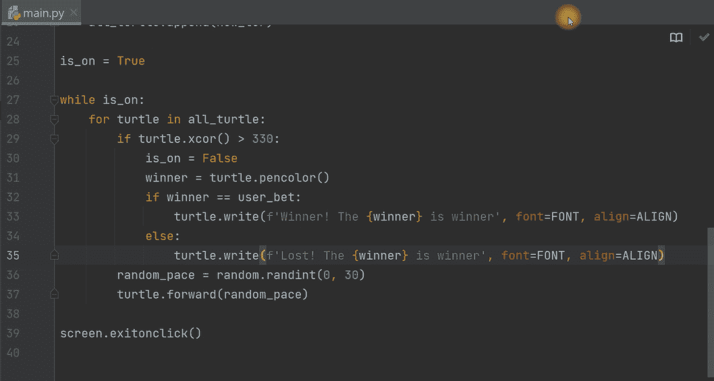

最后，让我们再运行一次这段代码。假设红海龟会是赢家。但是，正如你在下面看到的——哎呀，黄色海龟是赢家。所以，你可以看到这只海龟旁边显示的黄色粗体字。这就是为什么我们使用 align = "right "并使用`turtle.pencolor()`方法设置乌龟的颜色。

Turtle Racing Game Project 

现在你知道了——我们已经建立了我们的海龟赛跑游戏。如果你想看视频形式的教程，这里有一个完整的视频教程:

## 📹完整视频教程

[https://www.youtube.com/embed/_XmPt7iZtho?feature=oembed](https://www.youtube.com/embed/_XmPt7iZtho?feature=oembed)

## 👏结论

所以，我们在这个赛车游戏项目的结尾。如果你喜欢这篇文章，请随时订阅我的 YouTube 频道或给我发一条 T2 的推文。

编码快乐！