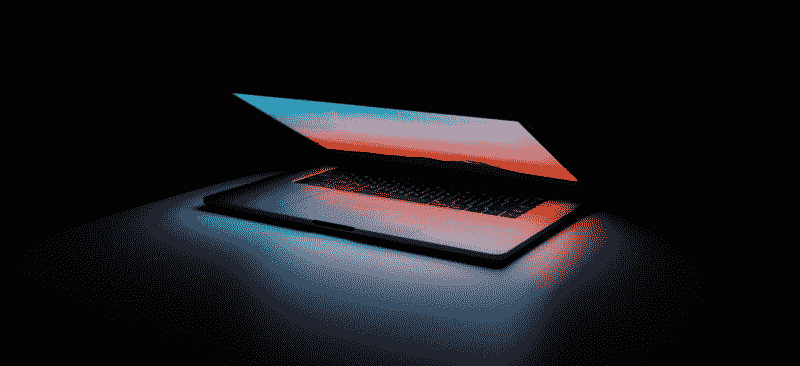

# 如何在 UITextField focus 上管理键盘以获得更好的用户体验

> 原文：<https://www.freecodecamp.org/news/how-to-manage-the-keyboard-on-uitextfield-focus-for-a-better-user-experience-1320c057b7c5/>

作者罗兰·莱斯

# 如何在 UITextField focus 上管理键盘以获得更好的用户体验



Credits: [Ales](https://unsplash.com/@mervynckw) on [Unsplash.com](https://unsplash.com/photos/Im7lZjxeLhg)

几篇[帖子](https://rolandleth.com/handling-the-next-button-automatically)前，我写了关于自动处理下一个按钮的文章。在这篇文章中，我想写的是如何自动避免使用键盘，同时提供良好的用户体验和开发者体验。

大多数应用程序都有一些需要填写的表格，即使只是一个登录/注册，如果不是几个表格的话。作为一个用户，让键盘覆盖我将要填充的文本字段让我很难过——这是一个糟糕的用户体验。作为开发人员，我们希望尽可能容易地解决这个问题，并使解决方案尽可能可重用。

良好的用户体验意味着什么？

*   聚焦的`UITextField`被带到键盘上方的焦点上。
*   聚焦的`UITextField`在解散时被“送回”。

好的开发者体验意味着什么？一切都应该尽可能自动发生，所以我们将再次使用协议。这个协议需要封装什么？

*   观察键盘将显示/隐藏通知。
*   在键盘外观上，它需要修改`scrollView.contentInset`和`scrollView.contentOffset`，使`UITextField`位于键盘正上方。
*   在键盘消失时，它需要将插入和偏移重置为以前的值。

记住这一点，让我们建立我们的协议:

```
protocol KeyboardListener: AnyObject { // 1
```

```
 var scrollView: UIScrollView { get } // 2   var contentOffsetPreKeyboardDisplay: CGPoint? { get set } // 3   var contentInsetPreKeyboardDisplay: UIEdgeInsets? { get set } // 4
```

```
 func keyboardChanged(with notification: Notification) // 5
```

```
}
```

我们需要约束这个协议，使其只符合类(1)，因为我们需要修改两个`preKeyboard`属性(3，4)。我们将使用它们来了解如何在键盘解散时恢复`scrollView`的插入和偏移。无论如何，我们最有可能在`UIViewController`中实现它。

该协议还需要有一个`scrollView` (2)，否则这真的不…可行(我猜它可能是*可行的*)。最后，我们需要处理所有事情的方法(5)，但它只是充当两个助手的代理，我们稍后将实现这两个助手:

```
extension KeyboardListener {
```

```
 func keyboardChanged(with notification: Notification) {      guard         notification.name == UIResponder.keyboardWillShowNotification,         let rawFrameEnd = notification.userInfo?[UIResponder.keyboardFrameEndUserInfoKey],         let frameEnd = rawFrameEnd as? CGRect,         let duration = notification.userInfo?[UIResponder.keyboardAnimationDurationUserInfoKey] as? TimeInterval      else {         resetScrollView() // 1
```

```
 return      }
```

```
 if let currentTextField = UIResponder.current as? UITextField {         updateContentOffsetOnTextFieldFocus(currentTextField, bottomCoveredArea: frame.height) // 2      }
```

```
 scrollView.contentInset.bottom += frameEnd.height // 3   }
```

```
}
```

如果通知不是针对`willShow`，或者我们无法解析通知的`userInfo`，退出并重置`scrollView`。如果是，将底部插入增加键盘的高度(3)。至于(2)，我们发现使用[调用`updateContentOffsetOnTextFieldFocus(_:bottomCoveredArea:)`的当前第一响应者有点小技巧](https://stackoverflow.com/a/40352519/793916)，但是我们也可以从我们的委托人的`textFieldShouldBeginEditing(_:)`调用它。

第一个助手将更新我们的两个`preKeyboard`属性:

```
extension KeyboardListener where Self: UIViewController { // 1
```

```
 func keyboardChanged(with notification: Notification) {      // [...]   }
```

```
 func updateContentOffsetOnTextFieldFocus(_ textField: UITextField, bottomCoveredArea: CGFloat) {      let projectedKeyboardY = view.window!.frame.minY - bottomCoveredArea // 2
```

```
 if contentInsetPreKeyboardDisplay == nil { // 3         contentInsetPreKeyboardDisplay = scrollView.contentInset      }      if contentOffsetPreKeyboardDisplay == nil { // 4         contentOffsetPreKeyboardDisplay = scrollView.contentOffset      }
```

```
 let textFieldFrameInWindow = view.window!.convert(textField.frame,                                                        from: textField.superview) // 5      let bottomLimit = textFieldFrameInWindow.maxY + 10 // 6
```

```
 guard bottomLimit > projectedKeyboardY else { return } // 7
```

```
 let delta = projectedKeyboardY - bottomLimit // 8      let newOffset = CGPoint(x: scrollView.contentOffset.x,                              y: scrollView.contentOffset.y - delta) // 9
```

```
 scrollView.setContentOffset(newOffset, animated: true) // 10   }
```

```
}
```

我们现在将使用`Self: UIViewController`约束(1)更新协议扩展，因为我们需要访问窗口。这应该不会造成不便，因为这个协议最有可能被`UIViewController` s 使用。然而，另一种方法是将所有的`view.window`事件替换为`UIApplication.shared.keyWindow`或`UIApplication.shared.windows[yourIndex]`的变体，以防您有一个复杂的层次结构。

然后，我们计算键盘(2)的`minY`——我们使用一个参数用于那些我们有自定义`inputView`的情况，例如，我们将从`textFieldShouldBeginEditing(_:)`调用它。然后我们检查我们的`preKeyboard`属性是否是`nil`。如果是，我们从`scrollView` (3，4)分配当前值。如果我们在调用这个方法之前改变了它们，它们可能不是`nil`。

然后我们转换窗口坐标中的`textField`的`maxY`(5)并添加`10`到它(6)，所以我们在字段和键盘之间有一个小的填充。如果`bottomLimit`在键盘的`minY`上方，什么也不要做，因为`textField`已经完全可见(7)。如果`bottomLimit`低于键盘的`minY`，计算它们之间的差值(8)，这样我们就知道要将`scrollView` (9，10)滚动多少，才能看到`textField`。

第二个助手将我们的`scrollView`重置回初始值:

```
extension KeyboardListener where Self: UIViewController {
```

```
 func keyboardChanged(with notification: Notification) {      // [...]   }
```

```
 func updateContentOffsetOnTextFieldFocus(_ textField: UITextField, bottomCoveredArea: CGFloat) {      // [...]   }
```

```
 func resetScrollView() {      guard // 1         let originalInsets = contentInsetPreKeyboardDisplay,         let originalOffset = contentOffsetPreKeyboardDisplay      else { return }
```

```
 scrollView.contentInset = originalInsets // 2      scrollView.setContentOffset(originalOffset, animated: true) // 3
```

```
 contentInsetPreKeyboardDisplay = nil // 4      contentOffsetPreKeyboardDisplay = nil // 5   }
```

```
}
```

如果我们没有原始 insets/offset，什么也不做；例如，使用硬件键盘(1)。如果我们这样做，我们重置`scrollView`到它的原始的，预键盘值(2，3)和`nil`-`preKeyboard`属性(4，5)。


Credits: [Mervyn](https://unsplash.com/@mervynckw) on [Unsplash.com](https://unsplash.com/photos/RFXxBTHze_M)

根据您的需要，使用这种方法可能会有所不同，但通常的情况是这样的:

```
final class FormViewController: UIViewController, KeyboardListener {
```

```
 let scrollView = UIScrollView()      /* Or if you have a tableView:            private let tableView = UITableView()      var scrollView: UIScrollView {         return tableView      }   */
```

```
 // [...]
```

```
 override func viewDidLoad() {      super.videDidLoad()
```

```
 let center = NotificationCenter.default
```

```
 center.addObserver(forName: UIResponder.keyboardWillShowNotification, object: nil, queue: nil) { [weak self] notification in        self?.keyboardChanged(with: notification)      }
```

```
 center.addObserver(forName: UIResponder.keyboardWillHideNotification, object: nil, queue: nil) { [weak self] notification in        self?.keyboardChanged(with: notification)      }
```

```
 // And that's it!   }
```

```
 // [...]
```

```
}
```

这是很多信息，但是我们现在有了一个很好的“保持文本字段在键盘上方”的逻辑。如果我们在实现所有这些的同时实现[自动下一步按钮处理](https://rolandleth.com/handling-the-next-button-automatically)，这对我们的用户来说就像魔术一样。

查看[这篇文章](https://rolandleth.com/observing-and-broadcasting)关于通过实现广播/收听系统和移动`Broadcaster`本身的观察者来进一步稍微自动化。我们不再需要在视图控制器中添加观察者，我们只需要调用`Broadcaster.shared.addListener(self)`。

像往常一样，我很想听听你的想法。

*最初发布于[rolandleth.com](https://rolandleth.com/avoiding-the-keyboard-on-uitextfield-focus)2018 年 10 月 18 日。*