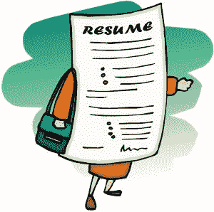
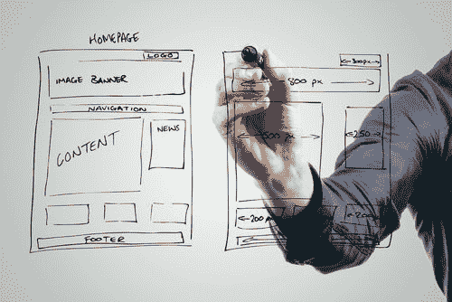

# 如何准备技术面试

> 原文：<https://www.freecodecamp.org/news/how-to-prepare-for-a-technical-interview/>

2020 年 6 月，我看了安东尼·d·梅斯(Anthony D. Mays)的一场鼓舞人心的演讲，他是摩根·拉蒂默科(Morgan Latimerco)的创始人兼技术教练。他参加了脸书开发者圈贝宁直播会议，谈论了 T2 如何准备技术面试。

直播环节，他说“帮助人们消化你今天从我这里学到的东西，分享给你的网络，是一件好事”。当你从某人那里学到一些东西时，把这些知识传授给他人是个好主意。如果你仔细观察这些信息，这是一个很好的学习方法。

所以，我决定把他在现场讨论的内容和我自己的亲身经历写下来。在本文结束时，您将了解以下内容:

*   如何获得顶级公司的关注
*   当你引起他们的注意时会发生什么
*   你可能得到的面试类型
*   解决问题的框架(技术面试中使用的 6 个步骤)

## 入门指南

2018 年，我和我的朋友有一个在大型科技公司实习的梦想。拥有如此大的梦想很酷，但问题是“我准备好迎接面前的任务了吗？”

我记得第一次加入 LinkedIn 的时候，我甚至不知道如何找到路。我不断给大型科技公司的不同招聘人员发信息，请他们给我推荐一些可能有点超出我能力范围的职位。

但是你知道有趣的是什么吗？很多人都会犯同样的错误。在试图引起大型科技公司的注意之前，你需要:

*   有广泛的经验。
*   被视为具有创新精神的人。你可以通过几种方式来展示这一点，要么做点东西然后发布，要么开自己的公司或与初创公司合作。
*   通过能够讨论你的影响来展示你是一个问题解决者。

## 如果你有这些资质，你如何获得顶尖科技公司的关注？

### 有一份很棒的简历

有些人可能很聪明，但他们的简历很糟糕。我的第一份简历真的很糟糕，每当我回顾它的时候，我就开始大笑。

我通过做研究和联系 LinkedIn 上的一些人来帮助审查我的简历，寻找改进我的简历的方法。这让我不得不一天修改两次简历。

我仍然不会说我是最擅长写简历的，但如果我比较一下之前和之后，我有所提高。

在写简历的时候，尽量用数字——你修复了多少个 bug，你筹集了多少资金，你在 Github 上有多少项目，你产生了什么影响等等。

请注意:你的简历应该包括你在 Linkedin 上的简介，所以要让简介看起来像你的简历。当你拥有惊人的个人资料时，招聘人员可能会通过 Linkedin 联系你。如果你没有 Linkedin 个人资料，你应该在这里创建一个。

### 获得推荐

如果你得到一个推荐，它应该来自一个了解你并且熟悉你的工作的人。如果你不认识任何人，你可以开始和这些人建立关系。

请注意:介绍人并不总是能让你得到工作，但它可以帮助你跳到队伍的最前面，这样你就能得到联系。

## 一旦有了公司的关注会怎么样？

引起公司的注意可以让你和招聘人员谈论你的背景，以及这个职位是否非常适合你。

如果非常适合，那么你会经历几个面试过程。下面是一些你可能经历的技术面试的例子。

### 电话屏幕

一名工程师可能会联系你进行电话筛选，让你解决一个技术问题。

确保你准备好你的手机屏幕——你可能会有一两个。如果顺利通过，你将被邀请参加现场或虚拟面试，具体视公司而定。

### 现场/虚拟面试

如果你申请的是软件开发职位，你需要准备一套特殊的技能。是的，你会被要求编码。不，你可能不会得到一台电脑，只有一个白板。

白板和编码面试需要一套特殊的技能。即使是最好的程序员也可能在编码问题上被钉死。

您可能需要与不同的工程师进行四到五次现场或虚拟白板访谈。这是因为公司希望看到你如何与不同的工程师一起工作，他们很可能在处理不同类型的问题。这也有助于他们了解你是否全面。

如果你在所有面试中都表现出色，那就太好了。试着保持一致——如果你在一个方面做得很好，而在另一个方面做得不好，这会让那些关注你表现的人感到困惑。

这个过程在虚拟面试中是一样的。唯一的区别是，当他们看你编码时，你将被要求分享你的屏幕，而不是白板。

### 基于知识的面试

这些类型的面试测试你的知识。你会被问到一些问题，比如你正在使用的框架是如何工作的，为什么你应该使用 if-else 语句，等等。

### 行为面试

较小的科技公司有点不同，但有一点相似的是行为面试。这往往会测试你是否知道在特定情况下你是如何解决问题的，你是如何在压力下工作的，等等。

很好地了解你的简历也是很好的，这样你就可以谈论简历上列出的细节。

### 基于项目的面试

通常情况下，你会被分配一个项目去做。然后你在 x 小时甚至几天之内把它退回来——这取决于公司。

## 解决问题的框架

软件公司正在寻找优秀的问题解决者。所以问题来了——**如何成为一个优秀的问题解决者？**

优秀的问题解决者会问问题，他们知道如何想出多种解决方案。这里有一些策略可以帮助你提高解决问题的能力。

### 在技术面试中使用的 6 个解决问题的步骤:

*   大声重复这个问题
*   通过提问来帮助理解问题
*   使用一个例子，这样你就知道输入看起来像什么——你可以画出来。
*   集思广益，停下来思考一两种解决问题的方法。这就是大人物发挥作用的地方。
*   实施技术解决方案
*   测试以确保代码中没有错误。

这些步骤也可以应用到你的日常工作中。你可以通过与另一名工程师进行模拟面试来测试他们——这真的会帮助你准备真正的面试。

## 结论

成功，尤其是在面试中，需要大量的努力和时间。我希望我在这篇文章中分享的技巧能帮助你开始你的技术生涯。

### **信用**

安东尼·d·梅斯的鼓舞人心的演讲。

你可以关注我的博客[这里](https://vickyella.com/vickyella.com)。