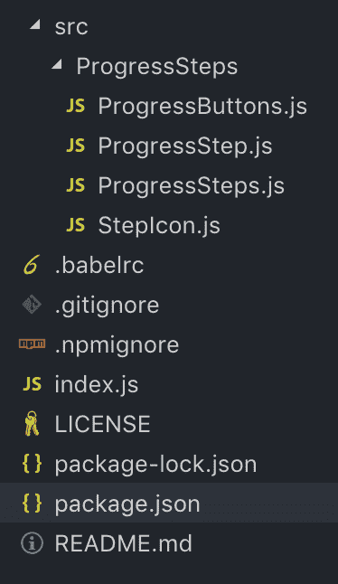

# 如何将 React 本地组件发布到 NPM——这比您想象的要简单

> 原文：<https://www.freecodecamp.org/news/how-to-publish-a-react-native-component-to-npm-its-easier-than-you-think-51f6ae1ef850/>

科尔比·米勒

# 如何将 React 本地组件发布到 NPM——这比您想象的要简单


Photo by [Markus Spiske](https://unsplash.com/@markusspiske?utm_source=medium&utm_medium=referral) on [Unsplash](https://unsplash.com?utm_source=medium&utm_medium=referral)

所以你想为开源社区做贡献？太棒了。帮助 React Native 相当年轻的生态系统成长是非常好的。

当我不久前决定承担这个任务时，我注意到没有太多关于向 NPM 发布 React Native components 的资料。所以我希望这篇文章能帮助其他人更容易地完成这个过程。

> **注意:**下面所有的示例代码都来自[react-native-progress-steps](https://www.npmjs.com/package/react-native-progress-steps)，这是我自己的第一个 NPM 包。

在我们开始之前，请确保在 NPM 上注册一个帐户。你可以在这里做这件事。

### 初始设置

首先，让我们创建一个 React 本地组件所在的文件夹。

```
mkdir <folder_name> && cd <folder_name>

# For example
mkdir my-component && cd my-component
```

> **注意:**为了使本文简短，我假设您的计算机上已经安装了 Node 和 NPM。如果不是这样，看看这个[文档](https://www.npmjs.com/get-npm)寻求帮助。

进入文件夹后，我们需要通过键入`npm init`来初始化一个新的 NPM 包。这将创建一个`package.json`文件，其中包含一些关于 React 本地组件的重要元数据。

将显示一系列问题，如包名、版本、描述、关键字等。

**重要:**当询问*入口点*时，确保输入`index.js`并按回车键。这将是导出您的主要组件的文件。

```
{
  "name": "react-native-progress-steps",
  "version": "1.0.0",
  "description": "A simple and fully customizable React Native component that implements a progress stepper UI.",
  "main": "index.js",
  "scripts": {
    "test": "echo \"Error: no test specified\" && exit 1"
  },
  "repository": {
    "type": "git",
    "url": "git+https://github.com/colbymillerdev/react-native-progress-steps.git"
  },
  "keywords": [
    "react-native",
    "react-component",
    "react-native-component",
    "react",
    "react native",
    "mobile",
    "ios",
    "android",
    "ui",
    "stepper",
    "progress",
    "progress-steps"
  ],
  "author": "Colby Miller",
  "license": "MIT",
  "bugs": {
    "url": "https://github.com/colbymillerdev/react-native-progress-steps/issues"
  },
  "homepage": "https://github.com/colbymillerdev/react-native-progress-steps#readme"
}
```

### 项目结构

下一步是为 React 本地组件设置一个文件夹结构。这真的取决于你，但是我将在下面分享我的一个简单的例子:



您会注意到一些我们还没有创建的文件。我们将很快解决这些问题。

让我们创建`index.js` 文件。这将是正确导出/导入组件的最重要的文件。导航到根项目文件夹并键入`touch index.js`。

有几种不同的方法来处理这个文件中的内容。

*   直接在`index.js`文件中编写组件类并导出到那里。
*   创建一个单独的组件 JavaScript 文件并在`index.js`中导出。
*   最后，创建许多组件和容器 JavaScript 文件，并在`index.js`文件中导出所有必要的文件。这是我遵循的方法，可以在下面的例子中看到。

```
import ProgressSteps from './src/ProgressSteps/ProgressSteps';
import ProgressStep from './src/ProgressSteps/ProgressStep';

export { ProgressSteps, ProgressStep };
```

无论采用哪种方法，该文件中导出的内容都是消费应用程序最终导入和呈现的内容。这是需要记住的重要部分。

```
import { ProgressSteps, ProgressStep } from 'react-native-progress-steps';
```

### 属国

我们必须确定需要安装哪些依赖项才能让 React 本地组件正常工作。

有三种不同类型的依赖关系:

*   **对等依赖:**这些依赖是组件运行所必需的；但是，它们应该已经安装在应用程序上了。这方面的一个例子就是`react-native`本身。然而，在 React Native 的情况下，没有必要添加`react-native`作为对等依赖。
*   **依赖关系:**这些也是组件运行所必需的，但是你不能假设消费应用程序已经安装了这些。一些例子是`lodash`和`prop-types`。
*   devDependencies: 这些更加简单。它们都是开发 React 本地组件所需的包。这些例子包括你的 linter、测试框架和 babel。

### 安装 Babel 依赖项

我们的下一步是将我们的组件连接到 Babel。我们可以通过安装以下 dev 依赖项来简单地做到这一点:

```
npm install metro-react-native-babel-preset --save-dev
```

安装完成后，我们需要创建一个`.babelrc`文件，并向其中添加以下内容:

```
{
  "presets": ["module:metro-react-native-babel-preset"]
}
```

### 创造。gitignore 和。npmignore

最后一步是创建标准的`.gitignore`和`.npmignore`文件作为最佳实践。这也将避免发布到 NPM 时出现任何问题。

```
# Logs
*.log
npm-debug.log

# Runtime data
tmp
build
dist

# Dependency directory
node_modules
```

.gitignore

```
# Logs
*.log
npm-debug.log

# Dependency directory
node_modules

# Runtime data
tmp

# Examples (If applicable to your project)
examples
```

.npmignore

### 测试

通常，将我们的包链接并安装到本地应用程序相对简单，无需先发布到 NPM。

这可以通过在我们的包根目录中使用`npm link`命令来完成。然后，导航到一个应用程序，键入`npm link <package-na` me > `then npm i` nstall。

然而，在撰写本文时，React Native 和`npm link`命令不能很好地协同工作。

到目前为止，我发现有两种解决方案可以解决这个问题:

#### 1.使用本地路径在应用程序中安装软件包

为此，导航到一个应用程序，并使用其目录路径直接安装您的软件包。

```
npm i <path_to_project>

# For example
npm i ../my-component
```

在对您的软件包进行任何更改后，您必须重新访问该应用程序并重新安装。这不是一个理想的解决方案，但却是一个可行的方案。

#### 2.创建示例文件夹并使用 npm 包

`npm pack`命令是快速打包 React 本地组件并准备好进行测试的好方法。它创建一个`.tgz`文件，然后可以安装到一个已经存在的应用程序中。

让我们在 NPM 包的根目录下创建一个`/examples`文件夹。这个文件夹本质上是它自己的 React 本地应用程序，运行并显示您的示例。

这可以通过使用`react-native init examples`创建一个 React 本地项目来完成。

> **注意:**这需要您的计算机上已经安装了 React Native。你可以在这里跟随脸书导游。

完成之后，运行`npm pack`命令来生成一个文件，该文件将具有类似于`package-name-0.0.0.tgz`的命名约定。

然后，进入`/examples`文件夹，通过在终端运行`npm i ../package-name-0.0.0.tgz`或`yarn add ../package-name-0.0.0.tgz`来安装你的组件。记得分别更换`package-name`和`0.0.0`。

创建一个或多个显示组件的 JavaScript 文件。对于这个例子，我们称之为`ExampleOne.js`。需要指出的是，您应该在这个文件中导入刚刚使用 yarn 或 npm 安装的组件。

创建文件后，打开`App.js`并导入/导出示例文件。在模拟器或设备上运行项目时，该文件中导出的内容将会显示出来。

```
import ExampleOne from './ExampleOne'

export default ExampleOne;
```

最后，我们可以使用`react-native run-ios`或`react-native run-android`运行应用程序。我们现在应该能够看到我们的组件并正确地测试它。

在对你的 NPM 包代码做了任何修改之后，记得运行`npm pack`命令，然后进入`/examples`文件夹到`npm install`或者`yarn add`到`.tgz`文件。

> 这个选项的一个很酷的好处是，其他用户可以在模拟器或设备上运行您的示例。这允许他们试用您的组件，而不必先将其导入到他们自己的应用程序中。此外，`.tgz`文件可以很容易地在同事、朋友等之间共享。

### 发布到 NPM

最后，我们准备好与令人敬畏的开源社区分享我们的 React 原生组件！

出版是非常快速和容易的。使用`npm login`从终端登录你的 NPM 账户，然后使用`npm publish`发布。

需要记住的一点是，NPM 要求我们在每次发布前增加`package.json`中的版本。

### 结论

在这篇文章中，我们已经讨论了大量的材料。如果你遇到任何问题，请在下面的评论中给我提问。感谢您的关注，我迫不及待地想看看您的成果！

对于[反应-本地-进展-步骤](https://www.npmjs.com/package/react-native-progress-steps)，贡献、拉取请求和推荐总是受欢迎的。在你的下一个项目中尝试一下，让我知道你的想法！