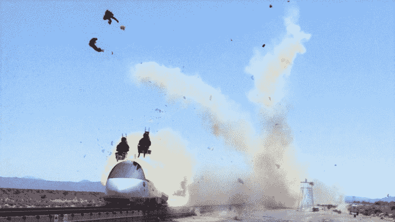

# 如何运行一个成功的开发过程(即使你不是技术人员)

> 原文：<https://www.freecodecamp.org/news/how-to-run-a-successful-development-process-even-if-youre-not-technical-185d0558c89a/>

乔纳森·索罗扎诺-汉密尔顿

# 如何运行一个成功的开发过程(即使你不是技术人员)

Wouldn’t that be greeeeeat… (Office Space, 1999)

劳伦斯·彼得在 1969 年阐明了一条原则，即“管理者会上升到他们不胜任的水平”。特别是，非技术领导者在软件开发人员中名声不佳。

办公室空间描绘了比尔·兰伯格的非技术经理，如上图所示。呆伯特提供了典型的“尖头发老板”

这篇文章是写给那些想要有效地编排开发过程而不成为你的团队的笑柄的人的。我将分享我在加州大学洛杉矶分校和斯坦福大学作为一名经理和软件架构师在管理开发和发布过程中所学到的东西。

我学到的最大教训是，保持成功软件发布的关键是**完全非技术性的**。

讲的是**过程**。

开发过程的某些方面受益于技术诀窍，但这不是必需的。成功地将软件发布到产品中，不仅仅是设计或代码的问题，更是健壮的过程架构的问题。

出于本文的目的，我们假设您已经同意开始构建一些东西。产品批准渠道是一个不同的过程。今天，我们的重点是将一致认可的产品从概念转化为产品。

#### 建造什么

你的团队需要为他们的代码组装一个清晰的路线图。建筑师和制造商使用蓝图。你也应该。

Should I use these plans or just wing it? Hmm… ([source](http://www.energepic.com/manager-processing-his-new-project/))

您的路线图应该包括一组示意图，每个示意图都有不同的用途。这些原理图因具体应用而异。用户界面模型、应用程序架构图和业务流程模型是常见的。更详细的组件图，如[统一建模语言(UML)图](https://en.wikipedia.org/wiki/Unified_Modeling_Language)和流程模型通常也是有用的。

技术专家允许您使用这些图表来评论您团队的架构，并确保他们在正确的轨道上。即使没有专业技能，这些图表也是至关重要的。

你可以用它们来推动关于产品完善的富有成效的对话。您将不再需要从开发团队中凭空或猜测得出一个“% complete”。您可以跟踪图表上每个项目的状态，以确定应用程序离完成还有多远。您还可以根据团队完成之前组件的速度来预测未来的速度。

没有“正确的”预开发文档数量，但是有一个错误的数量:没有。在你的团队开始编码之前，和他们一起制定一个可接受的路线图。您开发过程中的第**个检查点**将是审查此文档，并确保他们符合此协议。

#### 不要建造什么

你的团队不可能构建所有东西。他们也不应该。你需要确保你的开发人员把重点放在他们真正需要构建的东西上。

你当初为什么要开发这个应用？定义与现有产品的主要区别。您团队 80%的时间应该用于支持这种差异。

你现在应该有的图表在这里会很有帮助。您的应用程序包含日志组件吗？注册和登录流程？对于这些组件，在大多数语言中已经有了优秀的自由开源软件(FOSS)框架。有些是在极度宽松的许可下提供的。

特斯拉为这个概念提供了一个很好的例证。他们的第一个关键区别是使用锂离子电池使电动汽车与天然气竞争。锂离子电池通过减轻电池重量和增加续航里程实现了这一目标。

Eventually Tesla moved on to building out whole infrastructures to support their cars, like this “Supercharger” station… but not before they perfected their differentiating initial product ([source](https://pixabay.com/en/tesla-supercharger-battery-eco-1724773/))

第一辆特斯拉原型车只是将一辆已有的电动跑车从铅酸电池转换成了锂电池。他们的第一次生产主要是 Lotus Elise roadster(一款已有的跑车)，配有特斯拉电池和电机。

对你的团队来说，经验是尽可能地使用已经存在的东西。如果你能使用或修改自由/开源软件，那就去做吧。即使您需要从其他地方获得付费代码的许可，这几乎总是值得的。

迅速将所有的脚手架安装到位，这样你就可以测试你的“锂离子电池”然后，您可以迭代并替换任何有助于进一步区分您的产品的东西，而不必担心延迟生产就绪。

您开发过程的第二个检查点是与您的团队一起审查计划的架构，并确定他们打算从零开始构建的非常有限的部分。

如果它听起来像是已经存在的东西，并且不是你产品的核心焦点，挑战你的团队，看看他们为什么认为他们需要重做。

#### 不要只是把它扔到墙上

Too often, development teams “throw the release over the wall” when their work is done and walk away. Post-release bugs are for the support team to deal with. ([source](https://pixabay.com/en/brick-wall-clinker-bricks-1747314/))

一旦您确定了要使用的预构建技术，请确保与您的生产支持团队一起审查这些技术。

数据库和服务器管理员需要计划安装和支持任何新技术。这是开发过程中的第三个检查点:运营准备。

尽早让生产支持团队参与进来，90%的秘诀就是“ [DevOps](https://en.wikipedia.org/wiki/DevOps) ”如果你没听说过这个，DevOps 就是软件开发和生产运营团队应该在共同的目标下统一的思想。

提议的好处包括更快的发布，更可靠的代码，以及由于自动化而花费更多的开发时间。这些都是很大的好处，但它们来自一个强大的沟通过程。自动化伴随着协作，而不是取代协作。

#### 实施和测试

现在你的团队编写代码。与您的实施团队协作，设计一个在他们之间划分工作的流程。没有放之四海而皆准的方法，这就是领导力的“软技能”远远超过任何技术技能的地方。

一些开发人员想要独占所有“有趣”的工作，而忽略任何繁重的工作。他们可能认为自己是房间里最聪明的人，应该得到他们挑选的任务。其他人可能抵制改变，只想做他们以前做过的同样的工作。

带领你的团队公平分配工作。鼓励每个人适当成长，分享和协作。

实现的另一个技术方面是代码必须包含足够的自动化测试。这些是测试系统可以执行的代码定义的测试。

If the code’s going to crash, don’t you want these guys’ resumes to be on the line instead of your own? (public domain: US Government photo)

人工的“测试脚本”是不够的，在这些脚本中，人们与代码进行交互，以查看它是否工作，并反映出技术债务。你的技术团队至少应该包括[单元测试](https://guide.freecodecamp.org/software-engineering/unit-tests/)。[测试驱动开发](https://guide.freecodecamp.org/agile/test-driven-development/)是一种确保关键代码总是被测试的流行方法。

您可以与您的团队就他们的“测试覆盖率”(被测试的代码部分)展开非技术性的对话。很简单:让他们列出他们的假设。然后询问他们在哪里以及如何测试这些假设。

开发人员认为代码完成的**检查点**在我的工作中被称为开发完成**。**这意味着主要开发(dev)过程已经结束，但是可能会编写额外的代码来解决评审过程中出现的问题。

在一个[敏捷](https://guide.freecodecamp.org/agile)开发过程中，你通常会将实现过程分成多个检查点，而不是一个全有或全无的截止日期。这些通常被称为迭代。

请参考您在第一步中定义的路线图。在开始新的组件之前，确保您已经开始的至少是开发完成的。这为您提供了开发速度的准确视图，并降低了风险。

当您完成迭代时，您可以将代码推到一个环境中进行“验收测试”这包括与部分产品交互的试点或测试用户(或扮演该角色的内部团队)。他们进行测试，以确保它符合设计预期，并提供如何改进的反馈。

验收测试不能代替前面提到的单元测试。它有不同的用途。让您的开发团队依靠验收测试来捕捉基本的功能性错误是一个灾难的处方。

来自验收测试人员的反馈可以合并到下一次迭代中。这是另一个不要一次咬下一大块产品的好理由。一旦人们开始玩这个产品，你需要留有余地来改变方向。

一旦您积累了足够的测试代码来构成一个足够的产品发布，您就准备好开始发布管理过程了。

#### 在所有正确的地方寻找漏洞

The bug has to be in here somewhere… ([source](https://pixabay.com/en/manuscript-magnify-glass-glass-1614234/))

您的开发人员或团队已经达到了他们认为代码已经完成的程度。验收测试人员对产品的工作方式感到满意。流程中的**下一个检查点**是验证你的代码已经准备好成为产品的信念。让我们开始复习代码吧！

您可能不习惯或者没有足够的技术知识来亲自审查团队的代码。没关系！你不需要。您的流程必须。

与您的团队合作，确定适合他们的代码评审过程。如果你有不止一个开发人员，同行代码评审非常有用。如果没有，在你的团队之外，你的组织中还有其他开发人员吗？跨越团队边界建立一个同行代码评审计划。

如果真的只有一个开发人员，那么和他们坐下来，让他们带你浏览代码。使用你的原理图作为参考点，让他们告诉你代码如何实现原理图的目标。

在代码评审过程结束时，开发人员和评审人员应该对代码的责任感到满意。

代码审查也是审查另外两个关键点的好时机:文档和安全性。

我已经写了一篇关于可持续文档架构的文章，如果你感兴趣的话，可以去看看！

安全审查应该是任何代码审查的一部分。一般来说，这包括再次查看代码，找出攻击者可能利用它来泄露私人数据或获得服务器控制权的弱点。必须由技术人员来完成。

开放 Web 应用安全项目(OWASP)发布了一份[免费的安全审查综合指南](https://www.owasp.org/images/2/2e/OWASP_Code_Review_Guide-V1_1.pdf)。

如果团队中只有您的开发人员，即使他们只是运行自动化的安全代码分析工具，也可以这样做。有一些免费的工具可以帮助这个过程，这些工具通过 OWASP wiki 链接。

#### 弹射，弹射，弹射！

该代码已通过审查过程。它已经准备好成为一个产品了。但这并不意味着它已经可以生产了。

要清除的最后一个检查点是部署就绪。您的代码是否处于易于部署到生产环境的状态？这应该包括尽可能少的手动步骤。

这也意味着您需要有一个计划来恢复变更，以防代码不能按计划工作。这被称为“回滚计划”

Not all production code stays in production… ([source](https://en.wikipedia.org/wiki/Lockheed_S-3_Viking#/media/File:S-3A_escape_sys_China_Lake_NAN1-72jpg.jpg))

如果你有一个独立的软件操作团队，这就是他们回来的地方。他们应该检查部署和回滚文档，并让您知道它是否足够。

如果没有这些人员，您可以自己执行此步骤。确保有清晰、简单的产品部署说明。应该有很少的手动步骤，因为每个手动步骤都有可能导致人为错误。

如果部署不成功，应该有一个清晰、充分的计划来恢复到以前的状态。这可能像恢复备份一样简单，也可能涉及客户通信或数据转换。

计划是否充分取决于您的团队测试代码的彻底程度，以及产品发布的范围。还要考虑与该产品或该特定版本相关的任何风险。

一旦通过了这个检查点，就可以将代码投入生产了！

#### 发布后

无论成功还是失败，重要的是回头回顾一下这个过程是如何进行的。

你的团队是否准确地估计了发布一个产品所需的工作量？测试是否充分模拟了生产场景？重新访问实现和测试检查点，并检查团队的表现。

产品在生产中运行情况如何？拜访操作人员并获得他们的反馈是个好主意。这进一步建立了开发和运营团队之间的信任，并将带来更多的 DevOps 好处。

你的产品还有哪些差距？如果它们在第三方代码中，现在是时候考虑是定制你的包还是从头重新实现了。否则，您现在就有了为下一个版本构建什么的输入。

最重要的是，让你自己和你的团队对你努力的结果负责。

责任感有助于独立，促进个人成长。随着你的团队逐渐习惯于对这个过程中的每一步负责，他们会相应地调整他们的表现。

#### 结论

要运行一个成功的软件发布过程，你不需要一点点技术。专业技能可以有所帮助，但也可能成为拐杖。

成功的软件发布的关键是一个很好记录的、很好理解的过程，用于将软件通过管道从想法转移到产品。你现在有了一个起草你自己的软件发布过程的起点。

最重要的是，你和你的团队一起填补空白，创造一个对你们所有人都有用的可重复的过程。

它不一定对任何人都是完美的，但它必须被每个人理解。

您还需要确保您的产品通过这些检查点的速度与对产品的需求相匹配。这些项目都不需要多天的显示停止。它可以是一个简单的一页清单。您需要定义一个适合您的环境的过程。

与任何过程一样，您也应该迭代。就像代码一样，你的第一份未经测试的草稿不可能是完美的。在每一次运行中调整这个过程，你将得到一个平滑的、可预测的软件发布路径。

记得梳头。你不想让它看起来…尖尖的。

如果您喜欢这篇文章，并希望阅读更多类似的内容，请？让我知道！如果您想了解更多关于企业应用程序开发流程的信息，请在下面回答。我很高兴分享我在我的团队的旅程中学到的东西！

您可能也会喜欢我关于软件开发业务流程的其他文章:

*   [跳过清单会错过什么](https://medium.freecodecamp.org/what-you-missed-because-you-were-too-cocky-to-use-a-checklist-c30c3ad663c2)
*   [当我们失去了我们的独狼导师](https://medium.com/@peachpie/life-after-rick-our-team-reborn-after-the-fiery-departure-of-our-misanthropic-guru-b1fbaf3b8621)时，我们如何将自己重新组织成一个更专业的开发团队

乔纳森是加州大学洛杉矶分校研究信息系统部的建筑和运营助理主任。他获得了斯坦福大学的物理学学位，此后在信息系统架构、数据驱动的业务流程改进和组织管理领域工作了 10 多年。