# JavaScript 教程——如何建立一个前端开发项目

> 原文：<https://www.freecodecamp.org/news/how-to-set-up-a-front-end-development-project/>

假设你计划建立一个网站。在开始之前，您需要设置一些工具来简化您的工作。但是应该有哪些工具呢？

JavaScript 生态系统变化如此之快，以至于挑选最好的工具可能会让人不知所措。为了解决这个问题，在这篇文章中我将带你从头开始建立一个前端项目。

我们将讨论必备的编辑器扩展、如何将 JavaScript 库添加到项目中、即使您想进行前端开发也要使用 Node.js 的原因，以及如何设置一个应用捆绑器，以便在浏览器中编码时生成实时预览。

所以让我们开始吧。

## 如何选择代码编辑器

让我们从基础开始。作为一名 web 开发人员，你主要编辑文本，所以你需要一个好的编辑器。那么应该用哪一个呢？

选择一个编辑很大程度上基于个人偏好，因为大多数编辑都有非常相似的特征。

如果你没有个人喜好，我强烈推荐 [VS 代码](https://code.visualstudio.com/)。最近，VS Code 已经成为 web 开发事实上的标准编辑器。

这是最新一期 JS 调查的图表。在这项调查中，超过 23，000 名开发人员被问及他们对 web 开发的偏好。绝大多数人选择了 VS 代码。

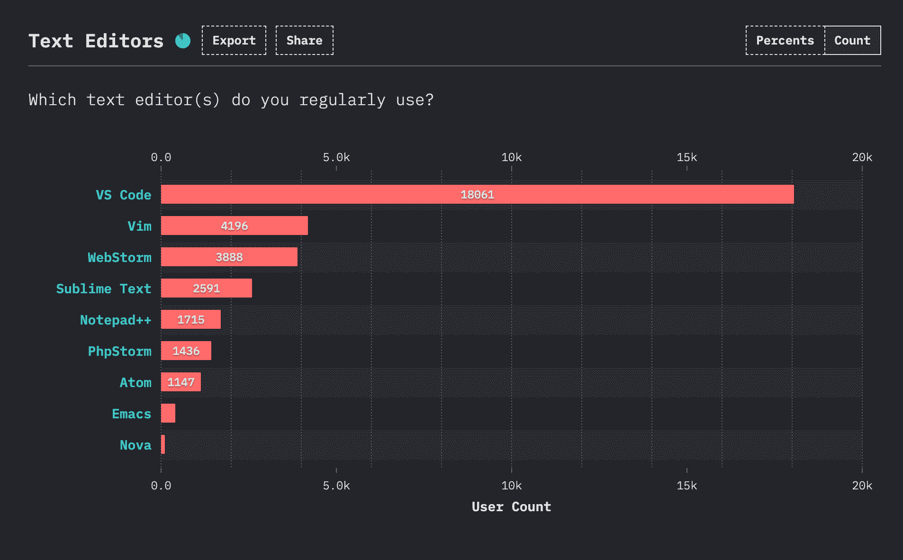

如果你以前没有检查过 JS 调查的[状态，我强烈建议你这样做。它可以让您很好地了解 JavaScript 的最新趋势。您可以了解人们喜欢使用哪些工具和库，以及他们将很快放弃哪些工具和库。](https://stateofjs.com/)

所有主流编辑器的最大特点之一就是你可以给它们添加扩展。让我们看一看两个必备的扩展。

## 如何在 VS 代码中自动格式化你的代码

更漂亮是一个扩展，使你的代码更可读，更一致。

假设你从栈溢出中复制粘贴了一些东西，很难阅读。制表关闭，一行太长，等等。然后你只需保存文件，神奇的是，一切看起来就像它应该的那样。

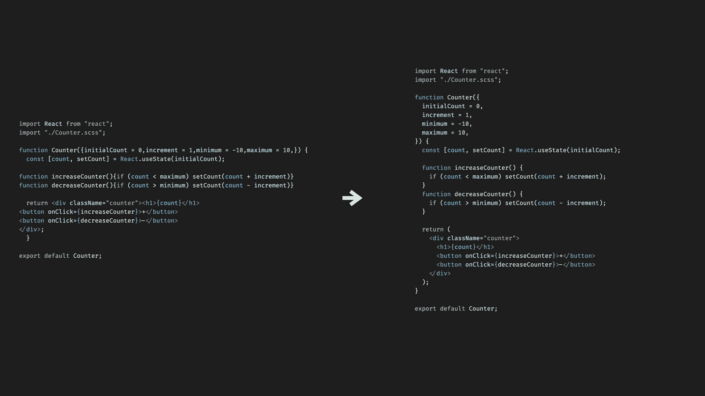

这就是漂亮女孩所做的。它根据最佳实践格式化代码。它不只是修复制表和换行。它还添加了括号来提高代码的可读性，确保与引号保持一致，等等。

为了让它工作，首先，你必须安装更漂亮的扩展。在 VS 代码中，进入扩展面板，搜索更漂亮的，然后安装它。

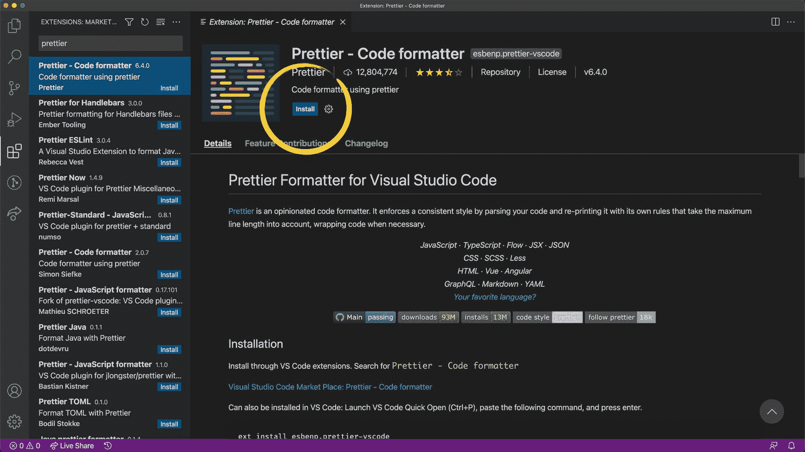

默认情况下，安装扩展不会在保存时自动格式化文件。默认的行为是，一旦你安装了扩展，你可以在一个文件中右击，然后选择**格式化文档**。或者选择文件的一部分，然后选择**格式选择**。

第一次这样做时，您需要选择默认的格式化程序。VS 代码已经有了一个格式化程序，只是没有 Prettier 那么强大。所以现在我们有了两个格式化器，我们必须让 VS 代码知道，在将来，当涉及到格式化时，我们希望使用更漂亮的。

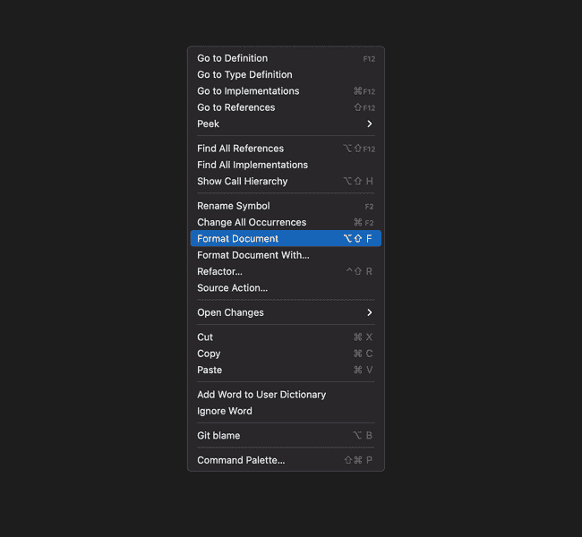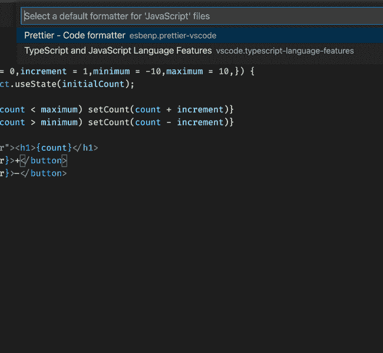

Set Prettier as the default formatter

如果您想在保存时自动格式化文件，您需要更改设置。

转到 VS 代码首选项中的设置，在保存选项中搜索**格式。默认情况下，这是假的，所以请确保您勾选了复选框。此后，每次保存文件时，格式化都会自动进行。**

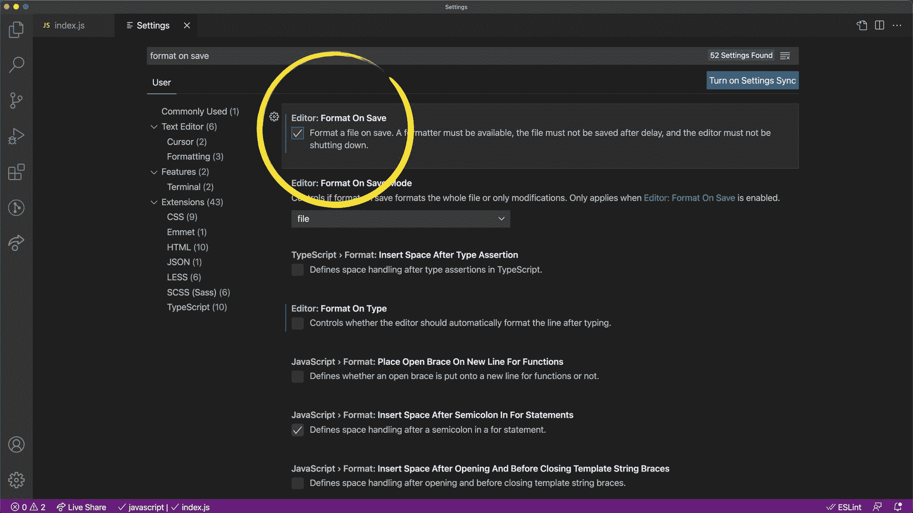

不过，格式可能会引起争议。在大多数情况下，尤其是对于初学者，我强烈推荐默认设置。但是如果你喜欢不同的风格，你可以定制东西。

您可以用注释来指示[忽略特定的行](https://prettier.io/docs/en/ignore.html)，并且您可以创建一个 rc 文件来列出您的首选项。

在项目的根文件夹中，您可以创建一个名为**的文件。增加一些选项。一个典型的选择是，如果你喜欢在文件中使用单引号而不是双引号。或者如果您不希望行尾有分号。**

使用这种配置，一旦保存文件，您应该会看到不同的结果。

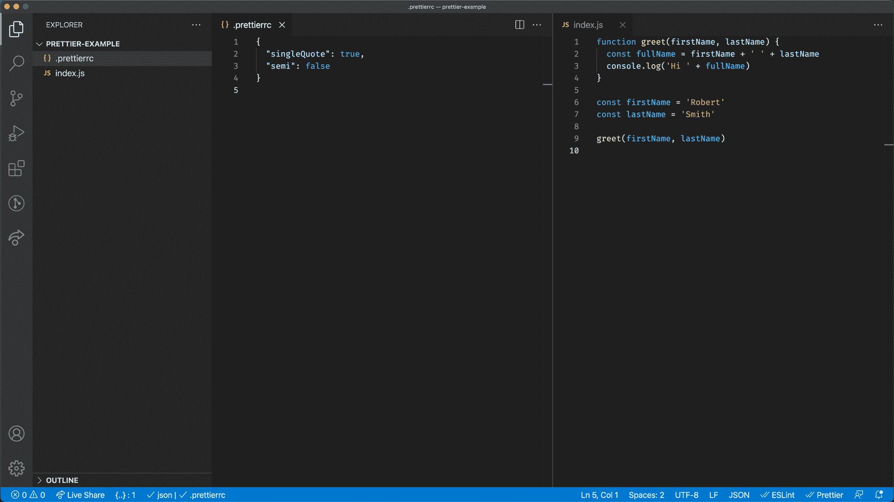

当然还有更多选择。如果你想更深入地了解，请查阅漂亮者的文档。

## 为什么前端项目需要节点？

在我们开始第二个必备扩展之前，我们需要设置一些其他的东西。首先需要说一下 Node.js，Node 是什么，即使你是做前端开发的，为什么还需要它？

Node 经常与后端开发联系在一起，但这并不完全正确。如果你看到一份他们正在寻找节点开发人员的工作描述，那么很可能他们确实在寻找后端开发人员。

然而，即使你做前端开发，你也要使用 node。

那么什么是 Node，为什么人们认为它是用于后端开发的，为什么即使作为前端开发人员也需要它呢？

节点是一个 JavaScript 运行时。它在浏览器之外运行 JavaScript 文件。运行 JavaScript 代码有两种方式。您可以将它作为网站的一部分，并在浏览器中运行整个网站，或者只运行带有 Node 的 JavaScript 文件。

在这个例子中，我们有一个非常简单的 JavaScript 文件，它将 Hello World 打印到控制台。

如果我们安装了 Node，我们可以转到终端，导航到该文件所在的文件夹，然后像这样用 Node 运行它。您可以看到文件已被执行，结果在控制台中。

这就是 Node 的真正含义，它是一个独立运行 JavaScript 文件的工具。

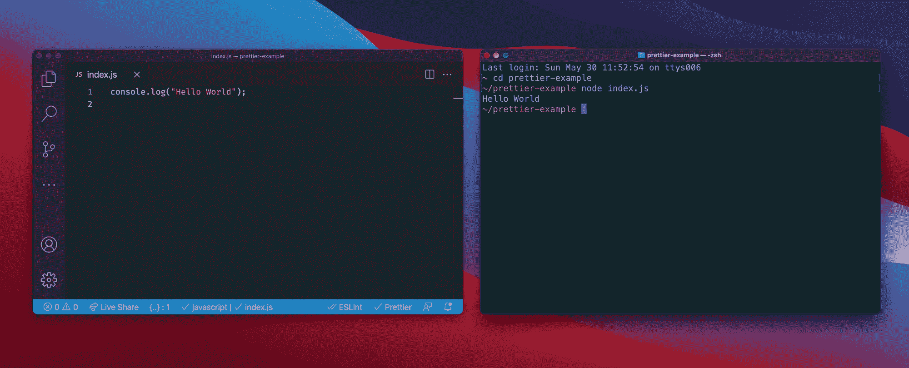

在这两种情况下，JavaScript 的行为基本相同。但是 JavaScript 在浏览器中可以做什么以及何时与 Node 一起运行也存在差异。

例如，当在浏览器中运行时，JavaScript 可以访问 HTML 元素并修改它们。这是使用 JavaScript 的主要目的。

在 Node 中，没有 JavaScript 可以访问的 HTML 文件。JavaScript 独立运行。

另一方面，在 Node 中，JavaScript 可以访问你的文件系统，读写你的文件。

例如，您可以在您的机器上运行脚本，为您生成一个项目框架。您可以对文件进行检查，并自动纠正错误。或者您可以运行您的测试文件。

简而言之，Node 让你运行一些脚本，让你的生活更轻松。

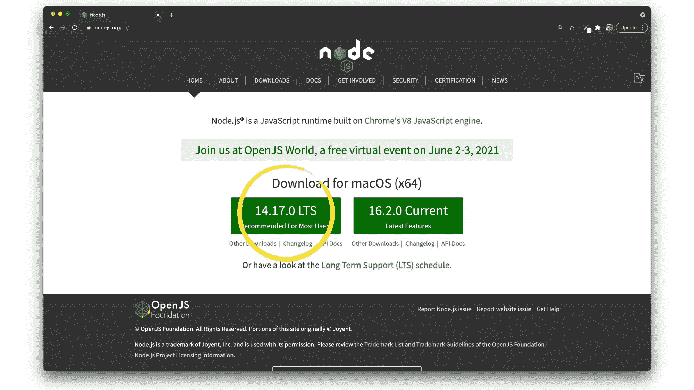

要安装节点，请转到[nodejs.org](https://www.freecodecamp.org/news/p/61840bb6-377c-4565-aed6-c0efc682e112/nodejs.org)并安装标签为 LTS 的最新稳定版本。如果你不确定你是否已经有了 Node，你也可以到你的终端运行 **node -v** 来检查它。如果你有一个版本号，你就有了节点。

所以要回答这个问题，为什么人们会把 Node 和后端开发联系在一起？因为如果后端代码是用 JavaScript 编写的，服务器需要一种不用浏览器就能运行它们的方法。所以是的，如果你是一个使用 JavaScript 的后端开发者，你将会使用 Node。但是 Node 远不止这些。

## 如何运行您的项目

现在我们已经安装了节点，我们可以安装一个捆绑器。什么是捆扎机？bundler 是一个工具，它把你所有的文件打包成一个整洁的包，你可以在浏览器中运行它。

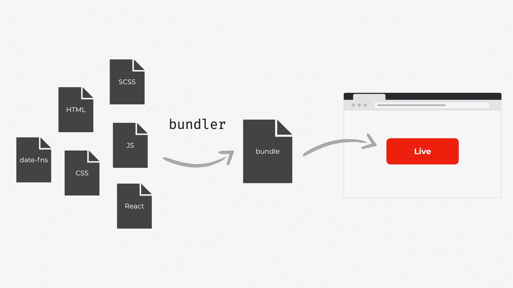

为什么你不能在浏览器中运行你的文件？如果你使用普通的 HTML、CSS 和 JavaScript 文件，那么你是对的。你甚至可能不需要捆绑器。

但是网络开发工具已经发展了，当你使用任何更先进的工具时，你的浏览器将无法理解你的文件。

你在用 React 吗？React 的 JSX 语法看起来像 HTML 不是 JavaScript 语法的一部分。你需要一个工具把它转换成普通的 JavaScript。否则，它不会在浏览器中运行。

你用的是 SCSS 语还是其他 CSS 方言？然后，你必须把它转换成普通的 CSS，这样浏览器才能理解它。

你想使用 bundler 的另一个原因是，它可以在你编码时生成你的网站的实时预览。任何时候你保存一个文件，你都可以在浏览器中看到结果。

那么如何挑选捆绑者呢？有几种选择。目前使用最多的捆绑器是 [**webpack**](https://webpack.js.org/) 。Webpack 是一个非常强大的工具，有很多配置选项。但这许多选择也是它的弱点。如果你是新手，设置它并不是一件容易的事。

最近流行的另一个伟大的选择是 **[包裹](https://parceljs.org/)** 。Parcel 具有与 webpack 相似的功能。在某些方面，甚至更好。

它的伟大之处在于，一旦你安装了它，它需要零配置。包裹自动计算出你在使用什么，并解释你的文件。

你在用 React 吗？没问题，帕奇认识到了这一点，并解释了 JSX。你在用 SCSS 吗？没问题。包裹知道该做什么。

要安装 package，您需要在终端中运行一个命令。我们将使用 npm，节点包管理器来安装它。npm 是 Node 自带的工具。如果您安装了 Node，那么您也有 npm。

使用 npm，您可以在您的计算机上全局安装 JavaScript 库，或者专门为某个项目安装。

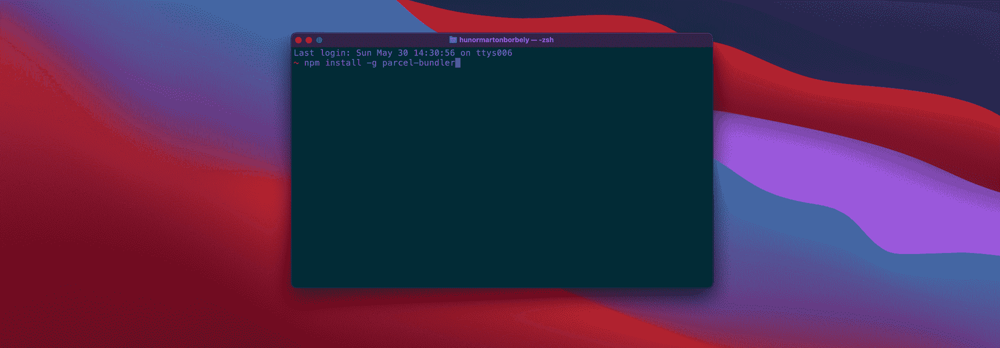

转到您的终端，运行以下命令。这里的-g 标记表示全局。一旦你在你的电脑上安装了包，你就可以用它来运行任何项目。您不必为您创建的每个项目安装包，您只需做一次。

```
npm install -g parcel-bundler
```

> 注意:上面的命令将安装包 1。在撰写本文时，package 2 处于测试阶段，您也可以使用**NPM install-g package**来安装它。

在全局安装完 package 之后，让我们看看如何使用它来运行一个项目。

假设我们有一个包含 HTML、CSS 和 JavaScript 文件的网站。我们可以使用 Parcel 为我们创建一个实时预览。

打开终端，确定您在项目所在的文件夹中。如果你使用的是 VS 代码，你可以使用内置的终端，它会在正确的文件夹中自动启动。

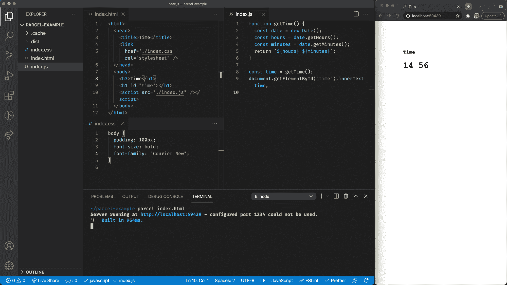

Running Parcel with VS Code's built in terminal

一旦我们确保我们在正确的文件夹中，我们可以用下面的命令运行包。这将给你一个可以看到结果的 URL。每当我们更改文件时，我们都可以在浏览器中看到 save live 的结果。

```
parcel index.html
```

一旦你启动这个脚本，它将运行并生成你的站点的实时预览，直到你停止它或关闭终端窗口。一般来说，你可以在开发网站的时候让它保持运行。然后一旦你完成了你可以按下 **Ctrl+C** 来停止它。

如果它变得不同步或者您因错误而中断它，那么您也可以通过按 Ctrl+C 停止它来重新启动它，然后再次运行相同的脚本。

当然，包裹远不止这些。现在，除了普通的 CSS，你还可以使用 SCSS 作为例子。这允许您使用许多很酷的特性，比如嵌套声明、使用 mixins 或调用函数等等。就像有超能力的 CSS。或者你甚至可以替换 HTML，改用 Pug。

## 如何将库添加到 JavaScript 项目中

现在我们已经安装了 Node，并且预览了 npm，让我们看看如何将库添加到我们的项目中。

过去，开发人员使用 CDN 来添加库。您可以通过在 HTML 中包含一个指向 URL 的脚本标签来导入一个库。

这很好，它仍然工作得很好，但现在许多开发人员使用 npm 或节点包管理器来将库添加到他们的项目中。那么它是如何工作的呢？

首先，您必须在终端中使用以下命令初始化项目。同样，您需要在项目的根目录中运行这个命令(提示:使用 VS 代码的内置终端在正确的文件夹中启动)。

```
npm init —yes
```

这个命令用一些元数据初始化了根目录中的 package.json 文件。它包含项目名称、描述、版本号等等。当您添加 yes 标志时，所有这些值都将有一个默认值。

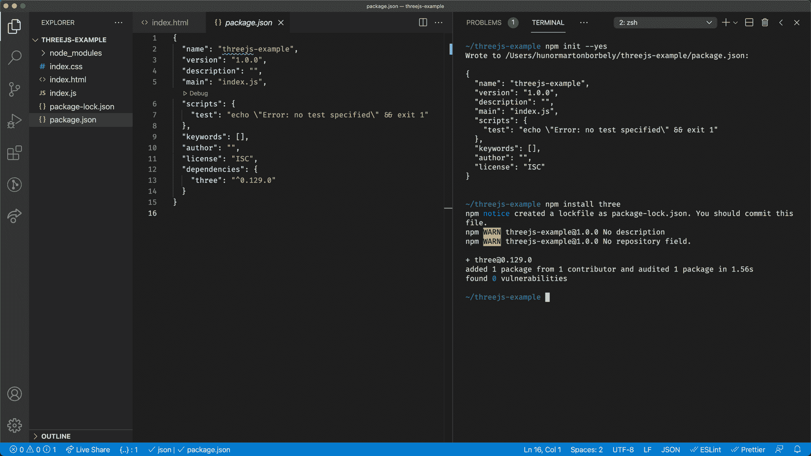

Initializing a project and installing Three.js

现在，我们可以使用 npm install 命令将库添加到我们的包中。在我的[上一篇文章](https://www.freecodecamp.org/news/render-3d-objects-in-browser-drawing-a-box-with-threejs/)中，我们使用 Three.js 在浏览器中渲染 3D 框。

例如，让我们安装 Three.js。再次转到您的终端，确保您在正确的文件夹中，并运行以下命令:

```
npm install three
```

这样会安装 Three.js，怎么知道这里的关键字是 Three 而不是 threejs？

当你不知道包的名字时，你可以谷歌 npm 和你需要的库的名字。或者，如果你甚至不知道图书馆的名称，你也可以只搜索 npm 3D 图书馆，看看谷歌想出了什么。

我们可以逐个查看这些包，并根据它们的功能和其他信息选择一个。这些包大多带有描述和快速示例，让您了解该库能为您做什么。

另一个你可能希望留意的指标是每周下载量和最后更新的时间，以确保你选择了一个人们仍在使用的积极维护的库。

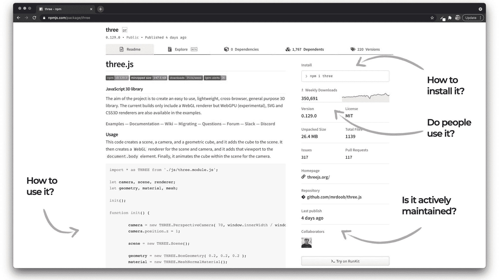

一旦你找到了你要找的包，你就可以在右上角看到安装它的命令: **npm i 三**。这里的 I 只是 install 的简写。

当我们运行这个命令时，会发生三件事。

首先，它会将最新版本的 Three.js 作为项目依赖项添加到您的 package.json 文件中。

然后，它还创建一个包锁文件。这两个东西，package.json 文件的依赖部分和包锁文件，都是永远不应该手动编辑的。对于添加、删除或更新软件包，您总是使用 npm install、npm uninstall 等命令。

运行 npm install 命令后，将会发生的第三件事是创建 node_modules 文件夹。这是 Three.js 的实际源代码所在的文件夹。

所以当你在项目中导入 Three.js 时，它会在这个文件夹中查找。这个文件夹也是您永远不想手动更改的。

现在我们已经安装了 Three.js，我们可以创建一个非常简单的网站来显示一个 3D 盒子。这是一个简单的 HTML 文件和一个包含 3D 盒子代码的 JavaScript 文件。

这里的关键是，在 JavaScript 文件中，用 import 语句导入 Three.js。这将使用您刚刚安装的软件包。

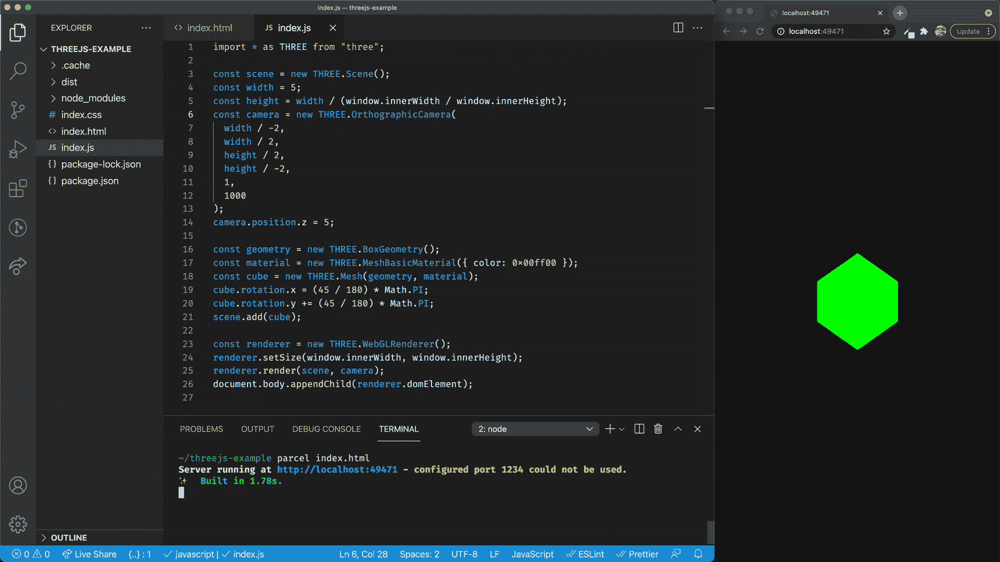

然后，我们可以用包运行项目。使用进口意味着我们现在使用模块系统。使用模块语法运行项目可能有点棘手，但是当我们使用 Parcel 来运行项目时，它可以无缝地工作，没有任何问题。这是我们使用包裹的原因之一。

如果你想了解更多关于用 Three.js 构建 3D 游戏的知识，可以看看我之前的文章关于如何在浏览器中构建一辆简约的汽车。

## 如何在编码时获得编码技巧

VS 代码的第二个必备扩展是 ESLint。当 Prettier 正在格式化代码时，ESLint 可以给你一些编码技巧。

当您试图理解代码时，JavaScript 中有几种模式可能会导致错误或误导。

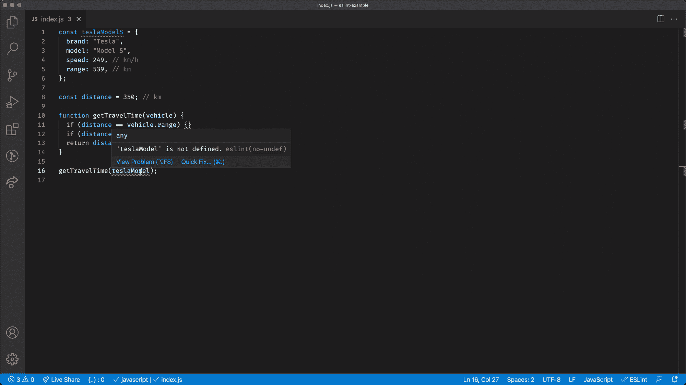

A typo can lead to annoying bugs

在这个例子中，我们声明了一个变量，但是我们有一个拼写错误，我们试图使用另一个不存在的变量。

ESLint 将为您重点介绍这一点。它会给你一个警告，在变量声明的时候说你创建了一个你不使用的变量，在使用的时候说你试图使用一个没有声明的变量。

在这些警告之后，很容易发现你打错了。当然，ESLint 比捕捉这个简单的错误要复杂得多。还有一些不太明显的问题，你可能首先不明白它为什么抱怨。

此时，您还可以单击该链接查看更详细的解释，了解为什么这种模式被认为是有害的，以及如何避免这种模式。

那么如何在项目中使用 ESLint 呢？设置它比安装扩展需要更多的步骤。幸运的是，大多数这些步骤你只需要做一次。

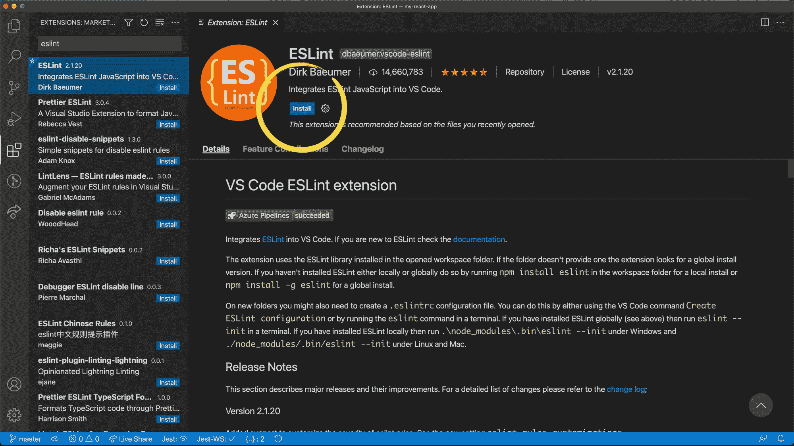

首先，就像你在 Prettier 上做的那样，你必须安装 ESLint 扩展。进入扩展，搜索 ESLint 并安装它。

然后，您还需要生成一个 ESLint 配置。但是在您这样做之前，首先您需要确保您的项目是用 npm init 初始化的。

如果您还没有 package.json 文件，那么首先您必须运行 npm init —yes 来初始化您的项目。

然后，您可以使用以下命令生成一个 ESLint 配置。

```
npx eslint --init
```

npx 是 Node 附带的另一个工具。它可以运行甚至不在你电脑上的脚本。

在这种情况下，我们运行 ESlint 脚本，但我们从未真正安装过 ESlint。我们安装了 ESLint 扩展，但这不是我们在这里执行的脚本。

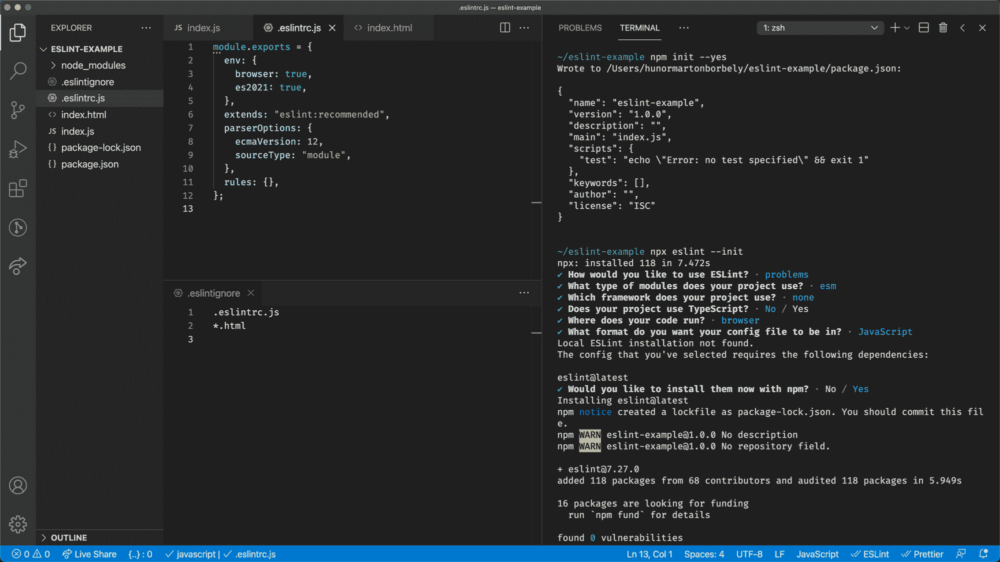

Initializing ESLint config from the terminal, adding an .eslintignore file

这个脚本会问你几个问题。除了第一条，这些都是显而易见的。

*   您希望如何使用 ESLint？

您是希望 ESLint 只检查语法问题，还是希望它也能发现可能的问题，或者甚至希望它检查文体问题？

如果你也使用更漂亮，你需要选择第二个选项。因为如果 Prettier 和 ESLint 都试图为你推荐一种风格，他们很可能会发生冲突。

所以，如果你使用 Prettier，你不希望 ESLint 检查样式，只检查语法和可能的问题。

*   你的项目使用什么类型的模块？

在前端项目中，你可能使用导入和导出，所以你选择第一个选项。

*   你的项目使用哪个框架？

如果使用 React 或 Vue.js，则选择适当的选项，否则选择无。

*   你的项目使用 Typescript 吗？

如果您使用 Typescript，请选择是，否则只需按 enter 键继续。

*   你的项目在哪里运行？

你的项目应该在浏览器中运行还是在 Node 中运行？在这里，我们设置了一个前端项目，因此我们选择浏览器。

*   你希望你的配置文件是什么格式？

这并不重要，但是如果您稍后想要定制配置，您可能想要选择 JavaScript 或 JSON。

脚本最后询问是否应该安装 ESlint 作为开发依赖项。在这里，您应该选择是。这将安装 ESlint，以便它可以在 node_modules 文件夹中使用。

在这一步之后，您将拥有自己的配置，并且可以在 package.json 文件中找到作为开发依赖项的 ESlint。

开发依赖性意味着 ESlint 不是你的网站源代码的一部分，但是工具需要它。在这种情况下，ESlint 扩展要求将 ESLint 包安装到您的项目中。

现在我们已经安装了 ESlint 扩展，有了 ESLint 配置，并且安装了 ESLint 包，我们还需要授予扩展对这个包的访问权。

这是一项安全要求，您只需执行一次。在编辑器的底部，一旦你安装了扩展，你会发现 ESLint 按钮前面有一个交叉的圆圈。点击并选择**允许随处访问**。这使得 ESLint 扩展也可以在未来的项目中正常工作。

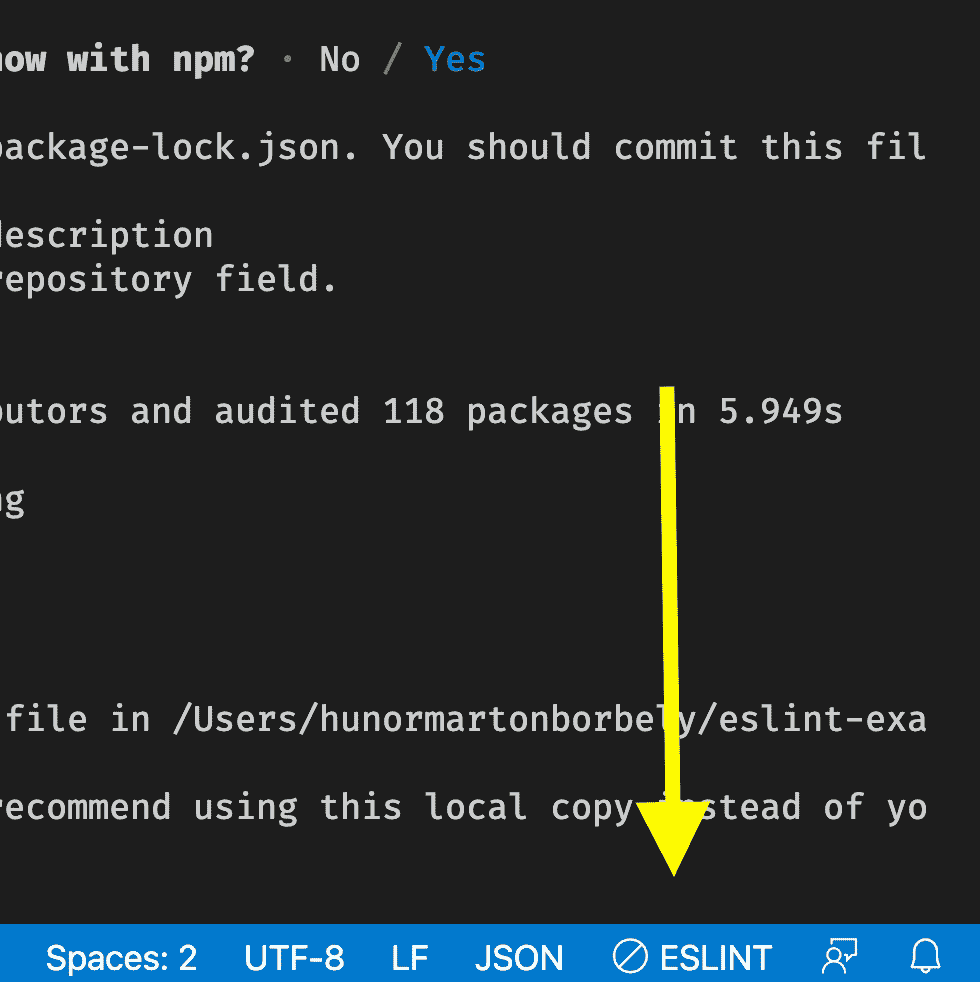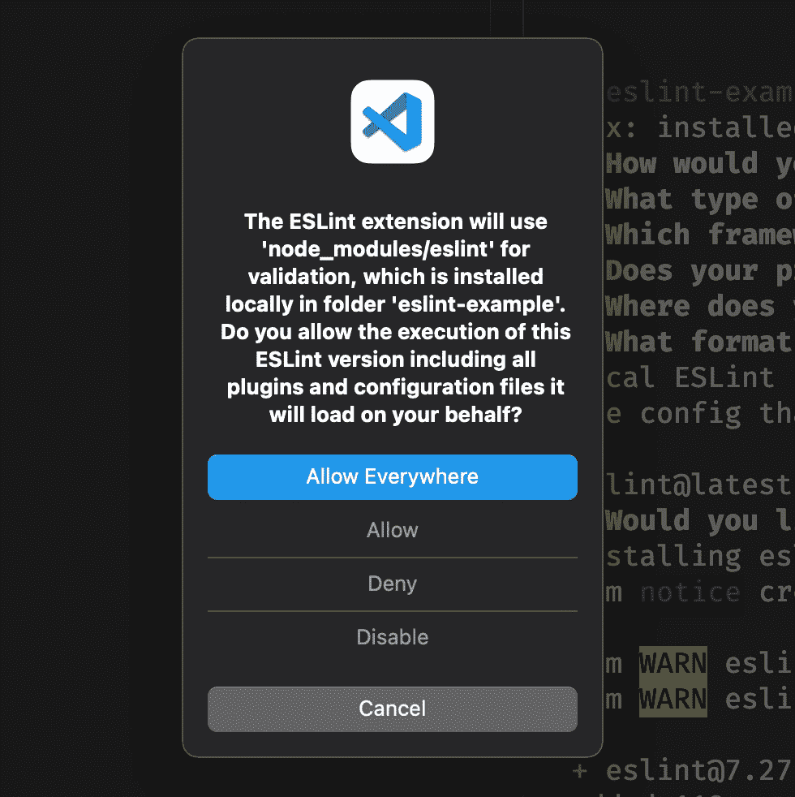

在所有这些步骤之后，ESLint 终于可以工作了。如果我们转到一个 JavaScript 文件，并试图使用一个未声明的变量，那么在保存时它会突出显示这个问题。

ESLint 也可能在实际上一切正常的地方给你错误。具有讽刺意味的是，如果您选择 ESlint 配置应该在一个 JavaScript 文件中，那么它会在配置本身中给出一个错误。

这是因为我们设置了项目的环境是浏览器，并且这个配置依赖于浏览器中不存在的全局变量。

不过，这个文件并不是我们网站的一部分。它是一个配置文件，不会成为最终源代码的一部分，它的自然环境不是浏览器，而是 Node.js。所以这个文件实际上是正确的，这里不应该有错误。

解决这个问题的一个方法是设置一个 ESLint 应该忽略的文件列表。在应用程序的根文件夹中，可以创建一个名为**的文件。eslinignore**并将 **.eslintrc.js** 添加到其中。一旦我们保存了这个文件，ESLint 将不再对配置文件进行任何检查。

ESLint 也是高度可定制的。更多细节请查看 ESLint 的[文档。](https://eslint.org/docs/user-guide/configuring/)

## 如何设置 React 或 Vue 项目

你打算用 React 或者 Vue.js 建一个网站吗？你基本上需要做同样的步骤。

使用 npm init 初始化项目，安装依赖项，设置 ESLint，然后使用 Parcel 运行您的项目。

请查看我在 YouTube 上的视频，我们在视频中回顾了之前的步骤，以及 React 和 Vue.js 的一个快速示例项目。

[https://www.youtube.com/embed/TxKz5U-uL2I?feature=oembed](https://www.youtube.com/embed/TxKz5U-uL2I?feature=oembed)

## 后续步骤

这些是你在前端 JS 项目中可以使用的基本工具。用 npm 添加库，用更漂亮的保持代码整洁，用 ESLint 避免不必要的麻烦，用 Parcel 运行项目。

现在我们已经建立了一个前端项目，你可以开始建立你的网站。

完成后会发生什么？您需要将它捆绑到可以上传到 web 的最终产品版本中。如果使用 parcel，可以使用以下命令创建最终包:

```
parcel build index.html —public-url '.'
```

这将在 dist 文件夹中创建一个可以在浏览器中运行的包。你可以在浏览器的 dist 文件夹中运行新的 index.html 文件来查看你的最终结果。

就是这样！感谢您的阅读:)

### **订阅更多 Web 开发教程:**

[Hunor Márton BorbélyGame development with JavaScript, creative coding tutorials, HTML canvas, SVG, Three.js, and some React and Vue https://twitter.com/HunorBorbelyhttps://codepen.io/HunorMarton…YouTube](https://www.youtube.com/channel/UCxhgW0Q5XLvIoXHAfQXg9oQ)