# 如何使用 Buildkite 为 Monorepo 设置持续集成

> 原文：<https://www.freecodecamp.org/news/how-to-set-up-continuous-integration-for-monorepo-using-buildkite/>

monorepo 是一个单一的存储库，在一个单一的 Git 存储库中保存所有的代码和多个项目。

这种设置非常适合使用，因为它非常灵活，能够在一个存储库中管理各种服务和前端。它还消除了跟踪多个存储库中的变更以及随着项目变更更新依赖关系的麻烦。

另一方面，monorepos 也带来了挑战，特别是在持续集成方面。当 monorepo 中的单个子项目发生变化时，我们需要确定哪些子项目发生了变化，以构建和部署它们。

这篇文章将逐步指导你:

1.  在 Bulidkite 中为 monorepos 配置持续集成。
2.  使用自动伸缩将 Buildkite 代理部署到 AWS EC2 实例。
3.  配置 GitHub 以触发 Bulidkite CI 管道。
4.  配置 Buildkite，以便在 monorepo 中的子项目发生变化时触发适当的管道。
5.  使用 bash 脚本自动完成以上所有工作。

### 先决条件

1.  [**AWS**](https://aws.amazon.com/free/) 账号部署 Buildkite 代理。
2.  配置 [**AWS CLI**](https://docs.aws.amazon.com/cli/latest/userguide/cli-chap-configure.html) 与 AWS 账户对话。
3.  [**Buildkite**](https://buildkite.com/) 账号创建持续集成管道。
4.  [**GitHub**](https://github.com/) 账号托管 monorepo 源代码。

完整的源代码可以在 GitHub 的[**build kite-mono repo**](https://github.com/adikari/buildkite-monorepo)中找到。

## 项目设置

Buildkite 工作流由[管道](https://buildkite.com/docs/pipelines)和步骤组成。用于建模和定义工作流的顶级容器称为管道。步骤运行单个任务或命令。

下图列出了我们正在设置的管道、它们的相关触发器以及管道运行的每个步骤。


### 拉式请求工作流

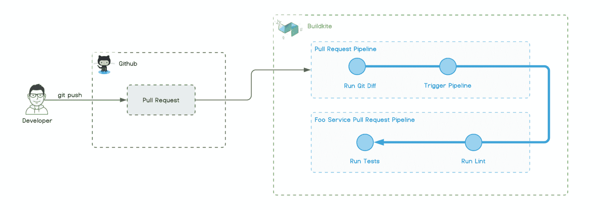

上图显示了拉请求管道的工作流。

在 GitHub 中创建新的 Pull 请求会触发 Buildkite 中的`pull-request`管道。这个管道然后运行`git diff`来识别 monorepo 中的哪些文件夹(项目)已经改变。

如果它检测到变化，那么它将动态地触发为该项目定义的适当的拉请求管道。Buildkite 向 [GitHub 状态检查报告每个管道的状态。](https://docs.github.com/en/free-pro-team@latest/github/collaborating-with-issues-and-pull-requests/about-status-checks)

### 合并工作流

当 Github 中的所有状态检查都通过时，Pull 请求被合并。合并拉请求会触发 Buildkite 中的`merge`管道。

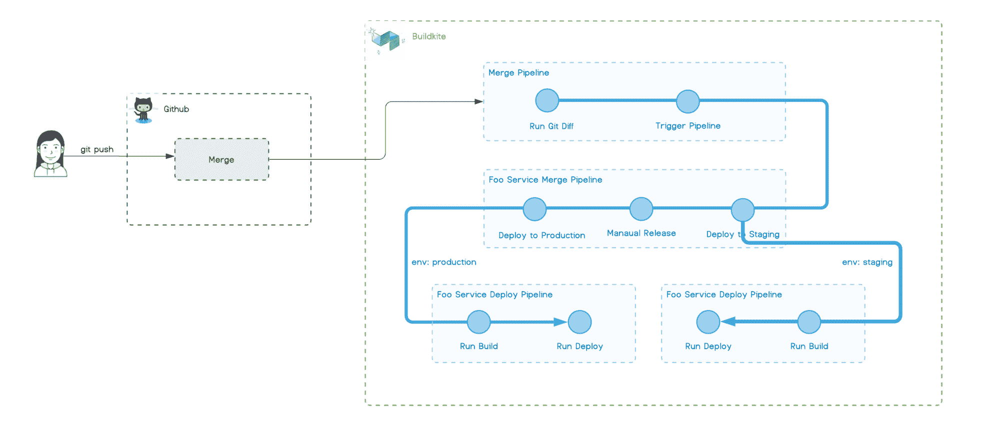

与前面的管道类似，合并管道识别已经改变的项目，并为其触发相应的`deploy`管道。部署管道最初将更改部署到登台环境中。

一旦部署到暂存完成，生产部署将被手动发布。

### 最终项目结构

∞∞。building kite□□□□□□□□□□□□□□□□□□□□□□□□□□□□□□□□□□□□□□□□□□□□□□□□□□□□□□□□□□□□□□□□□□□□□□□□□□□□□□□□□□□□□□□building kite□T9□□□□□□□□□□□□□□□□□□□□□□□□□□□□□□□□□□□□□□□□□□□□□□□□□□□□□□□□□□□□□□□□□□□□□□□□□□□□□□□□□□□□□building kite
deploy . yml
【merge . yml】
【pull-request . yml】
bin
deploy

### 设置项目

创建一个新的 Git 项目，并将其推送到 GitHub。在 CLI 中运行以下命令。

```
mkdir buildkite-monorepo-example
cd buildkite-monorepo-example
git init
echo node_modules/ > .gitignore
git add .
git commit -m "initialize repository"
git remote add origin <YOUR_GITHUB_REPO_URL>
git push origin master
```

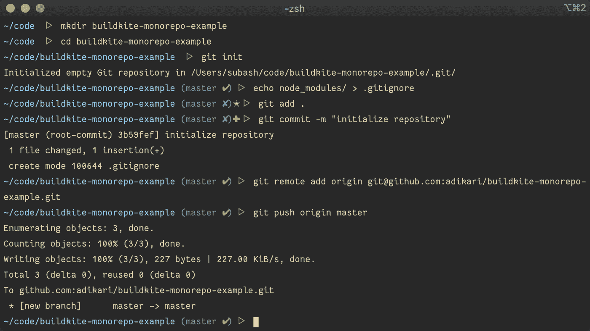

### 设置 Buildkite 基础设施

1.  创建一个 bin 目录，其中包含一些可执行脚本。

```
mkdir bin 
cd bin
touch create-pipeline create-secrets-bucket deploy-ci-stack
chmod +x ./*
```

2.将以下内容复制到`create-secrets-bucket`中。

```
#!/bin/bash

set -eou pipefail

CURRENT_DIR=$(pwd)
ROOT_DIR="$( dirname "${BASH_SOURCE[0]}" )"/..

BUCKET_NAME="buildkite-secrets-adikari"
KEY="id_rsa_buildkite"

echo "creating bucket $BUCKET_NAME.."
aws s3 mb s3://$BUCKET_NAME

# Generate SSH Key
ssh-keygen -t rsa -b 4096 -f $KEY -N ''

# Copy SSH Keys to S3 bucket
aws s3 cp --acl private --sse aws:kms $KEY "s3://$BUCKET_NAME/private_ssh_key"
aws s3 cp --acl private --sse aws:kms $KEY.pub "s3://$BUCKET_NAME/public_key.pub"

if [[ "$OSTYPE" == "darwin"* ]]; then
  pbcopy < id_rsa_buildkite.pub
  echo "public key contents copied in clipboard."
else
  cat id_rsa_buildkite.pub
fi

# Move SSH Keys to ~/.ssh directory
mv ./$KEY* ~/.ssh
chmod 600 ~/.ssh/$KEY
chmod 644 ~/.ssh/$KEY.pub

cd $CURRENT_DIR
```

上面的脚本创建了一个用于存储 ssh 密钥的 S3 存储桶。Buildkite 使用这个键连接到 Github repo。该脚本还生成一个 ssh 密钥，并正确设置其权限。

### 运行脚本

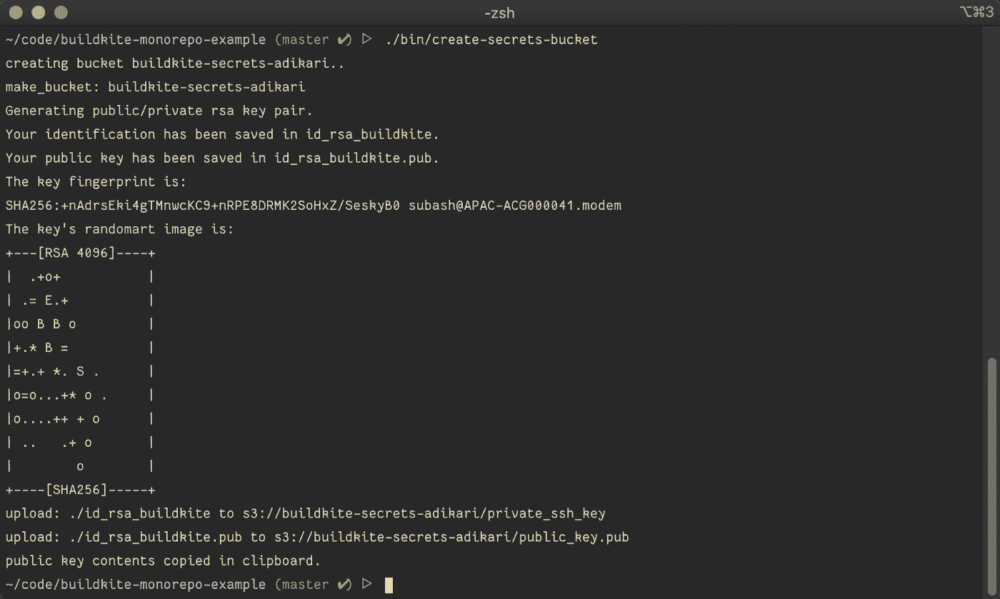

该脚本将生成的公钥和私钥复制到`~/.ssh`文件夹中。稍后可以使用这些键 ssh 到 EC2 实例，运行 Buildkite 代理进行调试。

接下来，验证存储桶是否存在，以及新的 S3 存储桶中是否存在密钥。


导航到[https://github.com/settings/keys](https://github.com/settings/keys)，添加一个新的 SSH 密钥，然后粘贴`id_rsa_buildkite.pub`的内容。

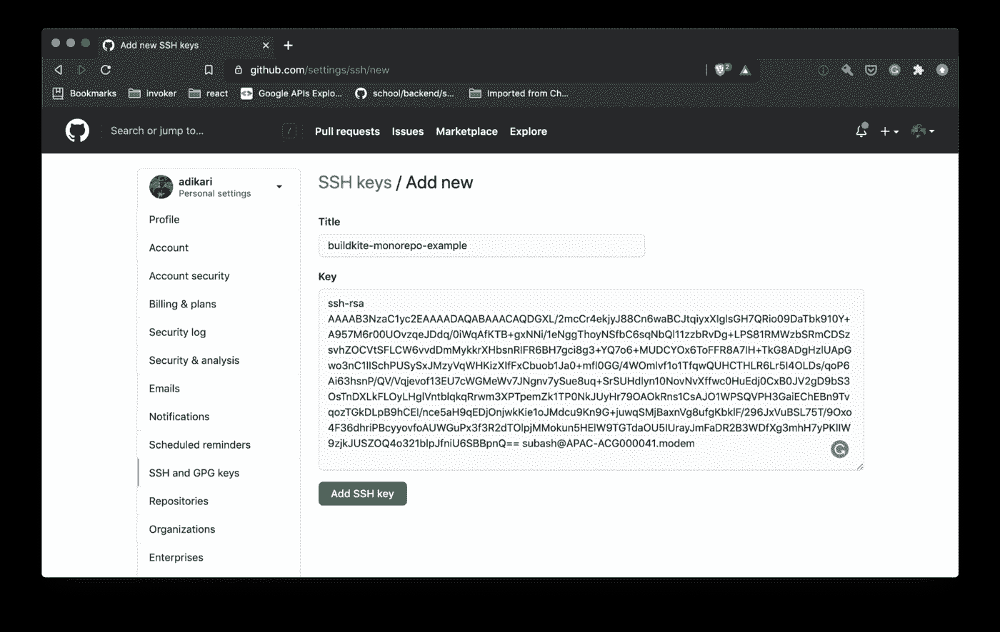

### 部署 AWS 弹性 CI 云架构堆栈

Buildkite 的人已经为 AWS**创建了 [**弹性 CI 堆栈，这在 AWS 中创建了一个私有的、自动伸缩的 Buildkite 代理集群。让我们将基础设施部署到我们的 AWS 帐户。**](https://github.com/buildkite/elastic-ci-stack-for-aws)**

**创建一个新文件`bin/deploy-ci-stack`，并将以下脚本的内容复制到其中。**

```
`#!/bin/bash

set -euo pipefail

[ -z $BUILDKITE_AGENT_TOKEN ] && { echo "BUILDKITE_AGENT_TOKEN is not set."; exit 1;}

CURRENT_DIR=$(pwd)
ROOT_DIR="$( dirname "${BASH_SOURCE[0]}" )"/..
PARAMETERS=$(cat ./bin/stack-config | envsubst)

cd $ROOT_DIR

echo "downloading elastic ci stack template.."
curl -s https://s3.amazonaws.com/buildkite-aws-stack/latest/aws-stack.yml -O

aws cloudformation deploy \
  --capabilities CAPABILITY_NAMED_IAM \
  --template-file ./aws-stack.yml \
  --stack-name "buildkite-elastic-ci" \
  --parameter-overrides $PARAMETERS

rm -f aws-stack.yml

cd $CURRENT_DIR`
```

**你可以从 Buildkite 控制台的**代理**标签中获得`BUILDKITE_AGENT_TOKEN`。**

**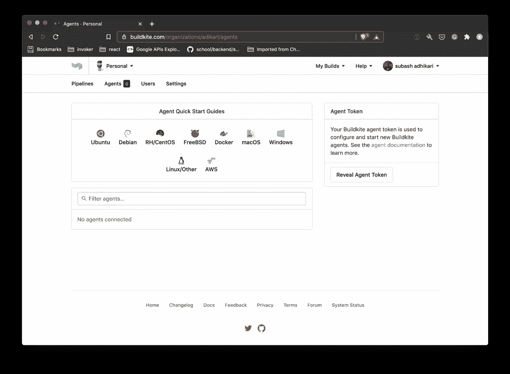**

**接下来，创建一个名为`bin/stack-config`的新文件。该文件中的配置会覆盖 Cloudformation 参数。弹性 CI 使用的 [Cloudformation 模板](https://s3.amazonaws.com/buildkite-aws-stack/latest/aws-stack.yml)中提供了完整的参数列表。**

**在第 2 行，用之前创建的存储桶替换存储桶名称。**

```
`BuildkiteAgentToken=$BUILDKITE_AGENT_TOKEN
SecretsBucket=buildkite-secrets-adikari
InstanceType=t2.micro
MinSize=0
MaxSize=3
ScaleUpAdjustment=2
ScaleDownAdjustment=-1`
```

**接下来，在 CLI 中运行脚本来部署 Cloudformation 堆栈。**

```
`./bin/deploy-ci-stack`
```

**脚本需要一些时间来完成。打开 AWS Cloudformation 控制台查看进度。**

******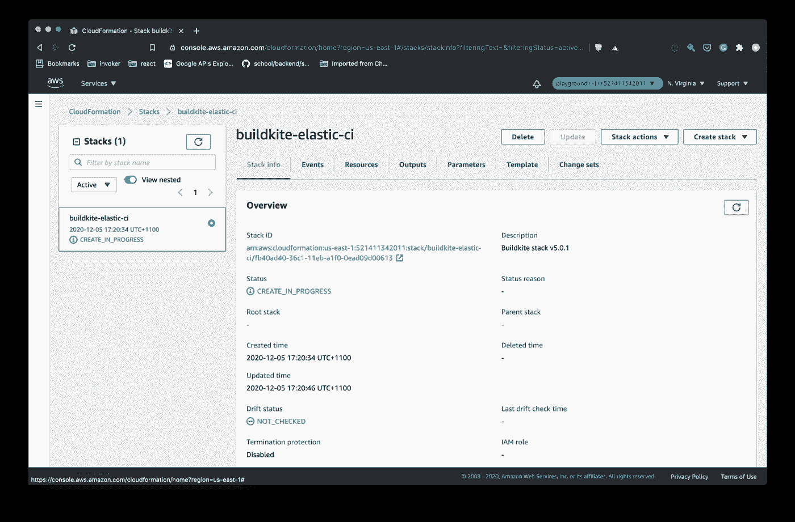**

**Cloudformation 堆栈将创建一个自动缩放组，Buildkite 将使用它来生成 EC2 实例。Buildkite 代理和构建在那些 EC2 实例中运行。**

**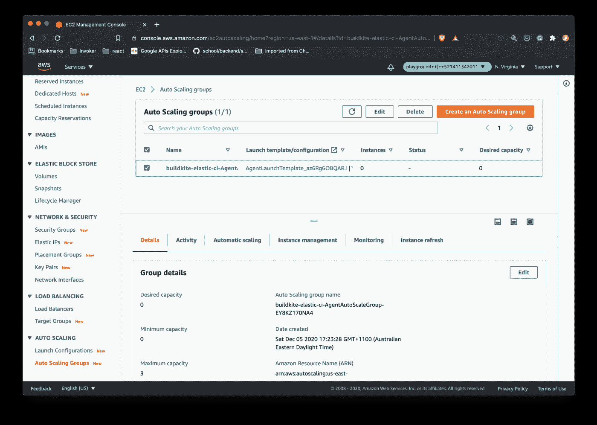**

### **在 Bulidkite 中创建构建管道**

**此时，我们已经准备好了运行 Buildkite 所需的基础设施。接下来，我们配置 Buildkite 并创建一些管道。**

**在[https://buildkite.com/user/api-access-tokens](https://buildkite.com/user/api-access-tokens)创建一个皮娜访问令牌，并将范围设置为`write_builds`、`read_pipelines`和`write_pipelines`。关于代理令牌的更多信息在此[文档](https://buildkite.com/docs/agent/v3/tokens)中。**

**确保`BUILDKITE_API_TOKEN`设置在环境上。要么使用 [dotenv](https://www.npmjs.com/package/dotenv) ，要么在运行脚本之前将其导出到环境中。**

**将以下脚本的内容复制到`bin/create-pipeline`。可以在 Buildkite 控制台中手动创建管道，但是自动化和创建可复制的基础设施总是更好。**

```
`#!/bin/bash

set -euo pipefail

export SERVICE="."
export PIPELINE_TYPE=""
export REPOSITORY=git@github.com:adikari/buildkite-docker-example.git

CURRENT_DIR=$(pwd)
ROOT_DIR="$( dirname "${BASH_SOURCE[0]}" )"/..
STATUS_CHECK=false
BUILDKITE_ORG_SLUG=adikari # update to your buildkite org slug

USAGE="USAGE: $(basename "$0") [-s|--service] service_name [-t|--type] pipeline_type
Eg: create-pipeline --type pull-request
    create-pipeline --type merge --service foo-service
    create-pipeline --type merge --status-checks
NOTE: BUILDKITE_API_TOKEN must be set in environment
ARGUMENTS:
    -t | --type           buildkite pipeline type <merge|pull-request|deploy> (required)
    -s | --service        service name (optional, default: deploy root pipeline)
    -r | --repository     github repository url (optional, default: buildkite-docker-example)
    -c | --status-checks      enable github status checks (optional, default: true)
    -h | --help           show this help text"

[ -z $BUILDKITE_API_TOKEN ] && { echo "BUILDKITE_API_TOKEN is not set."; exit 1;}

while [ $# -gt 0 ]; do
    if [[ $1 =~ "--"* ]]; then
        case $1 in
            --help|-h) echo "$USAGE"; exit; ;;
            --service|-s) SERVICE=$2;;
            --type|-t) PIPELINE_TYPE=$2;;
            --repository|-r) REPOSITORY=$2;;
            --status-check|-c) STATUS_CHECK=${2:-true};;
        esac
    fi
    shift
done

[ -z "$PIPELINE_TYPE" ] && { echo "$USAGE"; exit 1; }

export PIPELINE_NAME=$([ $SERVICE == "." ] && echo "" || echo "$SERVICE-")$PIPELINE_TYPE

BUILDKITE_CONFIG_FILE=.buildkite/pipelines/$PIPELINE_TYPE.json
[ ! -f "$BUILDKITE_CONFIG_FILE" ] && { echo "Invalid pipeline type: File not found $BUILDKITE_CONFIG_FILE"; exit; }

BUILDKITE_CONFIG=$(cat $BUILDKITE_CONFIG_FILE | envsubst)

if [ $STATUS_CHECK == "false" ]; then
  pipeline_settings='{ "provider_settings": { "trigger_mode": "none" } }'
  BUILDKITE_CONFIG=$((echo $BUILDKITE_CONFIG; echo $pipeline_settings) | jq -s add)
fi
cd $ROOT_DIR
echo "Creating $PIPELINE_TYPE pipeline.."
RESPONSE=$(curl -s POST "https://api.buildkite.com/v2/organizations/$BUILDKITE_ORG_SLUG/pipelines" \
  -H "Authorization: Bearer $BUILDKITE_API_TOKEN" \
  -d "$BUILDKITE_CONFIG"
)
[[ "$RESPONSE" == *errors* ]] && { echo $RESPONSE | jq; exit 1; }
echo $RESPONSE | jq
WEB_URL=$(echo $RESPONSE | jq -r '.web_url')
WEBHOOK_URL=$(echo $RESPONSE | jq -r '.provider.webhook_url')
echo "Pipeline url: $WEB_URL"
echo "Webhook url: $WEBHOOK_URL"
echo "$PIPELINE_NAME pipeline created."
cd $CURRENT_DIR
unset REPOSITORY
unset PIPELINE_TYPE
unset SERVICE
unset PIPELINE_NAME`
```

**通过设置正确的权限(chmod +x)使脚本可执行。在 CLI 中运行`./bin/create-pipeline -h`获得帮助。**

**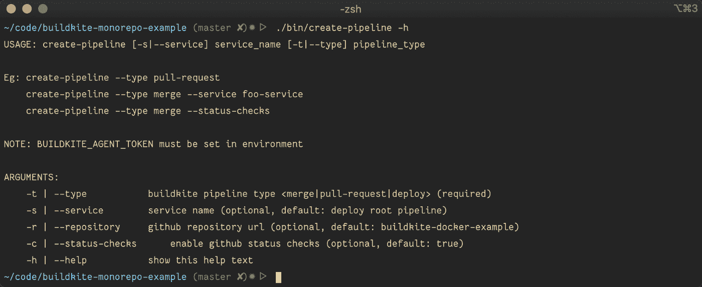**

**该脚本使用 [Buildkite REST API](https://buildkite.com/docs/apis/rest-api) 来创建具有给定配置的管道。该脚本使用定义为`json`文档的管道配置，并将其发布到 REST API。管道配置位于`.bulidkite/pipelines`文件夹中。**

**要定义`pull-request`管道的配置，创建包含以下内容的`.buildkite/pipelines/pull-request.json`:**

```
`{
  "name": "$PIPELINE_NAME",
  "description": "Pipeline for $PIPELINE_NAME pull requests",
  "repository": "$REPOSITORY",
  "default_branch": "",
  "steps": [
    {
      "type": "script",
      "name": ":buildkite: $PIPELINE_TYPE",
      "command": "buildkite-agent pipeline upload $SERVICE/.buildkite/$PIPELINE_TYPE.yml"
    }
  ],
  "cancel_running_branch_builds": true,
  "skip_queued_branch_builds": true,
  "branch_configuration": "!master",
  "provider_settings": {
    "trigger_mode": "code",
    "publish_commit_status_per_step": true,
    "publish_blocked_as_pending": true,
    "pull_request_branch_filter_enabled": true,
    "pull_request_branch_filter_configuration": "!master",
    "separate_pull_request_statuses": true
  }
}`
```

**接下来，用以下内容创建`./buildkite/pipelines/merge.json`:**

```
`{
  "name": "$PIPELINE_NAME",
  "description": "Pipeline for $PIPELINE_NAME merge",
  "repository": "$REPOSITORY",
  "default_branch": "master",
  "steps": [
    {
      "type": "script",
      "name": ":buildkite: $PIPELINE_TYPE",
      "command": "buildkite-agent pipeline upload $SERVICE/.buildkite/$PIPELINE_TYPE.yml"
    }
  ],
  "cancel_running_branch_builds": true,
  "skip_queued_branch_builds": true,
  "branch_configuration": "master",
  "provider_settings": {
    "trigger_mode": "code",
    "build_pull_requests": false,
    "publish_blocked_as_pending": true,
    "publish_commit_status_per_step": true
  }
}`
```

**最后，用以下内容创建`.buildkite/pipelines/deploy.yml`:**

```
`{
  "name": "$PIPELINE_NAME",
  "description": "Pipeline for $PIPELINE_NAME deploy",
  "repository": "$REPOSITORY",
  "default_branch": "master",
  "steps": [
    {
      "type": "script",
      "name": ":buildkite: $PIPELINE_TYPE",
      "command": "buildkite-agent pipeline upload $SERVICE/.buildkite/$PIPELINE_TYPE.yml"
    }
  ],
  "provider_settings": {
    "trigger_mode": "none"
  }
}`
```

**现在，运行`./bin/create-pipeline`命令来创建一个拉请求管道。**

```
`./bin/create-pipeline --type pull-request --status-checks
./bin/create-pipeline --type merge --status-checks`
```

****

**从控制台输出中复制`Webhook url`并在 GitHub 中创建一个 webhook 集成。如果将来需要，可以在 Buildkite 控制台的管道设置中找到 webhook URL。**

**我们只需要为`pull-request`和`merge`管道配置 webhook。所有其他管道都是动态触发的。**

**导航到 GitHub 库`Settings > Webhooks`并添加一个 webhook。选择`Just the push event`，然后添加 webhook。对两条管线重复此操作。**

**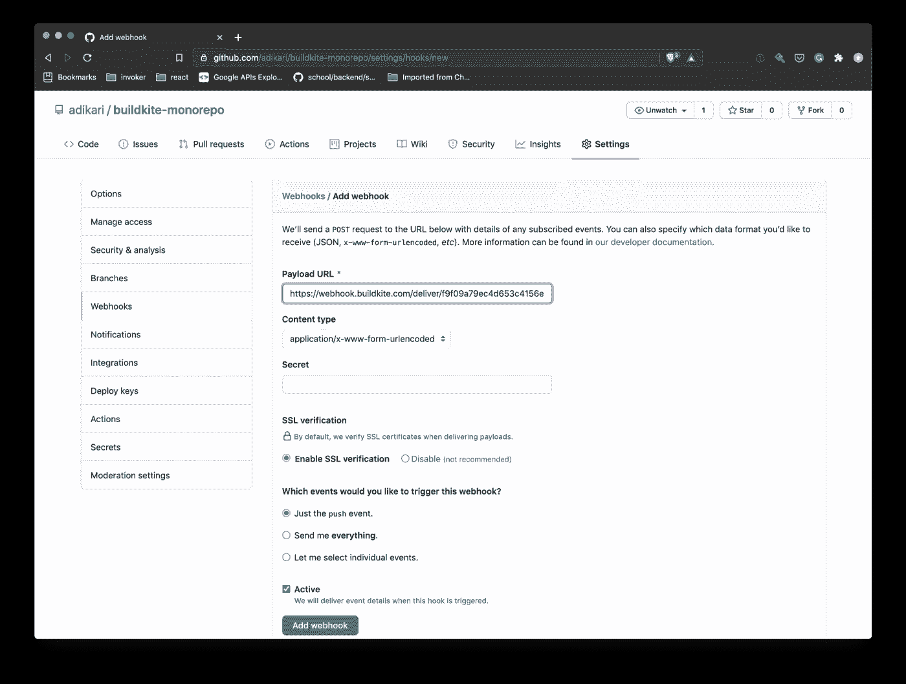**

**现在，在 Buildkite 控制台中，应该有两条新创建的管道。🎉**

****

**接下来，添加 GitHub 集成，允许 Buildkite 向 GitHub 发送状态更新。您只需为每个帐户设置一次集成。它位于 Buildkite 控制台的`Setting > Integrations > Github`处。**

**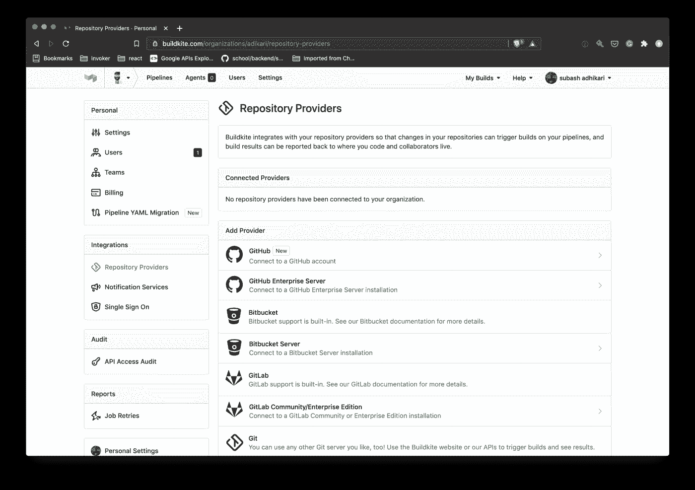**

**接下来，创建剩余的管道。这些管道将由`pull-request`和`merge`管道动态触发，因此我们不需要创建 GitHub 集成。**

```
`# foo service pipelines
./bin/create-pipeline --type pull-request --service foo-service
./bin/create-pipeline --type merge --service foo-service
./bin/create-pipeline --type deploy --service foo-service

# bar service pipelines
./bin/create-pipeline --type pull-request --service bar-service
./bin/create-pipeline --type merge --service bar-service
./bin/create-pipeline --type deploy --service bar-service`
```

**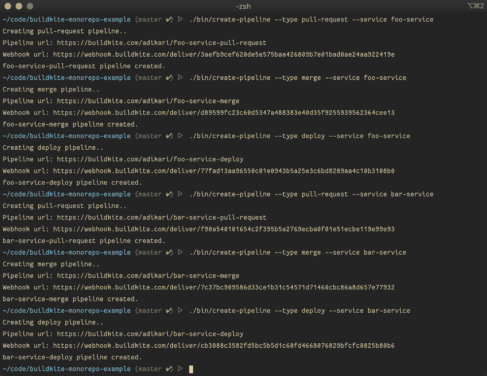**

**Buildkite 控制台现在应该列出了所有的管道。🥳**

**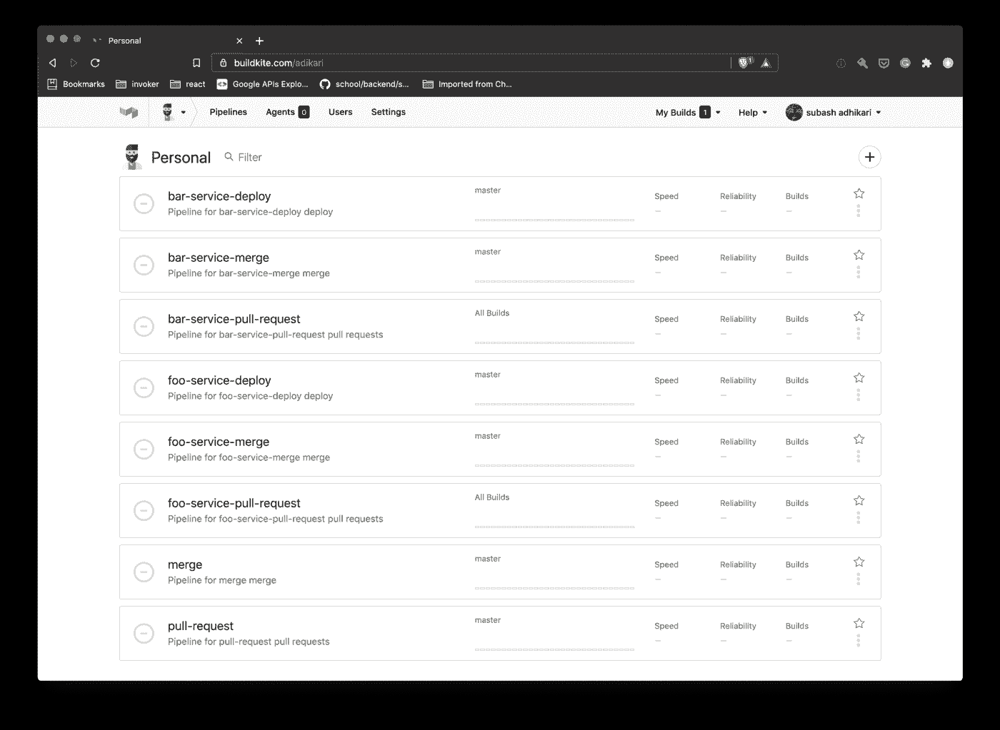**

### **设置构建风筝的步骤**

**现在管道已经准备好了，让我们为每个管道配置要运行的步骤。**

**在`.buildkite/diff`中添加以下脚本。该脚本区分针对主分支的提交中更改的所有文件。脚本的输出用于动态触发相应的管道。**

```
`#!/bin/bash

[ $# -lt 1 ] && { echo "argument is missing."; exit 1; }

COMMIT=$1

BRANCH_POINT_COMMIT=$(git merge-base master $COMMIT)

echo "diff between $COMMIT and $BRANCH_POINT_COMMIT"
git --no-pager diff --name-only $COMMIT..$BRANCH_POINT_COMMIT`
```

**更改脚本的权限，使其可执行。**

```
`chmod +x .buildkite/diff`
```

**创建一个新文件`.buildkite/pullrequest.yml`并添加以下步骤配置。我们使用 [buildkite-monorepo-diff](https://github.com/chronotc/monorepo-diff-buildkite-plugin) 插件来运行`diff`脚本，并自动上传和触发各自的管道。**

```
`steps:
  - label: "Triggering pull request pipeline"
    plugins:
      chronotc/monorepo-diff#v1.1.1:
        diff: ".buildkite/diff ${BUILDKITE_COMMIT}"
        wait: false
        watch:
          - path: "foo-service"
            config:
              trigger: "foo-service-pull-request"
          - path: "bar-service"
            config:
              trigger: "bar-service-pull-request"`
```

**现在，通过在`.buildkite/merge.yml`中添加以下内容来创建合并管道的配置。**

```
`steps:
  - label: "Triggering merge pipeline"
    plugins:
      chronotc/monorepo-diff#v1.1.1:
        diff: "git diff --name-only HEAD~1"
        wait: false
        watch:
          - path: "foo-service"
            config:
              trigger: "foo-service-merge"
          - path: "bar-service"
            config:
              trigger: "bar-service-merge"`
```

**此时，我们已经配置了最顶层的`pull-request`和`merge`管道。现在我们需要为每个服务配置单独的管道。**

**我们将首先为`foo-service`配置管道。用以下内容创建`foo-service/.buildkite/pull-request.yml`。当 foo 服务的`pull-request`管道运行时，指定`lint`和`test`命令应该运行。`command`选项也可以触发其他脚本。**

```
`steps:
  - label: "Foo service pull request"
    command:
      - "echo linting"
      - "echo testing"`
```

**接下来，通过在`foo-service/.buildkite/merge.yml`中添加以下内容，为 foo 服务设置一个合并管道:**

```
`steps:
  - label: "Run sanity checks"
    command:
      - "echo linting"
      - "echo testing"

  - label: "Deploy to staging"
    trigger: "foo-deploy"
    build:
      env:
        STAGE: "staging"

  - wait

  - block: ":rocket: Release to Production"

  - label: "Deploy to production"
    trigger: "foo-deploy"
    build:
      env:
        STAGE: "production"`
```

**当`foo-service-merge`管道运行时，会发生以下情况:**

1.  **管道运行健全性检查。**
2.  **然后`foo-deploy`流水线被动态触发。我们通过`STAGE`环境来识别运行部署的环境。**
3.  **一旦部署到登台完成，管道将被阻塞，并且不会自动触发后续管道。按下“发布到生产”按钮，可以恢复流水线。**
4.  **解除管道阻塞将再次触发`foo-deploy`管道，但这一次使用`production`阶段。**

**最后，通过添加`foo-service/.buildkite/deploy.yml`为`foo-deploy`管道添加配置。在部署配置中，我们触发一个 bash 脚本并传递从`foo-service-merge`管道接收的`STAGE`变量。**

```
`steps:
  - label: "Deploying foo service to ${STAGE}"
    command: "./foo-service/bin/deploy ${STAGE}"`
```

**现在，创建部署脚本`foo-service/bin/deploy`并添加以下内容:**

```
`#!/bin/bash

set -euo pipefail

STAGE=$1

echo "Deploying foo service to $STAGE"`
```

**使部署脚本像这样可执行:**

```
`chmod +x ./foo-service/bin/deploy`
```

**`foo-service`的管道和步骤配置现已完成。重复以上所有步骤，为`bar service`配置管道。**

### **测试整体工作流程**

**我们已经配置了 Buildkite 和 GitHub，并且建立了适当的基础设施来运行构建。接下来，测试整个工作流并观察它的运行。**

**为了测试工作流，首先创建一个新的分支，并在`foo-service`中修改一些文件。将更改推送到 GitHub 并创建一个拉请求。**

```
`git checkout -b change-foo-service
cd foo-service && touch test.txt
echo testing >> test.txt
git add .
git commit -m 'making some change'
git push origin master`
```

**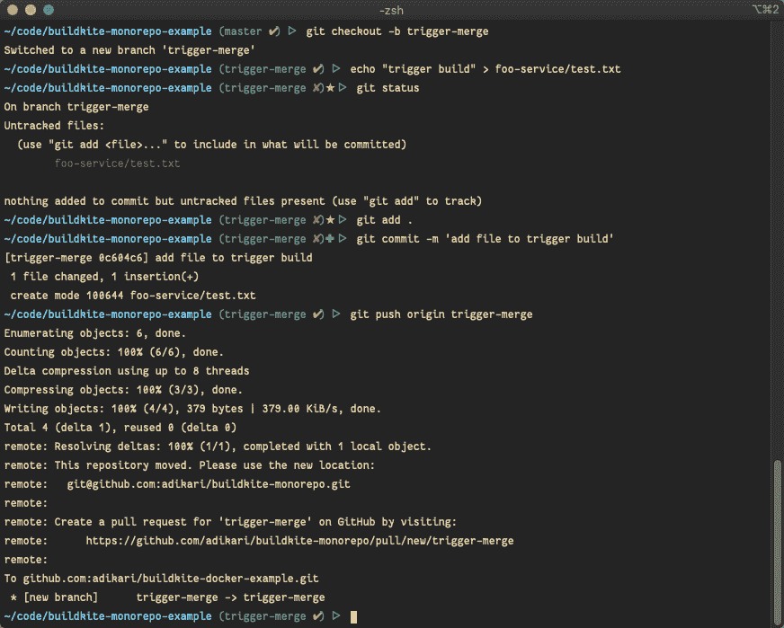**

**将更改推送到 GitHub 应该会触发 Buildkite 中的`pull-request`管道，然后 build kite 会触发`foo-service-pull-request`管道。**

**GitHub 应该在 GitHub 检查中报告状态。您可以启用 GitHub 的分支保护，要求在合并 Pull 请求之前通过检查。**

**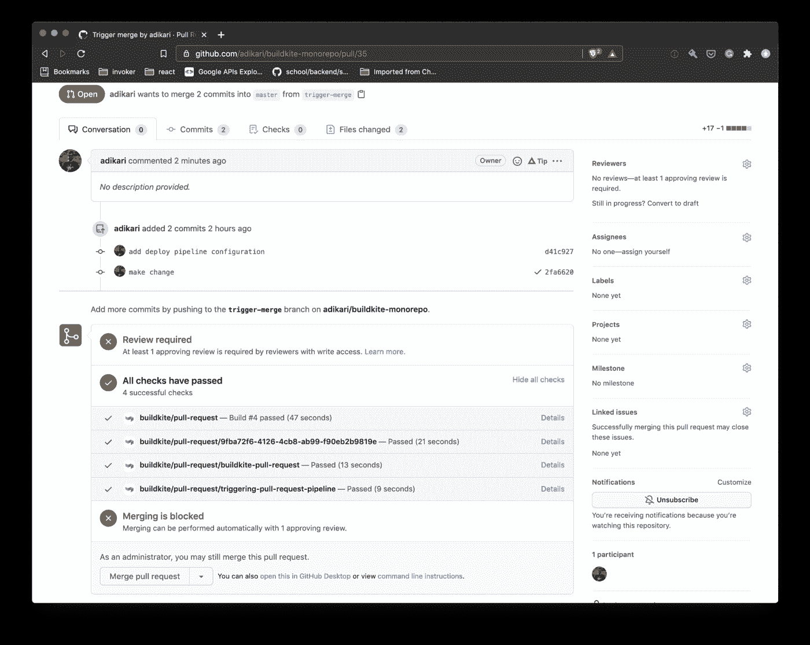**

**一旦 GitHub 中的所有检查都通过了，就合并 Pull 请求。这个合并将触发 Buildkite 中的`merge`管道。**

**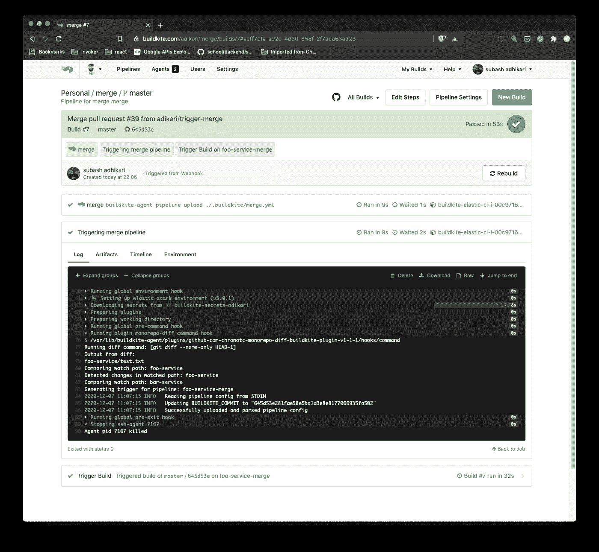**

**foo 服务中的变化被检测到，并且`foo-service-merge`流水线被触发。当`foo-service-deploy`在登台环境中运行时，管道最终会被阻塞。**

**通过手动点击`Release to Production`按钮来打开管道，以针对生产运行部署。**

**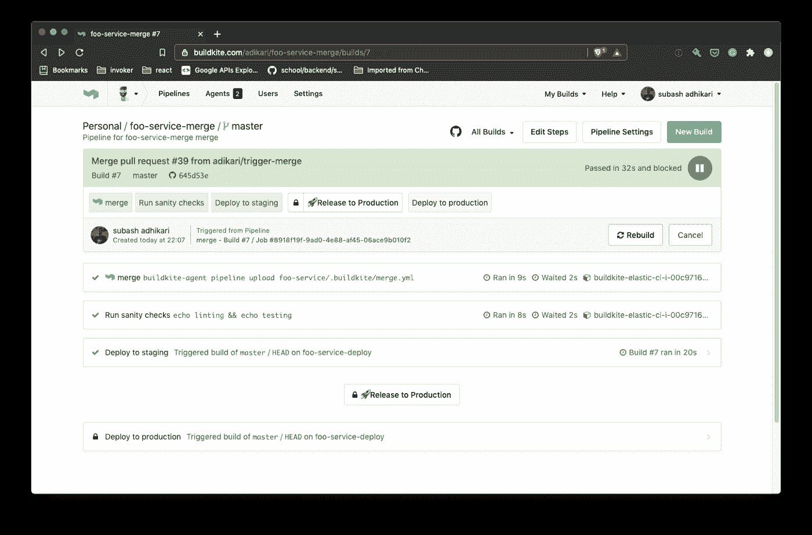**

## **摘要**

**在本文中，我们使用 Buildkite、Github 和 AWS 为 monorepo 建立了一个持续集成管道。**

**管道将我们的代码从开发机器转移到登台，然后转移到生产。构建代理和步骤在自动缩放的 AWS EC2 实例中运行。**

**我们还创建了一系列 bash 脚本来创建这种设置的易于复制的版本。**

**作为对当前设计的改进，考虑使用[build kite-docker-compose-plugin](https://github.com/buildkite-plugins/docker-compose-buildkite-plugin)来隔离 Docker 容器中的构建。**

***在* [*Twitter*](https://twitter.com/adikari) *上关注我，或者在*[*Github*](https://github.com/adikari)*上查看我的项目。***