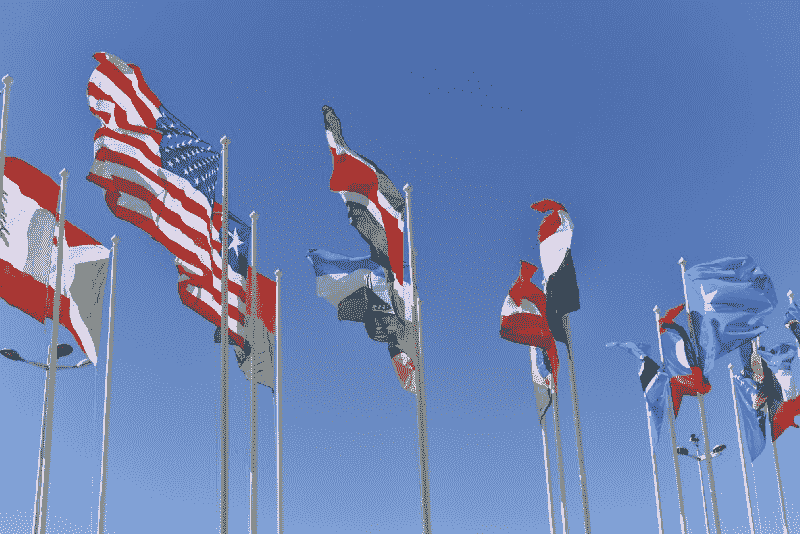

# 如何使用 Globalize 在数据库中存储翻译

> 原文：<https://www.freecodecamp.org/news/how-to-store-translations-inside-a-database-with-globalize-63cd033e29e6/>

安娜斯塔西娅

# 如何使用 Globalize 在数据库中存储翻译



Photo by [Vladislav Klapin](https://unsplash.com/photos/YeO44yVTl20?utm_source=unsplash&utm_medium=referral&utm_content=creditCopyText) on [Unsplash](https://unsplash.com/search/photos/international?utm_source=unsplash&utm_medium=referral&utm_content=creditCopyText)

在我之前的一篇文章中，我谈到了国际化 Rails 应用程序的过程。那篇文章解释了所有的 [I18n](https://guides.rubyonrails.org/i18n.html) 基础知识，但是它围绕着把所有的翻译放在 YAML 文件中。这种方法没有错，但不幸的是，它并不总是有效。

假设你的网站有很多用户生成的内容，这些内容应该适应不同的语言。我建议你把你的翻译储存在数据库里。为什么 YAML 文件在这种情况下不起作用？

*   内容本身可能相当大，将其存储在文件中不方便
*   内容是动态的，用户应该能够自己创建翻译版本，无需网站开发者的帮助

I18n 模块[似乎允许您定义一个定制的后端](https://guides.rubyonrails.org/i18n.html#using-different-backends)，例如，它可能由 ActiveRecord 提供支持。幸运的是，没有必要精心设计自己的解决方案，因为已经有一个现成的方案:[全球化](https://github.com/globalize/globalize)。Globalize 是一个久经考验的库，被称为“Rails I18n 活动记录模型/数据转换的事实上的标准库”在它的帮助下，您可以轻松地翻译模型属性，确定它们的范围，引入回退，等等。

因此，在本文中，我们将讨论全球化，并通过创建一个示例 Rails 应用程序来了解它的实际应用。我们可以开始了吗？

### 准备应用程序

让我们从生成一个新的 Rails 应用程序开始:

```
rails new GlobalizeSample
```

我将假设您在这个演示中使用的是 *Rails 5.2.1* ,但是所描述的概念仍然适用于早期版本。

假设我们正在建立一个展示各种产品的国际网上商店。这些产品将由管理员添加，因此我们无法知道游戏之前的内容。这意味着使用 YAML 文件存储翻译的传统方法行不通了。我们的内容经理只能访问 CMS，我们不想让他们访问应用程序的源代码(想想就不寒而栗！).

但是，不用担心，在下一节中，我们将轻松地克服这个问题。然而，现在，让我们先处理好基本问题。

### 管理产品

利用代码生成器为`Product`创建一个新的脚手架:

```
rails g scaffold Product title:string description:text
```

这应该为产品创建一个模型、控制器、路线和视图。不要忘记运行迁移:

```
rails db:migrate
```

现在启动服务器:

```
rails s
```

访问`http://localhost:3000/products`路径，确保您能够添加、修改和删除产品。

### 切换语言

为了看到 Globalize 库的运行，我们需要一种方法来切换应用程序的语言环境。我不会详细介绍这个过程(因为我们有一篇关于主题的[独立文章),所以让我们快速完成它。](https://blog.lokalise.co/rails-i18n/)

首先，将支持的语言环境列表添加到`config/application.rb`:

```
# ... config.i18n.available_locales = [:en, :ru]
```

我将支持英语和俄语，但你可以选择任何其他语言。

接下来，调整`config/routes.rb`并用范围包装产品资源。另外，当我们在这里时，添加一个根路由:

```
scope "(:locale)", locale: /#{I18n.available_locales.join("|")}/ do # <== add this resources :products root 'products#index' # <== add this end # <== add this
```

之后，修改`application_controller.rb`文件:

```
# ... before_action :set_locale private def set_locale I18n.locale = extract_locale || I18n.default_locale end def extract_locale parsed_locale = params[:locale] I18n.available_locales.map(&:to_s).include?(parsed_locale) ? parsed_locale : nil end def default_url_options { locale: I18n.locale } end
```

这段代码将为每个请求设置语言环境，同时确保所选择的语言确实受到支持。此外，它还会向用`link_to`助手生成的每个链接添加一个`locale` GET 参数。

最后，向应用程序布局添加两个链接:

```
<!-- views/layouts/application.html.erb --> <ul> <li><%= link_to 'English', root_path(locale: :en) %></li> <li><%= link_to 'Русский', root_path(locale: :ru) %></li> </ul>
```

为确保这一新功能正常工作，请为产品页面标题添加翻译:

```
# config/locales/en.yml en: products: index: title: Our Products
```

```
# config/locales/ru.yml ru: products: index: title: Наши продукты
```

现在只需利用`views/products/index.html.erb`中的这些翻译:

```
<!-- ... --> <h1><%= t '.title' %></h1> <!-- ... -->
```

注意，我们可以利用“懒惰查找”，因为转换键以正确的方式命名。

根据需要翻译其他静态内容，然后重新加载服务器，并确保可以正确切换语言环境。太好了！

### 全球化，努力全球化吧！

#### 定义翻译属性

好了，基础工作完成了，我们可以进行下一部分了。在全球化进入游戏之前，它应该被添加到`Gemfile`:

```
# ... gem 'globalize', git: 'https://github.com/globalize/globalize'
```

在写这篇文章的时候，稳定版还不兼容 Rails 5.2，所以我们必须直接从`master`分支安装。另请注意，最新的稳定版不支持 ActiveRecord 4.1 及以下版本，因此[请参考文档](https://github.com/globalize/globalize#installation)以了解哪个 Globalize 版本可用于旧版本的 AR。

接下来，您必须决定哪些模型属性将被 Globalize 翻译。我们将翻译`:title`和`:description`,因此以如下方式在模型中列出它们:

```
# models/products.rb # ... translates :title, :description
```

这将允许您根据地区将商店翻译存储在数据库中。然而，为了让它工作，您还需要创建一个特殊的*转换表*。

#### 转换表

所以，如果你正在创建一个新的模型和一个迁移，事情就像使用`create_translation_table!`方法一样简单，就像[在这里解释的](https://github.com/globalize/globalize#creating-translation-tables)。我们的案例稍微复杂一点，因为我们已经有了一个包含一些数据的`products`表。因此，需要将这些数据移动到转换表中。从生成新迁移开始:

```
rails g migration translate_products
```

现在用下面的代码充实它:

```
# db/migrate/xyz_translate_products.rb class TranslateProducts < ActiveRecord::Migration[5.2] def change reversible do |dir| # <=== 1 dir.up do Product.create_translation_table!({ # <=== 2 title: :string, # <=== 3 description: :text }, { migrate_data: true, # <=== 4 remove_source_columns: true # <=== 5 }) end dir.down do Product.drop_translation_table! migrate_data: true # <=== 6 end end end end
```

我已经指出了这段代码需要注意的主要事项:

1.  这将是一个可逆的迁移。
2.  我们正在为`Product`创建一个翻译表。
3.  仔细列出所有需要翻译的字段及其类型。回想一下，这些字段被传递给了模型内部的`translates`方法。
4.  不要忘了提供`migrate_data`选项，它应该保存您的原始数据库记录。
5.  `remove_source_columns`将确保原始列(`:title`和`:description`)将从`products`表中删除。您也可以稍后在单独的迁移中执行此步骤。
6.  这是迁移回滚时要执行的操作。数据也应该被保存。

运行迁移:

```
rails db:migrate
```

该命令完成工作后，您将看到一个新的`product_translations`表:

正如您所看到的，有一个`product_id`列建立了与产品的关系，还有一个`locale`字段表示翻译的语言。当您迁移原始数据时，它将与应用程序的默认区域设置相关联(在我们的例子中是英语)。使用`with_locale`方法覆盖此行为，例如:

```
I18n.with_locale(:ru) do Post.create_translation_table!(...) end
```

如果以后需要向表中添加更多的翻译字段，可以使用一个`add_translation_fields!`方法[，如本例](https://github.com/globalize/globalize#adding-additional-fields-to-the-translation-table)所示。此外，不要忘记在模型中定义这些新字段。

#### 试试看！

此时，Globalize 已集成到我们的应用程序中，并已准备就绪！执行以下步骤来查看它的运行情况:

*   重新加载您的服务器并尝试创建一个新产品:它的标题和描述将只针对当前设置的语言环境提供(在我的例子中是英语)。
*   切换到俄语区域设置，并确保新产品的标题和描述都缺失。
*   编辑该产品，并为该产品的俄语版本输入值。

因此，您应该看到两个翻译存储在`product_translations`表中:

干得好！

### 一些更全球化特征

#### 后退

如果 Globalize 找不到给定地区的翻译属性，会发生什么？正如我们在上一节中看到的，默认情况下，它将返回空值(实际上是`nil` s)。然而，可以启用 [I18n 回退](https://github.com/globalize/globalize#i18n-fallbacks-for-empty-translations)并显示另一个地区的属性值。要实现这一点，只需在`config/application.rb`文件中打开回退:

```
# ... config.i18n.fallbacks = true
```

现在，当翻译的属性是`nil`时，Globalize 将尝试从另一个地区加载值。要确保此功能正常工作，请重新加载服务器，创建新产品，然后切换到另一种语言。标题和描述应该回退到另一个区域设置。

如果您想在翻译值也为空(非`nil`)时使用回退，将`fallbacks_for_empty_translations`选项设置为`true`:

```
# models/product.rb # ... translates :title, :description, fallbacks_for_empty_translations: true
```

另请注意，可以通过以下方式全局定义自定义回退链:

```
# somewhere in an initializer Globalize.fallbacks = {:en => [:de, :ru]}
```

#### 范围和背景

Globalize 提供了一个名为`with_translations`的特殊模型作用域，可用于加载给定语言的翻译。在本例中，我们只加载英语地区的所有翻译:

```
Product.with_translations('en')
```

除此之外，还可以在视图中显示所需地区的翻译。为此，使用一种`with_locale`方法:

```
<% Globalize.with_locale(:en) do %> <!-- render your stuff here... --> <% end %>
```

#### 插入文字

有趣的是，Globalize 甚至支持在翻译后的属性中进行插值。它的工作方式与 YAML 翻译文件中的插值相同:

```
product.title = "Product for %{someone}" product.title someone: "John" # => "Product for John"
```

所以，这里的占位符是`%{someone}`。要提供它的值，只需将一个散列传递给适当的模型属性。真方便！

### 结论

在这一节中，我们看到了如何借助 Globalize 解决方案在数据库中存储翻译。我们已经讨论了它的基础知识，了解了如何安装和配置它，如何正确地迁移数据，如何定义翻译，提供回退和利用作用域。总之，我们已经涵盖了 Globalize 提供的几乎所有内容，因此您现在可以将这些概念应用到实践中了！另外，不要忘记 Globalize 可以安全地处理 YAML 文件，因此您可以根据自己的需要混合使用这些方法。

您使用哪种解决方案来国际化用户生成的内容？你会尝试全球化吗？在评论区分享你的想法吧！

### 使用 localise 让您的生活更轻松

在一个大网站上支持多种语言可能会成为一个严重的问题。您必须确保每个地区的所有键都被翻译。幸运的是，这个问题有一个解决方案:Lokalise 平台，[使得处理本地化文件更加简单](https://lokalise.co/features)。让我来指导您完成初始设置，这其实并不复杂。

*   首先，[获取您的免费试用版](https://lokalise.co/signup)
*   创建一个新项目，给它起个名字，并将英语设为基础语言
*   单击“上传语言文件”
*   上传您所有语言的翻译文件
*   继续项目，并根据需要编辑您的翻译
*   你也可以联系专业翻译为你做这项工作
*   接下来只需下载你的文件回来
*   利润！

Lokalise 有更多的功能，包括支持几十种平台和格式，甚至可以上传截图，以便从中阅读文本。所以，坚持使用 Lokalise，让你的生活更轻松！

*最初发布于 2018 年 11 月 16 日[blog.lokalise.co](https://blog.lokalise.co/store-translations-inside-database-globalize/)。*