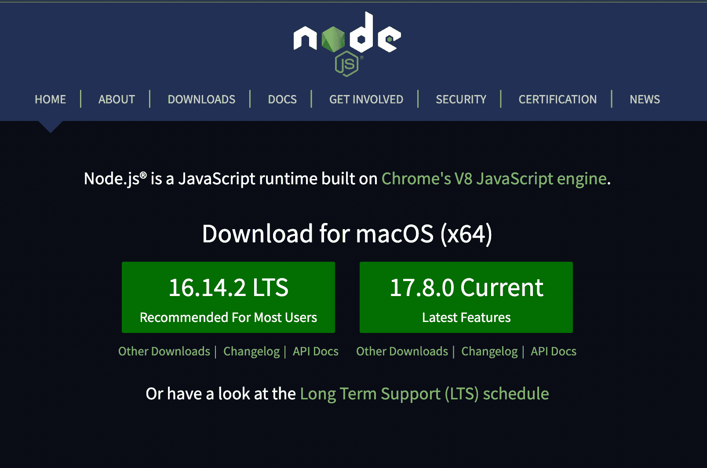

# 如何将节点和 NPM 更新到最新版本

> 原文：<https://www.freecodecamp.org/news/how-to-update-node-and-npm-to-the-latest-version/>

Node 是一个运行时环境，它允许开发人员在浏览器之外的服务器端执行 JavaScript 代码。

另一方面，NPM 是一个包管理器，负责将 JavaScript 包(也称为节点模块)发布到 [npm 注册表](https://www.npmjs.com/)。您还可以使用它将软件包安装到您的应用程序中。

要安装 Node，你得去 [Nodejs 网站](https://nodejs.org/en/)下载安装程序。下载后，您可以运行安装程序，按照步骤操作，同意条款和条件，并在您的设备上安装安装程序。

当您安装 Node 时，您还会得到`npm` CLI，您可以使用它来管理您的应用程序中的包。

然而，Node 和 NPM 可以分别更新到它们的最新版本，在本文的剩余部分，我将向您展示如何更新。

## 如何更新节点

### 1.使用 NPM 更新您的节点版本

要使用 NPM 更新节点，您将安装 [n](https://www.npmjs.com/package/n) 包，该包将用于在您的设备上交互管理节点版本。

以下是步骤:

#### 清除 NPM 缓存

安装依赖项时，会缓存一些模块，以提高后续下载的安装速度。所以首先，你要清除 NPM 缓存。

#### 安装

```
npm install -g n 
```

您需要全局安装这个包，因为它管理根目录下的节点版本。

#### 安装新版本的节点

```
n lts
n latest 
```

上面的两个命令安装了 Node 的长期支持和最新版本。

#### 删除以前安装的版本

```
n prune 
```

此命令删除以前安装的版本的缓存版本，仅保留最新安装的版本。

### 2.使用 NVM 更新您的节点版本

NVM 代表节点版本管理器，顾名思义，它帮助您管理您的节点版本。使用 NVM，您可以安装节点版本并指定项目使用的节点版本。

NVM 使得跨各种节点版本测试项目变得容易。

要使用 NVM 更新节点版本，您必须先安装 NVM。

这里是 NVM 的[安装指南](https://github.com/nvm-sh/nvm#installing-and-updating)。

安装后，您可以安装包含以下内容的软件包:

```
nvm install [version] 
```

您可以通过以下方式安装最新版本:

```
nvm install node 
```

和卸载其他版本:

```
nvm uninstall [version] 
```

由于安装了许多版本，您可能还希望指定在特定时间使用的版本。一种方法是设置默认别名，如下所示:

```
nvm alias default [version] 
```

这样，节点执行将使用指定的版本运行。

### 3.下载更新的节点二进制文件

并且还可以从 [Node.js](https://nodejs.org/en/) 网站获取最新版本。在上面，您可以找到您的设备的最新和长期支持版本。



Node.js downloads page

下载最新版本也给你最新版本的 NPM。

## 如何更新 NPM

正如您使用 NPM 更新软件包一样，您也可以使用 NPM 更新自身。下面是实现这一点的命令:

```
npm install -g npm@latest 
```

该命令将在全球范围内安装最新版本的 NPM。

在 Mac 上，你可能必须在 NPM 之前通过`sudo`命令，因为这将在你的设备的根目录下安装 NPM，而且你需要特权来这样做。

## 结论

在本文中，我们看到了如何将节点和 NPM 更新到最新版本。

再次重申，当你安装节点，你会自动获得 NPM。如果您还通过从网站安装二进制文件来更新 Node，您将获得一个更新的 NPM。

我们还看到了在您的设备上全局更新节点和 NPM 的其他方法。