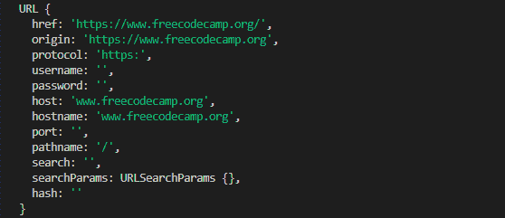
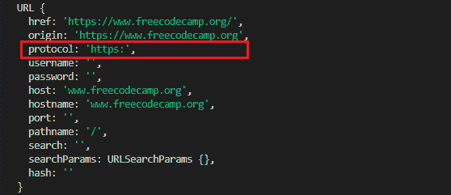

# 如何在 JavaScript 中验证 URL

> 原文：<https://www.freecodecamp.org/news/how-to-validate-urls-in-javascript/>

统一资源定位符(URL)是将你引向互联网上的页面或文件的东西。URL 作为互联网上事物的地址。

所有有效的 URL 都遵循一定的模式。因此，如果您知道这些模式，您就可以确定 URL 在您的程序中是否有效，并给出反馈、抛出错误等等。

在本教程中，您将学习三种方法来检查 JavaScript 中的字符串是否是有效的 URL:

*   [如何使用`URL`构造函数来验证 URL](#how-to-use-the-url-constructor-to-validate-urls)
*   [如何使用 npm 包验证 URL](#how-to-use-npm-packages-to-validate-urls)
*   [如何使用正则表达式验证 URL](#how-to-use-regex-to-validate-urls)

## 如何使用`URL`构造函数来验证 URL

当您将一个字符串传递给`URL`构造函数时，如果该字符串是有效的 URL，它将返回一个新的`URL`对象。否则，它会返回一个错误:

```
const fccUrl = new URL("https://www.freecodecamp.org/");
console.log(fccUrl);
```

以下是您将`fccUrl`登录到控制台时得到的结果:



A `URL` object in JavaScript

这个对象意味着您传递给`URL`构造函数的字符串是一个有效的 URL。

现在让我们看看当您传递一个无效的 URL 字符串时会得到什么:

```
const fccUrl = new URL('freecodecamp');
console.log(fccUrl); 
```

字符串`'freecodecamp'`不是有效的 URL。因此，您得到了下面的`TypeError`:


Invalid URL

概括一下:

1.  当您将一个有效的 URL 字符串传递给`URL`构造函数时，它会返回一个新的`URL`对象。
2.  当您将一个无效的 URL 字符串传递给`URL`构造函数时，它会返回一个`TypeError`。

有了这些知识，您可以创建一个自定义函数来检查给定 URL 字符串的有效性。

### 如何用`URL`构造函数创建一个 URL 验证函数

通过使用`URL`构造函数和一个`try...catch`语句，您可以创建一个定制的`isValidUrl`函数:

```
function isValidUrl(string) {
  try {
    new URL(string);
    return true;
  } catch (err) {
    return false;
  }
} 
```

当作为参数传递的字符串是有效的 URL 时，`isValidUrl`函数返回`true`。否则，返回`false`:

```
console.log(isValidUrl('https://www.freecodecamp.org/')); // true
console.log(isValidUrl('mailto://mail@freecodecamp.org')); // true
console.log(isValidUrl('freecodecamp')); // false 
```

### 如何用`URL`构造函数只验证 HTTP URLs

有时，您可能希望检查字符串是否是有效的 HTTP URL，并拒绝其他有效的 URL，如`'mailto://mail@freecodecamp.org'`。

如果你仔细观察`URL`对象，它的一个属性是`protocol` :



The `URL` object has a protocol property.

在上面的例子中，协议属性的值是`'https:'`。

要检查字符串是否是有效的 HTTP URL，可以使用 URL 对象的 protocol 属性:

```
function isValidHttpUrl(string) {
  try {
    const newUrl = new URL(string);
    return newUrl.protocol === 'http:' || newUrl.protocol === 'https:';
  } catch (err) {
    return false;
  }
}

console.log(isValidHttpUrl('https://www.freecodecamp.org/')); // true
console.log(isValidHttpUrl('mailto://mail@freecodecamp.org')); // false
console.log(isValidHttpUrl('freecodecamp')); // false 
```

这里的不同之处在于，在新的`URL`对象被创建之后，您没有返回`true`。相反，您将检查`protocol`属性的值是否等于`'http:'`或`'https:'`，如果是，则返回`true`，如果不是，则返回`false`。

## 如何使用 npm 包来验证 URL

您可以使用两个 NPM 软件包:`is-url`和`is-url-http`。

这些包是检查一个字符串是否是有效 URL 的最简单的方法。你只需要传入一个字符串作为参数，他们就会返回`true`或者`false`。

让我们看看这两个包是如何工作的。

### 如何用`is-url`包验证 URL

您可以使用`is-url`包来检查一个字符串是否是有效的 URL。这个包不检查传递给它的 URL 的协议。

要使用`is-url`，首先使用以下命令安装它:

```
npm install is-url
```

然后导入它并将您的 URL 字符串作为参数传递给它:

```
import isUrl from 'is-url';

const firstCheck = isUrl('https://www.freecodecamp.org/');
const secondCheck = isUrl('mailto://mail@freecodecamp.org');
const thirdCheck = isUrl('freeCodeCamp');

console.log(firstCheck); // true
console.log(secondCheck); // true
console.log(thirdCheck); // false 
```

`is-url`包为具有有效 URL 格式的字符串返回`true`,为具有无效 URL 格式的字符串返回`false`。

在这个例子中，`firstCheck`(使用`https:`协议)和`secondCheck`(使用`mailto:`协议)都返回`true`。

### 如何用`is-http-url`包验证 HTTP URLs

您可以使用`is-url-http`包来检查一个字符串是否是有效的 HTTP URL。

使用以下命令安装软件包:

```
npm install is-url-http
```

然后导入它并将 URL 字符串传递给它，如下所示:

```
import isUrlHttp from 'is-url-http';

const firstCheck = isUrlHttp('https://www.freecodecamp.org/');
const secondCheck = isUrlHttp('mailto://freecodecamp@mail.org');
const thirdCheck = isUrlHttp('freeCodeCamp');

console.log(firstCheck); // true
console.log(secondCheck); // false
console.log(thirdCheck); // false 
```

在这个例子中，只有`firstCheck`返回`true`。`is-url-http`包不仅检查字符串是否是有效的 URL，还检查它是否是有效的 HTTP URL。这就是为什么它为`secondCheck`返回`false`，这不是一个有效的 HTTP URL。

## 如何使用正则表达式来验证 URL

您还可以使用 regex 或正则表达式来检查字符串是否是有效的 URL。

所有有效的 URL 都遵循特定的模式。它们有三个主要部分，分别是:

*   草案
*   域名(或 IP 地址)
*   端口和路径

有时，查询字符串或片段定位器会跟随路径。

你可以从这篇关于 URL 结构的文章中了解更多关于 URL 模式的知识。

知道了模式 URL 是由什么组成的，就可以使用 regex 来检查字符串中是否存在这种模式。如果模式存在，那么字符串通过正则表达式测试。否则，它会失败。

此外，使用 regex，您可以检查所有有效的 URL，或者只检查有效的 HTTP URLs。

### 如何用正则表达式验证 URL

```
function isValidUrl(str) {
  const pattern = new RegExp(
    '^([a-zA-Z]+:\\/\\/)?' + // protocol
      '((([a-z\\d]([a-z\\d-]*[a-z\\d])*)\\.)+[a-z]{2,}|' + // domain name
      '((\\d{1,3}\\.){3}\\d{1,3}))' + // OR IP (v4) address
      '(\\:\\d+)?(\\/[-a-z\\d%_.~+]*)*' + // port and path
      '(\\?[;&a-z\\d%_.~+=-]*)?' + // query string
      '(\\#[-a-z\\d_]*)?

上面的`isValidUrl`函数中的正则表达式检查一个字符串是否是有效的 URL。协议检查`^([a-zA-Z]+:\\/\\/)?`不仅限于`https:`。

这就是为什么使用`mailto:`协议的第二个例子返回`true`。

### 如何用正则表达式验证 HTTP URLs

要使用 regex 检查一个字符串是否是有效的 HTTP URL，您需要编辑协议检查。

你应该用`'^(https?:\\/\\/)?'`而不是`^([a-zA-Z]+:\\/\\/)?`:

```
function isValidHttpUrl(str) {
  const pattern = new RegExp(
    '^(https?:\\/\\/)?' + // protocol
      '((([a-z\\d]([a-z\\d-]*[a-z\\d])*)\\.)+[a-z]{2,}|' + // domain name
      '((\\d{1,3}\\.){3}\\d{1,3}))' + // OR ip (v4) address
      '(\\:\\d+)?(\\/[-a-z\\d%_.~+]*)*' + // port and path
      '(\\?[;&a-z\\d%_.~+=-]*)?' + // query string
      '(\\#[-a-z\\d_]*)?

现在，只有第一个具有有效`https:`协议的示例返回`true`。请注意，带有`http:`的 URL 字符串也可以。

## 结束了！

在本文中，您学习了如何在 JavaScript 中检查 URL 的有效性。您现在已经知道了以下三种方法。

*   如何使用`URL`构造函数来验证 URL
*   如何使用 npm 包来验证 URL(`is-url`和`is-http-url`)
*   如何使用正则表达式来验证 URL

选择哪种方法让你觉得舒服，这取决于你自己。

感谢阅读。还有快乐编码！, // fragment locator
    'i'
  );
  return pattern.test(str);
}

console.log(isValidUrl('https://www.freecodecamp.org/')); // true
console.log(isValidUrl('mailto://freecodecamp.org')); // true
console.log(isValidUrl('freeCodeCamp')); // false 
```

上面的`isValidUrl`函数中的正则表达式检查一个字符串是否是有效的 URL。协议检查`^([a-zA-Z]+:\\/\\/)?`不仅限于`https:`。

这就是为什么使用`mailto:`协议的第二个例子返回`true`。

### 如何用正则表达式验证 HTTP URLs

要使用 regex 检查一个字符串是否是有效的 HTTP URL，您需要编辑协议检查。

你应该用`'^(https?:\\/\\/)?'`而不是`^([a-zA-Z]+:\\/\\/)?`:

[PRE10]

现在，只有第一个具有有效`https:`协议的示例返回`true`。请注意，带有`http:`的 URL 字符串也可以。

## 结束了！

在本文中，您学习了如何在 JavaScript 中检查 URL 的有效性。您现在已经知道了以下三种方法。

*   如何使用`URL`构造函数来验证 URL
*   如何使用 npm 包来验证 URL(`is-url`和`is-http-url`)
*   如何使用正则表达式来验证 URL

选择哪种方法让你觉得舒服，这取决于你自己。

感谢阅读。还有快乐编码！, // fragment locator
    'i'
  );
  return pattern.test(str);
}

console.log(isValidHttpUrl('https://www.freecodecamp.org/')); // true
console.log(isValidHttpUrl('mailto://freecodecamp.org')); // false
console.log(isValidHttpUrl('freeCodeCamp')); // false 
```

现在，只有第一个具有有效`https:`协议的示例返回`true`。请注意，带有`http:`的 URL 字符串也可以。

## 结束了！

在本文中，您学习了如何在 JavaScript 中检查 URL 的有效性。您现在已经知道了以下三种方法。

*   如何使用`URL`构造函数来验证 URL
*   如何使用 npm 包来验证 URL(`is-url`和`is-http-url`)
*   如何使用正则表达式来验证 URL

选择哪种方法让你觉得舒服，这取决于你自己。

感谢阅读。还有快乐编码！, // fragment locator
    'i'
  );
  return pattern.test(str);
}

console.log(isValidUrl('https://www.freecodecamp.org/')); // true
console.log(isValidUrl('mailto://freecodecamp.org')); // true
console.log(isValidUrl('freeCodeCamp')); // false 
```

上面的`isValidUrl`函数中的正则表达式检查一个字符串是否是有效的 URL。协议检查`^([a-zA-Z]+:\\/\\/)?`不仅限于`https:`。

这就是为什么使用`mailto:`协议的第二个例子返回`true`。

### 如何用正则表达式验证 HTTP URLs

要使用 regex 检查一个字符串是否是有效的 HTTP URL，您需要编辑协议检查。

你应该用`'^(https?:\\/\\/)?'`而不是`^([a-zA-Z]+:\\/\\/)?`:

[PRE10]

现在，只有第一个具有有效`https:`协议的示例返回`true`。请注意，带有`http:`的 URL 字符串也可以。

## 结束了！

在本文中，您学习了如何在 JavaScript 中检查 URL 的有效性。您现在已经知道了以下三种方法。

*   如何使用`URL`构造函数来验证 URL
*   如何使用 npm 包来验证 URL(`is-url`和`is-http-url`)
*   如何使用正则表达式来验证 URL

选择哪种方法让你觉得舒服，这取决于你自己。

感谢阅读。还有快乐编码！