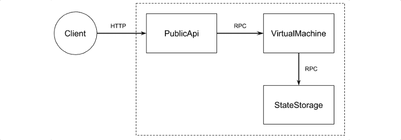

# 如何在 Go 中编写防弹代码:不会失败的服务器工作流

> 原文：<https://www.freecodecamp.org/news/how-to-write-bulletproof-code-in-go-a-workflow-for-servers-that-cant-fail-10a14a765f22/>

我的天啊！

# 如何在 Go 中编写防弹代码:不会失败的服务器工作流

有时你可能会发现自己面临一个令人生畏的任务:构建一个真正不允许失败的服务器，这是一个错误成本非常高的项目。完成这项任务的方法是什么？

### 你的服务器真的需要防弹吗？

在进入这个过度的工作流程之前，你应该问问自己——我的服务器*真的需要防弹吗？为最坏的情况做准备需要很多开销，而且并不总是值得的。*

如果错误的成本不是非常高，一个完全有效的方法是尽最大努力让事情正常运行，如果你的服务器坏了，就处理它。如今的监控工具和现代的连续交付工作流程使我们能够快速发现生产中的问题，并几乎立即解决它们。对于许多情况，这已经足够好了。

在我今天所做的项目中，并不是这样。我正致力于实现一个[区块链](https://www.orbs.com/)——一个分布式服务器基础设施，用于在低信任度环境下，根据共识安全地执行代码。这项技术的应用之一是数字货币。这是一个教科书式的例子，其中错误的代价确实很高。我们自然希望它的实现尽可能可靠。

不过，在其他情况下，即使不涉及货币，防弹代码也有意义。对于一个经常失败的代码库来说，维护成本会迅速飙升。能够在开发周期的早期发现问题，当修复它们的成本仍然很低时，有很好的机会收回防弹方法的前期投资。

### TDD 是神奇的答案吗？

测试驱动开发(TDD)通常被誉为对抗故障代码的银弹。这是一种纯粹的开发方法，其中新代码不会被添加，除非它满足失败的测试。这个过程保证了 100%的测试覆盖率，并且经常给人一种错觉，即你的代码是针对每一个可能的场景进行测试的。

事实并非如此。TDD 是一种伟大的方法，对某些人来说效果不错，但是它本身仍然不够。更糟糕的是，TDD 在代码中灌输了错误的信心，并可能使开发人员在考虑偏执的边缘情况时变得懒惰。稍后我会展示一个很好的例子。

### 测试很重要——它们是关键

不管你是在事实之前还是之后编写测试，使用或者不使用像 TDD 这样的技术都没有关系。重要的是你有测试。测试是保护您的代码在生产中不被破坏的最佳防线。

由于我们将非常频繁地运行我们的整个测试套件*——如果可能的话，在每一行新代码之后——测试必须自动化。我们对代码的信心没有一部分来自手动 QA 过程。人类会犯错。在连续做一百次同样的令人麻木的任务后，人类对细节的关注度下降了。*

测试必须要快。快得惊人。

如果测试套件的运行时间超过几秒钟，开发人员很可能会变得懒惰，不运行代码就推送代码。这是 Go 的伟大之处之一——它拥有最快的工具链之一。它可以在几秒钟内编译、重建和测试。

测试也是开源项目的重要推动者。例如，区块链几乎在宗教上是开源的。代码库必须是开放的，以建立信任——暴露自己以接受审计，并创造一种分散的氛围，在这种氛围中没有单一的管理实体控制项目。

在没有完整测试套件的情况下，期望开源项目中的大量外部贡献是不合理的。外部贡献者需要一种快速的方法来检查他们的贡献是否破坏了任何现有的行为。事实上，整个测试套件必须在每个 pull 请求时自动运行，如果 PR 出错，就会自动失败。

完整的测试覆盖是一个误导性的度量，但是它是重要的。达到 100%的覆盖率可能有点过分，但是仔细想想，将事先从未执行过的代码交付到产品中是没有意义的。

全面的测试覆盖不一定意味着我们有足够的测试，也不意味着我们的测试有意义。可以肯定的是，如果我们没有 100%的覆盖率，我们就没有足够的证据认为自己是防弹的，因为我们的部分代码从未被测试过。

尽管如此，还是有测试太多这种事情。理想情况下，我们遇到的每个 bug 都应该破坏一个测试。如果我们有冗余测试——检查同一件事情的不同测试——在过程中修改现有代码和破坏现有行为将会在修复失败的测试中产生太多的开销。

### 为什么 Go 是防弹代码的绝佳选择？

**Go 是静态类型的。**类型在一起运行的各段代码之间提供了一个契约。如果在构建期间没有自动的类型检查，如果我们想要遵守严格的覆盖规则，我们将不得不自己实现这些契约测试。Node.js 和 JavaScript 等环境就是这种情况。手动编写全面的契约测试是我们希望避免的大量额外工作。

**围棋简单而教条。众所周知，Go 被剥夺了许多传统的语言特性，比如经典的 OOP 继承。复杂性是防弹代码最大的敌人。问题往往会悄悄出现。虽然常见的情况很容易测试，但你没有想到的奇怪的边缘情况最终会让你陷入困境。**

教条在这个意义上也是有帮助的。在围棋中，做一件事通常只有一种方法。这可能会抑制人类的自由精神，但当有一种方法可以做某事时，就更难把这件事弄错了。

围棋简洁而富有表现力。可读代码更容易审查和审计。如果代码过于冗长，其核心目的可能会被样板文件的噪音淹没。如果代码过于简洁，就很难理解。

Go 在两者之间取得了很好的平衡。不像 Java 或 C++那样有很多语言样板文件，但这种语言在错误处理等方面仍然非常明确和冗长——很容易验证您已经检查了每一条可能的路径。

Go 有清晰的出错和恢复路径。优雅地处理运行时的错误是防弹代码的基石。Go 对错误如何返回和传播有严格的约定。像 Node.js 这样的环境——其中混合了多种风格的控制流，如回调、承诺和异步——通常会导致泄漏，如[未处理的承诺拒绝](http://thecodebarbarian.com/unhandled-promise-rejections-in-node.js.html)。从这些中恢复几乎是不可能的。

Go 拥有丰富的标准库。依赖增加了风险，尤其是当来自不一定维护良好的来源时。在运送您的服务器时，您将运送您的所有依赖项。你也要对他们的故障负责。像 Node.js 这样充斥着支离破碎的依赖关系的环境更难保护。

从安全的角度来看，这也是有风险的，因为你和你最弱的依赖关系一样脆弱。Go 广泛的标准库维护良好，减少了对外部依赖的依赖。

**发展速度依然迅猛。像 Node.js 这样的环境的主要吸引力在于极其快速的开发周期。编写代码只需花费更少的时间，您会变得更有效率。**

Go 很好地保留了这些优点。构建工具链足够快，可以立即得到反馈。编译时间可以忽略不计，代码似乎像解释的那样运行。这种语言有足够的抽象，如垃圾收集，可以将工程工作集中在核心功能上。

### 让我们玩一个工作示例

现在，介绍完了，是时候深入一些代码了。我们需要一个足够简单的例子，这样我们就可以专注于方法，但又足够复杂，有实质内容。我发现从我的日常生活中获取一些东西是最容易的，所以让我们构建一个处理类似货币交易的服务器。用户可以查看账户余额。用户还可以将资金从一个账户转移到另一个账户。

我们会让事情变得非常简单。我们的系统只有一台服务器。我们也不打算处理用户认证或加密。这些是产品特性，而我们想专注于构建防弹软件基础。

### 将复杂性分解为易于管理的部分

复杂性是防弹代码最大的敌人。处理复杂性的最好方法之一是*分而治之*——把问题分成更小的问题，然后分别解决。我们怎么分？我们将遵循[关注点分离](https://en.wikipedia.org/wiki/Separation_of_concerns)的原则。每个部分都应该处理一个问题。

这与[微服务](https://www.martinfowler.com/articles/microservices.html)的流行架构是齐头并进的。我们的服务器将由服务组成。每个服务都将被赋予明确的职责，并被赋予与其他服务进行通信的明确定义的接口。

一旦我们以这种方式构建了我们的服务器，我们就可以自由地决定每个服务如何运行。我们可以在同一个进程中一起运行所有服务，让每个服务成为自己独立的服务器，并通过 RPC 进行通信，或者将服务拆分到不同的机器上运行。

由于我们刚刚开始，我们将保持事情简单——所有服务将共享相同的过程，并像库一样直接通信。将来我们可以很容易地改变这个决定。

那么我们应该拥有哪些服务呢？我们的服务器对于拆分来说有点太简单了，但是为了证明这个原则，我们还是要这么做。我们需要响应客户查询余额和进行交易的 HTTP 请求。一个服务可以处理客户端 HTTP 接口——我们称之为 *PublicApi* 。另一个服务将拥有州——所有余额的分类账——所以我们称它为*州存储库*。第三个服务将连接这两者，并实现我们的“契约”业务逻辑来改变余额。由于区块链通常允许应用程序开发者部署这些合同，第三个服务将负责运行它们——我们称之为*虚拟机器*。

我们将把项目中的服务代码放在`/services/publicapi`、`/services/virtualmachine`和`/services/statestorage`下。

### 清楚地定义服务边界

在实现服务时，我们希望能够分别处理每一项服务。甚至可能给不同的开发者分配不同的服务。因为服务是相互依赖的，我们将并行处理它们的实现，我们必须从定义它们之间的清晰接口开始。使用这个接口，我们将能够单独测试一个服务，并模拟其他一切。

我们如何定义接口？一种选择是将其文档化，但是文档往往会变得陈旧，与代码不同步。我们可以使用 Go *接口*声明。这很有意义，但是以一种语言不可知的方式定义接口更好。我们的服务器不仅限于 Go。我们可能会决定用一种更适合其需求的不同语言来重新实现其中一个服务。

一种方法是使用[proto buf](https://developers.google.com/protocol-buffers/)——一种简单的与语言无关的语法，由 Google 用来定义消息和服务端点。

让我们从*状态存储*开始。我们将把状态构造成一个键值存储:

虽然 *PublicApi* 是通过客户端 HTTP 访问的，但以同样的方式给它一个清晰的接口仍然是一个好的做法:

这将要求我们定义*事务*和*地址*数据结构:

我们将把项目中服务的`.proto`定义放在`/types/services`下，通用数据结构放在`/types/protocol`下。一旦定义准备好了，就可以[编译](https://developers.google.com/protocol-buffers/docs/reference/go-generated)成代码了。这种方法的好处是不符合约定的代码根本无法编译。替代方法会要求我们显式地编写契约测试。

完整的定义、生成的 Go 文件和编译指令可以在[这里](https://github.com/orbs-network/go-scaffold/tree/f1cd4f35d697a6946b2e45616f4817dc4007bb0f/types)找到。为 [goprotowrap](https://github.com/square/goprotowrap) 的制作向[广场工程](https://www.freecodecamp.org/news/how-to-write-bulletproof-code-in-go-a-workflow-for-servers-that-cant-fail-10a14a765f22/undefined)致敬。

注意，我们还没有集成 RPC 传输层，服务之间的调用目前将是常规的库调用。当我们准备好将服务拆分到不同的服务器时，我们可以添加一个传输层，如 [gRPC](https://grpc.io/docs/tutorials/basic/go.html) 。

### 我们项目中的测试类型

由于测试是防弹代码的关键，让我们首先讨论我们将编写哪种类型的测试:

#### **单元测试**

这是[测试金字塔](https://blog.primehammer.com/test-pyramid/)的基地。我们会单独测试每个单元。什么是单位？在 Go 中，我们可以将一个单元定义为包中的每个文件。如果我们有`/services/publicapi/handlers.go`，我们将把它的单元测试放在`/services/publicapi/handlers_test.go`下的同一个包中。

最好将单元测试与被测试的代码放在同一个包中，这样测试就可以访问未导出的变量和函数。

#### **服务/集成/组件测试**

下一种类型的测试有多个名称，都是指同一件事——将几个单元放在一起测试。这是金字塔的上一层。在我们的例子中，我们将关注整个服务。这些测试定义了服务的规范。例如，对于 *StateStorage* 服务，我们将它们放在`/services/statestorage/spec`中。

最好将这些测试放在与测试代码不同的包中，以便只通过导出的接口强制访问。

#### **端到端测试**

这是测试金字塔的顶端，我们在这里测试我们的整个系统以及所有的服务。这些测试定义了系统的端到端规范，因此我们将它们放在我们的项目中的`/e2e/spec`下。

这些测试也应该放在与测试代码不同的包中，以便只通过导出的接口进行访问。

我们应该先写哪些测试？我们是从基层开始，一步步往上走吗？还是自上而下？这两种方法都是有效的。自顶向下方法的好处在于构建规范。首先考虑整个系统的规格通常更容易。即使我们以错误的方式将我们的系统拆分为服务，系统规范也将保持不变。这也会帮助我们理解这一点。

自顶向下开始的缺点是，我们的端到端测试将是最后通过的(只有在整个系统实现之后)。这意味着他们将在很长一段时间内保持失败。

### 端到端测试

在编写测试之前，我们需要考虑我们是要编写所有的东西还是使用一个框架。开发依赖框架比生产代码依赖框架危险小。在我们的例子中，由于 Go 标准库对 [BDD](https://en.wikipedia.org/wiki/Behavior-driven_development) 没有很好的支持，而且这种格式非常适合定义规范，我们将选择框架。

像 [GoConvey](https://github.com/smartystreets/goconvey) 和[银杏](https://github.com/onsi/ginkgo)这样优秀的候选人还有很多。我个人的偏好是[银杏](http://onsi.github.io/ginkgo/)带 [Gomega](http://onsi.github.io/gomega/) (名字很可怕，但是你能做什么)使用类似`Describe()`和`It()`的语法。

那么测试是什么样的呢？检查用户余额:

由于我们的服务器向世界提供公共 HTTP 接口，我们使用 [http 访问这个 web API。得到](https://golang.org/pkg/net/http/)。做个交易怎么样？

该测试非常具有描述性，甚至可以取代文档。正如你在上面看到的，我们允许账户达到负余额。这是一个产品选择。如果这是不允许的，测试就会反映出来。

完整的测试文件可从[这里](https://github.com/orbs-network/go-scaffold/tree/f1cd4f35d697a6946b2e45616f4817dc4007bb0f/e2e/spec)获得。

### 服务集成/组件测试

既然我们已经完成了端到端的测试，我们就沿着金字塔往下走，实现服务测试。这是为每个服务分别进行的。让我们选择一个依赖于另一个服务的服务，因为这种情况更有趣。

我们将从*虚拟机器*开始。这个服务的 protobuf 接口在[这里](https://github.com/orbs-network/go-scaffold/blob/f1cd4f35d697a6946b2e45616f4817dc4007bb0f/types/services/virtualmachine.proto)可用。因为*虚拟机*依赖于服务*状态存储*并调用它，我们将不得不[模拟](https://en.wikipedia.org/wiki/Mock_object) *状态存储*以便隔离测试*虚拟机*。模拟对象将允许我们在测试期间控制 *StateStorage* 的响应。

如何在 Go 中实现模拟对象？我们可以简单地创建一个简单的存根实现，但是使用一个 mocking 库也将在测试期间为我们提供有用的断言。我的偏好是 [go-mock](https://github.com/maraino/go-mock) 。

我们将在`/services/statestorage/mock.go`中放置 *StateStorage* 的模拟。最好将模拟代码放在同一个包中，以提供对非导出变量和函数的访问。在这一点上，模拟几乎只是样板文件，但是随着我们的服务变得更加复杂，我们可能会发现自己在这里添加了一些逻辑。这是嘲弄:

如果您将不同的服务分配给不同的开发人员，那么首先实现模拟并在团队之间共享它们是有意义的。

让我们回到为*虚拟机*编写服务测试。我们到底应该在这里测试哪个场景？最好按照[接口](https://github.com/orbs-network/go-scaffold/blob/f1cd4f35d697a6946b2e45616f4817dc4007bb0f/types/services/virtualmachine.proto)对每个端点进行服务和设计测试。我们将首先用`"GetBalance"`的*方法*参数实现端点`CallContract()`的测试:

注意，我们正在测试的服务 *VirtualMachine* 通过简单的依赖注入在其`Start()`方法中接收指向其依赖关系 *StateStorage* 的指针。这就是我们传递模拟实例的地方。还要注意第 23 行，在那里我们指示 mock 当被访问时如何响应。当它的`ReadKey`方法被调用时，它应该返回值`100`。然后我们验证它确实在第 28 行被调用了一次。

这些测试成为服务的规范。全套服务*虚拟机器*在[这里](https://github.com/orbs-network/go-scaffold/tree/f1cd4f35d697a6946b2e45616f4817dc4007bb0f/services/virtualmachine/spec)都有。其他服务的套房在[这里](https://github.com/orbs-network/go-scaffold/tree/f1cd4f35d697a6946b2e45616f4817dc4007bb0f/services/statestorage/spec)和[这里](https://github.com/orbs-network/go-scaffold/tree/f1cd4f35d697a6946b2e45616f4817dc4007bb0f/services/publicapi/spec)都有。

### 最后，让我们实现一个单元

实现*方法* `"GetBalance"`的契约有点太简单了，所以让我们转而实现稍微复杂一点的*方法* `"Transfer”`。传输契约需要读取发送方和接收方的余额，计算它们的新余额，并将它们写回到 state。针对 it 的服务集成测试与我们刚刚实施的测试非常相似:

我们将最终进入正题，创建一个名为`processor.go`的单元，它包含契约的实际实现。这是我们最初实现的结果:

这满足了服务集成测试，但是集成测试只包含一个常见的案例场景。边缘情况和潜在故障怎么办？如您所见，我们对 *StateStorage* 的任何调用都可能失败。如果我们的目标是 100%的覆盖率，我们需要检查所有这些案例。单元测试是一个很好的地方。

因为我们将不得不使用不同的输入和模拟设置多次运行该函数，以到达所有流，所以一个[表驱动的测试](https://github.com/golang/go/wiki/TableDrivenTests)将使这个过程更有效一点。Go 的惯例是在单元测试中避免花哨的框架。我们可以去掉[银杏](http://onsi.github.io/ginkgo/)，但我们可能应该保留[戈美加](http://onsi.github.io/gomega/)，这样我们的匹配器看起来就和我们之前的测试相似。这是测试:

如果您对“ω”符号感到奇怪，不要担心，它只是一个常规的变量名(持有一个指向 [Gomega](http://onsi.github.io/gomega/) 的指针)。你可以随意给它改名。

出于时间的原因，我们没有展示严格的 TDD 方法，在这种方法中，只需编写一行新代码来解决失败的测试。使用这种方法，`processTransfer()`的单元测试和实现将通过多次迭代来实现。

在 *VirtualMachine* 服务中的全套单元测试可以在[这里](https://github.com/orbs-network/go-scaffold/tree/f1cd4f35d697a6946b2e45616f4817dc4007bb0f/services/virtualmachine)获得。其他服务的单元测试在[这里](https://github.com/orbs-network/go-scaffold/tree/f1cd4f35d697a6946b2e45616f4817dc4007bb0f/services/statestorage)和[这里](https://github.com/orbs-network/go-scaffold/tree/f1cd4f35d697a6946b2e45616f4817dc4007bb0f/services/publicapi)可用。

我们已经达到了 100%的覆盖率，我们的端到端测试通过了，我们的服务集成测试通过了，我们的单元测试通过了。该代码完全符合其要求，并且经过了彻底的测试。

这是否意味着一切正常？可惜没有。在我们简单的实现中，仍然有几个令人讨厌的 bug 隐藏在显眼的地方。

### 压力测试的重要性

到目前为止，我们的所有测试都测试了在任何给定时间处理的单个请求。同步问题怎么办？Go 中的每个 HTTP 请求都在自己的 *goroutine* 中处理。由于这些 goroutines 是并发运行的，可能在不同 CPU 内核上的不同 OS 线程上运行，所以我们面临同步问题。这些是非常讨厌的虫子，不容易追踪到。

发现同步问题的方法之一是用并行的许多请求给系统施加压力，并确保一切仍然工作。这应该是一个端到端的测试，因为我们希望测试整个系统中所有服务的同步问题。我们将把压力测试放在`/e2e/stress`下的项目中。

压力测试是这样的:

请注意，压力测试包括随机数据。建议使用一个常量种子(见第 39 行)使测试具有确定性。每次运行测试时运行不同的场景不是一个好主意。有时通过，有时失败的测试会降低开发人员对套件的信心。

通过 HTTP 进行压力测试的棘手之处在于，大多数机器在模拟成千上万的并发用户和打开成千上万的并发 TCP 连接时都有一段艰难的时间(你会看到奇怪的失败，比如“最大文件描述符”或“对等连接重置”)。上面的代码试图通过将并发连接数限制为 200 个一批，并使用*idle connection**Transport*设置来回收一批之间的 TCP 会话，来很好地解决这个问题。如果这个测试在你的机器上不可靠，试着把批量减少到 100。

哦，不…测试失败了:

这里发生了什么？ *StateStorage* 实现为简单的内存映射。似乎我们正试图从不同的线程并行写入此映射。乍一看，我们似乎应该用线程安全的`[sync.map](https://golang.org/pkg/sync/#Map)`来代替常规的 map，但是我们的问题更深一层。

看一看`[processTransfer()](https://github.com/orbs-network/go-scaffold/blob/f1cd4f35d697a6946b2e45616f4817dc4007bb0f/services/virtualmachine/processor.go)`的实现。它从状态中读取两次，然后写入两次。读和写的集合不是一个原子事务，所以如果另一个线程在一个线程读它之后改变状态，我们将会有数据损坏。修复方法是确保只有一个`processTransfer()`实例可以并发运行——您可以在这里看到它。

让我们试着再做一次压力测试。哦不，又一次失败！

这需要更多的调试来理解。当用户试图向自己转账时(同一用户既是汇款人又是收款人)，似乎就会发生这种情况。看看这个实现，很容易看出[为什么会发生这种情况](https://github.com/orbs-network/go-scaffold/blob/716806bd41641278b060612387a752944c5e7445/services/virtualmachine/processor.go#L18)。

这张有点让人不安。我们遵循了一个类似 TDD 的工作流程，但仍然遇到了一个严重的业务逻辑错误。这怎么可能呢？我们的代码不是 100%覆盖所有场景的吗？！嗯…这个 bug 是错误的产品需求的结果，而不是错误的实现。对`processTransfer()`的要求应该已经明确指出，如果用户向自己转账，什么都不会发生。

当我们发现一个业务逻辑错误时，我们应该总是首先在单元测试中重现它。很容易[将这个案例](https://github.com/orbs-network/go-scaffold/blob/f1cd4f35d697a6946b2e45616f4817dc4007bb0f/services/virtualmachine/processor_test.go#L26)添加到我们之前的表格驱动测试中。修复也很简单——你可以在这里看到它[。](https://github.com/orbs-network/go-scaffold/blob/f1cd4f35d697a6946b2e45616f4817dc4007bb0f/services/virtualmachine/processor.go#L12)

### 我们终于自由了吗？

在增加了压力测试并确保一切都通过之后，我们的系统最终能像预期的那样工作了吗？终于防弹了吗？

可惜没有。

我们仍然有一些甚至压力测试也没有发现的令人讨厌的错误。我们的“简单”函数`processTransfer()`仍然存在风险。想想如果我们到达这条线会发生什么。第一次写入状态成功，但第二次失败。我们将要返回一个错误，但是我们已经通过向它写入半生不熟的数据而破坏了我们的状态。如果我们要返回一个错误，我们必须撤销第一次写操作。

修复起来有点复杂。最好的解决方案可能是彻底改变[我们的接口](https://github.com/orbs-network/go-scaffold/blob/f1cd4f35d697a6946b2e45616f4817dc4007bb0f/types/services/statestorage.proto#L6)。与其在*状态存储*中有一个名为`WriteKey` 的端点被我们调用两次，我们或许应该将其重命名为`WriteKeys`——一个我们将调用*一次的端点*，以便在一个事务中将两个密钥写在一起。

这里有一个更大的教训:有条不紊的测试套件是不够的。处理复杂的 bug 需要开发人员的批判性思维和偏执的创造力。建议让其他人查看您的代码，并在您的团队中执行代码评审。更好的是，开源你的代码并鼓励社区来审计它是让你的代码更加防弹的最好方法之一。

本文中的所有代码都可以在 Github 上作为一个示例库获得。欢迎您将此项目用作下一台服务器的入门套件。也欢迎你来回顾回购，发现更多的 bug，让它更防弹。创意偏执！

[**orbs-network/Go-Scaffold**](https://github.com/orbs-network/go-scaffold)
[*Go-Scaffold——Go 中的一个基于微服务的服务器启动项目，经过全面测试*github.com](https://github.com/orbs-network/go-scaffold)

Tal 是 Orbs.com 的创始人，这是一个面向拥有数百万用户的大规模消费应用的区块链公共基础设施。要了解更多并阅读 Orbs 白皮书[点击这里](https://orbs.com/white-papers)。【跟进[电报](https://t.me/orbs_network)，[推特](https://twitter.com/orbs_network)， [Reddit](https://www.reddit.com/r/ORBS_Network/) ，

注意:如果你对区块链感兴趣——来投稿吧！Orbs 是一个完全开源的项目，任何人都可以参与。