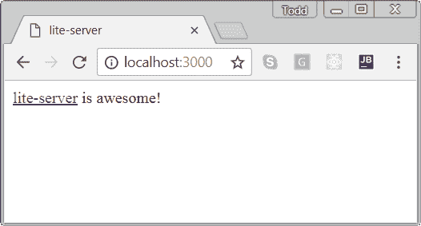
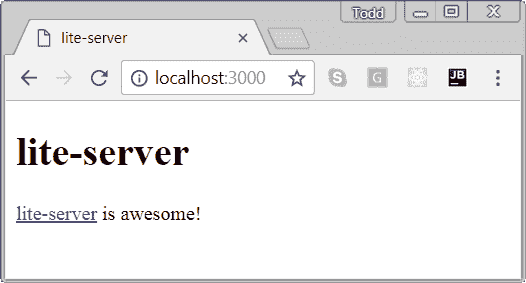
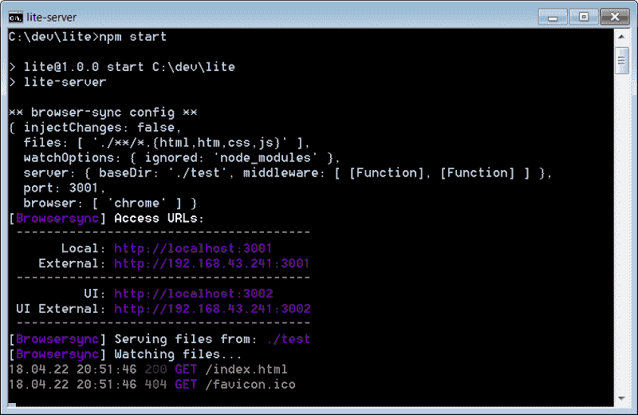
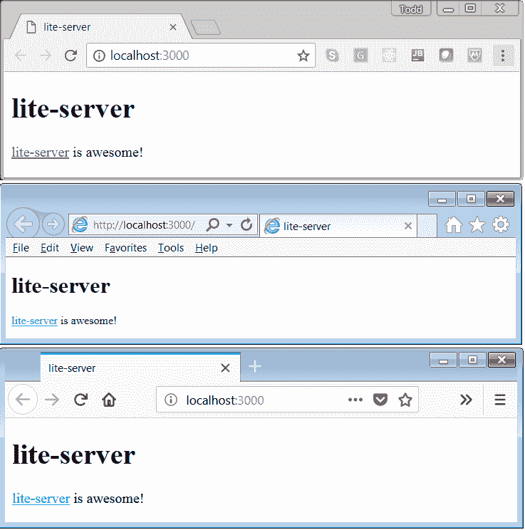
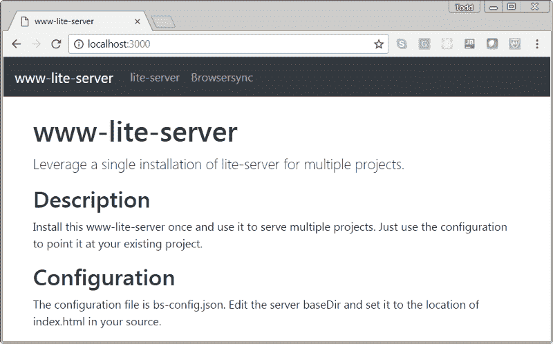

# 如何使用 lite-server 开发一个简单的 Web 服务器

> 原文：<https://www.freecodecamp.org/news/how-you-can-use-lite-server-for-a-simple-development-web-server-33ea527013c9/>

托德·帕尔默

# 如何使用 lite-server 开发一个简单的 Web 服务器


Northern Lights over Ruka, Finland by [Timo Newton-Syms](https://www.flickr.com/people/19935963@N00)

如果你需要一个简单的轻量级网络服务器来做一些开发工作，那么, [lite-server](https://github.com/johnpapa/lite-server) 是一个很好的选择。

在本文中，我将:

1.  简要解释 **lite-server** 的**是什么以及为什么**。
2.  向你展示如何**创建一个简单的 web 应用程序**并用 **lite-server** 服务它。
3.  解释一些简单的**精简服务器配置**。
4.  最后，如果你只是想**安装一次 lite-server，并在任何地方使用它**，看看我在 GitHub 的项目 [www-lite-server。](https://github.com/t-palmer/www-lite-server)

虽然这是一篇介绍性的文章，但我希望:

*   您对命令提示符有所了解，比如创建和切换目录。
*   您已经安装了 [npm](https://www.npmjs.com/) ，并且知道如何使用它来安装包。
*   你知道如何使用 HTML 创建简单的网页。

### 什么是 lite-server？

lite-server 是一个**轻量级开发 web 服务器，支持单页面应用(spa)**。实际上，它比那更有技术含量。但是，对于我们的目的来说，这已经足够好了。

lite-server 是由[约翰·帕帕](https://www.freecodecamp.org/news/how-you-can-use-lite-server-for-a-simple-development-web-server-33ea527013c9/undefined)创造的。你应该追随他，阅读他所有的东西，因为他是开源社区的**真英雄！**


[John Papa](https://www.freecodecamp.org/news/how-you-can-use-lite-server-for-a-simple-development-web-server-33ea527013c9/undefined)

约翰创建了 **lite-server** ,因为他想要一个简单的 web 服务器，可以用来测试部署利用 URL 路由的**单页面应用**。也许你还没有使用像 [Angular](https://angular.io/) 、 [React](https://reactjs.org/) 和 Vue.js 这样的 JavaScript GUI 框架。但是要知道，当你这么做的时候， **lite-server** 仍然会在那里等着你。

因此，让我们利用约翰的工作，实际上…

### 在 Web 项目中使用 lite-server

首先，我们将创建一个带有简单的**index.html**的小型 web 项目。我们将安装**精简服务器**。然后，我们将使用**精简服务器**来服务我们的网页。

#### 创建项目

在命令提示符下，运行:

```
mkdir litecd lite
```

这将创建一个名为 **lite** 的新目录，并使其成为我们的工作目录。

在我们的 **lite** 目录中，添加一个 index.html 的**文件，如下所示:**

#### 安装精简服务器

在您的 **lite** 目录中的命令提示符下，运行:

```
npm init -y
```

我们使用 [npm](https://www.npmjs.com/) 来初始化一个空项目。`-y`告诉它只对任何参数使用默认值。

要将 **lite-server** 添加到我们的项目中，我们可以运行:

```
npm install --save-dev lite-server
```

这将安装 **lite-server** 包，并将其添加到我们项目的 **package.json** 文件中的 **devDependencies** 中。

```
"devDependencies": {    "lite-server": "^2.3.0"  }
```

另外，您可以查看一下 **node_modules** 文件夹，看到 **lite-server** 及其依赖项都安装在那里。

#### 运行 lite-server

在您的 **package.json** 文件中，修改**脚本**对象。用运行 **lite-server** 的名为`start`的条目替换内容，如下所示:

```
"scripts": { "start": "lite-server"},
```

所以现在您的 **package.json** 文件应该是这样的:

要运行 **lite-server** 并提供您的**index.html**网页，请运行:

```
npm start
```

请注意， **lite-server** 启动您的默认浏览器并显示您的【index.html】T2:



此外， **lite-server** 建立在 [Browsersync](https://www.browsersync.io/) 之上。所以，当我们更新 index.html 的 T4 时，lite-server 会自动刷新。我们试试吧！

在你的**index.html，**就在`<`之前；一个>标签，给页面添加一个标题标签:

```
<h1>lite-server</h1>
```

保存您的文件，观看您的浏览器自动更新**！**

****

### **一些简单的配置**

**lite-server 在配置方面支持很大的灵活性。但是对于这篇文章，我们将保持简单。**

**我们将创建一个 **lite-server** 配置文件，并对其进行编辑以更改:**

*   **HTTP 端口**
*   **web 根目录**
*   **启动哪个浏览器**

#### **精简服务器配置文件**

****lite-server** 的**配置文件**为: **bs-config.json****

**为什么 **bs-config** ？嗯， **lite-server** 建立在 [Browsersync](https://www.browsersync.io/) 之上，它支持一个名为 **bs-config** 的 JSON 或 JavaScript 配置文件。**

**向项目的根目录添加一个 **bs-config.json** 文件。它应该是这样的:**

**这个示例配置文件实际上只是复制了默认值。但是，我们将使用它作为解释如何更改一些更有用的配置参数的基础。**

#### **指定 HTTP 端口**

**默认情况下， **lite-server** 使用**端口 3000** 。但是如果你想使用不同的端口，你可以很容易地改变它。**

**例如，让我们将其切换为使用端口 3001。在您的 **bs-config.json** 文件中，将**端口**更改为如下所示:**

```
`"port": 3001,`
```

**使用`npm start`重启**精简服务器**。**

**建兴服务器再次启动我们的默认浏览器。但是，这次的网址是这样的:
`[http://localhost:3001/](http://localhost:3001/)`**

#### **指定 Web 根目录**

**默认情况下， **lite-server** 提供当前安装目录中的页面。使用 **bs-config.json、**中的**服务器**元素，我们可以指定一个不同的 web 根目录或者**“基本目录”**作为 **lite-server** 调用它。**

**让我们来试试:**

1.  **在您的 **lite** 项目中，创建一个名为 **test** 的目录**
2.  **将你的**index.html**复制到**测试**目录中**
3.  **在 **bs-config.json 中，**修改服务器元素，如下所示:**

```
`"server": {  "baseDir": "./test"}`
```

**重新启动 lite-server。你可以在输出中看到它是:
**服务文件来自:。/测试****

****

#### **启动浏览器**

**启动时， **lite-server** 启动我们的默认浏览器来显示网页。但是，也许你希望你的项目同时支持 T2 IE 和 T4 Chrome。嗯，我们可以告诉 **lite-server** 同时启动两者。**

**请注意，配置文件中的浏览器条目实际上是一个数组。所以我们可以给它一个字符串列表。**

**让我们玩玩这个，让 lite-server 发布一系列浏览器。我的电脑上安装了三种浏览器:Chrome、IE 和 Firefox。为了让 **lite-server** 启动所有这三项，我只需将浏览器条目改为:**

```
`"browser": ["chrome", "iexplore", "firefox"]`
```

**现在当我运行`npm start`时，我看到了这个:**

****

**因为嘿！你永远不会有太多的浏览器打开。**

### **www-lite-server:安装一次，在任何地方都可以使用**

**由于我们可以在我们的 **bs-config.json** 中配置服务器**基目录**，我们实际上可以在一个地方安装 **lite-server** ，并将其指向任何其他项目。**

**我为你创建了一个简单的项目叫做 www-lite-server。你可以这样使用它:**

```
`git clone https://github.com/t-palmer/www-lite-server.gitcd www-lite-servernpm installnpm start`
```

**这将提供当地的**index.html，**看起来像这样:**

****

**通过修改 **bs-config.json 中的 **baseDir** 条目，**你可以让 **www-lite-server** 为你的任何项目提供网页。例如，如果您在:
**C:\ dev \ my-project**
中有一个项目，只需将您的 **bs-config.json** 更改为如下所示:**

```
`{  "port": 3000,  "server": {    "baseDir": "C:\dev\my-project"  }}`
```

**然后使用`npm start`开始提供网页。**

### **一些技术说明**

**lite-server 只是围绕 [Broswersync](https://www.browsersync.io/) 的一个包装。实际上，是 Browsersync 完成了大部分“繁重”的工作。然而，**单页应用**通常使用 Browsersync 不处理的路线。有关更多信息，请参见 lite-server GitHub 自述文件中的[原因部分。](https://github.com/johnpapa/lite-server#why)**

### **资源**

**跟随[约翰爸爸](https://www.freecodecamp.org/news/how-you-can-use-lite-server-for-a-simple-development-web-server-33ea527013c9/undefined)上媒:【https://medium.com/@John_Papa】T2**

**请在 GitHub 上启动 lite-server:[https://github.com/johnpapa/lite-server](https://github.com/johnpapa/lite-server)**

**www-lite-server:[https://github.com/t-palmer/www-lite-server](https://github.com/t-palmer/www-lite-server)**

**浏览器同步:[https://www.browsersync.io/](https://www.browsersync.io/)**