# HTML 表单–输入类型和提交按钮示例

> 原文：<https://www.freecodecamp.org/news/html-form-input-type-and-submit-button-example/>

表单是 web 最重要的部分之一。没有他们，就没有收集数据、搜索资源或注册接收有价值信息的简单方法。

您可以使用 HTML `form`元素在网站上嵌入表单。在 form 元素中，嵌套了几个输入。这些输入也称为表单控件。

在本教程中，我们将探索 HTML 表单元素，它采用的各种输入类型，以及如何创建一个提交数据的提交按钮。

到最后，你会知道表格是如何工作的，你将能够充满信心地制作它们。

## 基本 HTML 表单语法

```
<form action="mywebsite.com" method="POST">
    <!--Input of any type and textareas goes in here-->
</form> 
```

## HTML 表单输入类型

您可以使用`<input>`标签在 HTML 中创建各种表单控件。它是一个内联元素，具有诸如`type`、`name`、`minlength`、`maxlength`、`placeholder`等属性。每一个都有特定的值。

属性很重要，因为它帮助用户在输入任何东西之前理解输入域的用途。

有 20 种不同的输入类型，我们将逐一查看。

### 键入文本

这种类型的输入接受“text”值，因此它创建一行文本输入。

```
<input type="text" placeholder="Enter name" /> 
```

文本类型的输入如下图所示:
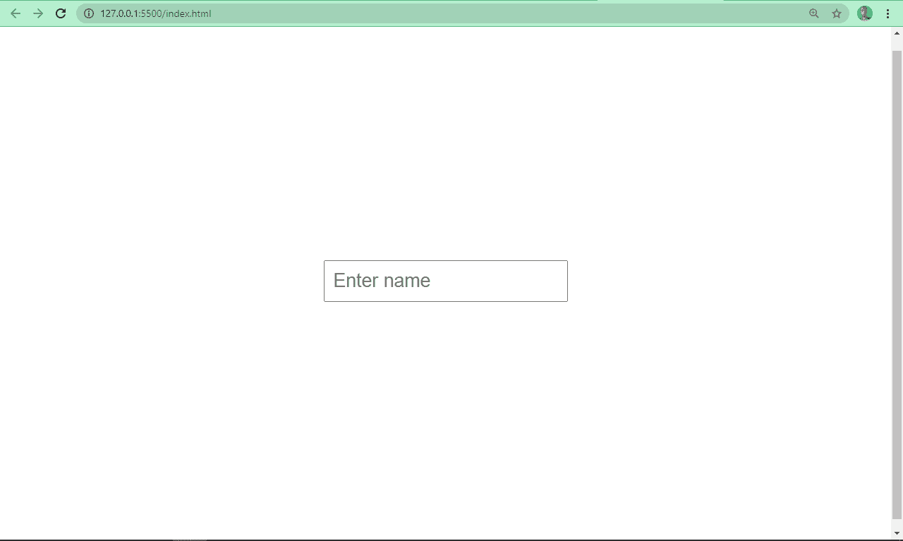

### 键入密码

顾名思义，带有密码类型的输入创建一个密码。它对用户来说是自动不可见的，除非它被 JavaScript 操纵。

```
<input type="password" placeholder="Enter your password" /> 
```


### 键入电子邮件

任何电子邮件类型的输入都定义了一个用于输入电子邮件地址的字段。

```
<input type="email" placeholder="Enter your email" /> 
```


### 型数

这种类型的输入只允许用户输入数字。

```
<input type="number" placeholder="Enter a number" /> 
```

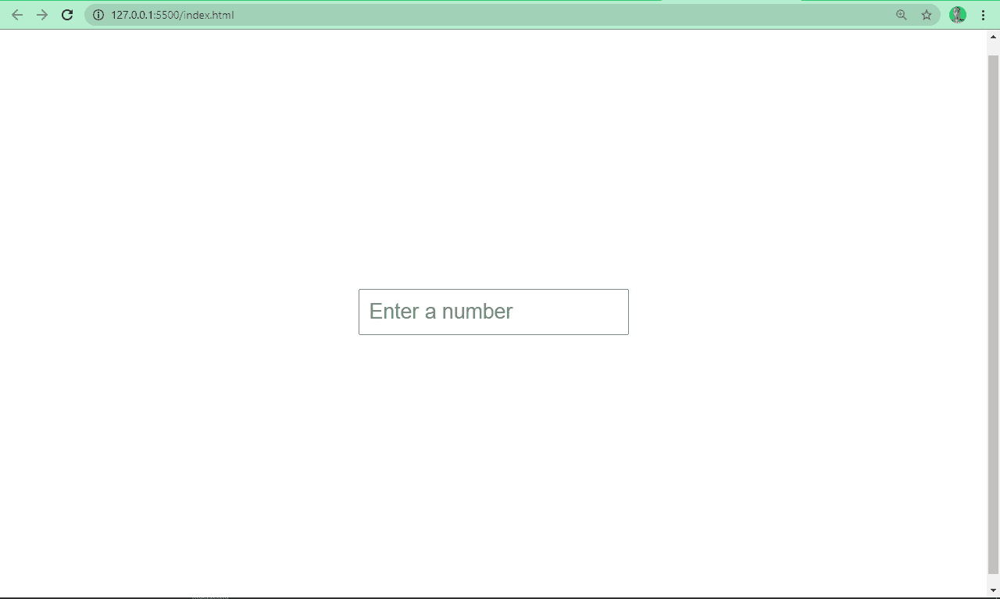

### 收音机类型

有时，用户需要从众多选项中选择一个。类型属性设置为“单选”的输入字段允许您这样做。

```
 <input type="radio" /> 
```

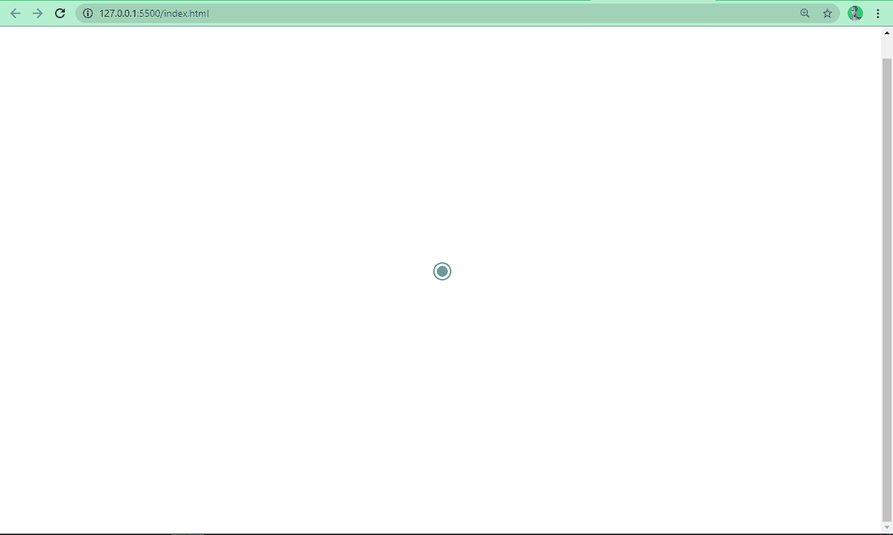

### 类型复选框

因此，有了输入类型的收音机，用户将被允许从众多选项中选择一个。如果你想让他们尽可能多的选择呢？这就是 type 属性设置为`checkbox`的输入所做的事情。

```
<input type="checkbox" /> 
```

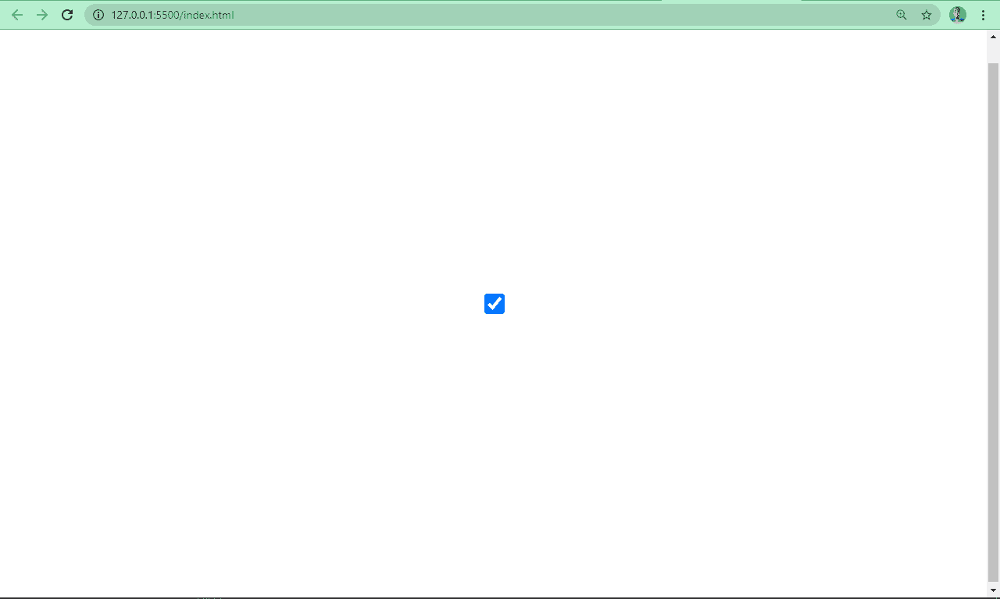

### 提交类型

您可以使用此类型将提交按钮添加到表单中。当用户单击它时，它会自动提交表单。它接受一个 value 属性，该属性定义了出现在按钮内部的文本。

```
<input type="submit" value="Enter to Win" /> 
```

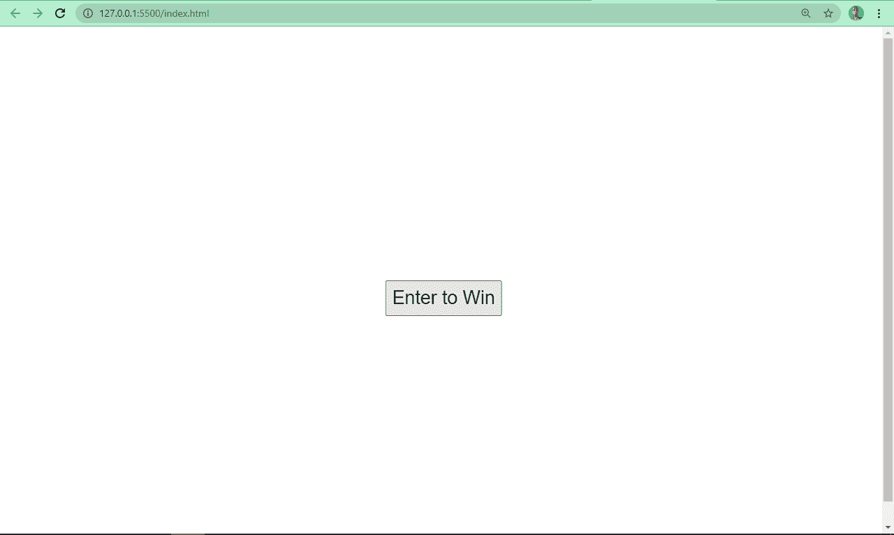

### 类型按钮

类型设置为 button 的输入会创建一个按钮，该按钮可以由 JavaScript 的 onClick 事件侦听器类型操作。它创建了一个按钮，就像 submit 的输入类型一样，只是默认情况下这个值是空的，所以必须指定它。

```
<input type="button" value="Submit" /> 
```

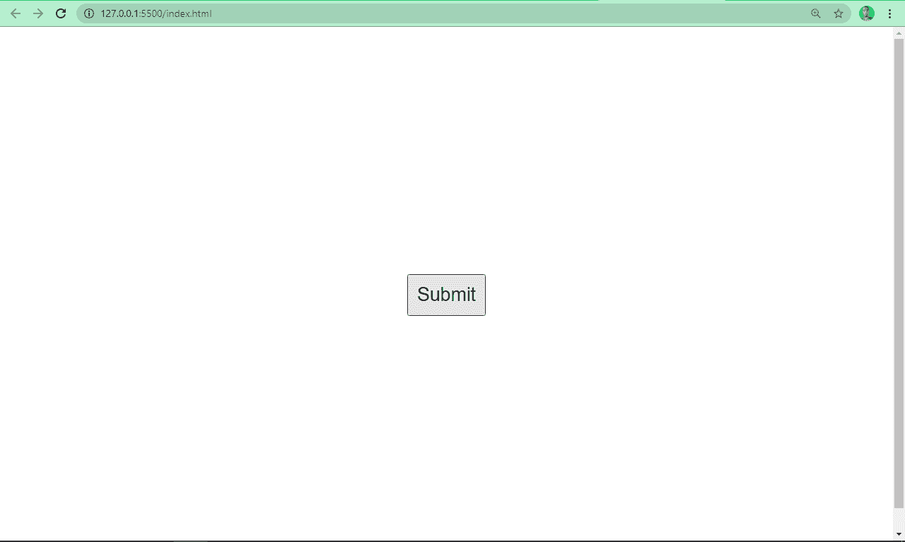

### 类型文件

这为文件提交定义了一个字段。当用户单击它时，会提示他们插入所需的文件类型，可能是图像、PDF、文档文件等。

```
<input type="file" /> 
```

输入类型文件的结果如下所示:

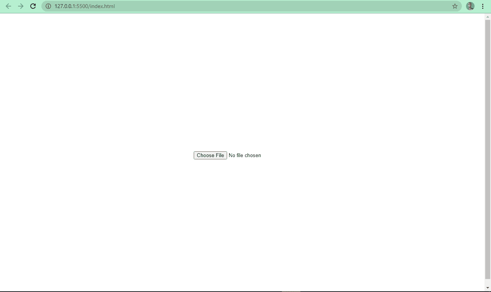

### 类型颜色

这是 HTML5 推出的花式输入类型。例如，用户可以通过它提交自己喜欢的颜色。黑色(#000000)是默认值，但可以通过将该值设置为所需的颜色来覆盖。

许多开发人员把它作为一个技巧来选择 RGB、HSL 和字母数字格式的不同颜色。

```
<input type="color" /> 
```

这是颜色输入类型的结果:

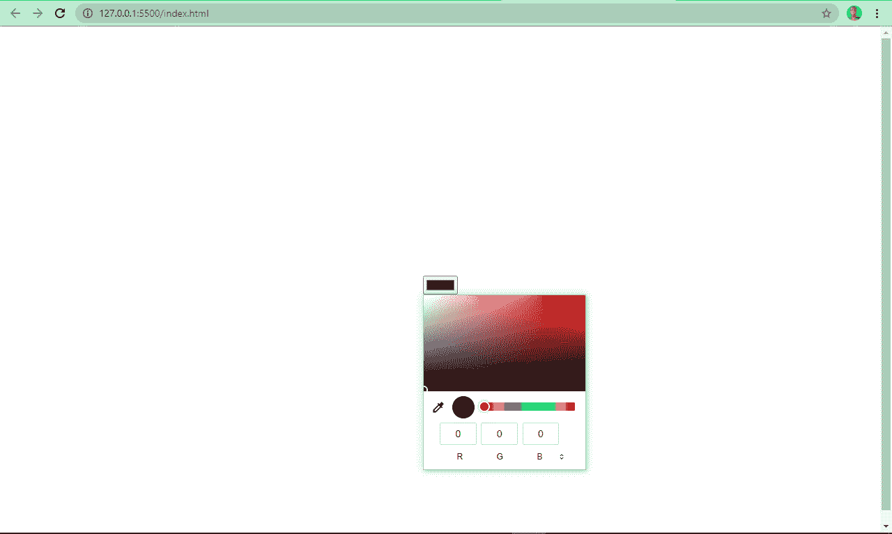

### 类型搜索

搜索类型的输入定义了一个文本字段，就像文本的输入类型一样。但是这次它的唯一目的是搜索信息。它与键入文本的不同之处在于，一旦用户开始键入，就会出现一个取消按钮。

```
<input type="search" /> 
```

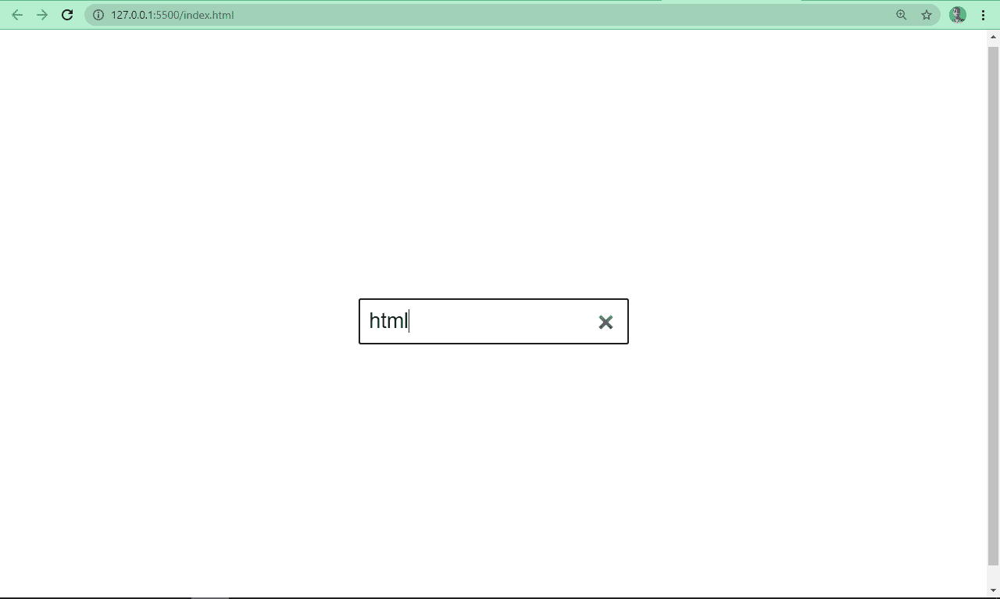

### 键入 URL

当输入标记的 type 属性设置为 URL 时，它会显示一个用户可以输入 URL 的字段。

```
<input type="url" /> 
```

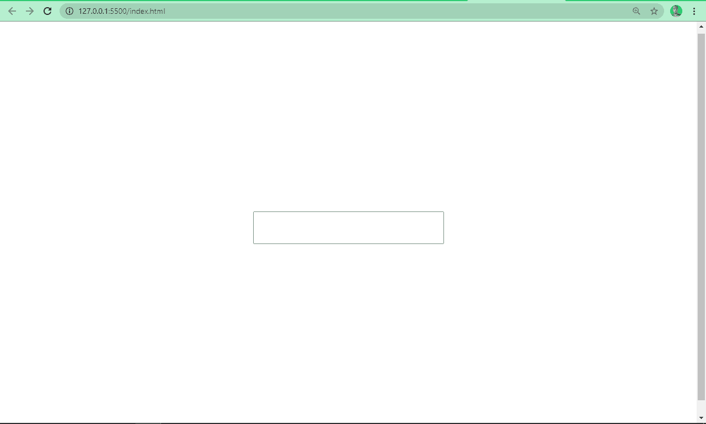

### 电话类型

电话输入类型允许您从用户那里收集电话号码。

```
<input type="tel" /> 
```

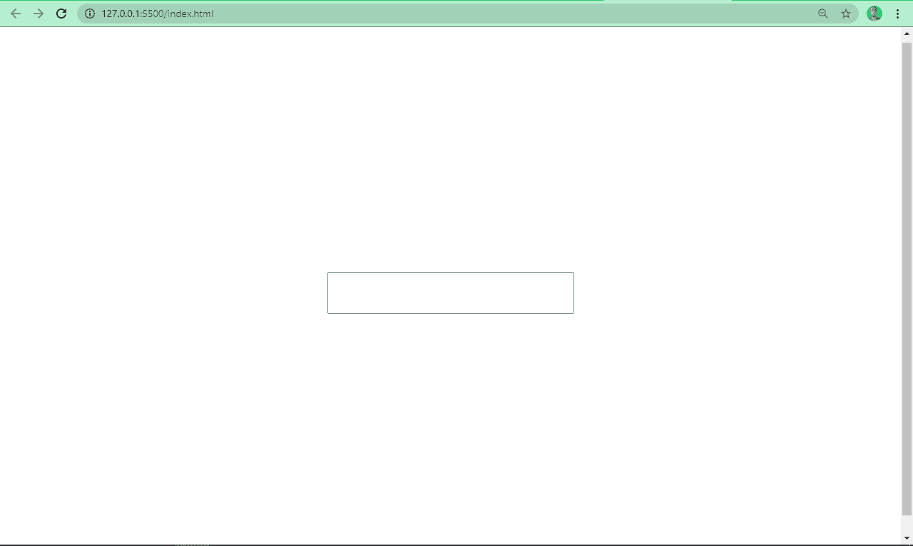

### 键入日期

你可能已经注册了一个网站，在那里你请求某个事件的日期。该站点可能使用类型值设置为 date 的输入来实现这一点。

```
<input type="date" /> 
```

日期类型的输入如下所示:

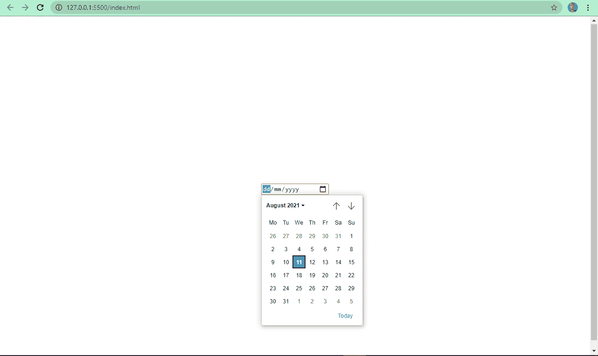

### 类型日期时间-本地

这类似于输入类型 date，但是它也允许用户选择一个带有特定时间的日期。

```
<input type="datetime-local" /> 
```

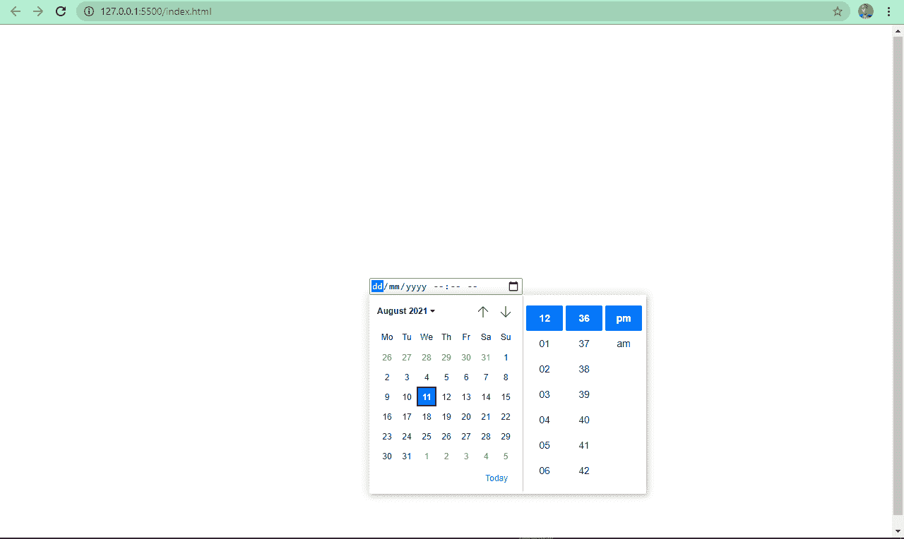

### 键入周

“周”输入类型允许用户选择特定的一周。

```
<input type="week" /> 
```

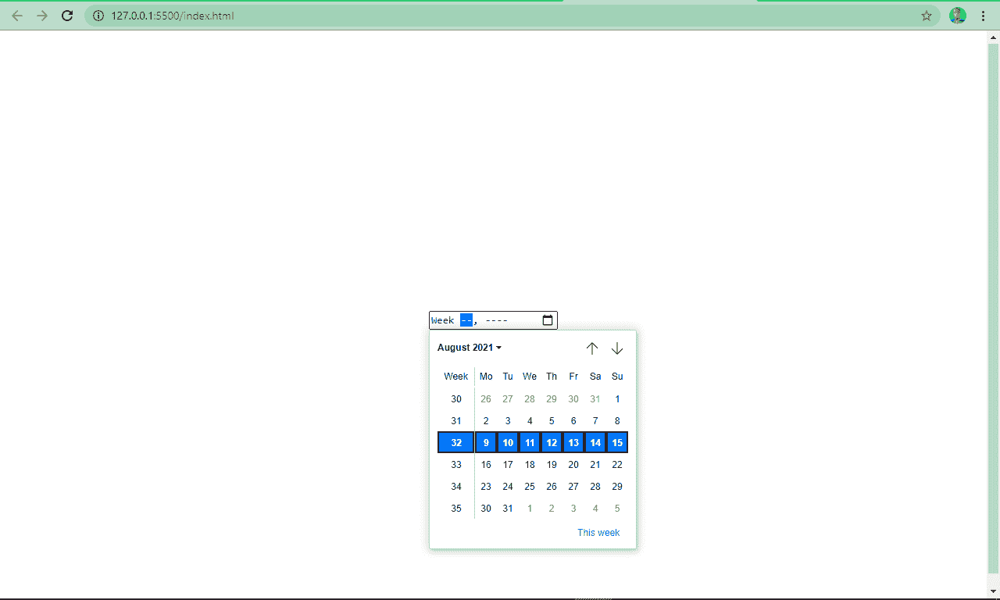

### 键入月份

具有月份类型的输入填充月份，供用户在单击时选择。

```
<input type="month" /> 
```

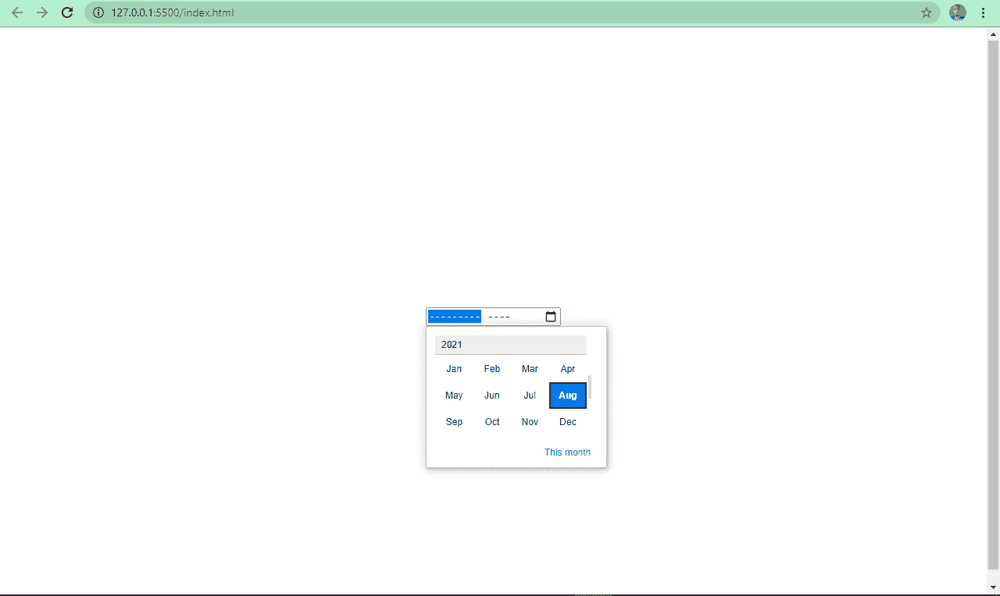

### 文本区域

有时用户需要填写多行文本，这不适合文本输入类型(因为它指定了单行文本字段)。

`textarea`让用户这样做，因为它定义了多行文本输入。它有自己的属性，比如用`cols`表示列数，用`rows`表示行数。

```
<textarea cols="50" rows="20"></textarea> 
```

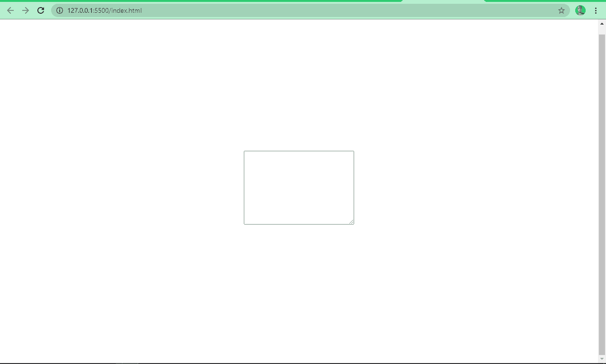

### 多选框

这就像一个包中的单选按钮和复选框。它用两个元素嵌入页面——一个`select`元素和一个`option`,后者总是嵌套在`select`中。

默认情况下，用户只能选择其中一个选项。但是对于多个属性，您可以让用户选择多个选项。

```
<select>
      <option value="HTML">Select a Language</option>
      <option value="HTML">HTML</option>
      <option value="CSS">CSS</option>
      <option value="JavaScript">JavaScript</option>
      <option value="React">React</option>
</select> 
```

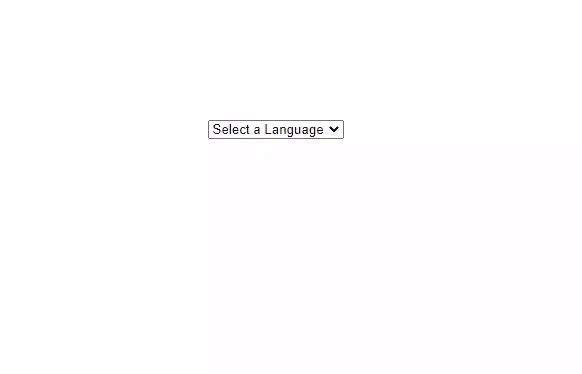

## 如何标记 HTML 输入

为表单控件分配标签非常重要。当它们通过它们的`for`属性和输入的`id`属性正确地连接到输入字段时，用户可以更容易地使用，因为他们只需单击标签本身就可以访问输入。

```
<label for="name">Name</label>
<input type="text" id="name" /> <br />
<label for="check">Agree with terms</label>
<input type="checkbox" id="check" /> 
```

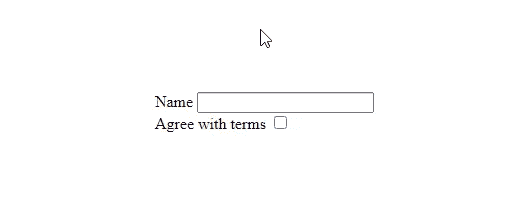

## HTML 表单如何工作

当用户填写表单并使用提交按钮提交表单时，表单控件中的数据通过`GET`或`POST` HTTP 请求方法发送到服务器。

那么服务器是怎么表示的呢？form 元素有一个 action 属性，该属性的值必须指定给服务器的 URL。它还接受一个方法属性，其中指定了它用来将值传递给服务器的 HTTP 方法。

该方法可以是`GET`或`POST`。使用`GET`方法，当提交数据时，用户输入的值在 URL 中是可见的。但是使用`POST`，值是在 HTTP 头中发送的，所以这些值在 URL 中是不可见的。

如果表单中没有使用 method 属性，就会自动假定用户想要使用 GET 方法，因为这是默认方法。

那么什么时候应该使用`GET`或`POST`方法呢？使用`GET`方法提交非敏感数据或从服务器检索数据(例如，在搜索过程中)。提交文件或敏感数据时使用`POST`请求。

## 迷你项目:建立一个基本的联系方式

让我们利用所学的表格知识，制作一个简单的联系表格。我还将介绍几个新概念，以使其更加完整。

### 这是 HTML:

```
<form action=example-server.com">
      <fieldset>
        <legend>Contact me</legend>
        <div class="form-control">
          <label for="name">Name</label>
          <input type="name" id="name" placeholder="Enter your name" required />
        </div>

        <div class="form-control">
          <label for="email">Email</label>
          <input
            type="email"
            id="email"
            placeholder="Enter your email"
            required
          />
        </div>

        <div class="form-control">
          <label for="message">Message</label>
          <textarea
            id="message"
            cols="30"
            rows="10"
            placeholder="Enter your message"
            required
          ></textarea>
        </div>
        <input type="submit" value="Send" class="submit-btn" />
      </fieldset>
</form> 
```

#### 这段 HTML 代码是怎么回事？

首先，一个`form`元素包围了所有其他元素。它有一个设置为`“example-server.com”,`的动作，这是一个将接收表单数据的虚拟服务器。

在 form 元素之后，每隔一个元素也被一个下面有一个标签的`fieldset`元素包围。

我们使用`fieldset`元素将相关的输入分组在一起，并且`legend`标签包含一个标题来传达表单的内容。

输入`name`、`email`和`textarea`都在一个`div`中，带有一个表单控制类。因此，它们的行为就像一个块元素，以使 CSS 的样式更容易。

它们也用`required`属性进行验证，所以当这些字段为空或者用户未能以适当的格式键入值时，表单将无法提交。

做完这些，我们会得到下面截图中的结果:
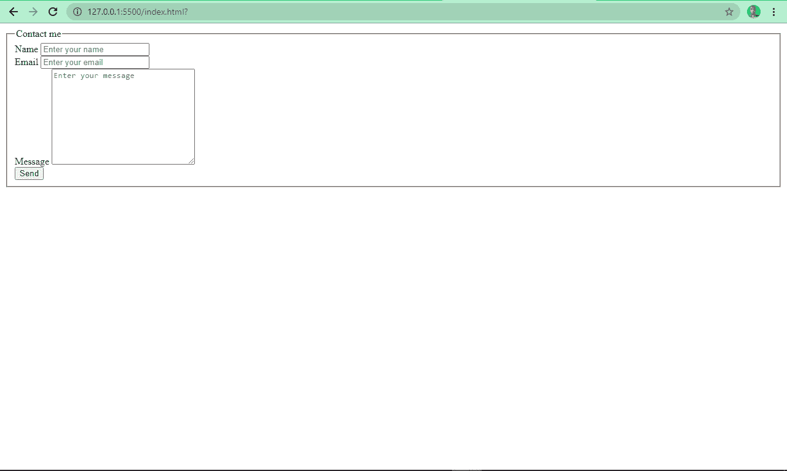

那有多丑？我们需要应用一些造型！

### 这是 CSS:

```
body {
    display: flex;
    align-items: center;
    justify-content: center;
    height: 100vh;
    font-family: cursive;
  }

 input,
    textarea {
    width: 100%;
    padding: 5px;
    outline: none;
  }

  label {
    line-height: 1.9rem;
  }

  input[type="submit"] {
   transform: translate(2.2%);
   padding: 3px;
   margin-top: 0.6rem;
   font-family: cursive;
   font-weight: bold;
  }

 fieldset {
   padding: 20px 40px;
 } 
```

#### CSS 代码在这里做什么？

我们使用 Flexbox 水平居中主体中的所有内容，使用 100%的视口高度垂直居中。我们使用了草书字体系列。

我们给输入和`textarea`一个 100%的宽度，这样它们就能一直穿过去。标签的最小行高为 1.9 雷姆(30.4 像素)，因此它们不会太靠近各自的输入。

我们用 transform 属性专门设计了按钮(输入类型按钮)的样式，当它有点偏离中心时，把它推到中心。我们给它添加了 3px 的填充，以增加周围的空间。然后我们为它选择了一个粗体的草书字体系列。

因为按钮离`textarea`太近，我们设置了一个 0.6 雷姆的边距上限来把它向下推一点。

我们在顶部和底部给了 fieldset 元素 20px 的填充，在左侧和右侧给了 40px 的填充，以推开它在包裹它的`form`元素周围创建的边框。

在这一切的最后，我们得到了下面这个美丽的形式:
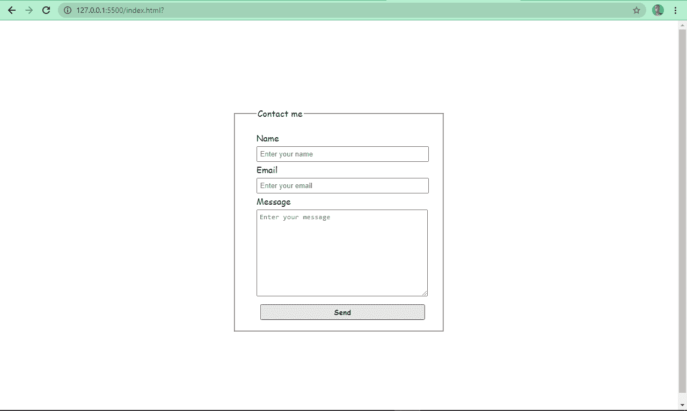

## 结论

我希望这篇教程能帮助你理解表单是如何工作的。现在，您应该已经掌握了将表单集成到网站中所需的知识，这样您就可以开始收集数据了。

感谢阅读，继续编码。