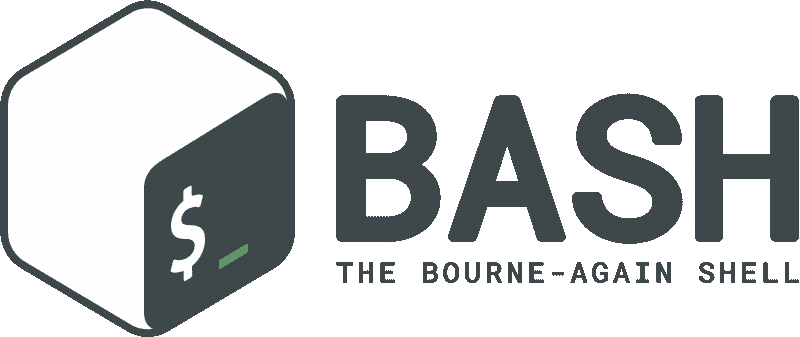

# 那次我不小心重写了 Bash…在 Bash 中

> 原文：<https://www.freecodecamp.org/news/i-accidentally-overwrote-bash-in-bash-e612da33da4b/>

雅各布·伊夫林

# 那次我不小心重写了 Bash…在 Bash 中



### “我知道我在做什么。”

五年前，在我第一份编程工作的几个星期后，我在`bash`里试着运行一些代码。

我变得越来越沮丧。为什么那个文件不在我的`$PATH`里？应该是这样的，我确信这一点。

但是，越来越渴望让*的东西*工作，我把文件移到了一个我知道在`$PATH`的文件夹里:

```
> mv ./file.whatever /bin
```

至少，我*是这个意思*打字。实际上，我输入的是:

```
> mv ./file.whatever /bin/bash
```

我的雇主提供的 MacBook Pro 像任何好的 UNIX 系统一样对我大喊:

```
mv: rename ./file.whatever to /bin/bash: Operation not permitted
```

像任何优秀的程序员一样，我盲目地添加了一个`sudo`，并以最快的速度输入了我的密码。*愚蠢的电脑，以为它比我懂。*

在不知不觉中覆盖了我正在使用的 shell 之后，我震惊地发现我的代码仍然无法运行。

### “我不知道我在做什么，但没关系。”

我打开了一个新的 OS X 终端标签，尝试一种新的方法来运行我的代码，结果看到了这个:

```
> permission denied: ./file.whatever
```

```
[Process completed]
```

*嗯，太奇怪了。不知道为什么`bash`不工作，但至少它对我的文件做了些什么！*

我切换回之前打开的 shell，继续尝试几个命令。当然，它们仍然工作，因为在我重写其可执行文件时，`bash`程序已经在内存中了。

因此，一些终端标签不起作用，但另一些却起作用。可能是机器里的鬼魂。

为了解决这种奇怪但肯定可能没什么大不了的行为，我决定做一个屡试不爽的万灵药:退出应用程序(终端)并再次打开它。

### “天哪！我做了什么？”

不知从哪里，发生的事情像滚雪球一样打在我的脸上。哦，不，不，不，不，我只是重写了 Bash。


我不再关心让我的代码运行。我只想回到从前。

### “这可能是可以修复的…”

我花了很长时间在谷歌上搜索“删除的 bash”和“下载新的 bash OS X”，但毫无结果。我太惊慌了，以至于没有考虑使用其他的 shell——我隐约知道一些，但是没有意识到已经安装在我的机器上了。(我当然没有意识到这些 shells 也可以通过改变终端应用程序中的设置来使用。# Facebook)

最终，我不好意思地向一些同事坦白了我所做的事情，在我们都开怀大笑之后，我让其中一个人给我发了一份他的`bash`程序的副本，这样我就可以手动将它移回到 Finder 的`/bin`文件夹中。(点击式界面万岁！)

除了… Finder 不让我去`/bin`文件夹。OS X(至少是它的那个版本)隐藏了`/bin`和其他它认为对像我这样爱管闲事的用户来说不安全的系统文件夹。*愚蠢的电脑，自以为比我懂得多。*

所以我又搜索了一些，这次是“在 Finder 中查看隐藏的文件夹”我找到了一些不同的方法来做到这一点，但是*每一个方法*都要求我在`bash`中输入一些神奇的命令，我再也打不开了。孩子们:如果你删除了你的 shell 但是打开了它的一个实例，不要关闭它！

### “好吧…这也许可以解决…”

不知道下一步该做什么，我找到了该公司的一个旧的内部问答系统，并张贴了我的问题的快速描述，试图在语气上取得平衡*嘿这是一个有趣但可能并不罕见的情况，对吗？*和*请有人谁来帮帮我我很恐慌*。这个网站看起来好像不再被使用了，但是我希望当一个问题被发布时有人能收到一封电子邮件。

你瞧，我的万福玛利亚很快得到了回应:有人建议从 Linux [Live CD](https://en.wikipedia.org/wiki/Live_CD) 启动(那是在计算机有 CD 驱动器的时候)，然后从 Linux 内部访问我的 OS X 文件系统，将`bash`添加回它应有的位置。我理解了这个建议的三分之一，但还是继续下去了——我还有其他选择吗？我找到了一张 Linux 光盘，做了一堆我不明白的事情来让它工作，然后不耐烦地等待机器完成所有无数的设置步骤，直到——*瞧！*一个桌面出现了！

我四处搜索，直到找到如何挂载 OS X 文件系统，然后迫不及待地打开`bash`(多好的感觉啊！)将那台机器的`bash`可执行文件复制回 OS X……却遇到一条错误消息:OS X 分区在 Linux 上是只读的。我确实找到了一种使它可写的方法，但是这需要在 OS X 重启，并且——你猜对了——在`bash`运行一个命令。

我尝试了几个不同的 Linux Live CDs(每一个都花了大约 40 分钟不耐烦的踱步来引导)，但是每一个都有相同的结果。同样:如果你删除了你的 shell 但是打开了它的一个实例， ***不要*** 关闭它！

### "可修复到底是什么意思？"

不知道该何去何从，我再次联系同事，然后*我发现了！* —有人知道如何在 Finder 中导航到任何文件夹，甚至是隐藏的文件夹。我所要做的就是再次在 OS X 重启，将通过电子邮件发送的`bash`可执行文件复制到`/bin`，一切都会变得简单。所以我关闭了 Linux，取出了 Live CD，在 OS X 重启，然后…

嗯。我无法登录，因为，嗯，OS X 的登录过程使用了一个外壳，猜猜那是哪个外壳？

难道我注定要靠 Linux Live CDs 度过余生吗？我想象着自己在未来的岁月里，一个喋喋不休的隐士，不停地吓唬新来的孩子们:*“不要删除巴什，否则你会像疯狂的老杰克一样结束。”*


### “我从未如此高兴地看到错误消息”

我已经放弃了所有的希望，这时另一个同事(天哪，这些人知道的真多！)告诉我关于[单用户模式](https://en.wikipedia.org/wiki/Single_user_mode)，一种特殊的 OS X 启动模式，可以帮助你解决登录(和其他)错误。单用户模式让我通过一个不同的 shell(我想是`/bin/sh`)启动一个 OS X 的命令行版本。从那以后，只需要找到正确的咒语就可以将`bash`可执行文件放回`/bin`并从 USB 驱动器中取出(我把它放在另一个极其缓慢的 Linux Live CD 引导版本中)。

完成后，我重启了 Mac，一切终于又恢复正常了！当然，除了我的代码仍然没有运行。