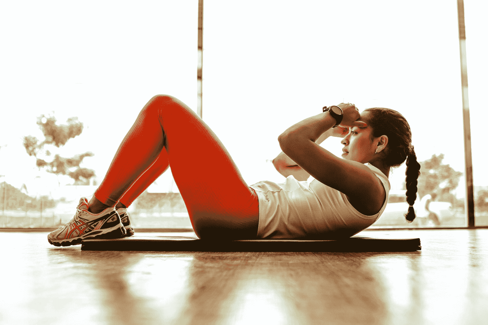
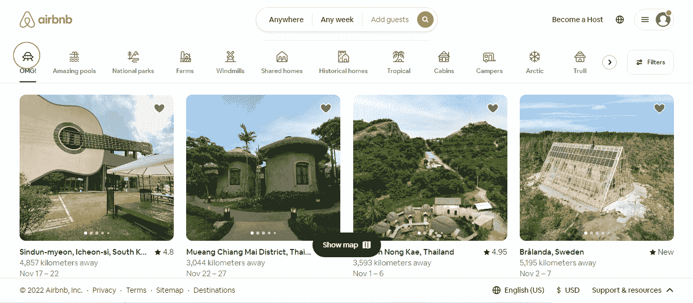
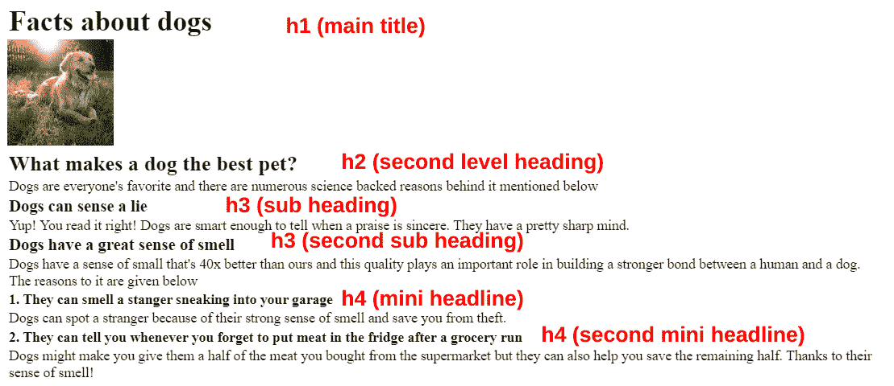
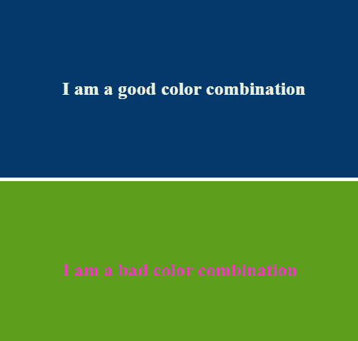

# 如何提高网站的可访问性——7 个有用的提示

> 原文：<https://www.freecodecamp.org/news/improve-website-accessibility-with-these-tips/>

一个可访问的网站被设计成任何人都可以毫无困难地使用它。

在网站开发过程中，您希望确保最终用户拥有最佳的用户体验。这包括残疾人或那些在使用网站时面临挑战的人。

不幸的是，仍然有一些网站没有使用可访问性最佳实践。但你可以确保你的能做到。

如果你在 web 开发过程中牢记一些事情，你可以改善所有用户的用户体验，包括[能力不同的](https://dictionary.cambridge.org/dictionary/english/differently-abled)用户。
下面是一些有用的提示，你可以用来提高网站的可访问性。

## 向图像添加替代文本

您可能听说过在 HTML5 中的图像标签上添加 alt 文本的重要性。那么如何使用它们呢？你是否为网页上的每张图片都提供了替换文字？

图像替代文本使有视觉障碍的人更容易理解网页的内容。但是，您应该只为有助于理解内容的信息性图像包含替代文本。

装饰图像应该有空的替代文本。这告诉屏幕阅读器图像提供的信息并不重要，事实上可能会降低用户体验。

**信息**图像是传达与内容相关的重要信息的图像。你应该能够用简短的文字描述它们的内容。

假设我们有一个健身博客，正在写一篇关于如何在家锻炼的文章，我们在文章中使用了下面的图片。



Photo by [Jonathan Borba](https://unsplash.com/ja/@jonathanborba?utm_source=unsplash&utm_medium=referral&utm_content=creditCopyText) on [Unsplash](https://unsplash.com/s/photos/workout?utm_source=unsplash&utm_medium=referral&utm_content=creditCopyText)

这张图片应该是向博客读者传达一个信息，告诉他们你在锻炼时需要什么。此图像的替代文本可能如下所示:

```
 
```

我们为图像提供的替代文本清楚地告诉视障用户我们的图像所传达的信息。

另一方面，装饰性的图片在网页上只起到装饰的作用——也许它们只是分解了内容或者补充了文本中的一般描述。

用作图标的图像是装饰图像的一个很好的例子。Airbnb 主页有一个导航栏，上面有多个图标(就像红色圆圈中的那个)，指示 Airbnb 上不同类型的居住空间。导航栏中使用的图标是为了装饰，我们可以将它们的替代文本留空。



Airbnb homepage

```
<!-- Example of decorative image -->

```

## 维护标题层次结构

如果你没有在正确的层次结构中使用标题(从最大的

# 到最小的

###### ，屏幕阅读器可能会认为缺少了一些内容。

因此，最好只对主标题使用

# ，对标题后面的标题使用

## ，对副标题使用 h3，以此类推。

考虑下面的例子:我们有一个带有几个标题的网页。

# 用于文档标题，

## 用于二级文档标题，

### 用于副标题，

#### 用于小标题(

### 之后的标题)。



Heading hierarchy example

下面是这个网页的代码。请注意其中不同的标题标签:

```
<h1>Facts about dogs</h1>

<h2>What makes a dog the best pet?</h2>
<p>Dogs are everyone's favorite and there are numerous science backed reasons behind it mentioned below</p>
<h3>Dogs can sense a lie</h3>
<p>Yup! You read it right! Dogs are smart enough to tell when a praise is sincere. They have a pretty sharp mind.</p>
<h3>Dogs have a great sense of smell</h3>
<p>Dogs have a sense of small that's 40x better than ours and this quality plays an important role in building a stronger bond between a human and a dog. The reasons to it are given below</p>
<h4>1\. They can smell a stanger sneaking into your garage</h4>
<p>Dogs can spot a stranger because of their strong sense of smell and save you from theft.</p>
<h4>2\. They can tell you whenever you forget to put meat in the fridge after a  grocery run</h4>
<p>Dogs might make you give them a half of the meat you bought from the supermarket but they can also help you save the remaining half. Thanks to their sense of smell!</p>
```

## 为输入字段使用 Aria 属性或标签标记

Aria 标签或

```
<!-- Aria label example -->
<input type="text" placeholder="Enter your name" aria-label="Enter your name">

<!-- Label tag example -->
<label>Full Name: <input type="text" placeholder="Enter your name"></label> 
```

示例一为屏幕阅读器使用 aria 属性来读取用户应该在名称输入字段中输入的内容。

第二个例子使用了带有文本全名的

## 提供关键字功能

并不是所有的用户都能使用鼠标，但是很多网站并没有为用户提供键盘功能。这阻碍了只使用键盘的用户返回你的网站。

一个简单的例子是向表单的提交按钮添加一个 click 事件侦听器，而不是使用 onsubmit 事件(它要求用户单击来提交表单)。看看下面的例子:

```
<!-- Example one -->
<form>
	<label>Full name: <input type="text" value=""></label>
    <label>Email: <input type="email" value=""></label>
    <button onclick="handleSubmit>Submit</button>
</form>

<!-- Example two -->
<form>
	<label>Full name: <input type="text" value=""></label>
    <label>Email: <input type="email" value=""></label>
    <button>Submit</button>
</form>
```

示例一在提交按钮上使用了一个点击事件监听器。这意味着按键盘上的 enter 键不会提交表单。

示例二使用 onsubmit 事件，并为该事件分配一个 JavaScript 函数。这样，点击或输入按钮都可以运行 handleSubmit 函数。

## 使用可访问的调色板

糟糕的颜色对比会破坏正常人和残疾人的整体体验。所以在设计网站时，正确的对比和互补色是很重要的。

有一些像[对比度检查器](https://webaim.org/resources/contrastchecker/)这样的工具可以帮助你了解你的颜色对比度是否足够明显。易访问的颜色对比有助于残障人士区分网页上的元素。请看下面好的和不好的颜色组合的例子。



Example of good and bad color combination

第一个盒子有深蓝色背景，使白色更容易阅读。另一方面，第二个框有一个绿色的背景，粉红色的文字不容易阅读，并导致眼睛疲劳。

## 为音频和视频内容提供替代品

听力或视力不好的用户可能会发现很难访问网站的音频和视频内容。

为了给他们提供更好的体验，请为您使用的任何音频提供脚本，并在您的视频内容上添加易于阅读的字幕。

## 确保内容易于理解

易于理解的内容没有难以解释的术语和技术短语。

假设你经营一家分析公司，并且是数据科学领域的专家。但是你的用户可能包括当前或潜在的客户和求职者。这些人可能没有足够的技术知识来理解充满术语的内容。

> 我们是一个分析专家团队，擅长从所有可用的仓库中聚合数据，检测异常，对大量数据执行批处理，并应用强大的算法来解决您的业务需求。

上面的文字充满了并非每个人都能理解的分析术语。这会让你失去你的访客——如果他们不能理解你的工作，他们为什么要投资你呢？

下面是同一篇文章的简化版本，使用了每个人都能理解的更通俗易懂的术语:

> 我们是一个专家团队，专门从所有可用来源收集数据，识别数据中的错误，在更短的时间内更准确地处理大量数据，并做出预测以解决您的业务需求。

确保你的内容用每个人都容易理解的语言来表达它的目的。

## 结论

可访问的网站对于良好的用户体验至关重要。一个易访问的网站不仅能吸引新用户，还能鼓励老用户反复访问。

谈到网站的可访问性，你可以做的还有很多。但是有了这些提示和技巧，你可以显著提高你的网站或应用的 UX。

我希望这些技巧能帮助你在即将到来的项目中提供更好的用户体验。

开发无障碍网站，让互联网成为每个人更好的地方！

有兴趣在 LinkedIn 上联系吗？在[图巴·贾马尔](https://www.linkedin.com/in/tooba-jamal/)给我打电话