# 用 Firebase，Riverpod 和 Freeze 实现无限分页

> 原文：<https://www.freecodecamp.org/news/infinite-pagination-in-flutter-with-riverpod/>

当你开发一个应用程序时，你必须决定如何加载数据。这通常会带来无限分页的问题。

您可能不会向用户显示数据库中所有可用的项目。您可以获取前 10-20 个项目，并在用户滚动时加载接下来的项目。

这不仅节省了对数据库不必要的读取，还提高了按需加载项目的性能。如果你想开发高质量的应用，做好这一点至关重要。我有机会为我的一个客户开发一个 B2B 应用程序，拥有良好的分页体验对我们的应用程序至关重要——无论是在获取操作还是用户体验方面。

在本教程中，我将向您介绍我采用的方法，以便您可以在自己的应用程序中构建此功能。这篇文章主要面向那些已经对 Flutter Slivers、Firebase、Riverpod 和 Freezed 有了基本了解，并且想用它们来创建一些很酷的东西的读者。

这不太像一个教程，而是我想分享的东西，我认为这是对这些包的分页实现的一个有趣的看法。

一旦您理解了这些实现背后的原因，那么您就可以用您选择的其他状态管理和 DB 解决方案来复制它。

此外，在不超出本文范围的情况下，我尽量让事情变得清晰，并添加了后续支持文章/文档的链接。

## 我们将在此介绍的内容:

1.  我们正在使用的工具/包概述
2.  特征分解
3.  如何获取和限制项目
4.  如何在滚动时获取数据
5.  如何缓存或存储提取的项目
6.  如何管理正在进行的状态
7.  你可以做一些改进

## 以下是我们将使用的工具和软件包:

*   **[云火商店](https://firebase.google.com/docs/firestore) :** 来自 Firebase 的 NoSQL 数据库解决方案。
*   **[Riverpod](https://riverpod.dev/) :** 来自提供者作者的状态管理库。
*   **[冻结](https://pub.dev/packages/freezed) :** 用于联合/模式匹配/复制的代码生成器。通常用于使用 from 和 to json 方法生成类模型。

如果你想看的话，这里有源代码:[用 Riverpod，Freezed，Firebase](https://github.com/rutvik110/infinite_pagination) 在 Flutter 中无限分页。

## 特征分解

为了让事情更容易理解和处理，我总是试图把它们分解成不同的状态。这样，你会对正在发生的事情有一个抽象的概念，我们可以一个接一个地处理每个任务，这样我们就不会不知所措。

我们的分页功能有以下不同的状态:

### 初始提取状态

以下是加载、数据和错误状态的样子:

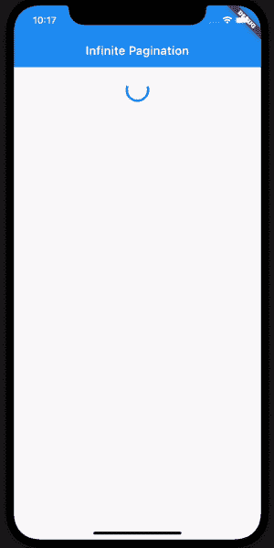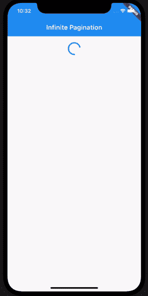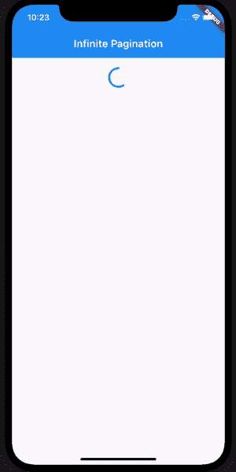

Initial Loading, Data, Error states

### 
第一次获取状态后(OnGoingStates)

正在加载、正在数据和正在出错状态应该是这样的:

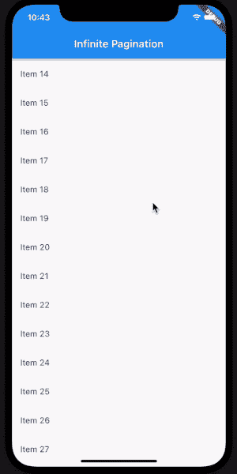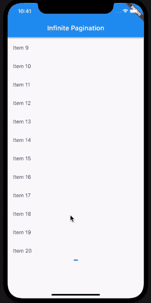

OnGoingLoading, OnGoingData, OnGoingError states.

好了，现在我们已经看到了我们不同的州会是什么样子，让我们开始吧。

## 如何获取和限制数据

我运行了一个示例应用程序——除了从 Firebase 获取数据之外，它没有做任何特别的事情。

我们使用 [Slivers 进行滚动](https://docs.flutter.dev/development/ui/advanced/slivers)行为，我们使用来自 Riverpod 的[消费者通过一个从 Firebase 获取项目的未来提供商加载数据。我已经在 Firebase (*Firestore)中添加了一些数据，所以我们将只使用这些数据。](https://riverpod.dev/docs/concepts/reading/#consumer-and-hookconsumer-widgets)

通过消费者加载项目:

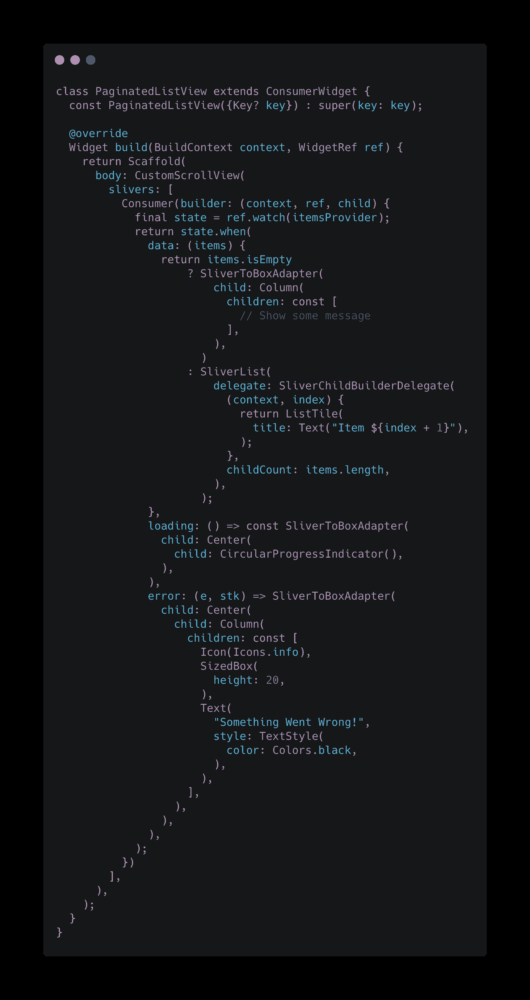

Loading initial items through a consumer using Slivers

声明供应商:

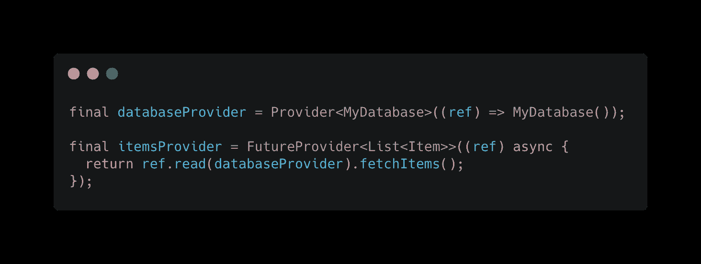

Declaring database class provider and the futureProvider that returns the items from the database.

我的数据库类:

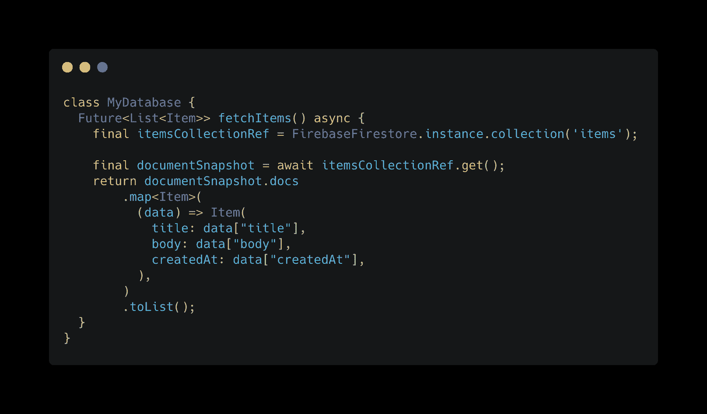

Database class with a method called fetchItems() which fetches the items from a Firestore collection called "items" and returns them.

这里有一个预览，这将是什么样子:

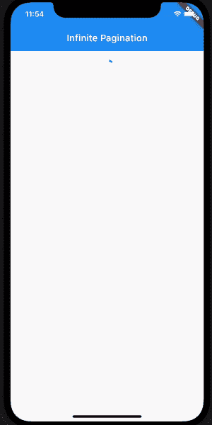

Loading items from Firebase into the app. Showing initial loading, ondata states.

如您所见，我们正在获取所有可用的信息，这不是很好！我们想限制我们获取的项目数量。

我们可以在 Firebase 查询中使用 **`.limit(n)`** 来实现。我们将限制为 20 个项目，并通过 **createdAt** 字段按降序排列项目。

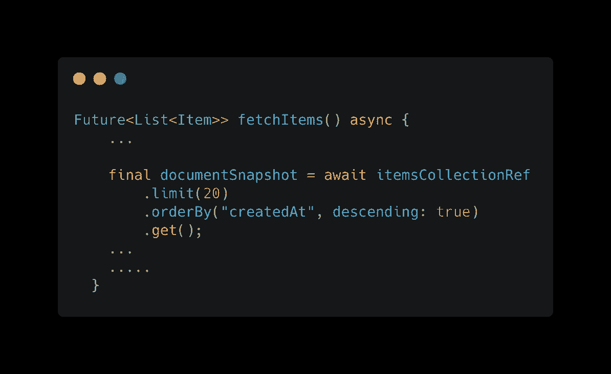

Limiting the number of items fetched with the help of .limit(n) and ordering items based on "createdAt" value.

现在，我们只从数据库中获取最近的 20 个项目。🙌

根据某个唯一的、可用于排序的字段对项目进行排序在这里很重要。这是对项目进行分页的方法之一。这也称为基于光标的分页。

### 如何添加滚动回调机制

为了获得滚动信息，我们将创建一个 ScrollController 并将其传递给 CustomScrollView。

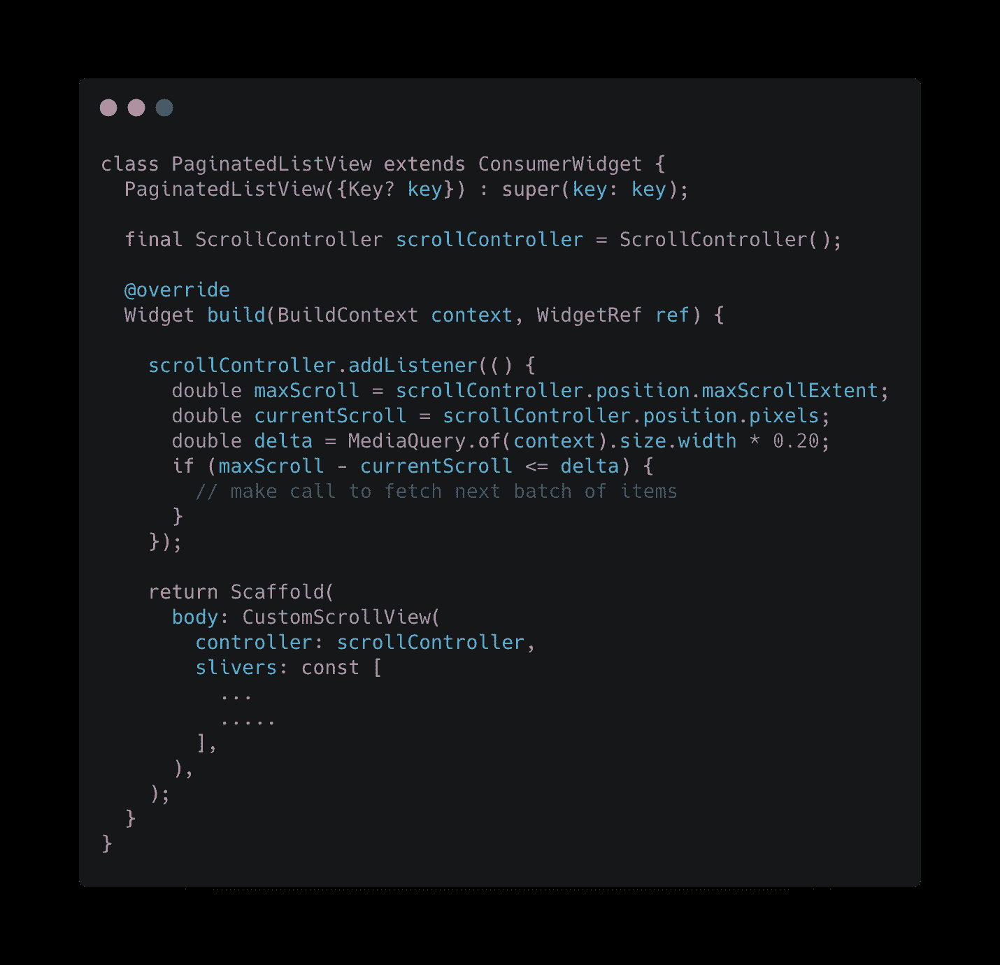

Added ScrollListener and listening to scroll events to make a call when scroll position is near the end of the items list.

*   **maxScroll** :用户在滚动轴上可以滚动的最大距离。
*   **currentScroll** :用户在滚动视图中的当前位置。
*   **delta** :距离底部的空间量。

我们将监听滚动事件，当 **maxScroll** 和 **currentScroll** 之差小于 **delta** 时，我们调用获取下一批项目。

## 如何存储和获取下一批

这会很有趣。让我们看看这里需要管理什么:

1.  如何存储已经获取的项目？
2.  如何建立逻辑，根据我们之前获取的内容获取下一批项目。

为了管理这两个功能，我们将在 Riverpod 中使用 [StateNotifiersProvider](https://riverpod.dev/docs/providers/state_notifier_provider/) 。使用它们将有助于我们将核心实现逻辑从 UI 层中分离出来，并在处理不同的获取状态和为获取调用构建逻辑时给予我们更多的灵活性。

这也是 Riverpod 推荐的管理状态的解决方案，状态可能会随着用户交互而改变。

以下是更新后的 itemsProvider:

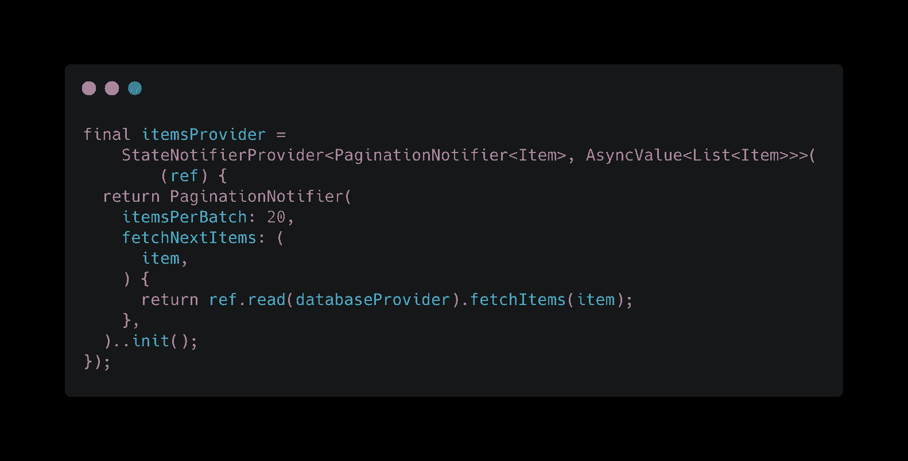

Updated itemsProvider to StateNotifierProvider which creates a PaginationNotifier with initial items count and fetchNextItems call back.

以下是 PaginationStateNotifier:

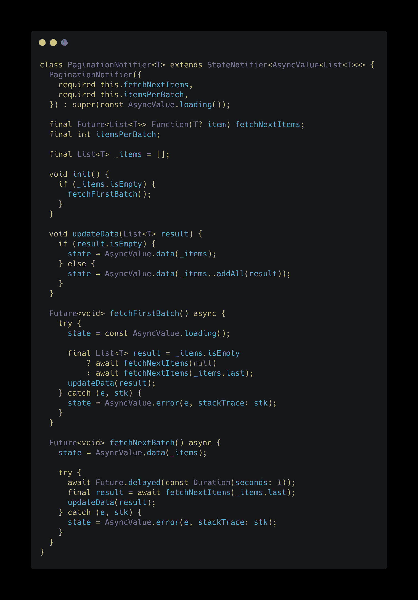

PaginationNotifier that will hold fetched items and handle all the logic related to different pagination states and fetch callbacks.

在这段代码中，我们通过扩展 StateNotifier 类来创建我们的 **PaginationNotifier** 。我们将它泛型化，用 **T** 表示类型，以使其可重用。

所以，让我把这里的事情过一遍:

*   **_items** :所有提取的项目都添加到该列表中。
*   **itemsPerBatch** :一批中的最大项目数。与我们在后端 firebase 查询的限制中设置的数量相同。
*   **胎记(T？item)** :这个函数将是实际调用获取项目的函数，它接受一个可空的项目。该**项目**是**项目**列表中的最后一个项目。如果是第一次获取项目或者 **_items** 为空，那么**为空**。
*   **fetchFirstBatch()** :将获取第一批项目并更新状态。
*   **fetchNextBatch()** :将获取下一批项目并更新状态。实现与现在的**fetchFirstBatch****几乎相同，除了两件重要的事情:
    ——首先，我们将状态更新为**。数据(_ 项)**。这是因为在加载下一批时，我们仍然希望显示先前获取的项目。
    –其次，在调用获取项目时，我们会传递 **_items** 列表中的最后一个项目。这一部分将在下一部分进行改进，我们将添加 OnGoingStates 来更好地处理这一问题。**
*   ****init()** :通知程序初始化时调用。如果物品是空的，我们就在这里调用获取第一批。**

**现在，让我们看看我们必须在后端逻辑中更新什么:**

**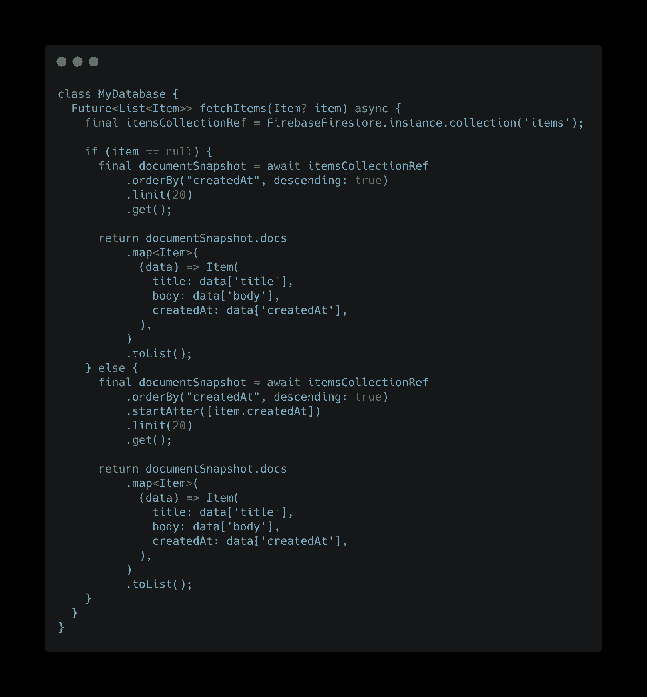

Database class fetchItems method updated for fetching next 20 items based on the last item fetched.** 

**所以我们现在在这里接受一个项目。如果项目为空，我们获取前 20 个项目。如果不是，那么我们使用一个**。startAfter()** 过滤我们的查询，它基本上说，“嘿！我想要在与我发送的值匹配的项目之后开始的项目。爽！”**

**这里回答得更专业一点:😅**

> **[startAfter()](https://firebase.google.com/docs/firestore/query-data/query-cursors) :获取一个[值]列表，创建并返回一个新的[查询]，该查询相对于查询顺序在所提供的字段之后开始。(来自 Firebase 文档)**

**在 UI 方面，我们不需要做任何改变。让我们运行这个，看看我们得到了什么！**

**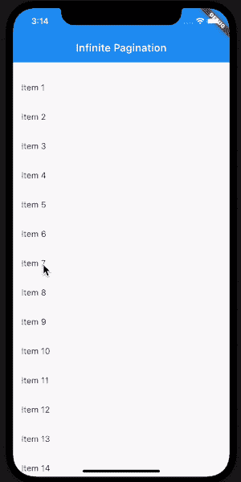

Loading next items on demand as user scrolls towards end of the items list.** 

**不错！当我们滚动到列表末尾时，我们正在加载下一批。是不是很酷？😁**

**现在我们想在显示器上工作。我们希望在列表的底部显示一个正在进行的加载或错误指示器，它将代表正在进行的状态。**

## **如何管理正在进行的状态**

**那么我们如何管理这些正在进行的状态并将它们呈现给用户呢？

嗯，这个没有单一答案。一种方法是在 StateNotifier 中创建一些变量，以枚举形式表示这些状态，并更新它们以指示正在进行的状态。这是我在第一次迭代中所做的，结果证明这不是一个很好的方法。**

**所以，让我们跳到对我有用的事情上。既然我们在这里要处理三种以上的状态，为什么不创建我们自己的 AsyncValue 版本来包含另外两种状态，即 OnGoingLoading 和 OnGoingError 状态呢？AsyncValue 只是映射到不同状态的联合。我们可以创造类似的东西。**

**我们可以通过使用 [Freezed](https://pub.dev/packages/freezed) 来做到这一点，这是一个代码生成库，用于创建联合等等。**

**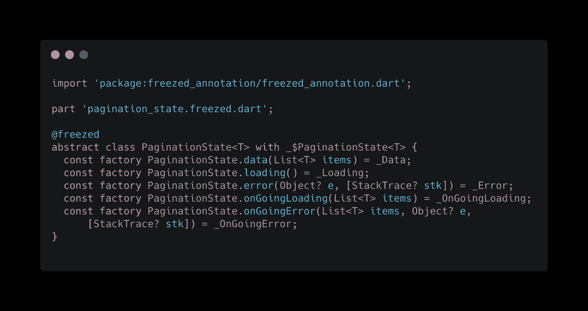

Creating our custom PaginationState union with Freezed.** 

**这里的前三种状态是不言自明的——它们是使用 AsyncValue 时经常与之交互的状态。

由于我们的 OnGoingLoading 和 OnGoingError 状态发生在我们的第一次调用之后，我们还希望在这个状态中显示以前获取的项目，因此我们有了 items 参数。以及用于 OnGoingError 状态的附加错误和堆栈跟踪参数。**

**我相信这样我们在 UI 和业务逻辑方面做的事情就更加明确了。此外，对用户的表示变得非常简单和清晰。现在，让我们更新 StateNotifier 来使用这个新的 PaginationState 对象，而不是 AsyncValue。**

**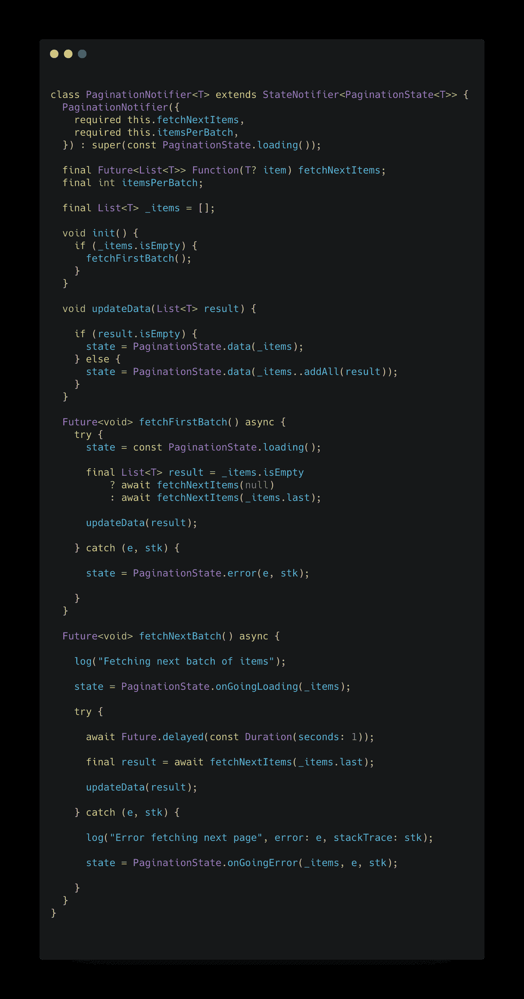

Updated PaginationNotifier to use PaginationState instead of AsyncValue.** 

**在 **fetchNextBatch** 函数中，我们将状态更新为**。正在装载**和**。onGoingError** 状态替换**。data()** 和**。**状态错误()。**

**在 UI 端，您会看到一些编译错误。我们还需要在消费者中处理这两种新状态。**

**更新的 PaginatedListView:**

**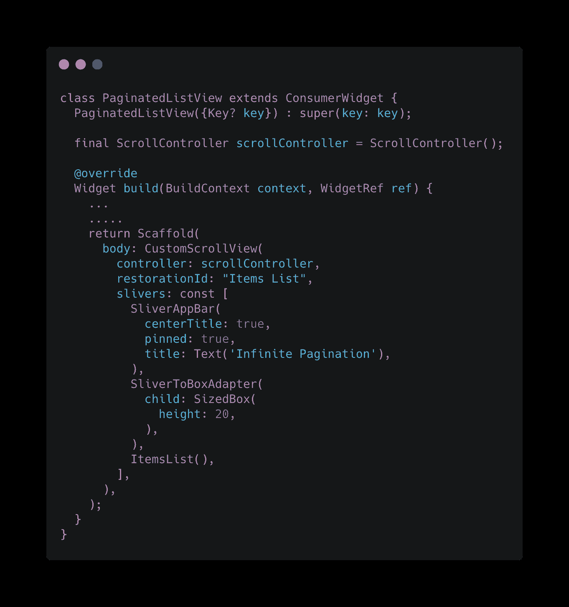

Updated UI code for PaginatedListView** 

**ItemsList:因此，我提取了在单独的小部件中加载项目的逻辑。**

**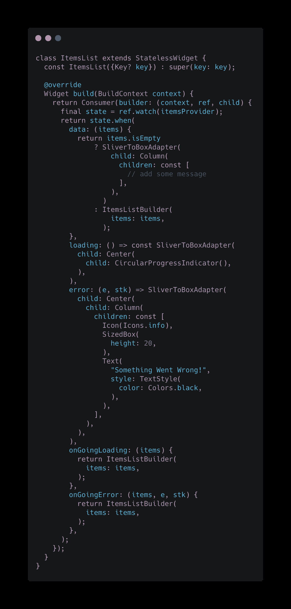

Updated UI code for ItemsList now handling both initial and OnGoing states.** 

**ItemsListBuilder:构建 items list 或 SliverList 的逻辑也被提取到它自己的小部件中，这使得它可以跨不同的分页状态重用。**

**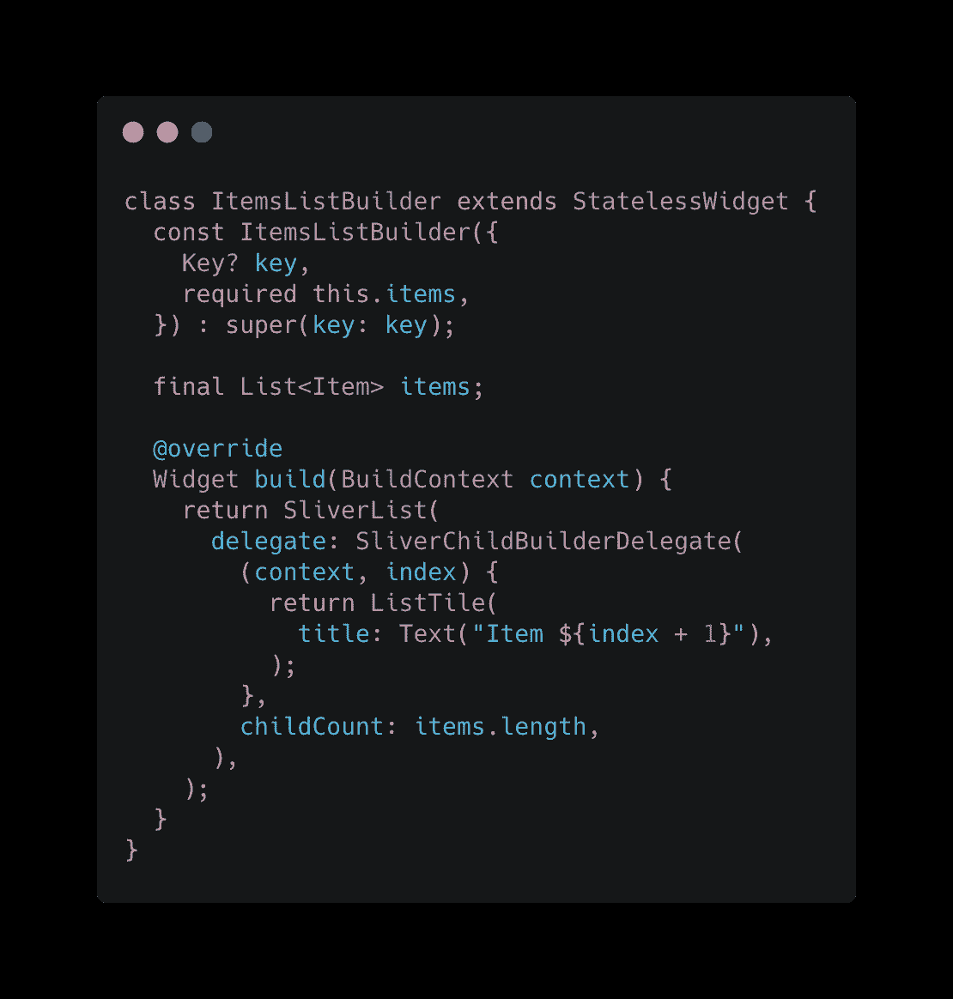

Builder that builds sliver list of items.** 

 **剩下的最后一步是在**项目列表的底部添加加载/错误指示器。****

**为此，我们将添加另一个消费者，该消费者将只处理**正在加载**和**正在出错**状态。**

**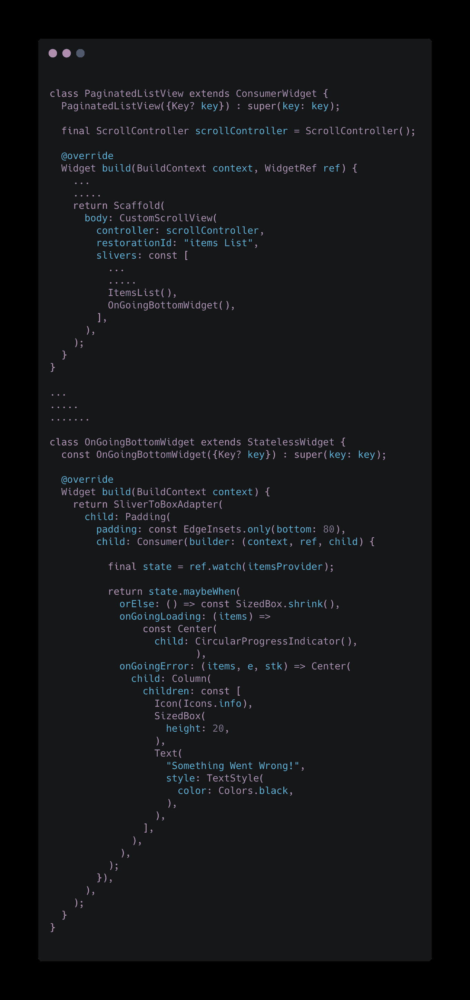

Adding OnGoingBottomWidget below our items list which shows appropriate message based on OnGoing state.** 

**我们走吧！那看起来好多了。**

**让我们来看看它的实际应用:🚀**

******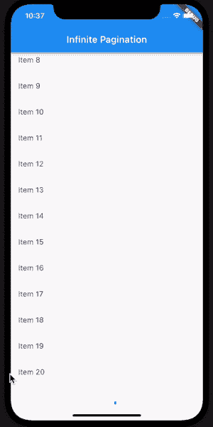******

**App demo in iOS simulator showing handling of different ongoing pagination states**

## **你可以做一些改进**

**既然我们已经有了一个可以使用分页的应用程序，接下来的步骤就是改进我们到目前为止所做的工作。**

**这包括当已经有一个 fetch 调用正在进行时限制我们的 fetch 调用，在某个持续时间内去抖调用，以及让用户知道他们是否已经到达列表的末尾并且没有更多的项目要显示。**

**此外，谁不想滚动到顶部按钮😅。**

### **如何拒绝并发请求**

**首先，我们将拒绝在请求发出后的一定时间内发生的任何并发请求。我们可以通过创建一个计时器并检查该计时器是否对每个请求都是活动的来做到这一点。如果是，我们拒绝请求，否则继续并再次实例化计时器。**

**第二，我们还可以检查我们的状态——如果我们已经在处理前一个请求，那么我们拒绝传入的请求。为此，我们可以检查我们的状态是否等于加载状态，并处理它。**

**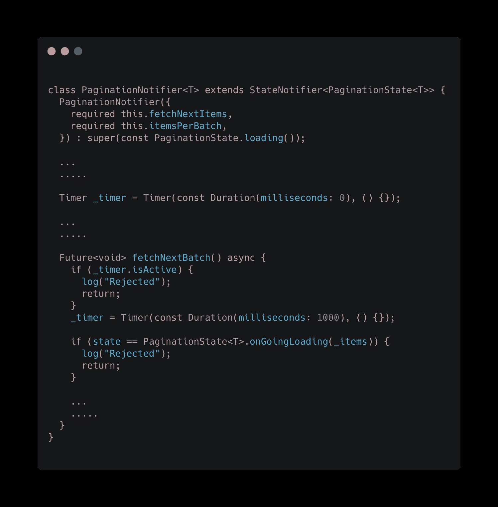

Added timer and state check to debounce any immediate calls after a call is made or when state is loading.** 

### **已到达列表末尾(没有更多要提取的项目)**

**我们可以维护一个布尔值来表明这一点。每次我们得到结果时，我们可以检查结果是否小于我们的 **itemsPerBatch** 计数。**

**在 UI 方面，我们可以基于此呈现适当的消息。下面是更新后的分页通知程序:**

**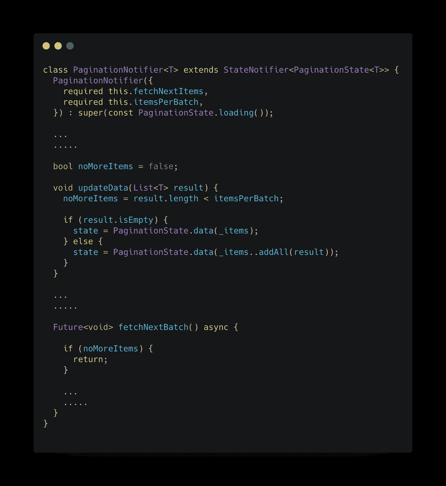

Declaring a noMoreItems bool to know when there are no more items to fetch.** 

**和更新的 UI 代码:**

**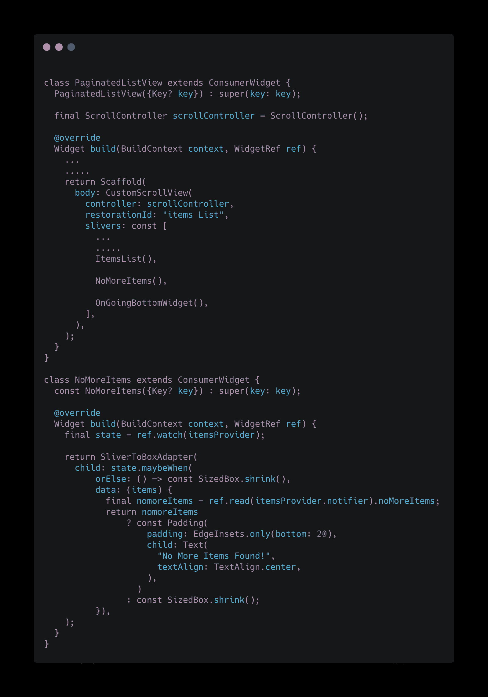

Showing a proper message based on status of noMoreItems bool.** **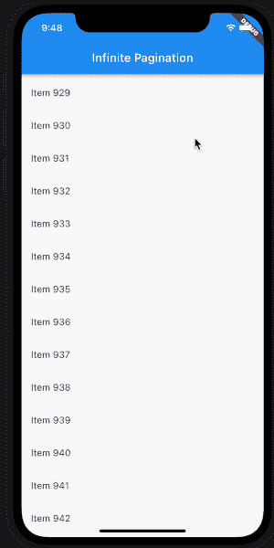

No More Items Found demo.** 

### **如何添加滚动到顶部按钮**

**这些按钮很有用，可以让用户省去一大堆的滚动。下面是我们如何在我们的应用中实现一个:**

**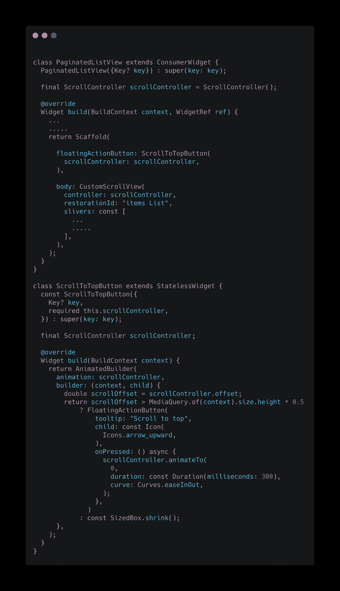

Adding a ScrollToTopButton** 

**我们使用 AnimatedBuilder 来监听滚动更新。AnimatedBuilder 接受一个 listenable 对象，因为我们的 ScrollController 实际上是一个实现 Listenable 的 ChangeNotifier，所以我们可以在这里传递它。**

**如果**滚动偏移量**大于某个值，那么我们显示 **ScrollToTop** 按钮。当点击时，我们动画滚动到顶部。** 

**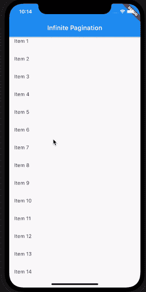

Demo showing usage of ScrollToTopButton added above.** 

## **摘要**

**这就结束了！以下是您在本文中学到的一些东西:**

*   **如何用 Riverpod 和 Freezed 有效处理分页的不同状态？**
*   **如何在 Firebase 中使用基于光标的分页技术？这同样适用于您正在使用的任何数据库，只需更改后端获取功能。其他实现保持不变。**

****再次声明，这里是源代码:** [用 Riverpod，Freezed，Firebase](https://github.com/rutvik110/infinite_pagination) 在 Flutter 中无限分页**

**希望你喜欢这篇文章。☺️:这是我在自由代码营的第一篇文章，我真的很喜欢写这篇文章。花了一个😅比我想象的要多得多的时间来写，但最后，它在这里给你看！🙌**

**希望在这里多写一些这样的文章🙇‍♂️连同一些颤振设计🧑‍🎨作为一名成长中的开发人员，我自己探索应用程序开发的挑战，并为您带来有趣的东西！😁**

**我也活跃在 Twitter 上 [@TakRutvik](https://twitter.com/TakRutvik) 💙分享我的创作和我一直在做的事情。请随意联系☺️.**