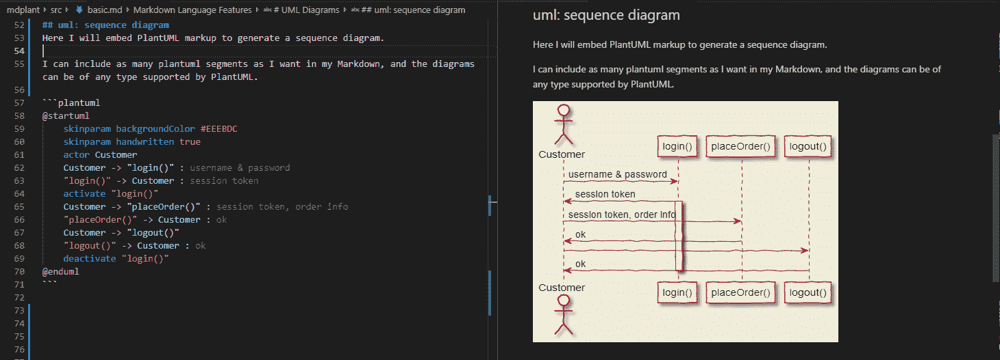
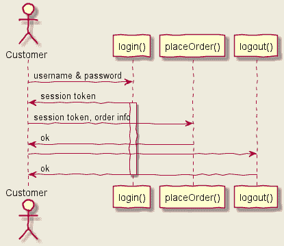
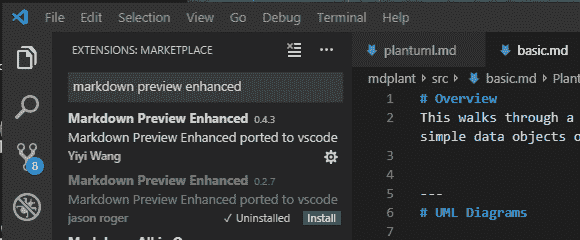
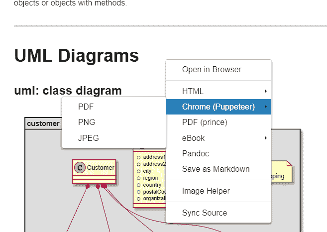

# 如何在 Visual Studio 代码中编辑 Markdown + UML

> 原文：<https://www.freecodecamp.org/news/inserting-uml-in-markdown-using-vscode/>

你讨厌为技术文档绘制图表吗？似乎你一完成草稿，新的改进就出现了，迫使你不仅要修改文本，还要修改图片。如果你使用的是传统的绘图工具，那会很乏味。

## 用户模式

UML 是通用建模语言的首字母缩略词，是 25 年前首次出现的标准化软件设计图标的努力。尽管它可能没有实现其[设计师](https://www.pearson.com/us/higher-education/program/Booch-Unified-Modeling-Language-User-Guide-The-2nd-Edition/PGM206461.html)的[更大的抱负](https://www.eclipse.org/umlgen/)，但它仍然提供了一种一致的方式来可视化软件设计的各个方面。

### 我的计划

绘制 UML 图是单调乏味的，但是如果您可以用文本的方式描述 UML 图，您可以将它直接包含在基于 Markdown 的文档中，在编辑它时预览图和格式化的文本，此外还可以将 Markdown 导出为 HTML 或 PDF，那会怎么样呢？您的文本和图表无缝集成在一个文件中。这就是 PlantUML 的用武之地...

## VS 代码

Visual Studio Code(又名 VS Code)已经成为各种计算机语言的流行编辑器，包括 [**Markdown**](https://en.wikipedia.org/wiki/Markdown) 。通过一个扩展，您可以在 VS 代码的预览面板中可视化 UML 图。

这个扩展叫做 **plantuml** ，你可以通过在扩展面板中搜索来安装它(点击扩展图标):


然后单击 install，或者简单地从终端窗格运行以下命令(Ctrl+'会得到一个命令):

`ext install plantuml`

您还需要安装某个版本的 Java，设置了`JAVA_HOME`环境变量或包含 **java** 二进制文件位置的可执行路径。

## 将 PlantUML 添加到您的减价商品中

安装了扩展之后，您现在可以使用 PlantUML 语言插入 UML 图了。一个例子:

```
## uml: sequence diagram
Here I will embed PlantUML markup to generate a sequence diagram.

I can include as many plantuml segments as I want in my Markdown, and the diagrams can be of any type supported by PlantUML.

```plantuml
@startuml
    skinparam backgroundColor #EEEBDC
    skinparam handwritten true
    actor Customer
    Customer -> "login()" : username & password
    "login()" -> Customer : session token
    activate "login()"
    Customer -> "placeOrder()" : session token, order info
    "placeOrder()" -> Customer : ok
    Customer -> "logout()"
    "logout()" -> Customer : ok
    deactivate "login()"
@enduml
```
```

现在，当我打开 VS 代码的预览窗格时:



Markdown document on left, Preview on right

此外，正如 Markdown 文档所描述的，预览窗格中的图表与 UML 保持同步。不需要刷新预览窗格。

这很好，但是如果您想从 Markdown 中导出一个图表呢？为此，你需要朋友们的一点帮助...

## 导出到 SVG 或 PNG

为了导出单个图，我需要安装 **[GraphViz](https://www.graphviz.org/)** ，这是“开源图形可视化软件”。它与之前安装的 **plantuml** 扩展协同工作。与 plantuml 不同，它不是 VS 代码扩展，而是一个[可执行文件](https://graphviz.gitlab.io/download/)。

要导出到 SVG 或 PNG:

1.  将光标放在所需的 PlantUML 文本中，
2.  打开命令调板(我的 PC 上是 Ctrl-Shift-P)；或者右键单击并选择命令选项板...
3.  选择“PlantUML:导出当前图表”

您可以选择 PNG、SVG 或其他格式。**这是预览窗格中显示的 PNG 和 SVG 版本的图表，如上所示:



PNG


SVG

您还可以选择导出 Markdown 文档中的所有图表(命令面板选项“plant UML:Export Current File Diagrams”)，这将为每个图表创建单独的图像文件。例如，我的降价文档名为`basic.md`，当我将所有图(有三个)导出为 SVG 时，会生成三个图像文件:

*   basic.svg(序列图已经显示)
*   basic-1.svg(类图)

```
### uml: class diagram
```plantuml
@startuml
package "customer domain" #DDDDDD {
    class Contact {
        + email
        + phone
    }

    class Address {
        + address1
        + address2
        + city
        + region
        + country
        + postalCode
        + organization
    }

    note right of Address 
        There are two types of 
        addresses: billing and shipping
    end note

    class Customer {
    }

    Customer *-- Contact
    Customer *-- ShippingAddress
    Customer *-- BillingAddress
    Customer *--{ SalesOrder

    class ShippingAddress <<Address>>
    class BillingAddress <<Address>>
    class SalesOrder {
        + itemDescription
        + itemPrice
        + shippingCost
        + trackingNumber
        + shipDate
    }
}
@enduml
```
```


*   basic-2.svg(状态图)

```
## uml: state diagram
```plantuml
@startuml
scale 600 width
skinparam backgroundColor #FFEBDC
[*] -> Begin
Begin -right-> Running : Succeeded
Begin --> [*] : Aborted
state Running {
  state "The game runneth" as long1
  long1 : Until you die
  long1 --> long1 : User interaction
  long1 --> keepGoing : stillAlive
  keepGoing --> long1
  long1 --> tooBadsoSad : killed
  tooBadsoSad --> Dead : failed
}
Dead --> [*] : Aborted
@enduml
```
```


* * *

**我尝试仅使用此扩展名导出的其他格式是 HTML，它因 Java 错误而失败:

`java.lang.UnsupportedOperationException: HTML`

和 PDF，它因类似的错误而失败。别担心！我有变通办法，如下所示。

## 更多功能

还有一个有用的 VS 代码扩展叫做 **[Markdown 预览增强](https://shd101wyy.github.io/markdown-preview-enhanced/#/)** 。这在 VS 代码的原生预览窗格之外增加了第二个预览窗格。

出于某种原因，当我搜索它时，两个版本出现在我的扩展窗格中；我选择了最新的:



现在，您将在 Markdown 文档上方看到两个预览控件:


That first icon activates the new Markdown Preview Enhanced pane

打开窗格后，您现在可以右键单击它并导出为各种格式，如 HTML 或 PDF。

### 导出到 PDF

Markdown Preview Enhanced 能够通过[木偶师](https://developers.google.com/web/tools/puppeteer/)驱动程序与 Chrome 浏览器一起生成 PDF 文档。你所需要做的就是在你的 markdown 中提供一些*前置事宜*，指导木偶师如何布局 PDF:

```
---
puppeteer:
    landscape: true
    format: "letter"
    timeout: 3000 # <= wait 3 seconds before rendering in browser
---

# Overview
This walks through a few of use cases, linking them to "classes", which are either simple data objects or objects with methods. 

---
# UML Diagrams
... 
```

前面的内容不会出现在常规的 VS 代码预览窗格中，也不会出现在降价预览增强窗格中。

要导出，只需在 Markdown 预览增强窗格中右键单击，然后选择 Chome(木偶师)-> PDF:



这需要几秒钟的时间，但最终会生成 PDF，并且您的默认浏览器(不一定是 Chrome)会打开并显示 PDF 文档。

* * *

UML 是一种丰富的语言，除了一些非 UML 图之外， [PlantUML 支持它的大部分内容。你不必成为 UML 专家来通过图表表达思想，但是你会发现通过文本比通过绘图工具更容易修改你的图表。最重要的是，在 Markdown 文档中嵌入图表并以不同格式导出的能力是一大优势。](http://plantuml.com/)