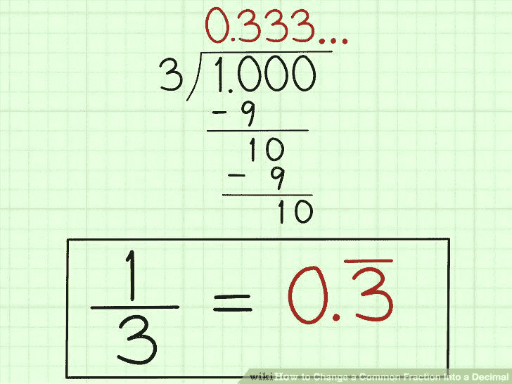

# 如何解决一道典型的循环小数面试题

> 原文：<https://www.freecodecamp.org/news/interview-questions/>

## 介绍

在本文中，我将带您了解如何解决一个典型的软件开发面试问题:循环小数。

为了解决这个例子，我决定使用 Python(所有代码都可以在这里[找到](https://github.com/pierpaolo28/Algorithms/tree/master/Interview%20Questions))。如果您愿意，可以尝试使用您选择的任何其他编程语言来解决同样的问题。

## 问题是

> 创建一个能够接受两个数字(分数的分子和分母)的函数，以十进制形式返回分数的结果，并将任何重复的小数括在括号中。

```
Examples:
1) 1/3 = 0.(3)
2) 1/4 = 0.25
3) 1/5 = 0.2
4) 1/6 = 0.1(6)
5) 1/7 = 0.(142857)
6) 1/8 = 0.125
```

我现在将带您通过一个简单的实现来解决这个问题。如果你能创造一个更节省时间和内存的解决方案，请在下面的评论区分享。

## 解决方案

让我们首先创建一个函数( *repeating_dec_sol* )并处理一些简单的异常:

1.  如果分子为零，则返回零。
2.  如果分母为零，则返回 Undefined(如果分子和分母都等于零，则相同)。
3.  如果余数为零，(分子可被分母整除)直接返回除法的结果。
4.  如果分子或分母在除法运算时返回负数，则在返回结果的开头添加一个减号(这将在代码的结尾完成)。

```
def repeating_dec_sol(numerator, denominator):
    negative = False
    if denominator == 0:
        return 'Undefined'
    if numerator == 0:
        return '0'
    if numerator*denominator < 0:
        negative = True
    if numerator % denominator == 0:
        return str(numerator/denominator)

    num = abs(numerator)
    den = abs(denominator)
```

现在，我们可以通过将分子和分母的商连接成一个名为 *result* 的字符串(稍后将使用它来存储整个运算结果)，来简单地存储小数点之前所有数字的输出。

```
 result = ""
    result += str(num // den)
    result += "."
```

为了处理小数点后的部分，我们现在将开始跟踪小数点后的每个新分子和商(两个数相除产生的量)。

正如我们从下图(图 1)中看到的，每当有一个重复的小数时，新分子和商的相同值就会重复多次。



Figure 1: Repeating Decimals [1]

为了在 Python 中对这种行为进行建模，我们可以从创建一个空列表( *quotient _num* )开始，我们将用小数点后注册的所有新分子和商来更新该列表(使用列表中的列表)。

每次我们要追加一个包含新分子和商的列表时，我们都要检查在任何其他列表中是否存在新分子和商的相同组合，如果是这样，我们将中断执行(这标志着我们已经到达重复小数)。

```
 quotient_num = []
    while num:
    	# In case the remainder is equal to zero, there are no repeating
        # decimals. Therefore, we don't need to add any parenthesis and we can
        # break the while loop and return the result.
        remainder = num % den
        if remainder == 0:
            for i in quotient_num:
                result += str(i[-1])
            break
        num = remainder*10
        quotient = num // den

		# If the new numerator and quotient are not already in the list, we
        # append them to the list.
        if [num, quotient] not in quotient_num:
            quotient_num.append([num, quotient])
        # If the new numerator and quotient are instead already in the list, we 
        # break the execution and we prepare to return the final result.
        # We take track of the index position, in order to add the parenthesis 
        # at the output in the right place.
        elif [num, quotient] in quotient_num:
            index = quotient_num.index([num, quotient])
            for i in quotient_num[:index]:
                result += str(i[-1])
            result += "("
            for i in quotient_num[index:]:
                result += str(i[-1])
            result += ")"
            break
```

最后，如果输入分子或分母是负数，我们可以添加以下代码来处理异常。

```
 if negative:
            result = "-" + result

    return result
```

如果我们现在测试我们的函数，我们将得到以下结果:

```
NUM, DEN = 1, 6
print("The result of the fraction", NUM, "/", DEN, "is equal to: ",
       repeating_dec_sol(NUM, DEN))

# Output 
# The result of the fraction 1 / 6 is equal to:  0.1(6)
```

## 结论

我希望你喜欢这篇文章。如果你有任何问题，欢迎在下面留言。如果你也在寻找如何解决这类问题的视频解释，这个由[派尔宁](https://www.youtube.com/channel/UC2HIN53hM4_ZW8IdmWrJGtw)制作的[视频](https://www.youtube.com/watch?v=WFd478BG4o8)是一个很好的开始。

## 联系信息

如果你想了解我最新的文章和项目，[关注我](https://medium.com/@pierpaoloippolito28?source=post_page---------------------------)并订阅我的[邮件列表](http://eepurl.com/gwO-Dr?source=post_page---------------------------)。以下是我的一些联系人详细信息:

*   [Linkedin](https://uk.linkedin.com/in/pier-paolo-ippolito-202917146?source=post_page---------------------------)
*   [个人博客](https://pierpaolo28.github.io/blog/?source=post_page---------------------------)
*   [个人网站](https://pierpaolo28.github.io/?source=post_page---------------------------)
*   [中等轮廓](https://towardsdatascience.com/@pierpaoloippolito28?source=post_page---------------------------)
*   [GitHub](https://github.com/pierpaolo28?source=post_page---------------------------)
*   [卡格尔](https://www.kaggle.com/pierpaolo28?source=post_page---------------------------)

## 文献学

[1]3313%作为一个分数数学图像，标题为将一个普通分数转换为小数步骤 8 Math papa Slope-lugezi.com。访问位置:[http://novine . club/WP-content/uploads//2018/09/33-1-3-percent-as-a-fraction-math-image-titled-change-a-common-fraction-into-a-decimal-step-8-math papa-slope . jpg](http://novine.club/wp-content/uploads//2018/09/33-1-3-percent-as-a-fraction-math-image-titled-change-a-common-fraction-into-a-decimal-step-8-mathpapa-slope.jpg)