# 如何使用 Auth0 操作扩展您的登录流程

> 原文：<https://www.freecodecamp.org/news/intro-to-auth0-actions/>

我最近参加了 Auth0 Dev Rel 团队的一个培训会议，了解了一个叫做 Auth0 Actions 的很酷的新特性。

在这篇文章中，我将解释什么是 Auth0 动作，为什么你想使用它们，以及如何设置一个。

## 什么是 Auth0 操作？

动作是在 Node.js 中编写的安全的、特定于租户的版本化函数，在 Auth0 运行时的特定时间点执行。动作用于通过自定义逻辑自定义和扩展 Auth0 的功能。

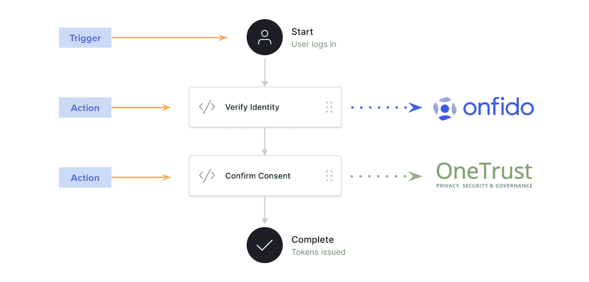

上面你可以看到一个样本流。在其中，一旦用户登录到系统，您添加一个触发器来使用 Onfido 验证用户的身份，然后在完成登录流程和发布令牌之前使用 OneTrust 确认同意。

简而言之，动作是将定制业务逻辑添加到登录流中的编程方式。

## 为什么使用 Auth0 操作？🤔

**可扩展性**–它们旨在为开发者提供更多的工具和更好的登录工作流程体验。

**拖放功能**–流编辑器让您可以通过拖放操作块直观地构建自定义工作流，以实现完全控制。

**Monaco 代码编辑器**–专为开发人员设计，您可以轻松编写带有验证、智能代码完成和类型定义的 JavaScript 函数，并支持 TypeScript。

**无服务器环境**–auth 0 托管您的自定义操作函数，并在需要时处理它们。这些功能在它们的基础设施上存储和运行。

**版本控制**–您可以存储单个操作更改的历史记录，并根据需要恢复到以前的版本。

**生产前测试**–您的个人行动可以在部署到生产中之前起草、审查和测试

## 如何设置 Auth0 操作

出于本演示的目的，我们将创建一个操作来对特定角色实施多因素身份认证(MFA)。我将带您了解以下过程:

1.  创建角色
2.  添加用户
3.  设置演示应用程序
4.  创建执行 MFA 的操作
5.  测试代码

让我们开始吧:

### 1)登录您的 Auth0 帐户

保护您的应用程序的第一步是访问 Auth0 仪表板，以便创建您的 Auth0 应用程序。

如果您还没有创建 Auth0 帐户，您现在可以[注册一个免费的帐户](https://a0.to/signup-for-auth0)。

### 2)创建应用程序

进入仪表板后，转到左侧边栏中的应用程序选项卡。

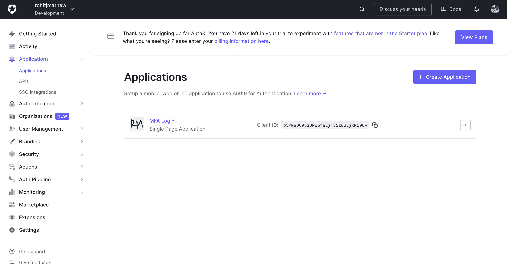

点击创建应用程序。

为您的应用程序提供一个友好的名称(如测试操作应用程序)，并选择单页 Web 应用程序作为应用程序类型。

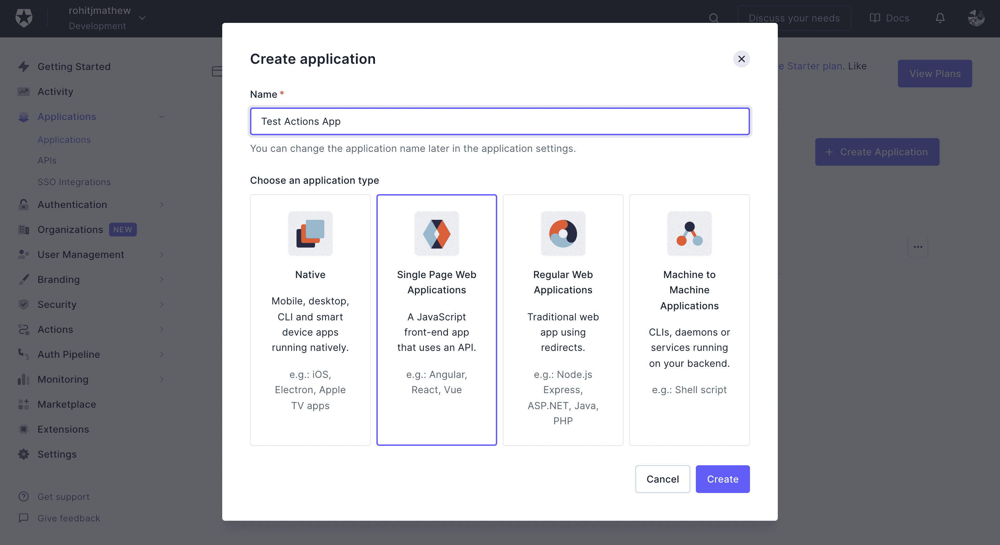

从快速启动选项卡中选择反应。下载示例应用程序。这将有大部分必要的细节已经到位。

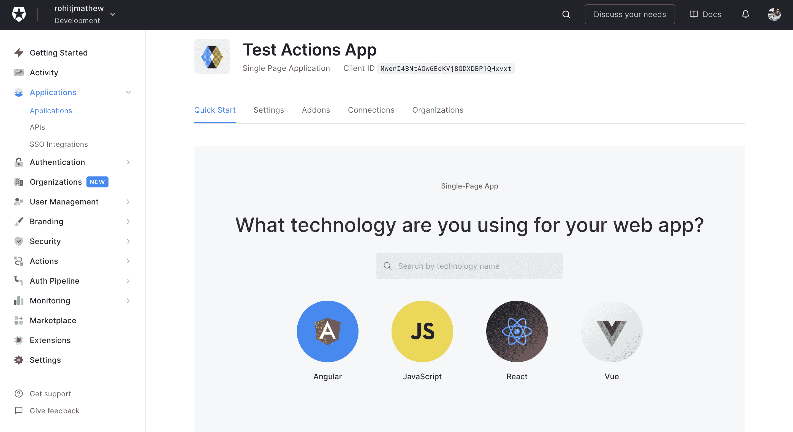

我们还需要为这个应用程序设置一些设置。选择“设置”选项卡(在“快速启动”旁边)。将您的本地主机 URL 添加到以下位置:

1.  允许的回拨 URL
2.  允许的注销 URL
3.  允许的网站来源

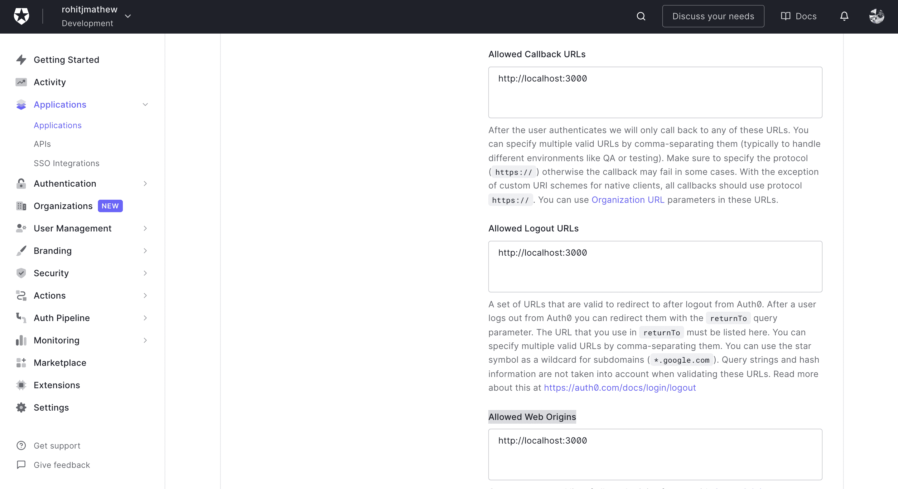

### 3)设置应用程序

在您选择的位置解压缩我们下载的代码。然后在您选择的代码编辑器中打开它。

交叉验证您的应用程序的详细信息是否在`src/auth_config.json`中正确配置。

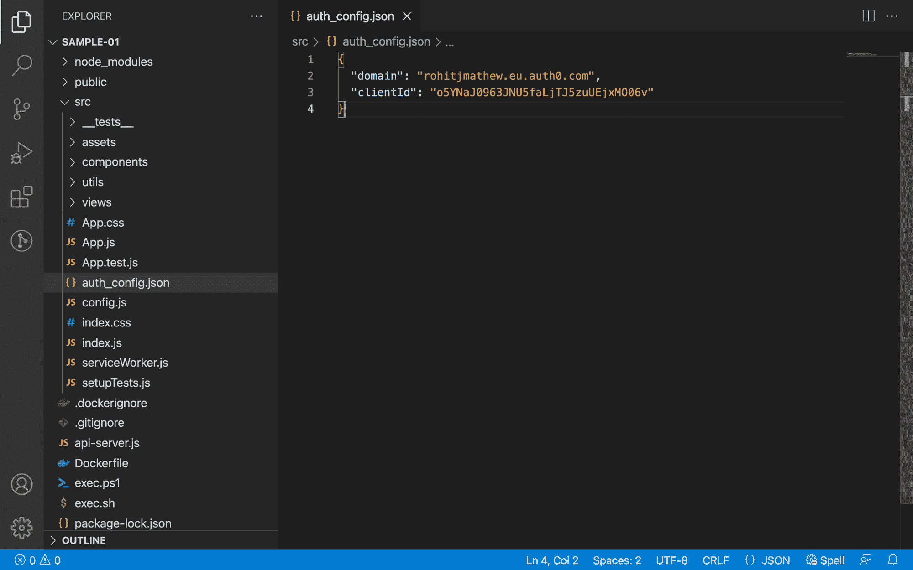

我们将在本地运行该代码，因此安装依赖项并在开发模式下运行它(因此我们启用了热重装)。为此，`npm install & npm run dev`。

一旦应用程序启动，你应该看到一个温泉如下。如果你点击登录，它会把你带到你的登录框。

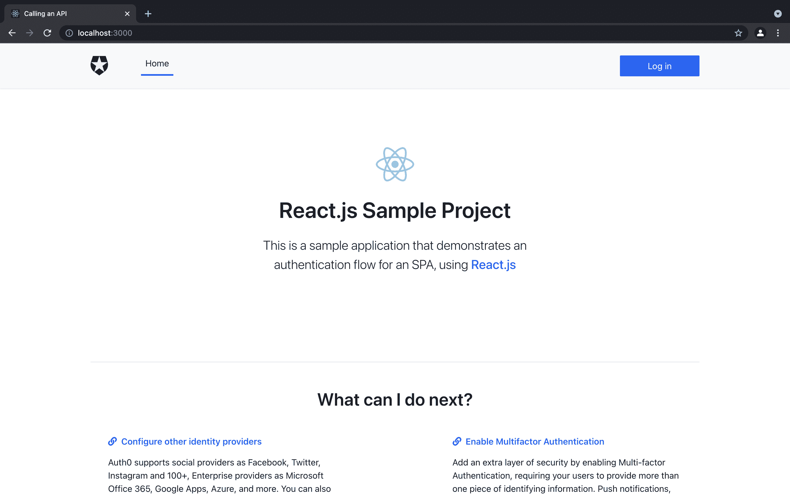

### 4)设置用户和角色

单击左侧边栏中的用户管理选项卡。

转到“用户”选项卡，单击“创建用户”按钮。我们需要创建 2 个用户:

1.  管理员用户
2.  测试用户

请记住这些凭据，因为这些是我们将在本演示中使用的测试用户。

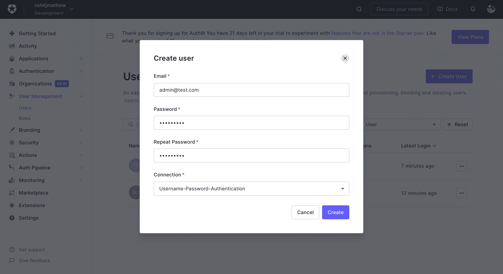

转到“角色”选项卡，然后单击“创建角色”按钮。调用角色`Admin`,一旦它被创建，转到 user 选项卡并将其分配给管理员用户。

完成后，回到本地运行的 SPA，尝试使用一个凭据登录。您应该能够访问如下所示的用户门户:

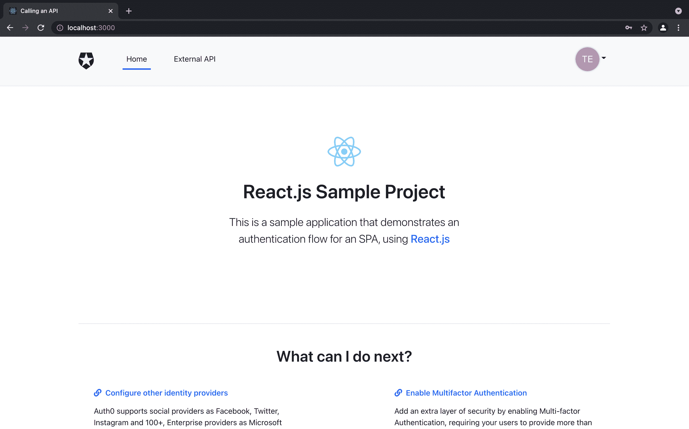

### 5)设置操作

单击左侧边栏中的 Actions 选项卡。然后转到流量类别。

选择登录流程。这将在您的登录框中的登录过程完成后运行操作流。

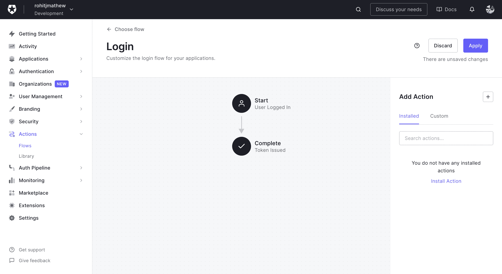

点击添加操作中的`+`按钮，并选择构建自定义。

将它命名为 MFA for Role，其余部分保持不变。

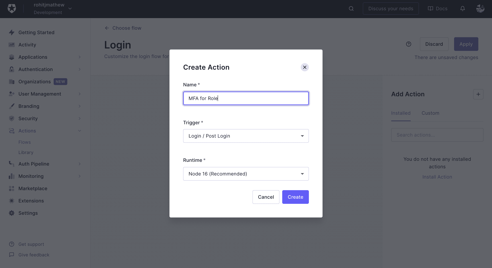

创建完成后，您将看到如下屏幕:

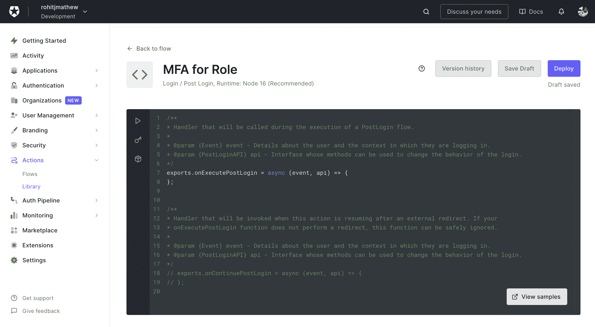

将以下代码添加到`onExecutePostLogin`函数中:

```
 if (event.authorization != undefined && event.authorization.roles.includes("Admin")) {
      api.multifactor.enable("any");
  }; 
```

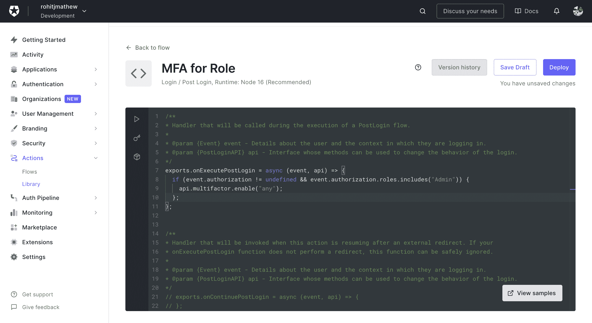

在左边你可以看到一个播放按钮。这是您在动作编辑器中的测试环境。您将发现[事件](https://auth0.com/docs/actions/triggers/post-login/event-object)对象，在其中您可以通过将`Admin`添加到`authorization.roles`数组来测试动作流。

当您添加`Admin`角色时，您应该会看到如下所示的 MFA 响应。当它不存在时，你应该得到一个空数组。

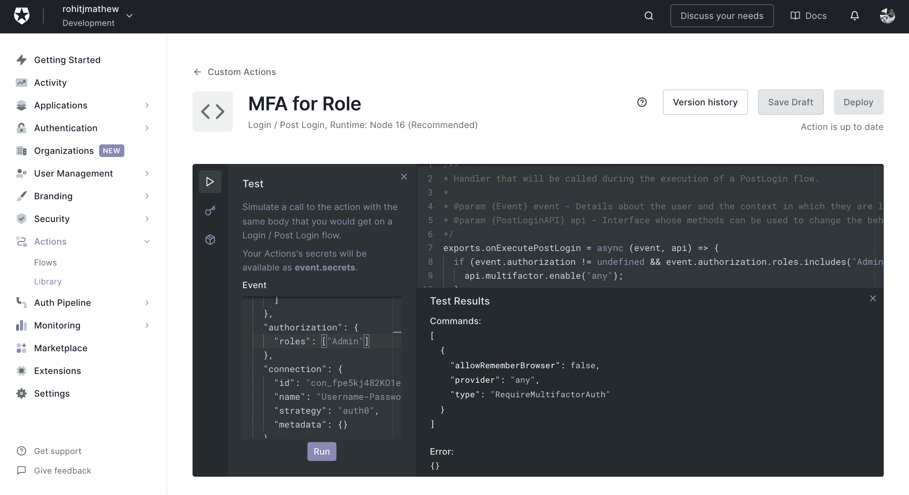

点击保存草稿并部署。

现在转到流程，点击右边的 custom actions 选项卡，您应该能够将`MFA for Roles`动作拖放到流程中。单击“应用”,这样这个新流程将与您的登录框一起工作。

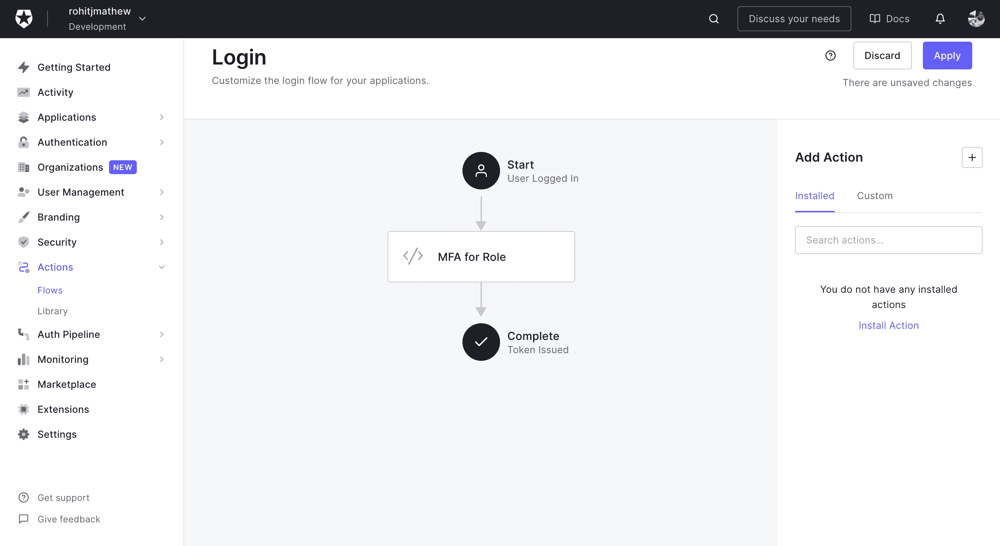

您还需要在 Auth0 仪表板上启用 MFA。

打开“证券”标签，选择“多因素授权”。在下一个屏幕中，启用一次性密码。这将允许用户使用类似谷歌认证器的应用程序获得一次性密码。

您还可以强制实施其他因素，如 SMS 或基于电子邮件的 OTP，但在本演示中，我们将只使用一次性密码。

在 policies 部分保持一切不变，保存您的更改。


### 6)用您的应用程序进行测试

现在，当您登录本地运行的应用程序时，应该会触发您为 admin 用户执行 MFA。让我们来测试一下。

点击登录并重定向到您的登录框。如果您已经登录，请注销，然后执行同样的操作。

输入您的管理员用户凭据:

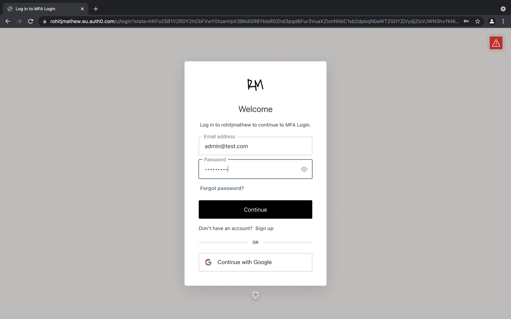

登录完成后，系统会提示您使用首选的验证器应用程序进行验证。我用谷歌认证器，输入我的动态口令。

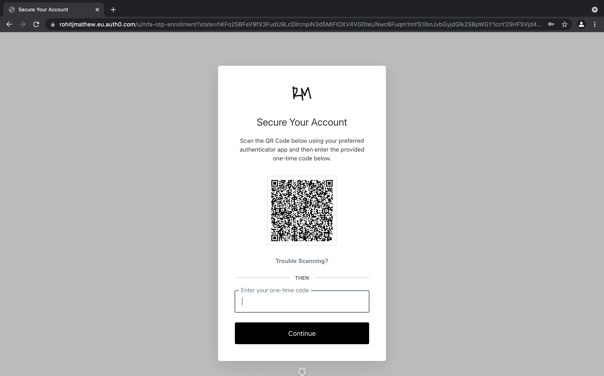

然后会要求您同意与应用程序共享您的用户数据。

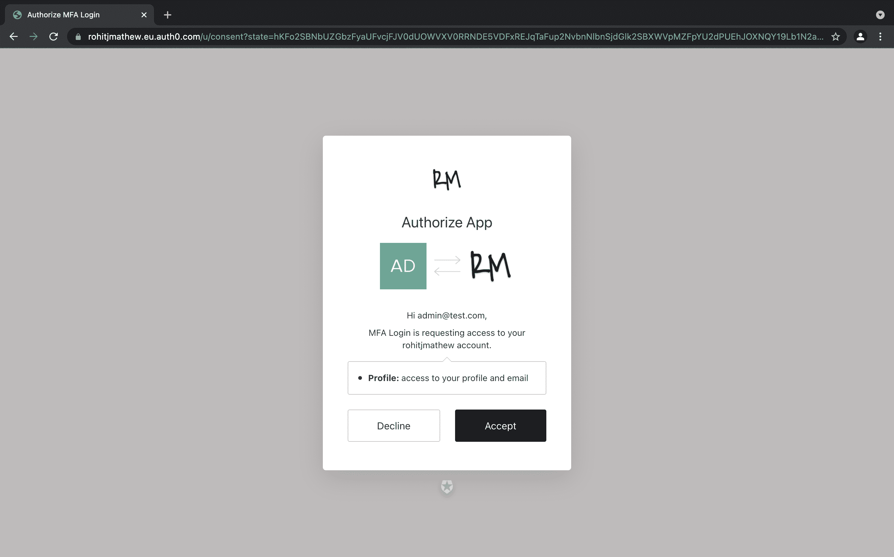

一旦您接受了上述内容，您就应该登录了。


如果您对测试用户尝试相同的流程，您将注意到您在同意页面之后直接登录，并且没有触发 MFA 请求。

这是因为在我们的操作代码中，如下所示，您可以看到我们检查用户角色是否具有管理员角色。如果是，那么我们要求 Auth0 使用租户的任何已启用的 MFA 用例来触发 am MFA 工作流。

```
 if (event.authorization != undefined && event.authorization.roles.includes("Admin")) {
      api.multifactor.enable("any");
  }; 
```

## 结论

恭喜你。您刚刚创建了一个定制的 Auth0 操作流并对其进行了测试。这是一个简单的示例，帮助您理解什么是 Auth0 操作，以及如何在您的工作流中构建和使用它们。

您可以构建许多更复杂的流，您可以在下面找到 Auth0 提供的一些示例。只要点一下扳机，就能找到具体的例子。

[样本动作代码](https://auth0.com/docs/actions/triggers/)

感谢阅读！我真的希望这篇文章对你有用。如果有，请分享给其他人看。

感谢阅读！:)

页（page 的缩写）请随时在 LinkedIn 或 T2 Twitter 上与我联系

## 附录

以下资料对撰写本文非常有帮助:

*   [介绍 Auth0 操作- Auth0](https://auth0.com/blog/introducing-auth0-actions/)
*   [授权 0 操作-授权 0 文档](https://auth0.com/docs/actions)