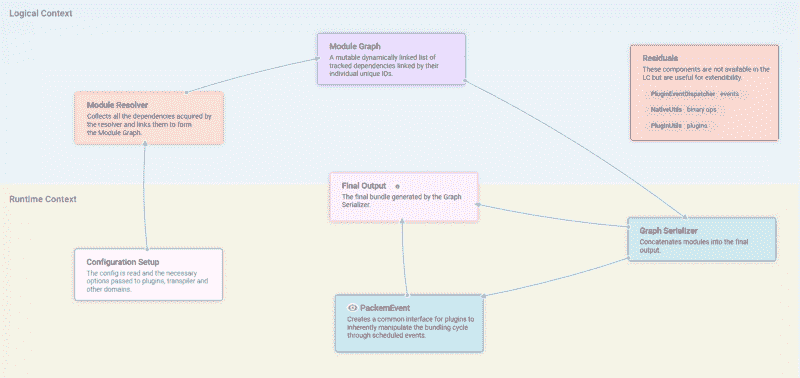

# 介绍 Packem:一个用 Rust 编写的超快速实验捆绑器

> 原文：<https://www.freecodecamp.org/news/introducing-packem-a-super-fast-experimental-bundler-written-in-rust-e981af875517/>

作者布哈里·穆罕默德

# 介绍 Packem:一个用 Rust 编写的超快速实验捆绑器

Packem 是一个实验性的预编译 JavaScript 模块 bundler，主要在 Rust 中实现。它还可以处理各种其他文件类型，如 YAML/TOML，片段着色器文件等等。登录[网站](https://packem.github.io/)或 [GitHub 页面](https://github.com/packem/packem)快速入门。

Packem’s logo. Always soothes me.

Packem 解析模块的依赖关系，并将它们重新合并到模块图中，模块图是一个包含模块接口的平面列表，模块接口本质上是对内存中基于堆的可变数据结构的**引用，包含模块图中模块的特殊元数据。**

使用 FFI 绑定将大部分业务逻辑抽象到 Rust 中，以支持两端之间的低级交互。Rusty 二进制文件可以作为预编译节点 C/C++插件在 [Packem 的 repo](https://github.com/packem/packem/tree/master/bin) 中获得。基于云的配置项用于在 gyp 安装之前运行一些脚本，生成支持更高节点版本(8、9、10)的特定于操作系统的二进制文件。

Packem 的这一层核心就是所谓的**逻辑上下文(LC)** 。所有其他没有被*明确优先化的*操作都被退回到节点的通用运行时中，用 Packem 的术语来说就是**运行时上下文(RC)** 。点击阅读更多内容[。](https://packem.github.io/docs/execution-contexts.html)

理论上，模块图保持平坦，以避免常见的陷阱，如果在适当的位置使用树，这些陷阱会导致不必要的遍历。这允许 RC 跟踪诸如深度循环依赖或大量嵌套的动态导入(代码分割)等情况，并尽可能适当地减少性能影响或副作用。

An overview of the bundling cycle from contexts.

> 更多细节可以在 Packem 的 [README.md](https://github.com/packem/packem) 找到。

我脑子里一直有这个想法，但从来没有计划去实施它，直到我与 T2 萨达姆联手。将模块捆绑视为一个任何人都可以安全学习、理解和实现的概念，这确实符合我的兴趣。让人们纠结于配置、文档和插件是极其可怕的，我想借此机会改变这一点。和你一起。用 Packem。

### 快速历史

我花了一些时间来穷尽大多数在非 JavaScript 环境中编写的捆绑器。我发现他们中的大多数人*忘记了*他们应该是一个 bundler，而不是来自黑暗年代的 C/C++库。

我想要的是一个捆绑器，它用一种接近金属的语言为用户完成大部分繁重的工作，而不需要与它的内部进行任何交互。然后我发现了铁锈。一种聪明简洁的系统语言，展示了一些值得称赞的特性，比如无畏的并发模型、类型安全等等！我对使用 C/C++抱有同样的期望，但是我更愿意坚持使用 Rust，因为它在内存管理方面非常简单。

### 为什么是另一个 bundler？

那么，这是什么意思呢？既然我们已经有了 webpack、package、Rollup 等令人惊叹的工具，为什么我们还需要另一个构建工具呢？我会带你去一些原因。也许您可能对大幅减少开发和生产构建时间感兴趣。

#### 现在是 2019 年，我们不再需要缓慢的工具

即使 Packem 比 webpack 4 快，**也比 Parcel(采用多核编译)**快两倍多。在基准测试中，我们将 [Lodash v4.17.1](https://lodash.com/docs/4.17.11) 与 Packem 和 package 捆绑在一起，结果如下:

> 千万不要轻信任何长椅。你可以在这里亲自测试一下。

我没有用 webpack 对 Parcel 进行基准测试的原因是因为 webpack 4 比 Parcel 快得多。我用肖恩·拉金自己的长椅证明了这个事实，在推特[上的一个帖子可以在这里找到。](https://twitter.com/bukharim96/status/1099049693290680321?s=20)

#### 因为我们可以。谁都可以，对吧？

当然，最有意义的是因为*我们可以*。我们的想法是通过 FFI 或 WASM(当时仍不确定)的一个生锈的接口来加快捆绑时间。就速度和 DX 而言，FFI 更合理，所以我们用 Rust FFI 绑定实现了 Packem。

我们遇到了一些与线程相关的问题，所以我们没有充分利用可用资源。因此，我们使用了多个节点子进程(使用 [*【节点-工人-农场】*](https://github.com/rvagg/node-worker-farm) *)* )，这与 package 用于多核编译的技术相同，但用于较大的模块图时，因为它在用于较小的模块图时，在节点的正常运行时间上增加了显著的启动时间。

### 配置风格

这是一个棘手的部分。有很多问题需要一个好的答案来弥补，以选择正确的配置风格。静态还是动态？JSON/YAML/TOML？我们的选择完全基于我们是否**需要**包装来:

1.  拥有更整洁的配置风格，以及
2.  不知道其他自定义用户配置，如*。babelrc* 或者 *package.json* 。

总之，我们继续使用静态配置风格，因为我们发现这正是我们所需要的。一些可以*声明性地告诉 Packem 如何管理包周期*的东西。静态配置的所有限制都很清楚。

另一个感兴趣的方面是我们应该用于配置的文件类型。JSON 对绝大多数 JavaScript 开发人员来说更常见，或者 YAML/TOML/XML 风格，它们不太常见，但有自己的优势。仍然有人建议支持 JSON([# 5](https://github.com/packem/packem/issues/5))。

由于所有不必要的字符串引号、花括号和块括号，JSON 没有被删除，这是有意义的，因为它是一种**数据交换格式**。就用作配置格式而言，类似 XML 的方法不值得尊重，因为就不必要的字符而言，它比 JSON 更糟糕。TOML 引入了许多新行，调试嵌套选项看起来并不吸引眼球，因为我们知道 Packem 插件会变得非常嵌套。

最后的胜利者是 YAML！它能够通过正确配置格式的所有方面(至少对于 Packem 来说)。它:

1.  使配置变得轻松。
2.  使用优雅的方法。
3.  对于 JavaScript 来说仍然很熟悉
4.  是专门为此用例(配置)设计的*。*

下面是一个典型的 Packem 配置示例( *packem.config.yml)* 。自己检查一下，考虑用 JSON/TOML/XML 风格编写同样的内容。

仅供参考，只有前两个选项是必需的！？

#### 扩展包装

> 此功能尚未实现。

有时我们可能需要使用一个**还不存在的特性**，**可能没有在 Packem** 中实现，或者**非常特定于我们的项目**。在这种情况下，您有两种方法来解决您的需求:

1.  [为您的用例创建一个 Packem 插件](https://packem.github.io/docs/plugin-system.html)(这是推荐选项)。
2.  在 Packem 的二进制文件上构建一个定制的 RC。

使用 Rust 让我们有机会将 LC 改造成其他二进制格式，如 WebAssembly，这将使 Packem 能够展示多个编译目标:

1.  一个基于 NAPI 的 C/C++插件，带有 Packem 默认 RC 所需的特定于平台的二进制文件。
2.  一个基于 WebAssembly 的二进制文件，它是跨平台的，并被注入到 RC 中。
3.  Packem 的默认独立版本，它使用 WebAssembly 和与浏览器兼容的 RC 实现。

> 最后两个还不在雷达上，因为内部重构仍在进行中。

如果您需要在浏览器和节点环境之外使用 Packem，高级指南将很快向您展示如何使用 Packem 的二进制文件构建一个定制的构建工具来满足您自己的需求。这些二进制文件完成了整个图形生成、重复过滤和其他与图形相关的方面。这意味着你可以使用你的定制串行器，文件监视器，插件系统等。这很像你如何在 OpenGL 上构建你的自定义渲染器。

1.  你仍然可以拥抱 [Packem 的插件系统](https://packem.github.io/docs/plugin-system.html),因为它将允许你将 Packem 的插件生态系统与你的定制捆绑器相集成。
2.  如果你不确定你是否需要建立一个定制的捆绑器，知道你不会总是需要。请先尝试提交问题。
3.  根据您的特定用例，这些二进制文件可以保证加快您的工作流程。

#### 初速电流状态

*   开发和生产模式的✂ [代码拆分](https://packem.github.io/docs/code-splitting.html)。
*   ？改进的 CLI (` — verbose `)提供了有关捆绑周期的更多信息。
*   ？M [模块接口](https://packem.github.io/docs/advanced-plugin-apis.html#module-interfaces)允许轻松操作模块图。
*   ✔适当优先。本机功能完全适合 LC。这意味着有更大的机会快速构建。
*   ？导出 N `ativeUtils` 供外部使用本机功能，包括 g `enerateModuleGraph` 重新运行生成模块图的过程。它很重，但在需要当前活动模块图的克隆的情况下仍然有用。使用它意味着构建时间加倍，所以要小心使用。

#### 下一步是什么？

这些是我们希望在即将到来的版本中拥有的特性。在您的努力下，我们可以**以正确的方式完成捆绑**。当 Packem 在 *1.0* 时，我们希望能完全支持下面列出的所有特性以及 [Packem 的路线图](https://packem.github.io/docs/roadmap.html)中提到的其他特性。

*   与浏览器兼容的独立 Packem 和 WebAssembly 中的 LC，以便与底层系统更紧密地集成。Axel Rauschmayer 已经[提出了一个功能请求](https://github.com/packem/packem/issues/1)在 WASM 发布一个节点兼容版本。郑重声明，我们将很快在这两个方面展开工作。
*   摇树，但先进。解析命名/未命名的导入和剥离死代码应该轻而易举。这意味着你可以使用像 *lodash* 这样的库来代替 *lodash-es* ，而不用担心你的代码是否会被**省略**。
*   自动配置。类似于零配置，但面向默认值以获得额外的灵活性。
*   高级 CLI 选项使 Packem 开发成为第二天性。
*   更好的错误报告。
*   更多环境目标。截至目前，Packem 只能针对浏览器进行捆绑。最终，我们希望也能支持节点 CJS 和其他格式。
*   更多插件。我们需要更多的插件！Packem 有一套通用插件，可以让你更快上手。但是要发展一个社区，我们需要一个伟大的插件生态系统。查看可用的[常用插件](https://packem.github.io/docs/common-plugins.html)或网站上的[插件版块](https://packem.github.io/docs/plugin-system.html)，立即开始开发插件。
*   还有更多…

#### 资源

*   [包裹是一个 GitHub](https://github.com/packem/packem/)
*   [路线图和功能要求](https://packem.github.io/docs/roadmap.html)
*   [Packem 的官方网站](https://packem.github.io/)
*   [用 Packem 创建插件](https://packem.github.io/docs/plugin-system.html)
*   [用 Packem 进行代码分割](https://packem.github.io/docs/code-splitting.html)
*   [模块图](https://packem.github.io/docs/the-module-graph.html)

**Packem 还没有达到*1.0***。如果您发现 Packem 对您有兴趣，尝试通过创建插件、更新文档、在财务上支持我们、在会议上代表 Packem 或任何其他方式为 Packem 做出贡献。我们感谢你的努力！

捆绑愉快！？？？