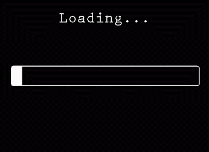

# 引入 React 负载——处理承诺状态和响应数据的无头 React 组件

> 原文：<https://www.freecodecamp.org/news/introducing-react-loads-a-headless-react-component-to-handle-promise-states-and-response-data-f45cb3621335/>

杰克·莫西

# 引入 React 负载——处理承诺状态和响应数据的无头 React 组件

#### 简单、声明性和轻量级

### 背景

现在有很多方法来处理 React 中的状态。从**本地状态**到 **Redux** ，新的[React 上下文 API](https://reactjs.org/docs/context.html) 和新的库如****和 **[Copy Write](https://github.com/aweary/react-copy-write)** 。所有这些方法都有很好的用例，没有绝对的理由让我完全放弃一个而选择另一个。他们每个人都有他们的情境优势。****

****但是我不想深入 React 状态管理的本质。请查阅 Kent C. Dodd 关于应用程序状态管理的优秀文章。****

****尽管我确实想从一个**承诺**中触及处理加载和响应状态的情况，例如 HTTP 请求和资源获取器。一个承诺有三种明确的状态:**待定**、**已解决、**和**已拒绝。**它还有另外一个隐含状态 **idle，**当承诺还没有被触发时。****

#### ****React 中如何管理承诺状态？****

****它可以在本地状态下通过简单的`isLoading`变量来管理，以反映“挂起”状态。然后，`response`和`error`变量分别用于反映“已解决”和“已拒绝”状态。****

****可以在 Redux store 中通过`GET_DOG_REQUEST`、`GET_DOG_SUCCESS`、`GET_DOG_ERROR`等动作进行管理。然后这些可以映射到商店中各自的`isLoading`、`response`和`error`变量。****

#### ****管理承诺状态可能是危险的，难以理解，并且有问题的 UX！****

1.  ****你的`render`函数中的嵌套术语可能变得难以解释和混乱，因此容易出错。下面是这样一个问题的例子:****

****从这个例子中，不清楚`!error && !response`是否意味着“空闲”状态。也不清楚`isLoading`三元组的`else`部分是否意味着该部分已经加载或出错。想象一下管理多个承诺和它们各自的状态！呃。****

****2.在你的用户界面上看到闪烁的“正在加载”状态是很烦人的。当承诺从“空闲”状态变为“待定”状态时，这种状态变化应该在 UI 中用加载指示器反映出来。然而，你的承诺可能会在很短的时间内兑现，让你的用户看到一个加载状态的“闪光”。这是许多开发人员在处理承诺状态时没有意识到的。****

****

You can see a brief ‘flash’ of content placeholder when this Facebook post is loading.**** 

****3.在 Redux 中单独管理承诺状态是不必要的。当 Redux 第一次发布时，开发人员通常会将大部分状态转移到 Redux 存储中。然而，为一个承诺状态创建三个动作，然后为这些动作创建三个 reducer 用例，会导致应用程序不必要的膨胀。我对此也感到内疚——但不再是了！在我看来，处理响应/错误数据的措施已经足够了。****

******避免在 Redux 中处理承诺状态。******

### ****引入[反作用载荷](https://github.com/jxom/react-loads)****

****[React Loads](https://github.com/jxom/react-loads) 旨在以极简的方式解决上述问题。用户向`<Loa` ds >组件提供一个返回承诺的函数。它将返回`n its`状态`e and re`响应`ta as` 渲染道具。****

****[**jxom/react-loads**](https://github.com/jxom/react-loads)
[*React-loads——一个简单的 React 组件来处理加载状态*github.com](https://github.com/jxom/react-loads)****

#### ****以声明方式处理承诺状态和响应数据****

****React Loads 为您提供了`render`道具来加载承诺。这也处理它的状态和响应数据。通过将`loadOnMount`道具传递给`<Loa` ds >，可以让它在组件挂载时加载 promise。****

#### ****可预见的结果****

****使用`render`道具中的`isIdle`、`isLoading`、`isTimeout`、`isSuccess`、`isError`等状态变量，会让你的`render`函数变得可预测、易读。****

#### ****去除装载状态的“闪光”****

****React Loads 直到承诺触发 300 ms 后才转换到“正在加载”状态。它将等待 300 毫秒，希望承诺***解决，然后进入挂起状态。该时间可以使用`<Loa` ds >的`delay`道具进行修改。*******

#### *******缓存响应数据的能力*******

*******React Loads 能够在应用程序上下文级别缓存响应数据。一旦数据从调用`fn`加载，它将使用从承诺返回的响应进行下一次调用`response`。最新的数据将在后台加载，跳过`isLoading`状态，并相应地更新`response`。你可以通过给`<Loa` ds >添加一个`cacheKey`道具来启用缓存。在这里阅读更多关于 ca [chin](https://github.com/jxom/react-loads#caching-response-data) g 的内容。*******

### *******结束语*******

*******在过去的几个月里，我们已经在面向患者和医生的 web 应用程序上使用了生产中的 React Loads。它让我们的开发体验变得非常简单。我们已经能够删除大量处理承诺状态和响应数据的代码，让 React Loads 做所有的脏工作。*******

*******考虑在你的一个项目中使用它，并让我知道它的进展如何！如果您有任何建议或发现了一个 bug，请随时在资源库上提出一个 PR(或问题)[！](https://github.com/jxom/react-loads)*******

*******感谢阅读！*******

*********在 [Twitter](https://twitter.com/jxom_) 和 [GitHub](https://github.com/jxom) 上关注我(我保证我会关注你)。*********