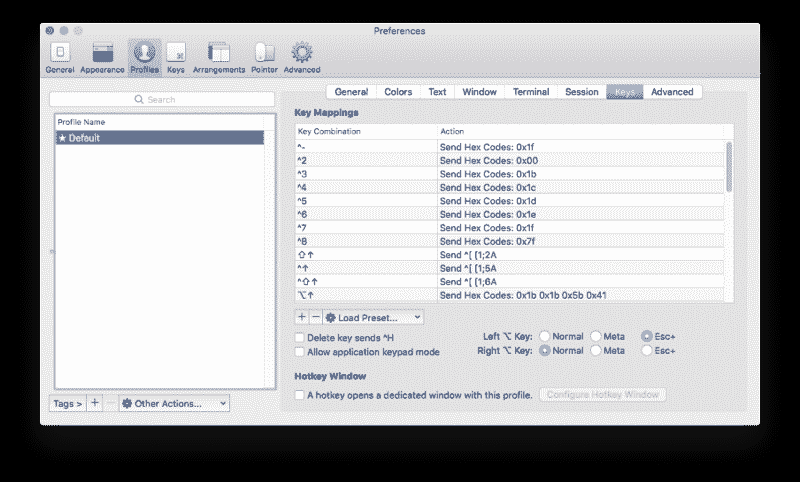
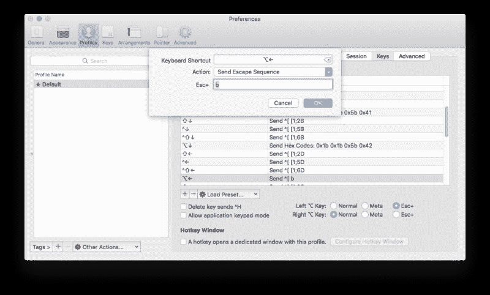

# 使用 iTerm 中的键盘快捷键在单词之间跳转

> 原文：<https://www.freecodecamp.org/news/jump-between-words-using-keyboard-shortcuts-in-iterm-fb1a70cecf79/>

Image source: iterm

iTerm 是我喜欢使用的一个很好的终端替代品。在我从 Windows 迁移到 OS X 之后，我想要的一个特性是能够在命令行中的单词之间跳转，而不必一个字符一个字符地遍历整行。

事实证明，这是很有可能的，并且不会给你带来太多的痛苦和努力。你不需要向苹果支付 1 BTC 就能让它工作。您只需要在 iTerm 首选项中进行一些按键更改，就大功告成了。

换句话说，您不需要在 OS X 中安装任何其他东西。您所要做的就是在 iTerm 首选项中进行一些配置，然后就可以开始了。

就这么简单。

让我们开始吧。

要使这适用于右 option 键，您需要将按键修饰符设置为转义序列。

首先，你需要设置你的左⌥键作为一个转义符。

之后，您可以更改⌥的当前快捷方式，或者在配置文件快捷键中创建一个新的快捷方式，设置如下:

*   键盘快捷键:⌥←
*   动作:发送转义序列
*   Esc+: b

现在我们需要对⌥→快捷键重复类似的过程，设置如下:

*   键盘快捷键:⌥→
*   动作:发送转义序列
*   Esc+: f

这就是我们需要做的。完成后，我们可能需要重新启动 iTerm，以便能够使用我们刚才所做的更改。

现在，我们可以在命令行界面上通过按住左⌥键并点击←或→,跳过整个单词。

我希望这篇文章对你有所帮助。

这篇文章最初是由作者在他的[博客](http://www.fatosmorina.com/jump-words-using-keyboard-shortcuts-iterm/)上发表的。