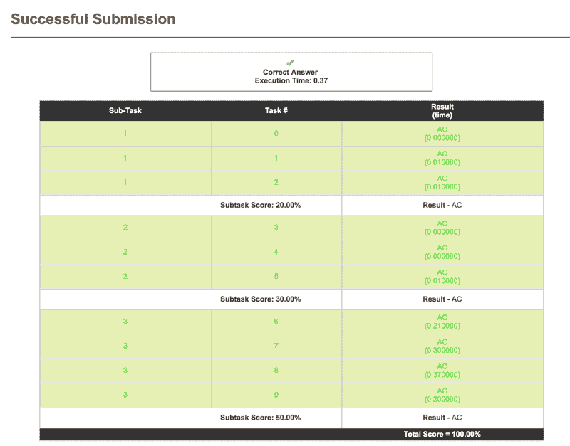
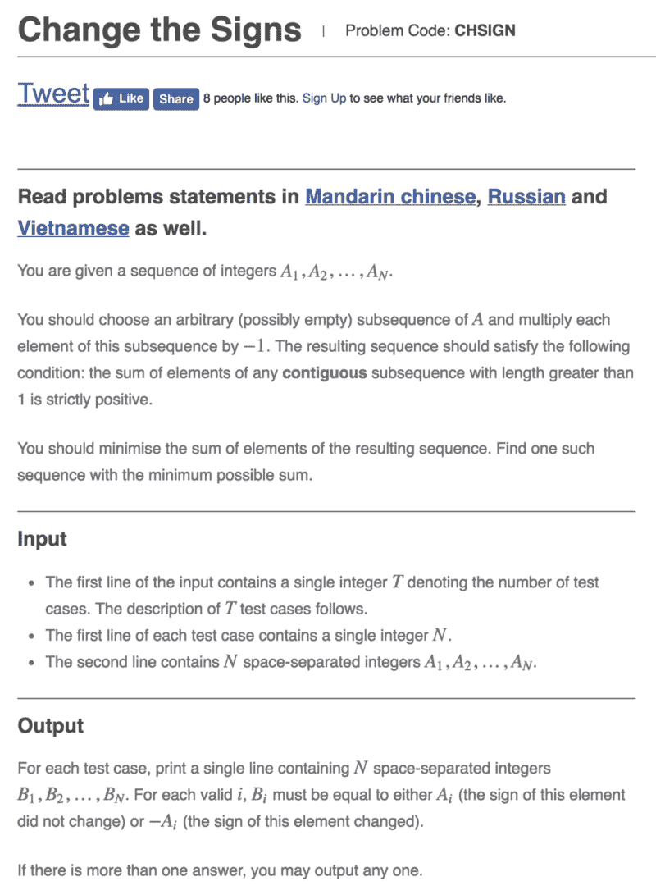
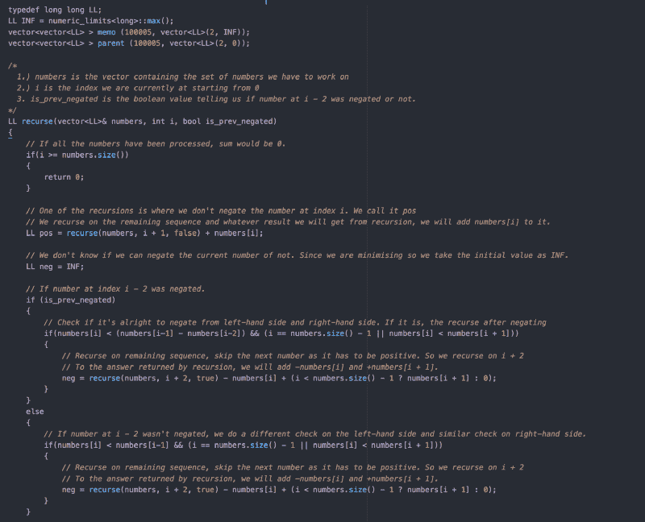
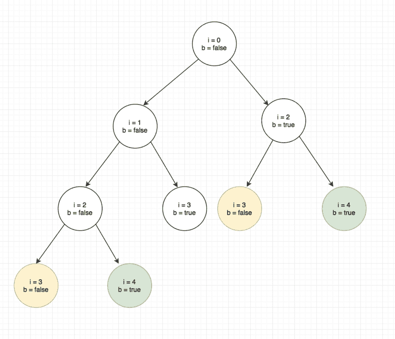
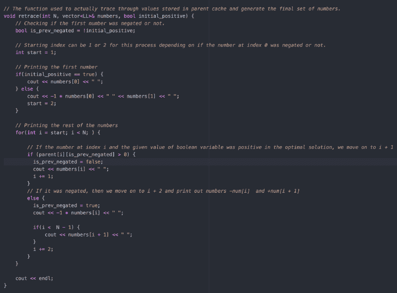
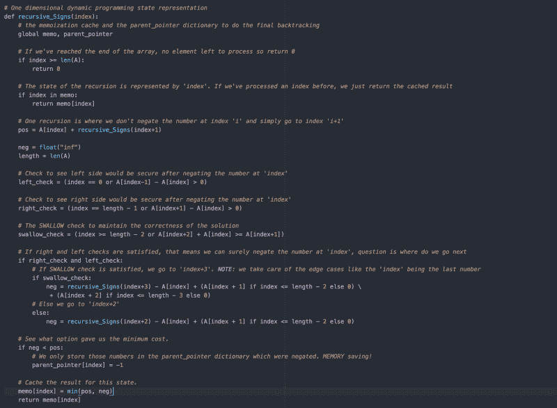

# 改变符号:如何使用动态规划解决一个竞争性规划问题

> 原文：<https://www.freecodecamp.org/news/just-change-the-signs-how-to-solve-a-competitive-programming-question-f9730e8f04a9/>

作者:Sachin Malhotra

# 改变符号:如何使用动态规划解决一个竞争性规划问题



如果你像我一样是一个有竞争力的程序员，世界上最好的感觉之一就是看到你的程序在最著名的编程平台之一 [CodeChef](https://www.codechef.com/) 上第一次尝试就被接受。

我在大学期间是一名狂热的竞争性程序员，然后在作为一名开发人员@Hike 工作时失去了联系。然而，我最近又开始了这个冒险的编程世界，这都要感谢我的朋友 Divya Godayal。

[code chef 2018 年 5 月长挑战](https://www.codechef.com/MAY18)大约一个小时前结束，我决定写这篇文章作为描述比赛中其中一个问题的帖子。

别再浪费时间了，让我们开始吧。



### 解开问题陈述

让我们看一些例子来更好地理解问题陈述的要求。

考虑下面的数字序列。

```
4 3 1 2
```

现在问题要求我们执行某个操作(可能是 0 次，序列不变)。我们可以对某个数列求反，得到一个新的数列。

```
-4 3 1 24 -3 1 -24 3 -1 24 3 1 -2-4 -3 1 2 etc.
```

该问题指出，得到的序列应该满足以下约束:

**任意长度大于 1 的子串的元素之和严格为正。**

显然，以下序列是无效的:

```
-4 3 1 24 -3 1 -2 4 3 1 -2 -4 -3 1 2 -4 -3 -1 -24 3 -1 -2
```

我们只有 2 个有效的子序列，可以通过执行上述操作获得。注意:我们还没有写下所有可能的子序列。那就是 2^n，在这个例子中是 16，因为对于每个数字，我们有两个选择。要么否定，要么不否定。

因此，两个有效序列是:

```
4 3 1 2
```

和

```
4 3 -1 2
```

原始序列总是有效序列之一，因为其中所有的数字都是正数。

现在问题要求我们找出总和最小的序列。因此，对于我们所考虑的例子，所需的序列应该是`4 3 -1 2`。

### 贪婪有用吗？

在这个问题中，一个贪婪的方法是，如果在满足给定的约束条件下，可以否定一个数，那么我们应该否定这个数。然而，这种方法并不总是给出正确的结果。考虑下面的例子。

```
4 1 3 2
```

在这里，有可能有这三组有效的数字:

```
4 1 3 2           4 -1 3 2           4 1 3 -2
```

显然，数字 2 和 1 都可以被否定。但不会同时发生在两个人身上。如果我们贪婪地否定一个数字——也就是说，如果一个数字可以被否定，那么我们就否定它——那么我们可能最终否定数字 1。那你就无法否定数字 2。这将给我们一个次优的解决方案。

所以这种贪婪的方法在这里行不通。我们必须**“尝试对一个数进行否定或不否定的特定选择，看看什么选择给了我们最优解”*。***

这闻起来像动态编程。

### 好的动态编程

最有趣的算法技术之一，也可能是最可怕的技术之一，是动态编程。这是我们将要用来解决这个特殊问题的技术。

任何动态规划问题中最重要的两个步骤是:

1.  确定递归关系。
2.  算出什么来[](https://www.interviewcake.com/concept/java/memoization)****。(未背熟:P)****

**这里基于 DP 的方法分为两个基本部分。**

*   **一个是我们用来找出最终集合的**最小和的主递归。注意，动态规划并不直接用于获得最终集合，只是最终集合数的和。因此，我们的动态编程方法将正确地找出上面给出的例子的总和为 8。`4 + 3 + (-1) + 2 = 8`。****
*   **我们实际需要的是最终修改后的一组数字，其中一些(可能没有)数字被求反。我们使用**父指针**和**回溯**的概念来找出实际的数字集合。**

**让我们来看看动态编程方法的递归关系。**

**在描述递归关系之前，这里要做的一个重要观察是，如果一个数被求反，**，那么它的任何相邻数都不能是负的**。也就是说，两个相邻的数字不能为负，因为这会给出长度为 2 的子串，其和为负，根据问题，这是不允许的。**

**对于递归关系，我们需要两个变量。一个是我们在数组中所处位置的索引号，一个是布尔值，它告诉我们前一个数字(前一个数字的左 1)是否取反。因此，如果当前索引是`i`，那么布尔值将告诉我们`i — 2` 处的数字是否被求反。下一段你就知道这个布尔变量的重要性了。**

**我们需要知道在`O(1)`中，一个数**是否能被**否定。因为我们正在使用基于记忆的解决方案进行递归，所以每当我们在递归中处于索引`i` 处时，我们都确信右边的数字(`i+ 1`向前)到此时还没有被处理。这意味着它们仍然是积极的。**

**索引`i` 处的数字是否可以被求反的选择取决于右手侧(如果有)和左手侧(如果有)。右手边很容易。我们需要检查的是**

```
`number[i] < number[i + 1]`
```

**因为如果这不是真的，那么将这两个相加就会给子串`[i, i + 1]`一个负值，从而使它成为一个无效操作。**

**现在到了棘手的部分。我们需要看看否定`i` 处的数字是否会导致负和的子串向左移动。当我们在递归中到达索引`i` 时，我们已经处理了它之前的数字，有些可能已经被求反了。**

**假设我们有这组数字`4 1 2 1`，我们已经否定了第一个`1`，现在我们正在处理最后一个数字(`1`)。**

```
`4 -1 2 [1]`
```

**方括号中的最后一个数字是我们正在处理的数字。就右手边而言，既然没有，我们可以否定它。我们需要检查在索引 3 处否定这个 1(基于 0 的索引)是否会导致任何子串位于≤ 0 sum 的左侧。你可以看到，它会产生这样一个子串。**

```
`-1 2 -1`
```

**这个子串的和为 0，根据问题，这是无效的。在对一个数字子序列求反之后，最终集合中的子串应该有一个严格为正的和。长度大于 1 的所有子字符串。**

**我们不能在这里直接应用以下方法:**

```
`if number[i] < number[i - 1], then it is good to go on negation.`
```

**因为，虽然`1 <`；2，如果我们也否定最后一个 1，我们将得到一组无效的数字，如上所示。所以这种简单的方法或检查在这里行不通。**

**布尔变量告诉我们，给定一个索引`i`，在`i — 2` 的数字是否被求反。考虑这两种情况。**

*   **是的，索引`i — 2`处的数字被求反，就像刚才展示的例子一样。在这种情况下，`i — 2`处的数字的否定将会导致`i — 1`处的数字的容量减少。在示例`4 1 2 1`中，在索引 1 处否定 1(基于 0 的索引)会将数字 2(在索引 2 处)的容量减少 1。我们在这里将数字的剩余值称为容量。在执行检查以确定一个数字是否可以被否定时，我们需要考虑这种减少的容量。**

```
`number[i] < reducedCapacityOfNumberAt(i - 1)`
```

*   **在索引`i — 2`处的数字没有被求反的情况下，`i — 1`处的数字处于其最大容量。简单的检查**

```
`number[i] < number[i - 1]`
```

**将足以看到我们是否可以否定索引`i`处的数字。**

**让我们看看包含上述所有思想的递归代码。**

****

**这一切都很好。但是，这只是递归，标题是动态编程。这意味着会有重叠的子问题。让我们看看递归树，看看有没有。**

****

**如你所见，递归树中有重叠的子问题。这就是为什么我们可以使用记忆。**

**记忆非常简单:**

```
`""" This comes at the top. We check if the state represented by the tuple of the index and the boolean variable is already cached """`
```

```
`if(memo[i][is_prev_negated] != INF) {    return memo[i][is_prev_negated];}`
```

```
`...... CODE`
```

```
`# Cache the minimum sum from this index onwards.memo[i][is_prev_negated] = min(pos, neg);`
```

```
`# The parent pointer is used for finding out the final set of #sparent[i][is_prev_negated] = min(pos, neg) == pos ? 1 : -1;`
```

**正如前面所指出的，这种递归方法在对一组数字进行有效的修改后，将返回这组数字的最小和。**

**然而，这个问题要求我们在做了这样的修改后，实际打印出给出最小和的最后一组数字。为此，我们需要使用一个父指针，它会在每个索引和布尔变量`is_prev_negated` 的值处告诉我们采取了什么样的最佳行动。**

```
`parent[i][is_prev_negated] = min(pos, neg) == pos ? 1 : -1;`
```

**因此，我们简单地存储 1 或-1，这取决于是否对索引 I 处的数字求反(如果可能的话！)给出了最小和，或者如果选择忽略它，则给出了最小和。**

### **追踪**

**现在到了我们回溯寻找原始问题的解决方案的部分。请注意，对第一个数字的决定是进一步传播递归的原因。如果第一个数字被否定，第二个数字将是正的，使用`parent[2][true]`可以找到第三个数字的决定。类似地，如果第一个数字没有被否定，那么我们移动到第二个数字，它的决定可以使用`parent[1][false]`找到，以此类推。让我们看看代码。**

****

### **更好的方法**

**如果你看一下所建议的解决方案的空间复杂度，你会看到这是一个二维动态规划解决方案，因为递归的状态由两个变量表示，即代表我们正在考虑的数组的编号的索引`i` 和布尔变量`is_prev_negated`。所以空间复杂度和时间复杂度是 O(n*2)，本质上是 O(n)。**

**然而，Divya Godayal 提出了一个稍微好一点的方法来解决这个问题。这个问题甚至可以通过基于一维动态规划的解决方案来解决。**

**本质上，布尔变量`is_prev_negated`帮助我们决定是否可以对索引`i`处的一个给定数字求反，或者就数组的左侧而言，即`all the numbers from 0 .. i-1`，因为右侧是安全的，因为那一侧的所有数字都是正的(因为递归还没有到达它们)。因此，对于右侧，我们简单地检查了`i+1`处的数字，但是对于索引`i`的左侧，我们必须利用布尔变量`is_prev_negated`。**

**事实证明，我们可以简单地跳过这个布尔变量，简单地向前看，决定一个数是否可以被否定。也就是说，如果你在索引处`i`，你要检查这个元素和在`i+2` 的元素是否有能力吞下在`i+1` 的元素**

```
`numbers[i] + numbers[i+2] >= numbers[i+1  (SWALLOW)`
```

**如果存在这种可能性，那么如果我们在`i` 对元素求反，我们就直接跳到`i+3`，因为在这种情况下`i+1` 和`i+2` 的元素不可能都是负的。**

**如果不满足吞咽条件，并且我们最终否定了索引`i`处的数字，那么我们将跳转到索引`i+2`，因为在任何情况下，两个连续的数字都不能被否定。因此，如果在`i`的数字被否定，那么在`i+1`的数字必须是正数。吞咽检查是为了看看`i+2`的数字是否一定是正数，或者我们是否可以选择是否否定。**

**为了更好的理解，请看一下代码。**

****

**因此，仅使用单个变量，即索引来定义递归的状态。因此，时间和空间复杂度都降低到了之前解决方案的一半。**

**我希望你能够掌握上述算法的工作原理，以及动态编程技术如何适应这个问题。我认为这是一个有趣的问题，因为你不仅要使用动态编程，还要使用父指针的概念来追溯最优解的步骤，并获得问题中所需的答案。**