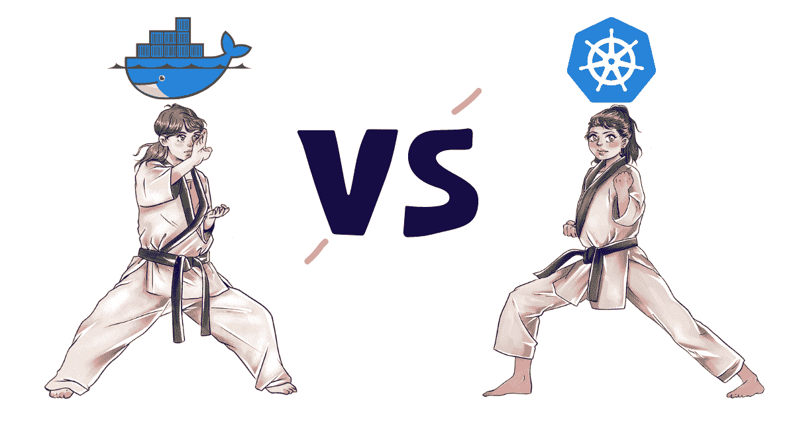

# kubernetes VS Docker Swarm–有什么区别？

> 原文：<https://www.freecodecamp.org/news/kubernetes-vs-docker-swarm-what-is-the-difference/>

现代企业正依靠容器化技术来简化复杂应用程序的部署和管理过程。

容器将必要的依赖项组装在一个包中。这样，您就不需要担心生产环境中可能出现的依赖关系相关的冲突。

容器是可移植和可扩展的，但是要扩展它们，你需要一个容器编排工具。容器编排工具为您提供了一个管理多个容器的框架。

如今， **Docker Swarm** 和 **Kubernetes** 是最流行的容器编排平台。两者都有其特定的用途，也有一定的优缺点。

在本文中，我们将探讨这两种工具，以帮助您根据自己的需求确定哪种容器编排工具是最好的。

## 什么是 Docker Swarm？

Docker Swarm 是 Docker 原生的开源容器编排平台。它支持编排 Docker 引擎集群。

Docker Swarm 将多个 Docker 实例转换成一个虚拟主机。Docker Swarm 集群通常由三项组成:

1.  节点
2.  服务和任务
3.  负载平衡器

节点是 Docker 引擎的实例，它控制您的集群，同时管理用于运行您的服务和任务的容器。

负载平衡也是 Docker Swarm 集群的一部分，它用于跨节点路由请求。

### Docker Swarm 的优势

*   Docker Swarm 安装起来非常简单，这就是为什么它非常适合那些刚刚进入容器编排世界的人。
*   它很轻。
*   在 Docker 容器中，Docker Swarm 提供自动负载平衡。
*   由于 Docker Swarm 是 Docker 自带的，它可以与 Docker CLI 配合使用。除此之外，它还可以与现有的 Docker 工具(如 Docker Compose)无缝协作。
*   Docker Swarm 提供智能节点选择，允许您在集群中挑选最佳节点进行容器部署。
*   它有自己的 Swarm API。

### 码头工人群体挑战

尽管它有许多好处，但还是有一些注意事项。

*   Docker Swarm 与 Docker API 紧密相连，与 Kubernetes 相比，这限制了它的功能。
*   Docker Swarm 中的定制选项和扩展是有限的。

## What is Kubernetes?

Kubernetes 是一个可移植的、开源的、云原生的基础设施工具，最初由 Google 设计来管理他们的集群。作为一个容器编排工具，它自动化了容器化应用程序的扩展、部署和管理。

Kubernetes 拥有比 Docker Swarm 更复杂的集群结构。

Kubernetes 是一个功能丰富的平台，主要是因为它受益于全球社区的宝贵贡献。

### Kubernetes 的优势

*   它有能力维持和管理大型复杂的工作负载。
*   它有一个由谷歌支持的大型开源社区。
*   作为开源软件，它提供了广泛的社区支持和处理各种复杂部署场景的能力。
*   它由所有主要的云提供商提供:谷歌云平台、微软 Azure、IBM Cloud 和 AWS。
*   它是自动化的，支持自动缩放。
*   它功能丰富，具有内置监控和广泛的可用集成。

### 永恒的挑战

尽管 Kubernetes 具有全面的功能集，但它也有一些缺点:

*   Kubernetes 的学习曲线很陡，需要专业知识才能掌握。
*   安装过程比较复杂，尤其是新手。
*   由于开源社区非常活跃，Kubernetes 经常需要小心修补，以保持技术更新，而不中断工作负载。
*   对于不需要频繁部署的简单 app，Kubernetes 很重。

## Kubernetes 与 Docker Swarm 的对比

现在我们已经介绍了 Kubernetes 和 Docker Swarm 的优势和挑战，让我们看看它们之间有什么不同。

平台之间的主要区别是基于复杂性。Kubernetes 非常适合复杂的应用程序。另一方面，Docker Swarm 的设计易于使用，这使得它成为简单应用程序的首选。

以下是 Docker Swarm 和 Kubernetes 之间的一些详细差异:

### 安装和设置

Kubernetes 可定制性很强，但设置起来很复杂。Docker Swarm 更容易安装和配置。

*   **Kubernetes** :根据操作系统的不同，每个操作系统的手动安装会有所不同。如果您使用云提供商的服务，则不需要安装。
*   Docker Swarm : Docker 实例在不同的操作系统中通常是一致的，因此设置起来相当简单。

### 负载平衡

Docker Swarm 提供自动负载平衡，而 Kubernetes 没有。然而，在 Kubernetes 中通过第三方工具集成负载平衡是很容易的。

*   **Kubernetes:** 服务可以通过一个 DNS 名称被发现。Kubernetes 通过 IP 地址或 HTTP 路由访问容器应用程序。
*   **Swarm:** 自带内部负载平衡器。

### 监视

*   **Kubernetes:** Kubernetes 具有内置的监控以及第三方监控工具集成支持。
*   **Docker Swarm:** 相比之下，Docker Swarm 没有内置的监控机制。不过 Docker Swarm 支持通过第三方应用进行监控。

### 可量测性

*   **Kubernetes:** 提供基于流量的扩展。水平自动缩放是内置的。Kubernetes 中的扩展包括创建新的 pods 并将它们调度到具有可用资源的节点。
*   Docker Swarm: 快速按需提供实例的自动缩放。随着 Docker Swarm 更快地部署容器，它为编排工具提供了更快的反应时间，从而实现了按需扩展。

## 你应该使用哪个平台？

Kubernetes 和 Docker Swarm 都服务于它们特定的用例。哪一种最适合您取决于您或您的组织的当前需求。

开始时，Docker Swarm 是一个易于使用的解决方案，可以大规模管理您的容器。如果您或您的公司不需要管理复杂的工作负载，那么 Docker Swarm 是正确的选择。

如果您的应用程序是关键的，并且您希望包括监控、安全特性、高可用性和灵活性，那么 Kubernetes 是正确的选择。

## 包扎

在本文中，我们了解了 Docker Swarm 和 Kubernetes。我们也探讨了它们的利弊。这两种技术之间的选择是高度主观的，并且基于期望的结果。

我希望这篇教程对你有所帮助。谢谢你一直读到最后。

你从这个教程中学到的最喜欢的东西是什么？在 [Twitter](https://twitter.com/hira_zaira) 上告诉我！

你也可以在这里阅读我的其他帖子[。](https://www.freecodecamp.org/news/author/zaira/)