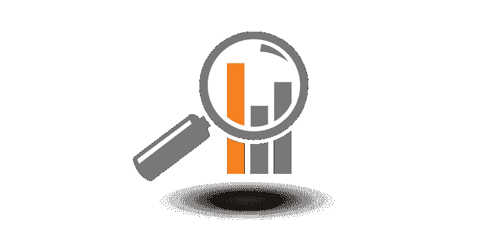

# 如何在软件团队中推动创新

> 原文：<https://www.freecodecamp.org/news/leading-innovation-in-engineering-teams-ca9890bcad7c/>

乔治·克拉萨达基斯

# **如何在工程团队中领导创新和推动变革**

As [published](https://blog.gitprime.com/leading-innovation-engineering-teams/) in ‘Perspectives in Engineering’ by [GitPrime](https://www.gitprime.com/)

**创新很难。**

为了推动创新和改变团队的工作方式，你需要文化、技术、流程和灵感的正确组合，而这需要时间。通常，这需要一个雄心勃勃的长期转型计划。

在软件业务的背景下，这个项目可能会面临额外的挑战。当工程师们高度关注技术优势时——这很好——他们经常发现自己与商业世界或其产品的最终用户脱节。

**要成为真正的创新者**，工程团队还需要捕捉“大画面”并充分理解业务的目的和商业方面。

在一个工程团队中，新颖性、创新性和成功可能意味着不同的东西，有不同的优先级。这意味着你需要调整你的创新战略、沟通方式和策略。

### **1。定义‘创新’**

在企业界，创新可以是任何为用户创造价值并具有商业成功潜力的新奇事物。

创新可以是渐进的，也可以是突破性的。它可以在任何时候发生，比如在黑客马拉松或设计冲刺等“创新号召”之后，或者在原创想法、真正的天赋和灵感的驱动下随机发生。

创新思维通常会产生关于产品或产品特性的想法和概念。在工程背景下，创新的成果也可能采取其他形式——从抽象的技术概念、专利、算法、数据模型到架构模式和功能原型。

它还可以引发流程改进。例如，加速您的整体开发生命周期和提升 DevOps KPIs 的新颖方法和工具。

#### **作为创新领导者的工程师**

在许多情况下，软件工程师在他们自己的微观世界中“默默地”创新。这可以在较低的级别(实际的设计和实现)或较高的级别(组件和系统的架构)。

但是，工程师可以在引领创新方面发挥更重要的作用。

事实上，他们在推动创新方面有很大的优势。他们对技术有着深刻的理解，并且经常对技术充满热情。这使得工程师能够轻松发现技术带来的机遇和潜在的限制。

此外，工程师们应该理解实验的原理，并按照“快速失效、自动防故障”的方法做好承担风险的准备。

无论是作为更广泛的多学科团队的一部分，还是作为一个独立的软件开发单位，熟练的工程师都可以在领导真正的创新中茁壮成长，超越宣传。现在需要的是正确的文化和方向——来自领导层的关键信号和明确的方向。

### **2。推动创新**

#### **设置正确的上下文**

工程团队的文化是特殊的。工程师们往往很少接触被过度炒作的商业术语和营销术语，创新就是其中之一。

为了改变这种看法，工程领导者需要在公司的背景下定义创新，并为团队使用正确的语言。

关于创新的讨论必须有坚实的定义、例子、程序和工具的支持。团队需要了解创新成功的故事，并理解“创新成功”在他们的特定环境中意味着什么。

例子和参考资料可以来自公共领域，或者最好来自公司最近的历史。

#### **建立正确的文化**

工程师需要将自己视为创新者、创造者和建设者。他们需要认识到，他们不只是孤立地实现一个特性、一个组件或一个过程。它们是通常推动重大财务价值或其他重要公司 KPI 的更大事物的一部分。

作为一名工程领导者，你需要鼓励团队和同事分享他们的想法和想法。但不仅仅是在他们的专业领域——实际上是在你的商业现实中的任何事情上。您需要机制来捕捉这些想法，并实现有效的发现和协作场景。

您的工程师需要感到被信任，在时间和精力方面也是如此。他们需要在何时以及如何追求自己的想法上有一定的自主权。这就是你需要一个策略和框架来确保你在生产力和“梦想”之间保持正确平衡的地方。

拥有生产力基线以及创新活动的衡量标准可以帮助您监控、理解和指导创新工作。

根据团队当前的工作量和速度，您可以在生产力和创新之间设置适当的平衡。例如，降低与创新相关的工作/想法的优先级，或者减少构思会议的频率。

技术可以在这方面提供很大的支持。智能构思平台可以轻松捕捉并自动处理想法、想法、问题陈述，甚至通过相关性和智能优先级将此[创新流](https://medium.com/innovation-machine/a-stream-of-ideas-the-foundation-of-an-innovation-machine-2ebcfe4e0653)连接到您的产品积压。

#### **投资技术**

现代团队需要[一个永远在线的构思和协作渠道](https://medium.com/innovation-machine/principles-of-a-great-ideation-channel-539cf91dbbf2)——这也可以与你的工程流程联系起来。

想象一下，如果你的产品的待办事项条目与进来的想法无缝匹配。或者，如果想法是根据待办事项相关度自动评分的，或者有一个智能的过程来分组和总结所有已知的问题、错误、性能限制、系统约束、负面用户反馈等。定义明确、按优先顺序排列的“待解决的问题”。

来自团队内部或整个组织的创新者可以发现与他们相关的内容，并对潜在的改进和修复提出新的想法，或解决所述问题的创新方法。

#### **实现快速原型制作和实验**

失败是整个创新过程的一部分——只要它又快又安全，它就会通过洞察力和发现提供重要的学习机会。

遵循“快速原型制作”和“快速失败”等实践，想法可以在真实用户中快速测试，以尽可能早地以最低的成本支持明智的决策。

[快速原型制作](https://uxdesign.cc/is-it-a-prototype-or-an-mvp-well-its-a-proof-of-concept-f8df5bb8940a)也是一个关键原则:与工程师需要遵循特定流程、编码原则和协议的“生产模式”不同，“快速模式”允许工程师使用捷径、做出假设、必要时进行硬编码，并使用人工数据快速构建一个想法的功能实例。这种快速模式侧重于构建原型，可以向选定的用户公开，并获取对开发过程中可能的后续步骤的反馈。

“快速原型制作”不仅需要为开发人员提供“不同的操作模式”，还需要正确的技术准备。您需要维护可重复使用的组件、API、UI 元素、标准化数据集和其他资产，以便能够快速组装现实的功能原型，而不会浪费精力在与核心理念不直接相关的功能上，即需要测试或验证的功能上。

### 3.衡量创新

量化创新是困难的。衡量创新活动更容易。你需要引入一个框架来捕捉与创新相关的事件——这可能是构思、对创意的贡献、原型制作、专利申请等。拥有丰富、可靠的此类活动历史是确定相关基线和参考点的基础。然后，创新活动指标可以与某些 KPI 相关联，并根据产品和财务绩效进行分析。

对你的团队和整个公司的整体创新绩效进行定性评估也非常有用。作为一组额外的创新指标，领域专家可以根据相应的技术水平来评估特定可交付成果或产品发布中的创新的新颖性和水平

所有上述内容都可以联系在一起，并在一个可靠的[创新绩效](https://medium.com/innovation-machine/how-to-setup-an-innovation-team-d0d3ea377390)仪表板中呈现，以用于管理目的和实现与创新绩效相关的一般意识。

*作为[发表](https://www.pluralsight.com/blog)于[git prime](https://www.pluralsight.com/product/flow)T5【工程透视】*