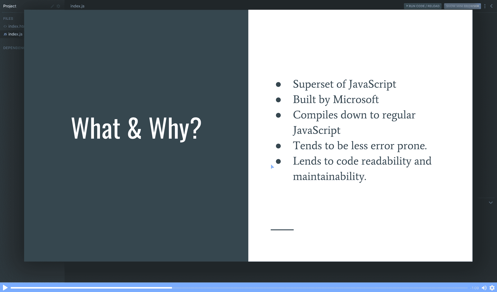

# 5 分钟学会 TypeScript 初学者教程

> 原文：<https://www.freecodecamp.org/news/learn-typescript-in-5-minutes-13eda868daeb/>



[Click here to check out the free Scrimba course on TypeScript](https://scrimba.com/p/gintrototypescript?utm_source=freecodecamp.org&utm_medium=referral&utm_campaign=gintrototypescript_5_minute_article)

TypeScript 是 JavaScript 的类型化超集，旨在使该语言更具可伸缩性和可靠性。

它是开源的，自 2012 年创建以来一直由微软维护。然而，TypeScript 在 Angular 2 中作为核心编程语言获得了最初的突破。从那以后，React 和 Vue 社区也在持续增长。

在本教程中，您将借助实际例子学习 TypeScript 的基础知识。

我们还将在 Scrimba 上推出 22 节免费打字课程。 [**如果您想提前访问，请在此留下您的电子邮件！**](http://eepurl.com/dyqJAj)

让我们开始吧。

### 安装 TypeScript

在开始编码之前，我们需要在计算机上安装 TypeScript。为此，我们将使用`npm`,因此只需打开终端并键入以下命令:

```
npm install -g typescript 
```

一旦安装完毕，我们可以通过运行命令`tsc -v`来验证它，该命令将显示所安装的 TypeScript 的版本。

### 写一些代码

让我们创建第一个 TypeScript 文件，并在其中编写一些代码。打开你最喜欢的 IDE 或文本编辑器，创建一个名为`first.ts`的文件——对于类型脚本文件，我们使用扩展名`.ts`

现在，我们只编写几行普通的旧 JavaScript 代码，因为所有的 JavaScript 代码都是有效的类型脚本代码:

```
let a = 5;  
let b = 5;  
let c = a + b;

console.log(c); 
```

下一步是将我们的类型脚本编译成普通的 JavaScript，因为浏览器希望`.js`文件可读。

### 编译类型脚本

为了进行编译，我们将运行命令`tsc filename.ts`，它创建一个具有相同文件名但不同扩展名的 JavaScript 文件，我们最终可以将该文件传递给我们的浏览器。

因此，在文件所在的位置打开终端并运行以下命令:

```
tsc first.ts 
```

**提示**:如果你想编译任意文件夹中的所有打字稿文件，使用命令:`tsc *.ts`

### 数据类型

TypeScript——顾名思义——是 JavaScript 的类型化版本。这意味着我们可以在声明的时候为不同的变量指定类型。它们将始终在该范围内保存相同类型的数据。

键入是一个非常有用的特性，可以确保可靠性和可伸缩性。类型检查有助于确保我们的代码按预期工作。此外，它有助于找出 bug 和错误，并正确记录我们的代码。

将类型赋给任何变量的语法是在变量名后加上一个`:`符号，然后在类型名后加上一个`=`符号和变量值。

TypeScript 中有三种不同的类型:`any`类型、`Built-in`类型和`User-defined`类型。让我们逐一看看。

#### 任何类型

`any`数据类型是 TypeScript 中所有数据类型的超集。给任何变量赋予类型`any`等同于选择不进行变量的类型检查。

```
let myVariable: any = 'This is a string' 
```

#### 内置类型

这些是内置在 TypeScript 中的类型。它们包括`number`、`string`、`boolean`、`void`、`null`和`undefined`。

```
let num: number = 5;  
let name: string = 'Alex';  
let isPresent: boolean = true; 
```

#### 用户定义的类型

`User-defined`类型包括`enum`、`class`、`interface`、`array`和`tuple`。我们将在本文的后面讨论其中的一些。

### 面向对象编程

TypeScript 支持面向对象编程的所有功能，如类和接口。这个功能对 JavaScript 是一个巨大的推动——它一直在与它的 OOP 功能作斗争，特别是自从开发者开始将它用于大规模应用程序以来。

#### 班级

在面向对象编程中，类是对象的模板。一个类定义了一个对象的特性和功能。类还封装了对象的数据。

TypeScript 内置了对类的支持，这是 ES5 和早期版本所不支持的。这意味着我们可以使用`class`关键字轻松地声明一个。

```
class Car {

// fields  
  model: String;  
  doors: Number;  
  isElectric: Boolean;

constructor(model: String, doors: Number, isElectric: Boolean) {  
    this.model = model;  
    this.doors = doors;  
    this.isElectric = isElectric;  
  }

displayMake(): void {  
    console.log(`This car is ${this.model}`);  
  }

} 
```

在上面的例子中，我们声明了一个`Car`类，以及它的一些属性，我们在`constructor`中初始化了这些属性。我们还有一个方法，可以使用它的属性显示一些消息。

让我们看看如何创建这个类的新实例:

```
const Prius = new Car('Prius', 4, true);  
Prius.displayMake(); // This car is Prius 
```

为了创建一个类的对象，我们使用关键字`new`并调用该类的构造函数，并向其传递属性。现在这个对象`Prius`有了自己的属性`model`、`doors`和`isElectric`。该对象还可以调用`displayMake`的方法，该方法可以访问`Prius`的属性。

#### 连接

接口的概念是 TypeScript 的另一个强大特性，它允许您定义变量的结构。接口就像一个对象应该遵守的语法契约。

通过一个实际的例子来最好地描述接口。所以，假设我们有一个对象`Car`:

```
const Car = {  
  model: 'Prius',  
  make: 'Toyota',  
  display() => { console.log('hi'); }  
} 
```

如果我们观察上面的对象并尝试提取它的签名，它将是:

```
{  
  model: String,  
  make: String,  
  display(): void  
} 
```

如果我们想重用这个签名，我们可以用接口的形式来声明它。为了创建一个接口，我们使用关键字`interface`。

```
interface ICar {  
  model: String,  
  make: String,  
  display(): void  
}

const Car: ICar = {  
  model: 'Prius',  
  make: 'Toyota',  
  display() => { console.log('hi'); }  
} 
```

这里，我们声明了一个名为`ICar`的接口，并创建了一个对象`Car`。`Car`现在绑定到了`ICar`接口，确保了`Car`对象定义了接口中的所有属性。

### 结论

因此，我希望这能让您快速了解 TypeScript 如何使您的 JavaScript 更稳定，更不容易出现错误。

TypeScript 在 web 开发领域获得了很大的发展势头。也有越来越多的 React 开发人员正在采用它。TypeScript 绝对是 2018 年任何一个前端开发者都应该意识到的。

快乐编码:)

* * *

感谢阅读！我的名字叫 Per Borgen，我是最简单的学习编码方法——Scrimba 的联合创始人。如果你想学习建立专业水平的现代网站，你应该看看我们的[响应式网页设计训练营](https://scrimba.com/g/gresponsive?utm_source=freecodecamp.org&utm_medium=referral&utm_campaign=gintrototypescript_5_minute_article)。


[Click here to get to the advanced bootcamp.](https://scrimba.com/g/gresponsive?utm_source=freecodecamp.org&utm_medium=referral&utm_campaign=gintrototypescript_5_minute_article)